# Opinion Poll by Market for Der Standard, 8–10 June 2021

<a href="#voting-intentions">Voting Intentions</a> | <a href="#seats">Seats</a> | <a href="#coalitions">Coalitions</a> | <a href="#technical-information">Technical Information</a>

## Voting Intentions

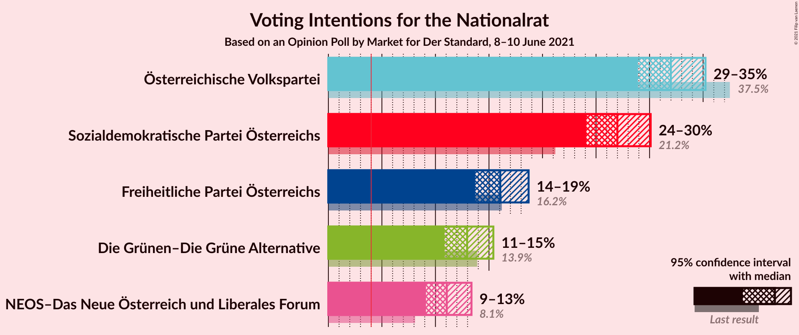

### Confidence Intervals

| Party | Last Result | Poll Result | 80% Confidence Interval | 90% Confidence Interval | 95% Confidence Interval | 99% Confidence Interval |
|:-----:|:-----------:|:-----------:|:-----------------------:|:-----------------------:|:-----------------------:|:-----------------------:|
| Österreichische Volkspartei | 37.5% | 32.0% | 30.0–34.1% |29.4–34.7% |28.9–35.2% |28.0–36.2% |
| Sozialdemokratische Partei Österreichs | 21.2% | 27.0% | 25.1–29.0% |24.6–29.6% |24.1–30.1% |23.2–31.1% |
| Freiheitliche Partei Österreichs | 16.2% | 16.1% | 14.5–17.8% |14.1–18.3% |13.7–18.7% |13.0–19.6% |
| Die Grünen–Die Grüne Alternative | 13.9% | 13.0% | 11.6–14.6% |11.2–15.0% |10.9–15.4% |10.2–16.2% |
| NEOS–Das Neue Österreich und Liberales Forum | 8.1% | 11.1% | 9.8–12.6% |9.4–13.0% |9.1–13.4% |8.5–14.1% |

*Note:* The poll result column reflects the actual value used in the calculations. Published results may vary slightly, and in addition be rounded to fewer digits.

## Seats

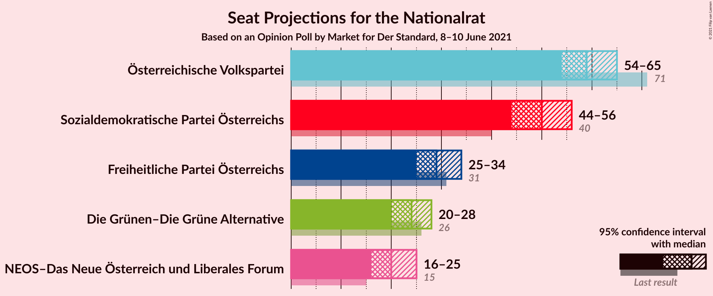

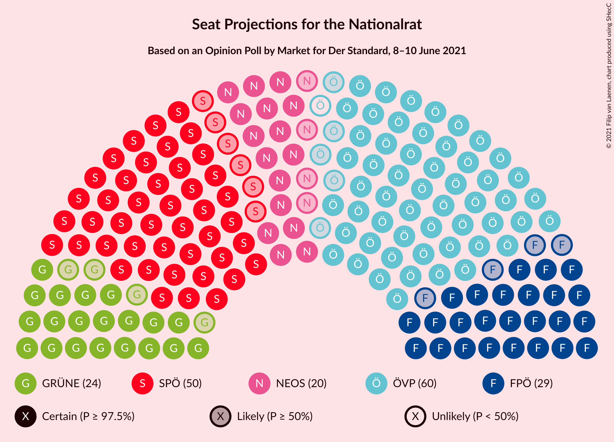

### Confidence Intervals

| Party | Last Result | Median | 80% Confidence Interval | 90% Confidence Interval | 95% Confidence Interval | 99% Confidence Interval |
|:-----:|:-----------:|:------:|:-----------------------:|:-----------------------:|:-----------------------:|:-----------------------:|
| <a href="#österreichische-volkspartei">Österreichische Volkspartei</a> | 71 | 59 | 55–63 |54–64 |54–65 |52–67 |
| <a href="#sozialdemokratische-partei-österreichs">Sozialdemokratische Partei Österreichs</a> | 40 | 50 | 46–54 |45–55 |44–56 |43–57 |
| <a href="#freiheitliche-partei-österreichs">Freiheitliche Partei Österreichs</a> | 31 | 29 | 27–33 |26–34 |25–34 |24–36 |
| <a href="#die-grünen–die-grüne-alternative">Die Grünen–Die Grüne Alternative</a> | 26 | 24 | 21–27 |20–28 |20–28 |19–30 |
| <a href="#neos–das-neue-österreich-und-liberales-forum">NEOS–Das Neue Österreich und Liberales Forum</a> | 15 | 20 | 18–23 |17–24 |16–25 |15–26 |

### Österreichische Volkspartei

*For a full overview of the results for this party, see the [Österreichische Volkspartei](party-österreichischevolkspartei.html) page.*

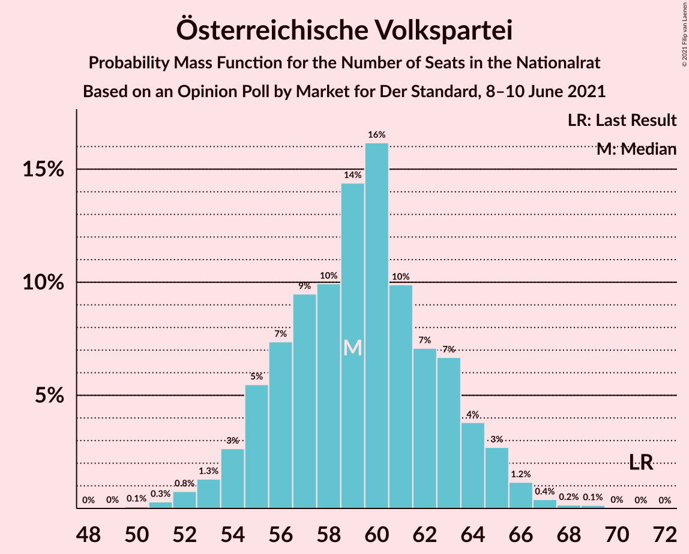

| Number of Seats | Probability | Accumulated | Special Marks |
|:---------------:|:-----------:|:-----------:|:-------------:|
| 50 | 0.1% | 100% |  |
| 51 | 0.3% | 99.9% |  |
| 52 | 0.8% | 99.6% |  |
| 53 | 1.3% | 98.8% |  |
| 54 | 3% | 98% |  |
| 55 | 5% | 95% |  |
| 56 | 7% | 89% |  |
| 57 | 9% | 82% |  |
| 58 | 10% | 73% |  |
| 59 | 14% | 63% | Median |
| 60 | 16% | 48% |  |
| 61 | 10% | 32% |  |
| 62 | 7% | 22% |  |
| 63 | 7% | 15% |  |
| 64 | 4% | 8% |  |
| 65 | 3% | 5% |  |
| 66 | 1.2% | 2% |  |
| 67 | 0.4% | 0.7% |  |
| 68 | 0.2% | 0.3% |  |
| 69 | 0.1% | 0.2% |  |
| 70 | 0% | 0% |  |
| 71 | 0% | 0% | Last Result |

### Sozialdemokratische Partei Österreichs

*For a full overview of the results for this party, see the [Sozialdemokratische Partei Österreichs](party-sozialdemokratischeparteiösterreichs.html) page.*

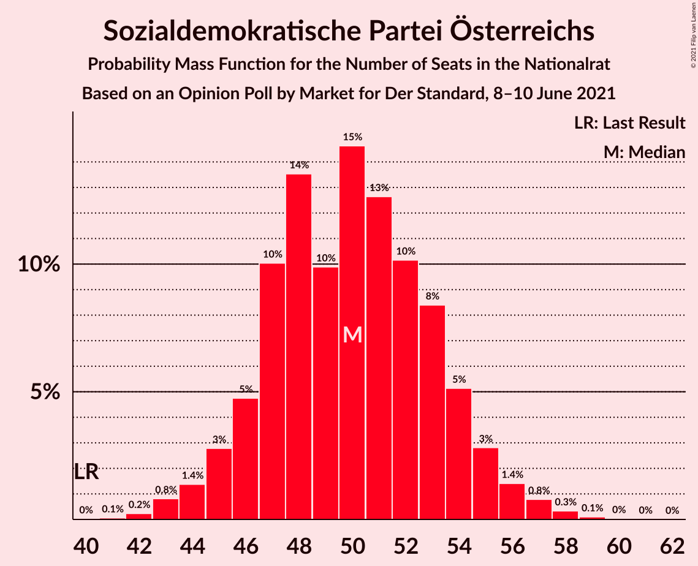

| Number of Seats | Probability | Accumulated | Special Marks |
|:---------------:|:-----------:|:-----------:|:-------------:|
| 40 | 0% | 100% | Last Result |
| 41 | 0.1% | 100% |  |
| 42 | 0.2% | 99.9% |  |
| 43 | 0.8% | 99.7% |  |
| 44 | 1.4% | 98.9% |  |
| 45 | 3% | 97% |  |
| 46 | 5% | 95% |  |
| 47 | 10% | 90% |  |
| 48 | 14% | 80% |  |
| 49 | 10% | 66% |  |
| 50 | 15% | 56% | Median |
| 51 | 13% | 42% |  |
| 52 | 10% | 29% |  |
| 53 | 8% | 19% |  |
| 54 | 5% | 11% |  |
| 55 | 3% | 6% |  |
| 56 | 1.4% | 3% |  |
| 57 | 0.8% | 1.3% |  |
| 58 | 0.3% | 0.5% |  |
| 59 | 0.1% | 0.2% |  |
| 60 | 0% | 0.1% |  |
| 61 | 0% | 0% |  |

### Freiheitliche Partei Österreichs

*For a full overview of the results for this party, see the [Freiheitliche Partei Österreichs](party-freiheitlicheparteiösterreichs.html) page.*

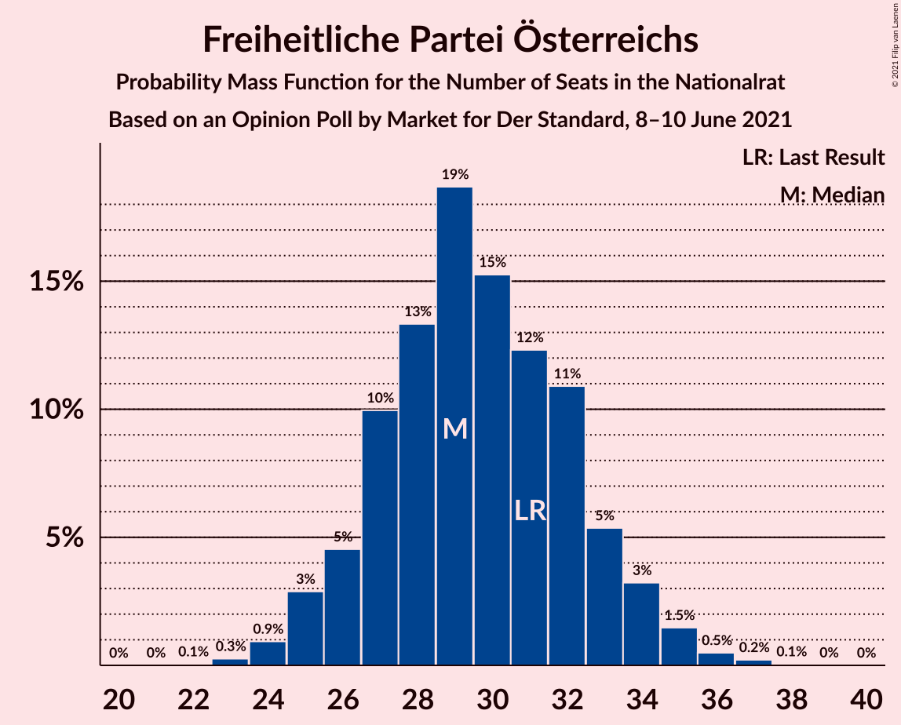

| Number of Seats | Probability | Accumulated | Special Marks |
|:---------------:|:-----------:|:-----------:|:-------------:|
| 22 | 0.1% | 100% |  |
| 23 | 0.3% | 99.9% |  |
| 24 | 0.9% | 99.7% |  |
| 25 | 3% | 98.7% |  |
| 26 | 5% | 96% |  |
| 27 | 10% | 91% |  |
| 28 | 13% | 81% |  |
| 29 | 19% | 68% | Median |
| 30 | 15% | 49% |  |
| 31 | 12% | 34% | Last Result |
| 32 | 11% | 22% |  |
| 33 | 5% | 11% |  |
| 34 | 3% | 5% |  |
| 35 | 1.5% | 2% |  |
| 36 | 0.5% | 0.8% |  |
| 37 | 0.2% | 0.3% |  |
| 38 | 0.1% | 0.1% |  |
| 39 | 0% | 0% |  |

### Die Grünen–Die Grüne Alternative

*For a full overview of the results for this party, see the [Die Grünen–Die Grüne Alternative](party-diegrünen–diegrünealternative.html) page.*

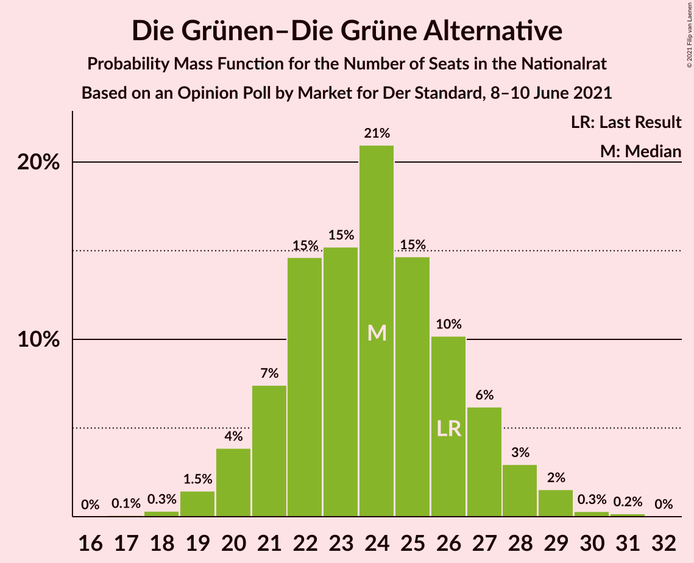

| Number of Seats | Probability | Accumulated | Special Marks |
|:---------------:|:-----------:|:-----------:|:-------------:|
| 17 | 0.1% | 100% |  |
| 18 | 0.3% | 99.9% |  |
| 19 | 1.5% | 99.6% |  |
| 20 | 4% | 98% |  |
| 21 | 7% | 94% |  |
| 22 | 15% | 87% |  |
| 23 | 15% | 72% |  |
| 24 | 21% | 57% | Median |
| 25 | 15% | 36% |  |
| 26 | 10% | 21% | Last Result |
| 27 | 6% | 11% |  |
| 28 | 3% | 5% |  |
| 29 | 2% | 2% |  |
| 30 | 0.3% | 0.5% |  |
| 31 | 0.2% | 0.2% |  |
| 32 | 0% | 0% |  |

### NEOS–Das Neue Österreich und Liberales Forum

*For a full overview of the results for this party, see the [NEOS–Das Neue Österreich und Liberales Forum](party-neos–dasneueösterreichundliberalesforum.html) page.*

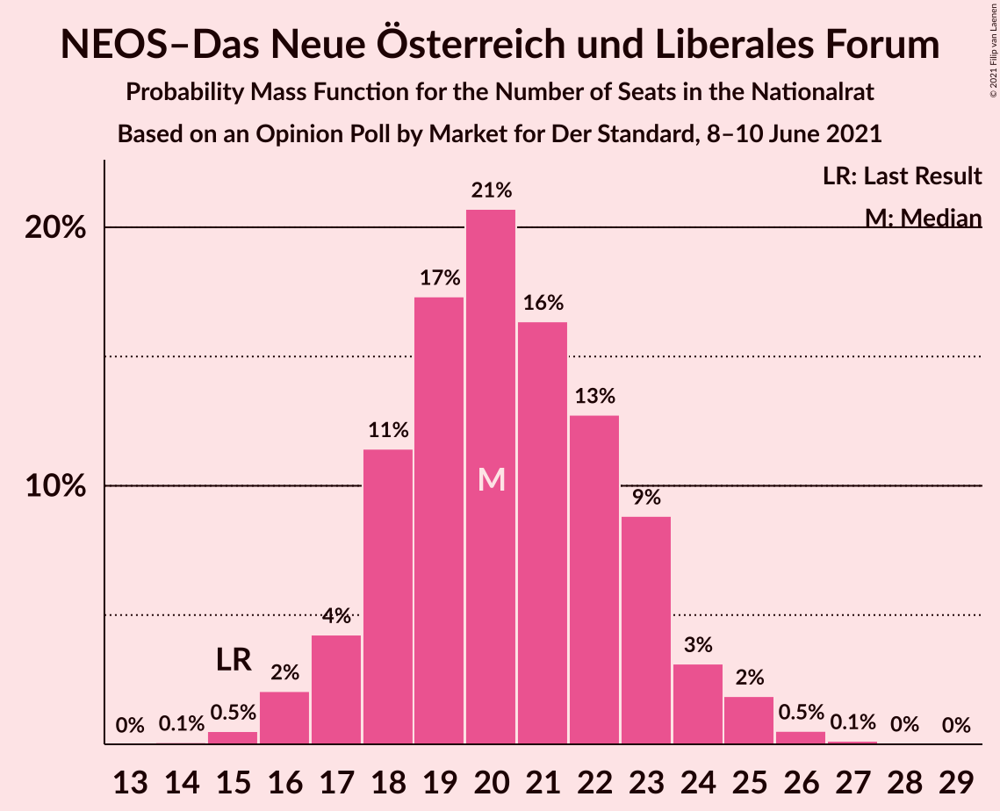

| Number of Seats | Probability | Accumulated | Special Marks |
|:---------------:|:-----------:|:-----------:|:-------------:|
| 14 | 0.1% | 100% |  |
| 15 | 0.5% | 99.9% | Last Result |
| 16 | 2% | 99.4% |  |
| 17 | 4% | 97% |  |
| 18 | 11% | 93% |  |
| 19 | 17% | 82% |  |
| 20 | 21% | 64% | Median |
| 21 | 16% | 44% |  |
| 22 | 13% | 27% |  |
| 23 | 9% | 15% |  |
| 24 | 3% | 6% |  |
| 25 | 2% | 3% |  |
| 26 | 0.5% | 0.7% |  |
| 27 | 0.1% | 0.2% |  |
| 28 | 0% | 0.1% |  |
| 29 | 0% | 0% |  |

## Coalitions

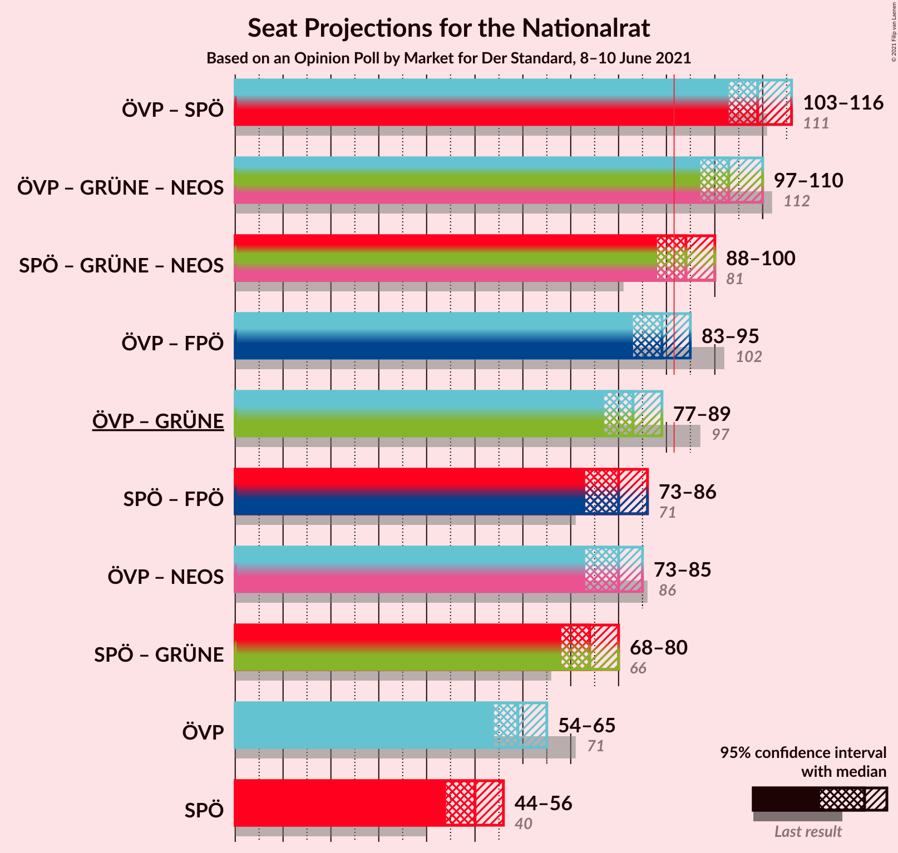

### Confidence Intervals

| Coalition | Last Result | Median | Majority? | 80% Confidence Interval | 90% Confidence Interval | 95% Confidence Interval | 99% Confidence Interval |
|:---------:|:-----------:|:------:|:---------:|:-----------------------:|:-----------------------:|:-----------------------:|:-----------------------:|
| Österreichische Volkspartei – Sozialdemokratische Partei Österreichs | 111 | 109 | 100% | 106–112 | 103–115 | 103–116 | 102–117 |
| Österreichische Volkspartei – Die Grünen–Die Grüne Alternative – NEOS–Das Neue Österreich und Liberales Forum | 112 | 103 | 100% | 99–107 | 98–109 | 97–110 | 95–111 |
| Sozialdemokratische Partei Österreichs – Die Grünen–Die Grüne Alternative – NEOS–Das Neue Österreich und Liberales Forum | 81 | 94 | 78% | 90–98 | 89–99 | 88–100 | 86–102 |
| Österreichische Volkspartei – Freiheitliche Partei Österreichs | 102 | 89 | 22% | 85–93 | 84–94 | 83–95 | 81–97 |
| Österreichische Volkspartei – Die Grünen–Die Grüne Alternative | 97 | 83 | 0.4% | 79–87 | 78–89 | 77–89 | 75–91 |
| Sozialdemokratische Partei Österreichs – Freiheitliche Partei Österreichs | 71 | 80 | 0% | 76–84 | 74–85 | 73–86 | 72–88 |
| Österreichische Volkspartei – NEOS–Das Neue Österreich und Liberales Forum | 86 | 80 | 0% | 76–84 | 75–84 | 73–85 | 71–88 |
| Sozialdemokratische Partei Österreichs – Die Grünen–Die Grüne Alternative | 66 | 74 | 0% | 70–78 | 69–79 | 68–80 | 66–82 |
| Österreichische Volkspartei | 71 | 59 | 0% | 55–63 | 54–64 | 54–65 | 52–67 |
| Sozialdemokratische Partei Österreichs | 40 | 50 | 0% | 46–54 | 45–55 | 44–56 | 43–57 |

### Österreichische Volkspartei – Sozialdemokratische Partei Österreichs

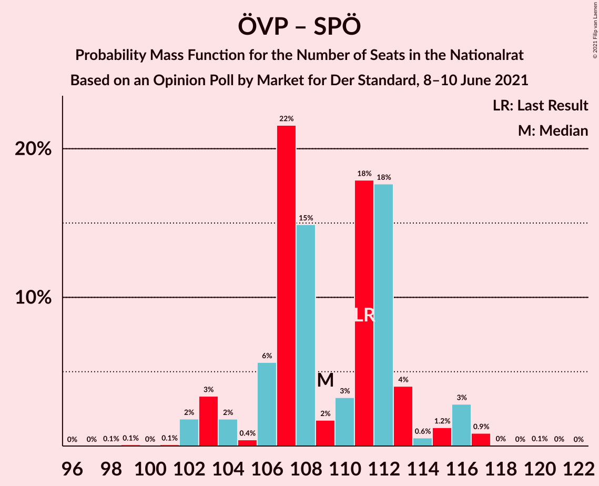

| Number of Seats | Probability | Accumulated | Special Marks |
|:---------------:|:-----------:|:-----------:|:-------------:|
| 98 | 0.1% | 100% |  |
| 99 | 0.1% | 99.9% |  |
| 100 | 0% | 99.8% |  |
| 101 | 0.1% | 99.8% |  |
| 102 | 2% | 99.7% |  |
| 103 | 3% | 98% |  |
| 104 | 2% | 95% |  |
| 105 | 0.4% | 93% |  |
| 106 | 6% | 92% |  |
| 107 | 22% | 87% |  |
| 108 | 15% | 65% |  |
| 109 | 2% | 50% | Median |
| 110 | 3% | 48% |  |
| 111 | 18% | 45% | Last Result |
| 112 | 18% | 27% |  |
| 113 | 4% | 10% |  |
| 114 | 0.6% | 6% |  |
| 115 | 1.2% | 5% |  |
| 116 | 3% | 4% |  |
| 117 | 0.9% | 1.0% |  |
| 118 | 0% | 0.1% |  |
| 119 | 0% | 0.1% |  |
| 120 | 0.1% | 0.1% |  |
| 121 | 0% | 0% |  |

### Österreichische Volkspartei – Die Grünen–Die Grüne Alternative – NEOS–Das Neue Österreich und Liberales Forum

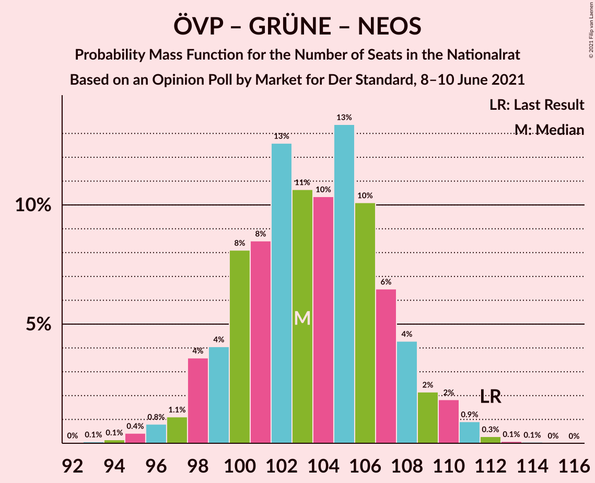

| Number of Seats | Probability | Accumulated | Special Marks |
|:---------------:|:-----------:|:-----------:|:-------------:|
| 93 | 0.1% | 100% |  |
| 94 | 0.1% | 99.9% |  |
| 95 | 0.4% | 99.8% |  |
| 96 | 0.8% | 99.3% |  |
| 97 | 1.1% | 98.5% |  |
| 98 | 4% | 97% |  |
| 99 | 4% | 94% |  |
| 100 | 8% | 90% |  |
| 101 | 8% | 82% |  |
| 102 | 13% | 73% |  |
| 103 | 11% | 61% | Median |
| 104 | 10% | 50% |  |
| 105 | 13% | 40% |  |
| 106 | 10% | 26% |  |
| 107 | 6% | 16% |  |
| 108 | 4% | 10% |  |
| 109 | 2% | 5% |  |
| 110 | 2% | 3% |  |
| 111 | 0.9% | 1.4% |  |
| 112 | 0.3% | 0.4% | Last Result |
| 113 | 0.1% | 0.2% |  |
| 114 | 0.1% | 0.1% |  |
| 115 | 0% | 0% |  |

### Sozialdemokratische Partei Österreichs – Die Grünen–Die Grüne Alternative – NEOS–Das Neue Österreich und Liberales Forum

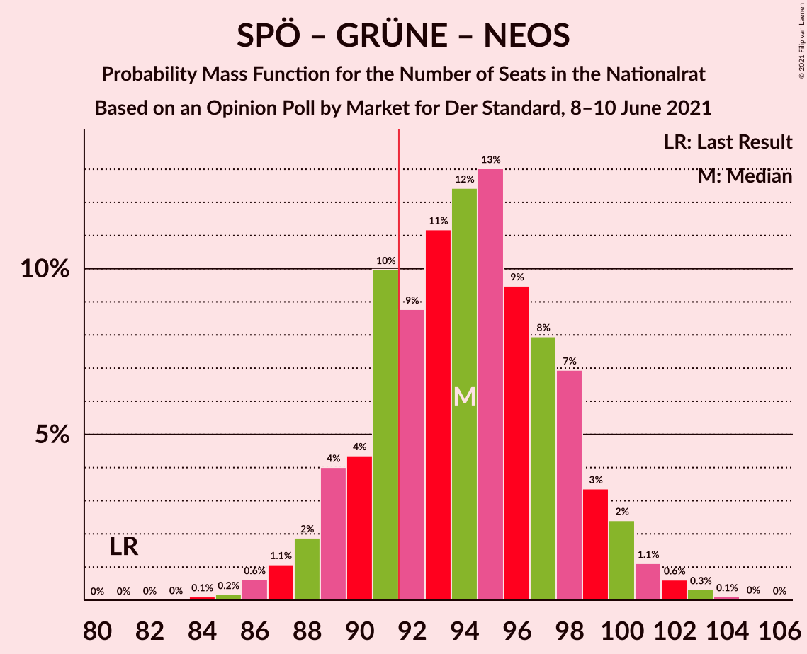

| Number of Seats | Probability | Accumulated | Special Marks |
|:---------------:|:-----------:|:-----------:|:-------------:|
| 81 | 0% | 100% | Last Result |
| 82 | 0% | 100% |  |
| 83 | 0% | 100% |  |
| 84 | 0.1% | 100% |  |
| 85 | 0.2% | 99.9% |  |
| 86 | 0.6% | 99.7% |  |
| 87 | 1.1% | 99.1% |  |
| 88 | 2% | 98% |  |
| 89 | 4% | 96% |  |
| 90 | 4% | 92% |  |
| 91 | 10% | 88% |  |
| 92 | 9% | 78% | Majority |
| 93 | 11% | 69% |  |
| 94 | 12% | 58% | Median |
| 95 | 13% | 45% |  |
| 96 | 9% | 32% |  |
| 97 | 8% | 23% |  |
| 98 | 7% | 15% |  |
| 99 | 3% | 8% |  |
| 100 | 2% | 5% |  |
| 101 | 1.1% | 2% |  |
| 102 | 0.6% | 1.1% |  |
| 103 | 0.3% | 0.5% |  |
| 104 | 0.1% | 0.2% |  |
| 105 | 0% | 0.1% |  |
| 106 | 0% | 0% |  |

### Österreichische Volkspartei – Freiheitliche Partei Österreichs

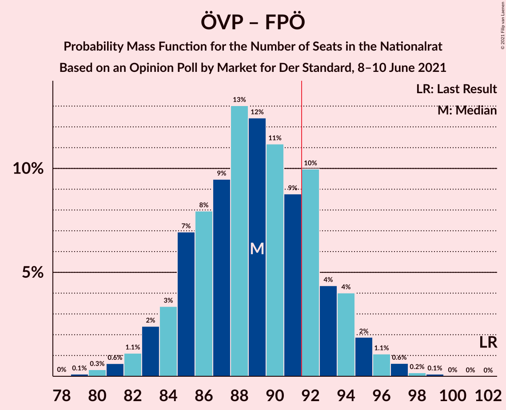

| Number of Seats | Probability | Accumulated | Special Marks |
|:---------------:|:-----------:|:-----------:|:-------------:|
| 78 | 0% | 100% |  |
| 79 | 0.1% | 99.9% |  |
| 80 | 0.3% | 99.8% |  |
| 81 | 0.6% | 99.5% |  |
| 82 | 1.1% | 98.9% |  |
| 83 | 2% | 98% |  |
| 84 | 3% | 95% |  |
| 85 | 7% | 92% |  |
| 86 | 8% | 85% |  |
| 87 | 9% | 77% |  |
| 88 | 13% | 68% | Median |
| 89 | 12% | 55% |  |
| 90 | 11% | 42% |  |
| 91 | 9% | 31% |  |
| 92 | 10% | 22% | Majority |
| 93 | 4% | 12% |  |
| 94 | 4% | 8% |  |
| 95 | 2% | 4% |  |
| 96 | 1.1% | 2% |  |
| 97 | 0.6% | 0.9% |  |
| 98 | 0.2% | 0.3% |  |
| 99 | 0.1% | 0.1% |  |
| 100 | 0% | 0% |  |
| 101 | 0% | 0% |  |
| 102 | 0% | 0% | Last Result |

### Österreichische Volkspartei – Die Grünen–Die Grüne Alternative

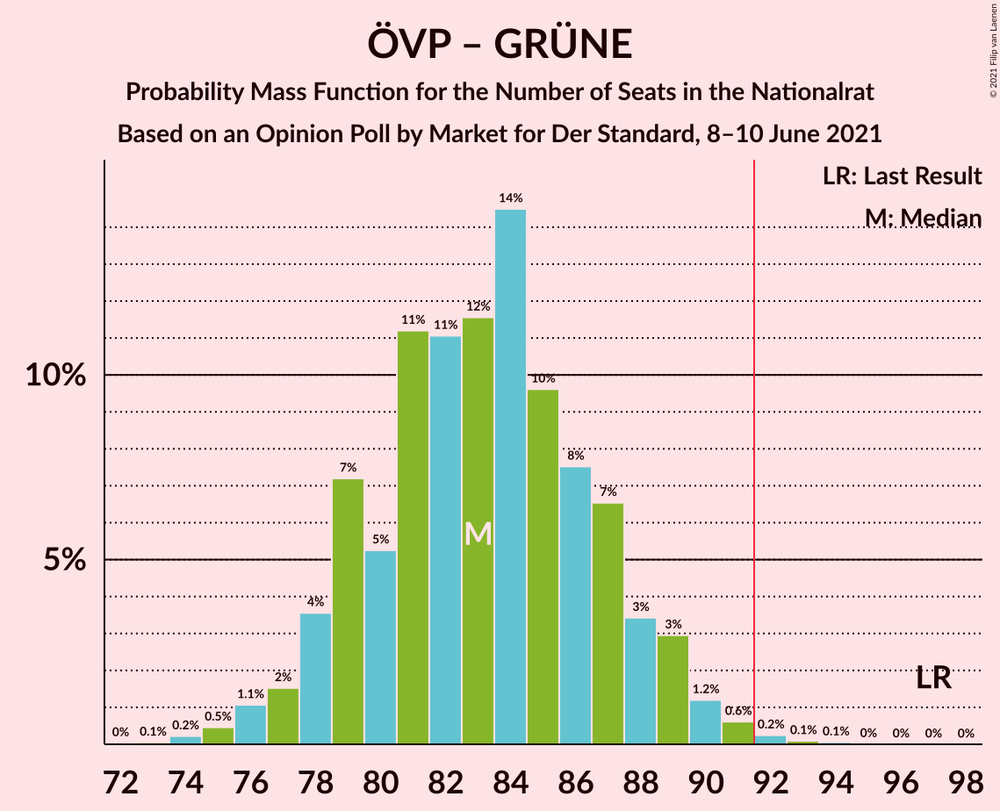

| Number of Seats | Probability | Accumulated | Special Marks |
|:---------------:|:-----------:|:-----------:|:-------------:|
| 73 | 0.1% | 100% |  |
| 74 | 0.2% | 99.9% |  |
| 75 | 0.5% | 99.7% |  |
| 76 | 1.1% | 99.2% |  |
| 77 | 2% | 98% |  |
| 78 | 4% | 97% |  |
| 79 | 7% | 93% |  |
| 80 | 5% | 86% |  |
| 81 | 11% | 81% |  |
| 82 | 11% | 69% |  |
| 83 | 12% | 58% | Median |
| 84 | 14% | 47% |  |
| 85 | 10% | 32% |  |
| 86 | 8% | 23% |  |
| 87 | 7% | 15% |  |
| 88 | 3% | 9% |  |
| 89 | 3% | 5% |  |
| 90 | 1.2% | 2% |  |
| 91 | 0.6% | 1.0% |  |
| 92 | 0.2% | 0.4% | Majority |
| 93 | 0.1% | 0.2% |  |
| 94 | 0.1% | 0.1% |  |
| 95 | 0% | 0% |  |
| 96 | 0% | 0% |  |
| 97 | 0% | 0% | Last Result |

### Sozialdemokratische Partei Österreichs – Freiheitliche Partei Österreichs

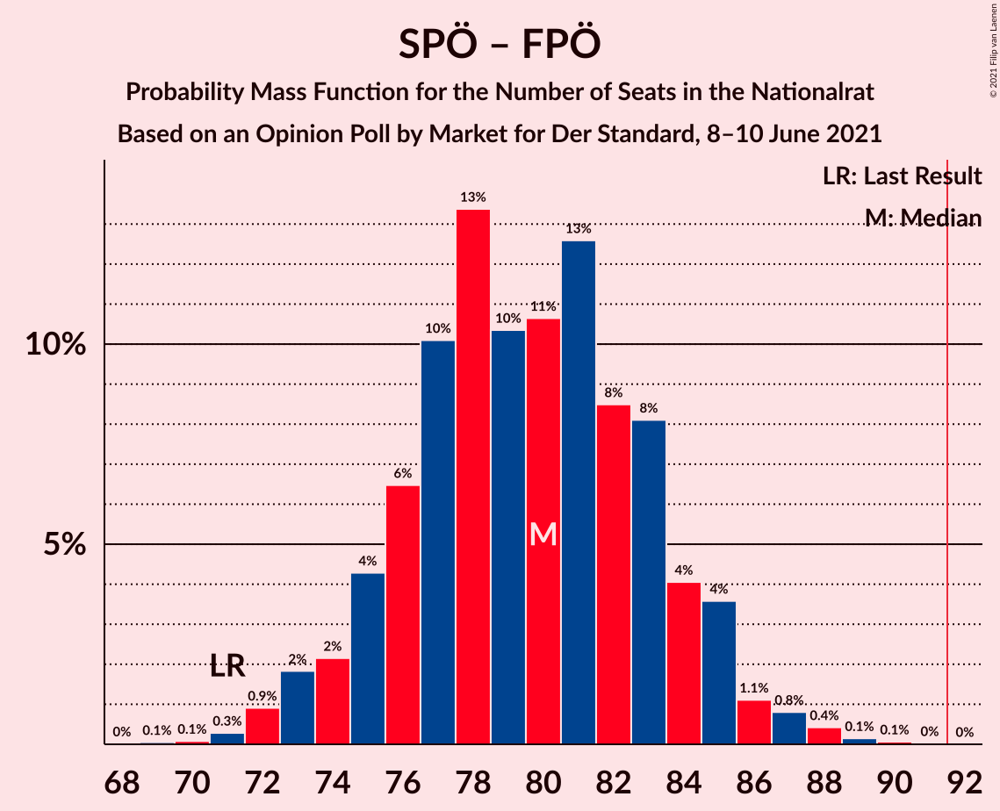

| Number of Seats | Probability | Accumulated | Special Marks |
|:---------------:|:-----------:|:-----------:|:-------------:|
| 69 | 0.1% | 100% |  |
| 70 | 0.1% | 99.9% |  |
| 71 | 0.3% | 99.8% | Last Result |
| 72 | 0.9% | 99.6% |  |
| 73 | 2% | 98.6% |  |
| 74 | 2% | 97% |  |
| 75 | 4% | 95% |  |
| 76 | 6% | 90% |  |
| 77 | 10% | 84% |  |
| 78 | 13% | 74% |  |
| 79 | 10% | 60% | Median |
| 80 | 11% | 50% |  |
| 81 | 13% | 39% |  |
| 82 | 8% | 27% |  |
| 83 | 8% | 18% |  |
| 84 | 4% | 10% |  |
| 85 | 4% | 6% |  |
| 86 | 1.1% | 3% |  |
| 87 | 0.8% | 1.5% |  |
| 88 | 0.4% | 0.7% |  |
| 89 | 0.1% | 0.2% |  |
| 90 | 0.1% | 0.1% |  |
| 91 | 0% | 0% |  |

### Österreichische Volkspartei – NEOS–Das Neue Österreich und Liberales Forum

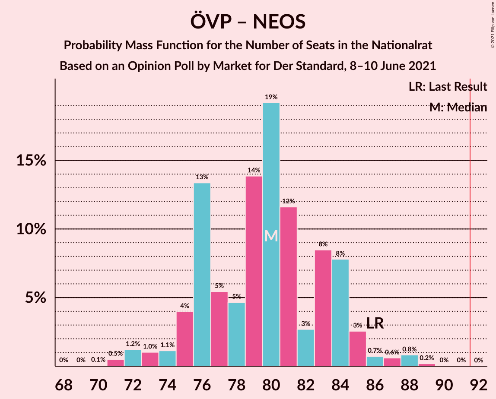

| Number of Seats | Probability | Accumulated | Special Marks |
|:---------------:|:-----------:|:-----------:|:-------------:|
| 69 | 0% | 100% |  |
| 70 | 0.1% | 99.9% |  |
| 71 | 0.5% | 99.9% |  |
| 72 | 1.2% | 99.4% |  |
| 73 | 1.0% | 98% |  |
| 74 | 1.1% | 97% |  |
| 75 | 4% | 96% |  |
| 76 | 13% | 92% |  |
| 77 | 5% | 79% |  |
| 78 | 5% | 73% |  |
| 79 | 14% | 69% | Median |
| 80 | 19% | 55% |  |
| 81 | 12% | 36% |  |
| 82 | 3% | 24% |  |
| 83 | 8% | 21% |  |
| 84 | 8% | 13% |  |
| 85 | 3% | 5% |  |
| 86 | 0.7% | 2% | Last Result |
| 87 | 0.6% | 2% |  |
| 88 | 0.8% | 1.1% |  |
| 89 | 0.2% | 0.2% |  |
| 90 | 0% | 0.1% |  |
| 91 | 0% | 0% |  |

### Sozialdemokratische Partei Österreichs – Die Grünen–Die Grüne Alternative

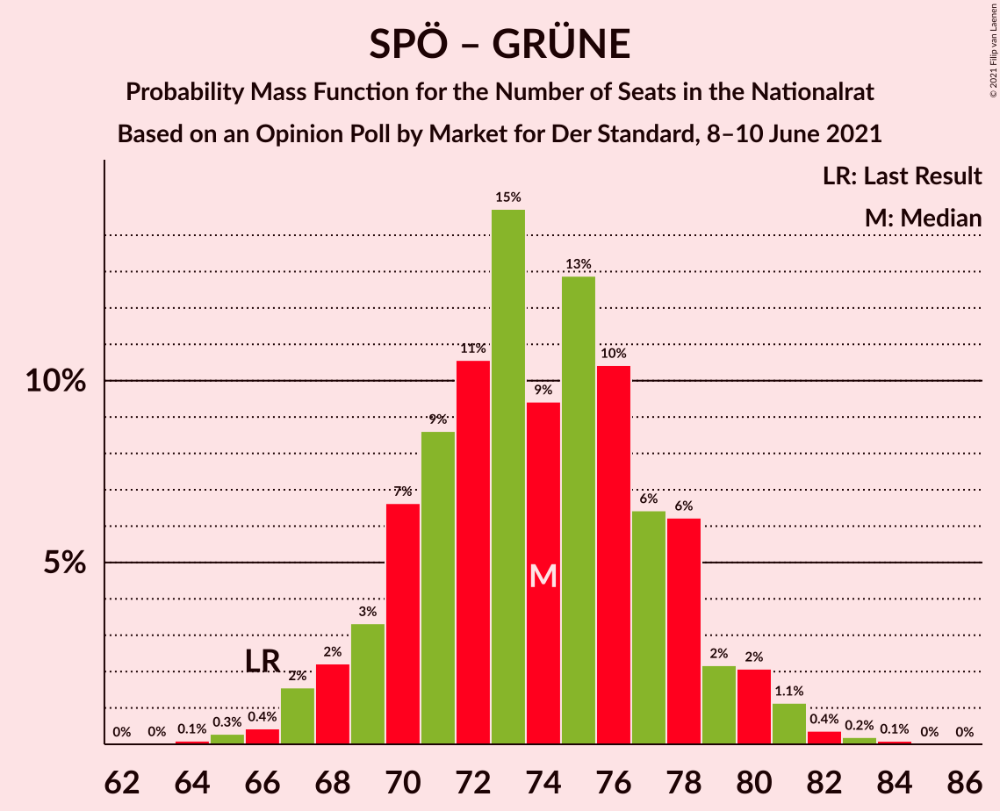

| Number of Seats | Probability | Accumulated | Special Marks |
|:---------------:|:-----------:|:-----------:|:-------------:|
| 64 | 0.1% | 100% |  |
| 65 | 0.3% | 99.9% |  |
| 66 | 0.4% | 99.6% | Last Result |
| 67 | 2% | 99.1% |  |
| 68 | 2% | 98% |  |
| 69 | 3% | 95% |  |
| 70 | 7% | 92% |  |
| 71 | 9% | 85% |  |
| 72 | 11% | 77% |  |
| 73 | 15% | 66% |  |
| 74 | 9% | 51% | Median |
| 75 | 13% | 42% |  |
| 76 | 10% | 29% |  |
| 77 | 6% | 19% |  |
| 78 | 6% | 12% |  |
| 79 | 2% | 6% |  |
| 80 | 2% | 4% |  |
| 81 | 1.1% | 2% |  |
| 82 | 0.4% | 0.7% |  |
| 83 | 0.2% | 0.3% |  |
| 84 | 0.1% | 0.1% |  |
| 85 | 0% | 0% |  |

### Österreichische Volkspartei

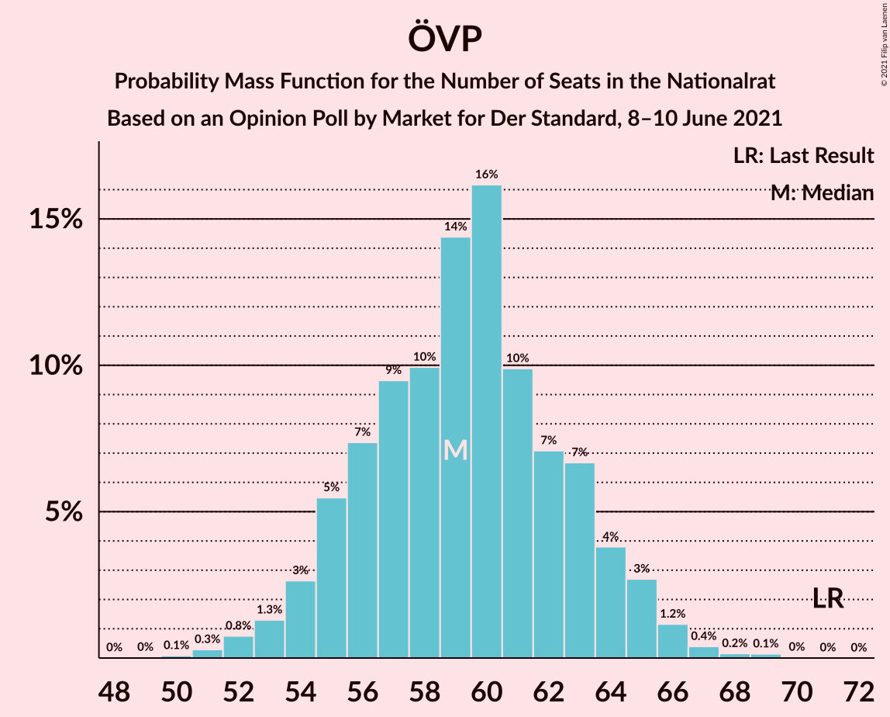

| Number of Seats | Probability | Accumulated | Special Marks |
|:---------------:|:-----------:|:-----------:|:-------------:|
| 50 | 0.1% | 100% |  |
| 51 | 0.3% | 99.9% |  |
| 52 | 0.8% | 99.6% |  |
| 53 | 1.3% | 98.8% |  |
| 54 | 3% | 98% |  |
| 55 | 5% | 95% |  |
| 56 | 7% | 89% |  |
| 57 | 9% | 82% |  |
| 58 | 10% | 73% |  |
| 59 | 14% | 63% | Median |
| 60 | 16% | 48% |  |
| 61 | 10% | 32% |  |
| 62 | 7% | 22% |  |
| 63 | 7% | 15% |  |
| 64 | 4% | 8% |  |
| 65 | 3% | 5% |  |
| 66 | 1.2% | 2% |  |
| 67 | 0.4% | 0.7% |  |
| 68 | 0.2% | 0.3% |  |
| 69 | 0.1% | 0.2% |  |
| 70 | 0% | 0% |  |
| 71 | 0% | 0% | Last Result |

### Sozialdemokratische Partei Österreichs

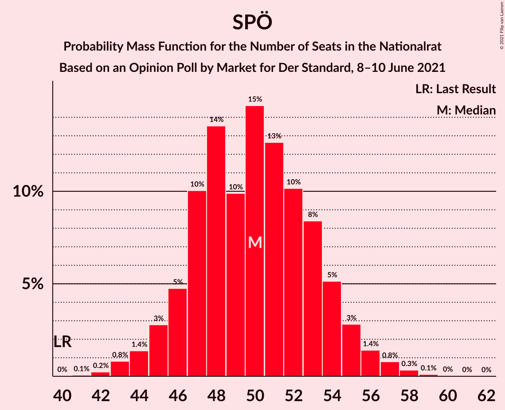

| Number of Seats | Probability | Accumulated | Special Marks |
|:---------------:|:-----------:|:-----------:|:-------------:|
| 40 | 0% | 100% | Last Result |
| 41 | 0.1% | 100% |  |
| 42 | 0.2% | 99.9% |  |
| 43 | 0.8% | 99.7% |  |
| 44 | 1.4% | 98.9% |  |
| 45 | 3% | 97% |  |
| 46 | 5% | 95% |  |
| 47 | 10% | 90% |  |
| 48 | 14% | 80% |  |
| 49 | 10% | 66% |  |
| 50 | 15% | 56% | Median |
| 51 | 13% | 42% |  |
| 52 | 10% | 29% |  |
| 53 | 8% | 19% |  |
| 54 | 5% | 11% |  |
| 55 | 3% | 6% |  |
| 56 | 1.4% | 3% |  |
| 57 | 0.8% | 1.3% |  |
| 58 | 0.3% | 0.5% |  |
| 59 | 0.1% | 0.2% |  |
| 60 | 0% | 0.1% |  |
| 61 | 0% | 0% |  |

## Technical Information

### Opinion Poll

+ **Polling firm:** Market
+ **Commissioner(s):** Der Standard
+ **Fieldwork period:** 8–10 June 2021

### Calculations

+ **Sample size:** 841
+ **Simulations done:** 131,072
+ **Error estimate:** 1.49%

