# Opinion Poll by Research Affairs for ÖSTERREICH, 8–10 June 2021

<a href="#voting-intentions">Voting Intentions</a> | <a href="#seats">Seats</a> | <a href="#coalitions">Coalitions</a> | <a href="#technical-information">Technical Information</a>

## Voting Intentions

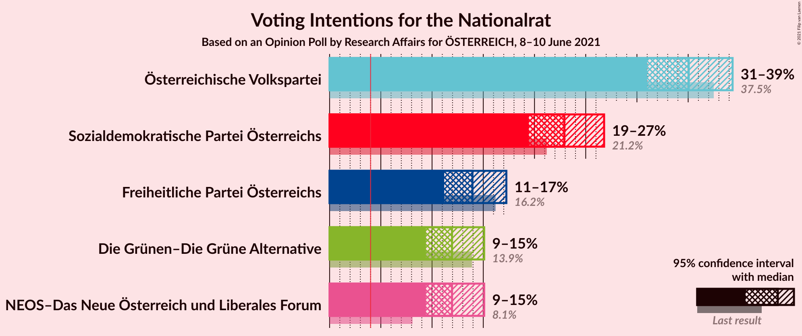

### Confidence Intervals

| Party | Last Result | Poll Result | 80% Confidence Interval | 90% Confidence Interval | 95% Confidence Interval | 99% Confidence Interval |
|:-----:|:-----------:|:-----------:|:-----------------------:|:-----------------------:|:-----------------------:|:-----------------------:|
| Österreichische Volkspartei | 37.5% | 35.1% | 32.4–37.9% |31.7–38.7% |31.0–39.3% |29.8–40.7% |
| Sozialdemokratische Partei Österreichs | 21.2% | 22.9% | 20.6–25.5% |20.0–26.2% |19.4–26.8% |18.4–28.0% |
| Freiheitliche Partei Österreichs | 16.2% | 13.9% | 12.1–16.1% |11.6–16.7% |11.2–17.3% |10.4–18.3% |
| NEOS–Das Neue Österreich und Liberales Forum | 8.1% | 12.0% | 10.3–14.0% |9.8–14.6% |9.4–15.1% |8.6–16.1% |
| Die Grünen–Die Grüne Alternative | 13.9% | 12.0% | 10.3–14.0% |9.8–14.6% |9.4–15.1% |8.6–16.1% |

*Note:* The poll result column reflects the actual value used in the calculations. Published results may vary slightly, and in addition be rounded to fewer digits.

## Seats

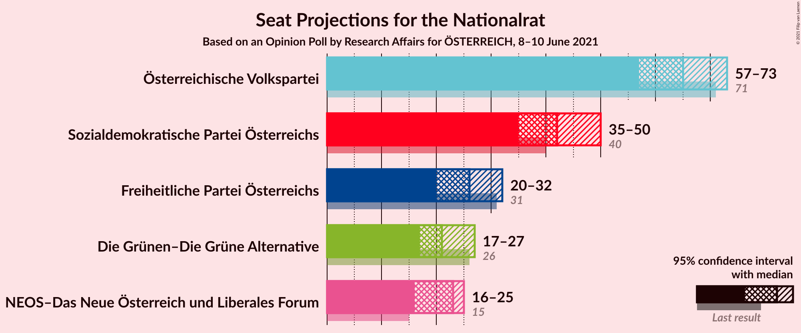

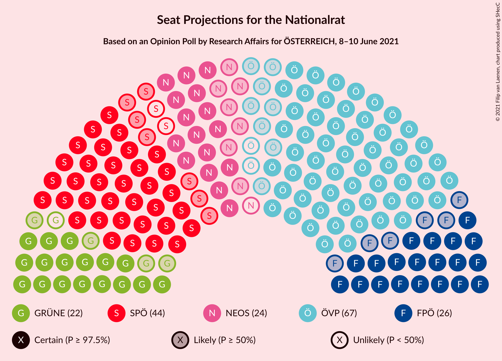

### Confidence Intervals

| Party | Last Result | Median | 80% Confidence Interval | 90% Confidence Interval | 95% Confidence Interval | 99% Confidence Interval |
|:-----:|:-----------:|:------:|:-----------------------:|:-----------------------:|:-----------------------:|:-----------------------:|
| <a href="#österreichische-volkspartei">Österreichische Volkspartei</a> | 71 | 65 | 60–70 |58–72 |57–73 |55–76 |
| <a href="#sozialdemokratische-partei-österreichs">Sozialdemokratische Partei Österreichs</a> | 40 | 42 | 38–47 |37–48 |35–50 |34–52 |
| <a href="#freiheitliche-partei-österreichs">Freiheitliche Partei Österreichs</a> | 31 | 26 | 22–30 |21–31 |20–32 |19–34 |
| <a href="#neos–das-neue-österreich-und-liberales-forum">NEOS–Das Neue Österreich und Liberales Forum</a> | 15 | 23 | 22–25 |21–25 |16–25 |15–30 |
| <a href="#die-grünen–die-grüne-alternative">Die Grünen–Die Grüne Alternative</a> | 26 | 21 | 18–25 |18–26 |17–27 |15–29 |

### Österreichische Volkspartei

*For a full overview of the results for this party, see the [Österreichische Volkspartei](party-österreichischevolkspartei.html) page.*

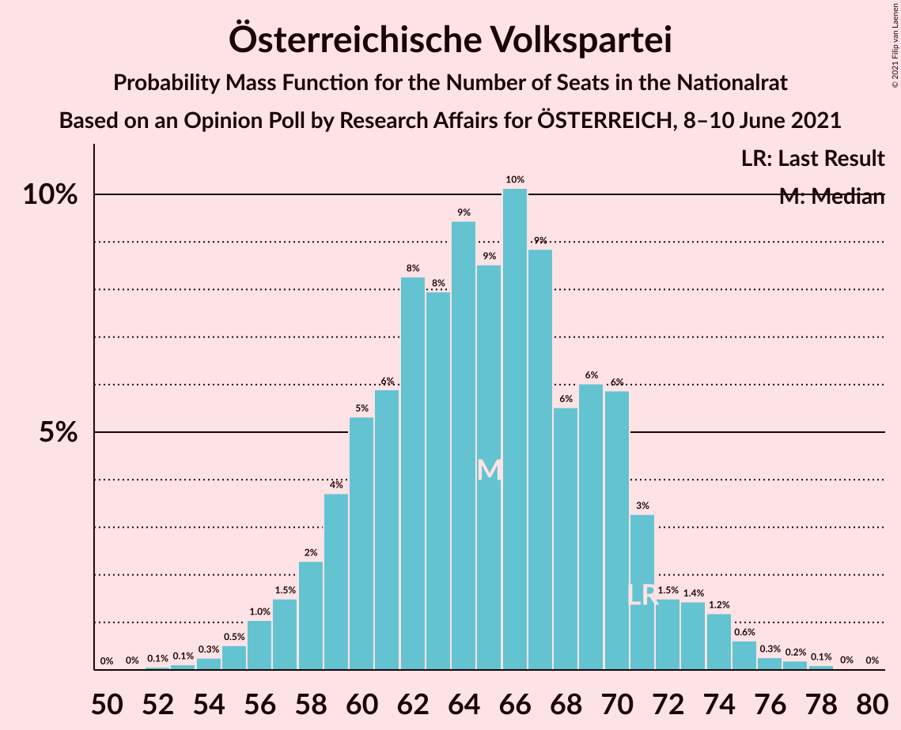

| Number of Seats | Probability | Accumulated | Special Marks |
|:---------------:|:-----------:|:-----------:|:-------------:|
| 52 | 0.1% | 100% |  |
| 53 | 0.1% | 99.9% |  |
| 54 | 0.3% | 99.8% |  |
| 55 | 0.5% | 99.5% |  |
| 56 | 1.0% | 99.0% |  |
| 57 | 1.5% | 98% |  |
| 58 | 2% | 96% |  |
| 59 | 4% | 94% |  |
| 60 | 5% | 90% |  |
| 61 | 6% | 85% |  |
| 62 | 8% | 79% |  |
| 63 | 8% | 71% |  |
| 64 | 9% | 63% |  |
| 65 | 9% | 54% | Median |
| 66 | 10% | 45% |  |
| 67 | 9% | 35% |  |
| 68 | 6% | 26% |  |
| 69 | 6% | 21% |  |
| 70 | 6% | 15% |  |
| 71 | 3% | 9% | Last Result |
| 72 | 1.5% | 5% |  |
| 73 | 1.4% | 4% |  |
| 74 | 1.2% | 2% |  |
| 75 | 0.6% | 1.2% |  |
| 76 | 0.3% | 0.6% |  |
| 77 | 0.2% | 0.4% |  |
| 78 | 0.1% | 0.2% |  |
| 79 | 0% | 0.1% |  |
| 80 | 0% | 0% |  |

### Sozialdemokratische Partei Österreichs

*For a full overview of the results for this party, see the [Sozialdemokratische Partei Österreichs](party-sozialdemokratischeparteiösterreichs.html) page.*

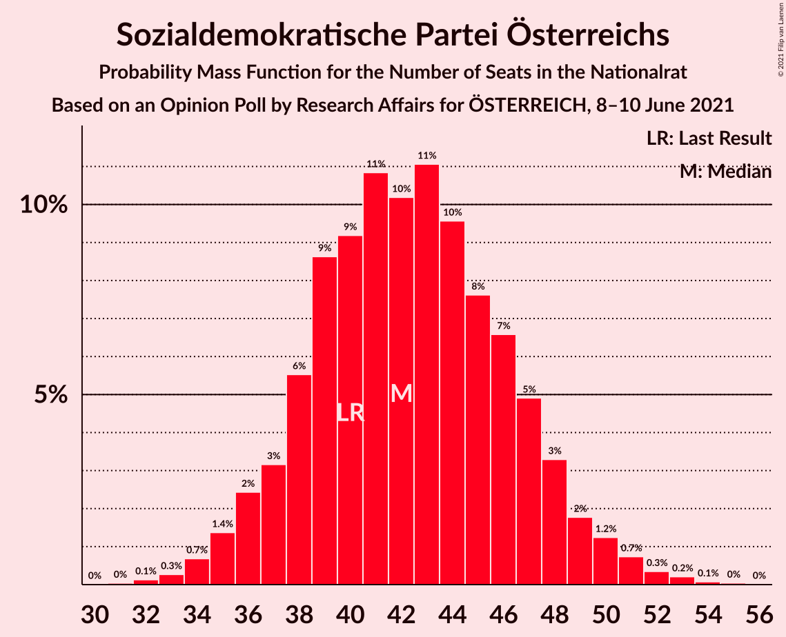

| Number of Seats | Probability | Accumulated | Special Marks |
|:---------------:|:-----------:|:-----------:|:-------------:|
| 31 | 0% | 100% |  |
| 32 | 0.1% | 99.9% |  |
| 33 | 0.3% | 99.8% |  |
| 34 | 0.7% | 99.5% |  |
| 35 | 1.4% | 98.9% |  |
| 36 | 2% | 97% |  |
| 37 | 3% | 95% |  |
| 38 | 6% | 92% |  |
| 39 | 9% | 86% |  |
| 40 | 9% | 78% | Last Result |
| 41 | 11% | 69% |  |
| 42 | 10% | 58% | Median |
| 43 | 11% | 48% |  |
| 44 | 10% | 36% |  |
| 45 | 8% | 27% |  |
| 46 | 7% | 19% |  |
| 47 | 5% | 13% |  |
| 48 | 3% | 8% |  |
| 49 | 2% | 4% |  |
| 50 | 1.2% | 3% |  |
| 51 | 0.7% | 1.4% |  |
| 52 | 0.3% | 0.7% |  |
| 53 | 0.2% | 0.4% |  |
| 54 | 0.1% | 0.1% |  |
| 55 | 0% | 0.1% |  |
| 56 | 0% | 0% |  |

### Freiheitliche Partei Österreichs

*For a full overview of the results for this party, see the [Freiheitliche Partei Österreichs](party-freiheitlicheparteiösterreichs.html) page.*

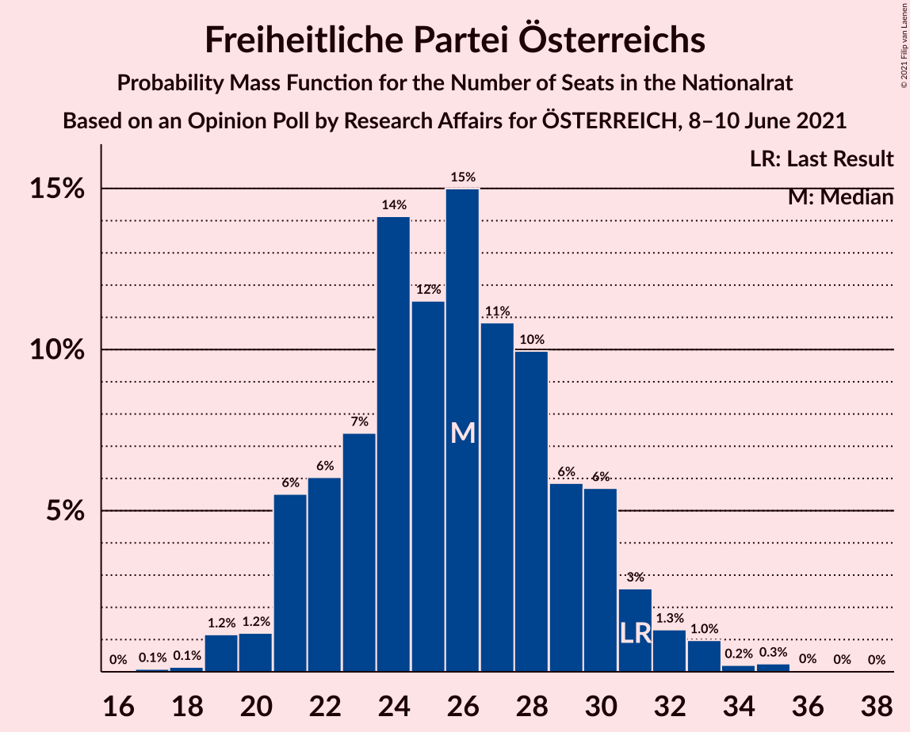

| Number of Seats | Probability | Accumulated | Special Marks |
|:---------------:|:-----------:|:-----------:|:-------------:|
| 17 | 0.1% | 100% |  |
| 18 | 0.1% | 99.9% |  |
| 19 | 1.2% | 99.7% |  |
| 20 | 1.2% | 98.6% |  |
| 21 | 6% | 97% |  |
| 22 | 6% | 92% |  |
| 23 | 7% | 86% |  |
| 24 | 14% | 78% |  |
| 25 | 12% | 64% |  |
| 26 | 15% | 53% | Median |
| 27 | 11% | 38% |  |
| 28 | 10% | 27% |  |
| 29 | 6% | 17% |  |
| 30 | 6% | 11% |  |
| 31 | 3% | 5% | Last Result |
| 32 | 1.3% | 3% |  |
| 33 | 1.0% | 2% |  |
| 34 | 0.2% | 0.6% |  |
| 35 | 0.3% | 0.3% |  |
| 36 | 0% | 0.1% |  |
| 37 | 0% | 0% |  |

### NEOS–Das Neue Österreich und Liberales Forum

*For a full overview of the results for this party, see the [NEOS–Das Neue Österreich und Liberales Forum](party-neos–dasneueösterreichundliberalesforum.html) page.*

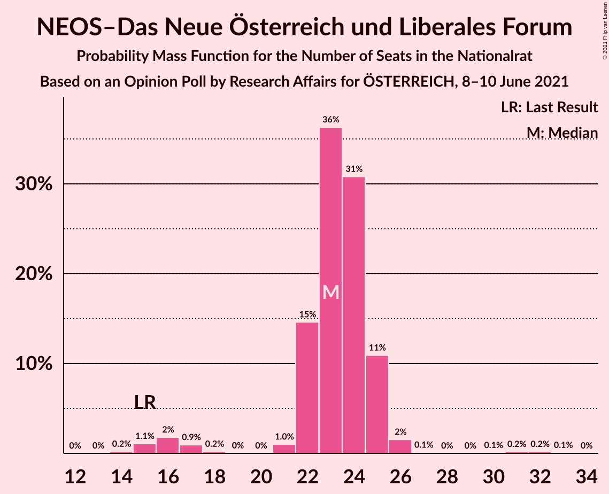

| Number of Seats | Probability | Accumulated | Special Marks |
|:---------------:|:-----------:|:-----------:|:-------------:|
| 14 | 0.2% | 100% |  |
| 15 | 1.1% | 99.8% | Last Result |
| 16 | 2% | 98.7% |  |
| 17 | 0.9% | 97% |  |
| 18 | 0.2% | 96% |  |
| 19 | 0% | 96% |  |
| 20 | 0% | 96% |  |
| 21 | 1.0% | 96% |  |
| 22 | 15% | 95% |  |
| 23 | 36% | 80% | Median |
| 24 | 31% | 44% |  |
| 25 | 11% | 13% |  |
| 26 | 2% | 2% |  |
| 27 | 0.1% | 0.6% |  |
| 28 | 0% | 0.5% |  |
| 29 | 0% | 0.5% |  |
| 30 | 0.1% | 0.5% |  |
| 31 | 0.2% | 0.4% |  |
| 32 | 0.2% | 0.3% |  |
| 33 | 0.1% | 0.1% |  |
| 34 | 0% | 0% |  |

### Die Grünen–Die Grüne Alternative

*For a full overview of the results for this party, see the [Die Grünen–Die Grüne Alternative](party-diegrünen–diegrünealternative.html) page.*

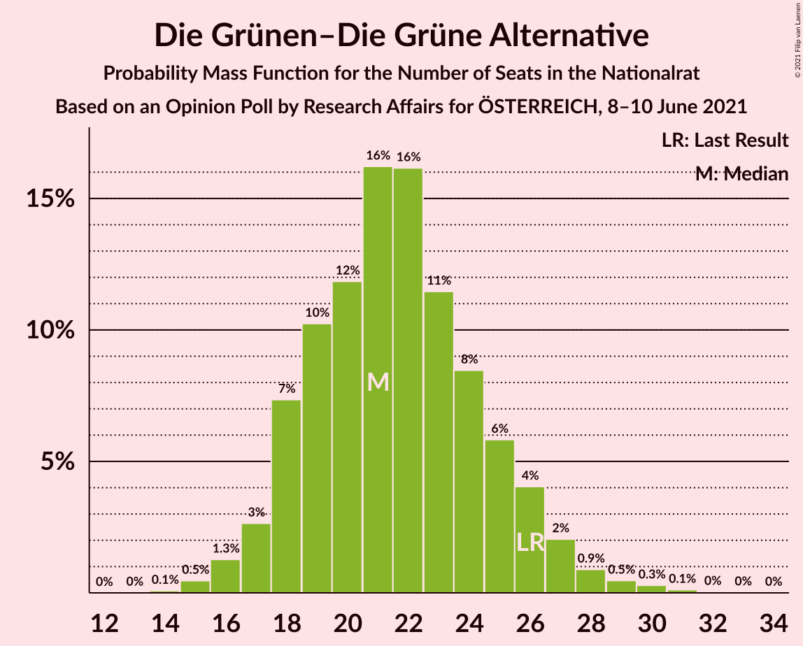

| Number of Seats | Probability | Accumulated | Special Marks |
|:---------------:|:-----------:|:-----------:|:-------------:|
| 14 | 0.1% | 100% |  |
| 15 | 0.5% | 99.9% |  |
| 16 | 1.3% | 99.4% |  |
| 17 | 3% | 98% |  |
| 18 | 7% | 96% |  |
| 19 | 10% | 88% |  |
| 20 | 12% | 78% |  |
| 21 | 16% | 66% | Median |
| 22 | 16% | 50% |  |
| 23 | 11% | 34% |  |
| 24 | 8% | 22% |  |
| 25 | 6% | 14% |  |
| 26 | 4% | 8% | Last Result |
| 27 | 2% | 4% |  |
| 28 | 0.9% | 2% |  |
| 29 | 0.5% | 1.0% |  |
| 30 | 0.3% | 0.5% |  |
| 31 | 0.1% | 0.2% |  |
| 32 | 0% | 0.1% |  |
| 33 | 0% | 0% |  |

## Coalitions

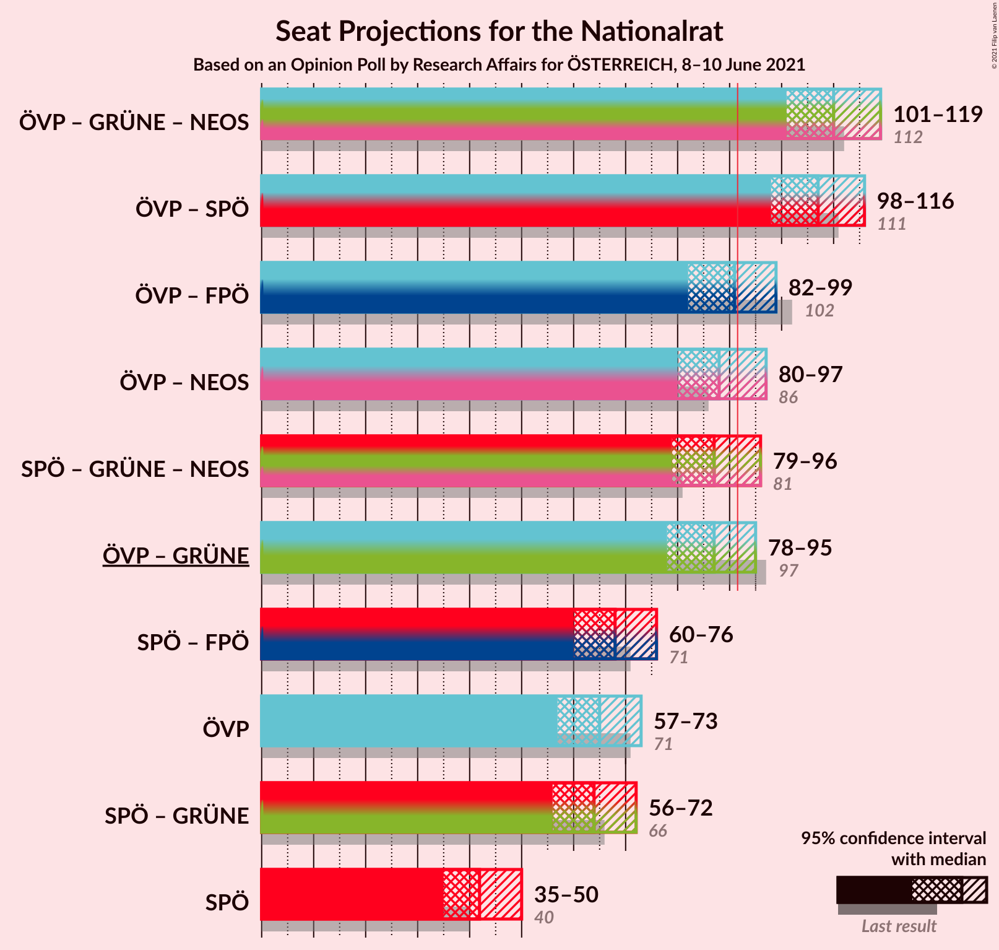

### Confidence Intervals

| Coalition | Last Result | Median | Majority? | 80% Confidence Interval | 90% Confidence Interval | 95% Confidence Interval | 99% Confidence Interval |
|:---------:|:-----------:|:------:|:---------:|:-----------------------:|:-----------------------:|:-----------------------:|:-----------------------:|
| Österreichische Volkspartei – Die Grünen–Die Grüne Alternative – NEOS–Das Neue Österreich und Liberales Forum | 112 | 110 | 100% | 104–116 | 102–118 | 101–119 | 98–122 |
| Österreichische Volkspartei – Sozialdemokratische Partei Österreichs | 111 | 107 | 100% | 101–113 | 100–115 | 98–116 | 96–119 |
| Österreichische Volkspartei – Freiheitliche Partei Österreichs | 102 | 91 | 43% | 85–96 | 83–98 | 82–99 | 79–103 |
| Österreichische Volkspartei – NEOS–Das Neue Österreich und Liberales Forum | 86 | 88 | 21% | 83–94 | 81–95 | 80–97 | 77–99 |
| Sozialdemokratische Partei Österreichs – Die Grünen–Die Grüne Alternative – NEOS–Das Neue Österreich und Liberales Forum | 81 | 87 | 16% | 82–93 | 80–95 | 79–96 | 76–99 |
| Österreichische Volkspartei – Die Grünen–Die Grüne Alternative | 97 | 87 | 13% | 81–92 | 79–94 | 78–95 | 76–98 |
| Sozialdemokratische Partei Österreichs – Freiheitliche Partei Österreichs | 71 | 68 | 0% | 63–74 | 61–75 | 60–76 | 58–79 |
| Österreichische Volkspartei | 71 | 65 | 0% | 60–70 | 58–72 | 57–73 | 55–76 |
| Sozialdemokratische Partei Österreichs – Die Grünen–Die Grüne Alternative | 66 | 64 | 0% | 59–69 | 58–71 | 56–72 | 54–75 |
| Sozialdemokratische Partei Österreichs | 40 | 42 | 0% | 38–47 | 37–48 | 35–50 | 34–52 |

### Österreichische Volkspartei – Die Grünen–Die Grüne Alternative – NEOS–Das Neue Österreich und Liberales Forum

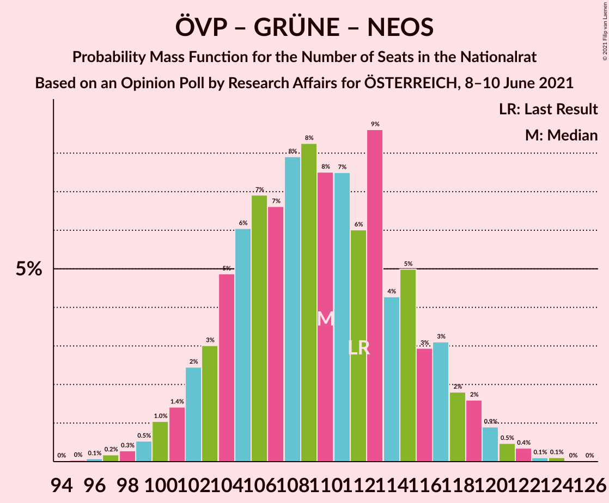

| Number of Seats | Probability | Accumulated | Special Marks |
|:---------------:|:-----------:|:-----------:|:-------------:|
| 95 | 0% | 100% |  |
| 96 | 0.1% | 99.9% |  |
| 97 | 0.2% | 99.9% |  |
| 98 | 0.3% | 99.7% |  |
| 99 | 0.5% | 99.4% |  |
| 100 | 1.0% | 98.9% |  |
| 101 | 1.4% | 98% |  |
| 102 | 2% | 96% |  |
| 103 | 3% | 94% |  |
| 104 | 5% | 91% |  |
| 105 | 6% | 86% |  |
| 106 | 7% | 80% |  |
| 107 | 7% | 73% |  |
| 108 | 8% | 66% |  |
| 109 | 8% | 59% | Median |
| 110 | 8% | 50% |  |
| 111 | 7% | 43% |  |
| 112 | 6% | 35% | Last Result |
| 113 | 9% | 29% |  |
| 114 | 4% | 21% |  |
| 115 | 5% | 16% |  |
| 116 | 3% | 11% |  |
| 117 | 3% | 8% |  |
| 118 | 2% | 5% |  |
| 119 | 2% | 4% |  |
| 120 | 0.9% | 2% |  |
| 121 | 0.5% | 1.1% |  |
| 122 | 0.4% | 0.6% |  |
| 123 | 0.1% | 0.3% |  |
| 124 | 0.1% | 0.2% |  |
| 125 | 0% | 0% |  |

### Österreichische Volkspartei – Sozialdemokratische Partei Österreichs

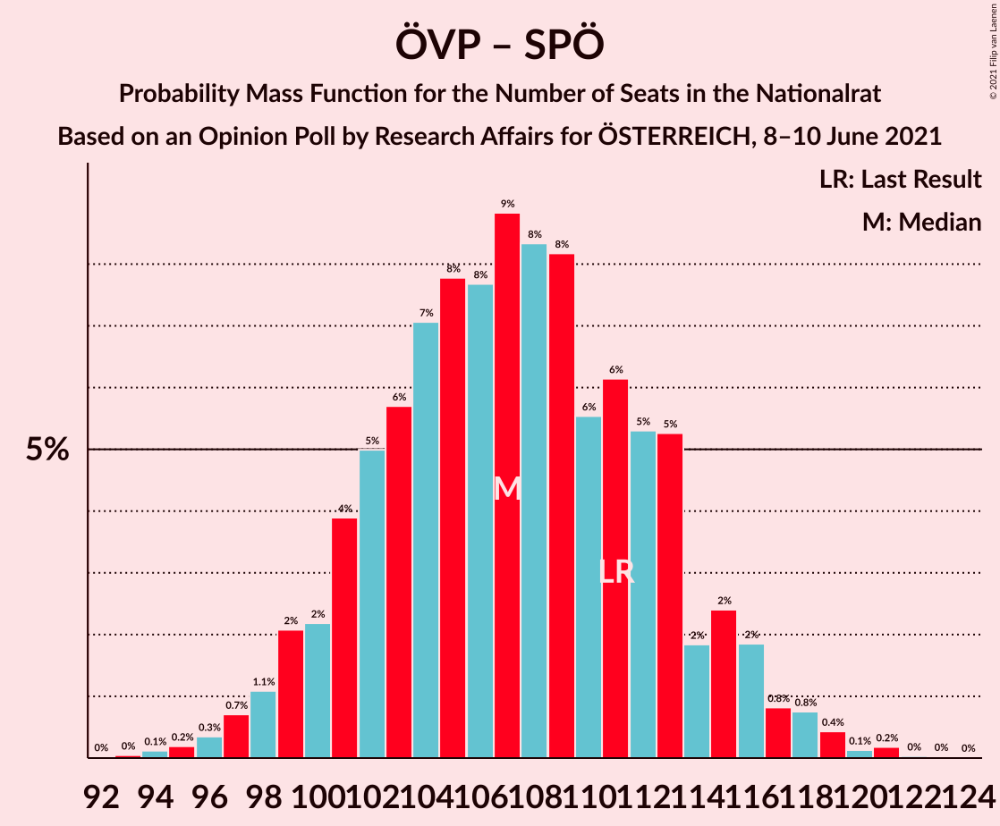

| Number of Seats | Probability | Accumulated | Special Marks |
|:---------------:|:-----------:|:-----------:|:-------------:|
| 93 | 0% | 100% |  |
| 94 | 0.1% | 99.9% |  |
| 95 | 0.2% | 99.8% |  |
| 96 | 0.3% | 99.6% |  |
| 97 | 0.7% | 99.3% |  |
| 98 | 1.1% | 98.5% |  |
| 99 | 2% | 97% |  |
| 100 | 2% | 95% |  |
| 101 | 4% | 93% |  |
| 102 | 5% | 89% |  |
| 103 | 6% | 84% |  |
| 104 | 7% | 79% |  |
| 105 | 8% | 72% |  |
| 106 | 8% | 64% |  |
| 107 | 9% | 56% | Median |
| 108 | 8% | 47% |  |
| 109 | 8% | 39% |  |
| 110 | 6% | 31% |  |
| 111 | 6% | 25% | Last Result |
| 112 | 5% | 19% |  |
| 113 | 5% | 14% |  |
| 114 | 2% | 8% |  |
| 115 | 2% | 7% |  |
| 116 | 2% | 4% |  |
| 117 | 0.8% | 2% |  |
| 118 | 0.8% | 2% |  |
| 119 | 0.4% | 0.8% |  |
| 120 | 0.1% | 0.4% |  |
| 121 | 0.2% | 0.3% |  |
| 122 | 0% | 0.1% |  |
| 123 | 0% | 0% |  |

### Österreichische Volkspartei – Freiheitliche Partei Österreichs

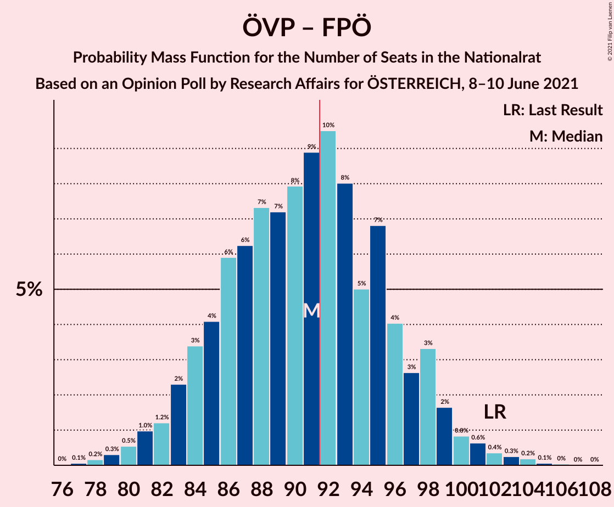

| Number of Seats | Probability | Accumulated | Special Marks |
|:---------------:|:-----------:|:-----------:|:-------------:|
| 76 | 0% | 100% |  |
| 77 | 0.1% | 99.9% |  |
| 78 | 0.2% | 99.9% |  |
| 79 | 0.3% | 99.7% |  |
| 80 | 0.5% | 99.4% |  |
| 81 | 1.0% | 98.9% |  |
| 82 | 1.2% | 98% |  |
| 83 | 2% | 97% |  |
| 84 | 3% | 94% |  |
| 85 | 4% | 91% |  |
| 86 | 6% | 87% |  |
| 87 | 6% | 81% |  |
| 88 | 7% | 75% |  |
| 89 | 7% | 67% |  |
| 90 | 8% | 60% |  |
| 91 | 9% | 52% | Median |
| 92 | 10% | 43% | Majority |
| 93 | 8% | 34% |  |
| 94 | 5% | 26% |  |
| 95 | 7% | 21% |  |
| 96 | 4% | 14% |  |
| 97 | 3% | 10% |  |
| 98 | 3% | 7% |  |
| 99 | 2% | 4% |  |
| 100 | 0.8% | 2% |  |
| 101 | 0.6% | 2% |  |
| 102 | 0.4% | 0.9% | Last Result |
| 103 | 0.3% | 0.6% |  |
| 104 | 0.2% | 0.3% |  |
| 105 | 0.1% | 0.1% |  |
| 106 | 0% | 0.1% |  |
| 107 | 0% | 0% |  |

### Österreichische Volkspartei – NEOS–Das Neue Österreich und Liberales Forum

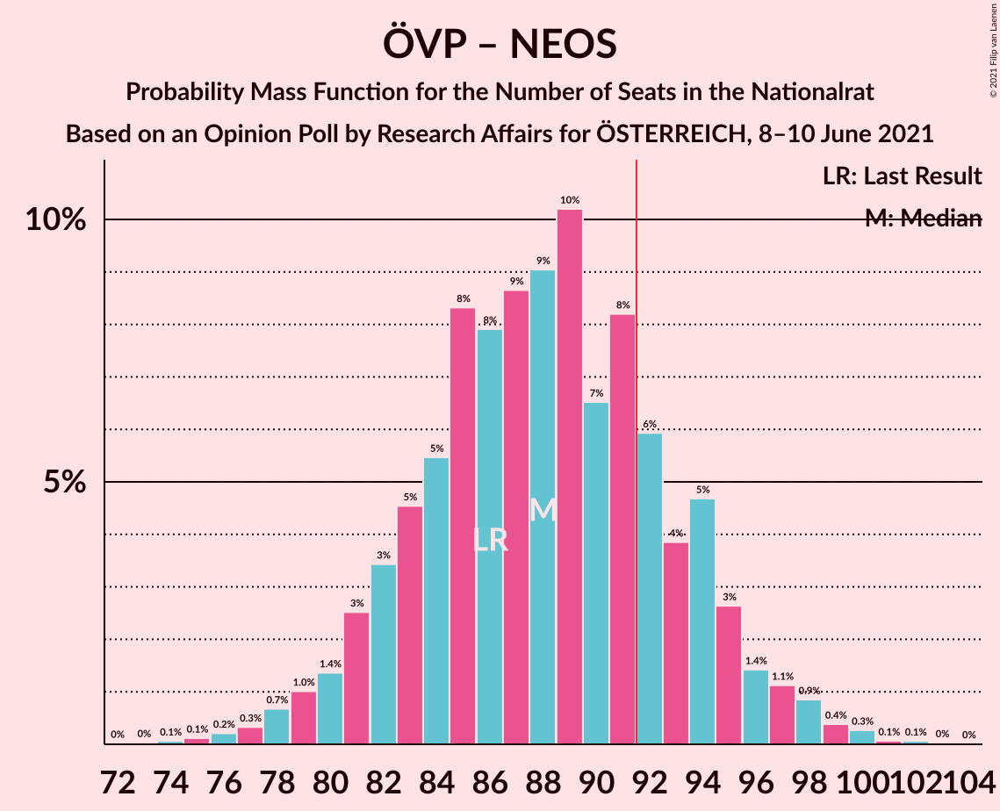

| Number of Seats | Probability | Accumulated | Special Marks |
|:---------------:|:-----------:|:-----------:|:-------------:|
| 73 | 0% | 100% |  |
| 74 | 0.1% | 99.9% |  |
| 75 | 0.1% | 99.9% |  |
| 76 | 0.2% | 99.8% |  |
| 77 | 0.3% | 99.5% |  |
| 78 | 0.7% | 99.2% |  |
| 79 | 1.0% | 98.5% |  |
| 80 | 1.4% | 98% |  |
| 81 | 3% | 96% |  |
| 82 | 3% | 94% |  |
| 83 | 5% | 90% |  |
| 84 | 5% | 86% |  |
| 85 | 8% | 80% |  |
| 86 | 8% | 72% | Last Result |
| 87 | 9% | 64% |  |
| 88 | 9% | 55% | Median |
| 89 | 10% | 46% |  |
| 90 | 7% | 36% |  |
| 91 | 8% | 30% |  |
| 92 | 6% | 21% | Majority |
| 93 | 4% | 15% |  |
| 94 | 5% | 12% |  |
| 95 | 3% | 7% |  |
| 96 | 1.4% | 4% |  |
| 97 | 1.1% | 3% |  |
| 98 | 0.9% | 2% |  |
| 99 | 0.4% | 0.8% |  |
| 100 | 0.3% | 0.4% |  |
| 101 | 0.1% | 0.2% |  |
| 102 | 0.1% | 0.1% |  |
| 103 | 0% | 0% |  |

### Sozialdemokratische Partei Österreichs – Die Grünen–Die Grüne Alternative – NEOS–Das Neue Österreich und Liberales Forum

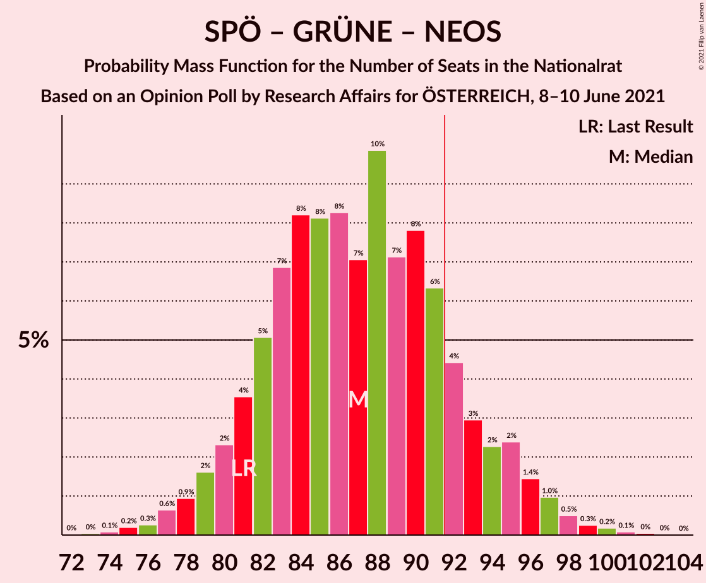

| Number of Seats | Probability | Accumulated | Special Marks |
|:---------------:|:-----------:|:-----------:|:-------------:|
| 73 | 0% | 100% |  |
| 74 | 0.1% | 99.9% |  |
| 75 | 0.2% | 99.8% |  |
| 76 | 0.3% | 99.6% |  |
| 77 | 0.6% | 99.4% |  |
| 78 | 0.9% | 98.7% |  |
| 79 | 2% | 98% |  |
| 80 | 2% | 96% |  |
| 81 | 4% | 94% | Last Result |
| 82 | 5% | 90% |  |
| 83 | 7% | 85% |  |
| 84 | 8% | 78% |  |
| 85 | 8% | 70% |  |
| 86 | 8% | 62% | Median |
| 87 | 7% | 54% |  |
| 88 | 10% | 47% |  |
| 89 | 7% | 37% |  |
| 90 | 8% | 30% |  |
| 91 | 6% | 22% |  |
| 92 | 4% | 16% | Majority |
| 93 | 3% | 11% |  |
| 94 | 2% | 8% |  |
| 95 | 2% | 6% |  |
| 96 | 1.4% | 4% |  |
| 97 | 1.0% | 2% |  |
| 98 | 0.5% | 1.1% |  |
| 99 | 0.3% | 0.6% |  |
| 100 | 0.2% | 0.3% |  |
| 101 | 0.1% | 0.2% |  |
| 102 | 0% | 0.1% |  |
| 103 | 0% | 0% |  |

### Österreichische Volkspartei – Die Grünen–Die Grüne Alternative

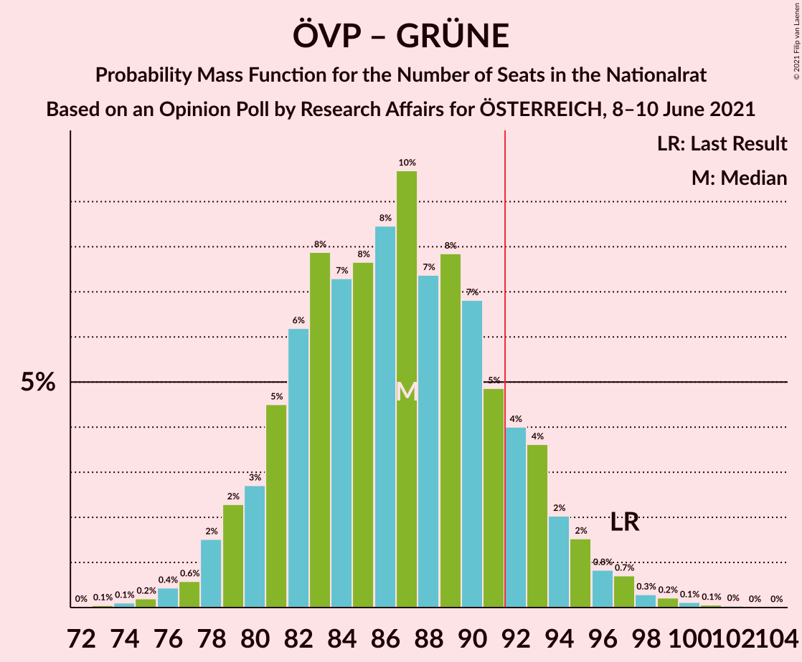

| Number of Seats | Probability | Accumulated | Special Marks |
|:---------------:|:-----------:|:-----------:|:-------------:|
| 73 | 0.1% | 100% |  |
| 74 | 0.1% | 99.9% |  |
| 75 | 0.2% | 99.8% |  |
| 76 | 0.4% | 99.6% |  |
| 77 | 0.6% | 99.2% |  |
| 78 | 2% | 98.6% |  |
| 79 | 2% | 97% |  |
| 80 | 3% | 95% |  |
| 81 | 5% | 92% |  |
| 82 | 6% | 88% |  |
| 83 | 8% | 81% |  |
| 84 | 7% | 74% |  |
| 85 | 8% | 66% |  |
| 86 | 8% | 59% | Median |
| 87 | 10% | 50% |  |
| 88 | 7% | 40% |  |
| 89 | 8% | 33% |  |
| 90 | 7% | 25% |  |
| 91 | 5% | 18% |  |
| 92 | 4% | 13% | Majority |
| 93 | 4% | 9% |  |
| 94 | 2% | 6% |  |
| 95 | 2% | 4% |  |
| 96 | 0.8% | 2% |  |
| 97 | 0.7% | 1.5% | Last Result |
| 98 | 0.3% | 0.8% |  |
| 99 | 0.2% | 0.5% |  |
| 100 | 0.1% | 0.3% |  |
| 101 | 0.1% | 0.1% |  |
| 102 | 0% | 0.1% |  |
| 103 | 0% | 0% |  |

### Sozialdemokratische Partei Österreichs – Freiheitliche Partei Österreichs

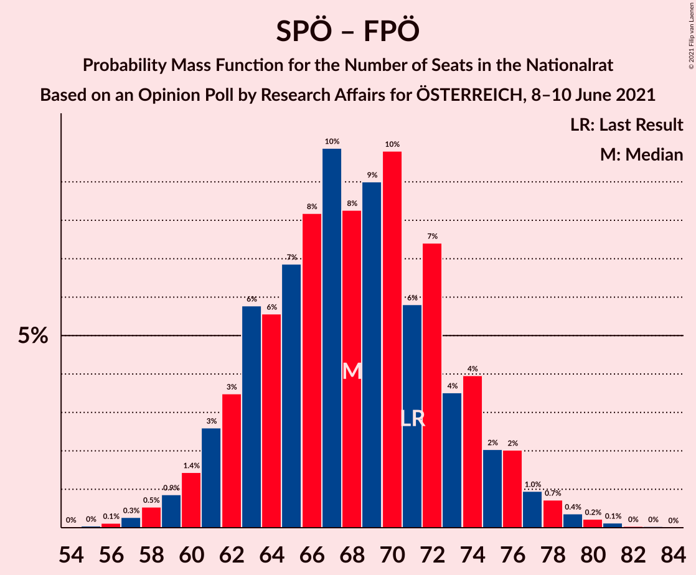

| Number of Seats | Probability | Accumulated | Special Marks |
|:---------------:|:-----------:|:-----------:|:-------------:|
| 55 | 0% | 100% |  |
| 56 | 0.1% | 99.9% |  |
| 57 | 0.3% | 99.8% |  |
| 58 | 0.5% | 99.5% |  |
| 59 | 0.9% | 99.0% |  |
| 60 | 1.4% | 98% |  |
| 61 | 3% | 97% |  |
| 62 | 3% | 94% |  |
| 63 | 6% | 91% |  |
| 64 | 6% | 85% |  |
| 65 | 7% | 79% |  |
| 66 | 8% | 72% |  |
| 67 | 10% | 64% |  |
| 68 | 8% | 54% | Median |
| 69 | 9% | 46% |  |
| 70 | 10% | 37% |  |
| 71 | 6% | 27% | Last Result |
| 72 | 7% | 21% |  |
| 73 | 4% | 14% |  |
| 74 | 4% | 11% |  |
| 75 | 2% | 7% |  |
| 76 | 2% | 5% |  |
| 77 | 1.0% | 2% |  |
| 78 | 0.7% | 2% |  |
| 79 | 0.4% | 0.8% |  |
| 80 | 0.2% | 0.5% |  |
| 81 | 0.1% | 0.2% |  |
| 82 | 0% | 0.1% |  |
| 83 | 0% | 0.1% |  |
| 84 | 0% | 0% |  |

### Österreichische Volkspartei

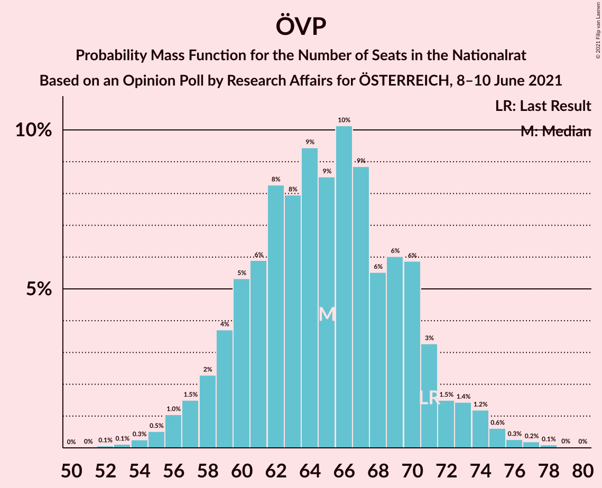

| Number of Seats | Probability | Accumulated | Special Marks |
|:---------------:|:-----------:|:-----------:|:-------------:|
| 52 | 0.1% | 100% |  |
| 53 | 0.1% | 99.9% |  |
| 54 | 0.3% | 99.8% |  |
| 55 | 0.5% | 99.5% |  |
| 56 | 1.0% | 99.0% |  |
| 57 | 1.5% | 98% |  |
| 58 | 2% | 96% |  |
| 59 | 4% | 94% |  |
| 60 | 5% | 90% |  |
| 61 | 6% | 85% |  |
| 62 | 8% | 79% |  |
| 63 | 8% | 71% |  |
| 64 | 9% | 63% |  |
| 65 | 9% | 54% | Median |
| 66 | 10% | 45% |  |
| 67 | 9% | 35% |  |
| 68 | 6% | 26% |  |
| 69 | 6% | 21% |  |
| 70 | 6% | 15% |  |
| 71 | 3% | 9% | Last Result |
| 72 | 1.5% | 5% |  |
| 73 | 1.4% | 4% |  |
| 74 | 1.2% | 2% |  |
| 75 | 0.6% | 1.2% |  |
| 76 | 0.3% | 0.6% |  |
| 77 | 0.2% | 0.4% |  |
| 78 | 0.1% | 0.2% |  |
| 79 | 0% | 0.1% |  |
| 80 | 0% | 0% |  |

### Sozialdemokratische Partei Österreichs – Die Grünen–Die Grüne Alternative

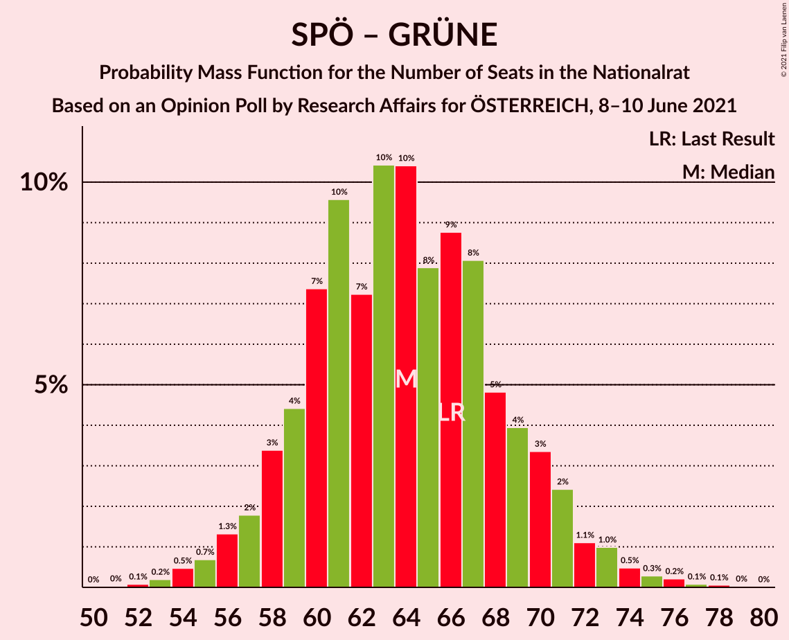

| Number of Seats | Probability | Accumulated | Special Marks |
|:---------------:|:-----------:|:-----------:|:-------------:|
| 52 | 0.1% | 100% |  |
| 53 | 0.2% | 99.9% |  |
| 54 | 0.5% | 99.7% |  |
| 55 | 0.7% | 99.2% |  |
| 56 | 1.3% | 98.5% |  |
| 57 | 2% | 97% |  |
| 58 | 3% | 95% |  |
| 59 | 4% | 92% |  |
| 60 | 7% | 88% |  |
| 61 | 10% | 80% |  |
| 62 | 7% | 71% |  |
| 63 | 10% | 63% | Median |
| 64 | 10% | 53% |  |
| 65 | 8% | 43% |  |
| 66 | 9% | 35% | Last Result |
| 67 | 8% | 26% |  |
| 68 | 5% | 18% |  |
| 69 | 4% | 13% |  |
| 70 | 3% | 9% |  |
| 71 | 2% | 6% |  |
| 72 | 1.1% | 3% |  |
| 73 | 1.0% | 2% |  |
| 74 | 0.5% | 1.2% |  |
| 75 | 0.3% | 0.7% |  |
| 76 | 0.2% | 0.4% |  |
| 77 | 0.1% | 0.2% |  |
| 78 | 0.1% | 0.1% |  |
| 79 | 0% | 0.1% |  |
| 80 | 0% | 0% |  |

### Sozialdemokratische Partei Österreichs

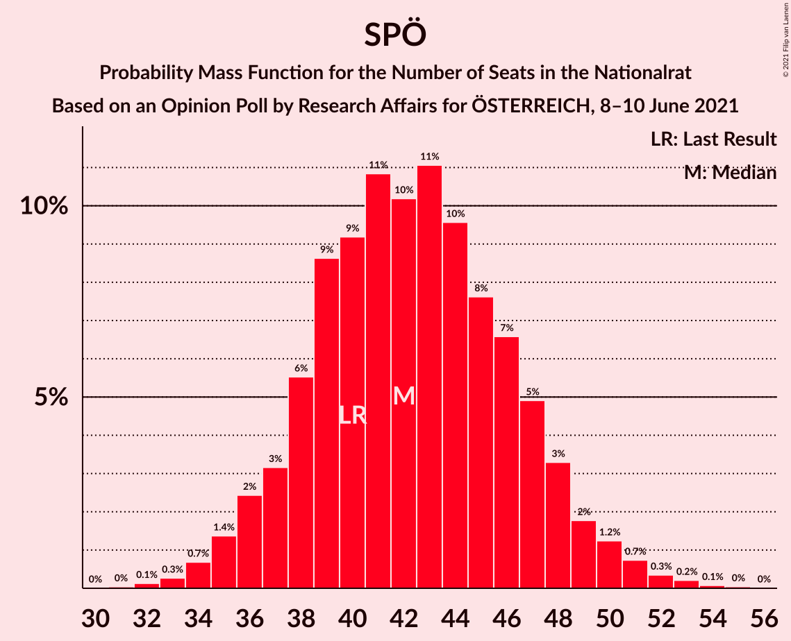

| Number of Seats | Probability | Accumulated | Special Marks |
|:---------------:|:-----------:|:-----------:|:-------------:|
| 31 | 0% | 100% |  |
| 32 | 0.1% | 99.9% |  |
| 33 | 0.3% | 99.8% |  |
| 34 | 0.7% | 99.5% |  |
| 35 | 1.4% | 98.9% |  |
| 36 | 2% | 97% |  |
| 37 | 3% | 95% |  |
| 38 | 6% | 92% |  |
| 39 | 9% | 86% |  |
| 40 | 9% | 78% | Last Result |
| 41 | 11% | 69% |  |
| 42 | 10% | 58% | Median |
| 43 | 11% | 48% |  |
| 44 | 10% | 36% |  |
| 45 | 8% | 27% |  |
| 46 | 7% | 19% |  |
| 47 | 5% | 13% |  |
| 48 | 3% | 8% |  |
| 49 | 2% | 4% |  |
| 50 | 1.2% | 3% |  |
| 51 | 0.7% | 1.4% |  |
| 52 | 0.3% | 0.7% |  |
| 53 | 0.2% | 0.4% |  |
| 54 | 0.1% | 0.1% |  |
| 55 | 0% | 0.1% |  |
| 56 | 0% | 0% |  |

## Technical Information

### Opinion Poll

+ **Polling firm:** Research Affairs
+ **Commissioner(s):** ÖSTERREICH
+ **Fieldwork period:** 8–10 June 2021

### Calculations

+ **Sample size:** 502
+ **Simulations done:** 131,072
+ **Error estimate:** 1.19%

