# Opinion Poll by IFDD for PULS 24, 10–15 June 2021

<a href="#voting-intentions">Voting Intentions</a> | <a href="#seats">Seats</a> | <a href="#coalitions">Coalitions</a> | <a href="#technical-information">Technical Information</a>

## Voting Intentions

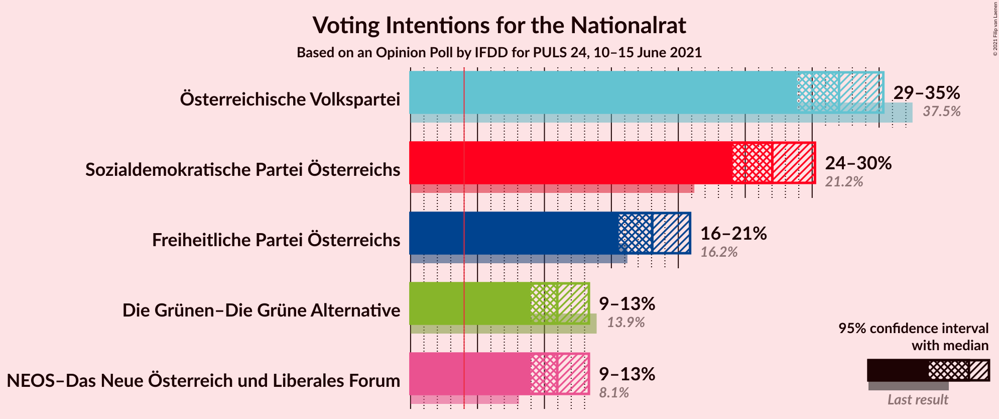

### Confidence Intervals

| Party | Last Result | Poll Result | 80% Confidence Interval | 90% Confidence Interval | 95% Confidence Interval | 99% Confidence Interval |
|:-----:|:-----------:|:-----------:|:-----------------------:|:-----------------------:|:-----------------------:|:-----------------------:|
| Österreichische Volkspartei | 37.5% | 32.0% | 29.9–34.2% |29.4–34.8% |28.9–35.3% |27.9–36.4% |
| Sozialdemokratische Partei Österreichs | 21.2% | 27.0% | 25.1–29.1% |24.5–29.7% |24.1–30.2% |23.2–31.2% |
| Freiheitliche Partei Österreichs | 16.2% | 18.1% | 16.4–19.9% |15.9–20.4% |15.5–20.9% |14.8–21.8% |
| NEOS–Das Neue Österreich und Liberales Forum | 8.1% | 11.0% | 9.6–12.5% |9.3–12.9% |9.0–13.3% |8.4–14.1% |
| Die Grünen–Die Grüne Alternative | 13.9% | 11.0% | 9.6–12.5% |9.3–12.9% |9.0–13.3% |8.4–14.1% |

*Note:* The poll result column reflects the actual value used in the calculations. Published results may vary slightly, and in addition be rounded to fewer digits.

## Seats

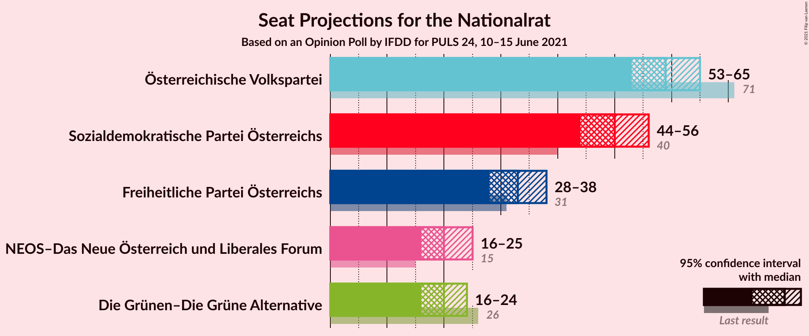

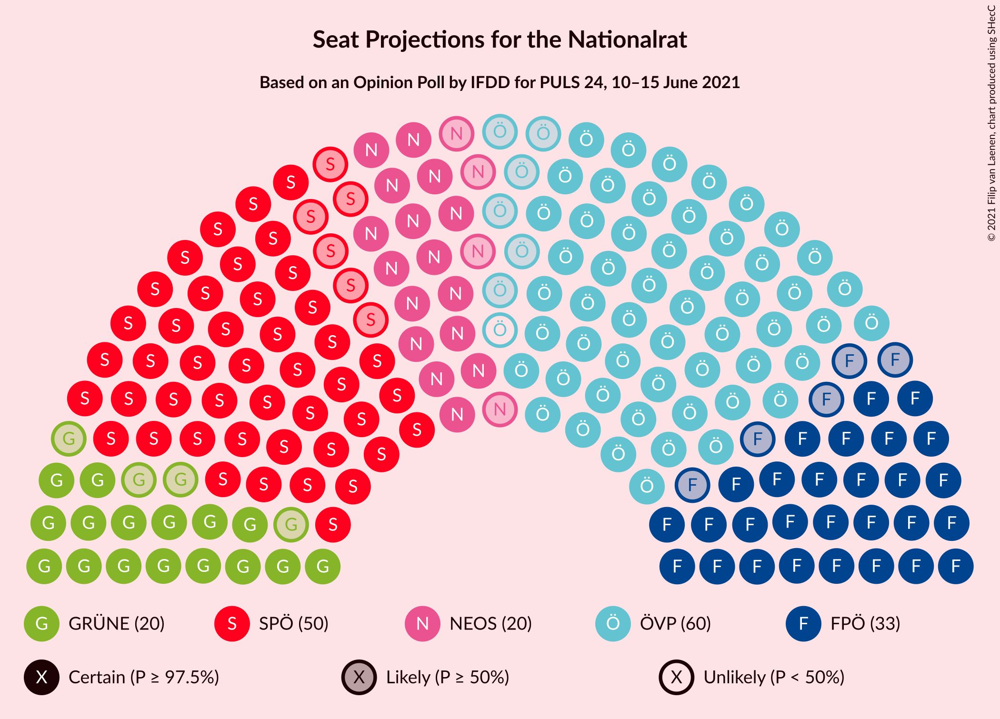

### Confidence Intervals

| Party | Last Result | Median | 80% Confidence Interval | 90% Confidence Interval | 95% Confidence Interval | 99% Confidence Interval |
|:-----:|:-----------:|:------:|:-----------------------:|:-----------------------:|:-----------------------:|:-----------------------:|
| <a href="#österreichische-volkspartei">Österreichische Volkspartei</a> | 71 | 59 | 55–63 |54–64 |53–65 |51–67 |
| <a href="#sozialdemokratische-partei-österreichs">Sozialdemokratische Partei Österreichs</a> | 40 | 50 | 46–54 |45–55 |44–56 |43–58 |
| <a href="#freiheitliche-partei-österreichs">Freiheitliche Partei Österreichs</a> | 31 | 33 | 30–37 |29–38 |28–38 |27–40 |
| <a href="#neos–das-neue-österreich-und-liberales-forum">NEOS–Das Neue Österreich und Liberales Forum</a> | 15 | 20 | 18–23 |17–23 |16–25 |16–25 |
| <a href="#die-grünen–die-grüne-alternative">Die Grünen–Die Grüne Alternative</a> | 26 | 20 | 17–23 |17–24 |16–24 |15–26 |

### Österreichische Volkspartei

*For a full overview of the results for this party, see the [Österreichische Volkspartei](party-österreichischevolkspartei.html) page.*

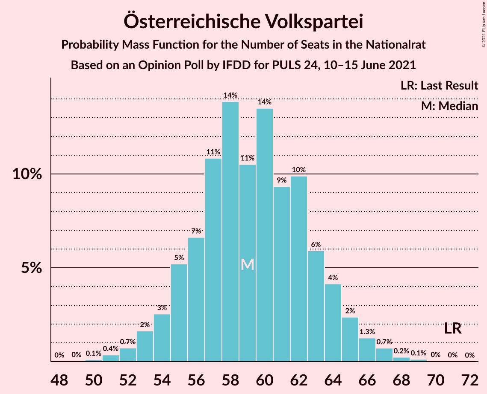

| Number of Seats | Probability | Accumulated | Special Marks |
|:---------------:|:-----------:|:-----------:|:-------------:|
| 49 | 0% | 100% |  |
| 50 | 0.1% | 99.9% |  |
| 51 | 0.4% | 99.8% |  |
| 52 | 0.7% | 99.5% |  |
| 53 | 2% | 98.8% |  |
| 54 | 3% | 97% |  |
| 55 | 5% | 95% |  |
| 56 | 7% | 89% |  |
| 57 | 11% | 83% |  |
| 58 | 14% | 72% |  |
| 59 | 11% | 58% | Median |
| 60 | 14% | 48% |  |
| 61 | 9% | 34% |  |
| 62 | 10% | 25% |  |
| 63 | 6% | 15% |  |
| 64 | 4% | 9% |  |
| 65 | 2% | 5% |  |
| 66 | 1.3% | 2% |  |
| 67 | 0.7% | 1.1% |  |
| 68 | 0.2% | 0.4% |  |
| 69 | 0.1% | 0.2% |  |
| 70 | 0% | 0.1% |  |
| 71 | 0% | 0% | Last Result |

### Sozialdemokratische Partei Österreichs

*For a full overview of the results for this party, see the [Sozialdemokratische Partei Österreichs](party-sozialdemokratischeparteiösterreichs.html) page.*

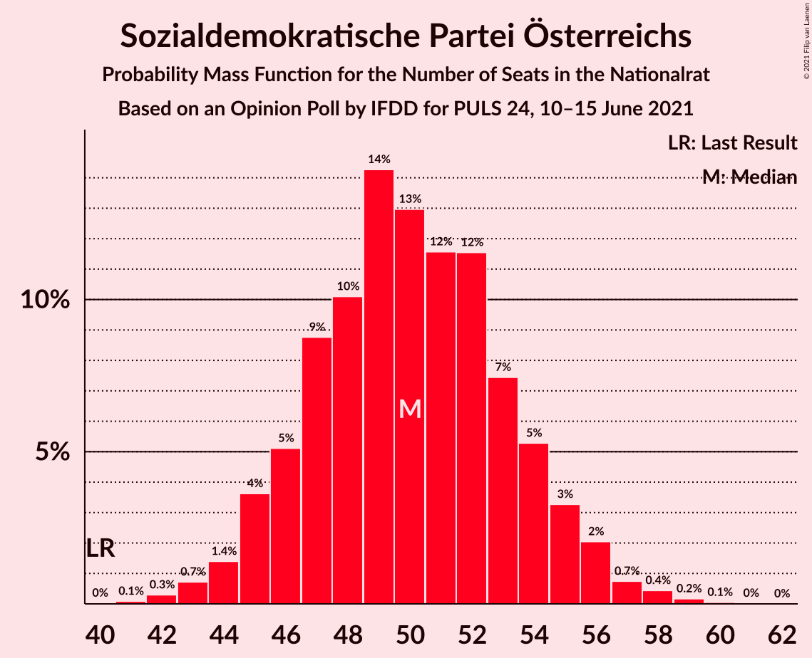

| Number of Seats | Probability | Accumulated | Special Marks |
|:---------------:|:-----------:|:-----------:|:-------------:|
| 40 | 0% | 100% | Last Result |
| 41 | 0.1% | 100% |  |
| 42 | 0.3% | 99.9% |  |
| 43 | 0.7% | 99.6% |  |
| 44 | 1.4% | 98.9% |  |
| 45 | 4% | 97% |  |
| 46 | 5% | 94% |  |
| 47 | 9% | 89% |  |
| 48 | 10% | 80% |  |
| 49 | 14% | 70% |  |
| 50 | 13% | 56% | Median |
| 51 | 12% | 43% |  |
| 52 | 12% | 31% |  |
| 53 | 7% | 19% |  |
| 54 | 5% | 12% |  |
| 55 | 3% | 7% |  |
| 56 | 2% | 3% |  |
| 57 | 0.7% | 1.4% |  |
| 58 | 0.4% | 0.7% |  |
| 59 | 0.2% | 0.3% |  |
| 60 | 0.1% | 0.1% |  |
| 61 | 0% | 0% |  |

### Freiheitliche Partei Österreichs

*For a full overview of the results for this party, see the [Freiheitliche Partei Österreichs](party-freiheitlicheparteiösterreichs.html) page.*

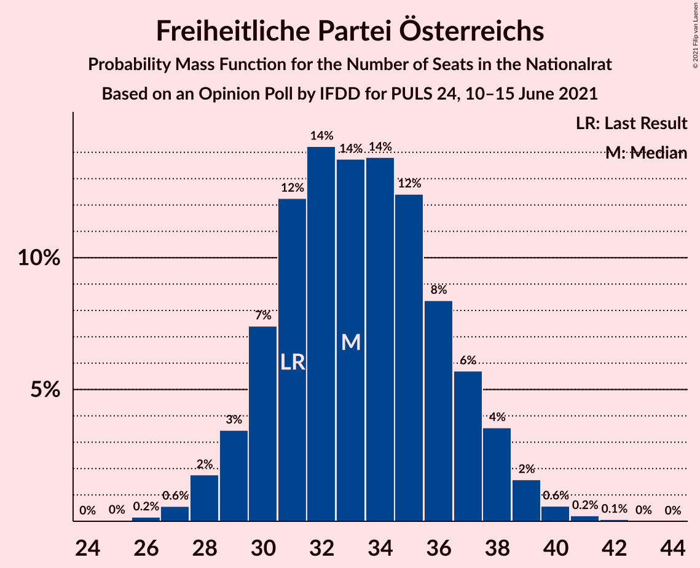

| Number of Seats | Probability | Accumulated | Special Marks |
|:---------------:|:-----------:|:-----------:|:-------------:|
| 26 | 0.2% | 100% |  |
| 27 | 0.6% | 99.8% |  |
| 28 | 2% | 99.2% |  |
| 29 | 3% | 97% |  |
| 30 | 7% | 94% |  |
| 31 | 12% | 87% | Last Result |
| 32 | 14% | 74% |  |
| 33 | 14% | 60% | Median |
| 34 | 14% | 46% |  |
| 35 | 12% | 33% |  |
| 36 | 8% | 20% |  |
| 37 | 6% | 12% |  |
| 38 | 4% | 6% |  |
| 39 | 2% | 2% |  |
| 40 | 0.6% | 0.9% |  |
| 41 | 0.2% | 0.3% |  |
| 42 | 0.1% | 0.1% |  |
| 43 | 0% | 0% |  |

### NEOS–Das Neue Österreich und Liberales Forum

*For a full overview of the results for this party, see the [NEOS–Das Neue Österreich und Liberales Forum](party-neos–dasneueösterreichundliberalesforum.html) page.*

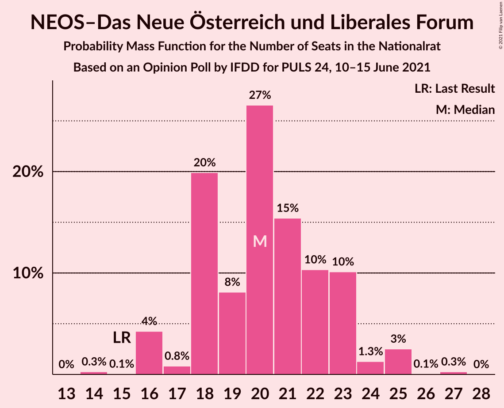

| Number of Seats | Probability | Accumulated | Special Marks |
|:---------------:|:-----------:|:-----------:|:-------------:|
| 14 | 0.3% | 100% |  |
| 15 | 0.1% | 99.7% | Last Result |
| 16 | 4% | 99.7% |  |
| 17 | 0.8% | 95% |  |
| 18 | 20% | 95% |  |
| 19 | 8% | 75% |  |
| 20 | 27% | 67% | Median |
| 21 | 15% | 40% |  |
| 22 | 10% | 25% |  |
| 23 | 10% | 14% |  |
| 24 | 1.3% | 4% |  |
| 25 | 3% | 3% |  |
| 26 | 0.1% | 0.3% |  |
| 27 | 0.3% | 0.3% |  |
| 28 | 0% | 0% |  |

### Die Grünen–Die Grüne Alternative

*For a full overview of the results for this party, see the [Die Grünen–Die Grüne Alternative](party-diegrünen–diegrünealternative.html) page.*

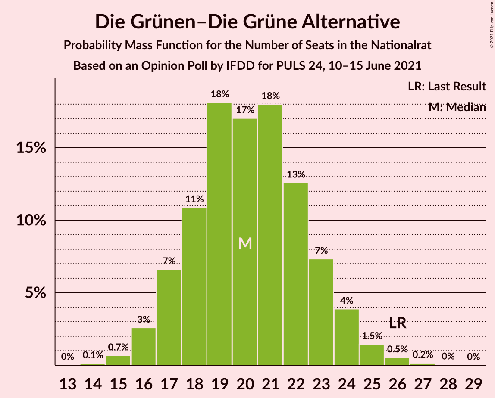

| Number of Seats | Probability | Accumulated | Special Marks |
|:---------------:|:-----------:|:-----------:|:-------------:|
| 14 | 0.1% | 100% |  |
| 15 | 0.7% | 99.9% |  |
| 16 | 3% | 99.2% |  |
| 17 | 7% | 97% |  |
| 18 | 11% | 90% |  |
| 19 | 18% | 79% |  |
| 20 | 17% | 61% | Median |
| 21 | 18% | 44% |  |
| 22 | 13% | 26% |  |
| 23 | 7% | 13% |  |
| 24 | 4% | 6% |  |
| 25 | 1.5% | 2% |  |
| 26 | 0.5% | 0.7% | Last Result |
| 27 | 0.2% | 0.2% |  |
| 28 | 0% | 0.1% |  |
| 29 | 0% | 0% |  |

## Coalitions

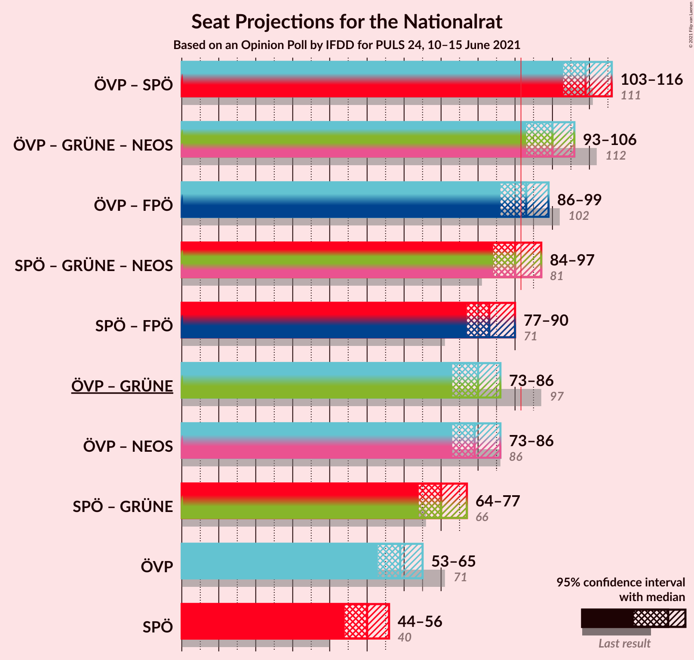

### Confidence Intervals

| Coalition | Last Result | Median | Majority? | 80% Confidence Interval | 90% Confidence Interval | 95% Confidence Interval | 99% Confidence Interval |
|:---------:|:-----------:|:------:|:---------:|:-----------------------:|:-----------------------:|:-----------------------:|:-----------------------:|
| Österreichische Volkspartei – Sozialdemokratische Partei Österreichs | 111 | 109 | 100% | 105–113 | 104–115 | 103–116 | 101–118 |
| Österreichische Volkspartei – Die Grünen–Die Grüne Alternative – NEOS–Das Neue Österreich und Liberales Forum | 112 | 100 | 99.2% | 95–104 | 94–105 | 93–106 | 91–108 |
| Österreichische Volkspartei – Freiheitliche Partei Österreichs | 102 | 93 | 63% | 88–97 | 87–98 | 86–99 | 84–101 |
| Sozialdemokratische Partei Österreichs – Die Grünen–Die Grüne Alternative – NEOS–Das Neue Österreich und Liberales Forum | 81 | 90 | 37% | 86–95 | 85–96 | 84–97 | 82–99 |
| Sozialdemokratische Partei Österreichs – Freiheitliche Partei Österreichs | 71 | 83 | 0.8% | 79–88 | 78–89 | 77–90 | 75–92 |
| Österreichische Volkspartei – Die Grünen–Die Grüne Alternative | 97 | 80 | 0% | 75–84 | 74–85 | 73–86 | 71–88 |
| Österreichische Volkspartei – NEOS–Das Neue Österreich und Liberales Forum | 86 | 79 | 0% | 75–84 | 74–85 | 73–86 | 71–88 |
| Sozialdemokratische Partei Österreichs – Die Grünen–Die Grüne Alternative | 66 | 70 | 0% | 66–75 | 65–76 | 64–77 | 62–78 |
| Österreichische Volkspartei | 71 | 59 | 0% | 55–63 | 54–64 | 53–65 | 51–67 |
| Sozialdemokratische Partei Österreichs | 40 | 50 | 0% | 46–54 | 45–55 | 44–56 | 43–58 |

### Österreichische Volkspartei – Sozialdemokratische Partei Österreichs

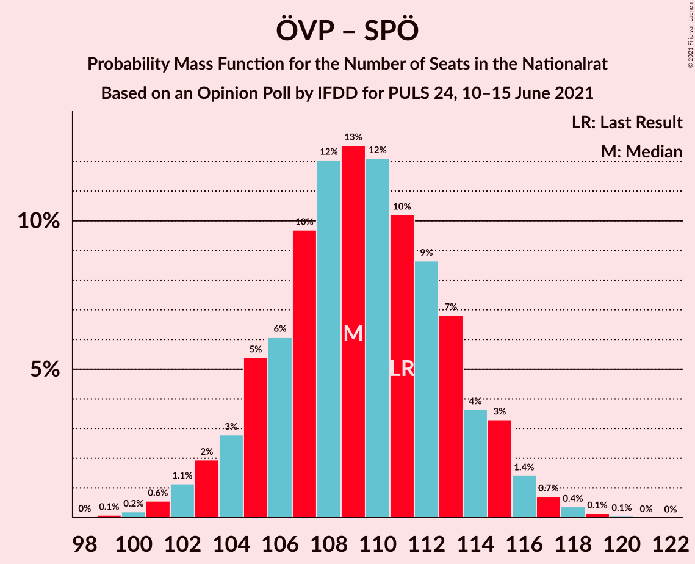

| Number of Seats | Probability | Accumulated | Special Marks |
|:---------------:|:-----------:|:-----------:|:-------------:|
| 99 | 0.1% | 100% |  |
| 100 | 0.2% | 99.9% |  |
| 101 | 0.6% | 99.7% |  |
| 102 | 1.1% | 99.1% |  |
| 103 | 2% | 98% |  |
| 104 | 3% | 96% |  |
| 105 | 5% | 93% |  |
| 106 | 6% | 88% |  |
| 107 | 10% | 82% |  |
| 108 | 12% | 72% |  |
| 109 | 13% | 60% | Median |
| 110 | 12% | 47% |  |
| 111 | 10% | 35% | Last Result |
| 112 | 9% | 25% |  |
| 113 | 7% | 16% |  |
| 114 | 4% | 10% |  |
| 115 | 3% | 6% |  |
| 116 | 1.4% | 3% |  |
| 117 | 0.7% | 1.3% |  |
| 118 | 0.4% | 0.6% |  |
| 119 | 0.1% | 0.2% |  |
| 120 | 0.1% | 0.1% |  |
| 121 | 0% | 0% |  |

### Österreichische Volkspartei – Die Grünen–Die Grüne Alternative – NEOS–Das Neue Österreich und Liberales Forum

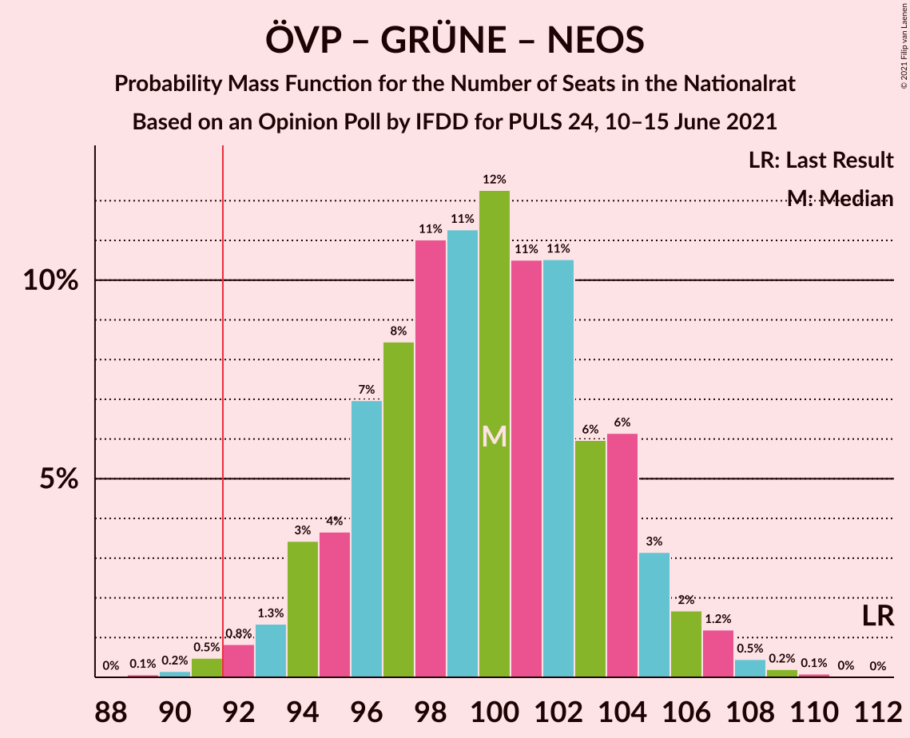

| Number of Seats | Probability | Accumulated | Special Marks |
|:---------------:|:-----------:|:-----------:|:-------------:|
| 89 | 0.1% | 100% |  |
| 90 | 0.2% | 99.9% |  |
| 91 | 0.5% | 99.7% |  |
| 92 | 0.8% | 99.2% | Majority |
| 93 | 1.3% | 98% |  |
| 94 | 3% | 97% |  |
| 95 | 4% | 94% |  |
| 96 | 7% | 90% |  |
| 97 | 8% | 83% |  |
| 98 | 11% | 75% |  |
| 99 | 11% | 64% | Median |
| 100 | 12% | 52% |  |
| 101 | 11% | 40% |  |
| 102 | 11% | 29% |  |
| 103 | 6% | 19% |  |
| 104 | 6% | 13% |  |
| 105 | 3% | 7% |  |
| 106 | 2% | 4% |  |
| 107 | 1.2% | 2% |  |
| 108 | 0.5% | 0.8% |  |
| 109 | 0.2% | 0.3% |  |
| 110 | 0.1% | 0.1% |  |
| 111 | 0% | 0% |  |
| 112 | 0% | 0% | Last Result |

### Österreichische Volkspartei – Freiheitliche Partei Österreichs

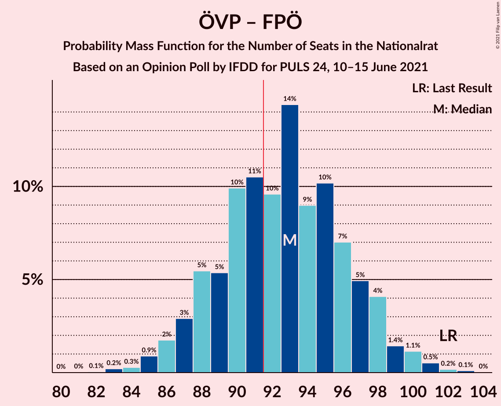

| Number of Seats | Probability | Accumulated | Special Marks |
|:---------------:|:-----------:|:-----------:|:-------------:|
| 82 | 0.1% | 100% |  |
| 83 | 0.2% | 99.9% |  |
| 84 | 0.3% | 99.7% |  |
| 85 | 0.9% | 99.4% |  |
| 86 | 2% | 98.5% |  |
| 87 | 3% | 97% |  |
| 88 | 5% | 94% |  |
| 89 | 5% | 88% |  |
| 90 | 10% | 83% |  |
| 91 | 11% | 73% |  |
| 92 | 10% | 63% | Median, Majority |
| 93 | 14% | 53% |  |
| 94 | 9% | 39% |  |
| 95 | 10% | 30% |  |
| 96 | 7% | 19% |  |
| 97 | 5% | 12% |  |
| 98 | 4% | 8% |  |
| 99 | 1.4% | 3% |  |
| 100 | 1.1% | 2% |  |
| 101 | 0.5% | 0.8% |  |
| 102 | 0.2% | 0.3% | Last Result |
| 103 | 0.1% | 0.1% |  |
| 104 | 0% | 0% |  |

### Sozialdemokratische Partei Österreichs – Die Grünen–Die Grüne Alternative – NEOS–Das Neue Österreich und Liberales Forum

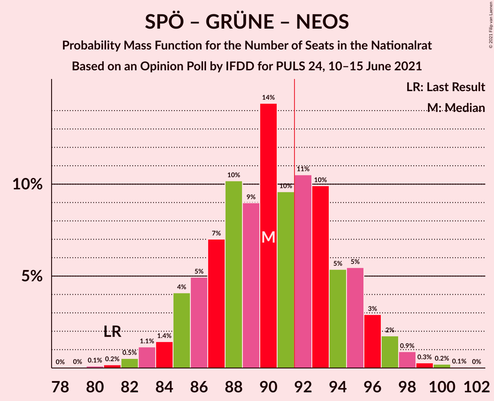

| Number of Seats | Probability | Accumulated | Special Marks |
|:---------------:|:-----------:|:-----------:|:-------------:|
| 80 | 0.1% | 100% |  |
| 81 | 0.2% | 99.9% | Last Result |
| 82 | 0.5% | 99.7% |  |
| 83 | 1.1% | 99.2% |  |
| 84 | 1.4% | 98% |  |
| 85 | 4% | 97% |  |
| 86 | 5% | 92% |  |
| 87 | 7% | 88% |  |
| 88 | 10% | 81% |  |
| 89 | 9% | 70% |  |
| 90 | 14% | 61% | Median |
| 91 | 10% | 47% |  |
| 92 | 11% | 37% | Majority |
| 93 | 10% | 27% |  |
| 94 | 5% | 17% |  |
| 95 | 5% | 12% |  |
| 96 | 3% | 6% |  |
| 97 | 2% | 3% |  |
| 98 | 0.9% | 1.5% |  |
| 99 | 0.3% | 0.6% |  |
| 100 | 0.2% | 0.3% |  |
| 101 | 0.1% | 0.1% |  |
| 102 | 0% | 0% |  |

### Sozialdemokratische Partei Österreichs – Freiheitliche Partei Österreichs

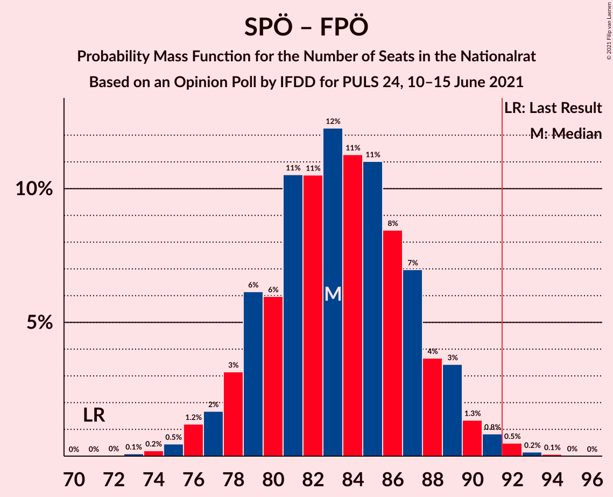

| Number of Seats | Probability | Accumulated | Special Marks |
|:---------------:|:-----------:|:-----------:|:-------------:|
| 71 | 0% | 100% | Last Result |
| 72 | 0% | 100% |  |
| 73 | 0.1% | 100% |  |
| 74 | 0.2% | 99.9% |  |
| 75 | 0.5% | 99.7% |  |
| 76 | 1.2% | 99.2% |  |
| 77 | 2% | 98% |  |
| 78 | 3% | 96% |  |
| 79 | 6% | 93% |  |
| 80 | 6% | 87% |  |
| 81 | 11% | 81% |  |
| 82 | 11% | 71% |  |
| 83 | 12% | 60% | Median |
| 84 | 11% | 48% |  |
| 85 | 11% | 36% |  |
| 86 | 8% | 25% |  |
| 87 | 7% | 17% |  |
| 88 | 4% | 10% |  |
| 89 | 3% | 6% |  |
| 90 | 1.3% | 3% |  |
| 91 | 0.8% | 2% |  |
| 92 | 0.5% | 0.8% | Majority |
| 93 | 0.2% | 0.3% |  |
| 94 | 0.1% | 0.1% |  |
| 95 | 0% | 0% |  |

### Österreichische Volkspartei – Die Grünen–Die Grüne Alternative

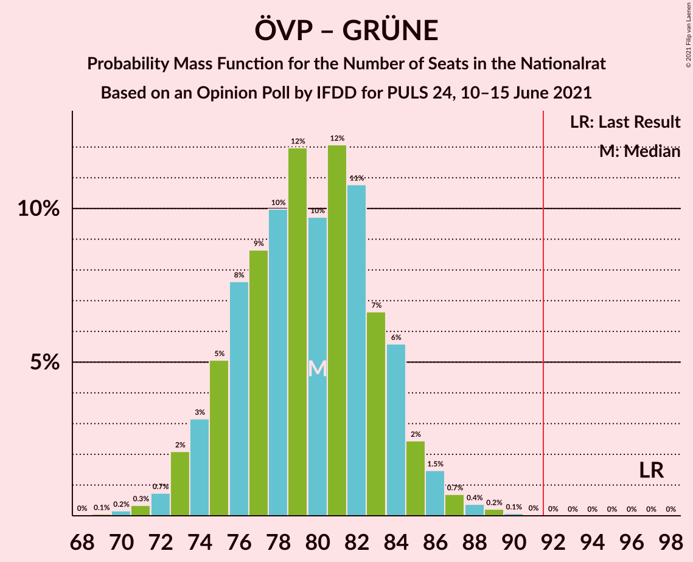

| Number of Seats | Probability | Accumulated | Special Marks |
|:---------------:|:-----------:|:-----------:|:-------------:|
| 69 | 0.1% | 100% |  |
| 70 | 0.2% | 99.9% |  |
| 71 | 0.3% | 99.7% |  |
| 72 | 0.7% | 99.4% |  |
| 73 | 2% | 98.7% |  |
| 74 | 3% | 97% |  |
| 75 | 5% | 93% |  |
| 76 | 8% | 88% |  |
| 77 | 9% | 81% |  |
| 78 | 10% | 72% |  |
| 79 | 12% | 62% | Median |
| 80 | 10% | 50% |  |
| 81 | 12% | 40% |  |
| 82 | 11% | 28% |  |
| 83 | 7% | 18% |  |
| 84 | 6% | 11% |  |
| 85 | 2% | 5% |  |
| 86 | 1.5% | 3% |  |
| 87 | 0.7% | 1.4% |  |
| 88 | 0.4% | 0.7% |  |
| 89 | 0.2% | 0.3% |  |
| 90 | 0.1% | 0.1% |  |
| 91 | 0% | 0.1% |  |
| 92 | 0% | 0% | Majority |
| 93 | 0% | 0% |  |
| 94 | 0% | 0% |  |
| 95 | 0% | 0% |  |
| 96 | 0% | 0% |  |
| 97 | 0% | 0% | Last Result |

### Österreichische Volkspartei – NEOS–Das Neue Österreich und Liberales Forum

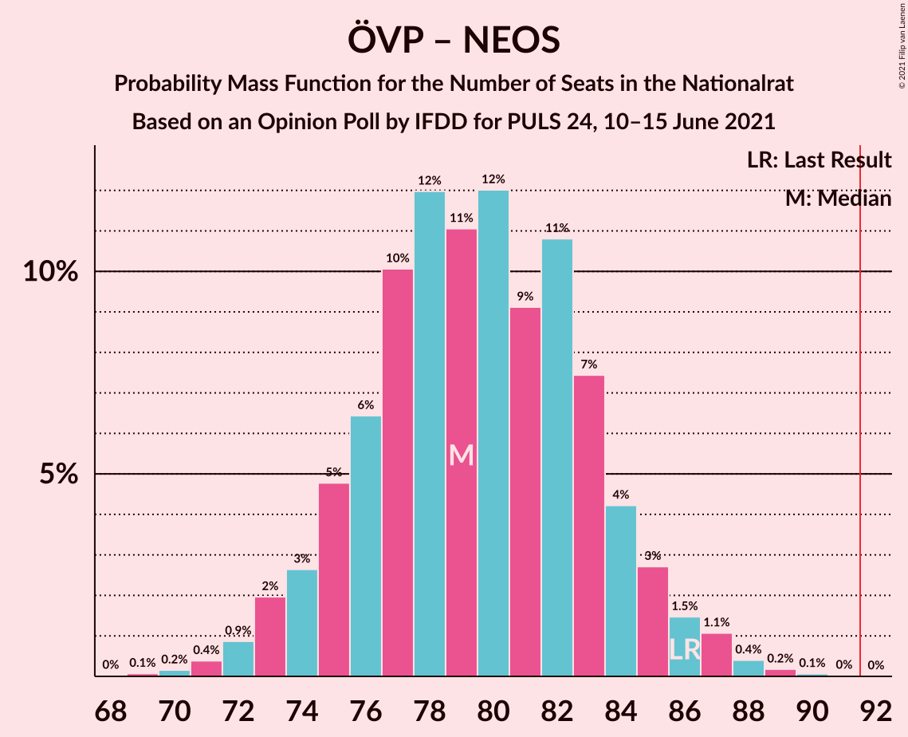

| Number of Seats | Probability | Accumulated | Special Marks |
|:---------------:|:-----------:|:-----------:|:-------------:|
| 69 | 0.1% | 100% |  |
| 70 | 0.2% | 99.9% |  |
| 71 | 0.4% | 99.7% |  |
| 72 | 0.9% | 99.3% |  |
| 73 | 2% | 98% |  |
| 74 | 3% | 97% |  |
| 75 | 5% | 94% |  |
| 76 | 6% | 89% |  |
| 77 | 10% | 83% |  |
| 78 | 12% | 73% |  |
| 79 | 11% | 61% | Median |
| 80 | 12% | 50% |  |
| 81 | 9% | 38% |  |
| 82 | 11% | 28% |  |
| 83 | 7% | 18% |  |
| 84 | 4% | 10% |  |
| 85 | 3% | 6% |  |
| 86 | 1.5% | 3% | Last Result |
| 87 | 1.1% | 2% |  |
| 88 | 0.4% | 0.7% |  |
| 89 | 0.2% | 0.3% |  |
| 90 | 0.1% | 0.1% |  |
| 91 | 0% | 0% |  |

### Sozialdemokratische Partei Österreichs – Die Grünen–Die Grüne Alternative

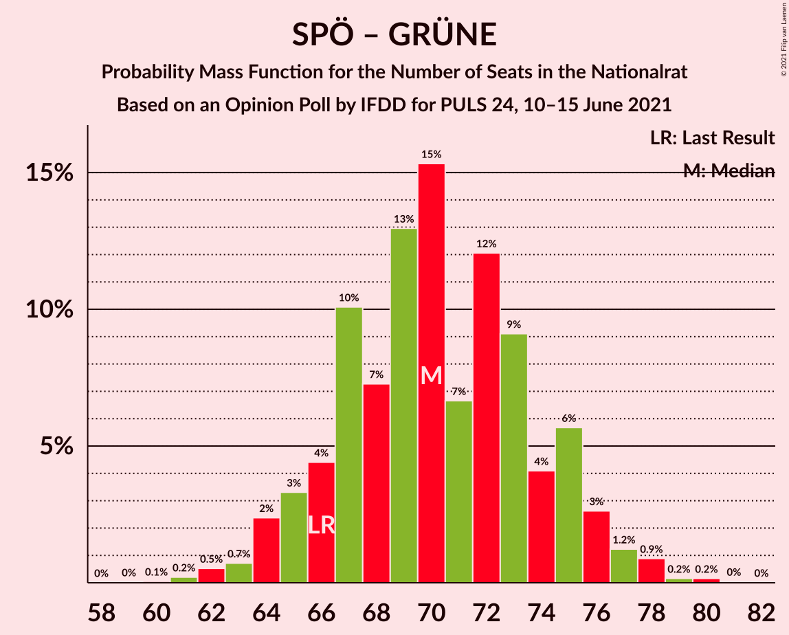

| Number of Seats | Probability | Accumulated | Special Marks |
|:---------------:|:-----------:|:-----------:|:-------------:|
| 60 | 0.1% | 100% |  |
| 61 | 0.2% | 99.9% |  |
| 62 | 0.5% | 99.7% |  |
| 63 | 0.7% | 99.2% |  |
| 64 | 2% | 98% |  |
| 65 | 3% | 96% |  |
| 66 | 4% | 93% | Last Result |
| 67 | 10% | 88% |  |
| 68 | 7% | 78% |  |
| 69 | 13% | 71% |  |
| 70 | 15% | 58% | Median |
| 71 | 7% | 43% |  |
| 72 | 12% | 36% |  |
| 73 | 9% | 24% |  |
| 74 | 4% | 15% |  |
| 75 | 6% | 11% |  |
| 76 | 3% | 5% |  |
| 77 | 1.2% | 3% |  |
| 78 | 0.9% | 1.3% |  |
| 79 | 0.2% | 0.4% |  |
| 80 | 0.2% | 0.2% |  |
| 81 | 0% | 0.1% |  |
| 82 | 0% | 0% |  |

### Österreichische Volkspartei

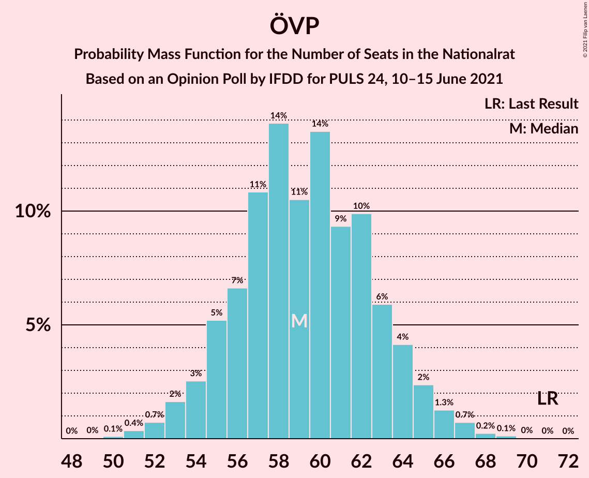

| Number of Seats | Probability | Accumulated | Special Marks |
|:---------------:|:-----------:|:-----------:|:-------------:|
| 49 | 0% | 100% |  |
| 50 | 0.1% | 99.9% |  |
| 51 | 0.4% | 99.8% |  |
| 52 | 0.7% | 99.5% |  |
| 53 | 2% | 98.8% |  |
| 54 | 3% | 97% |  |
| 55 | 5% | 95% |  |
| 56 | 7% | 89% |  |
| 57 | 11% | 83% |  |
| 58 | 14% | 72% |  |
| 59 | 11% | 58% | Median |
| 60 | 14% | 48% |  |
| 61 | 9% | 34% |  |
| 62 | 10% | 25% |  |
| 63 | 6% | 15% |  |
| 64 | 4% | 9% |  |
| 65 | 2% | 5% |  |
| 66 | 1.3% | 2% |  |
| 67 | 0.7% | 1.1% |  |
| 68 | 0.2% | 0.4% |  |
| 69 | 0.1% | 0.2% |  |
| 70 | 0% | 0.1% |  |
| 71 | 0% | 0% | Last Result |

### Sozialdemokratische Partei Österreichs

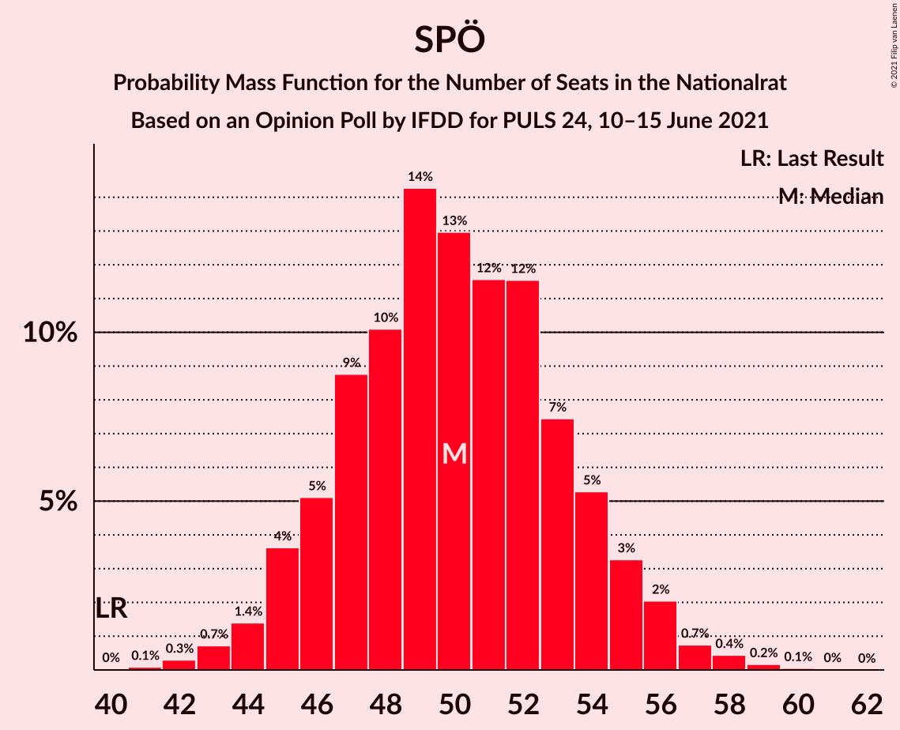

| Number of Seats | Probability | Accumulated | Special Marks |
|:---------------:|:-----------:|:-----------:|:-------------:|
| 40 | 0% | 100% | Last Result |
| 41 | 0.1% | 100% |  |
| 42 | 0.3% | 99.9% |  |
| 43 | 0.7% | 99.6% |  |
| 44 | 1.4% | 98.9% |  |
| 45 | 4% | 97% |  |
| 46 | 5% | 94% |  |
| 47 | 9% | 89% |  |
| 48 | 10% | 80% |  |
| 49 | 14% | 70% |  |
| 50 | 13% | 56% | Median |
| 51 | 12% | 43% |  |
| 52 | 12% | 31% |  |
| 53 | 7% | 19% |  |
| 54 | 5% | 12% |  |
| 55 | 3% | 7% |  |
| 56 | 2% | 3% |  |
| 57 | 0.7% | 1.4% |  |
| 58 | 0.4% | 0.7% |  |
| 59 | 0.2% | 0.3% |  |
| 60 | 0.1% | 0.1% |  |
| 61 | 0% | 0% |  |

## Technical Information

### Opinion Poll

+ **Polling firm:** IFDD
+ **Commissioner(s):** PULS 24
+ **Fieldwork period:** 10–15 June 2021

### Calculations

+ **Sample size:** 803
+ **Simulations done:** 131,072
+ **Error estimate:** 1.19%

