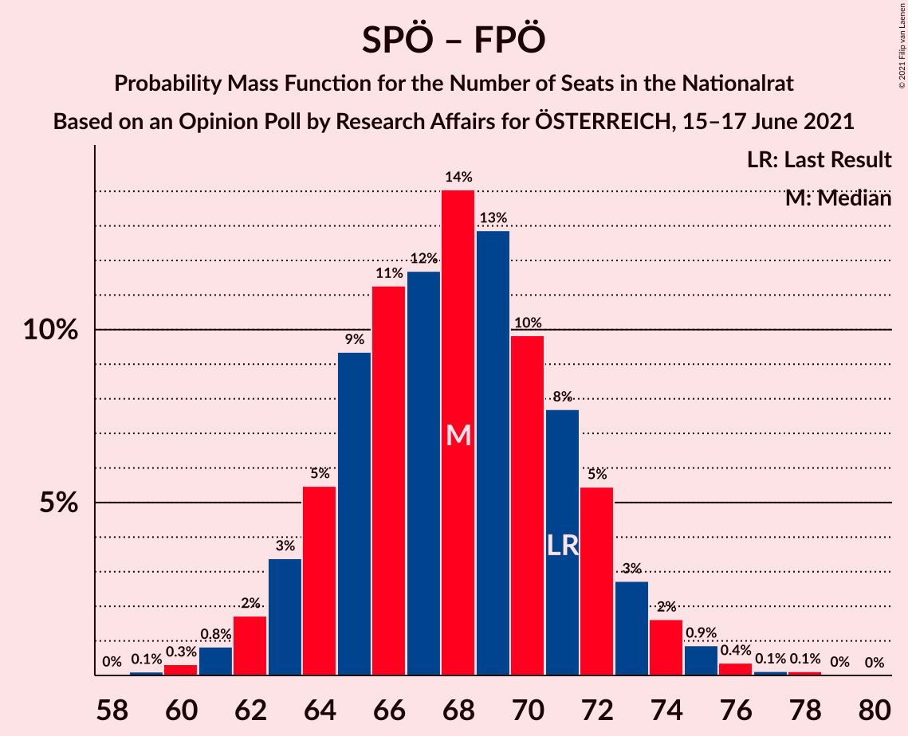

# Opinion Poll by Research Affairs for ÖSTERREICH, 15–17 June 2021

<a href="#voting-intentions">Voting Intentions</a> | <a href="#seats">Seats</a> | <a href="#coalitions">Coalitions</a> | <a href="#technical-information">Technical Information</a>

## Voting Intentions

### Confidence Intervals

| Party | Last Result | Poll Result | 80% Confidence Interval | 90% Confidence Interval | 95% Confidence Interval | 99% Confidence Interval |
|:-----:|:-----------:|:-----------:|:-----------------------:|:-----------------------:|:-----------------------:|:-----------------------:|
| Österreichische Volkspartei | 37.5% | 35.0% | 33.1–37.0% |32.6–37.5% |32.1–38.0% |31.2–39.0% |
| Sozialdemokratische Partei Österreichs | 21.2% | 22.0% | 20.4–23.7% |19.9–24.2% |19.5–24.7% |18.8–25.5% |
| Freiheitliche Partei Österreichs | 16.2% | 15.0% | 13.6–16.5% |13.2–17.0% |12.9–17.4% |12.3–18.1% |
| Die Grünen–Die Grüne Alternative | 13.9% | 12.0% | 10.8–13.4% |10.4–13.8% |10.1–14.2% |9.6–14.9% |
| NEOS–Das Neue Österreich und Liberales Forum | 8.1% | 11.0% | 9.8–12.4% |9.5–12.8% |9.2–13.1% |8.7–13.8% |

*Note:* The poll result column reflects the actual value used in the calculations. Published results may vary slightly, and in addition be rounded to fewer digits.

## Seats

### Confidence Intervals

| Party | Last Result | Median | 80% Confidence Interval | 90% Confidence Interval | 95% Confidence Interval | 99% Confidence Interval |
|:-----:|:-----------:|:------:|:-----------------------:|:-----------------------:|:-----------------------:|:-----------------------:|
| <a href="#österreichische-volkspartei">Österreichische Volkspartei</a> | 71 | 64 | 61–68 |60–69 |59–70 |57–72 |
| <a href="#sozialdemokratische-partei-österreichs">Sozialdemokratische Partei Österreichs</a> | 40 | 40 | 37–44 |36–45 |36–45 |34–47 |
| <a href="#freiheitliche-partei-österreichs">Freiheitliche Partei Österreichs</a> | 31 | 27 | 25–30 |24–31 |23–32 |22–33 |
| <a href="#die-grünen–die-grüne-alternative">Die Grünen–Die Grüne Alternative</a> | 26 | 22 | 19–24 |19–25 |18–26 |17–27 |
| <a href="#neos–das-neue-österreich-und-liberales-forum">NEOS–Das Neue Österreich und Liberales Forum</a> | 15 | 20 | 18–22 |17–23 |17–24 |16–25 |

### Österreichische Volkspartei

*For a full overview of the results for this party, see the [Österreichische Volkspartei](party-österreichischevolkspartei.html) page.*

| Number of Seats | Probability | Accumulated | Special Marks |
|:---------------:|:-----------:|:-----------:|:-------------:|
| 55 | 0% | 100% |  |
| 56 | 0.1% | 99.9% |  |
| 57 | 0.4% | 99.8% |  |
| 58 | 1.0% | 99.4% |  |
| 59 | 2% | 98% |  |
| 60 | 4% | 96% |  |
| 61 | 7% | 92% |  |
| 62 | 10% | 85% |  |
| 63 | 12% | 75% |  |
| 64 | 13% | 63% | Median |
| 65 | 13% | 50% |  |
| 66 | 12% | 37% |  |
| 67 | 10% | 25% |  |
| 68 | 5% | 14% |  |
| 69 | 5% | 9% |  |
| 70 | 2% | 4% |  |
| 71 | 1.4% | 2% | Last Result |
| 72 | 0.5% | 0.9% |  |
| 73 | 0.3% | 0.4% |  |
| 74 | 0.1% | 0.2% |  |
| 75 | 0% | 0.1% |  |
| 76 | 0% | 0% |  |

### Sozialdemokratische Partei Österreichs

*For a full overview of the results for this party, see the [Sozialdemokratische Partei Österreichs](party-sozialdemokratischeparteiösterreichs.html) page.*

| Number of Seats | Probability | Accumulated | Special Marks |
|:---------------:|:-----------:|:-----------:|:-------------:|
| 33 | 0.1% | 100% |  |
| 34 | 0.5% | 99.8% |  |
| 35 | 1.4% | 99.3% |  |
| 36 | 3% | 98% |  |
| 37 | 7% | 95% |  |
| 38 | 10% | 88% |  |
| 39 | 15% | 78% |  |
| 40 | 15% | 63% | Last Result, Median |
| 41 | 16% | 48% |  |
| 42 | 11% | 32% |  |
| 43 | 10% | 21% |  |
| 44 | 5% | 11% |  |
| 45 | 3% | 6% |  |
| 46 | 1.3% | 2% |  |
| 47 | 0.6% | 0.9% |  |
| 48 | 0.2% | 0.3% |  |
| 49 | 0.1% | 0.1% |  |
| 50 | 0% | 0% |  |

### Freiheitliche Partei Österreichs

*For a full overview of the results for this party, see the [Freiheitliche Partei Österreichs](party-freiheitlicheparteiösterreichs.html) page.*

| Number of Seats | Probability | Accumulated | Special Marks |
|:---------------:|:-----------:|:-----------:|:-------------:|
| 21 | 0.1% | 100% |  |
| 22 | 0.6% | 99.9% |  |
| 23 | 2% | 99.3% |  |
| 24 | 5% | 97% |  |
| 25 | 10% | 92% |  |
| 26 | 14% | 82% |  |
| 27 | 19% | 68% | Median |
| 28 | 17% | 48% |  |
| 29 | 15% | 31% |  |
| 30 | 8% | 17% |  |
| 31 | 5% | 8% | Last Result |
| 32 | 2% | 3% |  |
| 33 | 0.9% | 1.2% |  |
| 34 | 0.2% | 0.3% |  |
| 35 | 0.1% | 0.1% |  |
| 36 | 0% | 0% |  |

### Die Grünen–Die Grüne Alternative

*For a full overview of the results for this party, see the [Die Grünen–Die Grüne Alternative](party-diegrünen–diegrünealternative.html) page.*

| Number of Seats | Probability | Accumulated | Special Marks |
|:---------------:|:-----------:|:-----------:|:-------------:|
| 16 | 0.1% | 100% |  |
| 17 | 0.6% | 99.9% |  |
| 18 | 2% | 99.3% |  |
| 19 | 7% | 97% |  |
| 20 | 13% | 90% |  |
| 21 | 20% | 77% |  |
| 22 | 19% | 56% | Median |
| 23 | 18% | 38% |  |
| 24 | 11% | 20% |  |
| 25 | 5% | 8% |  |
| 26 | 3% | 4% | Last Result |
| 27 | 0.8% | 1.2% |  |
| 28 | 0.3% | 0.3% |  |
| 29 | 0.1% | 0.1% |  |
| 30 | 0% | 0% |  |

### NEOS–Das Neue Österreich und Liberales Forum

*For a full overview of the results for this party, see the [NEOS–Das Neue Österreich und Liberales Forum](party-neos–dasneueösterreichundliberalesforum.html) page.*

| Number of Seats | Probability | Accumulated | Special Marks |
|:---------------:|:-----------:|:-----------:|:-------------:|
| 14 | 0% | 100% |  |
| 15 | 0.4% | 99.9% | Last Result |
| 16 | 2% | 99.6% |  |
| 17 | 6% | 98% |  |
| 18 | 13% | 92% |  |
| 19 | 18% | 79% |  |
| 20 | 21% | 61% | Median |
| 21 | 17% | 40% |  |
| 22 | 13% | 23% |  |
| 23 | 6% | 10% |  |
| 24 | 3% | 4% |  |
| 25 | 0.8% | 1.1% |  |
| 26 | 0.3% | 0.3% |  |
| 27 | 0.1% | 0.1% |  |
| 28 | 0% | 0% |  |

## Coalitions

### Confidence Intervals

| Coalition | Last Result | Median | Majority? | 80% Confidence Interval | 90% Confidence Interval | 95% Confidence Interval | 99% Confidence Interval |
|:---------:|:-----------:|:------:|:---------:|:-----------------------:|:-----------------------:|:-----------------------:|:-----------------------:|
| Österreichische Volkspartei – Die Grünen–Die Grüne Alternative – NEOS–Das Neue Österreich und Liberales Forum | 112 | 106 | 100% | 103–110 | 102–112 | 100–113 | 99–115 |
| Österreichische Volkspartei – Sozialdemokratische Partei Österreichs | 111 | 105 | 100% | 101–109 | 100–110 | 99–112 | 97–114 |
| Österreichische Volkspartei – Freiheitliche Partei Österreichs | 102 | 92 | 56% | 88–96 | 87–97 | 86–98 | 84–101 |
| Österreichische Volkspartei – Die Grünen–Die Grüne Alternative | 97 | 86 | 5% | 83–90 | 82–91 | 80–93 | 79–95 |
| Österreichische Volkspartei – NEOS–Das Neue Österreich und Liberales Forum | 86 | 85 | 1.4% | 81–89 | 80–90 | 79–91 | 77–93 |
| Sozialdemokratische Partei Österreichs – Die Grünen–Die Grüne Alternative – NEOS–Das Neue Österreich und Liberales Forum | 81 | 82 | 0.3% | 79–86 | 77–88 | 77–89 | 75–91 |
| Sozialdemokratische Partei Österreichs – Freiheitliche Partei Österreichs | 71 | 68 | 0% | 64–72 | 63–73 | 62–74 | 61–76 |
| Österreichische Volkspartei | 71 | 64 | 0% | 61–68 | 60–69 | 59–70 | 57–72 |
| Sozialdemokratische Partei Österreichs – Die Grünen–Die Grüne Alternative | 66 | 62 | 0% | 59–66 | 58–67 | 57–68 | 55–70 |
| Sozialdemokratische Partei Österreichs | 40 | 40 | 0% | 37–44 | 36–45 | 36–45 | 34–47 |

### Österreichische Volkspartei – Die Grünen–Die Grüne Alternative – NEOS–Das Neue Österreich und Liberales Forum

| Number of Seats | Probability | Accumulated | Special Marks |
|:---------------:|:-----------:|:-----------:|:-------------:|
| 97 | 0.1% | 100% |  |
| 98 | 0.2% | 99.9% |  |
| 99 | 0.6% | 99.6% |  |
| 100 | 2% | 99.1% |  |
| 101 | 2% | 97% |  |
| 102 | 5% | 95% |  |
| 103 | 9% | 91% |  |
| 104 | 8% | 82% |  |
| 105 | 12% | 74% |  |
| 106 | 15% | 62% | Median |
| 107 | 10% | 47% |  |
| 108 | 10% | 37% |  |
| 109 | 11% | 27% |  |
| 110 | 6% | 16% |  |
| 111 | 3% | 10% |  |
| 112 | 4% | 6% | Last Result |
| 113 | 0.9% | 3% |  |
| 114 | 0.7% | 2% |  |
| 115 | 0.9% | 1.3% |  |
| 116 | 0.1% | 0.4% |  |
| 117 | 0.1% | 0.3% |  |
| 118 | 0.1% | 0.1% |  |
| 119 | 0.1% | 0.1% |  |
| 120 | 0% | 0% |  |

### Österreichische Volkspartei – Sozialdemokratische Partei Österreichs

| Number of Seats | Probability | Accumulated | Special Marks |
|:---------------:|:-----------:|:-----------:|:-------------:|
| 95 | 0.1% | 100% |  |
| 96 | 0.2% | 99.9% |  |
| 97 | 0.5% | 99.8% |  |
| 98 | 0.9% | 99.3% |  |
| 99 | 2% | 98% |  |
| 100 | 4% | 97% |  |
| 101 | 6% | 92% |  |
| 102 | 9% | 87% |  |
| 103 | 9% | 78% |  |
| 104 | 14% | 69% | Median |
| 105 | 12% | 55% |  |
| 106 | 15% | 43% |  |
| 107 | 9% | 28% |  |
| 108 | 7% | 19% |  |
| 109 | 4% | 12% |  |
| 110 | 4% | 8% |  |
| 111 | 2% | 5% | Last Result |
| 112 | 2% | 3% |  |
| 113 | 0.7% | 1.3% |  |
| 114 | 0.3% | 0.6% |  |
| 115 | 0.1% | 0.3% |  |
| 116 | 0.1% | 0.2% |  |
| 117 | 0.1% | 0.1% |  |
| 118 | 0% | 0% |  |

### Österreichische Volkspartei – Freiheitliche Partei Österreichs

| Number of Seats | Probability | Accumulated | Special Marks |
|:---------------:|:-----------:|:-----------:|:-------------:|
| 82 | 0.1% | 100% |  |
| 83 | 0.1% | 99.9% |  |
| 84 | 0.4% | 99.8% |  |
| 85 | 0.9% | 99.4% |  |
| 86 | 2% | 98% |  |
| 87 | 4% | 96% |  |
| 88 | 6% | 93% |  |
| 89 | 9% | 87% |  |
| 90 | 10% | 78% |  |
| 91 | 13% | 68% | Median |
| 92 | 14% | 56% | Majority |
| 93 | 11% | 42% |  |
| 94 | 9% | 31% |  |
| 95 | 8% | 21% |  |
| 96 | 5% | 13% |  |
| 97 | 3% | 8% |  |
| 98 | 2% | 4% |  |
| 99 | 1.1% | 2% |  |
| 100 | 0.5% | 1.1% |  |
| 101 | 0.3% | 0.6% |  |
| 102 | 0.1% | 0.3% | Last Result |
| 103 | 0.1% | 0.1% |  |
| 104 | 0% | 0% |  |

### Österreichische Volkspartei – Die Grünen–Die Grüne Alternative

| Number of Seats | Probability | Accumulated | Special Marks |
|:---------------:|:-----------:|:-----------:|:-------------:|
| 77 | 0.1% | 100% |  |
| 78 | 0.3% | 99.9% |  |
| 79 | 0.6% | 99.6% |  |
| 80 | 1.5% | 98.9% |  |
| 81 | 2% | 97% |  |
| 82 | 5% | 95% |  |
| 83 | 7% | 90% |  |
| 84 | 10% | 84% |  |
| 85 | 14% | 73% |  |
| 86 | 13% | 59% | Median |
| 87 | 10% | 46% |  |
| 88 | 9% | 36% |  |
| 89 | 11% | 27% |  |
| 90 | 7% | 16% |  |
| 91 | 4% | 9% |  |
| 92 | 2% | 5% | Majority |
| 93 | 1.3% | 3% |  |
| 94 | 0.8% | 2% |  |
| 95 | 0.4% | 0.7% |  |
| 96 | 0.2% | 0.3% |  |
| 97 | 0.1% | 0.1% | Last Result |
| 98 | 0% | 0.1% |  |
| 99 | 0% | 0% |  |

### Österreichische Volkspartei – NEOS–Das Neue Österreich und Liberales Forum

| Number of Seats | Probability | Accumulated | Special Marks |
|:---------------:|:-----------:|:-----------:|:-------------:|
| 75 | 0.1% | 100% |  |
| 76 | 0.3% | 99.9% |  |
| 77 | 0.6% | 99.6% |  |
| 78 | 1.1% | 99.0% |  |
| 79 | 2% | 98% |  |
| 80 | 4% | 96% |  |
| 81 | 9% | 92% |  |
| 82 | 11% | 83% |  |
| 83 | 7% | 71% |  |
| 84 | 9% | 64% | Median |
| 85 | 15% | 55% |  |
| 86 | 18% | 40% | Last Result |
| 87 | 8% | 22% |  |
| 88 | 4% | 15% |  |
| 89 | 4% | 11% |  |
| 90 | 4% | 7% |  |
| 91 | 2% | 3% |  |
| 92 | 0.7% | 1.4% | Majority |
| 93 | 0.2% | 0.7% |  |
| 94 | 0.3% | 0.5% |  |
| 95 | 0.1% | 0.2% |  |
| 96 | 0.1% | 0.1% |  |
| 97 | 0% | 0% |  |

### Sozialdemokratische Partei Österreichs – Die Grünen–Die Grüne Alternative – NEOS–Das Neue Österreich und Liberales Forum

| Number of Seats | Probability | Accumulated | Special Marks |
|:---------------:|:-----------:|:-----------:|:-------------:|
| 73 | 0.1% | 100% |  |
| 74 | 0.3% | 99.9% |  |
| 75 | 0.6% | 99.6% |  |
| 76 | 1.4% | 99.0% |  |
| 77 | 3% | 98% |  |
| 78 | 4% | 95% |  |
| 79 | 8% | 90% |  |
| 80 | 10% | 83% |  |
| 81 | 11% | 73% | Last Result |
| 82 | 13% | 61% | Median |
| 83 | 13% | 48% |  |
| 84 | 11% | 35% |  |
| 85 | 9% | 24% |  |
| 86 | 6% | 16% |  |
| 87 | 4% | 9% |  |
| 88 | 2% | 5% |  |
| 89 | 1.4% | 3% |  |
| 90 | 0.6% | 1.3% |  |
| 91 | 0.4% | 0.7% |  |
| 92 | 0.2% | 0.3% | Majority |
| 93 | 0.1% | 0.1% |  |
| 94 | 0% | 0.1% |  |
| 95 | 0% | 0% |  |

### Sozialdemokratische Partei Österreichs – Freiheitliche Partei Österreichs

| Number of Seats | Probability | Accumulated | Special Marks |
|:---------------:|:-----------:|:-----------:|:-------------:|
| 59 | 0.1% | 100% |  |
| 60 | 0.3% | 99.8% |  |
| 61 | 0.8% | 99.5% |  |
| 62 | 2% | 98.7% |  |
| 63 | 3% | 97% |  |
| 64 | 5% | 94% |  |
| 65 | 9% | 88% |  |
| 66 | 11% | 79% |  |
| 67 | 12% | 67% | Median |
| 68 | 14% | 56% |  |
| 69 | 13% | 42% |  |
| 70 | 10% | 29% |  |
| 71 | 8% | 19% | Last Result |
| 72 | 5% | 11% |  |
| 73 | 3% | 6% |  |
| 74 | 2% | 3% |  |
| 75 | 0.9% | 2% |  |
| 76 | 0.4% | 0.6% |  |
| 77 | 0.1% | 0.3% |  |
| 78 | 0.1% | 0.2% |  |
| 79 | 0% | 0% |  |

### Österreichische Volkspartei

| Number of Seats | Probability | Accumulated | Special Marks |
|:---------------:|:-----------:|:-----------:|:-------------:|
| 55 | 0% | 100% |  |
| 56 | 0.1% | 99.9% |  |
| 57 | 0.4% | 99.8% |  |
| 58 | 1.0% | 99.4% |  |
| 59 | 2% | 98% |  |
| 60 | 4% | 96% |  |
| 61 | 7% | 92% |  |
| 62 | 10% | 85% |  |
| 63 | 12% | 75% |  |
| 64 | 13% | 63% | Median |
| 65 | 13% | 50% |  |
| 66 | 12% | 37% |  |
| 67 | 10% | 25% |  |
| 68 | 5% | 14% |  |
| 69 | 5% | 9% |  |
| 70 | 2% | 4% |  |
| 71 | 1.4% | 2% | Last Result |
| 72 | 0.5% | 0.9% |  |
| 73 | 0.3% | 0.4% |  |
| 74 | 0.1% | 0.2% |  |
| 75 | 0% | 0.1% |  |
| 76 | 0% | 0% |  |

### Sozialdemokratische Partei Österreichs – Die Grünen–Die Grüne Alternative

| Number of Seats | Probability | Accumulated | Special Marks |
|:---------------:|:-----------:|:-----------:|:-------------:|
| 53 | 0% | 100% |  |
| 54 | 0.1% | 99.9% |  |
| 55 | 0.5% | 99.8% |  |
| 56 | 1.2% | 99.3% |  |
| 57 | 3% | 98% |  |
| 58 | 4% | 95% |  |
| 59 | 6% | 92% |  |
| 60 | 13% | 85% |  |
| 61 | 12% | 72% |  |
| 62 | 15% | 60% | Median |
| 63 | 11% | 46% |  |
| 64 | 10% | 34% |  |
| 65 | 11% | 24% |  |
| 66 | 6% | 13% | Last Result |
| 67 | 4% | 7% |  |
| 68 | 2% | 4% |  |
| 69 | 1.0% | 2% |  |
| 70 | 0.7% | 1.0% |  |
| 71 | 0.2% | 0.3% |  |
| 72 | 0.1% | 0.1% |  |
| 73 | 0% | 0.1% |  |
| 74 | 0% | 0% |  |

### Sozialdemokratische Partei Österreichs

| Number of Seats | Probability | Accumulated | Special Marks |
|:---------------:|:-----------:|:-----------:|:-------------:|
| 33 | 0.1% | 100% |  |
| 34 | 0.5% | 99.8% |  |
| 35 | 1.4% | 99.3% |  |
| 36 | 3% | 98% |  |
| 37 | 7% | 95% |  |
| 38 | 10% | 88% |  |
| 39 | 15% | 78% |  |
| 40 | 15% | 63% | Last Result, Median |
| 41 | 16% | 48% |  |
| 42 | 11% | 32% |  |
| 43 | 10% | 21% |  |
| 44 | 5% | 11% |  |
| 45 | 3% | 6% |  |
| 46 | 1.3% | 2% |  |
| 47 | 0.6% | 0.9% |  |
| 48 | 0.2% | 0.3% |  |
| 49 | 0.1% | 0.1% |  |
| 50 | 0% | 0% |  |

## Technical Information

### Opinion Poll

+ **Polling firm:** Research Affairs
+ **Commissioner(s):** ÖSTERREICH
+ **Fieldwork period:** 15–17 June 2021

### Calculations

+ **Sample size:** 1000
+ **Simulations done:** 131,072
+ **Error estimate:** 0.93%

