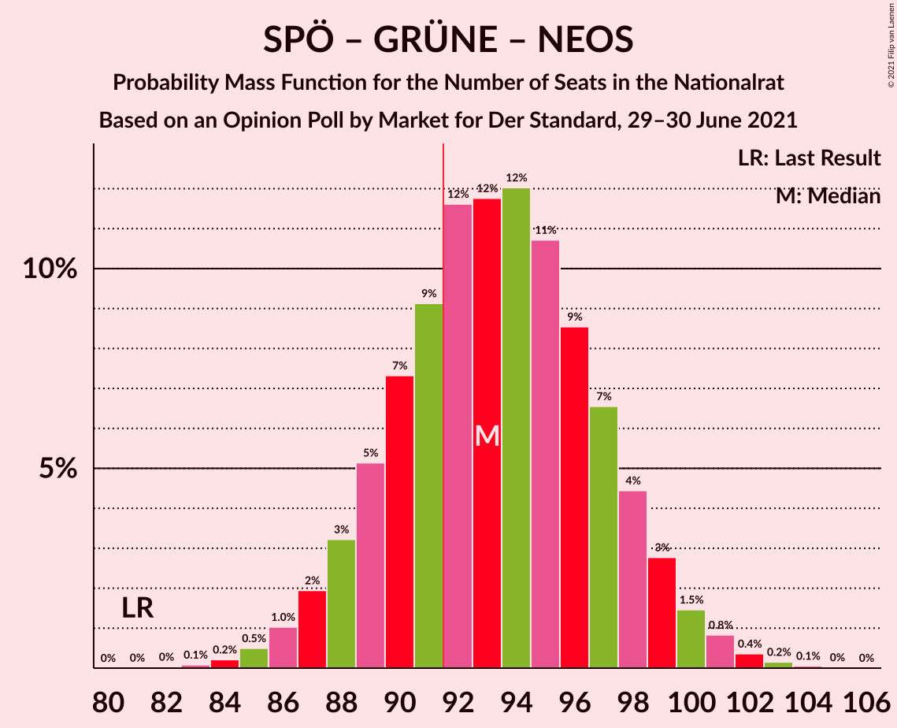
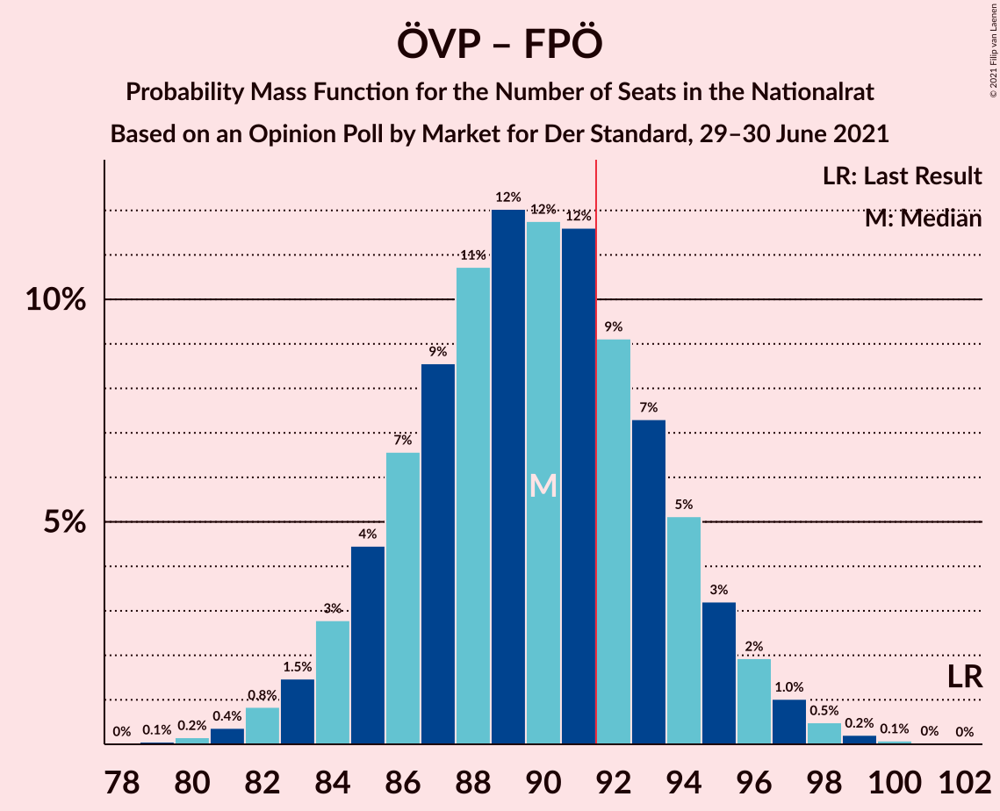
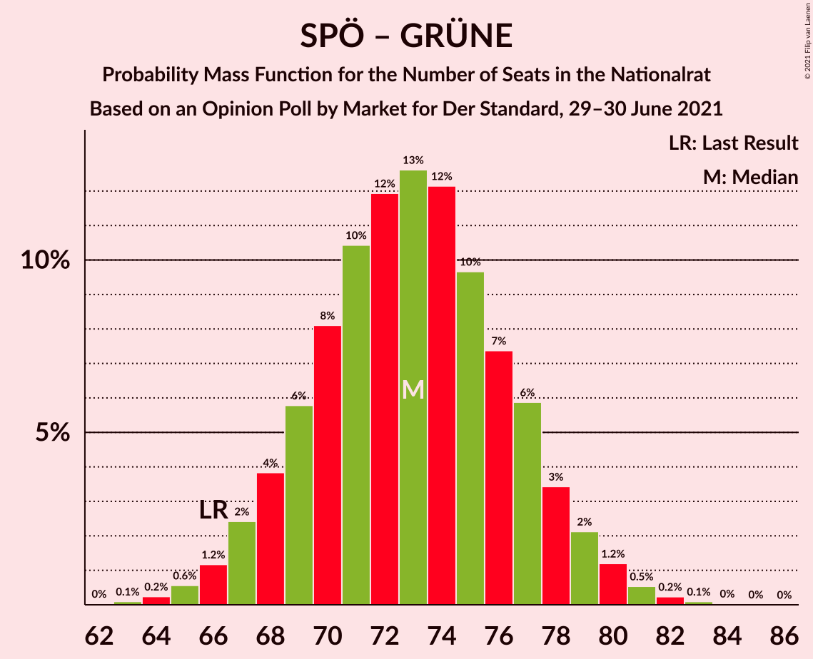

# Opinion Poll by Market for Der Standard, 29–30 June 2021

<a href="#voting-intentions">Voting Intentions</a> | <a href="#seats">Seats</a> | <a href="#coalitions">Coalitions</a> | <a href="#technical-information">Technical Information</a>

## Voting Intentions

### Confidence Intervals

| Party | Last Result | Poll Result | 80% Confidence Interval | 90% Confidence Interval | 95% Confidence Interval | 99% Confidence Interval |
|:-----:|:-----------:|:-----------:|:-----------------------:|:-----------------------:|:-----------------------:|:-----------------------:|
| Österreichische Volkspartei | 37.5% | 31.0% | 29.0–33.1% |28.4–33.7% |27.9–34.2% |26.9–35.3% |
| Sozialdemokratische Partei Österreichs | 21.2% | 26.0% | 24.1–28.0% |23.5–28.6% |23.1–29.1% |22.2–30.1% |
| Freiheitliche Partei Österreichs | 16.2% | 17.0% | 15.4–18.7% |14.9–19.2% |14.5–19.7% |13.8–20.6% |
| Die Grünen–Die Grüne Alternative | 13.9% | 13.0% | 11.6–14.7% |11.2–15.1% |10.9–15.5% |10.3–16.3% |
| NEOS–Das Neue Österreich und Liberales Forum | 8.1% | 11.0% | 9.7–12.5% |9.3–12.9% |9.0–13.3% |8.4–14.1% |

*Note:* The poll result column reflects the actual value used in the calculations. Published results may vary slightly, and in addition be rounded to fewer digits.

## Seats

### Confidence Intervals

| Party | Last Result | Median | 80% Confidence Interval | 90% Confidence Interval | 95% Confidence Interval | 99% Confidence Interval |
|:-----:|:-----------:|:------:|:-----------------------:|:-----------------------:|:-----------------------:|:-----------------------:|
| <a href="#österreichische-volkspartei">Österreichische Volkspartei</a> | 71 | 58 | 54–62 |53–63 |52–64 |50–66 |
| <a href="#sozialdemokratische-partei-österreichs">Sozialdemokratische Partei Österreichs</a> | 40 | 49 | 45–52 |44–53 |43–54 |41–56 |
| <a href="#freiheitliche-partei-österreichs">Freiheitliche Partei Österreichs</a> | 31 | 32 | 28–35 |28–36 |27–37 |26–38 |
| <a href="#die-grünen–die-grüne-alternative">Die Grünen–Die Grüne Alternative</a> | 26 | 24 | 22–27 |21–28 |20–29 |19–30 |
| <a href="#neos–das-neue-österreich-und-liberales-forum">NEOS–Das Neue Österreich und Liberales Forum</a> | 15 | 20 | 18–23 |17–24 |16–25 |15–26 |

### Österreichische Volkspartei

*For a full overview of the results for this party, see the [Österreichische Volkspartei](party-österreichischevolkspartei.html) page.*

| Number of Seats | Probability | Accumulated | Special Marks |
|:---------------:|:-----------:|:-----------:|:-------------:|
| 48 | 0% | 100% |  |
| 49 | 0.1% | 99.9% |  |
| 50 | 0.4% | 99.8% |  |
| 51 | 0.8% | 99.4% |  |
| 52 | 2% | 98.6% |  |
| 53 | 3% | 97% |  |
| 54 | 6% | 93% |  |
| 55 | 8% | 88% |  |
| 56 | 10% | 80% |  |
| 57 | 12% | 69% |  |
| 58 | 14% | 57% | Median |
| 59 | 12% | 43% |  |
| 60 | 10% | 31% |  |
| 61 | 8% | 21% |  |
| 62 | 6% | 13% |  |
| 63 | 3% | 7% |  |
| 64 | 2% | 4% |  |
| 65 | 1.0% | 2% |  |
| 66 | 0.5% | 0.8% |  |
| 67 | 0.2% | 0.3% |  |
| 68 | 0.1% | 0.1% |  |
| 69 | 0% | 0% |  |
| 70 | 0% | 0% |  |
| 71 | 0% | 0% | Last Result |

### Sozialdemokratische Partei Österreichs

*For a full overview of the results for this party, see the [Sozialdemokratische Partei Österreichs](party-sozialdemokratischeparteiösterreichs.html) page.*

| Number of Seats | Probability | Accumulated | Special Marks |
|:---------------:|:-----------:|:-----------:|:-------------:|
| 40 | 0.1% | 100% | Last Result |
| 41 | 0.4% | 99.8% |  |
| 42 | 1.0% | 99.4% |  |
| 43 | 2% | 98% |  |
| 44 | 4% | 96% |  |
| 45 | 6% | 92% |  |
| 46 | 9% | 86% |  |
| 47 | 11% | 77% |  |
| 48 | 14% | 66% |  |
| 49 | 13% | 52% | Median |
| 50 | 13% | 39% |  |
| 51 | 10% | 26% |  |
| 52 | 7% | 16% |  |
| 53 | 5% | 9% |  |
| 54 | 2% | 5% |  |
| 55 | 1.2% | 2% |  |
| 56 | 0.6% | 1.0% |  |
| 57 | 0.2% | 0.3% |  |
| 58 | 0.1% | 0.1% |  |
| 59 | 0% | 0% |  |

### Freiheitliche Partei Österreichs

*For a full overview of the results for this party, see the [Freiheitliche Partei Österreichs](party-freiheitlicheparteiösterreichs.html) page.*

| Number of Seats | Probability | Accumulated | Special Marks |
|:---------------:|:-----------:|:-----------:|:-------------:|
| 24 | 0.1% | 100% |  |
| 25 | 0.4% | 99.9% |  |
| 26 | 1.1% | 99.5% |  |
| 27 | 3% | 98% |  |
| 28 | 6% | 96% |  |
| 29 | 10% | 90% |  |
| 30 | 13% | 80% |  |
| 31 | 16% | 67% | Last Result |
| 32 | 16% | 51% | Median |
| 33 | 13% | 35% |  |
| 34 | 10% | 22% |  |
| 35 | 6% | 13% |  |
| 36 | 3% | 6% |  |
| 37 | 2% | 3% |  |
| 38 | 0.7% | 1.1% |  |
| 39 | 0.3% | 0.4% |  |
| 40 | 0.1% | 0.1% |  |
| 41 | 0% | 0% |  |

### Die Grünen–Die Grüne Alternative

*For a full overview of the results for this party, see the [Die Grünen–Die Grüne Alternative](party-diegrünen–diegrünealternative.html) page.*

| Number of Seats | Probability | Accumulated | Special Marks |
|:---------------:|:-----------:|:-----------:|:-------------:|
| 18 | 0.2% | 100% |  |
| 19 | 0.9% | 99.8% |  |
| 20 | 3% | 98.8% |  |
| 21 | 6% | 96% |  |
| 22 | 11% | 90% |  |
| 23 | 17% | 79% |  |
| 24 | 18% | 62% | Median |
| 25 | 15% | 44% |  |
| 26 | 14% | 30% | Last Result |
| 27 | 8% | 16% |  |
| 28 | 4% | 7% |  |
| 29 | 2% | 4% |  |
| 30 | 0.9% | 1.3% |  |
| 31 | 0.3% | 0.4% |  |
| 32 | 0.1% | 0.1% |  |
| 33 | 0% | 0% |  |

### NEOS–Das Neue Österreich und Liberales Forum

*For a full overview of the results for this party, see the [NEOS–Das Neue Österreich und Liberales Forum](party-neos–dasneueösterreichundliberalesforum.html) page.*

| Number of Seats | Probability | Accumulated | Special Marks |
|:---------------:|:-----------:|:-----------:|:-------------:|
| 14 | 0.1% | 100% |  |
| 15 | 0.5% | 99.9% | Last Result |
| 16 | 2% | 99.4% |  |
| 17 | 5% | 97% |  |
| 18 | 12% | 93% |  |
| 19 | 15% | 81% |  |
| 20 | 18% | 66% | Median |
| 21 | 20% | 48% |  |
| 22 | 12% | 28% |  |
| 23 | 9% | 16% |  |
| 24 | 4% | 7% |  |
| 25 | 2% | 3% |  |
| 26 | 0.7% | 1.0% |  |
| 27 | 0.2% | 0.3% |  |
| 28 | 0.1% | 0.1% |  |
| 29 | 0% | 0% |  |

## Coalitions

### Confidence Intervals

| Coalition | Last Result | Median | Majority? | 80% Confidence Interval | 90% Confidence Interval | 95% Confidence Interval | 99% Confidence Interval |
|:---------:|:-----------:|:------:|:---------:|:-----------------------:|:-----------------------:|:-----------------------:|:-----------------------:|
| Österreichische Volkspartei – Sozialdemokratische Partei Österreichs | 111 | 107 | 100% | 103–111 | 101–112 | 100–113 | 98–115 |
| Österreichische Volkspartei – Die Grünen–Die Grüne Alternative – NEOS–Das Neue Österreich und Liberales Forum | 112 | 103 | 100% | 99–107 | 97–108 | 96–109 | 94–111 |
| Sozialdemokratische Partei Österreichs – Die Grünen–Die Grüne Alternative – NEOS–Das Neue Österreich und Liberales Forum | 81 | 93 | 71% | 89–98 | 88–99 | 87–100 | 85–102 |
| Österreichische Volkspartei – Freiheitliche Partei Österreichs | 102 | 90 | 29% | 85–94 | 84–95 | 83–96 | 81–98 |
| Österreichische Volkspartei – Die Grünen–Die Grüne Alternative | 97 | 82 | 0.3% | 78–87 | 77–88 | 76–89 | 74–91 |
| Sozialdemokratische Partei Österreichs – Freiheitliche Partei Österreichs | 71 | 80 | 0% | 76–84 | 75–86 | 74–87 | 72–89 |
| Österreichische Volkspartei – NEOS–Das Neue Österreich und Liberales Forum | 86 | 78 | 0% | 74–83 | 73–84 | 72–85 | 70–87 |
| Sozialdemokratische Partei Österreichs – Die Grünen–Die Grüne Alternative | 66 | 73 | 0% | 69–77 | 68–78 | 67–79 | 65–81 |
| Österreichische Volkspartei | 71 | 58 | 0% | 54–62 | 53–63 | 52–64 | 50–66 |
| Sozialdemokratische Partei Österreichs | 40 | 49 | 0% | 45–52 | 44–53 | 43–54 | 41–56 |

### Österreichische Volkspartei – Sozialdemokratische Partei Österreichs

| Number of Seats | Probability | Accumulated | Special Marks |
|:---------------:|:-----------:|:-----------:|:-------------:|
| 96 | 0.1% | 100% |  |
| 97 | 0.2% | 99.9% |  |
| 98 | 0.4% | 99.7% |  |
| 99 | 0.8% | 99.4% |  |
| 100 | 2% | 98.6% |  |
| 101 | 3% | 97% |  |
| 102 | 4% | 94% |  |
| 103 | 7% | 90% |  |
| 104 | 8% | 83% |  |
| 105 | 10% | 75% |  |
| 106 | 12% | 65% |  |
| 107 | 13% | 53% | Median |
| 108 | 11% | 40% |  |
| 109 | 10% | 29% |  |
| 110 | 7% | 19% |  |
| 111 | 5% | 12% | Last Result |
| 112 | 3% | 7% |  |
| 113 | 2% | 3% |  |
| 114 | 0.9% | 2% |  |
| 115 | 0.4% | 0.7% |  |
| 116 | 0.2% | 0.3% |  |
| 117 | 0.1% | 0.1% |  |
| 118 | 0% | 0% |  |

### Österreichische Volkspartei – Die Grünen–Die Grüne Alternative – NEOS–Das Neue Österreich und Liberales Forum

| Number of Seats | Probability | Accumulated | Special Marks |
|:---------------:|:-----------:|:-----------:|:-------------:|
| 92 | 0.1% | 100% | Majority |
| 93 | 0.1% | 99.9% |  |
| 94 | 0.3% | 99.8% |  |
| 95 | 0.8% | 99.4% |  |
| 96 | 2% | 98.7% |  |
| 97 | 3% | 97% |  |
| 98 | 4% | 94% |  |
| 99 | 7% | 90% |  |
| 100 | 8% | 84% |  |
| 101 | 11% | 75% |  |
| 102 | 11% | 64% | Median |
| 103 | 12% | 53% |  |
| 104 | 12% | 41% |  |
| 105 | 9% | 29% |  |
| 106 | 8% | 20% |  |
| 107 | 5% | 12% |  |
| 108 | 3% | 7% |  |
| 109 | 2% | 4% |  |
| 110 | 1.0% | 2% |  |
| 111 | 0.5% | 0.8% |  |
| 112 | 0.2% | 0.3% | Last Result |
| 113 | 0.1% | 0.1% |  |
| 114 | 0% | 0% |  |

### Sozialdemokratische Partei Österreichs – Die Grünen–Die Grüne Alternative – NEOS–Das Neue Österreich und Liberales Forum

| Number of Seats | Probability | Accumulated | Special Marks |
|:---------------:|:-----------:|:-----------:|:-------------:|
| 81 | 0% | 100% | Last Result |
| 82 | 0% | 100% |  |
| 83 | 0.1% | 100% |  |
| 84 | 0.2% | 99.9% |  |
| 85 | 0.5% | 99.7% |  |
| 86 | 1.0% | 99.2% |  |
| 87 | 2% | 98% |  |
| 88 | 3% | 96% |  |
| 89 | 5% | 93% |  |
| 90 | 7% | 88% |  |
| 91 | 9% | 80% |  |
| 92 | 12% | 71% | Majority |
| 93 | 12% | 60% | Median |
| 94 | 12% | 48% |  |
| 95 | 11% | 36% |  |
| 96 | 9% | 25% |  |
| 97 | 7% | 17% |  |
| 98 | 4% | 10% |  |
| 99 | 3% | 6% |  |
| 100 | 1.5% | 3% |  |
| 101 | 0.8% | 1.4% |  |
| 102 | 0.4% | 0.6% |  |
| 103 | 0.2% | 0.2% |  |
| 104 | 0.1% | 0.1% |  |
| 105 | 0% | 0% |  |

### Österreichische Volkspartei – Freiheitliche Partei Österreichs

| Number of Seats | Probability | Accumulated | Special Marks |
|:---------------:|:-----------:|:-----------:|:-------------:|
| 79 | 0.1% | 100% |  |
| 80 | 0.2% | 99.9% |  |
| 81 | 0.4% | 99.8% |  |
| 82 | 0.8% | 99.4% |  |
| 83 | 1.5% | 98.5% |  |
| 84 | 3% | 97% |  |
| 85 | 4% | 94% |  |
| 86 | 7% | 90% |  |
| 87 | 9% | 83% |  |
| 88 | 11% | 75% |  |
| 89 | 12% | 64% |  |
| 90 | 12% | 52% | Median |
| 91 | 12% | 40% |  |
| 92 | 9% | 29% | Majority |
| 93 | 7% | 19% |  |
| 94 | 5% | 12% |  |
| 95 | 3% | 7% |  |
| 96 | 2% | 4% |  |
| 97 | 1.0% | 2% |  |
| 98 | 0.5% | 0.8% |  |
| 99 | 0.2% | 0.3% |  |
| 100 | 0.1% | 0.1% |  |
| 101 | 0% | 0% |  |
| 102 | 0% | 0% | Last Result |

### Österreichische Volkspartei – Die Grünen–Die Grüne Alternative

| Number of Seats | Probability | Accumulated | Special Marks |
|:---------------:|:-----------:|:-----------:|:-------------:|
| 72 | 0.1% | 100% |  |
| 73 | 0.2% | 99.9% |  |
| 74 | 0.5% | 99.7% |  |
| 75 | 1.0% | 99.2% |  |
| 76 | 2% | 98% |  |
| 77 | 3% | 96% |  |
| 78 | 5% | 93% |  |
| 79 | 7% | 88% |  |
| 80 | 9% | 81% |  |
| 81 | 12% | 71% |  |
| 82 | 12% | 60% | Median |
| 83 | 12% | 48% |  |
| 84 | 10% | 35% |  |
| 85 | 9% | 25% |  |
| 86 | 6% | 16% |  |
| 87 | 5% | 10% |  |
| 88 | 3% | 6% |  |
| 89 | 2% | 3% |  |
| 90 | 0.8% | 1.4% |  |
| 91 | 0.4% | 0.6% |  |
| 92 | 0.2% | 0.3% | Majority |
| 93 | 0.1% | 0.1% |  |
| 94 | 0% | 0% |  |
| 95 | 0% | 0% |  |
| 96 | 0% | 0% |  |
| 97 | 0% | 0% | Last Result |

### Sozialdemokratische Partei Österreichs – Freiheitliche Partei Österreichs

| Number of Seats | Probability | Accumulated | Special Marks |
|:---------------:|:-----------:|:-----------:|:-------------:|
| 70 | 0.1% | 100% |  |
| 71 | 0.2% | 99.9% | Last Result |
| 72 | 0.5% | 99.7% |  |
| 73 | 1.0% | 99.2% |  |
| 74 | 2% | 98% |  |
| 75 | 3% | 96% |  |
| 76 | 5% | 93% |  |
| 77 | 8% | 88% |  |
| 78 | 9% | 80% |  |
| 79 | 12% | 71% |  |
| 80 | 12% | 59% |  |
| 81 | 11% | 47% | Median |
| 82 | 11% | 36% |  |
| 83 | 8% | 25% |  |
| 84 | 6% | 16% |  |
| 85 | 4% | 10% |  |
| 86 | 3% | 6% |  |
| 87 | 2% | 3% |  |
| 88 | 0.8% | 1.3% |  |
| 89 | 0.3% | 0.6% |  |
| 90 | 0.1% | 0.2% |  |
| 91 | 0.1% | 0.1% |  |
| 92 | 0% | 0% | Majority |

### Österreichische Volkspartei – NEOS–Das Neue Österreich und Liberales Forum

| Number of Seats | Probability | Accumulated | Special Marks |
|:---------------:|:-----------:|:-----------:|:-------------:|
| 68 | 0.1% | 100% |  |
| 69 | 0.2% | 99.9% |  |
| 70 | 0.4% | 99.7% |  |
| 71 | 0.9% | 99.3% |  |
| 72 | 2% | 98% |  |
| 73 | 3% | 97% |  |
| 74 | 5% | 94% |  |
| 75 | 7% | 89% |  |
| 76 | 9% | 82% |  |
| 77 | 11% | 72% |  |
| 78 | 12% | 61% | Median |
| 79 | 12% | 49% |  |
| 80 | 11% | 37% |  |
| 81 | 9% | 26% |  |
| 82 | 6% | 17% |  |
| 83 | 4% | 10% |  |
| 84 | 3% | 6% |  |
| 85 | 2% | 3% |  |
| 86 | 0.8% | 1.5% | Last Result |
| 87 | 0.4% | 0.7% |  |
| 88 | 0.2% | 0.3% |  |
| 89 | 0.1% | 0.1% |  |
| 90 | 0% | 0% |  |

### Sozialdemokratische Partei Österreichs – Die Grünen–Die Grüne Alternative

| Number of Seats | Probability | Accumulated | Special Marks |
|:---------------:|:-----------:|:-----------:|:-------------:|
| 63 | 0.1% | 100% |  |
| 64 | 0.2% | 99.9% |  |
| 65 | 0.6% | 99.6% |  |
| 66 | 1.2% | 99.1% | Last Result |
| 67 | 2% | 98% |  |
| 68 | 4% | 95% |  |
| 69 | 6% | 92% |  |
| 70 | 8% | 86% |  |
| 71 | 10% | 78% |  |
| 72 | 12% | 67% |  |
| 73 | 13% | 55% | Median |
| 74 | 12% | 43% |  |
| 75 | 10% | 31% |  |
| 76 | 7% | 21% |  |
| 77 | 6% | 14% |  |
| 78 | 3% | 8% |  |
| 79 | 2% | 4% |  |
| 80 | 1.2% | 2% |  |
| 81 | 0.5% | 0.9% |  |
| 82 | 0.2% | 0.4% |  |
| 83 | 0.1% | 0.2% |  |
| 84 | 0% | 0.1% |  |
| 85 | 0% | 0% |  |

### Österreichische Volkspartei

| Number of Seats | Probability | Accumulated | Special Marks |
|:---------------:|:-----------:|:-----------:|:-------------:|
| 48 | 0% | 100% |  |
| 49 | 0.1% | 99.9% |  |
| 50 | 0.4% | 99.8% |  |
| 51 | 0.8% | 99.4% |  |
| 52 | 2% | 98.6% |  |
| 53 | 3% | 97% |  |
| 54 | 6% | 93% |  |
| 55 | 8% | 88% |  |
| 56 | 10% | 80% |  |
| 57 | 12% | 69% |  |
| 58 | 14% | 57% | Median |
| 59 | 12% | 43% |  |
| 60 | 10% | 31% |  |
| 61 | 8% | 21% |  |
| 62 | 6% | 13% |  |
| 63 | 3% | 7% |  |
| 64 | 2% | 4% |  |
| 65 | 1.0% | 2% |  |
| 66 | 0.5% | 0.8% |  |
| 67 | 0.2% | 0.3% |  |
| 68 | 0.1% | 0.1% |  |
| 69 | 0% | 0% |  |
| 70 | 0% | 0% |  |
| 71 | 0% | 0% | Last Result |

### Sozialdemokratische Partei Österreichs

| Number of Seats | Probability | Accumulated | Special Marks |
|:---------------:|:-----------:|:-----------:|:-------------:|
| 40 | 0.1% | 100% | Last Result |
| 41 | 0.4% | 99.8% |  |
| 42 | 1.0% | 99.4% |  |
| 43 | 2% | 98% |  |
| 44 | 4% | 96% |  |
| 45 | 6% | 92% |  |
| 46 | 9% | 86% |  |
| 47 | 11% | 77% |  |
| 48 | 14% | 66% |  |
| 49 | 13% | 52% | Median |
| 50 | 13% | 39% |  |
| 51 | 10% | 26% |  |
| 52 | 7% | 16% |  |
| 53 | 5% | 9% |  |
| 54 | 2% | 5% |  |
| 55 | 1.2% | 2% |  |
| 56 | 0.6% | 1.0% |  |
| 57 | 0.2% | 0.3% |  |
| 58 | 0.1% | 0.1% |  |
| 59 | 0% | 0% |  |

## Technical Information

### Opinion Poll

+ **Polling firm:** Market
+ **Commissioner(s):** Der Standard
+ **Fieldwork period:** 29–30 June 2021

### Calculations

+ **Sample size:** 820
+ **Simulations done:** 1,048,576
+ **Error estimate:** 0.46%

