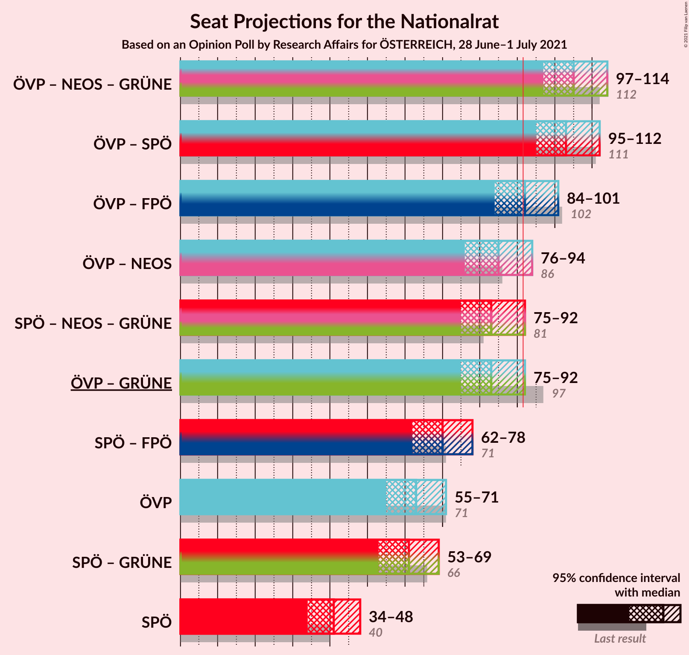
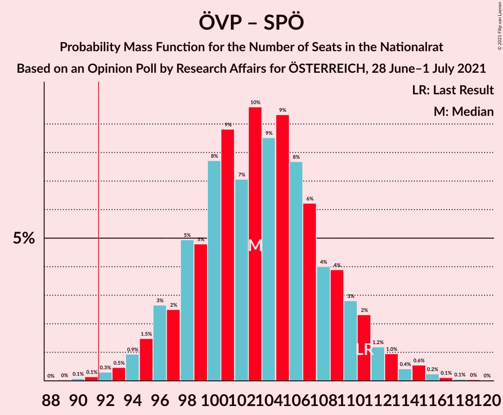

# Opinion Poll by Research Affairs for ÖSTERREICH, 28 June–1 July 2021

<a href="#voting-intentions">Voting Intentions</a> | <a href="#seats">Seats</a> | <a href="#coalitions">Coalitions</a> | <a href="#technical-information">Technical Information</a>

## Voting Intentions

### Confidence Intervals

| Party | Last Result | Poll Result | 80% Confidence Interval | 90% Confidence Interval | 95% Confidence Interval | 99% Confidence Interval |
|:-----:|:-----------:|:-----------:|:-----------------------:|:-----------------------:|:-----------------------:|:-----------------------:|
| Österreichische Volkspartei | 37.5% | 34.1% | 31.4–36.8% |30.7–37.6% |30.1–38.3% |28.8–39.6% |
| Sozialdemokratische Partei Österreichs | 21.2% | 22.0% | 19.8–24.5% |19.2–25.2% |18.7–25.9% |17.6–27.1% |
| Freiheitliche Partei Österreichs | 16.2% | 15.9% | 14.0–18.2% |13.5–18.8% |13.0–19.4% |12.1–20.5% |
| NEOS–Das Neue Österreich und Liberales Forum | 8.1% | 12.0% | 10.3–14.1% |9.9–14.6% |9.5–15.1% |8.7–16.2% |
| Die Grünen–Die Grüne Alternative | 13.9% | 11.0% | 9.4–13.0% |9.0–13.6% |8.6–14.1% |7.9–15.1% |

*Note:* The poll result column reflects the actual value used in the calculations. Published results may vary slightly, and in addition be rounded to fewer digits.

## Seats

### Confidence Intervals

| Party | Last Result | Median | 80% Confidence Interval | 90% Confidence Interval | 95% Confidence Interval | 99% Confidence Interval |
|:-----:|:-----------:|:------:|:-----------------------:|:-----------------------:|:-----------------------:|:-----------------------:|
| <a href="#österreichische-volkspartei">Österreichische Volkspartei</a> | 71 | 63 | 58–68 |56–70 |55–71 |53–74 |
| <a href="#sozialdemokratische-partei-österreichs">Sozialdemokratische Partei Österreichs</a> | 40 | 41 | 36–45 |35–47 |34–48 |32–50 |
| <a href="#freiheitliche-partei-österreichs">Freiheitliche Partei Österreichs</a> | 31 | 29 | 25–33 |25–34 |24–36 |22–38 |
| <a href="#neos–das-neue-österreich-und-liberales-forum">NEOS–Das Neue Österreich und Liberales Forum</a> | 15 | 22 | 19–26 |18–27 |17–28 |16–30 |
| <a href="#die-grünen–die-grüne-alternative">Die Grünen–Die Grüne Alternative</a> | 26 | 20 | 17–24 |16–25 |15–26 |14–28 |

### Österreichische Volkspartei

*For a full overview of the results for this party, see the [Österreichische Volkspartei](party-österreichischevolkspartei.html) page.*

| Number of Seats | Probability | Accumulated | Special Marks |
|:---------------:|:-----------:|:-----------:|:-------------:|
| 50 | 0% | 100% |  |
| 51 | 0.1% | 99.9% |  |
| 52 | 0.2% | 99.8% |  |
| 53 | 0.5% | 99.6% |  |
| 54 | 0.8% | 99.1% |  |
| 55 | 2% | 98% |  |
| 56 | 2% | 97% |  |
| 57 | 3% | 94% |  |
| 58 | 5% | 91% |  |
| 59 | 6% | 85% |  |
| 60 | 8% | 79% |  |
| 61 | 9% | 71% |  |
| 62 | 9% | 62% |  |
| 63 | 11% | 53% | Median |
| 64 | 10% | 42% |  |
| 65 | 9% | 33% |  |
| 66 | 7% | 24% |  |
| 67 | 5% | 17% |  |
| 68 | 4% | 12% |  |
| 69 | 2% | 8% |  |
| 70 | 2% | 5% |  |
| 71 | 1.2% | 3% | Last Result |
| 72 | 0.7% | 2% |  |
| 73 | 0.5% | 1.1% |  |
| 74 | 0.3% | 0.6% |  |
| 75 | 0.2% | 0.3% |  |
| 76 | 0% | 0.1% |  |
| 77 | 0% | 0.1% |  |
| 78 | 0% | 0% |  |

### Sozialdemokratische Partei Österreichs

*For a full overview of the results for this party, see the [Sozialdemokratische Partei Österreichs](party-sozialdemokratischeparteiösterreichs.html) page.*

| Number of Seats | Probability | Accumulated | Special Marks |
|:---------------:|:-----------:|:-----------:|:-------------:|
| 30 | 0.1% | 100% |  |
| 31 | 0.2% | 99.9% |  |
| 32 | 0.5% | 99.7% |  |
| 33 | 0.9% | 99.3% |  |
| 34 | 2% | 98% |  |
| 35 | 3% | 97% |  |
| 36 | 6% | 93% |  |
| 37 | 6% | 88% |  |
| 38 | 10% | 82% |  |
| 39 | 10% | 72% |  |
| 40 | 10% | 61% | Last Result |
| 41 | 11% | 51% | Median |
| 42 | 10% | 39% |  |
| 43 | 9% | 29% |  |
| 44 | 6% | 20% |  |
| 45 | 5% | 14% |  |
| 46 | 3% | 8% |  |
| 47 | 2% | 5% |  |
| 48 | 1.4% | 3% |  |
| 49 | 0.7% | 2% |  |
| 50 | 0.4% | 0.8% |  |
| 51 | 0.2% | 0.4% |  |
| 52 | 0.1% | 0.2% |  |
| 53 | 0% | 0.1% |  |
| 54 | 0% | 0% |  |

### Freiheitliche Partei Österreichs

*For a full overview of the results for this party, see the [Freiheitliche Partei Österreichs](party-freiheitlicheparteiösterreichs.html) page.*

| Number of Seats | Probability | Accumulated | Special Marks |
|:---------------:|:-----------:|:-----------:|:-------------:|
| 20 | 0.1% | 100% |  |
| 21 | 0.2% | 99.9% |  |
| 22 | 0.7% | 99.7% |  |
| 23 | 1.3% | 99.1% |  |
| 24 | 3% | 98% |  |
| 25 | 6% | 95% |  |
| 26 | 8% | 89% |  |
| 27 | 10% | 82% |  |
| 28 | 13% | 72% |  |
| 29 | 13% | 59% | Median |
| 30 | 13% | 46% |  |
| 31 | 11% | 34% | Last Result |
| 32 | 7% | 23% |  |
| 33 | 7% | 16% |  |
| 34 | 5% | 9% |  |
| 35 | 2% | 5% |  |
| 36 | 1.4% | 3% |  |
| 37 | 0.8% | 1.4% |  |
| 38 | 0.3% | 0.6% |  |
| 39 | 0.1% | 0.3% |  |
| 40 | 0.1% | 0.1% |  |
| 41 | 0% | 0% |  |

### NEOS–Das Neue Österreich und Liberales Forum

*For a full overview of the results for this party, see the [NEOS–Das Neue Österreich und Liberales Forum](party-neos–dasneueösterreichundliberalesforum.html) page.*

| Number of Seats | Probability | Accumulated | Special Marks |
|:---------------:|:-----------:|:-----------:|:-------------:|
| 14 | 0.1% | 100% |  |
| 15 | 0.3% | 99.9% | Last Result |
| 16 | 0.9% | 99.6% |  |
| 17 | 2% | 98.7% |  |
| 18 | 5% | 96% |  |
| 19 | 10% | 91% |  |
| 20 | 11% | 82% |  |
| 21 | 15% | 71% |  |
| 22 | 15% | 56% | Median |
| 23 | 14% | 41% |  |
| 24 | 10% | 28% |  |
| 25 | 6% | 17% |  |
| 26 | 5% | 11% |  |
| 27 | 3% | 6% |  |
| 28 | 2% | 3% |  |
| 29 | 0.7% | 1.2% |  |
| 30 | 0.3% | 0.5% |  |
| 31 | 0.1% | 0.2% |  |
| 32 | 0.1% | 0.1% |  |
| 33 | 0% | 0% |  |

### Die Grünen–Die Grüne Alternative

*For a full overview of the results for this party, see the [Die Grünen–Die Grüne Alternative](party-diegrünen–diegrünealternative.html) page.*

| Number of Seats | Probability | Accumulated | Special Marks |
|:---------------:|:-----------:|:-----------:|:-------------:|
| 13 | 0.2% | 100% |  |
| 14 | 0.7% | 99.8% |  |
| 15 | 2% | 99.1% |  |
| 16 | 4% | 97% |  |
| 17 | 8% | 93% |  |
| 18 | 11% | 85% |  |
| 19 | 14% | 74% |  |
| 20 | 16% | 60% | Median |
| 21 | 14% | 44% |  |
| 22 | 11% | 30% |  |
| 23 | 8% | 19% |  |
| 24 | 5% | 11% |  |
| 25 | 3% | 6% |  |
| 26 | 2% | 3% | Last Result |
| 27 | 0.6% | 1.2% |  |
| 28 | 0.3% | 0.5% |  |
| 29 | 0.1% | 0.2% |  |
| 30 | 0% | 0.1% |  |
| 31 | 0% | 0% |  |

## Coalitions

### Confidence Intervals

| Coalition | Last Result | Median | Majority? | 80% Confidence Interval | 90% Confidence Interval | 95% Confidence Interval | 99% Confidence Interval |
|:---------:|:-----------:|:------:|:---------:|:-----------------------:|:-----------------------:|:-----------------------:|:-----------------------:|
| Österreichische Volkspartei – NEOS–Das Neue Österreich und Liberales Forum – Die Grünen–Die Grüne Alternative | 112 | 105 | 99.9% | 99–111 | 98–113 | 97–114 | 94–117 |
| Österreichische Volkspartei – Sozialdemokratische Partei Österreichs | 111 | 103 | 99.7% | 98–109 | 96–111 | 95–112 | 92–116 |
| Österreichische Volkspartei – Freiheitliche Partei Österreichs | 102 | 92 | 55% | 87–98 | 85–99 | 84–101 | 81–104 |
| Österreichische Volkspartei – NEOS–Das Neue Österreich und Liberales Forum | 86 | 85 | 7% | 79–90 | 78–92 | 76–94 | 74–97 |
| Sozialdemokratische Partei Österreichs – NEOS–Das Neue Österreich und Liberales Forum – Die Grünen–Die Grüne Alternative | 81 | 83 | 3% | 77–89 | 76–90 | 75–92 | 72–95 |
| Österreichische Volkspartei – Die Grünen–Die Grüne Alternative | 97 | 83 | 3% | 77–88 | 76–90 | 75–92 | 72–95 |
| Sozialdemokratische Partei Österreichs – Freiheitliche Partei Österreichs | 71 | 70 | 0% | 65–76 | 63–77 | 62–78 | 60–81 |
| Österreichische Volkspartei | 71 | 63 | 0% | 58–68 | 56–70 | 55–71 | 53–74 |
| Sozialdemokratische Partei Österreichs – Die Grünen–Die Grüne Alternative | 66 | 61 | 0% | 56–66 | 54–68 | 53–69 | 51–72 |
| Sozialdemokratische Partei Österreichs | 40 | 41 | 0% | 36–45 | 35–47 | 34–48 | 32–50 |

### Österreichische Volkspartei – NEOS–Das Neue Österreich und Liberales Forum – Die Grünen–Die Grüne Alternative

| Number of Seats | Probability | Accumulated | Special Marks |
|:---------------:|:-----------:|:-----------:|:-------------:|
| 91 | 0% | 100% |  |
| 92 | 0.1% | 99.9% | Majority |
| 93 | 0.2% | 99.8% |  |
| 94 | 0.4% | 99.7% |  |
| 95 | 0.6% | 99.3% |  |
| 96 | 1.2% | 98.7% |  |
| 97 | 2% | 98% |  |
| 98 | 2% | 96% |  |
| 99 | 4% | 94% |  |
| 100 | 5% | 90% |  |
| 101 | 7% | 85% |  |
| 102 | 7% | 78% |  |
| 103 | 8% | 71% |  |
| 104 | 8% | 63% |  |
| 105 | 10% | 55% | Median |
| 106 | 9% | 45% |  |
| 107 | 9% | 36% |  |
| 108 | 6% | 27% |  |
| 109 | 6% | 21% |  |
| 110 | 5% | 15% |  |
| 111 | 3% | 10% |  |
| 112 | 2% | 7% | Last Result |
| 113 | 2% | 5% |  |
| 114 | 1.3% | 4% |  |
| 115 | 0.8% | 2% |  |
| 116 | 0.6% | 1.4% |  |
| 117 | 0.3% | 0.8% |  |
| 118 | 0.2% | 0.5% |  |
| 119 | 0.2% | 0.3% |  |
| 120 | 0.1% | 0.1% |  |
| 121 | 0% | 0% |  |

### Österreichische Volkspartei – Sozialdemokratische Partei Österreichs

| Number of Seats | Probability | Accumulated | Special Marks |
|:---------------:|:-----------:|:-----------:|:-------------:|
| 89 | 0% | 100% |  |
| 90 | 0.1% | 99.9% |  |
| 91 | 0.1% | 99.9% |  |
| 92 | 0.3% | 99.7% | Majority |
| 93 | 0.5% | 99.4% |  |
| 94 | 0.9% | 98.9% |  |
| 95 | 1.5% | 98% |  |
| 96 | 3% | 97% |  |
| 97 | 2% | 94% |  |
| 98 | 5% | 91% |  |
| 99 | 5% | 86% |  |
| 100 | 8% | 82% |  |
| 101 | 9% | 74% |  |
| 102 | 7% | 65% |  |
| 103 | 10% | 58% |  |
| 104 | 9% | 48% | Median |
| 105 | 9% | 40% |  |
| 106 | 8% | 31% |  |
| 107 | 6% | 23% |  |
| 108 | 4% | 17% |  |
| 109 | 4% | 13% |  |
| 110 | 3% | 9% |  |
| 111 | 2% | 6% | Last Result |
| 112 | 1.2% | 4% |  |
| 113 | 1.0% | 2% |  |
| 114 | 0.4% | 1.5% |  |
| 115 | 0.6% | 1.1% |  |
| 116 | 0.2% | 0.5% |  |
| 117 | 0.1% | 0.3% |  |
| 118 | 0.1% | 0.1% |  |
| 119 | 0% | 0.1% |  |
| 120 | 0% | 0% |  |

### Österreichische Volkspartei – Freiheitliche Partei Österreichs

| Number of Seats | Probability | Accumulated | Special Marks |
|:---------------:|:-----------:|:-----------:|:-------------:|
| 78 | 0% | 100% |  |
| 79 | 0.1% | 99.9% |  |
| 80 | 0.1% | 99.8% |  |
| 81 | 0.3% | 99.7% |  |
| 82 | 0.6% | 99.4% |  |
| 83 | 0.9% | 98.7% |  |
| 84 | 2% | 98% |  |
| 85 | 3% | 96% |  |
| 86 | 3% | 93% |  |
| 87 | 5% | 90% |  |
| 88 | 6% | 85% |  |
| 89 | 7% | 79% |  |
| 90 | 8% | 72% |  |
| 91 | 10% | 64% |  |
| 92 | 10% | 55% | Median, Majority |
| 93 | 8% | 45% |  |
| 94 | 9% | 37% |  |
| 95 | 7% | 28% |  |
| 96 | 6% | 22% |  |
| 97 | 4% | 16% |  |
| 98 | 3% | 11% |  |
| 99 | 3% | 8% |  |
| 100 | 1.3% | 5% |  |
| 101 | 1.5% | 4% |  |
| 102 | 1.0% | 2% | Last Result |
| 103 | 0.5% | 1.1% |  |
| 104 | 0.3% | 0.7% |  |
| 105 | 0.1% | 0.4% |  |
| 106 | 0.1% | 0.2% |  |
| 107 | 0.1% | 0.1% |  |
| 108 | 0% | 0.1% |  |
| 109 | 0% | 0% |  |

### Österreichische Volkspartei – NEOS–Das Neue Österreich und Liberales Forum

| Number of Seats | Probability | Accumulated | Special Marks |
|:---------------:|:-----------:|:-----------:|:-------------:|
| 71 | 0% | 100% |  |
| 72 | 0.1% | 99.9% |  |
| 73 | 0.2% | 99.8% |  |
| 74 | 0.4% | 99.7% |  |
| 75 | 0.7% | 99.3% |  |
| 76 | 1.2% | 98.6% |  |
| 77 | 2% | 97% |  |
| 78 | 3% | 96% |  |
| 79 | 4% | 93% |  |
| 80 | 5% | 89% |  |
| 81 | 7% | 84% |  |
| 82 | 8% | 78% |  |
| 83 | 8% | 70% |  |
| 84 | 10% | 61% |  |
| 85 | 7% | 51% | Median |
| 86 | 10% | 44% | Last Result |
| 87 | 8% | 34% |  |
| 88 | 7% | 26% |  |
| 89 | 5% | 19% |  |
| 90 | 4% | 13% |  |
| 91 | 3% | 9% |  |
| 92 | 3% | 7% | Majority |
| 93 | 1.4% | 4% |  |
| 94 | 1.0% | 3% |  |
| 95 | 0.5% | 2% |  |
| 96 | 0.5% | 1.1% |  |
| 97 | 0.2% | 0.5% |  |
| 98 | 0.2% | 0.3% |  |
| 99 | 0.1% | 0.2% |  |
| 100 | 0.1% | 0.1% |  |
| 101 | 0% | 0% |  |

### Sozialdemokratische Partei Österreichs – NEOS–Das Neue Österreich und Liberales Forum – Die Grünen–Die Grüne Alternative

| Number of Seats | Probability | Accumulated | Special Marks |
|:---------------:|:-----------:|:-----------:|:-------------:|
| 69 | 0% | 100% |  |
| 70 | 0.1% | 99.9% |  |
| 71 | 0.2% | 99.9% |  |
| 72 | 0.3% | 99.7% |  |
| 73 | 0.7% | 99.4% |  |
| 74 | 1.0% | 98.6% |  |
| 75 | 2% | 98% |  |
| 76 | 3% | 96% |  |
| 77 | 4% | 93% |  |
| 78 | 4% | 89% |  |
| 79 | 8% | 85% |  |
| 80 | 7% | 77% |  |
| 81 | 8% | 70% | Last Result |
| 82 | 10% | 62% |  |
| 83 | 8% | 52% | Median |
| 84 | 11% | 44% |  |
| 85 | 7% | 34% |  |
| 86 | 6% | 26% |  |
| 87 | 7% | 20% |  |
| 88 | 3% | 14% |  |
| 89 | 3% | 10% |  |
| 90 | 3% | 7% |  |
| 91 | 1.4% | 4% |  |
| 92 | 1.2% | 3% | Majority |
| 93 | 0.6% | 2% |  |
| 94 | 0.5% | 1.0% |  |
| 95 | 0.3% | 0.5% |  |
| 96 | 0.1% | 0.3% |  |
| 97 | 0.1% | 0.2% |  |
| 98 | 0% | 0.1% |  |
| 99 | 0% | 0% |  |

### Österreichische Volkspartei – Die Grünen–Die Grüne Alternative

| Number of Seats | Probability | Accumulated | Special Marks |
|:---------------:|:-----------:|:-----------:|:-------------:|
| 69 | 0% | 100% |  |
| 70 | 0.1% | 99.9% |  |
| 71 | 0.2% | 99.9% |  |
| 72 | 0.3% | 99.7% |  |
| 73 | 0.6% | 99.4% |  |
| 74 | 1.0% | 98.8% |  |
| 75 | 2% | 98% |  |
| 76 | 2% | 96% |  |
| 77 | 4% | 94% |  |
| 78 | 5% | 90% |  |
| 79 | 6% | 85% |  |
| 80 | 7% | 79% |  |
| 81 | 8% | 72% |  |
| 82 | 10% | 64% |  |
| 83 | 10% | 54% | Median |
| 84 | 8% | 44% |  |
| 85 | 9% | 36% |  |
| 86 | 7% | 27% |  |
| 87 | 5% | 20% |  |
| 88 | 5% | 15% |  |
| 89 | 3% | 10% |  |
| 90 | 2% | 7% |  |
| 91 | 2% | 4% |  |
| 92 | 1.0% | 3% | Majority |
| 93 | 0.7% | 2% |  |
| 94 | 0.5% | 1.0% |  |
| 95 | 0.2% | 0.6% |  |
| 96 | 0.2% | 0.3% |  |
| 97 | 0.1% | 0.2% | Last Result |
| 98 | 0.1% | 0.1% |  |
| 99 | 0% | 0% |  |

### Sozialdemokratische Partei Österreichs – Freiheitliche Partei Österreichs

| Number of Seats | Probability | Accumulated | Special Marks |
|:---------------:|:-----------:|:-----------:|:-------------:|
| 57 | 0.1% | 100% |  |
| 58 | 0.1% | 99.9% |  |
| 59 | 0.3% | 99.8% |  |
| 60 | 0.5% | 99.5% |  |
| 61 | 0.8% | 99.0% |  |
| 62 | 2% | 98% |  |
| 63 | 2% | 97% |  |
| 64 | 4% | 94% |  |
| 65 | 5% | 90% |  |
| 66 | 6% | 85% |  |
| 67 | 7% | 79% |  |
| 68 | 9% | 72% |  |
| 69 | 10% | 63% |  |
| 70 | 9% | 52% | Median |
| 71 | 9% | 43% | Last Result |
| 72 | 7% | 34% |  |
| 73 | 7% | 27% |  |
| 74 | 6% | 20% |  |
| 75 | 4% | 14% |  |
| 76 | 4% | 10% |  |
| 77 | 3% | 6% |  |
| 78 | 1.4% | 4% |  |
| 79 | 1.1% | 2% |  |
| 80 | 0.6% | 1.3% |  |
| 81 | 0.3% | 0.7% |  |
| 82 | 0.2% | 0.4% |  |
| 83 | 0.1% | 0.2% |  |
| 84 | 0.1% | 0.1% |  |
| 85 | 0% | 0% |  |

### Österreichische Volkspartei

| Number of Seats | Probability | Accumulated | Special Marks |
|:---------------:|:-----------:|:-----------:|:-------------:|
| 50 | 0% | 100% |  |
| 51 | 0.1% | 99.9% |  |
| 52 | 0.2% | 99.8% |  |
| 53 | 0.5% | 99.6% |  |
| 54 | 0.8% | 99.1% |  |
| 55 | 2% | 98% |  |
| 56 | 2% | 97% |  |
| 57 | 3% | 94% |  |
| 58 | 5% | 91% |  |
| 59 | 6% | 85% |  |
| 60 | 8% | 79% |  |
| 61 | 9% | 71% |  |
| 62 | 9% | 62% |  |
| 63 | 11% | 53% | Median |
| 64 | 10% | 42% |  |
| 65 | 9% | 33% |  |
| 66 | 7% | 24% |  |
| 67 | 5% | 17% |  |
| 68 | 4% | 12% |  |
| 69 | 2% | 8% |  |
| 70 | 2% | 5% |  |
| 71 | 1.2% | 3% | Last Result |
| 72 | 0.7% | 2% |  |
| 73 | 0.5% | 1.1% |  |
| 74 | 0.3% | 0.6% |  |
| 75 | 0.2% | 0.3% |  |
| 76 | 0% | 0.1% |  |
| 77 | 0% | 0.1% |  |
| 78 | 0% | 0% |  |

### Sozialdemokratische Partei Österreichs – Die Grünen–Die Grüne Alternative

| Number of Seats | Probability | Accumulated | Special Marks |
|:---------------:|:-----------:|:-----------:|:-------------:|
| 48 | 0% | 100% |  |
| 49 | 0.1% | 99.9% |  |
| 50 | 0.2% | 99.9% |  |
| 51 | 0.6% | 99.7% |  |
| 52 | 0.6% | 99.1% |  |
| 53 | 2% | 98% |  |
| 54 | 2% | 97% |  |
| 55 | 4% | 95% |  |
| 56 | 5% | 90% |  |
| 57 | 6% | 85% |  |
| 58 | 7% | 80% |  |
| 59 | 10% | 73% |  |
| 60 | 11% | 62% |  |
| 61 | 10% | 52% | Median |
| 62 | 9% | 42% |  |
| 63 | 8% | 33% |  |
| 64 | 8% | 25% |  |
| 65 | 5% | 17% |  |
| 66 | 4% | 13% | Last Result |
| 67 | 3% | 8% |  |
| 68 | 3% | 6% |  |
| 69 | 1.2% | 3% |  |
| 70 | 0.9% | 2% |  |
| 71 | 0.3% | 1.0% |  |
| 72 | 0.4% | 0.7% |  |
| 73 | 0.1% | 0.3% |  |
| 74 | 0.1% | 0.1% |  |
| 75 | 0% | 0.1% |  |
| 76 | 0% | 0% |  |

### Sozialdemokratische Partei Österreichs

| Number of Seats | Probability | Accumulated | Special Marks |
|:---------------:|:-----------:|:-----------:|:-------------:|
| 30 | 0.1% | 100% |  |
| 31 | 0.2% | 99.9% |  |
| 32 | 0.5% | 99.7% |  |
| 33 | 0.9% | 99.3% |  |
| 34 | 2% | 98% |  |
| 35 | 3% | 97% |  |
| 36 | 6% | 93% |  |
| 37 | 6% | 88% |  |
| 38 | 10% | 82% |  |
| 39 | 10% | 72% |  |
| 40 | 10% | 61% | Last Result |
| 41 | 11% | 51% | Median |
| 42 | 10% | 39% |  |
| 43 | 9% | 29% |  |
| 44 | 6% | 20% |  |
| 45 | 5% | 14% |  |
| 46 | 3% | 8% |  |
| 47 | 2% | 5% |  |
| 48 | 1.4% | 3% |  |
| 49 | 0.7% | 2% |  |
| 50 | 0.4% | 0.8% |  |
| 51 | 0.2% | 0.4% |  |
| 52 | 0.1% | 0.2% |  |
| 53 | 0% | 0.1% |  |
| 54 | 0% | 0% |  |

## Technical Information

### Opinion Poll

+ **Polling firm:** Research Affairs
+ **Commissioner(s):** ÖSTERREICH
+ **Fieldwork period:** 28 June–1 July 2021

### Calculations

+ **Sample size:** 508
+ **Simulations done:** 131,072
+ **Error estimate:** 1.22%

