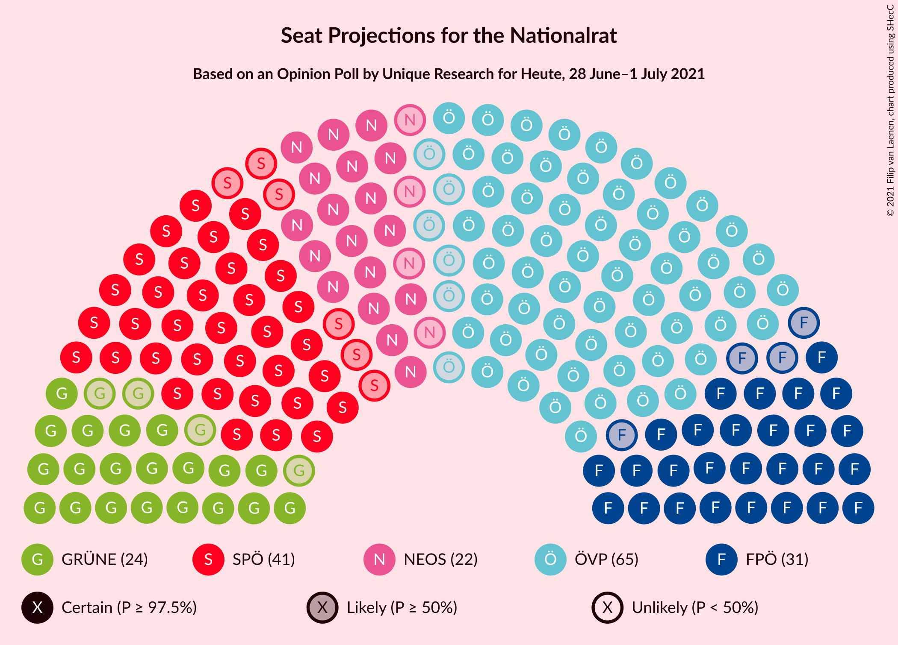

# Opinion Poll by Unique Research for Heute, 28 June–1 July 2021

<a href="#voting-intentions">Voting Intentions</a> | <a href="#seats">Seats</a> | <a href="#coalitions">Coalitions</a> | <a href="#technical-information">Technical Information</a>

## Voting Intentions

### Confidence Intervals

| Party | Last Result | Poll Result | 80% Confidence Interval | 90% Confidence Interval | 95% Confidence Interval | 99% Confidence Interval |
|:-----:|:-----------:|:-----------:|:-----------------------:|:-----------------------:|:-----------------------:|:-----------------------:|
| Österreichische Volkspartei | 37.5% | 35.0% | 32.9–37.2% |32.3–37.8% |31.8–38.4% |30.8–39.4% |
| Sozialdemokratische Partei Österreichs | 21.2% | 22.0% | 20.2–24.0% |19.7–24.5% |19.3–25.0% |18.4–26.0% |
| Freiheitliche Partei Österreichs | 16.2% | 17.0% | 15.4–18.8% |14.9–19.3% |14.6–19.8% |13.8–20.7% |
| Die Grünen–Die Grüne Alternative | 13.9% | 13.0% | 11.6–14.6% |11.2–15.1% |10.8–15.5% |10.2–16.3% |
| NEOS–Das Neue Österreich und Liberales Forum | 8.1% | 12.0% | 10.6–13.6% |10.2–14.1% |9.9–14.4% |9.3–15.2% |

*Note:* The poll result column reflects the actual value used in the calculations. Published results may vary slightly, and in addition be rounded to fewer digits.

## Seats

### Confidence Intervals

| Party | Last Result | Median | 80% Confidence Interval | 90% Confidence Interval | 95% Confidence Interval | 99% Confidence Interval |
|:-----:|:-----------:|:------:|:-----------------------:|:-----------------------:|:-----------------------:|:-----------------------:|
| <a href="#österreichische-volkspartei">Österreichische Volkspartei</a> | 71 | 65 | 61–69 |60–70 |59–71 |57–73 |
| <a href="#sozialdemokratische-partei-österreichs">Sozialdemokratische Partei Österreichs</a> | 40 | 41 | 37–44 |36–45 |35–46 |34–48 |
| <a href="#freiheitliche-partei-österreichs">Freiheitliche Partei Österreichs</a> | 31 | 31 | 28–35 |27–36 |27–36 |25–38 |
| <a href="#die-grünen–die-grüne-alternative">Die Grünen–Die Grüne Alternative</a> | 26 | 24 | 21–27 |20–28 |20–28 |18–30 |
| <a href="#neos–das-neue-österreich-und-liberales-forum">NEOS–Das Neue Österreich und Liberales Forum</a> | 15 | 22 | 19–25 |19–26 |18–26 |17–28 |

### Österreichische Volkspartei

*For a full overview of the results for this party, see the [Österreichische Volkspartei](party-österreichischevolkspartei.html) page.*

| Number of Seats | Probability | Accumulated | Special Marks |
|:---------------:|:-----------:|:-----------:|:-------------:|
| 55 | 0.1% | 100% |  |
| 56 | 0.2% | 99.9% |  |
| 57 | 0.5% | 99.6% |  |
| 58 | 1.2% | 99.2% |  |
| 59 | 2% | 98% |  |
| 60 | 3% | 96% |  |
| 61 | 6% | 93% |  |
| 62 | 8% | 86% |  |
| 63 | 12% | 79% |  |
| 64 | 12% | 66% |  |
| 65 | 12% | 54% | Median |
| 66 | 13% | 42% |  |
| 67 | 9% | 29% |  |
| 68 | 8% | 20% |  |
| 69 | 5% | 13% |  |
| 70 | 4% | 7% |  |
| 71 | 2% | 4% | Last Result |
| 72 | 0.9% | 2% |  |
| 73 | 0.6% | 1.0% |  |
| 74 | 0.3% | 0.4% |  |
| 75 | 0.1% | 0.1% |  |
| 76 | 0% | 0.1% |  |
| 77 | 0% | 0% |  |

### Sozialdemokratische Partei Österreichs

*For a full overview of the results for this party, see the [Sozialdemokratische Partei Österreichs](party-sozialdemokratischeparteiösterreichs.html) page.*

| Number of Seats | Probability | Accumulated | Special Marks |
|:---------------:|:-----------:|:-----------:|:-------------:|
| 32 | 0.1% | 100% |  |
| 33 | 0.2% | 99.9% |  |
| 34 | 0.6% | 99.7% |  |
| 35 | 2% | 99.1% |  |
| 36 | 3% | 97% |  |
| 37 | 6% | 94% |  |
| 38 | 10% | 88% |  |
| 39 | 12% | 79% |  |
| 40 | 15% | 67% | Last Result |
| 41 | 15% | 52% | Median |
| 42 | 12% | 37% |  |
| 43 | 11% | 26% |  |
| 44 | 7% | 15% |  |
| 45 | 4% | 8% |  |
| 46 | 2% | 4% |  |
| 47 | 1.2% | 2% |  |
| 48 | 0.4% | 0.7% |  |
| 49 | 0.2% | 0.3% |  |
| 50 | 0.1% | 0.1% |  |
| 51 | 0% | 0% |  |

### Freiheitliche Partei Österreichs

*For a full overview of the results for this party, see the [Freiheitliche Partei Österreichs](party-freiheitlicheparteiösterreichs.html) page.*

| Number of Seats | Probability | Accumulated | Special Marks |
|:---------------:|:-----------:|:-----------:|:-------------:|
| 24 | 0.1% | 100% |  |
| 25 | 0.6% | 99.8% |  |
| 26 | 1.3% | 99.3% |  |
| 27 | 3% | 98% |  |
| 28 | 6% | 94% |  |
| 29 | 11% | 88% |  |
| 30 | 11% | 77% |  |
| 31 | 18% | 66% | Last Result, Median |
| 32 | 15% | 48% |  |
| 33 | 12% | 32% |  |
| 34 | 9% | 20% |  |
| 35 | 5% | 11% |  |
| 36 | 3% | 5% |  |
| 37 | 1.4% | 2% |  |
| 38 | 0.7% | 1.0% |  |
| 39 | 0.2% | 0.3% |  |
| 40 | 0.1% | 0.1% |  |
| 41 | 0% | 0% |  |

### Die Grünen–Die Grüne Alternative

*For a full overview of the results for this party, see the [Die Grünen–Die Grüne Alternative](party-diegrünen–diegrünealternative.html) page.*

| Number of Seats | Probability | Accumulated | Special Marks |
|:---------------:|:-----------:|:-----------:|:-------------:|
| 17 | 0.1% | 100% |  |
| 18 | 0.4% | 99.9% |  |
| 19 | 1.3% | 99.5% |  |
| 20 | 5% | 98% |  |
| 21 | 7% | 94% |  |
| 22 | 13% | 87% |  |
| 23 | 15% | 73% |  |
| 24 | 20% | 58% | Median |
| 25 | 14% | 38% |  |
| 26 | 12% | 24% | Last Result |
| 27 | 6% | 12% |  |
| 28 | 4% | 6% |  |
| 29 | 1.3% | 2% |  |
| 30 | 0.6% | 0.9% |  |
| 31 | 0.2% | 0.3% |  |
| 32 | 0.1% | 0.1% |  |
| 33 | 0% | 0% |  |

### NEOS–Das Neue Österreich und Liberales Forum

*For a full overview of the results for this party, see the [NEOS–Das Neue Österreich und Liberales Forum](party-neos–dasneueösterreichundliberalesforum.html) page.*

| Number of Seats | Probability | Accumulated | Special Marks |
|:---------------:|:-----------:|:-----------:|:-------------:|
| 15 | 0% | 100% | Last Result |
| 16 | 0.3% | 100% |  |
| 17 | 0.8% | 99.7% |  |
| 18 | 3% | 98.9% |  |
| 19 | 8% | 95% |  |
| 20 | 11% | 88% |  |
| 21 | 18% | 77% |  |
| 22 | 17% | 59% | Median |
| 23 | 18% | 42% |  |
| 24 | 11% | 24% |  |
| 25 | 7% | 13% |  |
| 26 | 4% | 6% |  |
| 27 | 1.2% | 2% |  |
| 28 | 0.7% | 0.9% |  |
| 29 | 0.2% | 0.2% |  |
| 30 | 0.1% | 0.1% |  |
| 31 | 0% | 0% |  |

## Coalitions

### Confidence Intervals

| Coalition | Last Result | Median | Majority? | 80% Confidence Interval | 90% Confidence Interval | 95% Confidence Interval | 99% Confidence Interval |
|:---------:|:-----------:|:------:|:---------:|:-----------------------:|:-----------------------:|:-----------------------:|:-----------------------:|
| Österreichische Volkspartei – Die Grünen–Die Grüne Alternative – NEOS–Das Neue Österreich und Liberales Forum | 112 | 111 | 100% | 107–115 | 106–116 | 104–117 | 103–119 |
| Österreichische Volkspartei – Sozialdemokratische Partei Österreichs | 111 | 106 | 100% | 101–110 | 100–111 | 99–112 | 97–114 |
| Österreichische Volkspartei – Freiheitliche Partei Österreichs | 102 | 96 | 92% | 92–100 | 91–102 | 90–103 | 88–105 |
| Österreichische Volkspartei – Die Grünen–Die Grüne Alternative | 97 | 89 | 20% | 85–93 | 83–94 | 82–95 | 81–97 |
| Österreichische Volkspartei – NEOS–Das Neue Österreich und Liberales Forum | 86 | 87 | 8% | 83–91 | 81–92 | 80–94 | 79–95 |
| Sozialdemokratische Partei Österreichs – Die Grünen–Die Grüne Alternative – NEOS–Das Neue Österreich und Liberales Forum | 81 | 87 | 8% | 83–91 | 81–92 | 80–93 | 78–95 |
| Sozialdemokratische Partei Österreichs – Freiheitliche Partei Österreichs | 71 | 72 | 0% | 68–76 | 67–77 | 66–79 | 64–80 |
| Sozialdemokratische Partei Österreichs – Die Grünen–Die Grüne Alternative | 66 | 64 | 0% | 61–69 | 59–70 | 59–71 | 57–73 |
| Österreichische Volkspartei | 71 | 65 | 0% | 61–69 | 60–70 | 59–71 | 57–73 |
| Sozialdemokratische Partei Österreichs | 40 | 41 | 0% | 37–44 | 36–45 | 35–46 | 34–48 |

### Österreichische Volkspartei – Die Grünen–Die Grüne Alternative – NEOS–Das Neue Österreich und Liberales Forum

| Number of Seats | Probability | Accumulated | Special Marks |
|:---------------:|:-----------:|:-----------:|:-------------:|
| 100 | 0.1% | 100% |  |
| 101 | 0.1% | 99.9% |  |
| 102 | 0.3% | 99.8% |  |
| 103 | 0.6% | 99.5% |  |
| 104 | 1.4% | 98.9% |  |
| 105 | 2% | 97% |  |
| 106 | 4% | 95% |  |
| 107 | 6% | 91% |  |
| 108 | 8% | 86% |  |
| 109 | 10% | 77% |  |
| 110 | 12% | 67% |  |
| 111 | 14% | 55% | Median |
| 112 | 11% | 41% | Last Result |
| 113 | 10% | 30% |  |
| 114 | 8% | 21% |  |
| 115 | 5% | 13% |  |
| 116 | 4% | 8% |  |
| 117 | 2% | 4% |  |
| 118 | 1.0% | 2% |  |
| 119 | 0.5% | 0.9% |  |
| 120 | 0.2% | 0.4% |  |
| 121 | 0.1% | 0.1% |  |
| 122 | 0% | 0% |  |

### Österreichische Volkspartei – Sozialdemokratische Partei Österreichs

| Number of Seats | Probability | Accumulated | Special Marks |
|:---------------:|:-----------:|:-----------:|:-------------:|
| 95 | 0.1% | 100% |  |
| 96 | 0.2% | 99.9% |  |
| 97 | 0.3% | 99.7% |  |
| 98 | 0.8% | 99.4% |  |
| 99 | 1.5% | 98.6% |  |
| 100 | 3% | 97% |  |
| 101 | 5% | 94% |  |
| 102 | 6% | 89% |  |
| 103 | 9% | 83% |  |
| 104 | 13% | 74% |  |
| 105 | 11% | 61% |  |
| 106 | 11% | 51% | Median |
| 107 | 13% | 40% |  |
| 108 | 8% | 27% |  |
| 109 | 8% | 19% |  |
| 110 | 5% | 11% |  |
| 111 | 3% | 6% | Last Result |
| 112 | 2% | 3% |  |
| 113 | 1.0% | 2% |  |
| 114 | 0.4% | 0.7% |  |
| 115 | 0.2% | 0.3% |  |
| 116 | 0.1% | 0.1% |  |
| 117 | 0% | 0% |  |

### Österreichische Volkspartei – Freiheitliche Partei Österreichs

| Number of Seats | Probability | Accumulated | Special Marks |
|:---------------:|:-----------:|:-----------:|:-------------:|
| 85 | 0% | 100% |  |
| 86 | 0.1% | 99.9% |  |
| 87 | 0.2% | 99.8% |  |
| 88 | 0.5% | 99.6% |  |
| 89 | 1.2% | 99.1% |  |
| 90 | 2% | 98% |  |
| 91 | 4% | 96% |  |
| 92 | 4% | 92% | Majority |
| 93 | 8% | 88% |  |
| 94 | 9% | 81% |  |
| 95 | 11% | 71% |  |
| 96 | 14% | 60% | Median |
| 97 | 10% | 47% |  |
| 98 | 13% | 37% |  |
| 99 | 7% | 24% |  |
| 100 | 8% | 17% |  |
| 101 | 4% | 10% |  |
| 102 | 3% | 6% | Last Result |
| 103 | 2% | 3% |  |
| 104 | 0.6% | 1.3% |  |
| 105 | 0.4% | 0.7% |  |
| 106 | 0.1% | 0.2% |  |
| 107 | 0.1% | 0.1% |  |
| 108 | 0% | 0% |  |

### Österreichische Volkspartei – Die Grünen–Die Grüne Alternative

| Number of Seats | Probability | Accumulated | Special Marks |
|:---------------:|:-----------:|:-----------:|:-------------:|
| 78 | 0.1% | 100% |  |
| 79 | 0.2% | 99.9% |  |
| 80 | 0.2% | 99.8% |  |
| 81 | 0.8% | 99.5% |  |
| 82 | 1.4% | 98.7% |  |
| 83 | 3% | 97% |  |
| 84 | 4% | 94% |  |
| 85 | 6% | 91% |  |
| 86 | 8% | 85% |  |
| 87 | 9% | 76% |  |
| 88 | 15% | 67% |  |
| 89 | 11% | 53% | Median |
| 90 | 12% | 41% |  |
| 91 | 9% | 30% |  |
| 92 | 7% | 20% | Majority |
| 93 | 6% | 14% |  |
| 94 | 3% | 8% |  |
| 95 | 2% | 4% |  |
| 96 | 1.0% | 2% |  |
| 97 | 0.6% | 1.0% | Last Result |
| 98 | 0.2% | 0.4% |  |
| 99 | 0.1% | 0.2% |  |
| 100 | 0% | 0.1% |  |
| 101 | 0% | 0% |  |

### Österreichische Volkspartei – NEOS–Das Neue Österreich und Liberales Forum

| Number of Seats | Probability | Accumulated | Special Marks |
|:---------------:|:-----------:|:-----------:|:-------------:|
| 76 | 0% | 100% |  |
| 77 | 0.1% | 99.9% |  |
| 78 | 0.3% | 99.8% |  |
| 79 | 0.7% | 99.6% |  |
| 80 | 1.4% | 98.9% |  |
| 81 | 3% | 97% |  |
| 82 | 4% | 95% |  |
| 83 | 5% | 91% |  |
| 84 | 6% | 86% |  |
| 85 | 12% | 79% |  |
| 86 | 14% | 67% | Last Result |
| 87 | 11% | 54% | Median |
| 88 | 11% | 43% |  |
| 89 | 9% | 32% |  |
| 90 | 9% | 23% |  |
| 91 | 5% | 13% |  |
| 92 | 4% | 8% | Majority |
| 93 | 2% | 5% |  |
| 94 | 1.3% | 3% |  |
| 95 | 0.8% | 1.2% |  |
| 96 | 0.3% | 0.5% |  |
| 97 | 0.1% | 0.2% |  |
| 98 | 0% | 0.1% |  |
| 99 | 0% | 0% |  |

### Sozialdemokratische Partei Österreichs – Die Grünen–Die Grüne Alternative – NEOS–Das Neue Österreich und Liberales Forum

| Number of Seats | Probability | Accumulated | Special Marks |
|:---------------:|:-----------:|:-----------:|:-------------:|
| 76 | 0.1% | 100% |  |
| 77 | 0.1% | 99.9% |  |
| 78 | 0.4% | 99.8% |  |
| 79 | 0.6% | 99.3% |  |
| 80 | 2% | 98.7% |  |
| 81 | 3% | 97% | Last Result |
| 82 | 4% | 94% |  |
| 83 | 8% | 90% |  |
| 84 | 7% | 83% |  |
| 85 | 13% | 76% |  |
| 86 | 10% | 63% |  |
| 87 | 14% | 53% | Median |
| 88 | 11% | 40% |  |
| 89 | 9% | 29% |  |
| 90 | 8% | 19% |  |
| 91 | 4% | 12% |  |
| 92 | 4% | 8% | Majority |
| 93 | 2% | 4% |  |
| 94 | 1.2% | 2% |  |
| 95 | 0.5% | 0.9% |  |
| 96 | 0.2% | 0.4% |  |
| 97 | 0.1% | 0.2% |  |
| 98 | 0% | 0.1% |  |
| 99 | 0% | 0% |  |

### Sozialdemokratische Partei Österreichs – Freiheitliche Partei Österreichs

| Number of Seats | Probability | Accumulated | Special Marks |
|:---------------:|:-----------:|:-----------:|:-------------:|
| 62 | 0.1% | 100% |  |
| 63 | 0.2% | 99.9% |  |
| 64 | 0.5% | 99.6% |  |
| 65 | 1.0% | 99.1% |  |
| 66 | 2% | 98% |  |
| 67 | 4% | 96% |  |
| 68 | 5% | 92% |  |
| 69 | 8% | 87% |  |
| 70 | 10% | 79% |  |
| 71 | 11% | 70% | Last Result |
| 72 | 14% | 59% | Median |
| 73 | 12% | 45% |  |
| 74 | 10% | 33% |  |
| 75 | 8% | 23% |  |
| 76 | 6% | 14% |  |
| 77 | 4% | 9% |  |
| 78 | 2% | 5% |  |
| 79 | 1.4% | 3% |  |
| 80 | 0.6% | 1.1% |  |
| 81 | 0.3% | 0.5% |  |
| 82 | 0.1% | 0.2% |  |
| 83 | 0.1% | 0.1% |  |
| 84 | 0% | 0% |  |

### Sozialdemokratische Partei Österreichs – Die Grünen–Die Grüne Alternative

| Number of Seats | Probability | Accumulated | Special Marks |
|:---------------:|:-----------:|:-----------:|:-------------:|
| 55 | 0.1% | 100% |  |
| 56 | 0.3% | 99.8% |  |
| 57 | 0.5% | 99.5% |  |
| 58 | 1.3% | 99.0% |  |
| 59 | 3% | 98% |  |
| 60 | 4% | 95% |  |
| 61 | 7% | 91% |  |
| 62 | 9% | 84% |  |
| 63 | 9% | 75% |  |
| 64 | 16% | 66% |  |
| 65 | 11% | 49% | Median |
| 66 | 11% | 39% | Last Result |
| 67 | 10% | 28% |  |
| 68 | 7% | 18% |  |
| 69 | 4% | 10% |  |
| 70 | 3% | 6% |  |
| 71 | 2% | 3% |  |
| 72 | 0.9% | 2% |  |
| 73 | 0.5% | 0.7% |  |
| 74 | 0.2% | 0.3% |  |
| 75 | 0.1% | 0.1% |  |
| 76 | 0% | 0% |  |

### Österreichische Volkspartei

| Number of Seats | Probability | Accumulated | Special Marks |
|:---------------:|:-----------:|:-----------:|:-------------:|
| 55 | 0.1% | 100% |  |
| 56 | 0.2% | 99.9% |  |
| 57 | 0.5% | 99.6% |  |
| 58 | 1.2% | 99.2% |  |
| 59 | 2% | 98% |  |
| 60 | 3% | 96% |  |
| 61 | 6% | 93% |  |
| 62 | 8% | 86% |  |
| 63 | 12% | 79% |  |
| 64 | 12% | 66% |  |
| 65 | 12% | 54% | Median |
| 66 | 13% | 42% |  |
| 67 | 9% | 29% |  |
| 68 | 8% | 20% |  |
| 69 | 5% | 13% |  |
| 70 | 4% | 7% |  |
| 71 | 2% | 4% | Last Result |
| 72 | 0.9% | 2% |  |
| 73 | 0.6% | 1.0% |  |
| 74 | 0.3% | 0.4% |  |
| 75 | 0.1% | 0.1% |  |
| 76 | 0% | 0.1% |  |
| 77 | 0% | 0% |  |

### Sozialdemokratische Partei Österreichs

| Number of Seats | Probability | Accumulated | Special Marks |
|:---------------:|:-----------:|:-----------:|:-------------:|
| 32 | 0.1% | 100% |  |
| 33 | 0.2% | 99.9% |  |
| 34 | 0.6% | 99.7% |  |
| 35 | 2% | 99.1% |  |
| 36 | 3% | 97% |  |
| 37 | 6% | 94% |  |
| 38 | 10% | 88% |  |
| 39 | 12% | 79% |  |
| 40 | 15% | 67% | Last Result |
| 41 | 15% | 52% | Median |
| 42 | 12% | 37% |  |
| 43 | 11% | 26% |  |
| 44 | 7% | 15% |  |
| 45 | 4% | 8% |  |
| 46 | 2% | 4% |  |
| 47 | 1.2% | 2% |  |
| 48 | 0.4% | 0.7% |  |
| 49 | 0.2% | 0.3% |  |
| 50 | 0.1% | 0.1% |  |
| 51 | 0% | 0% |  |

## Technical Information

### Opinion Poll

+ **Polling firm:** Unique Research
+ **Commissioner(s):** Heute
+ **Fieldwork period:** 28 June–1 July 2021

### Calculations

+ **Sample size:** 800
+ **Simulations done:** 131,072
+ **Error estimate:** 0.64%

