# Opinion Poll by IFDD for PULS 24, 28 June–2 July 2021

<a href="#voting-intentions">Voting Intentions</a> | <a href="#seats">Seats</a> | <a href="#coalitions">Coalitions</a> | <a href="#technical-information">Technical Information</a>

## Voting Intentions

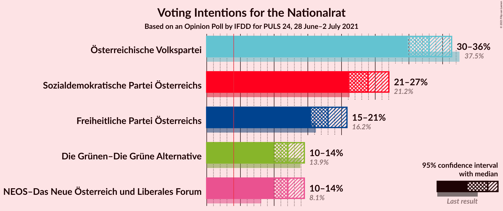

### Confidence Intervals

| Party | Last Result | Poll Result | 80% Confidence Interval | 90% Confidence Interval | 95% Confidence Interval | 99% Confidence Interval |
|:-----:|:-----------:|:-----------:|:-----------------------:|:-----------------------:|:-----------------------:|:-----------------------:|
| Österreichische Volkspartei | 37.5% | 33.0% | 30.9–35.2% |30.3–35.8% |29.8–36.3% |28.9–37.4% |
| Sozialdemokratische Partei Österreichs | 21.2% | 23.9% | 22.1–26.0% |21.6–26.5% |21.1–27.0% |20.3–28.0% |
| Freiheitliche Partei Österreichs | 16.2% | 18.0% | 16.3–19.8% |15.9–20.3% |15.5–20.8% |14.7–21.7% |
| NEOS–Das Neue Österreich und Liberales Forum | 8.1% | 12.0% | 10.7–13.6% |10.3–14.1% |10.0–14.5% |9.3–15.3% |
| Die Grünen–Die Grüne Alternative | 13.9% | 12.0% | 10.7–13.6% |10.3–14.1% |10.0–14.5% |9.3–15.3% |

*Note:* The poll result column reflects the actual value used in the calculations. Published results may vary slightly, and in addition be rounded to fewer digits.

## Seats

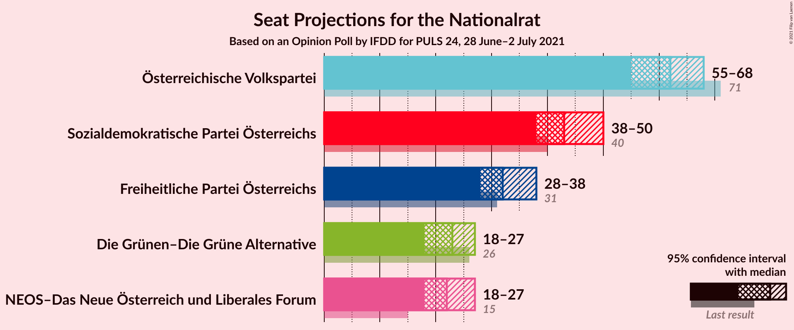

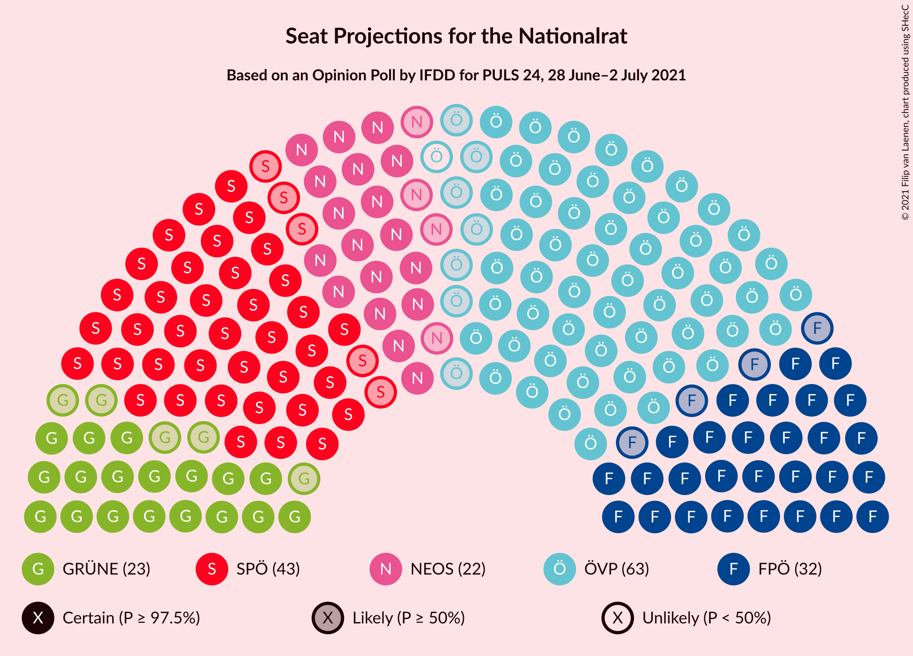

### Confidence Intervals

| Party | Last Result | Median | 80% Confidence Interval | 90% Confidence Interval | 95% Confidence Interval | 99% Confidence Interval |
|:-----:|:-----------:|:------:|:-----------------------:|:-----------------------:|:-----------------------:|:-----------------------:|
| <a href="#österreichische-volkspartei">Österreichische Volkspartei</a> | 71 | 62 | 58–66 |57–67 |55–68 |53–70 |
| <a href="#sozialdemokratische-partei-österreichs">Sozialdemokratische Partei Österreichs</a> | 40 | 43 | 40–47 |39–48 |38–50 |37–52 |
| <a href="#freiheitliche-partei-österreichs">Freiheitliche Partei Österreichs</a> | 31 | 32 | 29–36 |29–37 |28–38 |27–40 |
| <a href="#neos–das-neue-österreich-und-liberales-forum">NEOS–Das Neue Österreich und Liberales Forum</a> | 15 | 22 | 19–25 |19–25 |18–27 |17–28 |
| <a href="#die-grünen–die-grüne-alternative">Die Grünen–Die Grüne Alternative</a> | 26 | 23 | 20–25 |19–26 |18–27 |17–28 |

### Österreichische Volkspartei

*For a full overview of the results for this party, see the [Österreichische Volkspartei](party-österreichischevolkspartei.html) page.*

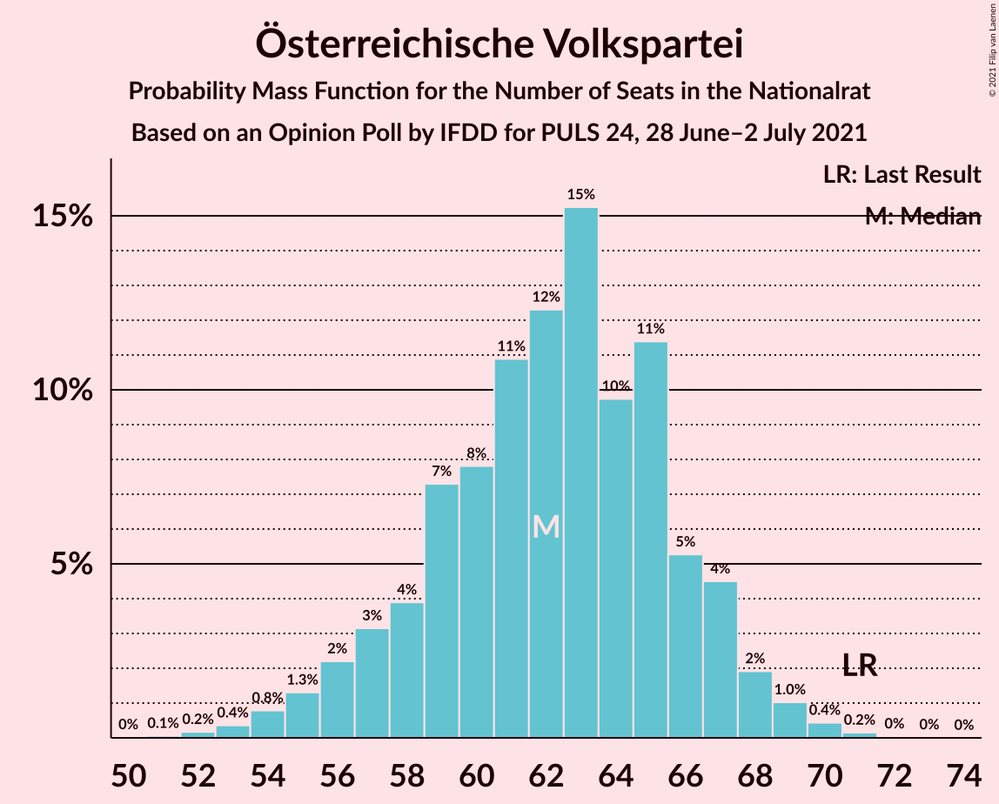

| Number of Seats | Probability | Accumulated | Special Marks |
|:---------------:|:-----------:|:-----------:|:-------------:|
| 51 | 0.1% | 100% |  |
| 52 | 0.2% | 99.9% |  |
| 53 | 0.4% | 99.7% |  |
| 54 | 0.8% | 99.4% |  |
| 55 | 1.3% | 98.6% |  |
| 56 | 2% | 97% |  |
| 57 | 3% | 95% |  |
| 58 | 4% | 92% |  |
| 59 | 7% | 88% |  |
| 60 | 8% | 81% |  |
| 61 | 11% | 73% |  |
| 62 | 12% | 62% | Median |
| 63 | 15% | 50% |  |
| 64 | 10% | 34% |  |
| 65 | 11% | 25% |  |
| 66 | 5% | 13% |  |
| 67 | 4% | 8% |  |
| 68 | 2% | 4% |  |
| 69 | 1.0% | 2% |  |
| 70 | 0.4% | 0.7% |  |
| 71 | 0.2% | 0.2% | Last Result |
| 72 | 0% | 0.1% |  |
| 73 | 0% | 0% |  |

### Sozialdemokratische Partei Österreichs

*For a full overview of the results for this party, see the [Sozialdemokratische Partei Österreichs](party-sozialdemokratischeparteiösterreichs.html) page.*

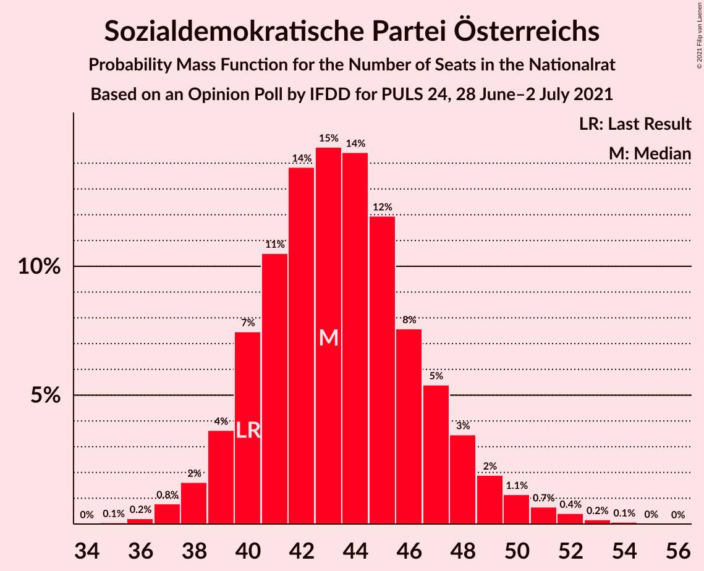

| Number of Seats | Probability | Accumulated | Special Marks |
|:---------------:|:-----------:|:-----------:|:-------------:|
| 35 | 0.1% | 100% |  |
| 36 | 0.2% | 99.9% |  |
| 37 | 0.8% | 99.7% |  |
| 38 | 2% | 98.9% |  |
| 39 | 4% | 97% |  |
| 40 | 7% | 94% | Last Result |
| 41 | 11% | 86% |  |
| 42 | 14% | 76% |  |
| 43 | 15% | 62% | Median |
| 44 | 14% | 47% |  |
| 45 | 12% | 33% |  |
| 46 | 8% | 21% |  |
| 47 | 5% | 13% |  |
| 48 | 3% | 8% |  |
| 49 | 2% | 4% |  |
| 50 | 1.1% | 3% |  |
| 51 | 0.7% | 1.4% |  |
| 52 | 0.4% | 0.7% |  |
| 53 | 0.2% | 0.3% |  |
| 54 | 0.1% | 0.1% |  |
| 55 | 0% | 0% |  |

### Freiheitliche Partei Österreichs

*For a full overview of the results for this party, see the [Freiheitliche Partei Österreichs](party-freiheitlicheparteiösterreichs.html) page.*

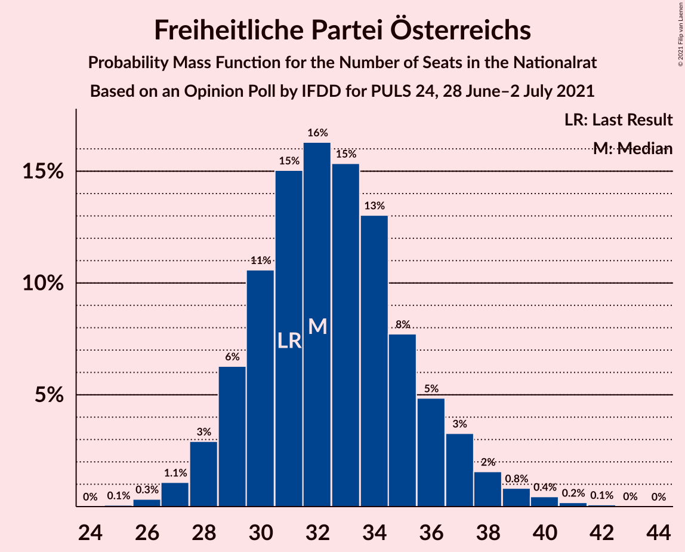

| Number of Seats | Probability | Accumulated | Special Marks |
|:---------------:|:-----------:|:-----------:|:-------------:|
| 25 | 0.1% | 100% |  |
| 26 | 0.3% | 99.9% |  |
| 27 | 1.1% | 99.6% |  |
| 28 | 3% | 98% |  |
| 29 | 6% | 96% |  |
| 30 | 11% | 89% |  |
| 31 | 15% | 79% | Last Result |
| 32 | 16% | 64% | Median |
| 33 | 15% | 47% |  |
| 34 | 13% | 32% |  |
| 35 | 8% | 19% |  |
| 36 | 5% | 11% |  |
| 37 | 3% | 6% |  |
| 38 | 2% | 3% |  |
| 39 | 0.8% | 2% |  |
| 40 | 0.4% | 0.7% |  |
| 41 | 0.2% | 0.3% |  |
| 42 | 0.1% | 0.1% |  |
| 43 | 0% | 0% |  |

### NEOS–Das Neue Österreich und Liberales Forum

*For a full overview of the results for this party, see the [NEOS–Das Neue Österreich und Liberales Forum](party-neos–dasneueösterreichundliberalesforum.html) page.*

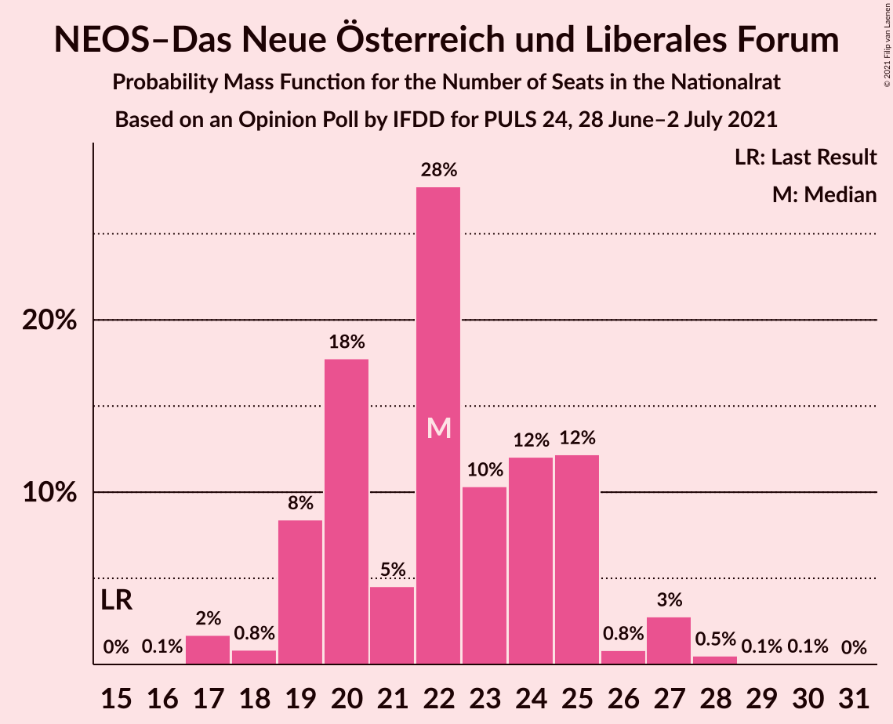

| Number of Seats | Probability | Accumulated | Special Marks |
|:---------------:|:-----------:|:-----------:|:-------------:|
| 15 | 0% | 100% | Last Result |
| 16 | 0.1% | 100% |  |
| 17 | 2% | 99.9% |  |
| 18 | 0.8% | 98% |  |
| 19 | 8% | 97% |  |
| 20 | 18% | 89% |  |
| 21 | 5% | 71% |  |
| 22 | 28% | 67% | Median |
| 23 | 10% | 39% |  |
| 24 | 12% | 29% |  |
| 25 | 12% | 16% |  |
| 26 | 0.8% | 4% |  |
| 27 | 3% | 3% |  |
| 28 | 0.5% | 0.7% |  |
| 29 | 0.1% | 0.2% |  |
| 30 | 0.1% | 0.1% |  |
| 31 | 0% | 0% |  |

### Die Grünen–Die Grüne Alternative

*For a full overview of the results for this party, see the [Die Grünen–Die Grüne Alternative](party-diegrünen–diegrünealternative.html) page.*

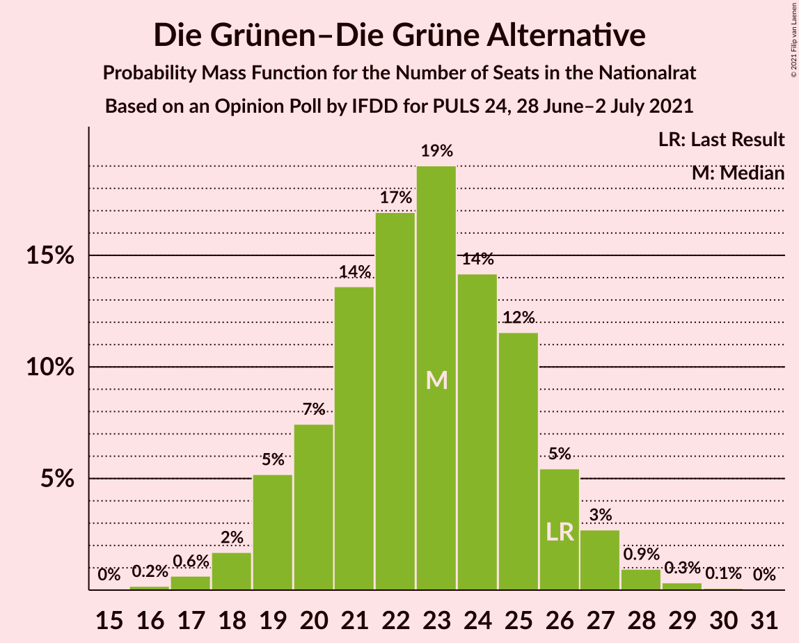

| Number of Seats | Probability | Accumulated | Special Marks |
|:---------------:|:-----------:|:-----------:|:-------------:|
| 16 | 0.2% | 100% |  |
| 17 | 0.6% | 99.8% |  |
| 18 | 2% | 99.2% |  |
| 19 | 5% | 97% |  |
| 20 | 7% | 92% |  |
| 21 | 14% | 85% |  |
| 22 | 17% | 71% |  |
| 23 | 19% | 54% | Median |
| 24 | 14% | 35% |  |
| 25 | 12% | 21% |  |
| 26 | 5% | 10% | Last Result |
| 27 | 3% | 4% |  |
| 28 | 0.9% | 1.4% |  |
| 29 | 0.3% | 0.4% |  |
| 30 | 0.1% | 0.1% |  |
| 31 | 0% | 0% |  |

## Coalitions

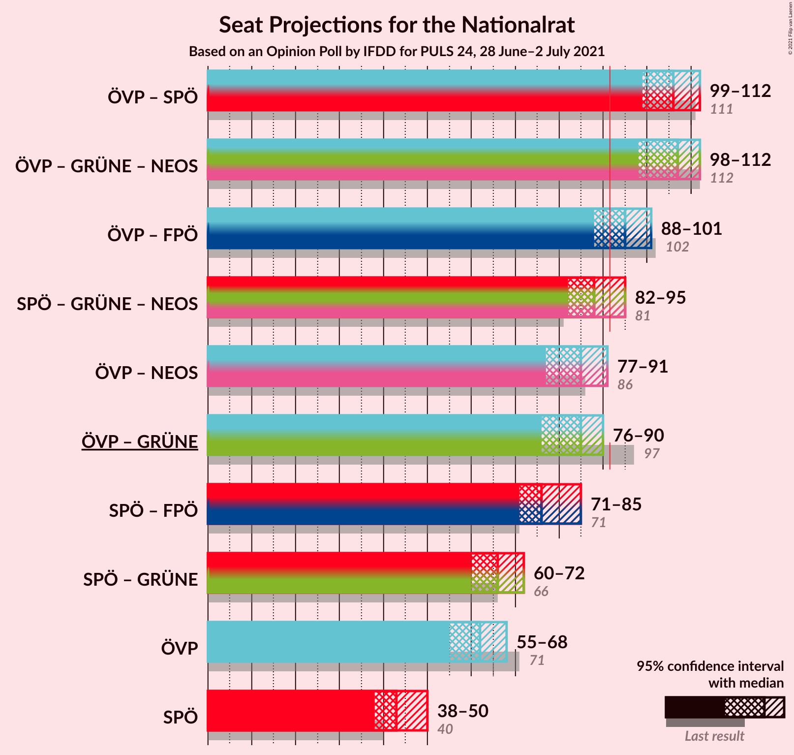

### Confidence Intervals

| Coalition | Last Result | Median | Majority? | 80% Confidence Interval | 90% Confidence Interval | 95% Confidence Interval | 99% Confidence Interval |
|:---------:|:-----------:|:------:|:---------:|:-----------------------:|:-----------------------:|:-----------------------:|:-----------------------:|
| Österreichische Volkspartei – Sozialdemokratische Partei Österreichs | 111 | 106 | 100% | 101–110 | 100–111 | 99–112 | 97–114 |
| Österreichische Volkspartei – Die Grünen–Die Grüne Alternative – NEOS–Das Neue Österreich und Liberales Forum | 112 | 107 | 100% | 103–111 | 100–112 | 98–112 | 96–114 |
| Österreichische Volkspartei – Freiheitliche Partei Österreichs | 102 | 95 | 82% | 91–99 | 89–100 | 88–101 | 86–103 |
| Sozialdemokratische Partei Österreichs – Die Grünen–Die Grüne Alternative – NEOS–Das Neue Österreich und Liberales Forum | 81 | 88 | 18% | 84–92 | 83–94 | 82–95 | 80–97 |
| Österreichische Volkspartei – NEOS–Das Neue Österreich und Liberales Forum | 86 | 85 | 1.1% | 80–89 | 78–89 | 77–91 | 75–92 |
| Österreichische Volkspartei – Die Grünen–Die Grüne Alternative | 97 | 85 | 0.6% | 81–89 | 77–90 | 76–90 | 74–92 |
| Sozialdemokratische Partei Österreichs – Freiheitliche Partei Österreichs | 71 | 76 | 0% | 72–80 | 71–83 | 71–85 | 69–87 |
| Sozialdemokratische Partei Österreichs – Die Grünen–Die Grüne Alternative | 66 | 66 | 0% | 62–70 | 61–71 | 60–72 | 58–74 |
| Österreichische Volkspartei | 71 | 62 | 0% | 58–66 | 57–67 | 55–68 | 53–70 |
| Sozialdemokratische Partei Österreichs | 40 | 43 | 0% | 40–47 | 39–48 | 38–50 | 37–52 |

### Österreichische Volkspartei – Sozialdemokratische Partei Österreichs

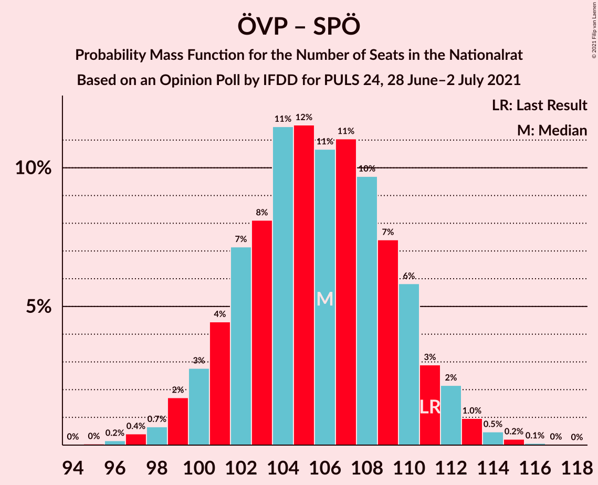

| Number of Seats | Probability | Accumulated | Special Marks |
|:---------------:|:-----------:|:-----------:|:-------------:|
| 95 | 0% | 100% |  |
| 96 | 0.2% | 99.9% |  |
| 97 | 0.4% | 99.8% |  |
| 98 | 0.7% | 99.3% |  |
| 99 | 2% | 98.7% |  |
| 100 | 3% | 97% |  |
| 101 | 4% | 94% |  |
| 102 | 7% | 90% |  |
| 103 | 8% | 83% |  |
| 104 | 11% | 74% |  |
| 105 | 12% | 63% | Median |
| 106 | 11% | 51% |  |
| 107 | 11% | 41% |  |
| 108 | 10% | 30% |  |
| 109 | 7% | 20% |  |
| 110 | 6% | 13% |  |
| 111 | 3% | 7% | Last Result |
| 112 | 2% | 4% |  |
| 113 | 1.0% | 2% |  |
| 114 | 0.5% | 0.8% |  |
| 115 | 0.2% | 0.3% |  |
| 116 | 0.1% | 0.1% |  |
| 117 | 0% | 0% |  |

### Österreichische Volkspartei – Die Grünen–Die Grüne Alternative – NEOS–Das Neue Österreich und Liberales Forum

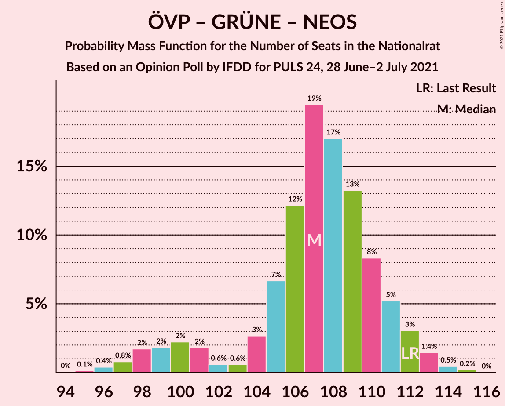

| Number of Seats | Probability | Accumulated | Special Marks |
|:---------------:|:-----------:|:-----------:|:-------------:|
| 94 | 0% | 100% |  |
| 95 | 0.1% | 99.9% |  |
| 96 | 0.4% | 99.8% |  |
| 97 | 0.8% | 99.4% |  |
| 98 | 2% | 98.6% |  |
| 99 | 2% | 97% |  |
| 100 | 2% | 95% |  |
| 101 | 2% | 93% |  |
| 102 | 0.6% | 91% |  |
| 103 | 0.6% | 90% |  |
| 104 | 3% | 90% |  |
| 105 | 7% | 87% |  |
| 106 | 12% | 81% |  |
| 107 | 19% | 68% | Median |
| 108 | 17% | 49% |  |
| 109 | 13% | 32% |  |
| 110 | 8% | 19% |  |
| 111 | 5% | 10% |  |
| 112 | 3% | 5% | Last Result |
| 113 | 1.4% | 2% |  |
| 114 | 0.5% | 0.7% |  |
| 115 | 0.2% | 0.2% |  |
| 116 | 0% | 0% |  |

### Österreichische Volkspartei – Freiheitliche Partei Österreichs

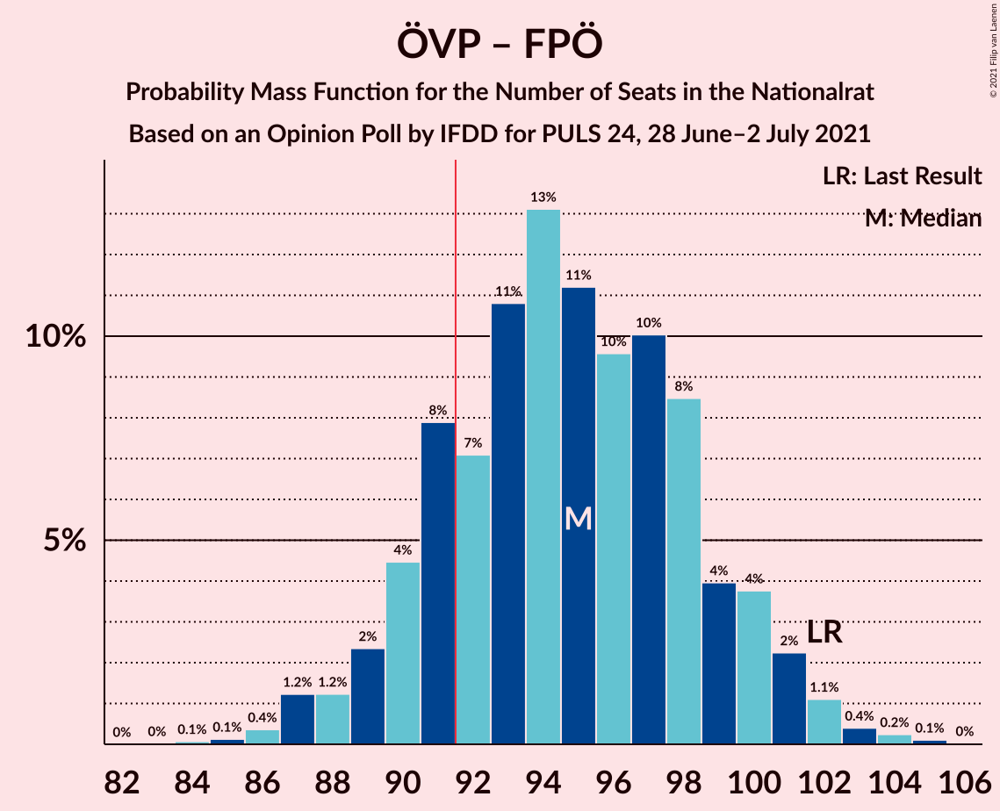

| Number of Seats | Probability | Accumulated | Special Marks |
|:---------------:|:-----------:|:-----------:|:-------------:|
| 84 | 0.1% | 100% |  |
| 85 | 0.1% | 99.9% |  |
| 86 | 0.4% | 99.8% |  |
| 87 | 1.2% | 99.4% |  |
| 88 | 1.2% | 98% |  |
| 89 | 2% | 97% |  |
| 90 | 4% | 95% |  |
| 91 | 8% | 90% |  |
| 92 | 7% | 82% | Majority |
| 93 | 11% | 75% |  |
| 94 | 13% | 64% | Median |
| 95 | 11% | 51% |  |
| 96 | 10% | 40% |  |
| 97 | 10% | 30% |  |
| 98 | 8% | 20% |  |
| 99 | 4% | 12% |  |
| 100 | 4% | 8% |  |
| 101 | 2% | 4% |  |
| 102 | 1.1% | 2% | Last Result |
| 103 | 0.4% | 0.8% |  |
| 104 | 0.2% | 0.4% |  |
| 105 | 0.1% | 0.1% |  |
| 106 | 0% | 0% |  |

### Sozialdemokratische Partei Österreichs – Die Grünen–Die Grüne Alternative – NEOS–Das Neue Österreich und Liberales Forum

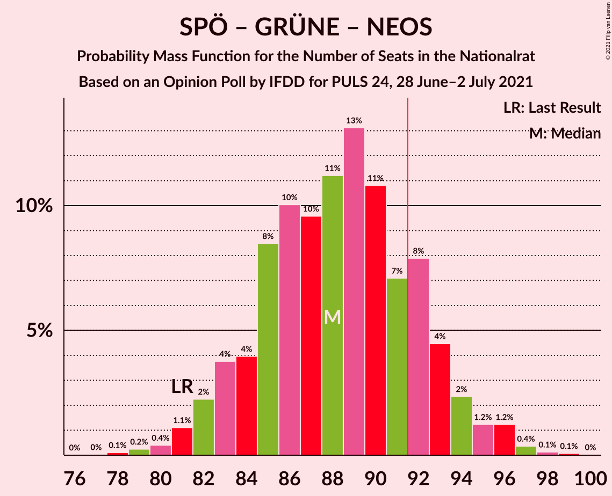

| Number of Seats | Probability | Accumulated | Special Marks |
|:---------------:|:-----------:|:-----------:|:-------------:|
| 78 | 0.1% | 100% |  |
| 79 | 0.2% | 99.9% |  |
| 80 | 0.4% | 99.6% |  |
| 81 | 1.1% | 99.2% | Last Result |
| 82 | 2% | 98% |  |
| 83 | 4% | 96% |  |
| 84 | 4% | 92% |  |
| 85 | 8% | 88% |  |
| 86 | 10% | 80% |  |
| 87 | 10% | 70% |  |
| 88 | 11% | 60% | Median |
| 89 | 13% | 49% |  |
| 90 | 11% | 36% |  |
| 91 | 7% | 25% |  |
| 92 | 8% | 18% | Majority |
| 93 | 4% | 10% |  |
| 94 | 2% | 5% |  |
| 95 | 1.2% | 3% |  |
| 96 | 1.2% | 2% |  |
| 97 | 0.4% | 0.6% |  |
| 98 | 0.1% | 0.2% |  |
| 99 | 0.1% | 0.1% |  |
| 100 | 0% | 0% |  |

### Österreichische Volkspartei – NEOS–Das Neue Österreich und Liberales Forum

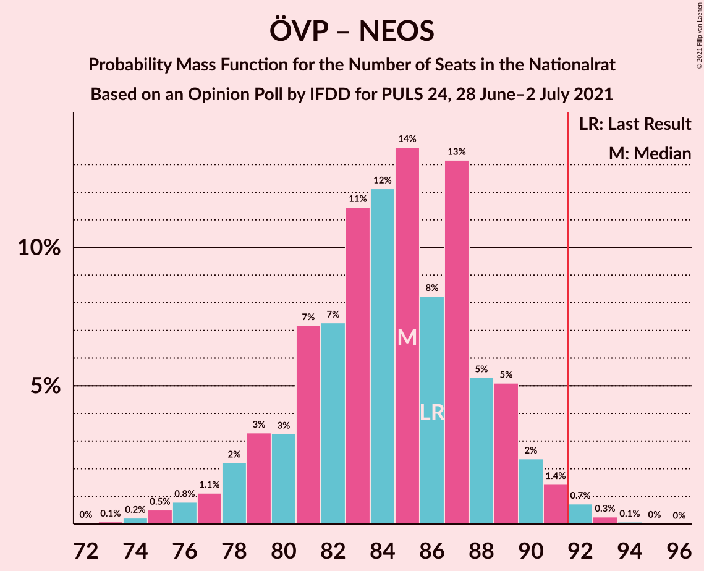

| Number of Seats | Probability | Accumulated | Special Marks |
|:---------------:|:-----------:|:-----------:|:-------------:|
| 72 | 0% | 100% |  |
| 73 | 0.1% | 99.9% |  |
| 74 | 0.2% | 99.9% |  |
| 75 | 0.5% | 99.6% |  |
| 76 | 0.8% | 99.1% |  |
| 77 | 1.1% | 98% |  |
| 78 | 2% | 97% |  |
| 79 | 3% | 95% |  |
| 80 | 3% | 92% |  |
| 81 | 7% | 88% |  |
| 82 | 7% | 81% |  |
| 83 | 11% | 74% |  |
| 84 | 12% | 62% | Median |
| 85 | 14% | 50% |  |
| 86 | 8% | 37% | Last Result |
| 87 | 13% | 28% |  |
| 88 | 5% | 15% |  |
| 89 | 5% | 10% |  |
| 90 | 2% | 5% |  |
| 91 | 1.4% | 3% |  |
| 92 | 0.7% | 1.1% | Majority |
| 93 | 0.3% | 0.4% |  |
| 94 | 0.1% | 0.1% |  |
| 95 | 0% | 0.1% |  |
| 96 | 0% | 0% |  |

### Österreichische Volkspartei – Die Grünen–Die Grüne Alternative

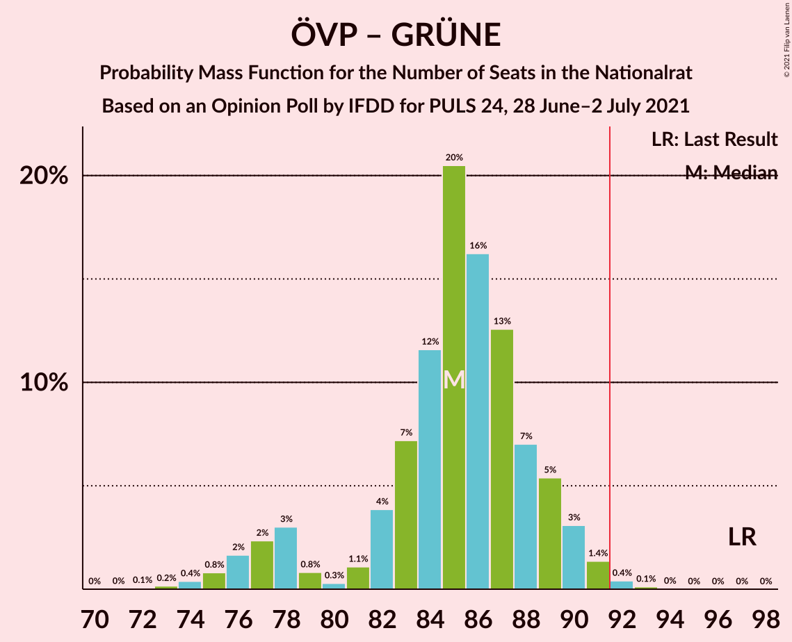

| Number of Seats | Probability | Accumulated | Special Marks |
|:---------------:|:-----------:|:-----------:|:-------------:|
| 72 | 0.1% | 100% |  |
| 73 | 0.2% | 99.9% |  |
| 74 | 0.4% | 99.8% |  |
| 75 | 0.8% | 99.4% |  |
| 76 | 2% | 98.6% |  |
| 77 | 2% | 97% |  |
| 78 | 3% | 95% |  |
| 79 | 0.8% | 92% |  |
| 80 | 0.3% | 91% |  |
| 81 | 1.1% | 90% |  |
| 82 | 4% | 89% |  |
| 83 | 7% | 86% |  |
| 84 | 12% | 78% |  |
| 85 | 20% | 67% | Median |
| 86 | 16% | 46% |  |
| 87 | 13% | 30% |  |
| 88 | 7% | 17% |  |
| 89 | 5% | 10% |  |
| 90 | 3% | 5% |  |
| 91 | 1.4% | 2% |  |
| 92 | 0.4% | 0.6% | Majority |
| 93 | 0.1% | 0.1% |  |
| 94 | 0% | 0% |  |
| 95 | 0% | 0% |  |
| 96 | 0% | 0% |  |
| 97 | 0% | 0% | Last Result |

### Sozialdemokratische Partei Österreichs – Freiheitliche Partei Österreichs

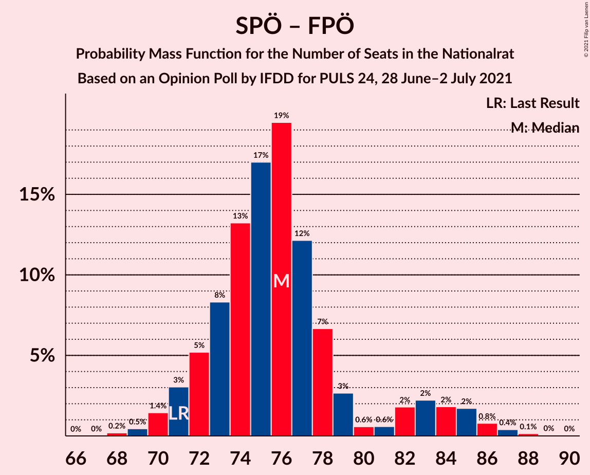

| Number of Seats | Probability | Accumulated | Special Marks |
|:---------------:|:-----------:|:-----------:|:-------------:|
| 68 | 0.2% | 100% |  |
| 69 | 0.5% | 99.8% |  |
| 70 | 1.4% | 99.3% |  |
| 71 | 3% | 98% | Last Result |
| 72 | 5% | 95% |  |
| 73 | 8% | 90% |  |
| 74 | 13% | 81% |  |
| 75 | 17% | 68% | Median |
| 76 | 19% | 51% |  |
| 77 | 12% | 32% |  |
| 78 | 7% | 19% |  |
| 79 | 3% | 13% |  |
| 80 | 0.6% | 10% |  |
| 81 | 0.6% | 10% |  |
| 82 | 2% | 9% |  |
| 83 | 2% | 7% |  |
| 84 | 2% | 5% |  |
| 85 | 2% | 3% |  |
| 86 | 0.8% | 1.4% |  |
| 87 | 0.4% | 0.6% |  |
| 88 | 0.1% | 0.2% |  |
| 89 | 0% | 0.1% |  |
| 90 | 0% | 0% |  |

### Sozialdemokratische Partei Österreichs – Die Grünen–Die Grüne Alternative

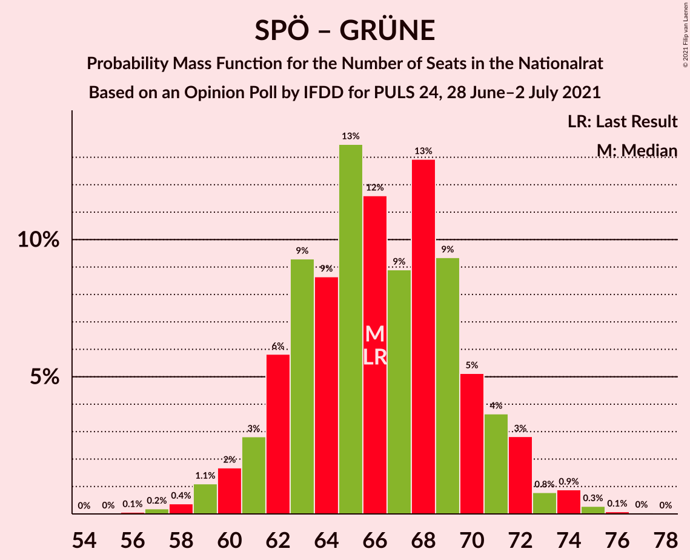

| Number of Seats | Probability | Accumulated | Special Marks |
|:---------------:|:-----------:|:-----------:|:-------------:|
| 56 | 0.1% | 100% |  |
| 57 | 0.2% | 99.9% |  |
| 58 | 0.4% | 99.7% |  |
| 59 | 1.1% | 99.3% |  |
| 60 | 2% | 98% |  |
| 61 | 3% | 97% |  |
| 62 | 6% | 94% |  |
| 63 | 9% | 88% |  |
| 64 | 9% | 79% |  |
| 65 | 13% | 70% |  |
| 66 | 12% | 56% | Last Result, Median |
| 67 | 9% | 45% |  |
| 68 | 13% | 36% |  |
| 69 | 9% | 23% |  |
| 70 | 5% | 14% |  |
| 71 | 4% | 9% |  |
| 72 | 3% | 5% |  |
| 73 | 0.8% | 2% |  |
| 74 | 0.9% | 1.3% |  |
| 75 | 0.3% | 0.4% |  |
| 76 | 0.1% | 0.2% |  |
| 77 | 0% | 0.1% |  |
| 78 | 0% | 0% |  |

### Österreichische Volkspartei

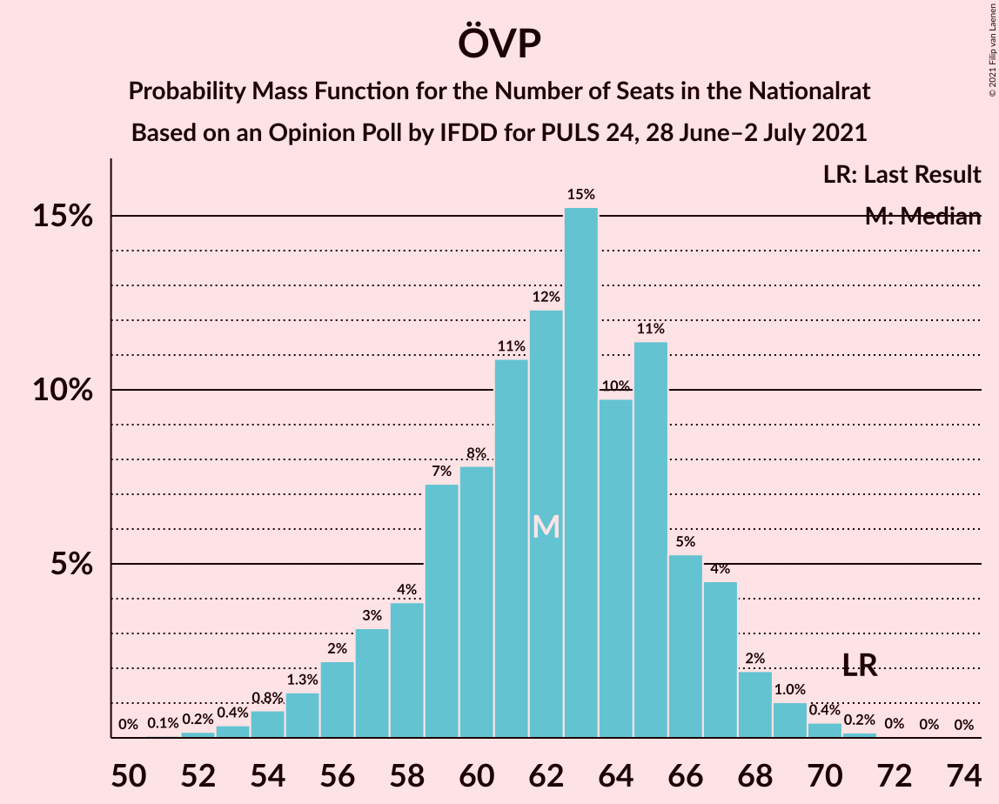

| Number of Seats | Probability | Accumulated | Special Marks |
|:---------------:|:-----------:|:-----------:|:-------------:|
| 51 | 0.1% | 100% |  |
| 52 | 0.2% | 99.9% |  |
| 53 | 0.4% | 99.7% |  |
| 54 | 0.8% | 99.4% |  |
| 55 | 1.3% | 98.6% |  |
| 56 | 2% | 97% |  |
| 57 | 3% | 95% |  |
| 58 | 4% | 92% |  |
| 59 | 7% | 88% |  |
| 60 | 8% | 81% |  |
| 61 | 11% | 73% |  |
| 62 | 12% | 62% | Median |
| 63 | 15% | 50% |  |
| 64 | 10% | 34% |  |
| 65 | 11% | 25% |  |
| 66 | 5% | 13% |  |
| 67 | 4% | 8% |  |
| 68 | 2% | 4% |  |
| 69 | 1.0% | 2% |  |
| 70 | 0.4% | 0.7% |  |
| 71 | 0.2% | 0.2% | Last Result |
| 72 | 0% | 0.1% |  |
| 73 | 0% | 0% |  |

### Sozialdemokratische Partei Österreichs

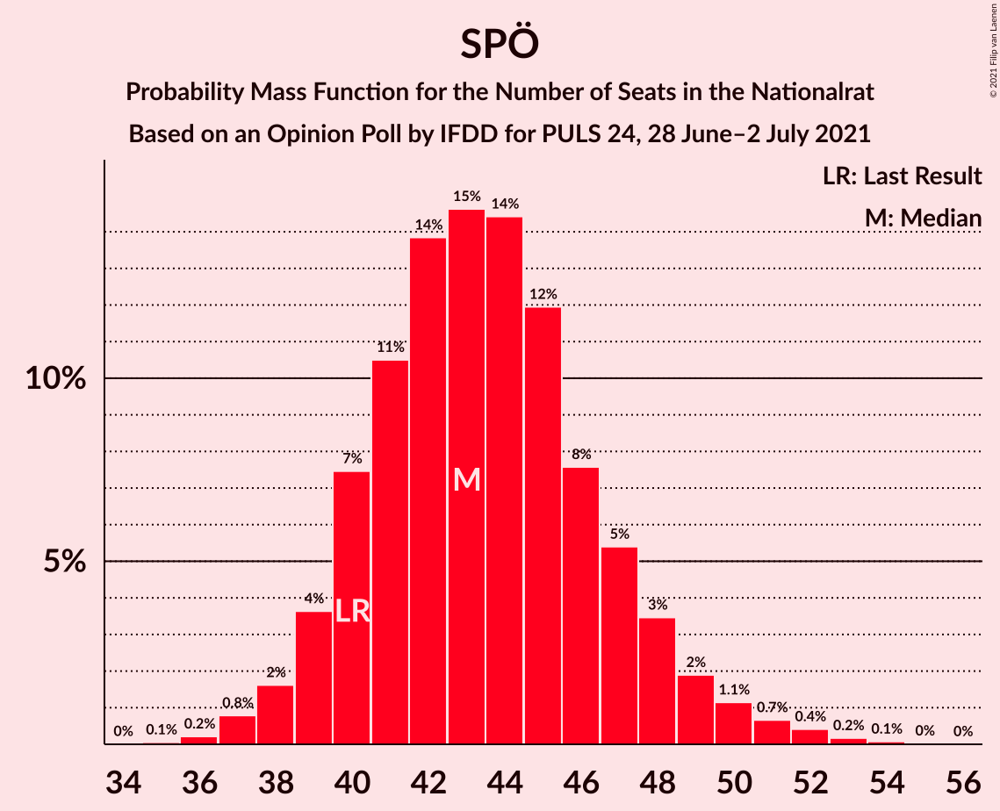

| Number of Seats | Probability | Accumulated | Special Marks |
|:---------------:|:-----------:|:-----------:|:-------------:|
| 35 | 0.1% | 100% |  |
| 36 | 0.2% | 99.9% |  |
| 37 | 0.8% | 99.7% |  |
| 38 | 2% | 98.9% |  |
| 39 | 4% | 97% |  |
| 40 | 7% | 94% | Last Result |
| 41 | 11% | 86% |  |
| 42 | 14% | 76% |  |
| 43 | 15% | 62% | Median |
| 44 | 14% | 47% |  |
| 45 | 12% | 33% |  |
| 46 | 8% | 21% |  |
| 47 | 5% | 13% |  |
| 48 | 3% | 8% |  |
| 49 | 2% | 4% |  |
| 50 | 1.1% | 3% |  |
| 51 | 0.7% | 1.4% |  |
| 52 | 0.4% | 0.7% |  |
| 53 | 0.2% | 0.3% |  |
| 54 | 0.1% | 0.1% |  |
| 55 | 0% | 0% |  |

## Technical Information

### Opinion Poll

+ **Polling firm:** IFDD
+ **Commissioner(s):** PULS 24
+ **Fieldwork period:** 28 June–2 July 2021

### Calculations

+ **Sample size:** 806
+ **Simulations done:** 131,072
+ **Error estimate:** 1.71%

