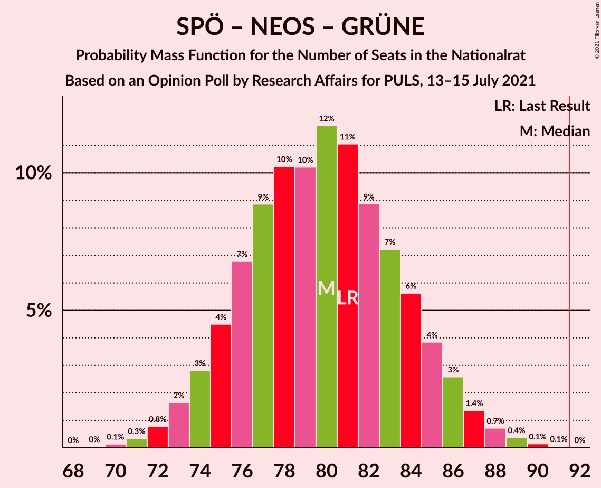
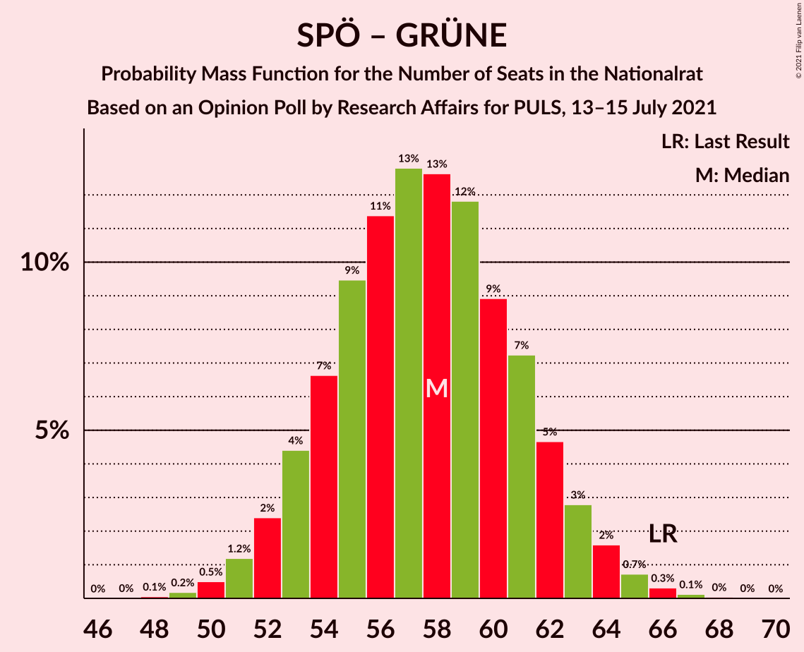

# Opinion Poll by Research Affairs for PULS, 13–15 July 2021

<a href="#voting-intentions">Voting Intentions</a> | <a href="#seats">Seats</a> | <a href="#coalitions">Coalitions</a> | <a href="#technical-information">Technical Information</a>

## Voting Intentions

### Confidence Intervals

| Party | Last Result | Poll Result | 80% Confidence Interval | 90% Confidence Interval | 95% Confidence Interval | 99% Confidence Interval |
|:-----:|:-----------:|:-----------:|:-----------------------:|:-----------------------:|:-----------------------:|:-----------------------:|
| Österreichische Volkspartei | 37.5% | 35.0% | 33.1–37.0% |32.6–37.5% |32.1–38.0% |31.2–39.0% |
| Sozialdemokratische Partei Österreichs | 21.2% | 20.0% | 18.4–21.7% |18.0–22.2% |17.6–22.6% |16.9–23.4% |
| Freiheitliche Partei Österreichs | 16.2% | 18.0% | 16.5–19.6% |16.1–20.1% |15.7–20.5% |15.0–21.3% |
| NEOS–Das Neue Österreich und Liberales Forum | 8.1% | 12.0% | 10.8–13.4% |10.4–13.8% |10.1–14.2% |9.6–14.9% |
| Die Grünen–Die Grüne Alternative | 13.9% | 11.0% | 9.8–12.4% |9.5–12.8% |9.2–13.1% |8.7–13.8% |

*Note:* The poll result column reflects the actual value used in the calculations. Published results may vary slightly, and in addition be rounded to fewer digits.

## Seats

### Confidence Intervals

| Party | Last Result | Median | 80% Confidence Interval | 90% Confidence Interval | 95% Confidence Interval | 99% Confidence Interval |
|:-----:|:-----------:|:------:|:-----------------------:|:-----------------------:|:-----------------------:|:-----------------------:|
| <a href="#österreichische-volkspartei">Österreichische Volkspartei</a> | 71 | 65 | 62–69 |60–71 |59–72 |58–74 |
| <a href="#sozialdemokratische-partei-österreichs">Sozialdemokratische Partei Österreichs</a> | 40 | 37 | 34–41 |33–42 |33–42 |31–44 |
| <a href="#freiheitliche-partei-österreichs">Freiheitliche Partei Österreichs</a> | 31 | 33 | 30–37 |30–38 |29–39 |28–40 |
| <a href="#neos–das-neue-österreich-und-liberales-forum">NEOS–Das Neue Österreich und Liberales Forum</a> | 15 | 22 | 20–25 |19–26 |19–26 |17–28 |
| <a href="#die-grünen–die-grüne-alternative">Die Grünen–Die Grüne Alternative</a> | 26 | 21 | 18–23 |17–24 |17–24 |16–26 |

### Österreichische Volkspartei

*For a full overview of the results for this party, see the [Österreichische Volkspartei](party-österreichischevolkspartei.html) page.*

| Number of Seats | Probability | Accumulated | Special Marks |
|:---------------:|:-----------:|:-----------:|:-------------:|
| 56 | 0.1% | 100% |  |
| 57 | 0.3% | 99.9% |  |
| 58 | 0.6% | 99.6% |  |
| 59 | 2% | 99.0% |  |
| 60 | 3% | 97% |  |
| 61 | 4% | 94% |  |
| 62 | 7% | 90% |  |
| 63 | 9% | 83% |  |
| 64 | 11% | 73% |  |
| 65 | 13% | 62% | Median |
| 66 | 13% | 49% |  |
| 67 | 11% | 36% |  |
| 68 | 9% | 25% |  |
| 69 | 7% | 16% |  |
| 70 | 3% | 9% |  |
| 71 | 3% | 6% | Last Result |
| 72 | 1.1% | 3% |  |
| 73 | 2% | 2% |  |
| 74 | 0.4% | 0.7% |  |
| 75 | 0.1% | 0.2% |  |
| 76 | 0.1% | 0.1% |  |
| 77 | 0% | 0% |  |

### Sozialdemokratische Partei Österreichs

*For a full overview of the results for this party, see the [Sozialdemokratische Partei Österreichs](party-sozialdemokratischeparteiösterreichs.html) page.*

| Number of Seats | Probability | Accumulated | Special Marks |
|:---------------:|:-----------:|:-----------:|:-------------:|
| 29 | 0% | 100% |  |
| 30 | 0.2% | 99.9% |  |
| 31 | 0.6% | 99.8% |  |
| 32 | 2% | 99.2% |  |
| 33 | 4% | 98% |  |
| 34 | 7% | 94% |  |
| 35 | 11% | 87% |  |
| 36 | 14% | 76% |  |
| 37 | 16% | 61% | Median |
| 38 | 15% | 45% |  |
| 39 | 12% | 31% |  |
| 40 | 8% | 19% | Last Result |
| 41 | 6% | 11% |  |
| 42 | 3% | 5% |  |
| 43 | 1.2% | 2% |  |
| 44 | 0.5% | 0.8% |  |
| 45 | 0.2% | 0.3% |  |
| 46 | 0.1% | 0.1% |  |
| 47 | 0% | 0% |  |

### Freiheitliche Partei Österreichs

*For a full overview of the results for this party, see the [Freiheitliche Partei Österreichs](party-freiheitlicheparteiösterreichs.html) page.*

| Number of Seats | Probability | Accumulated | Special Marks |
|:---------------:|:-----------:|:-----------:|:-------------:|
| 26 | 0.1% | 100% |  |
| 27 | 0.4% | 99.9% |  |
| 28 | 1.2% | 99.5% |  |
| 29 | 3% | 98% |  |
| 30 | 6% | 95% |  |
| 31 | 10% | 90% | Last Result |
| 32 | 13% | 79% |  |
| 33 | 16% | 66% | Median |
| 34 | 15% | 50% |  |
| 35 | 13% | 35% |  |
| 36 | 10% | 21% |  |
| 37 | 6% | 11% |  |
| 38 | 3% | 6% |  |
| 39 | 2% | 3% |  |
| 40 | 0.7% | 0.9% |  |
| 41 | 0.2% | 0.3% |  |
| 42 | 0.1% | 0.1% |  |
| 43 | 0% | 0% |  |

### NEOS–Das Neue Österreich und Liberales Forum

*For a full overview of the results for this party, see the [NEOS–Das Neue Österreich und Liberales Forum](party-neos–dasneueösterreichundliberalesforum.html) page.*

| Number of Seats | Probability | Accumulated | Special Marks |
|:---------------:|:-----------:|:-----------:|:-------------:|
| 15 | 0% | 100% | Last Result |
| 16 | 0.1% | 100% |  |
| 17 | 0.5% | 99.9% |  |
| 18 | 2% | 99.5% |  |
| 19 | 6% | 98% |  |
| 20 | 12% | 92% |  |
| 21 | 18% | 79% |  |
| 22 | 21% | 61% | Median |
| 23 | 17% | 40% |  |
| 24 | 11% | 23% |  |
| 25 | 7% | 12% |  |
| 26 | 3% | 6% |  |
| 27 | 2% | 2% |  |
| 28 | 0.6% | 0.8% |  |
| 29 | 0.2% | 0.2% |  |
| 30 | 0% | 0% |  |

### Die Grünen–Die Grüne Alternative

*For a full overview of the results for this party, see the [Die Grünen–Die Grüne Alternative](party-diegrünen–diegrünealternative.html) page.*

| Number of Seats | Probability | Accumulated | Special Marks |
|:---------------:|:-----------:|:-----------:|:-------------:|
| 15 | 0.2% | 100% |  |
| 16 | 1.4% | 99.8% |  |
| 17 | 6% | 98% |  |
| 18 | 13% | 92% |  |
| 19 | 12% | 79% |  |
| 20 | 16% | 67% |  |
| 21 | 18% | 51% | Median |
| 22 | 19% | 33% |  |
| 23 | 9% | 14% |  |
| 24 | 3% | 5% |  |
| 25 | 1.0% | 2% |  |
| 26 | 0.4% | 0.6% | Last Result |
| 27 | 0.2% | 0.2% |  |
| 28 | 0% | 0% |  |

## Coalitions

### Confidence Intervals

| Coalition | Last Result | Median | Majority? | 80% Confidence Interval | 90% Confidence Interval | 95% Confidence Interval | 99% Confidence Interval |
|:---------:|:-----------:|:------:|:---------:|:-----------------------:|:-----------------------:|:-----------------------:|:-----------------------:|
| Österreichische Volkspartei – NEOS–Das Neue Österreich und Liberales Forum – Die Grünen–Die Grüne Alternative | 112 | 108 | 100% | 103–113 | 102–114 | 101–115 | 99–117 |
| Österreichische Volkspartei – Sozialdemokratische Partei Österreichs | 111 | 103 | 100% | 98–108 | 97–109 | 96–110 | 94–112 |
| Österreichische Volkspartei – Freiheitliche Partei Österreichs | 102 | 99 | 98% | 94–104 | 93–105 | 92–106 | 90–108 |
| Österreichische Volkspartei – NEOS–Das Neue Österreich und Liberales Forum | 86 | 88 | 14% | 83–92 | 82–93 | 81–94 | 79–97 |
| Österreichische Volkspartei – Die Grünen–Die Grüne Alternative | 97 | 86 | 6% | 81–90 | 80–92 | 79–93 | 77–95 |
| Sozialdemokratische Partei Österreichs – NEOS–Das Neue Österreich und Liberales Forum – Die Grünen–Die Grüne Alternative | 81 | 80 | 0% | 75–84 | 74–86 | 73–87 | 71–89 |
| Sozialdemokratische Partei Österreichs – Freiheitliche Partei Österreichs | 71 | 71 | 0% | 66–75 | 65–76 | 64–77 | 63–79 |
| Österreichische Volkspartei | 71 | 65 | 0% | 62–69 | 60–71 | 59–72 | 58–74 |
| Sozialdemokratische Partei Österreichs – Die Grünen–Die Grüne Alternative | 66 | 58 | 0% | 54–62 | 53–63 | 52–64 | 50–65 |
| Sozialdemokratische Partei Österreichs | 40 | 37 | 0% | 34–41 | 33–42 | 33–42 | 31–44 |

### Österreichische Volkspartei – NEOS–Das Neue Österreich und Liberales Forum – Die Grünen–Die Grüne Alternative

| Number of Seats | Probability | Accumulated | Special Marks |
|:---------------:|:-----------:|:-----------:|:-------------:|
| 97 | 0.1% | 100% |  |
| 98 | 0.2% | 99.9% |  |
| 99 | 0.4% | 99.7% |  |
| 100 | 1.0% | 99.3% |  |
| 101 | 2% | 98% |  |
| 102 | 3% | 97% |  |
| 103 | 5% | 93% |  |
| 104 | 7% | 89% |  |
| 105 | 7% | 82% |  |
| 106 | 10% | 74% |  |
| 107 | 10% | 65% |  |
| 108 | 9% | 55% | Median |
| 109 | 11% | 46% |  |
| 110 | 9% | 35% |  |
| 111 | 8% | 26% |  |
| 112 | 6% | 18% | Last Result |
| 113 | 5% | 12% |  |
| 114 | 3% | 7% |  |
| 115 | 2% | 4% |  |
| 116 | 1.3% | 2% |  |
| 117 | 0.6% | 1.0% |  |
| 118 | 0.2% | 0.4% |  |
| 119 | 0.1% | 0.1% |  |
| 120 | 0% | 0% |  |

### Österreichische Volkspartei – Sozialdemokratische Partei Österreichs

| Number of Seats | Probability | Accumulated | Special Marks |
|:---------------:|:-----------:|:-----------:|:-------------:|
| 92 | 0.1% | 100% | Majority |
| 93 | 0.2% | 99.9% |  |
| 94 | 0.5% | 99.6% |  |
| 95 | 1.2% | 99.2% |  |
| 96 | 2% | 98% |  |
| 97 | 4% | 96% |  |
| 98 | 5% | 92% |  |
| 99 | 7% | 87% |  |
| 100 | 8% | 80% |  |
| 101 | 9% | 72% |  |
| 102 | 12% | 63% | Median |
| 103 | 10% | 51% |  |
| 104 | 10% | 42% |  |
| 105 | 8% | 31% |  |
| 106 | 8% | 23% |  |
| 107 | 5% | 16% |  |
| 108 | 4% | 10% |  |
| 109 | 3% | 6% |  |
| 110 | 2% | 3% |  |
| 111 | 0.9% | 2% | Last Result |
| 112 | 0.5% | 0.7% |  |
| 113 | 0.2% | 0.3% |  |
| 114 | 0.1% | 0.1% |  |
| 115 | 0% | 0% |  |

### Österreichische Volkspartei – Freiheitliche Partei Österreichs

| Number of Seats | Probability | Accumulated | Special Marks |
|:---------------:|:-----------:|:-----------:|:-------------:|
| 88 | 0.1% | 100% |  |
| 89 | 0.2% | 99.9% |  |
| 90 | 0.5% | 99.7% |  |
| 91 | 0.9% | 99.3% |  |
| 92 | 2% | 98% | Majority |
| 93 | 2% | 96% |  |
| 94 | 5% | 94% |  |
| 95 | 7% | 89% |  |
| 96 | 7% | 82% |  |
| 97 | 9% | 74% |  |
| 98 | 10% | 65% | Median |
| 99 | 11% | 55% |  |
| 100 | 11% | 44% |  |
| 101 | 9% | 34% |  |
| 102 | 7% | 25% | Last Result |
| 103 | 7% | 18% |  |
| 104 | 4% | 11% |  |
| 105 | 4% | 7% |  |
| 106 | 2% | 4% |  |
| 107 | 0.8% | 2% |  |
| 108 | 0.8% | 1.1% |  |
| 109 | 0.2% | 0.3% |  |
| 110 | 0.1% | 0.1% |  |
| 111 | 0% | 0% |  |

### Österreichische Volkspartei – NEOS–Das Neue Österreich und Liberales Forum

| Number of Seats | Probability | Accumulated | Special Marks |
|:---------------:|:-----------:|:-----------:|:-------------:|
| 77 | 0.1% | 100% |  |
| 78 | 0.2% | 99.9% |  |
| 79 | 0.5% | 99.7% |  |
| 80 | 1.1% | 99.3% |  |
| 81 | 2% | 98% |  |
| 82 | 3% | 96% |  |
| 83 | 5% | 93% |  |
| 84 | 7% | 88% |  |
| 85 | 9% | 81% |  |
| 86 | 10% | 72% | Last Result |
| 87 | 10% | 62% | Median |
| 88 | 11% | 51% |  |
| 89 | 13% | 41% |  |
| 90 | 8% | 28% |  |
| 91 | 6% | 20% |  |
| 92 | 5% | 14% | Majority |
| 93 | 5% | 9% |  |
| 94 | 2% | 4% |  |
| 95 | 1.0% | 2% |  |
| 96 | 0.7% | 1.4% |  |
| 97 | 0.4% | 0.6% |  |
| 98 | 0.1% | 0.2% |  |
| 99 | 0% | 0.1% |  |
| 100 | 0% | 0% |  |

### Österreichische Volkspartei – Die Grünen–Die Grüne Alternative

| Number of Seats | Probability | Accumulated | Special Marks |
|:---------------:|:-----------:|:-----------:|:-------------:|
| 75 | 0.1% | 100% |  |
| 76 | 0.2% | 99.9% |  |
| 77 | 0.4% | 99.7% |  |
| 78 | 0.7% | 99.4% |  |
| 79 | 2% | 98.7% |  |
| 80 | 3% | 97% |  |
| 81 | 5% | 94% |  |
| 82 | 7% | 89% |  |
| 83 | 6% | 82% |  |
| 84 | 9% | 75% |  |
| 85 | 10% | 66% |  |
| 86 | 12% | 57% | Median |
| 87 | 13% | 44% |  |
| 88 | 10% | 31% |  |
| 89 | 9% | 21% |  |
| 90 | 4% | 13% |  |
| 91 | 3% | 9% |  |
| 92 | 2% | 6% | Majority |
| 93 | 2% | 4% |  |
| 94 | 1.4% | 2% |  |
| 95 | 0.4% | 0.7% |  |
| 96 | 0.2% | 0.3% |  |
| 97 | 0% | 0.1% | Last Result |
| 98 | 0% | 0% |  |

### Sozialdemokratische Partei Österreichs – NEOS–Das Neue Österreich und Liberales Forum – Die Grünen–Die Grüne Alternative

| Number of Seats | Probability | Accumulated | Special Marks |
|:---------------:|:-----------:|:-----------:|:-------------:|
| 69 | 0.1% | 100% |  |
| 70 | 0.2% | 99.9% |  |
| 71 | 0.4% | 99.8% |  |
| 72 | 0.8% | 99.4% |  |
| 73 | 2% | 98.6% |  |
| 74 | 3% | 97% |  |
| 75 | 5% | 94% |  |
| 76 | 7% | 89% |  |
| 77 | 7% | 82% |  |
| 78 | 12% | 75% |  |
| 79 | 10% | 63% |  |
| 80 | 11% | 54% | Median |
| 81 | 10% | 43% | Last Result |
| 82 | 9% | 32% |  |
| 83 | 9% | 23% |  |
| 84 | 5% | 14% |  |
| 85 | 3% | 9% |  |
| 86 | 3% | 6% |  |
| 87 | 2% | 3% |  |
| 88 | 0.7% | 1.3% |  |
| 89 | 0.3% | 0.5% |  |
| 90 | 0.1% | 0.2% |  |
| 91 | 0.1% | 0.1% |  |
| 92 | 0% | 0% | Majority |

### Sozialdemokratische Partei Österreichs – Freiheitliche Partei Österreichs

| Number of Seats | Probability | Accumulated | Special Marks |
|:---------------:|:-----------:|:-----------:|:-------------:|
| 61 | 0.1% | 100% |  |
| 62 | 0.3% | 99.9% |  |
| 63 | 0.8% | 99.6% |  |
| 64 | 1.4% | 98.8% |  |
| 65 | 3% | 97% |  |
| 66 | 5% | 95% |  |
| 67 | 7% | 90% |  |
| 68 | 8% | 83% |  |
| 69 | 9% | 75% |  |
| 70 | 12% | 65% | Median |
| 71 | 11% | 54% | Last Result |
| 72 | 11% | 43% |  |
| 73 | 9% | 31% |  |
| 74 | 9% | 23% |  |
| 75 | 6% | 14% |  |
| 76 | 4% | 8% |  |
| 77 | 2% | 4% |  |
| 78 | 1.0% | 2% |  |
| 79 | 0.5% | 0.9% |  |
| 80 | 0.2% | 0.3% |  |
| 81 | 0.1% | 0.1% |  |
| 82 | 0% | 0% |  |

### Österreichische Volkspartei

| Number of Seats | Probability | Accumulated | Special Marks |
|:---------------:|:-----------:|:-----------:|:-------------:|
| 56 | 0.1% | 100% |  |
| 57 | 0.3% | 99.9% |  |
| 58 | 0.6% | 99.6% |  |
| 59 | 2% | 99.0% |  |
| 60 | 3% | 97% |  |
| 61 | 4% | 94% |  |
| 62 | 7% | 90% |  |
| 63 | 9% | 83% |  |
| 64 | 11% | 73% |  |
| 65 | 13% | 62% | Median |
| 66 | 13% | 49% |  |
| 67 | 11% | 36% |  |
| 68 | 9% | 25% |  |
| 69 | 7% | 16% |  |
| 70 | 3% | 9% |  |
| 71 | 3% | 6% | Last Result |
| 72 | 1.1% | 3% |  |
| 73 | 2% | 2% |  |
| 74 | 0.4% | 0.7% |  |
| 75 | 0.1% | 0.2% |  |
| 76 | 0.1% | 0.1% |  |
| 77 | 0% | 0% |  |

### Sozialdemokratische Partei Österreichs – Die Grünen–Die Grüne Alternative

| Number of Seats | Probability | Accumulated | Special Marks |
|:---------------:|:-----------:|:-----------:|:-------------:|
| 48 | 0% | 100% |  |
| 49 | 0.2% | 99.9% |  |
| 50 | 0.5% | 99.8% |  |
| 51 | 1.3% | 99.3% |  |
| 52 | 3% | 98% |  |
| 53 | 5% | 95% |  |
| 54 | 7% | 91% |  |
| 55 | 8% | 83% |  |
| 56 | 11% | 75% |  |
| 57 | 11% | 64% |  |
| 58 | 13% | 54% | Median |
| 59 | 12% | 41% |  |
| 60 | 9% | 29% |  |
| 61 | 8% | 19% |  |
| 62 | 5% | 11% |  |
| 63 | 3% | 6% |  |
| 64 | 2% | 3% |  |
| 65 | 0.8% | 1.3% |  |
| 66 | 0.2% | 0.5% | Last Result |
| 67 | 0.1% | 0.2% |  |
| 68 | 0% | 0.1% |  |
| 69 | 0% | 0% |  |

### Sozialdemokratische Partei Österreichs

| Number of Seats | Probability | Accumulated | Special Marks |
|:---------------:|:-----------:|:-----------:|:-------------:|
| 29 | 0% | 100% |  |
| 30 | 0.2% | 99.9% |  |
| 31 | 0.6% | 99.8% |  |
| 32 | 2% | 99.2% |  |
| 33 | 4% | 98% |  |
| 34 | 7% | 94% |  |
| 35 | 11% | 87% |  |
| 36 | 14% | 76% |  |
| 37 | 16% | 61% | Median |
| 38 | 15% | 45% |  |
| 39 | 12% | 31% |  |
| 40 | 8% | 19% | Last Result |
| 41 | 6% | 11% |  |
| 42 | 3% | 5% |  |
| 43 | 1.2% | 2% |  |
| 44 | 0.5% | 0.8% |  |
| 45 | 0.2% | 0.3% |  |
| 46 | 0.1% | 0.1% |  |
| 47 | 0% | 0% |  |

## Technical Information

### Opinion Poll

+ **Polling firm:** Research Affairs
+ **Commissioner(s):** PULS
+ **Fieldwork period:** 13–15 July 2021

### Calculations

+ **Sample size:** 1000
+ **Simulations done:** 131,072
+ **Error estimate:** 1.17%

