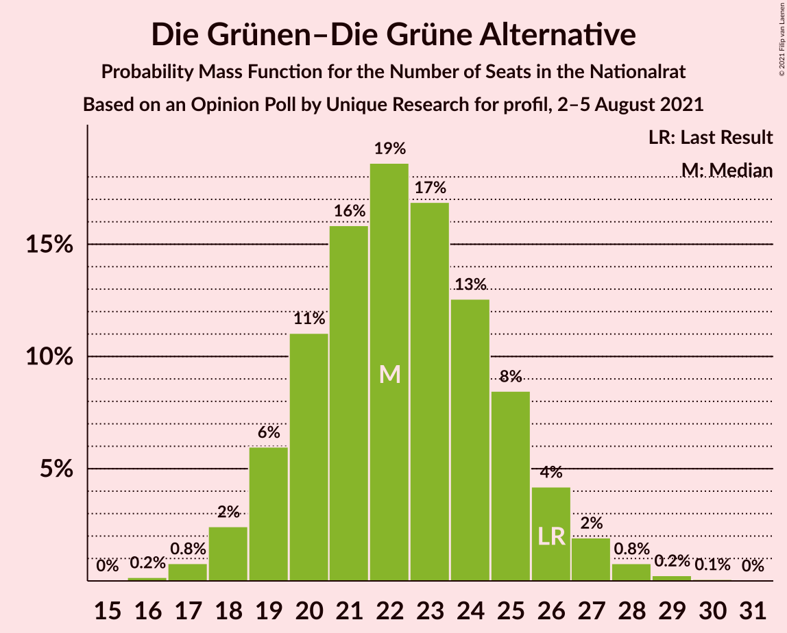
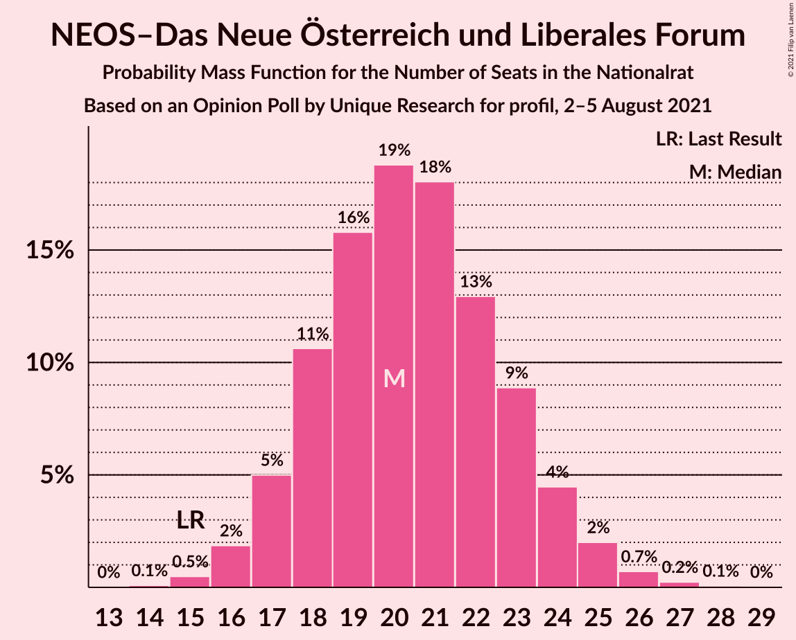
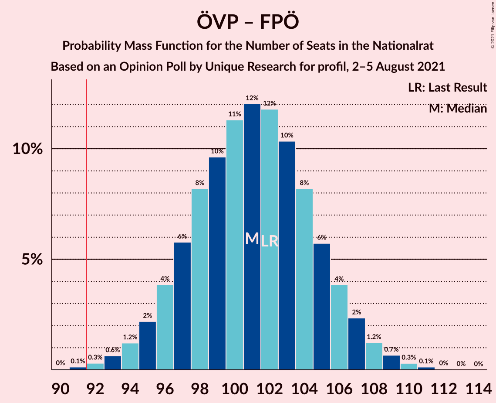
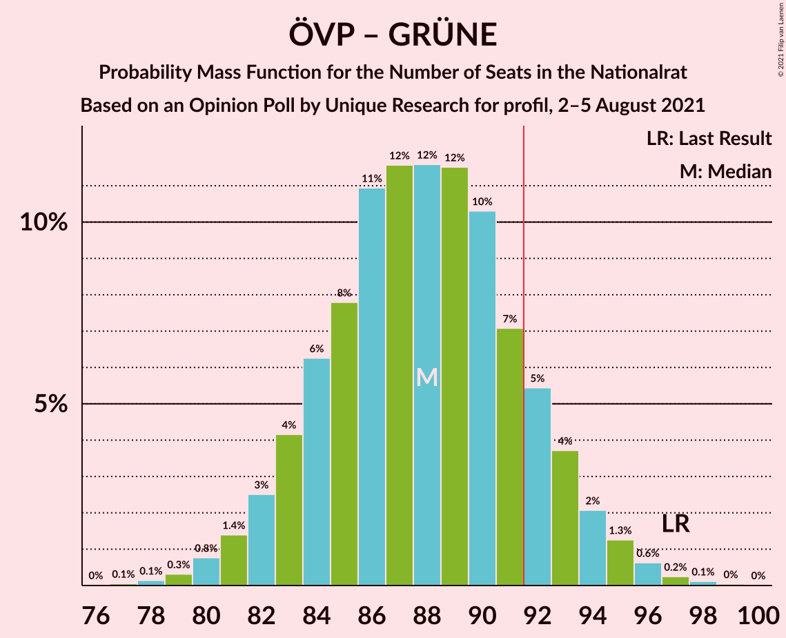
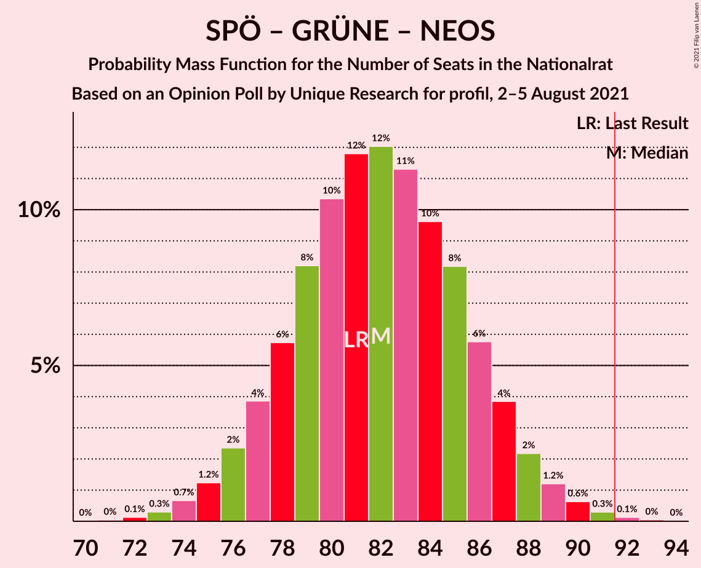
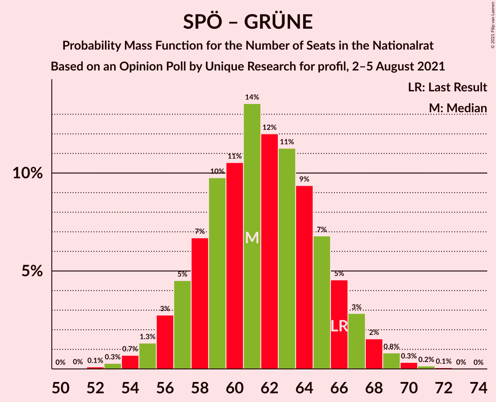

# Opinion Poll by Unique Research for profil, 2–5 August 2021

<a href="#voting-intentions">Voting Intentions</a> | <a href="#seats">Seats</a> | <a href="#coalitions">Coalitions</a> | <a href="#technical-information">Technical Information</a>

## Voting Intentions

### Confidence Intervals

| Party | Last Result | Poll Result | 80% Confidence Interval | 90% Confidence Interval | 95% Confidence Interval | 99% Confidence Interval |
|:-----:|:-----------:|:-----------:|:-----------------------:|:-----------------------:|:-----------------------:|:-----------------------:|
| Österreichische Volkspartei | 37.5% | 35.0% | 32.9–37.2% |32.3–37.8% |31.8–38.4% |30.8–39.4% |
| Sozialdemokratische Partei Österreichs | 21.2% | 21.0% | 19.2–22.9% |18.7–23.5% |18.3–24.0% |17.5–24.9% |
| Freiheitliche Partei Österreichs | 16.2% | 19.0% | 17.3–20.9% |16.8–21.4% |16.4–21.9% |15.7–22.8% |
| Die Grünen–Die Grüne Alternative | 13.9% | 12.0% | 10.6–13.6% |10.2–14.1% |9.9–14.4% |9.3–15.2% |
| NEOS–Das Neue Österreich und Liberales Forum | 8.1% | 11.0% | 9.7–12.5% |9.3–13.0% |9.0–13.4% |8.4–14.1% |

*Note:* The poll result column reflects the actual value used in the calculations. Published results may vary slightly, and in addition be rounded to fewer digits.

## Seats

### Confidence Intervals

| Party | Last Result | Median | 80% Confidence Interval | 90% Confidence Interval | 95% Confidence Interval | 99% Confidence Interval |
|:-----:|:-----------:|:------:|:-----------------------:|:-----------------------:|:-----------------------:|:-----------------------:|
| <a href="#österreichische-volkspartei">Österreichische Volkspartei</a> | 71 | 66 | 62–70 |60–71 |59–72 |58–74 |
| <a href="#sozialdemokratische-partei-österreichs">Sozialdemokratische Partei Österreichs</a> | 40 | 39 | 36–43 |35–44 |34–45 |33–46 |
| <a href="#freiheitliche-partei-österreichs">Freiheitliche Partei Österreichs</a> | 31 | 35 | 32–39 |31–40 |30–41 |29–42 |
| <a href="#die-grünen–die-grüne-alternative">Die Grünen–Die Grüne Alternative</a> | 26 | 22 | 20–25 |19–26 |18–27 |17–28 |
| <a href="#neos–das-neue-österreich-und-liberales-forum">NEOS–Das Neue Österreich und Liberales Forum</a> | 15 | 20 | 18–23 |17–24 |17–25 |15–26 |

### Österreichische Volkspartei

*For a full overview of the results for this party, see the [Österreichische Volkspartei](party-österreichischevolkspartei.html) page.*

| Number of Seats | Probability | Accumulated | Special Marks |
|:---------------:|:-----------:|:-----------:|:-------------:|
| 55 | 0% | 100% |  |
| 56 | 0.1% | 99.9% |  |
| 57 | 0.3% | 99.8% |  |
| 58 | 0.7% | 99.5% |  |
| 59 | 1.4% | 98.8% |  |
| 60 | 3% | 97% |  |
| 61 | 5% | 95% |  |
| 62 | 7% | 90% |  |
| 63 | 9% | 83% |  |
| 64 | 11% | 74% |  |
| 65 | 12% | 63% |  |
| 66 | 13% | 51% | Median |
| 67 | 11% | 37% |  |
| 68 | 9% | 27% |  |
| 69 | 7% | 18% |  |
| 70 | 5% | 11% |  |
| 71 | 3% | 6% | Last Result |
| 72 | 2% | 3% |  |
| 73 | 0.8% | 1.5% |  |
| 74 | 0.4% | 0.7% |  |
| 75 | 0.2% | 0.3% |  |
| 76 | 0.1% | 0.1% |  |
| 77 | 0% | 0% |  |

### Sozialdemokratische Partei Österreichs

*For a full overview of the results for this party, see the [Sozialdemokratische Partei Österreichs](party-sozialdemokratischeparteiösterreichs.html) page.*

| Number of Seats | Probability | Accumulated | Special Marks |
|:---------------:|:-----------:|:-----------:|:-------------:|
| 31 | 0.1% | 100% |  |
| 32 | 0.4% | 99.9% |  |
| 33 | 1.0% | 99.5% |  |
| 34 | 2% | 98.5% |  |
| 35 | 4% | 96% |  |
| 36 | 8% | 92% |  |
| 37 | 11% | 85% |  |
| 38 | 14% | 73% |  |
| 39 | 14% | 60% | Median |
| 40 | 13% | 45% | Last Result |
| 41 | 12% | 32% |  |
| 42 | 9% | 20% |  |
| 43 | 6% | 12% |  |
| 44 | 3% | 6% |  |
| 45 | 2% | 3% |  |
| 46 | 0.7% | 1.2% |  |
| 47 | 0.3% | 0.5% |  |
| 48 | 0.1% | 0.2% |  |
| 49 | 0% | 0.1% |  |
| 50 | 0% | 0% |  |

### Freiheitliche Partei Österreichs

*For a full overview of the results for this party, see the [Freiheitliche Partei Österreichs](party-freiheitlicheparteiösterreichs.html) page.*

| Number of Seats | Probability | Accumulated | Special Marks |
|:---------------:|:-----------:|:-----------:|:-------------:|
| 27 | 0.1% | 100% |  |
| 28 | 0.2% | 99.9% |  |
| 29 | 0.6% | 99.7% |  |
| 30 | 2% | 99.1% |  |
| 31 | 3% | 97% | Last Result |
| 32 | 7% | 94% |  |
| 33 | 10% | 87% |  |
| 34 | 13% | 78% |  |
| 35 | 16% | 64% | Median |
| 36 | 14% | 48% |  |
| 37 | 13% | 34% |  |
| 38 | 9% | 22% |  |
| 39 | 6% | 12% |  |
| 40 | 4% | 7% |  |
| 41 | 2% | 3% |  |
| 42 | 0.8% | 1.2% |  |
| 43 | 0.3% | 0.5% |  |
| 44 | 0.1% | 0.2% |  |
| 45 | 0% | 0.1% |  |
| 46 | 0% | 0% |  |

### Die Grünen–Die Grüne Alternative

*For a full overview of the results for this party, see the [Die Grünen–Die Grüne Alternative](party-diegrünen–diegrünealternative.html) page.*

| Number of Seats | Probability | Accumulated | Special Marks |
|:---------------:|:-----------:|:-----------:|:-------------:|
| 16 | 0.2% | 100% |  |
| 17 | 0.8% | 99.8% |  |
| 18 | 2% | 99.0% |  |
| 19 | 6% | 97% |  |
| 20 | 11% | 91% |  |
| 21 | 16% | 80% |  |
| 22 | 19% | 64% | Median |
| 23 | 17% | 45% |  |
| 24 | 13% | 28% |  |
| 25 | 8% | 16% |  |
| 26 | 4% | 7% | Last Result |
| 27 | 2% | 3% |  |
| 28 | 0.8% | 1.1% |  |
| 29 | 0.2% | 0.3% |  |
| 30 | 0.1% | 0.1% |  |
| 31 | 0% | 0% |  |

### NEOS–Das Neue Österreich und Liberales Forum

*For a full overview of the results for this party, see the [NEOS–Das Neue Österreich und Liberales Forum](party-neos–dasneueösterreichundliberalesforum.html) page.*

| Number of Seats | Probability | Accumulated | Special Marks |
|:---------------:|:-----------:|:-----------:|:-------------:|
| 14 | 0.1% | 100% |  |
| 15 | 0.5% | 99.9% | Last Result |
| 16 | 2% | 99.4% |  |
| 17 | 5% | 98% |  |
| 18 | 11% | 93% |  |
| 19 | 16% | 82% |  |
| 20 | 19% | 66% | Median |
| 21 | 18% | 47% |  |
| 22 | 13% | 29% |  |
| 23 | 9% | 16% |  |
| 24 | 4% | 8% |  |
| 25 | 2% | 3% |  |
| 26 | 0.7% | 1.0% |  |
| 27 | 0.2% | 0.3% |  |
| 28 | 0.1% | 0.1% |  |
| 29 | 0% | 0% |  |

## Coalitions

### Confidence Intervals

| Coalition | Last Result | Median | Majority? | 80% Confidence Interval | 90% Confidence Interval | 95% Confidence Interval | 99% Confidence Interval |
|:---------:|:-----------:|:------:|:---------:|:-----------------------:|:-----------------------:|:-----------------------:|:-----------------------:|
| Österreichische Volkspartei – Die Grünen–Die Grüne Alternative – NEOS–Das Neue Österreich und Liberales Forum | 112 | 108 | 100% | 104–112 | 103–114 | 102–115 | 100–117 |
| Österreichische Volkspartei – Sozialdemokratische Partei Österreichs | 111 | 105 | 100% | 101–109 | 99–110 | 98–111 | 96–113 |
| Österreichische Volkspartei – Freiheitliche Partei Österreichs | 102 | 101 | 99.8% | 97–105 | 96–106 | 95–107 | 92–109 |
| Österreichische Volkspartei – Die Grünen–Die Grüne Alternative | 97 | 88 | 14% | 84–92 | 82–93 | 81–94 | 79–96 |
| Österreichische Volkspartei – NEOS–Das Neue Österreich und Liberales Forum | 86 | 86 | 5% | 82–90 | 81–91 | 80–93 | 77–95 |
| Sozialdemokratische Partei Österreichs – Die Grünen–Die Grüne Alternative – NEOS–Das Neue Österreich und Liberales Forum | 81 | 82 | 0.2% | 78–86 | 77–87 | 76–88 | 74–91 |
| Sozialdemokratische Partei Österreichs – Freiheitliche Partei Österreichs | 71 | 75 | 0% | 71–79 | 69–80 | 68–81 | 66–83 |
| Österreichische Volkspartei | 71 | 66 | 0% | 62–70 | 60–71 | 59–72 | 58–74 |
| Sozialdemokratische Partei Österreichs – Die Grünen–Die Grüne Alternative | 66 | 61 | 0% | 58–66 | 56–67 | 56–68 | 54–70 |
| Sozialdemokratische Partei Österreichs | 40 | 39 | 0% | 36–43 | 35–44 | 34–45 | 33–46 |

### Österreichische Volkspartei – Die Grünen–Die Grüne Alternative – NEOS–Das Neue Österreich und Liberales Forum

| Number of Seats | Probability | Accumulated | Special Marks |
|:---------------:|:-----------:|:-----------:|:-------------:|
| 97 | 0% | 100% |  |
| 98 | 0.1% | 99.9% |  |
| 99 | 0.2% | 99.8% |  |
| 100 | 0.5% | 99.6% |  |
| 101 | 1.0% | 99.1% |  |
| 102 | 2% | 98% |  |
| 103 | 3% | 96% |  |
| 104 | 5% | 93% |  |
| 105 | 7% | 88% |  |
| 106 | 10% | 80% |  |
| 107 | 11% | 71% |  |
| 108 | 12% | 59% | Median |
| 109 | 12% | 47% |  |
| 110 | 11% | 36% |  |
| 111 | 8% | 25% |  |
| 112 | 7% | 16% | Last Result |
| 113 | 4% | 9% |  |
| 114 | 3% | 5% |  |
| 115 | 2% | 3% |  |
| 116 | 0.7% | 1.2% |  |
| 117 | 0.4% | 0.6% |  |
| 118 | 0.1% | 0.2% |  |
| 119 | 0.1% | 0.1% |  |
| 120 | 0% | 0% |  |

### Österreichische Volkspartei – Sozialdemokratische Partei Österreichs

| Number of Seats | Probability | Accumulated | Special Marks |
|:---------------:|:-----------:|:-----------:|:-------------:|
| 94 | 0.1% | 100% |  |
| 95 | 0.1% | 99.9% |  |
| 96 | 0.4% | 99.8% |  |
| 97 | 0.7% | 99.4% |  |
| 98 | 1.5% | 98.7% |  |
| 99 | 3% | 97% |  |
| 100 | 4% | 95% |  |
| 101 | 6% | 90% |  |
| 102 | 8% | 84% |  |
| 103 | 10% | 76% |  |
| 104 | 12% | 65% |  |
| 105 | 12% | 54% | Median |
| 106 | 11% | 42% |  |
| 107 | 10% | 30% |  |
| 108 | 8% | 20% |  |
| 109 | 5% | 13% |  |
| 110 | 3% | 7% |  |
| 111 | 2% | 4% | Last Result |
| 112 | 1.1% | 2% |  |
| 113 | 0.5% | 0.9% |  |
| 114 | 0.2% | 0.4% |  |
| 115 | 0.1% | 0.1% |  |
| 116 | 0% | 0% |  |

### Österreichische Volkspartei – Freiheitliche Partei Österreichs

| Number of Seats | Probability | Accumulated | Special Marks |
|:---------------:|:-----------:|:-----------:|:-------------:|
| 90 | 0% | 100% |  |
| 91 | 0.1% | 99.9% |  |
| 92 | 0.3% | 99.8% | Majority |
| 93 | 0.6% | 99.5% |  |
| 94 | 1.2% | 98.9% |  |
| 95 | 2% | 98% |  |
| 96 | 4% | 95% |  |
| 97 | 6% | 92% |  |
| 98 | 8% | 86% |  |
| 99 | 10% | 78% |  |
| 100 | 11% | 68% |  |
| 101 | 12% | 57% | Median |
| 102 | 12% | 45% | Last Result |
| 103 | 10% | 33% |  |
| 104 | 8% | 23% |  |
| 105 | 6% | 14% |  |
| 106 | 4% | 9% |  |
| 107 | 2% | 5% |  |
| 108 | 1.2% | 2% |  |
| 109 | 0.7% | 1.2% |  |
| 110 | 0.3% | 0.5% |  |
| 111 | 0.1% | 0.2% |  |
| 112 | 0% | 0.1% |  |
| 113 | 0% | 0% |  |

### Österreichische Volkspartei – Die Grünen–Die Grüne Alternative

| Number of Seats | Probability | Accumulated | Special Marks |
|:---------------:|:-----------:|:-----------:|:-------------:|
| 77 | 0.1% | 100% |  |
| 78 | 0.1% | 99.9% |  |
| 79 | 0.3% | 99.8% |  |
| 80 | 0.8% | 99.5% |  |
| 81 | 1.4% | 98.7% |  |
| 82 | 3% | 97% |  |
| 83 | 4% | 95% |  |
| 84 | 6% | 91% |  |
| 85 | 8% | 84% |  |
| 86 | 11% | 77% |  |
| 87 | 12% | 66% |  |
| 88 | 12% | 54% | Median |
| 89 | 12% | 42% |  |
| 90 | 10% | 31% |  |
| 91 | 7% | 21% |  |
| 92 | 5% | 14% | Majority |
| 93 | 4% | 8% |  |
| 94 | 2% | 4% |  |
| 95 | 1.3% | 2% |  |
| 96 | 0.6% | 1.1% |  |
| 97 | 0.2% | 0.4% | Last Result |
| 98 | 0.1% | 0.2% |  |
| 99 | 0% | 0.1% |  |
| 100 | 0% | 0% |  |

### Österreichische Volkspartei – NEOS–Das Neue Österreich und Liberales Forum

| Number of Seats | Probability | Accumulated | Special Marks |
|:---------------:|:-----------:|:-----------:|:-------------:|
| 75 | 0% | 100% |  |
| 76 | 0.1% | 99.9% |  |
| 77 | 0.3% | 99.8% |  |
| 78 | 0.6% | 99.5% |  |
| 79 | 1.2% | 98.9% |  |
| 80 | 3% | 98% |  |
| 81 | 4% | 95% |  |
| 82 | 6% | 91% |  |
| 83 | 9% | 86% |  |
| 84 | 10% | 77% |  |
| 85 | 11% | 67% |  |
| 86 | 13% | 56% | Last Result, Median |
| 87 | 11% | 43% |  |
| 88 | 10% | 32% |  |
| 89 | 8% | 22% |  |
| 90 | 6% | 15% |  |
| 91 | 3% | 8% |  |
| 92 | 2% | 5% | Majority |
| 93 | 1.4% | 3% |  |
| 94 | 0.6% | 1.1% |  |
| 95 | 0.3% | 0.5% |  |
| 96 | 0.1% | 0.2% |  |
| 97 | 0.1% | 0.1% |  |
| 98 | 0% | 0% |  |

### Sozialdemokratische Partei Österreichs – Die Grünen–Die Grüne Alternative – NEOS–Das Neue Österreich und Liberales Forum

| Number of Seats | Probability | Accumulated | Special Marks |
|:---------------:|:-----------:|:-----------:|:-------------:|
| 71 | 0% | 100% |  |
| 72 | 0.1% | 99.9% |  |
| 73 | 0.3% | 99.8% |  |
| 74 | 0.7% | 99.5% |  |
| 75 | 1.2% | 98.8% |  |
| 76 | 2% | 98% |  |
| 77 | 4% | 95% |  |
| 78 | 6% | 91% |  |
| 79 | 8% | 86% |  |
| 80 | 10% | 77% |  |
| 81 | 12% | 67% | Last Result, Median |
| 82 | 12% | 55% |  |
| 83 | 11% | 43% |  |
| 84 | 10% | 32% |  |
| 85 | 8% | 22% |  |
| 86 | 6% | 14% |  |
| 87 | 4% | 8% |  |
| 88 | 2% | 5% |  |
| 89 | 1.2% | 2% |  |
| 90 | 0.6% | 1.1% |  |
| 91 | 0.3% | 0.5% |  |
| 92 | 0.1% | 0.2% | Majority |
| 93 | 0% | 0.1% |  |
| 94 | 0% | 0% |  |

### Sozialdemokratische Partei Österreichs – Freiheitliche Partei Österreichs

| Number of Seats | Probability | Accumulated | Special Marks |
|:---------------:|:-----------:|:-----------:|:-------------:|
| 64 | 0.1% | 100% |  |
| 65 | 0.1% | 99.9% |  |
| 66 | 0.4% | 99.8% |  |
| 67 | 0.7% | 99.4% |  |
| 68 | 2% | 98.8% |  |
| 69 | 3% | 97% |  |
| 70 | 4% | 95% |  |
| 71 | 7% | 91% | Last Result |
| 72 | 8% | 84% |  |
| 73 | 11% | 75% |  |
| 74 | 12% | 64% | Median |
| 75 | 12% | 52% |  |
| 76 | 11% | 41% |  |
| 77 | 10% | 29% |  |
| 78 | 7% | 20% |  |
| 79 | 5% | 12% |  |
| 80 | 3% | 7% |  |
| 81 | 2% | 4% |  |
| 82 | 1.0% | 2% |  |
| 83 | 0.5% | 0.9% |  |
| 84 | 0.2% | 0.4% |  |
| 85 | 0.1% | 0.1% |  |
| 86 | 0% | 0.1% |  |
| 87 | 0% | 0% |  |

### Österreichische Volkspartei

| Number of Seats | Probability | Accumulated | Special Marks |
|:---------------:|:-----------:|:-----------:|:-------------:|
| 55 | 0% | 100% |  |
| 56 | 0.1% | 99.9% |  |
| 57 | 0.3% | 99.8% |  |
| 58 | 0.7% | 99.5% |  |
| 59 | 1.4% | 98.8% |  |
| 60 | 3% | 97% |  |
| 61 | 5% | 95% |  |
| 62 | 7% | 90% |  |
| 63 | 9% | 83% |  |
| 64 | 11% | 74% |  |
| 65 | 12% | 63% |  |
| 66 | 13% | 51% | Median |
| 67 | 11% | 37% |  |
| 68 | 9% | 27% |  |
| 69 | 7% | 18% |  |
| 70 | 5% | 11% |  |
| 71 | 3% | 6% | Last Result |
| 72 | 2% | 3% |  |
| 73 | 0.8% | 1.5% |  |
| 74 | 0.4% | 0.7% |  |
| 75 | 0.2% | 0.3% |  |
| 76 | 0.1% | 0.1% |  |
| 77 | 0% | 0% |  |

### Sozialdemokratische Partei Österreichs – Die Grünen–Die Grüne Alternative

| Number of Seats | Probability | Accumulated | Special Marks |
|:---------------:|:-----------:|:-----------:|:-------------:|
| 51 | 0% | 100% |  |
| 52 | 0.1% | 99.9% |  |
| 53 | 0.3% | 99.8% |  |
| 54 | 0.7% | 99.6% |  |
| 55 | 1.3% | 98.9% |  |
| 56 | 3% | 98% |  |
| 57 | 5% | 95% |  |
| 58 | 7% | 90% |  |
| 59 | 10% | 84% |  |
| 60 | 11% | 74% |  |
| 61 | 14% | 63% | Median |
| 62 | 12% | 50% |  |
| 63 | 11% | 38% |  |
| 64 | 9% | 26% |  |
| 65 | 7% | 17% |  |
| 66 | 5% | 10% | Last Result |
| 67 | 3% | 6% |  |
| 68 | 2% | 3% |  |
| 69 | 0.8% | 1.4% |  |
| 70 | 0.3% | 0.6% |  |
| 71 | 0.2% | 0.2% |  |
| 72 | 0.1% | 0.1% |  |
| 73 | 0% | 0% |  |

### Sozialdemokratische Partei Österreichs

| Number of Seats | Probability | Accumulated | Special Marks |
|:---------------:|:-----------:|:-----------:|:-------------:|
| 31 | 0.1% | 100% |  |
| 32 | 0.4% | 99.9% |  |
| 33 | 1.0% | 99.5% |  |
| 34 | 2% | 98.5% |  |
| 35 | 4% | 96% |  |
| 36 | 8% | 92% |  |
| 37 | 11% | 85% |  |
| 38 | 14% | 73% |  |
| 39 | 14% | 60% | Median |
| 40 | 13% | 45% | Last Result |
| 41 | 12% | 32% |  |
| 42 | 9% | 20% |  |
| 43 | 6% | 12% |  |
| 44 | 3% | 6% |  |
| 45 | 2% | 3% |  |
| 46 | 0.7% | 1.2% |  |
| 47 | 0.3% | 0.5% |  |
| 48 | 0.1% | 0.2% |  |
| 49 | 0% | 0.1% |  |
| 50 | 0% | 0% |  |

## Technical Information

### Opinion Poll

+ **Polling firm:** Unique Research
+ **Commissioner(s):** profil
+ **Fieldwork period:** 2–5 August 2021

### Calculations

+ **Sample size:** 800
+ **Simulations done:** 1,048,576
+ **Error estimate:** 0.37%

