# Opinion Poll by Research Affairs for ÖSTERREICH, 10–12 August 2021

<a href="#voting-intentions">Voting Intentions</a> | <a href="#seats">Seats</a> | <a href="#coalitions">Coalitions</a> | <a href="#technical-information">Technical Information</a>

## Voting Intentions

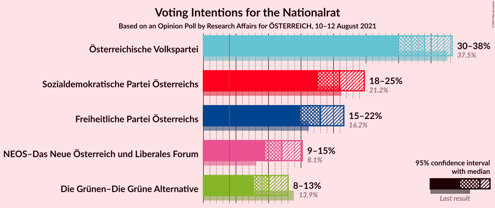

### Confidence Intervals

| Party | Last Result | Poll Result | 80% Confidence Interval | 90% Confidence Interval | 95% Confidence Interval | 99% Confidence Interval |
|:-----:|:-----------:|:-----------:|:-----------------------:|:-----------------------:|:-----------------------:|:-----------------------:|
| Österreichische Volkspartei | 37.5% | 34.0% | 31.4–36.8% |30.6–37.6% |30.0–38.2% |28.8–39.6% |
| Sozialdemokratische Partei Österreichs | 21.2% | 20.9% | 18.8–23.4% |18.2–24.1% |17.6–24.7% |16.6–25.9% |
| Freiheitliche Partei Österreichs | 16.2% | 18.0% | 15.9–20.3% |15.4–21.0% |14.9–21.6% |13.9–22.7% |
| NEOS–Das Neue Österreich und Liberales Forum | 8.1% | 12.1% | 10.4–14.1% |9.9–14.7% |9.5–15.2% |8.7–16.2% |
| Die Grünen–Die Grüne Alternative | 13.9% | 10.1% | 8.5–12.0% |8.1–12.5% |7.7–13.0% |7.1–14.0% |

*Note:* The poll result column reflects the actual value used in the calculations. Published results may vary slightly, and in addition be rounded to fewer digits.

## Seats

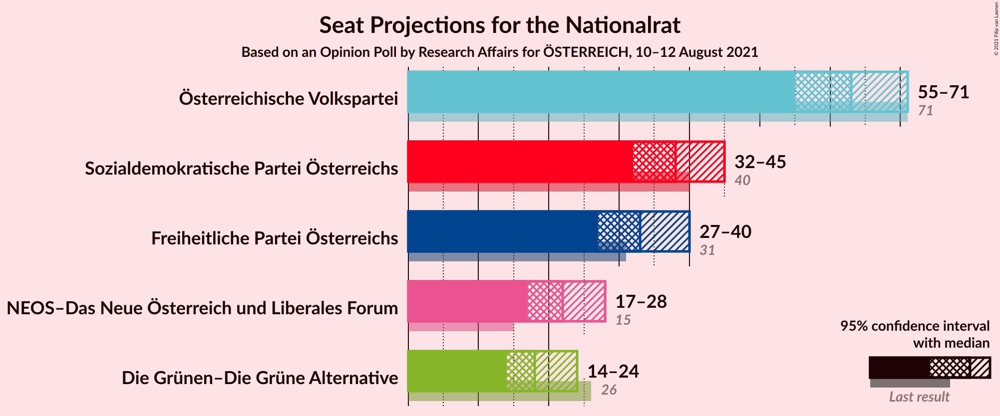

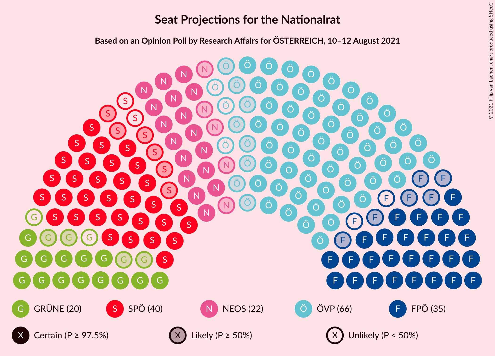

### Confidence Intervals

| Party | Last Result | Median | 80% Confidence Interval | 90% Confidence Interval | 95% Confidence Interval | 99% Confidence Interval |
|:-----:|:-----------:|:------:|:-----------------------:|:-----------------------:|:-----------------------:|:-----------------------:|
| <a href="#österreichische-volkspartei">Österreichische Volkspartei</a> | 71 | 63 | 57–68 |56–69 |55–71 |53–73 |
| <a href="#sozialdemokratische-partei-österreichs">Sozialdemokratische Partei Österreichs</a> | 40 | 38 | 34–43 |33–44 |32–45 |30–48 |
| <a href="#freiheitliche-partei-österreichs">Freiheitliche Partei Österreichs</a> | 31 | 33 | 29–37 |28–39 |27–40 |25–42 |
| <a href="#neos–das-neue-österreich-und-liberales-forum">NEOS–Das Neue Österreich und Liberales Forum</a> | 15 | 22 | 19–26 |18–27 |17–28 |16–30 |
| <a href="#die-grünen–die-grüne-alternative">Die Grünen–Die Grüne Alternative</a> | 26 | 18 | 15–22 |15–23 |14–24 |13–26 |

### Österreichische Volkspartei

*For a full overview of the results for this party, see the [Österreichische Volkspartei](party-österreichischevolkspartei.html) page.*

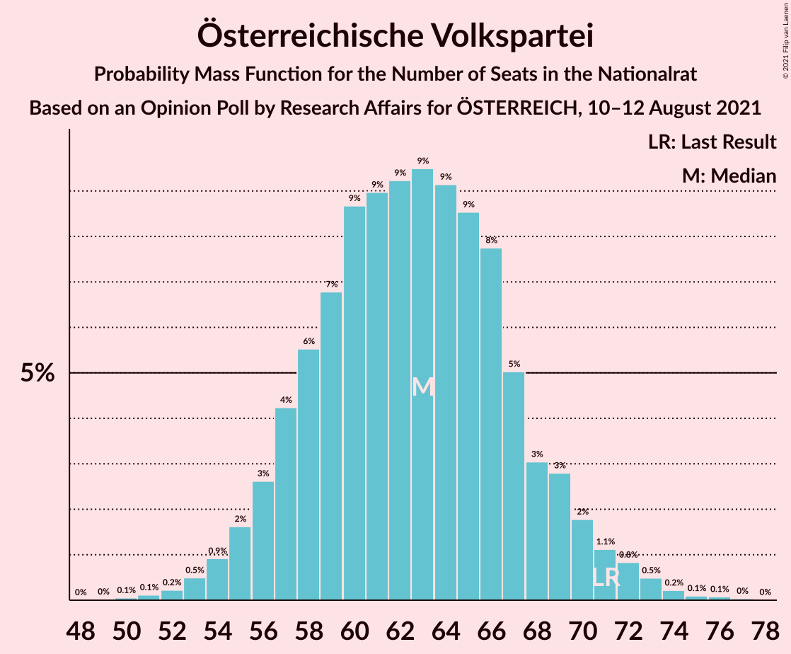

| Number of Seats | Probability | Accumulated | Special Marks |
|:---------------:|:-----------:|:-----------:|:-------------:|
| 50 | 0.1% | 100% |  |
| 51 | 0.1% | 99.9% |  |
| 52 | 0.2% | 99.8% |  |
| 53 | 0.5% | 99.6% |  |
| 54 | 0.9% | 99.1% |  |
| 55 | 2% | 98% |  |
| 56 | 3% | 97% |  |
| 57 | 4% | 94% |  |
| 58 | 6% | 90% |  |
| 59 | 7% | 84% |  |
| 60 | 9% | 77% |  |
| 61 | 9% | 69% |  |
| 62 | 9% | 60% |  |
| 63 | 9% | 50% | Median |
| 64 | 9% | 41% |  |
| 65 | 9% | 32% |  |
| 66 | 8% | 23% |  |
| 67 | 5% | 16% |  |
| 68 | 3% | 11% |  |
| 69 | 3% | 7% |  |
| 70 | 2% | 5% |  |
| 71 | 1.1% | 3% | Last Result |
| 72 | 0.8% | 2% |  |
| 73 | 0.5% | 0.9% |  |
| 74 | 0.2% | 0.5% |  |
| 75 | 0.1% | 0.2% |  |
| 76 | 0.1% | 0.1% |  |
| 77 | 0% | 0.1% |  |
| 78 | 0% | 0% |  |

### Sozialdemokratische Partei Österreichs

*For a full overview of the results for this party, see the [Sozialdemokratische Partei Österreichs](party-sozialdemokratischeparteiösterreichs.html) page.*

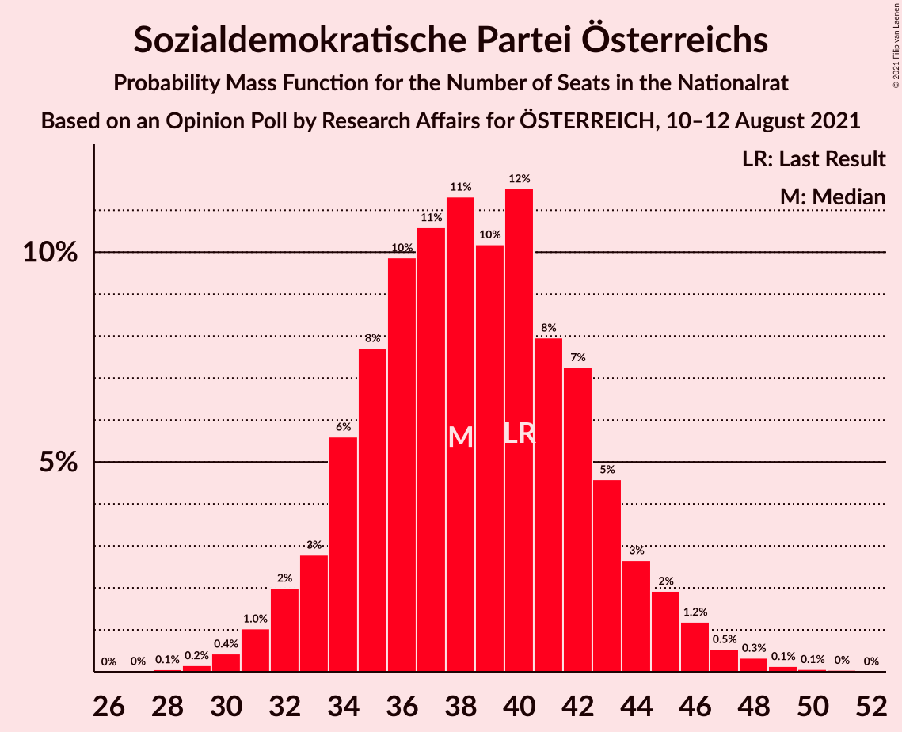

| Number of Seats | Probability | Accumulated | Special Marks |
|:---------------:|:-----------:|:-----------:|:-------------:|
| 28 | 0.1% | 100% |  |
| 29 | 0.2% | 99.9% |  |
| 30 | 0.4% | 99.8% |  |
| 31 | 1.0% | 99.3% |  |
| 32 | 2% | 98% |  |
| 33 | 3% | 96% |  |
| 34 | 6% | 94% |  |
| 35 | 8% | 88% |  |
| 36 | 10% | 80% |  |
| 37 | 11% | 70% |  |
| 38 | 11% | 60% | Median |
| 39 | 10% | 48% |  |
| 40 | 12% | 38% | Last Result |
| 41 | 8% | 27% |  |
| 42 | 7% | 19% |  |
| 43 | 5% | 11% |  |
| 44 | 3% | 7% |  |
| 45 | 2% | 4% |  |
| 46 | 1.2% | 2% |  |
| 47 | 0.5% | 1.1% |  |
| 48 | 0.3% | 0.6% |  |
| 49 | 0.1% | 0.3% |  |
| 50 | 0.1% | 0.1% |  |
| 51 | 0% | 0.1% |  |
| 52 | 0% | 0% |  |

### Freiheitliche Partei Österreichs

*For a full overview of the results for this party, see the [Freiheitliche Partei Österreichs](party-freiheitlicheparteiösterreichs.html) page.*

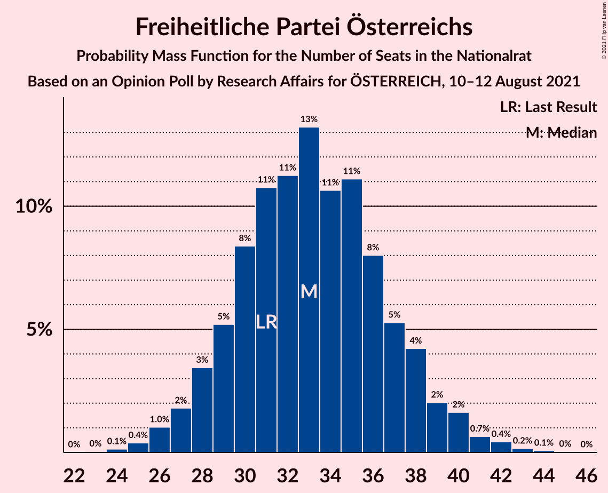

| Number of Seats | Probability | Accumulated | Special Marks |
|:---------------:|:-----------:|:-----------:|:-------------:|
| 23 | 0% | 100% |  |
| 24 | 0.1% | 99.9% |  |
| 25 | 0.4% | 99.8% |  |
| 26 | 1.0% | 99.4% |  |
| 27 | 2% | 98% |  |
| 28 | 3% | 97% |  |
| 29 | 5% | 93% |  |
| 30 | 8% | 88% |  |
| 31 | 11% | 80% | Last Result |
| 32 | 11% | 69% |  |
| 33 | 13% | 58% | Median |
| 34 | 11% | 44% |  |
| 35 | 11% | 34% |  |
| 36 | 8% | 23% |  |
| 37 | 5% | 15% |  |
| 38 | 4% | 9% |  |
| 39 | 2% | 5% |  |
| 40 | 2% | 3% |  |
| 41 | 0.7% | 1.4% |  |
| 42 | 0.4% | 0.7% |  |
| 43 | 0.2% | 0.3% |  |
| 44 | 0.1% | 0.1% |  |
| 45 | 0% | 0.1% |  |
| 46 | 0% | 0% |  |

### NEOS–Das Neue Österreich und Liberales Forum

*For a full overview of the results for this party, see the [NEOS–Das Neue Österreich und Liberales Forum](party-neos–dasneueösterreichundliberalesforum.html) page.*

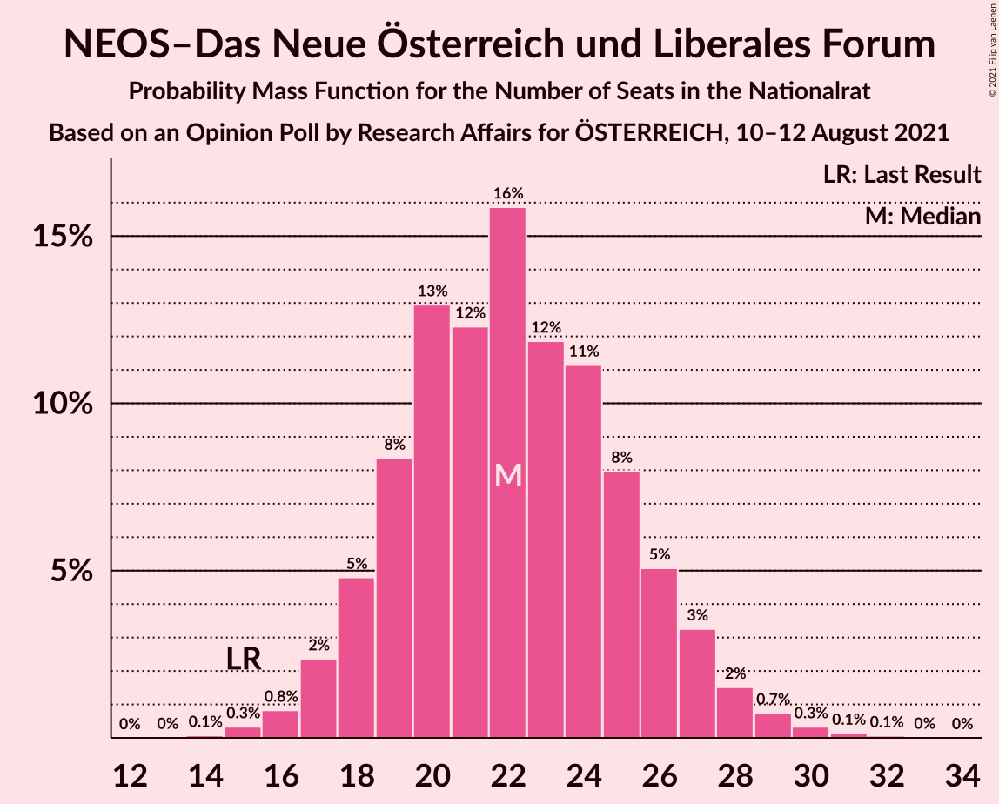

| Number of Seats | Probability | Accumulated | Special Marks |
|:---------------:|:-----------:|:-----------:|:-------------:|
| 14 | 0.1% | 100% |  |
| 15 | 0.3% | 99.9% | Last Result |
| 16 | 0.8% | 99.6% |  |
| 17 | 2% | 98.8% |  |
| 18 | 5% | 96% |  |
| 19 | 8% | 92% |  |
| 20 | 13% | 83% |  |
| 21 | 12% | 70% |  |
| 22 | 16% | 58% | Median |
| 23 | 12% | 42% |  |
| 24 | 11% | 30% |  |
| 25 | 8% | 19% |  |
| 26 | 5% | 11% |  |
| 27 | 3% | 6% |  |
| 28 | 2% | 3% |  |
| 29 | 0.7% | 1.3% |  |
| 30 | 0.3% | 0.6% |  |
| 31 | 0.1% | 0.2% |  |
| 32 | 0.1% | 0.1% |  |
| 33 | 0% | 0% |  |

### Die Grünen–Die Grüne Alternative

*For a full overview of the results for this party, see the [Die Grünen–Die Grüne Alternative](party-diegrünen–diegrünealternative.html) page.*

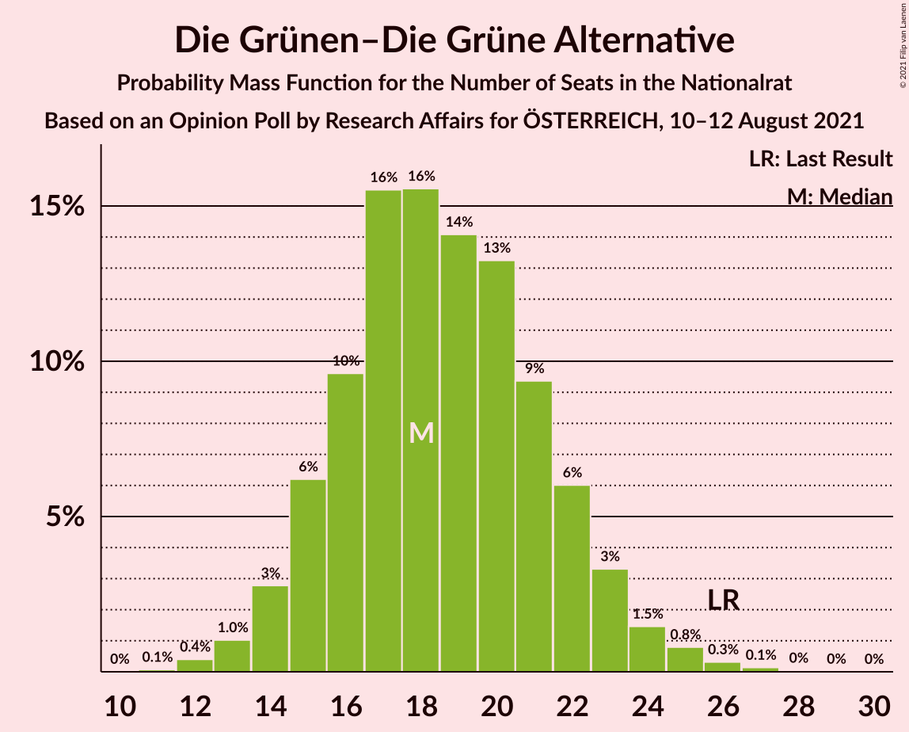

| Number of Seats | Probability | Accumulated | Special Marks |
|:---------------:|:-----------:|:-----------:|:-------------:|
| 11 | 0.1% | 100% |  |
| 12 | 0.4% | 99.9% |  |
| 13 | 1.0% | 99.5% |  |
| 14 | 3% | 98% |  |
| 15 | 6% | 96% |  |
| 16 | 10% | 90% |  |
| 17 | 16% | 80% |  |
| 18 | 16% | 64% | Median |
| 19 | 14% | 49% |  |
| 20 | 13% | 35% |  |
| 21 | 9% | 21% |  |
| 22 | 6% | 12% |  |
| 23 | 3% | 6% |  |
| 24 | 1.5% | 3% |  |
| 25 | 0.8% | 1.3% |  |
| 26 | 0.3% | 0.5% | Last Result |
| 27 | 0.1% | 0.2% |  |
| 28 | 0% | 0.1% |  |
| 29 | 0% | 0% |  |

## Coalitions

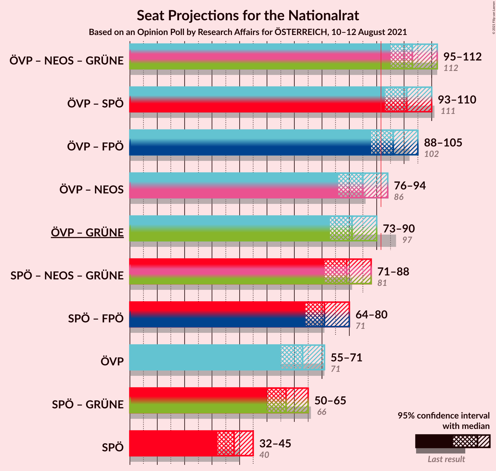

### Confidence Intervals

| Coalition | Last Result | Median | Majority? | 80% Confidence Interval | 90% Confidence Interval | 95% Confidence Interval | 99% Confidence Interval |
|:---------:|:-----------:|:------:|:---------:|:-----------------------:|:-----------------------:|:-----------------------:|:-----------------------:|
| Österreichische Volkspartei – NEOS–Das Neue Österreich und Liberales Forum – Die Grünen–Die Grüne Alternative | 112 | 103 | 99.7% | 98–109 | 96–111 | 95–112 | 92–115 |
| Österreichische Volkspartei – Sozialdemokratische Partei Österreichs | 111 | 101 | 98.7% | 95–107 | 94–109 | 93–110 | 90–113 |
| Österreichische Volkspartei – Freiheitliche Partei Österreichs | 102 | 96 | 84% | 90–101 | 89–103 | 88–105 | 85–108 |
| Österreichische Volkspartei – NEOS–Das Neue Österreich und Liberales Forum | 86 | 85 | 6% | 79–90 | 78–92 | 76–94 | 74–97 |
| Österreichische Volkspartei – Die Grünen–Die Grüne Alternative | 97 | 81 | 1.2% | 76–87 | 74–88 | 73–90 | 70–93 |
| Sozialdemokratische Partei Österreichs – NEOS–Das Neue Österreich und Liberales Forum – Die Grünen–Die Grüne Alternative | 81 | 79 | 0.3% | 74–85 | 72–86 | 71–88 | 69–90 |
| Sozialdemokratische Partei Österreichs – Freiheitliche Partei Österreichs | 71 | 71 | 0% | 66–77 | 65–79 | 64–80 | 61–83 |
| Österreichische Volkspartei | 71 | 63 | 0% | 57–68 | 56–69 | 55–71 | 53–73 |
| Sozialdemokratische Partei Österreichs – Die Grünen–Die Grüne Alternative | 66 | 57 | 0% | 52–62 | 51–64 | 50–65 | 47–67 |
| Sozialdemokratische Partei Österreichs | 40 | 38 | 0% | 34–43 | 33–44 | 32–45 | 30–48 |

### Österreichische Volkspartei – NEOS–Das Neue Österreich und Liberales Forum – Die Grünen–Die Grüne Alternative

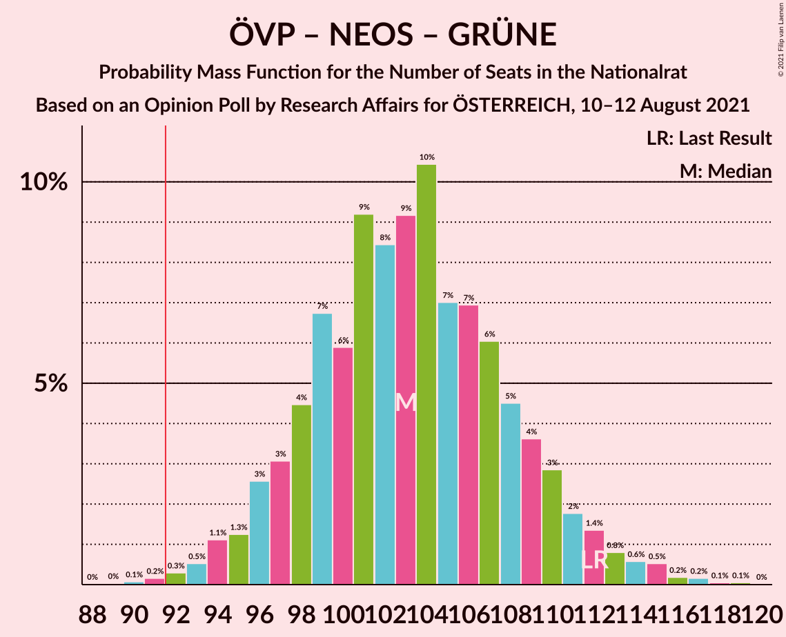

| Number of Seats | Probability | Accumulated | Special Marks |
|:---------------:|:-----------:|:-----------:|:-------------:|
| 89 | 0% | 100% |  |
| 90 | 0.1% | 99.9% |  |
| 91 | 0.2% | 99.9% |  |
| 92 | 0.3% | 99.7% | Majority |
| 93 | 0.5% | 99.4% |  |
| 94 | 1.1% | 98.9% |  |
| 95 | 1.3% | 98% |  |
| 96 | 3% | 97% |  |
| 97 | 3% | 94% |  |
| 98 | 4% | 91% |  |
| 99 | 7% | 86% |  |
| 100 | 6% | 80% |  |
| 101 | 9% | 74% |  |
| 102 | 8% | 65% |  |
| 103 | 9% | 56% | Median |
| 104 | 10% | 47% |  |
| 105 | 7% | 37% |  |
| 106 | 7% | 29% |  |
| 107 | 6% | 23% |  |
| 108 | 5% | 16% |  |
| 109 | 4% | 12% |  |
| 110 | 3% | 8% |  |
| 111 | 2% | 6% |  |
| 112 | 1.4% | 4% | Last Result |
| 113 | 0.8% | 2% |  |
| 114 | 0.6% | 2% |  |
| 115 | 0.5% | 1.0% |  |
| 116 | 0.2% | 0.5% |  |
| 117 | 0.2% | 0.3% |  |
| 118 | 0.1% | 0.1% |  |
| 119 | 0.1% | 0.1% |  |
| 120 | 0% | 0% |  |

### Österreichische Volkspartei – Sozialdemokratische Partei Österreichs

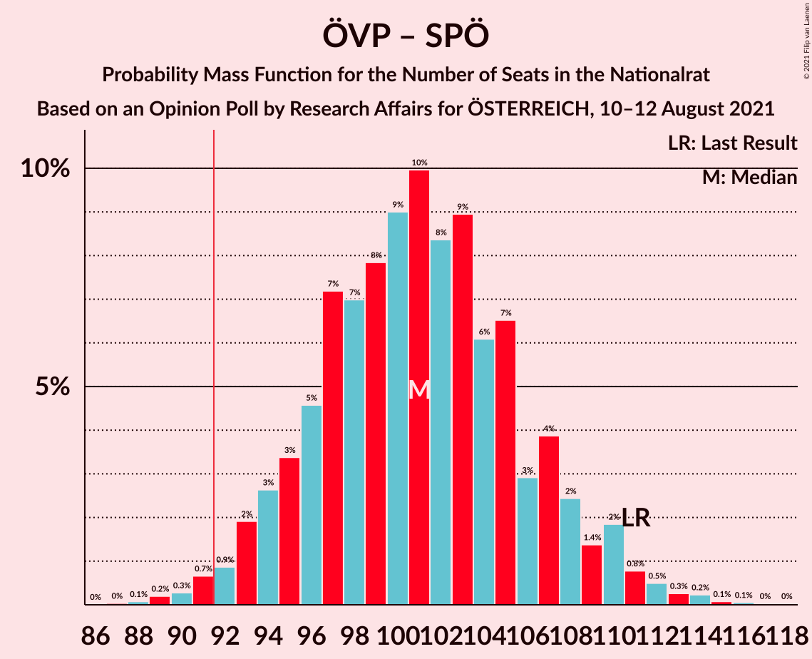

| Number of Seats | Probability | Accumulated | Special Marks |
|:---------------:|:-----------:|:-----------:|:-------------:|
| 87 | 0% | 100% |  |
| 88 | 0.1% | 99.9% |  |
| 89 | 0.2% | 99.9% |  |
| 90 | 0.3% | 99.7% |  |
| 91 | 0.7% | 99.4% |  |
| 92 | 0.9% | 98.7% | Majority |
| 93 | 2% | 98% |  |
| 94 | 3% | 96% |  |
| 95 | 3% | 93% |  |
| 96 | 5% | 90% |  |
| 97 | 7% | 85% |  |
| 98 | 7% | 78% |  |
| 99 | 8% | 71% |  |
| 100 | 9% | 63% |  |
| 101 | 10% | 54% | Median |
| 102 | 8% | 44% |  |
| 103 | 9% | 36% |  |
| 104 | 6% | 27% |  |
| 105 | 7% | 21% |  |
| 106 | 3% | 14% |  |
| 107 | 4% | 12% |  |
| 108 | 2% | 8% |  |
| 109 | 1.4% | 5% |  |
| 110 | 2% | 4% |  |
| 111 | 0.8% | 2% | Last Result |
| 112 | 0.5% | 1.2% |  |
| 113 | 0.3% | 0.7% |  |
| 114 | 0.2% | 0.4% |  |
| 115 | 0.1% | 0.2% |  |
| 116 | 0.1% | 0.1% |  |
| 117 | 0% | 0.1% |  |
| 118 | 0% | 0% |  |

### Österreichische Volkspartei – Freiheitliche Partei Österreichs

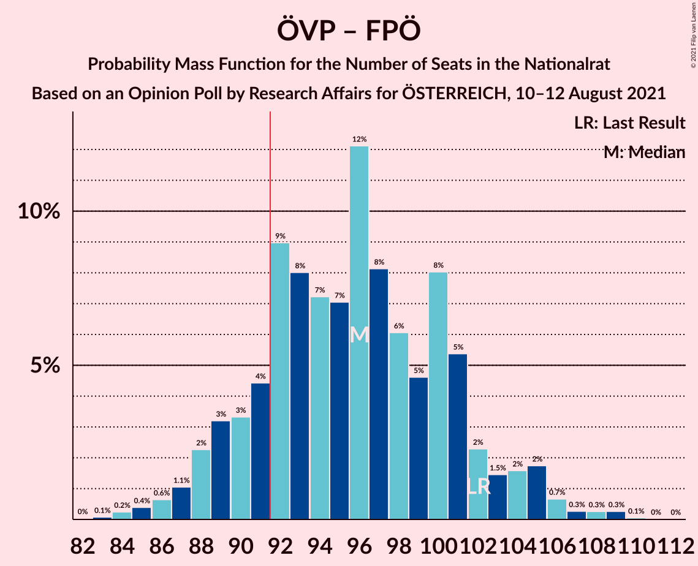

| Number of Seats | Probability | Accumulated | Special Marks |
|:---------------:|:-----------:|:-----------:|:-------------:|
| 82 | 0% | 100% |  |
| 83 | 0.1% | 99.9% |  |
| 84 | 0.2% | 99.8% |  |
| 85 | 0.4% | 99.6% |  |
| 86 | 0.6% | 99.2% |  |
| 87 | 1.1% | 98.6% |  |
| 88 | 2% | 98% |  |
| 89 | 3% | 95% |  |
| 90 | 3% | 92% |  |
| 91 | 4% | 89% |  |
| 92 | 9% | 84% | Majority |
| 93 | 8% | 75% |  |
| 94 | 7% | 67% |  |
| 95 | 7% | 60% |  |
| 96 | 12% | 53% | Median |
| 97 | 8% | 41% |  |
| 98 | 6% | 33% |  |
| 99 | 5% | 27% |  |
| 100 | 8% | 22% |  |
| 101 | 5% | 14% |  |
| 102 | 2% | 9% | Last Result |
| 103 | 1.5% | 6% |  |
| 104 | 2% | 5% |  |
| 105 | 2% | 3% |  |
| 106 | 0.7% | 2% |  |
| 107 | 0.3% | 0.9% |  |
| 108 | 0.3% | 0.6% |  |
| 109 | 0.3% | 0.4% |  |
| 110 | 0.1% | 0.1% |  |
| 111 | 0% | 0.1% |  |
| 112 | 0% | 0% |  |

### Österreichische Volkspartei – NEOS–Das Neue Österreich und Liberales Forum

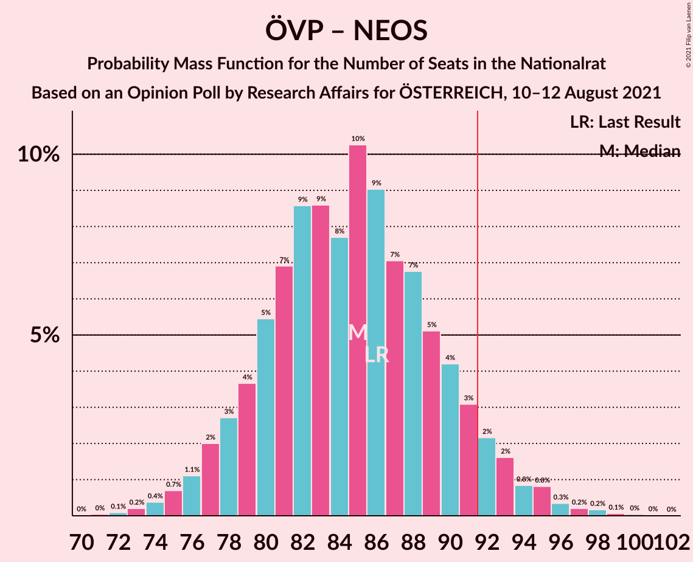

| Number of Seats | Probability | Accumulated | Special Marks |
|:---------------:|:-----------:|:-----------:|:-------------:|
| 71 | 0% | 100% |  |
| 72 | 0.1% | 99.9% |  |
| 73 | 0.2% | 99.8% |  |
| 74 | 0.4% | 99.6% |  |
| 75 | 0.7% | 99.3% |  |
| 76 | 1.1% | 98.6% |  |
| 77 | 2% | 97% |  |
| 78 | 3% | 95% |  |
| 79 | 4% | 93% |  |
| 80 | 5% | 89% |  |
| 81 | 7% | 84% |  |
| 82 | 9% | 77% |  |
| 83 | 9% | 68% |  |
| 84 | 8% | 60% |  |
| 85 | 10% | 52% | Median |
| 86 | 9% | 42% | Last Result |
| 87 | 7% | 33% |  |
| 88 | 7% | 25% |  |
| 89 | 5% | 19% |  |
| 90 | 4% | 14% |  |
| 91 | 3% | 9% |  |
| 92 | 2% | 6% | Majority |
| 93 | 2% | 4% |  |
| 94 | 0.8% | 3% |  |
| 95 | 0.8% | 2% |  |
| 96 | 0.3% | 0.9% |  |
| 97 | 0.2% | 0.5% |  |
| 98 | 0.2% | 0.3% |  |
| 99 | 0.1% | 0.1% |  |
| 100 | 0% | 0.1% |  |
| 101 | 0% | 0% |  |

### Österreichische Volkspartei – Die Grünen–Die Grüne Alternative

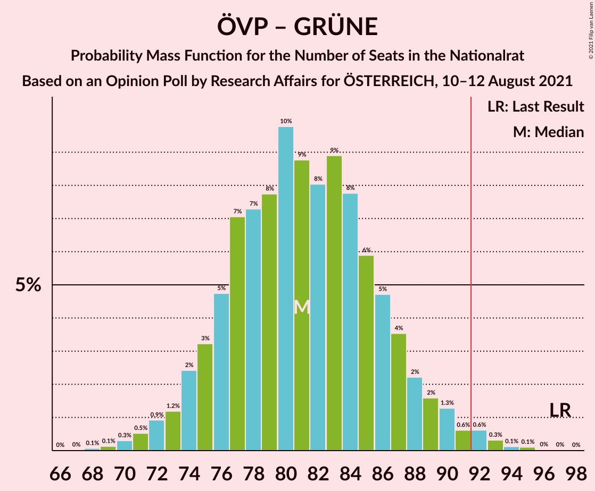

| Number of Seats | Probability | Accumulated | Special Marks |
|:---------------:|:-----------:|:-----------:|:-------------:|
| 68 | 0.1% | 100% |  |
| 69 | 0.1% | 99.9% |  |
| 70 | 0.3% | 99.8% |  |
| 71 | 0.5% | 99.5% |  |
| 72 | 0.9% | 98.9% |  |
| 73 | 1.2% | 98% |  |
| 74 | 2% | 97% |  |
| 75 | 3% | 94% |  |
| 76 | 5% | 91% |  |
| 77 | 7% | 86% |  |
| 78 | 7% | 79% |  |
| 79 | 8% | 72% |  |
| 80 | 10% | 64% |  |
| 81 | 9% | 55% | Median |
| 82 | 8% | 46% |  |
| 83 | 9% | 38% |  |
| 84 | 8% | 29% |  |
| 85 | 6% | 21% |  |
| 86 | 5% | 15% |  |
| 87 | 4% | 10% |  |
| 88 | 2% | 7% |  |
| 89 | 2% | 5% |  |
| 90 | 1.3% | 3% |  |
| 91 | 0.6% | 2% |  |
| 92 | 0.6% | 1.2% | Majority |
| 93 | 0.3% | 0.6% |  |
| 94 | 0.1% | 0.3% |  |
| 95 | 0.1% | 0.2% |  |
| 96 | 0% | 0.1% |  |
| 97 | 0% | 0% | Last Result |

### Sozialdemokratische Partei Österreichs – NEOS–Das Neue Österreich und Liberales Forum – Die Grünen–Die Grüne Alternative

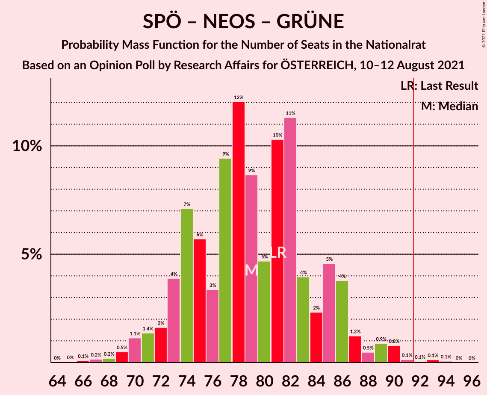

| Number of Seats | Probability | Accumulated | Special Marks |
|:---------------:|:-----------:|:-----------:|:-------------:|
| 65 | 0% | 100% |  |
| 66 | 0.1% | 99.9% |  |
| 67 | 0.2% | 99.9% |  |
| 68 | 0.2% | 99.7% |  |
| 69 | 0.5% | 99.5% |  |
| 70 | 1.1% | 99.0% |  |
| 71 | 1.4% | 98% |  |
| 72 | 2% | 97% |  |
| 73 | 4% | 95% |  |
| 74 | 7% | 91% |  |
| 75 | 6% | 84% |  |
| 76 | 3% | 78% |  |
| 77 | 9% | 75% |  |
| 78 | 12% | 65% | Median |
| 79 | 9% | 53% |  |
| 80 | 5% | 45% |  |
| 81 | 10% | 40% | Last Result |
| 82 | 11% | 30% |  |
| 83 | 4% | 18% |  |
| 84 | 2% | 14% |  |
| 85 | 5% | 12% |  |
| 86 | 4% | 8% |  |
| 87 | 1.2% | 4% |  |
| 88 | 0.5% | 3% |  |
| 89 | 0.9% | 2% |  |
| 90 | 0.8% | 1.2% |  |
| 91 | 0.1% | 0.4% |  |
| 92 | 0.1% | 0.3% | Majority |
| 93 | 0.1% | 0.2% |  |
| 94 | 0.1% | 0.1% |  |
| 95 | 0% | 0% |  |

### Sozialdemokratische Partei Österreichs – Freiheitliche Partei Österreichs

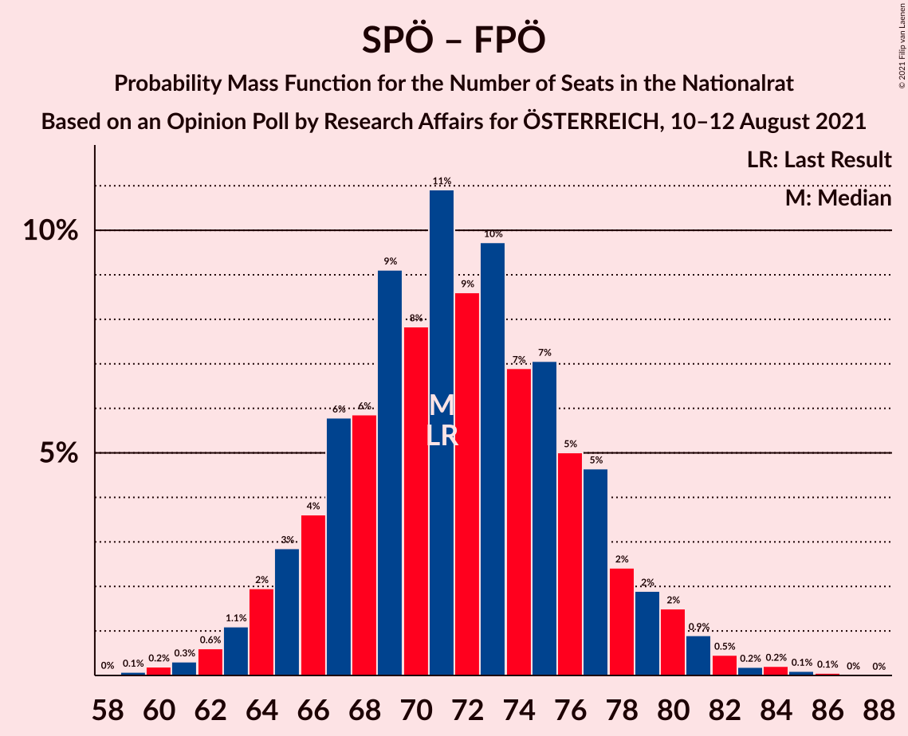

| Number of Seats | Probability | Accumulated | Special Marks |
|:---------------:|:-----------:|:-----------:|:-------------:|
| 58 | 0% | 100% |  |
| 59 | 0.1% | 99.9% |  |
| 60 | 0.2% | 99.9% |  |
| 61 | 0.3% | 99.7% |  |
| 62 | 0.6% | 99.4% |  |
| 63 | 1.1% | 98.8% |  |
| 64 | 2% | 98% |  |
| 65 | 3% | 96% |  |
| 66 | 4% | 93% |  |
| 67 | 6% | 89% |  |
| 68 | 6% | 83% |  |
| 69 | 9% | 78% |  |
| 70 | 8% | 68% |  |
| 71 | 11% | 61% | Last Result, Median |
| 72 | 9% | 50% |  |
| 73 | 10% | 41% |  |
| 74 | 7% | 31% |  |
| 75 | 7% | 24% |  |
| 76 | 5% | 17% |  |
| 77 | 5% | 12% |  |
| 78 | 2% | 8% |  |
| 79 | 2% | 5% |  |
| 80 | 2% | 3% |  |
| 81 | 0.9% | 2% |  |
| 82 | 0.5% | 1.1% |  |
| 83 | 0.2% | 0.6% |  |
| 84 | 0.2% | 0.4% |  |
| 85 | 0.1% | 0.2% |  |
| 86 | 0.1% | 0.1% |  |
| 87 | 0% | 0% |  |

### Österreichische Volkspartei

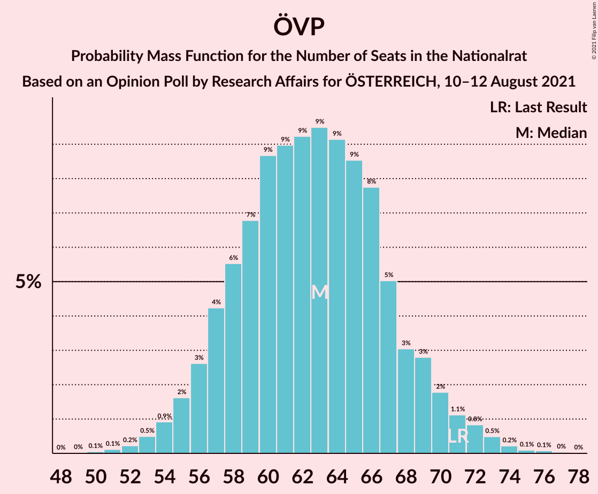

| Number of Seats | Probability | Accumulated | Special Marks |
|:---------------:|:-----------:|:-----------:|:-------------:|
| 50 | 0.1% | 100% |  |
| 51 | 0.1% | 99.9% |  |
| 52 | 0.2% | 99.8% |  |
| 53 | 0.5% | 99.6% |  |
| 54 | 0.9% | 99.1% |  |
| 55 | 2% | 98% |  |
| 56 | 3% | 97% |  |
| 57 | 4% | 94% |  |
| 58 | 6% | 90% |  |
| 59 | 7% | 84% |  |
| 60 | 9% | 77% |  |
| 61 | 9% | 69% |  |
| 62 | 9% | 60% |  |
| 63 | 9% | 50% | Median |
| 64 | 9% | 41% |  |
| 65 | 9% | 32% |  |
| 66 | 8% | 23% |  |
| 67 | 5% | 16% |  |
| 68 | 3% | 11% |  |
| 69 | 3% | 7% |  |
| 70 | 2% | 5% |  |
| 71 | 1.1% | 3% | Last Result |
| 72 | 0.8% | 2% |  |
| 73 | 0.5% | 0.9% |  |
| 74 | 0.2% | 0.5% |  |
| 75 | 0.1% | 0.2% |  |
| 76 | 0.1% | 0.1% |  |
| 77 | 0% | 0.1% |  |
| 78 | 0% | 0% |  |

### Sozialdemokratische Partei Österreichs – Die Grünen–Die Grüne Alternative

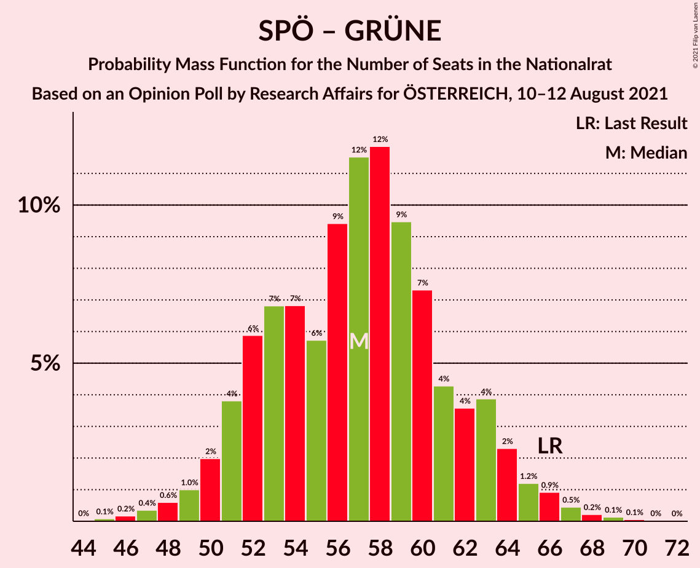

| Number of Seats | Probability | Accumulated | Special Marks |
|:---------------:|:-----------:|:-----------:|:-------------:|
| 45 | 0.1% | 100% |  |
| 46 | 0.2% | 99.9% |  |
| 47 | 0.4% | 99.7% |  |
| 48 | 0.6% | 99.4% |  |
| 49 | 1.0% | 98.7% |  |
| 50 | 2% | 98% |  |
| 51 | 4% | 96% |  |
| 52 | 6% | 92% |  |
| 53 | 7% | 86% |  |
| 54 | 7% | 79% |  |
| 55 | 6% | 72% |  |
| 56 | 9% | 67% | Median |
| 57 | 12% | 57% |  |
| 58 | 12% | 46% |  |
| 59 | 9% | 34% |  |
| 60 | 7% | 24% |  |
| 61 | 4% | 17% |  |
| 62 | 4% | 13% |  |
| 63 | 4% | 9% |  |
| 64 | 2% | 5% |  |
| 65 | 1.2% | 3% |  |
| 66 | 0.9% | 2% | Last Result |
| 67 | 0.5% | 0.9% |  |
| 68 | 0.2% | 0.5% |  |
| 69 | 0.1% | 0.3% |  |
| 70 | 0.1% | 0.1% |  |
| 71 | 0% | 0.1% |  |
| 72 | 0% | 0% |  |

### Sozialdemokratische Partei Österreichs

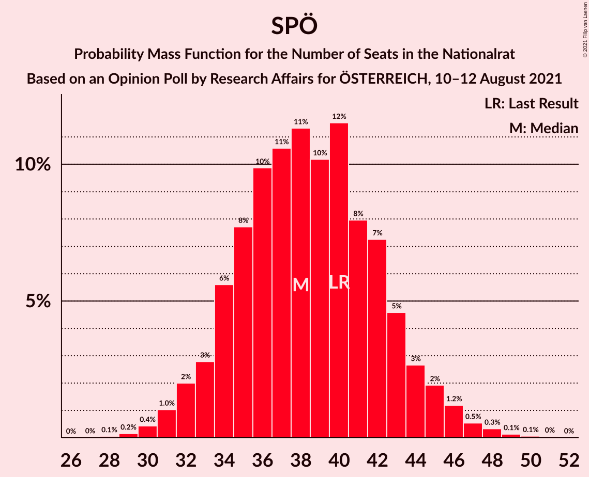

| Number of Seats | Probability | Accumulated | Special Marks |
|:---------------:|:-----------:|:-----------:|:-------------:|
| 28 | 0.1% | 100% |  |
| 29 | 0.2% | 99.9% |  |
| 30 | 0.4% | 99.8% |  |
| 31 | 1.0% | 99.3% |  |
| 32 | 2% | 98% |  |
| 33 | 3% | 96% |  |
| 34 | 6% | 94% |  |
| 35 | 8% | 88% |  |
| 36 | 10% | 80% |  |
| 37 | 11% | 70% |  |
| 38 | 11% | 60% | Median |
| 39 | 10% | 48% |  |
| 40 | 12% | 38% | Last Result |
| 41 | 8% | 27% |  |
| 42 | 7% | 19% |  |
| 43 | 5% | 11% |  |
| 44 | 3% | 7% |  |
| 45 | 2% | 4% |  |
| 46 | 1.2% | 2% |  |
| 47 | 0.5% | 1.1% |  |
| 48 | 0.3% | 0.6% |  |
| 49 | 0.1% | 0.3% |  |
| 50 | 0.1% | 0.1% |  |
| 51 | 0% | 0.1% |  |
| 52 | 0% | 0% |  |

## Technical Information

### Opinion Poll

+ **Polling firm:** Research Affairs
+ **Commissioner(s):** ÖSTERREICH
+ **Fieldwork period:** 10–12 August 2021

### Calculations

+ **Sample size:** 506
+ **Simulations done:** 131,072
+ **Error estimate:** 2.16%

