# Opinion Poll by Research Affairs for ÖSTERREICH, 17–19 August 2021

<a href="#voting-intentions">Voting Intentions</a> | <a href="#seats">Seats</a> | <a href="#coalitions">Coalitions</a> | <a href="#technical-information">Technical Information</a>

## Voting Intentions

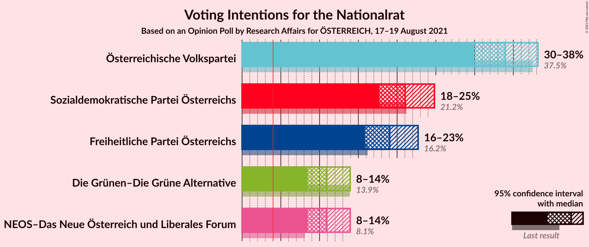

### Confidence Intervals

| Party | Last Result | Poll Result | 80% Confidence Interval | 90% Confidence Interval | 95% Confidence Interval | 99% Confidence Interval |
|:-----:|:-----------:|:-----------:|:-----------------------:|:-----------------------:|:-----------------------:|:-----------------------:|
| Österreichische Volkspartei | 37.5% | 33.9% | 31.3–36.7% |30.6–37.5% |29.9–38.2% |28.7–39.5% |
| Sozialdemokratische Partei Österreichs | 21.2% | 21.0% | 18.8–23.5% |18.2–24.2% |17.7–24.8% |16.7–26.0% |
| Freiheitliche Partei Österreichs | 16.2% | 19.0% | 16.9–21.4% |16.4–22.1% |15.9–22.7% |14.9–23.9% |
| NEOS–Das Neue Österreich und Liberales Forum | 8.1% | 10.9% | 9.3–12.9% |8.9–13.5% |8.5–13.9% |7.8–15.0% |
| Die Grünen–Die Grüne Alternative | 13.9% | 10.9% | 9.3–12.9% |8.9–13.5% |8.5–13.9% |7.8–15.0% |

*Note:* The poll result column reflects the actual value used in the calculations. Published results may vary slightly, and in addition be rounded to fewer digits.

## Seats

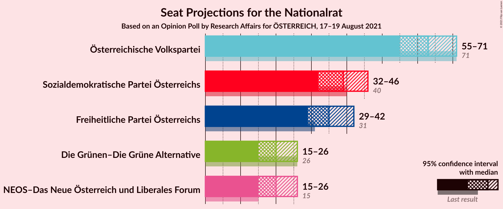

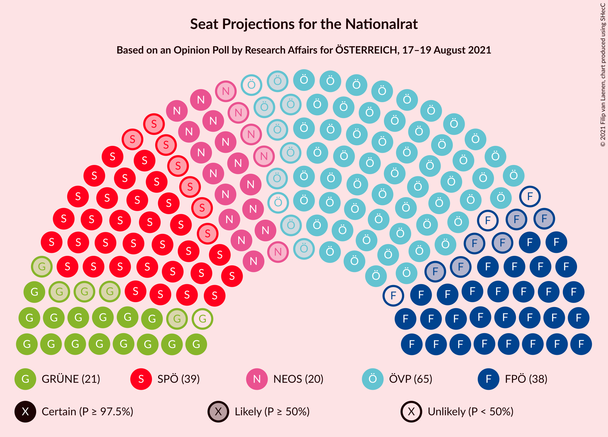

### Confidence Intervals

| Party | Last Result | Median | 80% Confidence Interval | 90% Confidence Interval | 95% Confidence Interval | 99% Confidence Interval |
|:-----:|:-----------:|:------:|:-----------------------:|:-----------------------:|:-----------------------:|:-----------------------:|
| <a href="#österreichische-volkspartei">Österreichische Volkspartei</a> | 71 | 63 | 58–69 |56–70 |55–71 |53–75 |
| <a href="#sozialdemokratische-partei-österreichs">Sozialdemokratische Partei Österreichs</a> | 40 | 39 | 34–44 |33–45 |32–46 |31–49 |
| <a href="#freiheitliche-partei-österreichs">Freiheitliche Partei Österreichs</a> | 31 | 35 | 31–40 |30–41 |29–42 |27–44 |
| <a href="#neos–das-neue-österreich-und-liberales-forum">NEOS–Das Neue Österreich und Liberales Forum</a> | 15 | 20 | 17–24 |16–25 |15–26 |14–28 |
| <a href="#die-grünen–die-grüne-alternative">Die Grünen–Die Grüne Alternative</a> | 26 | 20 | 17–24 |16–25 |15–26 |14–28 |

### Österreichische Volkspartei

*For a full overview of the results for this party, see the [Österreichische Volkspartei](party-österreichischevolkspartei.html) page.*

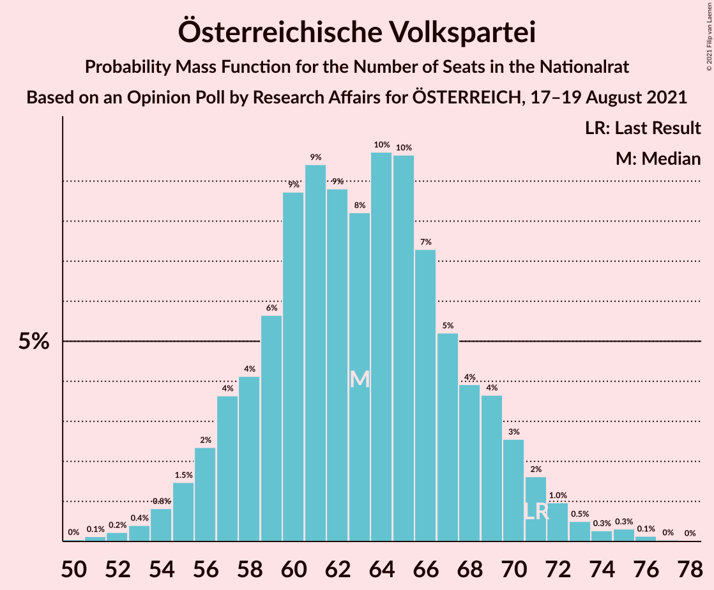

| Number of Seats | Probability | Accumulated | Special Marks |
|:---------------:|:-----------:|:-----------:|:-------------:|
| 50 | 0% | 100% |  |
| 51 | 0.1% | 99.9% |  |
| 52 | 0.2% | 99.8% |  |
| 53 | 0.4% | 99.6% |  |
| 54 | 0.8% | 99.2% |  |
| 55 | 1.5% | 98% |  |
| 56 | 2% | 97% |  |
| 57 | 4% | 95% |  |
| 58 | 4% | 91% |  |
| 59 | 6% | 87% |  |
| 60 | 9% | 81% |  |
| 61 | 9% | 72% |  |
| 62 | 9% | 63% |  |
| 63 | 8% | 54% | Median |
| 64 | 10% | 46% |  |
| 65 | 10% | 36% |  |
| 66 | 7% | 27% |  |
| 67 | 5% | 19% |  |
| 68 | 4% | 14% |  |
| 69 | 4% | 10% |  |
| 70 | 3% | 6% |  |
| 71 | 2% | 4% | Last Result |
| 72 | 1.0% | 2% |  |
| 73 | 0.5% | 1.3% |  |
| 74 | 0.3% | 0.8% |  |
| 75 | 0.3% | 0.5% |  |
| 76 | 0.1% | 0.2% |  |
| 77 | 0% | 0.1% |  |
| 78 | 0% | 0% |  |

### Sozialdemokratische Partei Österreichs

*For a full overview of the results for this party, see the [Sozialdemokratische Partei Österreichs](party-sozialdemokratischeparteiösterreichs.html) page.*

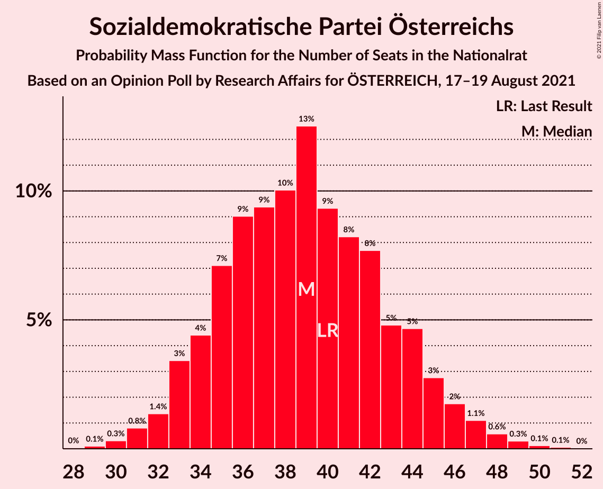

| Number of Seats | Probability | Accumulated | Special Marks |
|:---------------:|:-----------:|:-----------:|:-------------:|
| 28 | 0% | 100% |  |
| 29 | 0.1% | 99.9% |  |
| 30 | 0.3% | 99.8% |  |
| 31 | 0.8% | 99.5% |  |
| 32 | 1.4% | 98.7% |  |
| 33 | 3% | 97% |  |
| 34 | 4% | 94% |  |
| 35 | 7% | 90% |  |
| 36 | 9% | 82% |  |
| 37 | 9% | 73% |  |
| 38 | 10% | 64% |  |
| 39 | 13% | 54% | Median |
| 40 | 9% | 41% | Last Result |
| 41 | 8% | 32% |  |
| 42 | 8% | 24% |  |
| 43 | 5% | 16% |  |
| 44 | 5% | 11% |  |
| 45 | 3% | 7% |  |
| 46 | 2% | 4% |  |
| 47 | 1.1% | 2% |  |
| 48 | 0.6% | 1.1% |  |
| 49 | 0.3% | 0.5% |  |
| 50 | 0.1% | 0.2% |  |
| 51 | 0.1% | 0.1% |  |
| 52 | 0% | 0% |  |

### Freiheitliche Partei Österreichs

*For a full overview of the results for this party, see the [Freiheitliche Partei Österreichs](party-freiheitlicheparteiösterreichs.html) page.*

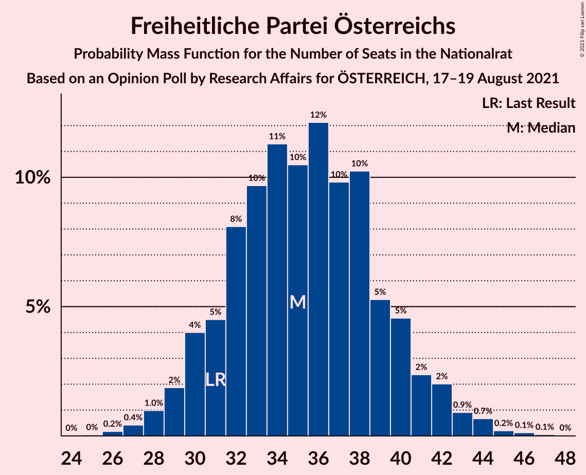

| Number of Seats | Probability | Accumulated | Special Marks |
|:---------------:|:-----------:|:-----------:|:-------------:|
| 25 | 0% | 100% |  |
| 26 | 0.2% | 99.9% |  |
| 27 | 0.4% | 99.8% |  |
| 28 | 1.0% | 99.3% |  |
| 29 | 2% | 98% |  |
| 30 | 4% | 96% |  |
| 31 | 5% | 92% | Last Result |
| 32 | 8% | 88% |  |
| 33 | 10% | 80% |  |
| 34 | 11% | 70% |  |
| 35 | 10% | 59% | Median |
| 36 | 12% | 48% |  |
| 37 | 10% | 36% |  |
| 38 | 10% | 26% |  |
| 39 | 5% | 16% |  |
| 40 | 5% | 11% |  |
| 41 | 2% | 6% |  |
| 42 | 2% | 4% |  |
| 43 | 0.9% | 2% |  |
| 44 | 0.7% | 1.1% |  |
| 45 | 0.2% | 0.4% |  |
| 46 | 0.1% | 0.2% |  |
| 47 | 0.1% | 0.1% |  |
| 48 | 0% | 0% |  |

### NEOS–Das Neue Österreich und Liberales Forum

*For a full overview of the results for this party, see the [NEOS–Das Neue Österreich und Liberales Forum](party-neos–dasneueösterreichundliberalesforum.html) page.*

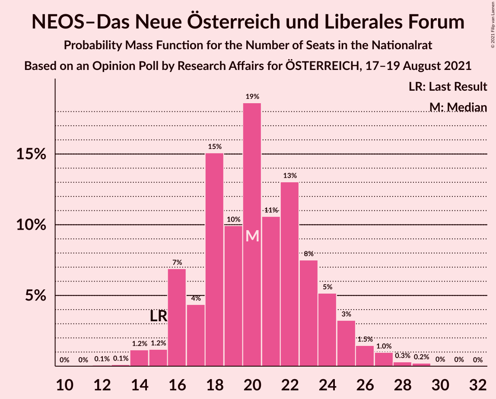

| Number of Seats | Probability | Accumulated | Special Marks |
|:---------------:|:-----------:|:-----------:|:-------------:|
| 12 | 0.1% | 100% |  |
| 13 | 0.1% | 99.9% |  |
| 14 | 1.2% | 99.8% |  |
| 15 | 1.2% | 98.7% | Last Result |
| 16 | 7% | 97% |  |
| 17 | 4% | 91% |  |
| 18 | 15% | 86% |  |
| 19 | 10% | 71% |  |
| 20 | 19% | 61% | Median |
| 21 | 11% | 43% |  |
| 22 | 13% | 32% |  |
| 23 | 8% | 19% |  |
| 24 | 5% | 11% |  |
| 25 | 3% | 6% |  |
| 26 | 1.5% | 3% |  |
| 27 | 1.0% | 2% |  |
| 28 | 0.3% | 0.6% |  |
| 29 | 0.2% | 0.3% |  |
| 30 | 0% | 0.1% |  |
| 31 | 0% | 0% |  |

### Die Grünen–Die Grüne Alternative

*For a full overview of the results for this party, see the [Die Grünen–Die Grüne Alternative](party-diegrünen–diegrünealternative.html) page.*

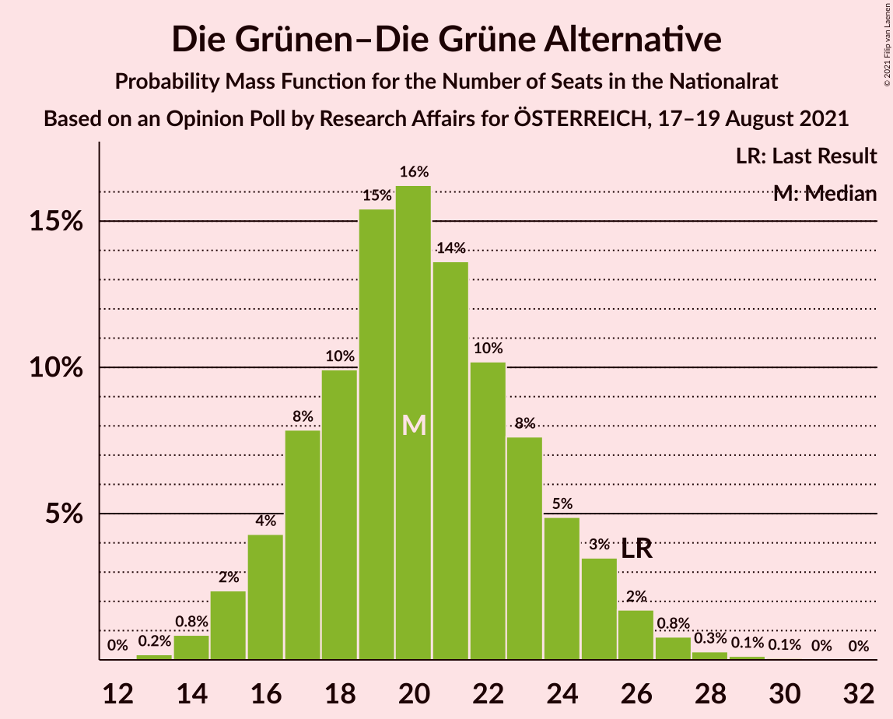

| Number of Seats | Probability | Accumulated | Special Marks |
|:---------------:|:-----------:|:-----------:|:-------------:|
| 13 | 0.2% | 100% |  |
| 14 | 0.8% | 99.8% |  |
| 15 | 2% | 98.9% |  |
| 16 | 4% | 97% |  |
| 17 | 8% | 92% |  |
| 18 | 10% | 84% |  |
| 19 | 15% | 74% |  |
| 20 | 16% | 59% | Median |
| 21 | 14% | 43% |  |
| 22 | 10% | 29% |  |
| 23 | 8% | 19% |  |
| 24 | 5% | 11% |  |
| 25 | 3% | 6% |  |
| 26 | 2% | 3% | Last Result |
| 27 | 0.8% | 1.3% |  |
| 28 | 0.3% | 0.5% |  |
| 29 | 0.1% | 0.2% |  |
| 30 | 0.1% | 0.1% |  |
| 31 | 0% | 0% |  |

## Coalitions

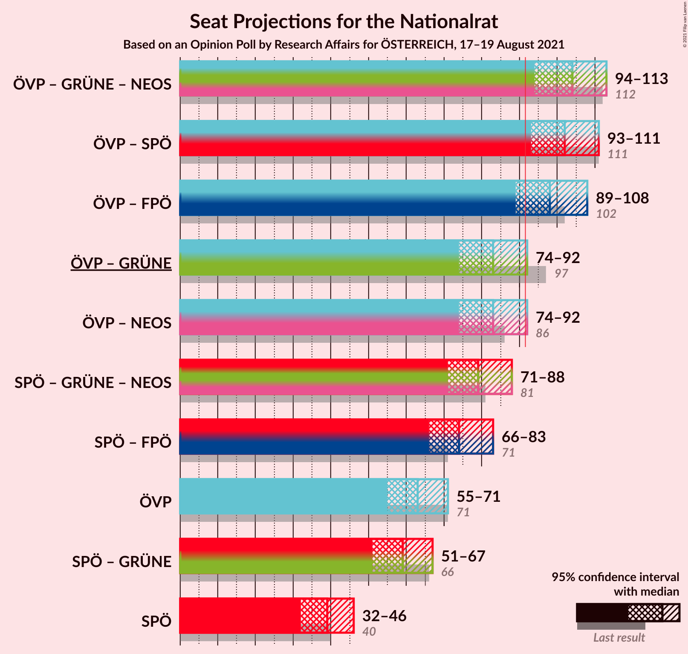

### Confidence Intervals

| Coalition | Last Result | Median | Majority? | 80% Confidence Interval | 90% Confidence Interval | 95% Confidence Interval | 99% Confidence Interval |
|:---------:|:-----------:|:------:|:---------:|:-----------------------:|:-----------------------:|:-----------------------:|:-----------------------:|
| Österreichische Volkspartei – Die Grünen–Die Grüne Alternative – NEOS–Das Neue Österreich und Liberales Forum | 112 | 104 | 99.5% | 97–110 | 96–111 | 94–113 | 92–115 |
| Österreichische Volkspartei – Sozialdemokratische Partei Österreichs | 111 | 102 | 99.0% | 96–108 | 94–110 | 93–111 | 90–114 |
| Österreichische Volkspartei – Freiheitliche Partei Österreichs | 102 | 98 | 93% | 92–104 | 91–106 | 89–108 | 87–111 |
| Österreichische Volkspartei – Die Grünen–Die Grüne Alternative | 97 | 83 | 4% | 77–89 | 76–91 | 74–92 | 72–95 |
| Österreichische Volkspartei – NEOS–Das Neue Österreich und Liberales Forum | 86 | 83 | 4% | 77–89 | 76–91 | 74–92 | 72–95 |
| Sozialdemokratische Partei Österreichs – Die Grünen–Die Grüne Alternative – NEOS–Das Neue Österreich und Liberales Forum | 81 | 79 | 0.4% | 74–85 | 72–87 | 71–88 | 68–91 |
| Sozialdemokratische Partei Österreichs – Freiheitliche Partei Österreichs | 71 | 74 | 0% | 69–80 | 67–82 | 66–83 | 64–86 |
| Österreichische Volkspartei | 71 | 63 | 0% | 58–69 | 56–70 | 55–71 | 53–75 |
| Sozialdemokratische Partei Österreichs – Die Grünen–Die Grüne Alternative | 66 | 59 | 0% | 54–65 | 52–66 | 51–67 | 49–70 |
| Sozialdemokratische Partei Österreichs | 40 | 39 | 0% | 34–44 | 33–45 | 32–46 | 31–49 |

### Österreichische Volkspartei – Die Grünen–Die Grüne Alternative – NEOS–Das Neue Österreich und Liberales Forum

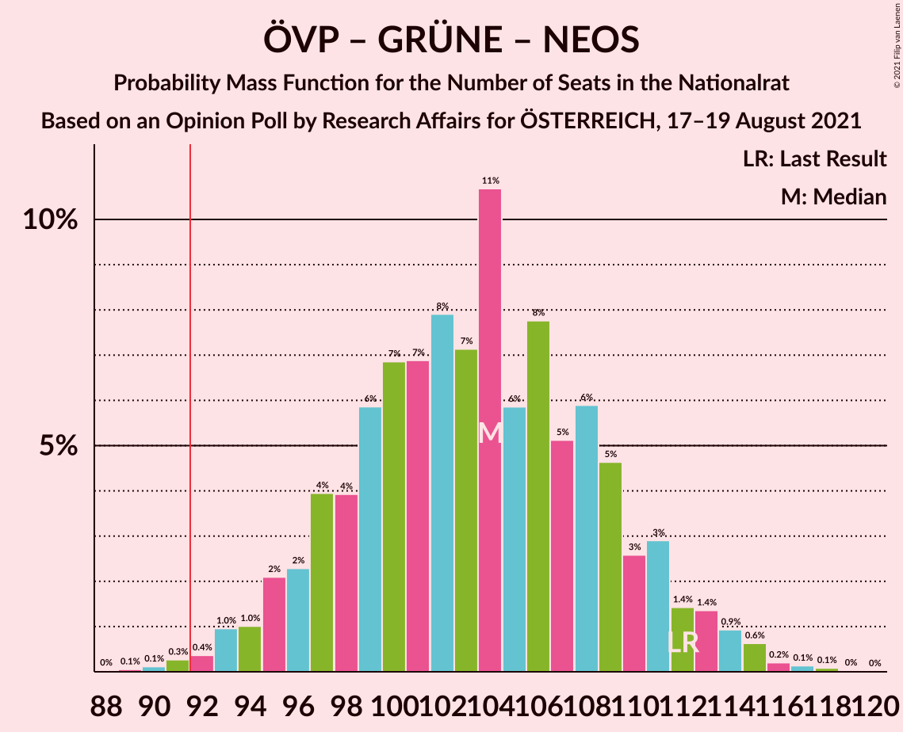

| Number of Seats | Probability | Accumulated | Special Marks |
|:---------------:|:-----------:|:-----------:|:-------------:|
| 89 | 0.1% | 100% |  |
| 90 | 0.1% | 99.9% |  |
| 91 | 0.3% | 99.8% |  |
| 92 | 0.4% | 99.5% | Majority |
| 93 | 1.0% | 99.1% |  |
| 94 | 1.0% | 98% |  |
| 95 | 2% | 97% |  |
| 96 | 2% | 95% |  |
| 97 | 4% | 93% |  |
| 98 | 4% | 89% |  |
| 99 | 6% | 85% |  |
| 100 | 7% | 79% |  |
| 101 | 7% | 72% |  |
| 102 | 8% | 65% |  |
| 103 | 7% | 57% | Median |
| 104 | 11% | 50% |  |
| 105 | 6% | 40% |  |
| 106 | 8% | 34% |  |
| 107 | 5% | 26% |  |
| 108 | 6% | 21% |  |
| 109 | 5% | 15% |  |
| 110 | 3% | 10% |  |
| 111 | 3% | 8% |  |
| 112 | 1.4% | 5% | Last Result |
| 113 | 1.4% | 3% |  |
| 114 | 0.9% | 2% |  |
| 115 | 0.6% | 1.1% |  |
| 116 | 0.2% | 0.5% |  |
| 117 | 0.1% | 0.3% |  |
| 118 | 0.1% | 0.1% |  |
| 119 | 0% | 0.1% |  |
| 120 | 0% | 0% |  |

### Österreichische Volkspartei – Sozialdemokratische Partei Österreichs

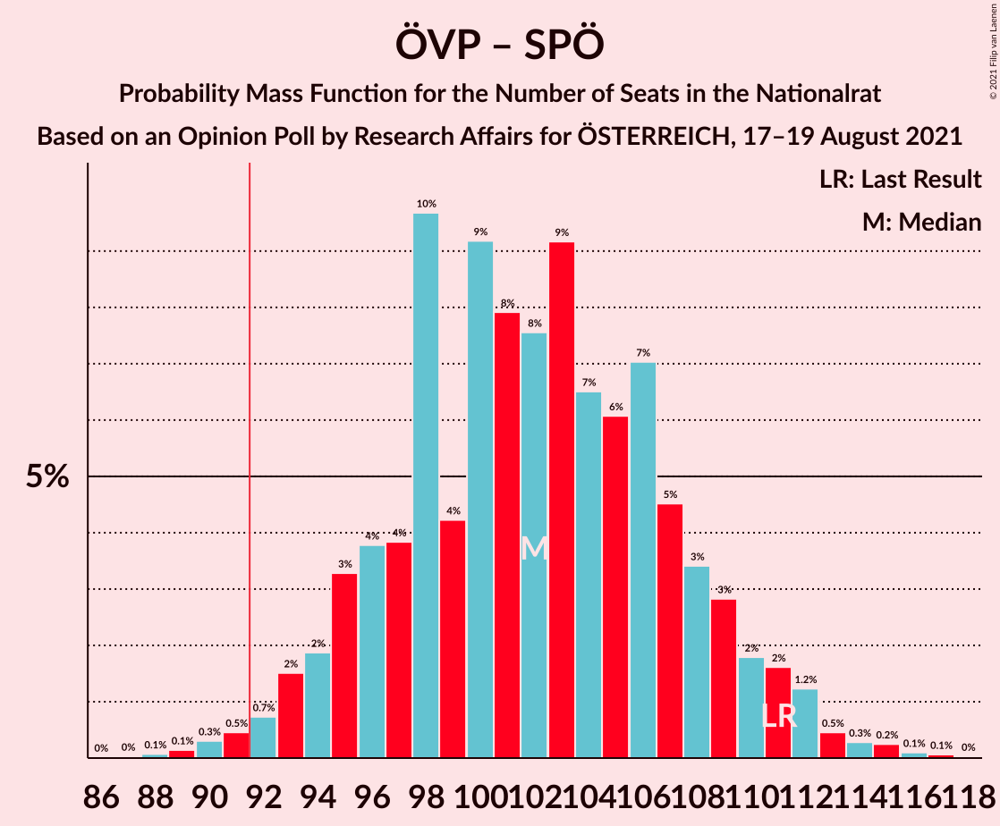

| Number of Seats | Probability | Accumulated | Special Marks |
|:---------------:|:-----------:|:-----------:|:-------------:|
| 87 | 0% | 100% |  |
| 88 | 0.1% | 99.9% |  |
| 89 | 0.1% | 99.9% |  |
| 90 | 0.3% | 99.7% |  |
| 91 | 0.5% | 99.4% |  |
| 92 | 0.7% | 99.0% | Majority |
| 93 | 2% | 98% |  |
| 94 | 2% | 97% |  |
| 95 | 3% | 95% |  |
| 96 | 4% | 92% |  |
| 97 | 4% | 88% |  |
| 98 | 10% | 84% |  |
| 99 | 4% | 74% |  |
| 100 | 9% | 70% |  |
| 101 | 8% | 61% |  |
| 102 | 8% | 53% | Median |
| 103 | 9% | 45% |  |
| 104 | 7% | 36% |  |
| 105 | 6% | 30% |  |
| 106 | 7% | 24% |  |
| 107 | 5% | 17% |  |
| 108 | 3% | 12% |  |
| 109 | 3% | 9% |  |
| 110 | 2% | 6% |  |
| 111 | 2% | 4% | Last Result |
| 112 | 1.2% | 2% |  |
| 113 | 0.5% | 1.2% |  |
| 114 | 0.3% | 0.7% |  |
| 115 | 0.2% | 0.5% |  |
| 116 | 0.1% | 0.2% |  |
| 117 | 0.1% | 0.1% |  |
| 118 | 0% | 0% |  |

### Österreichische Volkspartei – Freiheitliche Partei Österreichs

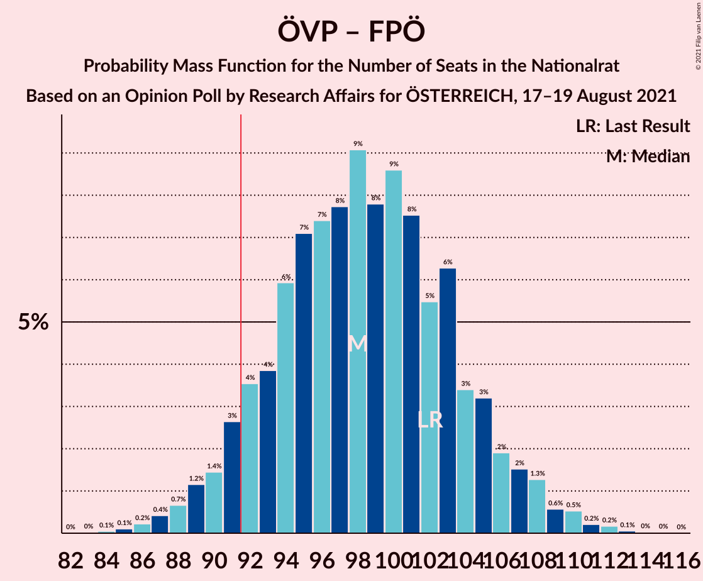

| Number of Seats | Probability | Accumulated | Special Marks |
|:---------------:|:-----------:|:-----------:|:-------------:|
| 84 | 0.1% | 100% |  |
| 85 | 0.1% | 99.9% |  |
| 86 | 0.2% | 99.8% |  |
| 87 | 0.4% | 99.6% |  |
| 88 | 0.7% | 99.2% |  |
| 89 | 1.2% | 98% |  |
| 90 | 1.4% | 97% |  |
| 91 | 3% | 96% |  |
| 92 | 4% | 93% | Majority |
| 93 | 4% | 90% |  |
| 94 | 6% | 86% |  |
| 95 | 7% | 80% |  |
| 96 | 7% | 73% |  |
| 97 | 8% | 65% |  |
| 98 | 9% | 58% | Median |
| 99 | 8% | 49% |  |
| 100 | 9% | 41% |  |
| 101 | 8% | 32% |  |
| 102 | 5% | 25% | Last Result |
| 103 | 6% | 19% |  |
| 104 | 3% | 13% |  |
| 105 | 3% | 10% |  |
| 106 | 2% | 6% |  |
| 107 | 2% | 4% |  |
| 108 | 1.3% | 3% |  |
| 109 | 0.6% | 2% |  |
| 110 | 0.5% | 1.0% |  |
| 111 | 0.2% | 0.5% |  |
| 112 | 0.2% | 0.3% |  |
| 113 | 0.1% | 0.1% |  |
| 114 | 0% | 0.1% |  |
| 115 | 0% | 0% |  |

### Österreichische Volkspartei – Die Grünen–Die Grüne Alternative

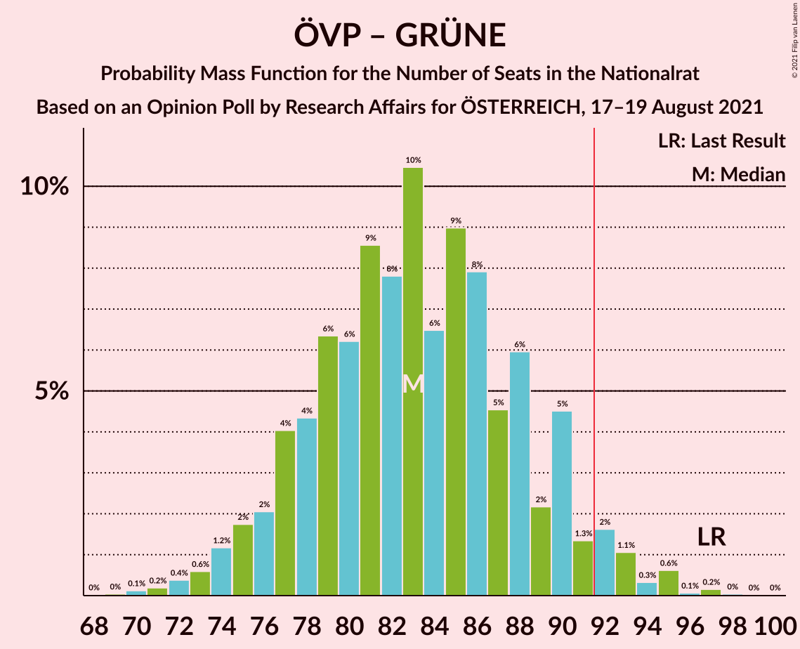

| Number of Seats | Probability | Accumulated | Special Marks |
|:---------------:|:-----------:|:-----------:|:-------------:|
| 69 | 0% | 100% |  |
| 70 | 0.1% | 99.9% |  |
| 71 | 0.2% | 99.8% |  |
| 72 | 0.4% | 99.6% |  |
| 73 | 0.6% | 99.2% |  |
| 74 | 1.2% | 98.6% |  |
| 75 | 2% | 97% |  |
| 76 | 2% | 96% |  |
| 77 | 4% | 94% |  |
| 78 | 4% | 90% |  |
| 79 | 6% | 85% |  |
| 80 | 6% | 79% |  |
| 81 | 9% | 73% |  |
| 82 | 8% | 64% |  |
| 83 | 10% | 56% | Median |
| 84 | 6% | 46% |  |
| 85 | 9% | 39% |  |
| 86 | 8% | 30% |  |
| 87 | 5% | 22% |  |
| 88 | 6% | 18% |  |
| 89 | 2% | 12% |  |
| 90 | 5% | 10% |  |
| 91 | 1.3% | 5% |  |
| 92 | 2% | 4% | Majority |
| 93 | 1.1% | 2% |  |
| 94 | 0.3% | 1.3% |  |
| 95 | 0.6% | 0.9% |  |
| 96 | 0.1% | 0.3% |  |
| 97 | 0.2% | 0.2% | Last Result |
| 98 | 0% | 0.1% |  |
| 99 | 0% | 0% |  |

### Österreichische Volkspartei – NEOS–Das Neue Österreich und Liberales Forum

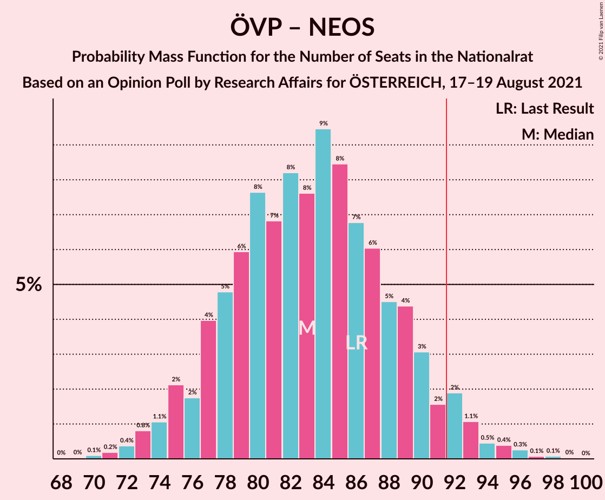

| Number of Seats | Probability | Accumulated | Special Marks |
|:---------------:|:-----------:|:-----------:|:-------------:|
| 69 | 0% | 100% |  |
| 70 | 0.1% | 99.9% |  |
| 71 | 0.2% | 99.8% |  |
| 72 | 0.4% | 99.6% |  |
| 73 | 0.8% | 99.3% |  |
| 74 | 1.1% | 98% |  |
| 75 | 2% | 97% |  |
| 76 | 2% | 95% |  |
| 77 | 4% | 94% |  |
| 78 | 5% | 90% |  |
| 79 | 6% | 85% |  |
| 80 | 8% | 79% |  |
| 81 | 7% | 71% |  |
| 82 | 8% | 64% |  |
| 83 | 8% | 56% | Median |
| 84 | 9% | 49% |  |
| 85 | 8% | 39% |  |
| 86 | 7% | 31% | Last Result |
| 87 | 6% | 24% |  |
| 88 | 5% | 18% |  |
| 89 | 4% | 13% |  |
| 90 | 3% | 9% |  |
| 91 | 2% | 6% |  |
| 92 | 2% | 4% | Majority |
| 93 | 1.1% | 2% |  |
| 94 | 0.5% | 1.3% |  |
| 95 | 0.4% | 0.9% |  |
| 96 | 0.3% | 0.5% |  |
| 97 | 0.1% | 0.2% |  |
| 98 | 0.1% | 0.1% |  |
| 99 | 0% | 0.1% |  |
| 100 | 0% | 0% |  |

### Sozialdemokratische Partei Österreichs – Die Grünen–Die Grüne Alternative – NEOS–Das Neue Österreich und Liberales Forum

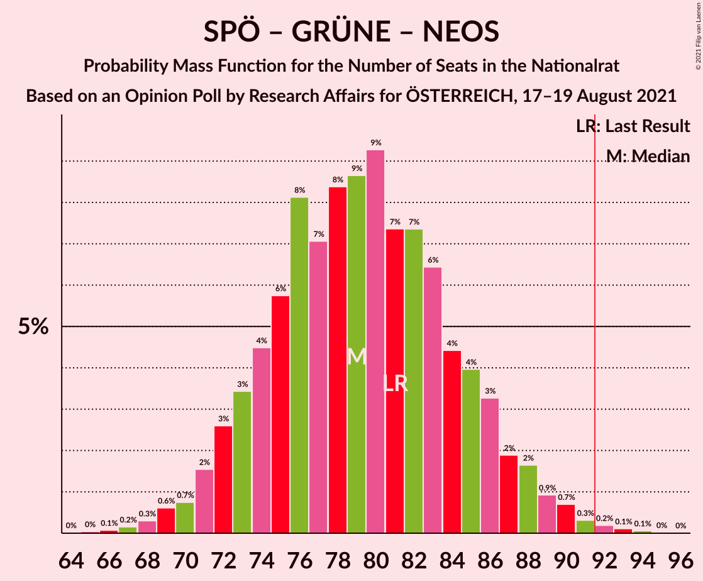

| Number of Seats | Probability | Accumulated | Special Marks |
|:---------------:|:-----------:|:-----------:|:-------------:|
| 65 | 0% | 100% |  |
| 66 | 0.1% | 99.9% |  |
| 67 | 0.2% | 99.9% |  |
| 68 | 0.3% | 99.7% |  |
| 69 | 0.6% | 99.4% |  |
| 70 | 0.7% | 98.8% |  |
| 71 | 2% | 98% |  |
| 72 | 3% | 96% |  |
| 73 | 3% | 94% |  |
| 74 | 4% | 90% |  |
| 75 | 6% | 86% |  |
| 76 | 8% | 80% |  |
| 77 | 7% | 72% |  |
| 78 | 8% | 65% |  |
| 79 | 9% | 57% | Median |
| 80 | 9% | 48% |  |
| 81 | 7% | 39% | Last Result |
| 82 | 7% | 31% |  |
| 83 | 6% | 24% |  |
| 84 | 4% | 18% |  |
| 85 | 4% | 13% |  |
| 86 | 3% | 9% |  |
| 87 | 2% | 6% |  |
| 88 | 2% | 4% |  |
| 89 | 0.9% | 2% |  |
| 90 | 0.7% | 1.4% |  |
| 91 | 0.3% | 0.7% |  |
| 92 | 0.2% | 0.4% | Majority |
| 93 | 0.1% | 0.2% |  |
| 94 | 0.1% | 0.1% |  |
| 95 | 0% | 0% |  |

### Sozialdemokratische Partei Österreichs – Freiheitliche Partei Österreichs

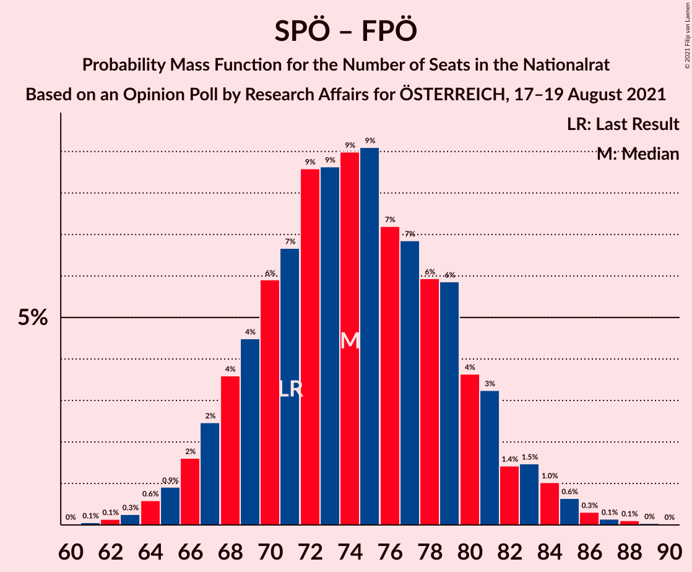

| Number of Seats | Probability | Accumulated | Special Marks |
|:---------------:|:-----------:|:-----------:|:-------------:|
| 61 | 0.1% | 100% |  |
| 62 | 0.1% | 99.9% |  |
| 63 | 0.3% | 99.8% |  |
| 64 | 0.6% | 99.5% |  |
| 65 | 0.9% | 98.9% |  |
| 66 | 2% | 98% |  |
| 67 | 2% | 96% |  |
| 68 | 4% | 94% |  |
| 69 | 4% | 90% |  |
| 70 | 6% | 86% |  |
| 71 | 7% | 80% | Last Result |
| 72 | 9% | 73% |  |
| 73 | 9% | 65% |  |
| 74 | 9% | 56% | Median |
| 75 | 9% | 47% |  |
| 76 | 7% | 38% |  |
| 77 | 7% | 31% |  |
| 78 | 6% | 24% |  |
| 79 | 6% | 18% |  |
| 80 | 4% | 12% |  |
| 81 | 3% | 8% |  |
| 82 | 1.4% | 5% |  |
| 83 | 1.5% | 4% |  |
| 84 | 1.0% | 2% |  |
| 85 | 0.6% | 1.3% |  |
| 86 | 0.3% | 0.6% |  |
| 87 | 0.1% | 0.3% |  |
| 88 | 0.1% | 0.2% |  |
| 89 | 0% | 0.1% |  |
| 90 | 0% | 0% |  |

### Österreichische Volkspartei

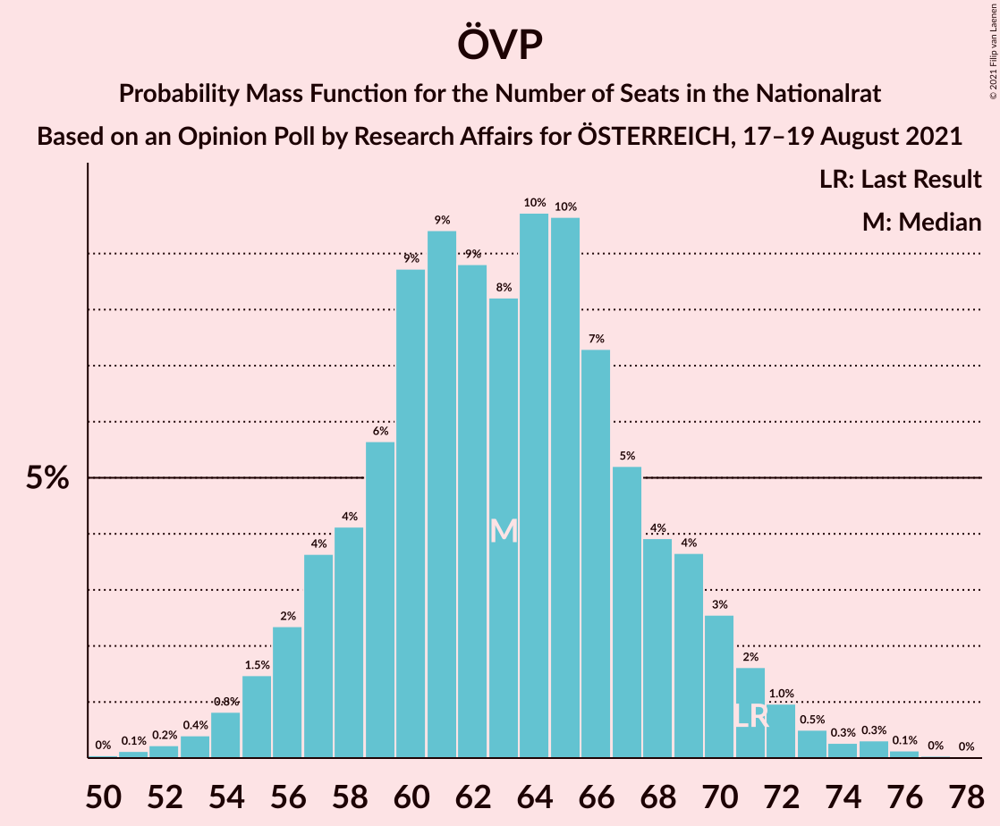

| Number of Seats | Probability | Accumulated | Special Marks |
|:---------------:|:-----------:|:-----------:|:-------------:|
| 50 | 0% | 100% |  |
| 51 | 0.1% | 99.9% |  |
| 52 | 0.2% | 99.8% |  |
| 53 | 0.4% | 99.6% |  |
| 54 | 0.8% | 99.2% |  |
| 55 | 1.5% | 98% |  |
| 56 | 2% | 97% |  |
| 57 | 4% | 95% |  |
| 58 | 4% | 91% |  |
| 59 | 6% | 87% |  |
| 60 | 9% | 81% |  |
| 61 | 9% | 72% |  |
| 62 | 9% | 63% |  |
| 63 | 8% | 54% | Median |
| 64 | 10% | 46% |  |
| 65 | 10% | 36% |  |
| 66 | 7% | 27% |  |
| 67 | 5% | 19% |  |
| 68 | 4% | 14% |  |
| 69 | 4% | 10% |  |
| 70 | 3% | 6% |  |
| 71 | 2% | 4% | Last Result |
| 72 | 1.0% | 2% |  |
| 73 | 0.5% | 1.3% |  |
| 74 | 0.3% | 0.8% |  |
| 75 | 0.3% | 0.5% |  |
| 76 | 0.1% | 0.2% |  |
| 77 | 0% | 0.1% |  |
| 78 | 0% | 0% |  |

### Sozialdemokratische Partei Österreichs – Die Grünen–Die Grüne Alternative

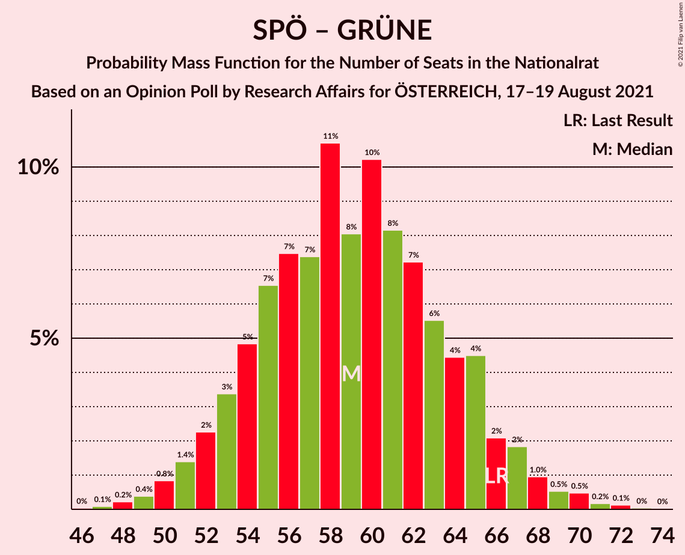

| Number of Seats | Probability | Accumulated | Special Marks |
|:---------------:|:-----------:|:-----------:|:-------------:|
| 46 | 0% | 100% |  |
| 47 | 0.1% | 99.9% |  |
| 48 | 0.2% | 99.9% |  |
| 49 | 0.4% | 99.6% |  |
| 50 | 0.8% | 99.2% |  |
| 51 | 1.4% | 98% |  |
| 52 | 2% | 97% |  |
| 53 | 3% | 95% |  |
| 54 | 5% | 91% |  |
| 55 | 7% | 87% |  |
| 56 | 7% | 80% |  |
| 57 | 7% | 73% |  |
| 58 | 11% | 65% |  |
| 59 | 8% | 54% | Median |
| 60 | 10% | 46% |  |
| 61 | 8% | 36% |  |
| 62 | 7% | 28% |  |
| 63 | 6% | 21% |  |
| 64 | 4% | 15% |  |
| 65 | 4% | 11% |  |
| 66 | 2% | 6% | Last Result |
| 67 | 2% | 4% |  |
| 68 | 1.0% | 2% |  |
| 69 | 0.5% | 1.4% |  |
| 70 | 0.5% | 0.9% |  |
| 71 | 0.2% | 0.4% |  |
| 72 | 0.1% | 0.2% |  |
| 73 | 0% | 0.1% |  |
| 74 | 0% | 0% |  |

### Sozialdemokratische Partei Österreichs

| Number of Seats | Probability | Accumulated | Special Marks |
|:---------------:|:-----------:|:-----------:|:-------------:|
| 28 | 0% | 100% |  |
| 29 | 0.1% | 99.9% |  |
| 30 | 0.3% | 99.8% |  |
| 31 | 0.8% | 99.5% |  |
| 32 | 1.4% | 98.7% |  |
| 33 | 3% | 97% |  |
| 34 | 4% | 94% |  |
| 35 | 7% | 90% |  |
| 36 | 9% | 82% |  |
| 37 | 9% | 73% |  |
| 38 | 10% | 64% |  |
| 39 | 13% | 54% | Median |
| 40 | 9% | 41% | Last Result |
| 41 | 8% | 32% |  |
| 42 | 8% | 24% |  |
| 43 | 5% | 16% |  |
| 44 | 5% | 11% |  |
| 45 | 3% | 7% |  |
| 46 | 2% | 4% |  |
| 47 | 1.1% | 2% |  |
| 48 | 0.6% | 1.1% |  |
| 49 | 0.3% | 0.5% |  |
| 50 | 0.1% | 0.2% |  |
| 51 | 0.1% | 0.1% |  |
| 52 | 0% | 0% |  |

## Technical Information

### Opinion Poll

+ **Polling firm:** Research Affairs
+ **Commissioner(s):** ÖSTERREICH
+ **Fieldwork period:** 17–19 August 2021

### Calculations

+ **Sample size:** 504
+ **Simulations done:** 131,072
+ **Error estimate:** 0.40%

