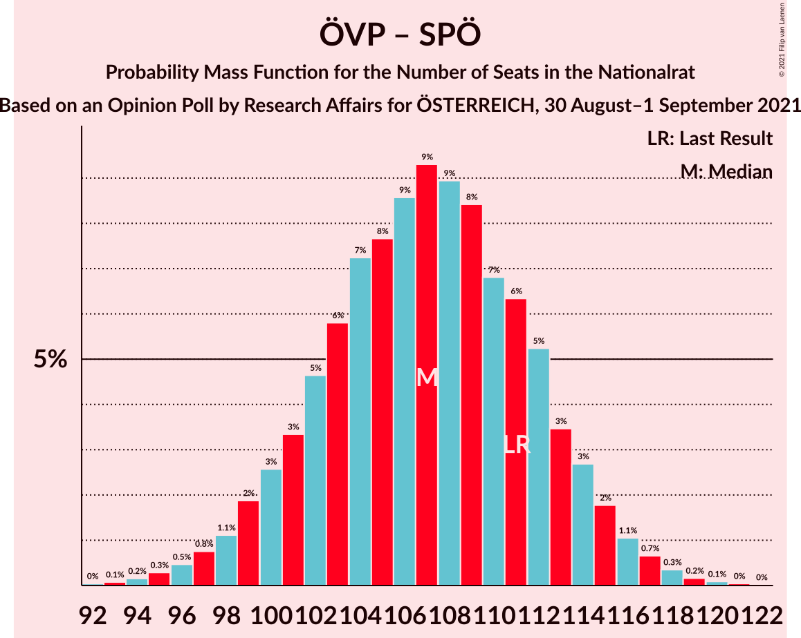
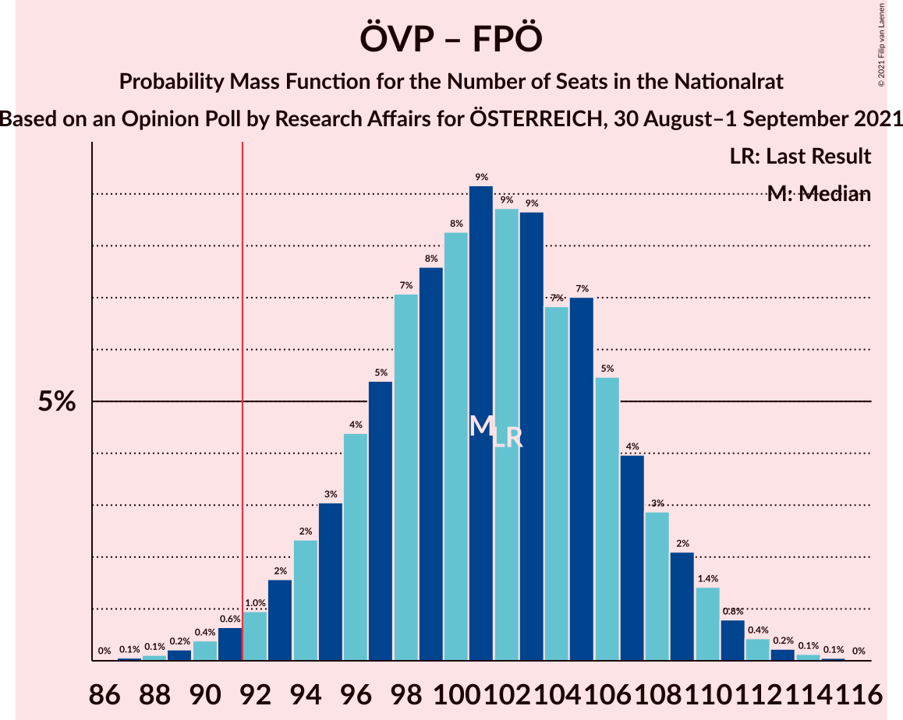
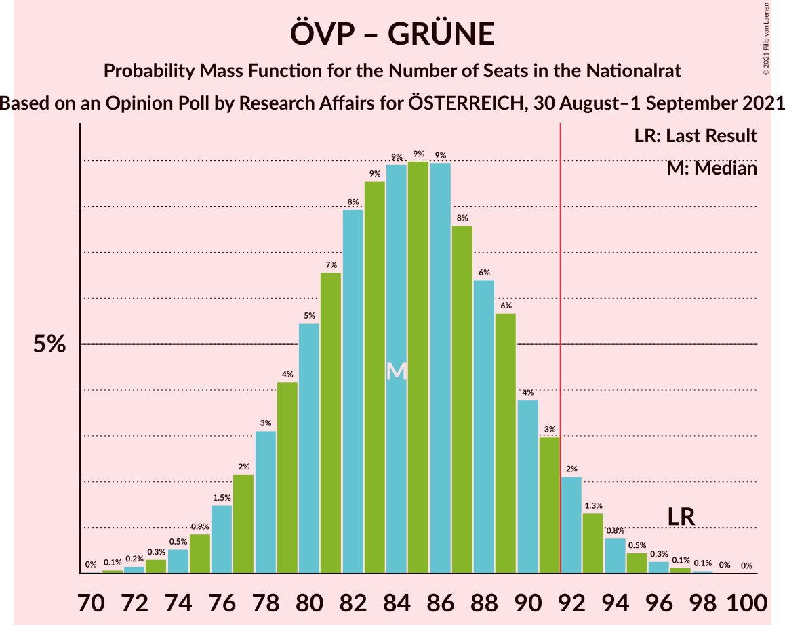
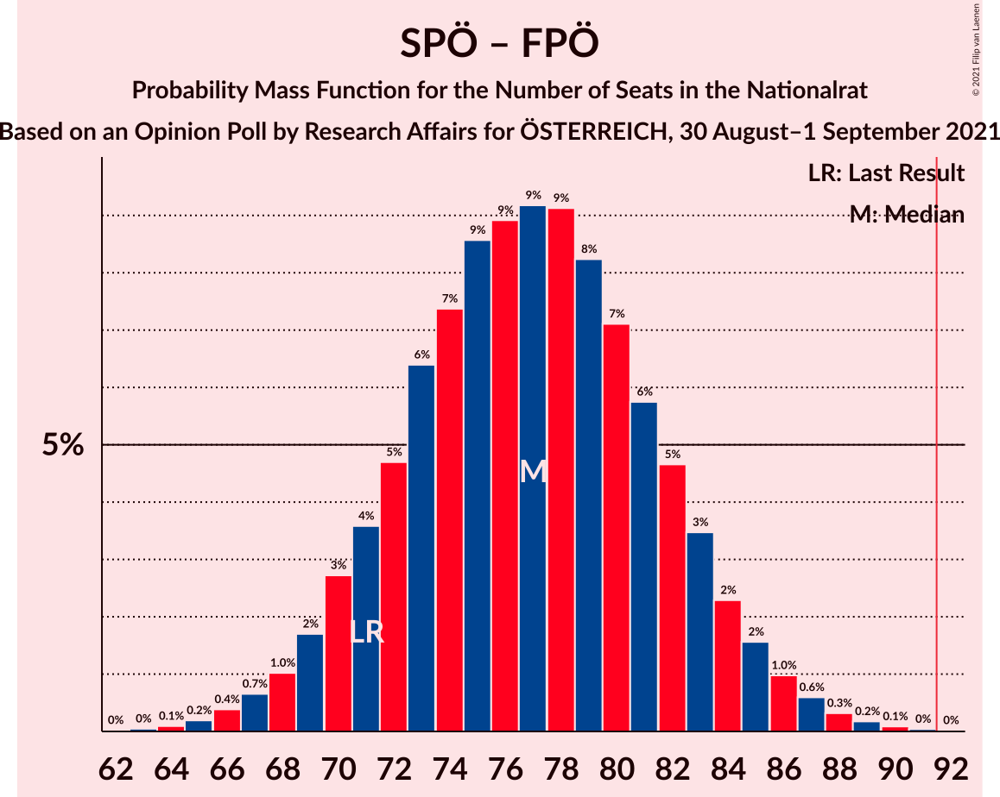
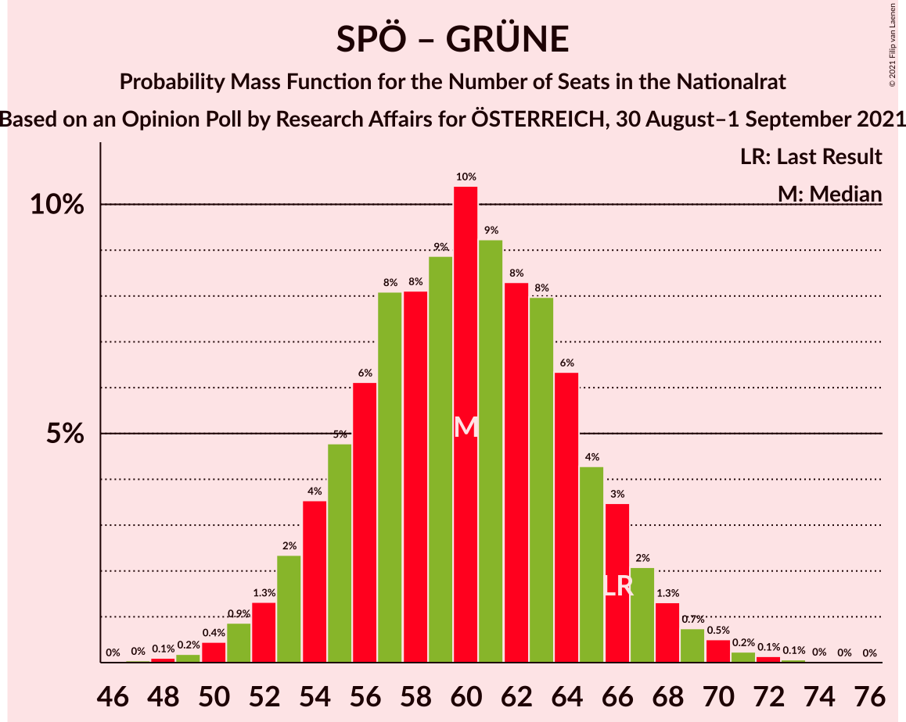

# Opinion Poll by Research Affairs for ÖSTERREICH, 30 August–1 September 2021

<a href="#voting-intentions">Voting Intentions</a> | <a href="#seats">Seats</a> | <a href="#coalitions">Coalitions</a> | <a href="#technical-information">Technical Information</a>

## Voting Intentions

### Confidence Intervals

| Party | Last Result | Poll Result | 80% Confidence Interval | 90% Confidence Interval | 95% Confidence Interval | 99% Confidence Interval |
|:-----:|:-----------:|:-----------:|:-----------------------:|:-----------------------:|:-----------------------:|:-----------------------:|
| Österreichische Volkspartei | 37.5% | 35.0% | 32.3–37.8% |31.6–38.6% |30.9–39.3% |29.7–40.6% |
| Sozialdemokratische Partei Österreichs | 21.2% | 22.0% | 19.8–24.5% |19.1–25.2% |18.6–25.8% |17.6–27.1% |
| Freiheitliche Partei Österreichs | 16.2% | 19.0% | 16.9–21.4% |16.3–22.1% |15.8–22.7% |14.8–23.9% |
| NEOS–Das Neue Österreich und Liberales Forum | 8.1% | 11.0% | 9.4–13.0% |8.9–13.5% |8.6–14.1% |7.8–15.1% |
| Die Grünen–Die Grüne Alternative | 13.9% | 10.0% | 8.5–11.9% |8.0–12.5% |7.7–13.0% |7.0–13.9% |

*Note:* The poll result column reflects the actual value used in the calculations. Published results may vary slightly, and in addition be rounded to fewer digits.

## Seats

### Confidence Intervals

| Party | Last Result | Median | 80% Confidence Interval | 90% Confidence Interval | 95% Confidence Interval | 99% Confidence Interval |
|:-----:|:-----------:|:------:|:-----------------------:|:-----------------------:|:-----------------------:|:-----------------------:|
| <a href="#österreichische-volkspartei">Österreichische Volkspartei</a> | 71 | 66 | 60–71 |59–73 |58–74 |55–77 |
| <a href="#sozialdemokratische-partei-österreichs">Sozialdemokratische Partei Österreichs</a> | 40 | 41 | 37–46 |35–47 |34–48 |33–51 |
| <a href="#freiheitliche-partei-österreichs">Freiheitliche Partei Österreichs</a> | 31 | 36 | 31–40 |30–41 |29–42 |27–45 |
| <a href="#neos–das-neue-österreich-und-liberales-forum">NEOS–Das Neue Österreich und Liberales Forum</a> | 15 | 20 | 17–24 |16–25 |16–26 |14–28 |
| <a href="#die-grünen–die-grüne-alternative">Die Grünen–Die Grüne Alternative</a> | 26 | 19 | 15–22 |15–23 |14–24 |13–26 |

### Österreichische Volkspartei

*For a full overview of the results for this party, see the [Österreichische Volkspartei](party-österreichischevolkspartei.html) page.*

| Number of Seats | Probability | Accumulated | Special Marks |
|:---------------:|:-----------:|:-----------:|:-------------:|
| 53 | 0.1% | 100% |  |
| 54 | 0.2% | 99.9% |  |
| 55 | 0.3% | 99.7% |  |
| 56 | 0.6% | 99.4% |  |
| 57 | 1.0% | 98.8% |  |
| 58 | 2% | 98% |  |
| 59 | 3% | 96% |  |
| 60 | 5% | 93% |  |
| 61 | 5% | 89% |  |
| 62 | 7% | 84% |  |
| 63 | 7% | 76% |  |
| 64 | 8% | 69% |  |
| 65 | 11% | 61% |  |
| 66 | 9% | 51% | Median |
| 67 | 10% | 41% |  |
| 68 | 8% | 32% |  |
| 69 | 6% | 24% |  |
| 70 | 5% | 17% |  |
| 71 | 4% | 13% | Last Result |
| 72 | 4% | 9% |  |
| 73 | 2% | 5% |  |
| 74 | 1.2% | 3% |  |
| 75 | 0.8% | 2% |  |
| 76 | 0.4% | 1.0% |  |
| 77 | 0.3% | 0.6% |  |
| 78 | 0.2% | 0.3% |  |
| 79 | 0.1% | 0.1% |  |
| 80 | 0% | 0% |  |

### Sozialdemokratische Partei Österreichs

*For a full overview of the results for this party, see the [Sozialdemokratische Partei Österreichs](party-sozialdemokratischeparteiösterreichs.html) page.*

| Number of Seats | Probability | Accumulated | Special Marks |
|:---------------:|:-----------:|:-----------:|:-------------:|
| 30 | 0% | 100% |  |
| 31 | 0.1% | 99.9% |  |
| 32 | 0.3% | 99.8% |  |
| 33 | 0.7% | 99.5% |  |
| 34 | 1.4% | 98.8% |  |
| 35 | 3% | 97% |  |
| 36 | 4% | 95% |  |
| 37 | 6% | 91% |  |
| 38 | 7% | 85% |  |
| 39 | 9% | 78% |  |
| 40 | 11% | 69% | Last Result |
| 41 | 10% | 58% | Median |
| 42 | 10% | 48% |  |
| 43 | 10% | 37% |  |
| 44 | 8% | 27% |  |
| 45 | 7% | 20% |  |
| 46 | 5% | 12% |  |
| 47 | 3% | 7% |  |
| 48 | 2% | 4% |  |
| 49 | 1.1% | 2% |  |
| 50 | 0.7% | 1.3% |  |
| 51 | 0.3% | 0.6% |  |
| 52 | 0.1% | 0.3% |  |
| 53 | 0.1% | 0.1% |  |
| 54 | 0% | 0.1% |  |
| 55 | 0% | 0% |  |

### Freiheitliche Partei Österreichs

*For a full overview of the results for this party, see the [Freiheitliche Partei Österreichs](party-freiheitlicheparteiösterreichs.html) page.*

| Number of Seats | Probability | Accumulated | Special Marks |
|:---------------:|:-----------:|:-----------:|:-------------:|
| 25 | 0% | 100% |  |
| 26 | 0.2% | 99.9% |  |
| 27 | 0.3% | 99.8% |  |
| 28 | 0.8% | 99.4% |  |
| 29 | 2% | 98.7% |  |
| 30 | 3% | 97% |  |
| 31 | 5% | 94% | Last Result |
| 32 | 7% | 89% |  |
| 33 | 7% | 82% |  |
| 34 | 13% | 75% |  |
| 35 | 11% | 62% |  |
| 36 | 13% | 52% | Median |
| 37 | 9% | 39% |  |
| 38 | 10% | 30% |  |
| 39 | 6% | 20% |  |
| 40 | 6% | 13% |  |
| 41 | 3% | 7% |  |
| 42 | 2% | 5% |  |
| 43 | 1.0% | 2% |  |
| 44 | 0.8% | 1.3% |  |
| 45 | 0.3% | 0.6% |  |
| 46 | 0.2% | 0.3% |  |
| 47 | 0.1% | 0.1% |  |
| 48 | 0% | 0% |  |

### NEOS–Das Neue Österreich und Liberales Forum

*For a full overview of the results for this party, see the [NEOS–Das Neue Österreich und Liberales Forum](party-neos–dasneueösterreichundliberalesforum.html) page.*

| Number of Seats | Probability | Accumulated | Special Marks |
|:---------------:|:-----------:|:-----------:|:-------------:|
| 13 | 0.1% | 100% |  |
| 14 | 0.6% | 99.8% |  |
| 15 | 2% | 99.3% | Last Result |
| 16 | 4% | 98% |  |
| 17 | 7% | 94% |  |
| 18 | 11% | 88% |  |
| 19 | 12% | 77% |  |
| 20 | 16% | 65% | Median |
| 21 | 14% | 49% |  |
| 22 | 13% | 35% |  |
| 23 | 9% | 23% |  |
| 24 | 6% | 14% |  |
| 25 | 3% | 7% |  |
| 26 | 2% | 4% |  |
| 27 | 1.0% | 2% |  |
| 28 | 0.5% | 0.8% |  |
| 29 | 0.2% | 0.3% |  |
| 30 | 0.1% | 0.1% |  |
| 31 | 0% | 0% |  |

### Die Grünen–Die Grüne Alternative

*For a full overview of the results for this party, see the [Die Grünen–Die Grüne Alternative](party-diegrünen–diegrünealternative.html) page.*

| Number of Seats | Probability | Accumulated | Special Marks |
|:---------------:|:-----------:|:-----------:|:-------------:|
| 11 | 0.1% | 100% |  |
| 12 | 0.4% | 99.9% |  |
| 13 | 0.9% | 99.5% |  |
| 14 | 3% | 98.6% |  |
| 15 | 5% | 95% |  |
| 16 | 8% | 90% |  |
| 17 | 17% | 82% |  |
| 18 | 12% | 65% |  |
| 19 | 17% | 53% | Median |
| 20 | 11% | 36% |  |
| 21 | 9% | 25% |  |
| 22 | 9% | 16% |  |
| 23 | 3% | 7% |  |
| 24 | 2% | 4% |  |
| 25 | 1.1% | 2% |  |
| 26 | 0.3% | 0.6% | Last Result |
| 27 | 0.2% | 0.3% |  |
| 28 | 0% | 0.1% |  |
| 29 | 0% | 0% |  |

## Coalitions

### Confidence Intervals

| Coalition | Last Result | Median | Majority? | 80% Confidence Interval | 90% Confidence Interval | 95% Confidence Interval | 99% Confidence Interval |
|:---------:|:-----------:|:------:|:---------:|:-----------------------:|:-----------------------:|:-----------------------:|:-----------------------:|
| Österreichische Volkspartei – Sozialdemokratische Partei Österreichs | 111 | 107 | 100% | 101–113 | 99–114 | 98–115 | 95–118 |
| Österreichische Volkspartei – NEOS–Das Neue Österreich und Liberales Forum – Die Grünen–Die Grüne Alternative | 112 | 105 | 99.8% | 99–111 | 98–112 | 96–114 | 93–116 |
| Österreichische Volkspartei – Freiheitliche Partei Österreichs | 102 | 101 | 98% | 96–107 | 94–109 | 93–110 | 90–112 |
| Österreichische Volkspartei – NEOS–Das Neue Österreich und Liberales Forum | 86 | 86 | 12% | 80–92 | 79–94 | 78–95 | 75–98 |
| Österreichische Volkspartei – Die Grünen–Die Grüne Alternative | 97 | 84 | 5% | 79–90 | 77–91 | 76–93 | 73–96 |
| Sozialdemokratische Partei Österreichs – NEOS–Das Neue Österreich und Liberales Forum – Die Grünen–Die Grüne Alternative | 81 | 81 | 0.6% | 75–86 | 73–88 | 72–89 | 69–92 |
| Sozialdemokratische Partei Österreichs – Freiheitliche Partei Österreichs | 71 | 77 | 0% | 71–82 | 70–84 | 69–85 | 66–88 |
| Österreichische Volkspartei | 71 | 66 | 0% | 60–71 | 59–73 | 58–74 | 55–77 |
| Sozialdemokratische Partei Österreichs – Die Grünen–Die Grüne Alternative | 66 | 60 | 0% | 54–65 | 53–66 | 52–68 | 50–70 |
| Sozialdemokratische Partei Österreichs | 40 | 41 | 0% | 37–46 | 35–47 | 34–48 | 33–51 |

### Österreichische Volkspartei – Sozialdemokratische Partei Österreichs

| Number of Seats | Probability | Accumulated | Special Marks |
|:---------------:|:-----------:|:-----------:|:-------------:|
| 92 | 0% | 100% | Majority |
| 93 | 0.1% | 99.9% |  |
| 94 | 0.1% | 99.8% |  |
| 95 | 0.4% | 99.7% |  |
| 96 | 0.5% | 99.3% |  |
| 97 | 0.6% | 98.9% |  |
| 98 | 1.1% | 98% |  |
| 99 | 2% | 97% |  |
| 100 | 3% | 95% |  |
| 101 | 3% | 92% |  |
| 102 | 5% | 89% |  |
| 103 | 6% | 85% |  |
| 104 | 9% | 79% |  |
| 105 | 8% | 70% |  |
| 106 | 8% | 63% |  |
| 107 | 9% | 55% | Median |
| 108 | 10% | 46% |  |
| 109 | 8% | 36% |  |
| 110 | 6% | 28% |  |
| 111 | 8% | 22% | Last Result |
| 112 | 3% | 14% |  |
| 113 | 4% | 11% |  |
| 114 | 3% | 7% |  |
| 115 | 2% | 4% |  |
| 116 | 1.0% | 2% |  |
| 117 | 0.5% | 1.2% |  |
| 118 | 0.4% | 0.8% |  |
| 119 | 0.2% | 0.3% |  |
| 120 | 0.1% | 0.1% |  |
| 121 | 0% | 0.1% |  |
| 122 | 0% | 0% |  |

### Österreichische Volkspartei – NEOS–Das Neue Österreich und Liberales Forum – Die Grünen–Die Grüne Alternative

| Number of Seats | Probability | Accumulated | Special Marks |
|:---------------:|:-----------:|:-----------:|:-------------:|
| 90 | 0% | 100% |  |
| 91 | 0.1% | 99.9% |  |
| 92 | 0.1% | 99.8% | Majority |
| 93 | 0.3% | 99.7% |  |
| 94 | 0.6% | 99.4% |  |
| 95 | 0.9% | 98.8% |  |
| 96 | 1.4% | 98% |  |
| 97 | 1.3% | 97% |  |
| 98 | 3% | 95% |  |
| 99 | 5% | 93% |  |
| 100 | 3% | 88% |  |
| 101 | 6% | 85% |  |
| 102 | 7% | 79% |  |
| 103 | 9% | 72% |  |
| 104 | 8% | 63% |  |
| 105 | 10% | 55% | Median |
| 106 | 9% | 44% |  |
| 107 | 7% | 35% |  |
| 108 | 7% | 28% |  |
| 109 | 6% | 21% |  |
| 110 | 4% | 15% |  |
| 111 | 4% | 11% |  |
| 112 | 3% | 7% | Last Result |
| 113 | 2% | 4% |  |
| 114 | 1.1% | 3% |  |
| 115 | 0.7% | 1.4% |  |
| 116 | 0.3% | 0.7% |  |
| 117 | 0.2% | 0.3% |  |
| 118 | 0.1% | 0.1% |  |
| 119 | 0% | 0.1% |  |
| 120 | 0% | 0% |  |

### Österreichische Volkspartei – Freiheitliche Partei Österreichs

| Number of Seats | Probability | Accumulated | Special Marks |
|:---------------:|:-----------:|:-----------:|:-------------:|
| 86 | 0% | 100% |  |
| 87 | 0% | 99.9% |  |
| 88 | 0.1% | 99.9% |  |
| 89 | 0.3% | 99.8% |  |
| 90 | 0.4% | 99.5% |  |
| 91 | 0.7% | 99.1% |  |
| 92 | 0.9% | 98% | Majority |
| 93 | 2% | 98% |  |
| 94 | 3% | 96% |  |
| 95 | 3% | 93% |  |
| 96 | 4% | 90% |  |
| 97 | 6% | 87% |  |
| 98 | 8% | 81% |  |
| 99 | 9% | 73% |  |
| 100 | 7% | 64% |  |
| 101 | 7% | 57% |  |
| 102 | 10% | 50% | Last Result, Median |
| 103 | 10% | 39% |  |
| 104 | 5% | 30% |  |
| 105 | 5% | 24% |  |
| 106 | 8% | 20% |  |
| 107 | 3% | 12% |  |
| 108 | 3% | 9% |  |
| 109 | 2% | 6% |  |
| 110 | 2% | 4% |  |
| 111 | 0.7% | 2% |  |
| 112 | 0.7% | 1.1% |  |
| 113 | 0.2% | 0.4% |  |
| 114 | 0.1% | 0.2% |  |
| 115 | 0% | 0.1% |  |
| 116 | 0% | 0.1% |  |
| 117 | 0% | 0% |  |

### Österreichische Volkspartei – NEOS–Das Neue Österreich und Liberales Forum

| Number of Seats | Probability | Accumulated | Special Marks |
|:---------------:|:-----------:|:-----------:|:-------------:|
| 72 | 0% | 100% |  |
| 73 | 0.1% | 99.9% |  |
| 74 | 0.2% | 99.8% |  |
| 75 | 0.4% | 99.6% |  |
| 76 | 0.7% | 99.3% |  |
| 77 | 1.0% | 98.6% |  |
| 78 | 2% | 98% |  |
| 79 | 2% | 96% |  |
| 80 | 4% | 94% |  |
| 81 | 4% | 90% |  |
| 82 | 6% | 86% |  |
| 83 | 8% | 80% |  |
| 84 | 8% | 72% |  |
| 85 | 8% | 64% |  |
| 86 | 10% | 56% | Last Result, Median |
| 87 | 10% | 46% |  |
| 88 | 7% | 37% |  |
| 89 | 7% | 30% |  |
| 90 | 6% | 23% |  |
| 91 | 6% | 17% |  |
| 92 | 3% | 12% | Majority |
| 93 | 3% | 8% |  |
| 94 | 2% | 5% |  |
| 95 | 1.5% | 3% |  |
| 96 | 0.6% | 2% |  |
| 97 | 0.5% | 1.1% |  |
| 98 | 0.3% | 0.6% |  |
| 99 | 0.2% | 0.3% |  |
| 100 | 0.1% | 0.1% |  |
| 101 | 0% | 0% |  |

### Österreichische Volkspartei – Die Grünen–Die Grüne Alternative

| Number of Seats | Probability | Accumulated | Special Marks |
|:---------------:|:-----------:|:-----------:|:-------------:|
| 70 | 0% | 100% |  |
| 71 | 0.1% | 99.9% |  |
| 72 | 0.2% | 99.9% |  |
| 73 | 0.3% | 99.7% |  |
| 74 | 0.5% | 99.3% |  |
| 75 | 0.9% | 98.8% |  |
| 76 | 2% | 98% |  |
| 77 | 2% | 96% |  |
| 78 | 4% | 94% |  |
| 79 | 4% | 91% |  |
| 80 | 6% | 86% |  |
| 81 | 6% | 81% |  |
| 82 | 9% | 75% |  |
| 83 | 8% | 66% |  |
| 84 | 9% | 58% |  |
| 85 | 9% | 49% | Median |
| 86 | 10% | 40% |  |
| 87 | 7% | 31% |  |
| 88 | 7% | 24% |  |
| 89 | 6% | 17% |  |
| 90 | 4% | 11% |  |
| 91 | 3% | 8% |  |
| 92 | 2% | 5% | Majority |
| 93 | 2% | 3% |  |
| 94 | 0.8% | 2% |  |
| 95 | 0.4% | 0.9% |  |
| 96 | 0.2% | 0.5% |  |
| 97 | 0.1% | 0.3% | Last Result |
| 98 | 0.1% | 0.1% |  |
| 99 | 0% | 0.1% |  |
| 100 | 0% | 0% |  |

### Sozialdemokratische Partei Österreichs – NEOS–Das Neue Österreich und Liberales Forum – Die Grünen–Die Grüne Alternative

| Number of Seats | Probability | Accumulated | Special Marks |
|:---------------:|:-----------:|:-----------:|:-------------:|
| 66 | 0% | 100% |  |
| 67 | 0.1% | 99.9% |  |
| 68 | 0.2% | 99.9% |  |
| 69 | 0.2% | 99.7% |  |
| 70 | 0.5% | 99.5% |  |
| 71 | 1.0% | 99.0% |  |
| 72 | 1.3% | 98% |  |
| 73 | 3% | 97% |  |
| 74 | 3% | 94% |  |
| 75 | 4% | 91% |  |
| 76 | 5% | 88% |  |
| 77 | 9% | 83% |  |
| 78 | 6% | 74% |  |
| 79 | 6% | 68% |  |
| 80 | 10% | 62% | Median |
| 81 | 11% | 52% | Last Result |
| 82 | 7% | 41% |  |
| 83 | 7% | 34% |  |
| 84 | 8% | 27% |  |
| 85 | 7% | 20% |  |
| 86 | 5% | 13% |  |
| 87 | 3% | 8% |  |
| 88 | 2% | 5% |  |
| 89 | 2% | 4% |  |
| 90 | 0.9% | 2% |  |
| 91 | 0.4% | 1.0% |  |
| 92 | 0.3% | 0.6% | Majority |
| 93 | 0.1% | 0.3% |  |
| 94 | 0.1% | 0.1% |  |
| 95 | 0% | 0% |  |

### Sozialdemokratische Partei Österreichs – Freiheitliche Partei Österreichs

| Number of Seats | Probability | Accumulated | Special Marks |
|:---------------:|:-----------:|:-----------:|:-------------:|
| 63 | 0% | 100% |  |
| 64 | 0.1% | 99.9% |  |
| 65 | 0.2% | 99.8% |  |
| 66 | 0.4% | 99.6% |  |
| 67 | 0.7% | 99.3% |  |
| 68 | 1.1% | 98.6% |  |
| 69 | 2% | 98% |  |
| 70 | 2% | 96% |  |
| 71 | 3% | 93% | Last Result |
| 72 | 5% | 90% |  |
| 73 | 6% | 85% |  |
| 74 | 8% | 79% |  |
| 75 | 8% | 72% |  |
| 76 | 8% | 64% |  |
| 77 | 10% | 56% | Median |
| 78 | 10% | 46% |  |
| 79 | 8% | 36% |  |
| 80 | 8% | 28% |  |
| 81 | 6% | 20% |  |
| 82 | 5% | 14% |  |
| 83 | 2% | 9% |  |
| 84 | 4% | 7% |  |
| 85 | 2% | 4% |  |
| 86 | 0.7% | 2% |  |
| 87 | 0.8% | 1.5% |  |
| 88 | 0.3% | 0.7% |  |
| 89 | 0.2% | 0.4% |  |
| 90 | 0.1% | 0.2% |  |
| 91 | 0% | 0.1% |  |
| 92 | 0% | 0% | Majority |

### Österreichische Volkspartei

| Number of Seats | Probability | Accumulated | Special Marks |
|:---------------:|:-----------:|:-----------:|:-------------:|
| 53 | 0.1% | 100% |  |
| 54 | 0.2% | 99.9% |  |
| 55 | 0.3% | 99.7% |  |
| 56 | 0.6% | 99.4% |  |
| 57 | 1.0% | 98.8% |  |
| 58 | 2% | 98% |  |
| 59 | 3% | 96% |  |
| 60 | 5% | 93% |  |
| 61 | 5% | 89% |  |
| 62 | 7% | 84% |  |
| 63 | 7% | 76% |  |
| 64 | 8% | 69% |  |
| 65 | 11% | 61% |  |
| 66 | 9% | 51% | Median |
| 67 | 10% | 41% |  |
| 68 | 8% | 32% |  |
| 69 | 6% | 24% |  |
| 70 | 5% | 17% |  |
| 71 | 4% | 13% | Last Result |
| 72 | 4% | 9% |  |
| 73 | 2% | 5% |  |
| 74 | 1.2% | 3% |  |
| 75 | 0.8% | 2% |  |
| 76 | 0.4% | 1.0% |  |
| 77 | 0.3% | 0.6% |  |
| 78 | 0.2% | 0.3% |  |
| 79 | 0.1% | 0.1% |  |
| 80 | 0% | 0% |  |

### Sozialdemokratische Partei Österreichs – Die Grünen–Die Grüne Alternative

| Number of Seats | Probability | Accumulated | Special Marks |
|:---------------:|:-----------:|:-----------:|:-------------:|
| 47 | 0% | 100% |  |
| 48 | 0.1% | 99.9% |  |
| 49 | 0.2% | 99.9% |  |
| 50 | 0.5% | 99.7% |  |
| 51 | 0.9% | 99.2% |  |
| 52 | 2% | 98% |  |
| 53 | 3% | 97% |  |
| 54 | 4% | 94% |  |
| 55 | 5% | 89% |  |
| 56 | 6% | 85% |  |
| 57 | 9% | 79% |  |
| 58 | 7% | 70% |  |
| 59 | 6% | 64% |  |
| 60 | 10% | 57% | Median |
| 61 | 8% | 47% |  |
| 62 | 8% | 39% |  |
| 63 | 9% | 31% |  |
| 64 | 8% | 22% |  |
| 65 | 6% | 15% |  |
| 66 | 3% | 8% | Last Result |
| 67 | 2% | 5% |  |
| 68 | 1.3% | 3% |  |
| 69 | 0.5% | 1.4% |  |
| 70 | 0.4% | 0.9% |  |
| 71 | 0.2% | 0.5% |  |
| 72 | 0.1% | 0.3% |  |
| 73 | 0.1% | 0.1% |  |
| 74 | 0% | 0.1% |  |
| 75 | 0% | 0% |  |

### Sozialdemokratische Partei Österreichs

| Number of Seats | Probability | Accumulated | Special Marks |
|:---------------:|:-----------:|:-----------:|:-------------:|
| 30 | 0% | 100% |  |
| 31 | 0.1% | 99.9% |  |
| 32 | 0.3% | 99.8% |  |
| 33 | 0.7% | 99.5% |  |
| 34 | 1.4% | 98.8% |  |
| 35 | 3% | 97% |  |
| 36 | 4% | 95% |  |
| 37 | 6% | 91% |  |
| 38 | 7% | 85% |  |
| 39 | 9% | 78% |  |
| 40 | 11% | 69% | Last Result |
| 41 | 10% | 58% | Median |
| 42 | 10% | 48% |  |
| 43 | 10% | 37% |  |
| 44 | 8% | 27% |  |
| 45 | 7% | 20% |  |
| 46 | 5% | 12% |  |
| 47 | 3% | 7% |  |
| 48 | 2% | 4% |  |
| 49 | 1.1% | 2% |  |
| 50 | 0.7% | 1.3% |  |
| 51 | 0.3% | 0.6% |  |
| 52 | 0.1% | 0.3% |  |
| 53 | 0.1% | 0.1% |  |
| 54 | 0% | 0.1% |  |
| 55 | 0% | 0% |  |

## Technical Information

### Opinion Poll

+ **Polling firm:** Research Affairs
+ **Commissioner(s):** ÖSTERREICH
+ **Fieldwork period:** 30 August–1 September 2021

### Calculations

+ **Sample size:** 500
+ **Simulations done:** 131,072
+ **Error estimate:** 1.05%

