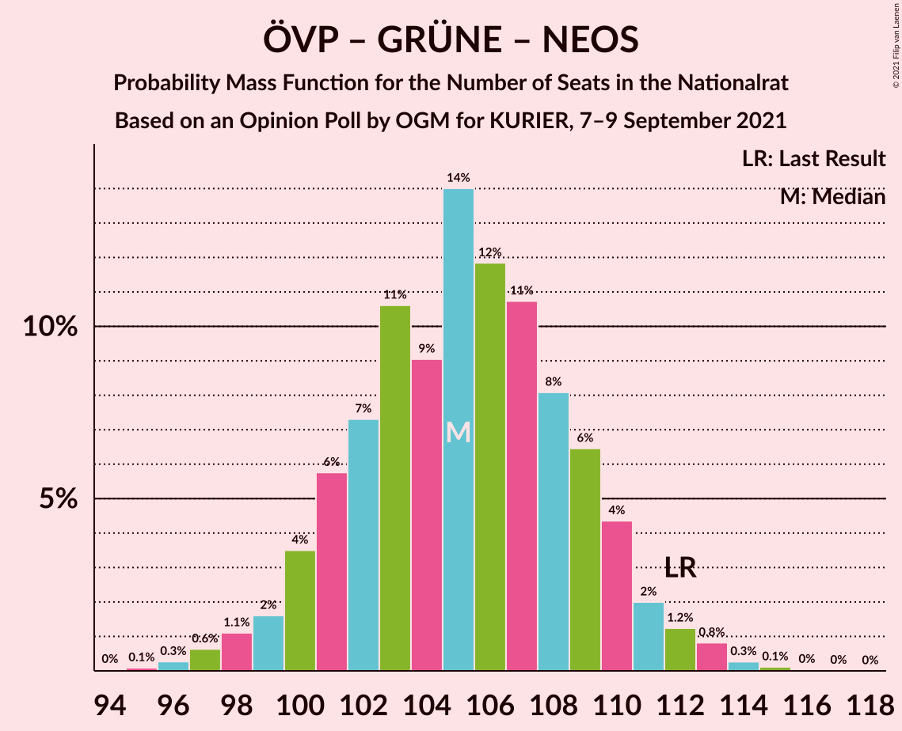

# Opinion Poll by OGM for KURIER, 7–9 September 2021

<a href="#voting-intentions">Voting Intentions</a> | <a href="#seats">Seats</a> | <a href="#coalitions">Coalitions</a> | <a href="#technical-information">Technical Information</a>

## Voting Intentions

### Confidence Intervals

| Party | Last Result | Poll Result | 80% Confidence Interval | 90% Confidence Interval | 95% Confidence Interval | 99% Confidence Interval |
|:-----:|:-----------:|:-----------:|:-----------------------:|:-----------------------:|:-----------------------:|:-----------------------:|
| Österreichische Volkspartei | 37.5% | 34.0% | 31.9–36.2% |31.3–36.8% |30.8–37.3% |29.8–38.4% |
| Sozialdemokratische Partei Österreichs | 21.2% | 24.0% | 22.1–26.0% |21.6–26.6% |21.2–27.1% |20.3–28.1% |
| Freiheitliche Partei Österreichs | 16.2% | 18.0% | 16.4–19.9% |15.9–20.4% |15.5–20.9% |14.8–21.8% |
| Die Grünen–Die Grüne Alternative | 13.9% | 11.9% | 10.6–13.5% |10.2–14.0% |9.9–14.4% |9.3–15.2% |
| NEOS–Das Neue Österreich und Liberales Forum | 8.1% | 10.9% | 9.6–12.5% |9.3–12.9% |9.0–13.3% |8.4–14.1% |

*Note:* The poll result column reflects the actual value used in the calculations. Published results may vary slightly, and in addition be rounded to fewer digits.

## Seats

### Confidence Intervals

| Party | Last Result | Median | 80% Confidence Interval | 90% Confidence Interval | 95% Confidence Interval | 99% Confidence Interval |
|:-----:|:-----------:|:------:|:-----------------------:|:-----------------------:|:-----------------------:|:-----------------------:|
| <a href="#österreichische-volkspartei">Österreichische Volkspartei</a> | 71 | 63 | 59–67 |58–68 |57–69 |55–71 |
| <a href="#sozialdemokratische-partei-österreichs">Sozialdemokratische Partei Österreichs</a> | 40 | 44 | 41–48 |40–49 |39–50 |37–52 |
| <a href="#freiheitliche-partei-österreichs">Freiheitliche Partei Österreichs</a> | 31 | 33 | 30–37 |29–38 |29–38 |27–40 |
| <a href="#die-grünen–die-grüne-alternative">Die Grünen–Die Grüne Alternative</a> | 26 | 22 | 19–25 |19–26 |18–26 |17–28 |
| <a href="#neos–das-neue-österreich-und-liberales-forum">NEOS–Das Neue Österreich und Liberales Forum</a> | 15 | 20 | 18–23 |17–24 |16–24 |15–26 |

### Österreichische Volkspartei

*For a full overview of the results for this party, see the [Österreichische Volkspartei](party-österreichischevolkspartei.html) page.*

| Number of Seats | Probability | Accumulated | Special Marks |
|:---------------:|:-----------:|:-----------:|:-------------:|
| 53 | 0.1% | 100% |  |
| 54 | 0.2% | 99.9% |  |
| 55 | 0.4% | 99.7% |  |
| 56 | 1.1% | 99.3% |  |
| 57 | 2% | 98% |  |
| 58 | 4% | 97% |  |
| 59 | 5% | 93% |  |
| 60 | 8% | 88% |  |
| 61 | 9% | 79% |  |
| 62 | 13% | 70% |  |
| 63 | 11% | 57% | Median |
| 64 | 14% | 45% |  |
| 65 | 10% | 31% |  |
| 66 | 9% | 21% |  |
| 67 | 4% | 12% |  |
| 68 | 4% | 8% |  |
| 69 | 2% | 4% |  |
| 70 | 1.1% | 2% |  |
| 71 | 0.5% | 0.9% | Last Result |
| 72 | 0.2% | 0.4% |  |
| 73 | 0.1% | 0.1% |  |
| 74 | 0% | 0.1% |  |
| 75 | 0% | 0% |  |

### Sozialdemokratische Partei Österreichs

*For a full overview of the results for this party, see the [Sozialdemokratische Partei Österreichs](party-sozialdemokratischeparteiösterreichs.html) page.*

| Number of Seats | Probability | Accumulated | Special Marks |
|:---------------:|:-----------:|:-----------:|:-------------:|
| 36 | 0.1% | 100% |  |
| 37 | 0.4% | 99.9% |  |
| 38 | 0.9% | 99.4% |  |
| 39 | 2% | 98.5% |  |
| 40 | 4% | 96% | Last Result |
| 41 | 7% | 92% |  |
| 42 | 10% | 86% |  |
| 43 | 13% | 75% |  |
| 44 | 15% | 62% | Median |
| 45 | 12% | 47% |  |
| 46 | 13% | 36% |  |
| 47 | 9% | 23% |  |
| 48 | 6% | 14% |  |
| 49 | 4% | 8% |  |
| 50 | 2% | 4% |  |
| 51 | 1.2% | 2% |  |
| 52 | 0.4% | 0.8% |  |
| 53 | 0.2% | 0.3% |  |
| 54 | 0.1% | 0.1% |  |
| 55 | 0% | 0% |  |

### Freiheitliche Partei Österreichs

*For a full overview of the results for this party, see the [Freiheitliche Partei Österreichs](party-freiheitlicheparteiösterreichs.html) page.*

| Number of Seats | Probability | Accumulated | Special Marks |
|:---------------:|:-----------:|:-----------:|:-------------:|
| 26 | 0.2% | 100% |  |
| 27 | 0.6% | 99.8% |  |
| 28 | 2% | 99.1% |  |
| 29 | 3% | 98% |  |
| 30 | 7% | 94% |  |
| 31 | 10% | 87% | Last Result |
| 32 | 12% | 77% |  |
| 33 | 16% | 65% | Median |
| 34 | 16% | 48% |  |
| 35 | 13% | 32% |  |
| 36 | 9% | 19% |  |
| 37 | 5% | 10% |  |
| 38 | 3% | 5% |  |
| 39 | 1.4% | 2% |  |
| 40 | 0.7% | 1.0% |  |
| 41 | 0.2% | 0.3% |  |
| 42 | 0.1% | 0.1% |  |
| 43 | 0% | 0% |  |

### Die Grünen–Die Grüne Alternative

*For a full overview of the results for this party, see the [Die Grünen–Die Grüne Alternative](party-diegrünen–diegrünealternative.html) page.*

| Number of Seats | Probability | Accumulated | Special Marks |
|:---------------:|:-----------:|:-----------:|:-------------:|
| 15 | 0% | 100% |  |
| 16 | 0.3% | 99.9% |  |
| 17 | 1.2% | 99.7% |  |
| 18 | 3% | 98.5% |  |
| 19 | 7% | 95% |  |
| 20 | 11% | 88% |  |
| 21 | 18% | 77% |  |
| 22 | 20% | 59% | Median |
| 23 | 15% | 38% |  |
| 24 | 11% | 23% |  |
| 25 | 6% | 11% |  |
| 26 | 3% | 5% | Last Result |
| 27 | 2% | 2% |  |
| 28 | 0.5% | 0.7% |  |
| 29 | 0.2% | 0.2% |  |
| 30 | 0% | 0.1% |  |
| 31 | 0% | 0% |  |

### NEOS–Das Neue Österreich und Liberales Forum

*For a full overview of the results for this party, see the [NEOS–Das Neue Österreich und Liberales Forum](party-neos–dasneueösterreichundliberalesforum.html) page.*

| Number of Seats | Probability | Accumulated | Special Marks |
|:---------------:|:-----------:|:-----------:|:-------------:|
| 14 | 0.1% | 100% |  |
| 15 | 0.7% | 99.9% | Last Result |
| 16 | 2% | 99.1% |  |
| 17 | 6% | 97% |  |
| 18 | 13% | 91% |  |
| 19 | 15% | 78% |  |
| 20 | 21% | 62% | Median |
| 21 | 16% | 41% |  |
| 22 | 13% | 25% |  |
| 23 | 7% | 13% |  |
| 24 | 4% | 6% |  |
| 25 | 1.4% | 2% |  |
| 26 | 0.5% | 0.7% |  |
| 27 | 0.2% | 0.2% |  |
| 28 | 0% | 0% |  |

## Coalitions

### Confidence Intervals

| Coalition | Last Result | Median | Majority? | 80% Confidence Interval | 90% Confidence Interval | 95% Confidence Interval | 99% Confidence Interval |
|:---------:|:-----------:|:------:|:---------:|:-----------------------:|:-----------------------:|:-----------------------:|:-----------------------:|
| Österreichische Volkspartei – Sozialdemokratische Partei Österreichs | 111 | 108 | 100% | 103–111 | 102–113 | 101–114 | 99–116 |
| Österreichische Volkspartei – Die Grünen–Die Grüne Alternative – NEOS–Das Neue Österreich und Liberales Forum | 112 | 105 | 100% | 101–109 | 100–110 | 99–112 | 97–113 |
| Österreichische Volkspartei – Freiheitliche Partei Österreichs | 102 | 97 | 93% | 92–101 | 91–102 | 90–103 | 88–105 |
| Sozialdemokratische Partei Österreichs – Die Grünen–Die Grüne Alternative – NEOS–Das Neue Österreich und Liberales Forum | 81 | 86 | 7% | 82–91 | 81–92 | 80–93 | 78–95 |
| Österreichische Volkspartei – Die Grünen–Die Grüne Alternative | 97 | 85 | 2% | 81–89 | 80–90 | 79–91 | 77–94 |
| Österreichische Volkspartei – NEOS–Das Neue Österreich und Liberales Forum | 86 | 83 | 0.6% | 79–87 | 78–88 | 77–90 | 75–92 |
| Sozialdemokratische Partei Österreichs – Freiheitliche Partei Österreichs | 71 | 78 | 0% | 74–82 | 73–83 | 71–84 | 70–86 |
| Sozialdemokratische Partei Österreichs – Die Grünen–Die Grüne Alternative | 66 | 66 | 0% | 63–70 | 61–72 | 60–73 | 59–75 |
| Österreichische Volkspartei | 71 | 63 | 0% | 59–67 | 58–68 | 57–69 | 55–71 |
| Sozialdemokratische Partei Österreichs | 40 | 44 | 0% | 41–48 | 40–49 | 39–50 | 37–52 |

### Österreichische Volkspartei – Sozialdemokratische Partei Österreichs

| Number of Seats | Probability | Accumulated | Special Marks |
|:---------------:|:-----------:|:-----------:|:-------------:|
| 97 | 0.1% | 100% |  |
| 98 | 0.2% | 99.9% |  |
| 99 | 0.4% | 99.7% |  |
| 100 | 1.0% | 99.3% |  |
| 101 | 2% | 98% |  |
| 102 | 2% | 97% |  |
| 103 | 5% | 94% |  |
| 104 | 6% | 89% |  |
| 105 | 9% | 84% |  |
| 106 | 12% | 74% |  |
| 107 | 13% | 63% | Median |
| 108 | 14% | 50% |  |
| 109 | 9% | 36% |  |
| 110 | 9% | 26% |  |
| 111 | 8% | 18% | Last Result |
| 112 | 4% | 10% |  |
| 113 | 3% | 6% |  |
| 114 | 2% | 3% |  |
| 115 | 0.8% | 2% |  |
| 116 | 0.5% | 0.7% |  |
| 117 | 0.2% | 0.2% |  |
| 118 | 0.1% | 0.1% |  |
| 119 | 0% | 0% |  |

### Österreichische Volkspartei – Die Grünen–Die Grüne Alternative – NEOS–Das Neue Österreich und Liberales Forum

| Number of Seats | Probability | Accumulated | Special Marks |
|:---------------:|:-----------:|:-----------:|:-------------:|
| 94 | 0% | 100% |  |
| 95 | 0.1% | 99.9% |  |
| 96 | 0.3% | 99.8% |  |
| 97 | 0.6% | 99.6% |  |
| 98 | 1.1% | 98.9% |  |
| 99 | 2% | 98% |  |
| 100 | 4% | 96% |  |
| 101 | 6% | 93% |  |
| 102 | 7% | 87% |  |
| 103 | 11% | 80% |  |
| 104 | 9% | 69% |  |
| 105 | 14% | 60% | Median |
| 106 | 12% | 46% |  |
| 107 | 11% | 34% |  |
| 108 | 8% | 23% |  |
| 109 | 6% | 15% |  |
| 110 | 4% | 9% |  |
| 111 | 2% | 5% |  |
| 112 | 1.2% | 3% | Last Result |
| 113 | 0.8% | 1.3% |  |
| 114 | 0.3% | 0.4% |  |
| 115 | 0.1% | 0.2% |  |
| 116 | 0% | 0.1% |  |
| 117 | 0% | 0% |  |

### Österreichische Volkspartei – Freiheitliche Partei Österreichs

| Number of Seats | Probability | Accumulated | Special Marks |
|:---------------:|:-----------:|:-----------:|:-------------:|
| 86 | 0.1% | 100% |  |
| 87 | 0.2% | 99.9% |  |
| 88 | 0.5% | 99.6% |  |
| 89 | 1.1% | 99.1% |  |
| 90 | 2% | 98% |  |
| 91 | 3% | 96% |  |
| 92 | 6% | 93% | Majority |
| 93 | 6% | 88% |  |
| 94 | 9% | 82% |  |
| 95 | 12% | 73% |  |
| 96 | 10% | 61% | Median |
| 97 | 13% | 51% |  |
| 98 | 12% | 37% |  |
| 99 | 9% | 26% |  |
| 100 | 6% | 17% |  |
| 101 | 4% | 10% |  |
| 102 | 3% | 6% | Last Result |
| 103 | 2% | 3% |  |
| 104 | 0.8% | 1.4% |  |
| 105 | 0.4% | 0.6% |  |
| 106 | 0.1% | 0.2% |  |
| 107 | 0.1% | 0.1% |  |
| 108 | 0% | 0% |  |

### Sozialdemokratische Partei Österreichs – Die Grünen–Die Grüne Alternative – NEOS–Das Neue Österreich und Liberales Forum

| Number of Seats | Probability | Accumulated | Special Marks |
|:---------------:|:-----------:|:-----------:|:-------------:|
| 76 | 0.1% | 100% |  |
| 77 | 0.1% | 99.9% |  |
| 78 | 0.4% | 99.8% |  |
| 79 | 0.8% | 99.4% |  |
| 80 | 2% | 98.6% |  |
| 81 | 3% | 97% | Last Result |
| 82 | 4% | 94% |  |
| 83 | 6% | 90% |  |
| 84 | 9% | 83% |  |
| 85 | 12% | 74% |  |
| 86 | 13% | 63% | Median |
| 87 | 10% | 49% |  |
| 88 | 12% | 39% |  |
| 89 | 9% | 27% |  |
| 90 | 6% | 18% |  |
| 91 | 6% | 12% |  |
| 92 | 3% | 7% | Majority |
| 93 | 2% | 4% |  |
| 94 | 1.1% | 2% |  |
| 95 | 0.5% | 0.9% |  |
| 96 | 0.2% | 0.4% |  |
| 97 | 0.1% | 0.1% |  |
| 98 | 0% | 0% |  |

### Österreichische Volkspartei – Die Grünen–Die Grüne Alternative

| Number of Seats | Probability | Accumulated | Special Marks |
|:---------------:|:-----------:|:-----------:|:-------------:|
| 74 | 0% | 100% |  |
| 75 | 0.1% | 99.9% |  |
| 76 | 0.3% | 99.8% |  |
| 77 | 0.6% | 99.5% |  |
| 78 | 1.2% | 98.9% |  |
| 79 | 2% | 98% |  |
| 80 | 4% | 95% |  |
| 81 | 5% | 92% |  |
| 82 | 8% | 86% |  |
| 83 | 10% | 78% |  |
| 84 | 11% | 68% |  |
| 85 | 12% | 58% | Median |
| 86 | 13% | 45% |  |
| 87 | 10% | 32% |  |
| 88 | 8% | 22% |  |
| 89 | 6% | 14% |  |
| 90 | 4% | 9% |  |
| 91 | 2% | 5% |  |
| 92 | 1.2% | 2% | Majority |
| 93 | 0.8% | 1.3% |  |
| 94 | 0.3% | 0.5% |  |
| 95 | 0.1% | 0.2% |  |
| 96 | 0% | 0.1% |  |
| 97 | 0% | 0% | Last Result |

### Österreichische Volkspartei – NEOS–Das Neue Österreich und Liberales Forum

| Number of Seats | Probability | Accumulated | Special Marks |
|:---------------:|:-----------:|:-----------:|:-------------:|
| 72 | 0% | 100% |  |
| 73 | 0.1% | 99.9% |  |
| 74 | 0.2% | 99.9% |  |
| 75 | 0.5% | 99.6% |  |
| 76 | 1.2% | 99.2% |  |
| 77 | 2% | 98% |  |
| 78 | 3% | 96% |  |
| 79 | 6% | 93% |  |
| 80 | 8% | 87% |  |
| 81 | 9% | 80% |  |
| 82 | 10% | 70% |  |
| 83 | 13% | 60% | Median |
| 84 | 15% | 47% |  |
| 85 | 10% | 32% |  |
| 86 | 6% | 22% | Last Result |
| 87 | 7% | 16% |  |
| 88 | 4% | 9% |  |
| 89 | 2% | 5% |  |
| 90 | 2% | 3% |  |
| 91 | 0.8% | 1.4% |  |
| 92 | 0.3% | 0.6% | Majority |
| 93 | 0.1% | 0.2% |  |
| 94 | 0.1% | 0.1% |  |
| 95 | 0% | 0% |  |

### Sozialdemokratische Partei Österreichs – Freiheitliche Partei Österreichs

| Number of Seats | Probability | Accumulated | Special Marks |
|:---------------:|:-----------:|:-----------:|:-------------:|
| 67 | 0% | 100% |  |
| 68 | 0.1% | 99.9% |  |
| 69 | 0.3% | 99.8% |  |
| 70 | 0.8% | 99.6% |  |
| 71 | 1.2% | 98.7% | Last Result |
| 72 | 2% | 97% |  |
| 73 | 4% | 95% |  |
| 74 | 6% | 91% |  |
| 75 | 8% | 85% |  |
| 76 | 11% | 77% |  |
| 77 | 12% | 66% | Median |
| 78 | 14% | 54% |  |
| 79 | 9% | 40% |  |
| 80 | 11% | 31% |  |
| 81 | 7% | 20% |  |
| 82 | 6% | 13% |  |
| 83 | 4% | 7% |  |
| 84 | 2% | 4% |  |
| 85 | 1.1% | 2% |  |
| 86 | 0.6% | 1.1% |  |
| 87 | 0.3% | 0.4% |  |
| 88 | 0.1% | 0.2% |  |
| 89 | 0% | 0.1% |  |
| 90 | 0% | 0% |  |

### Sozialdemokratische Partei Österreichs – Die Grünen–Die Grüne Alternative

| Number of Seats | Probability | Accumulated | Special Marks |
|:---------------:|:-----------:|:-----------:|:-------------:|
| 56 | 0.1% | 100% |  |
| 57 | 0.1% | 99.9% |  |
| 58 | 0.3% | 99.8% |  |
| 59 | 0.8% | 99.5% |  |
| 60 | 2% | 98.7% |  |
| 61 | 2% | 97% |  |
| 62 | 5% | 95% |  |
| 63 | 8% | 90% |  |
| 64 | 9% | 82% |  |
| 65 | 12% | 73% |  |
| 66 | 12% | 61% | Last Result, Median |
| 67 | 13% | 49% |  |
| 68 | 12% | 36% |  |
| 69 | 7% | 24% |  |
| 70 | 7% | 17% |  |
| 71 | 4% | 10% |  |
| 72 | 3% | 6% |  |
| 73 | 2% | 3% |  |
| 74 | 0.6% | 1.3% |  |
| 75 | 0.4% | 0.7% |  |
| 76 | 0.1% | 0.2% |  |
| 77 | 0.1% | 0.1% |  |
| 78 | 0% | 0% |  |

### Österreichische Volkspartei

| Number of Seats | Probability | Accumulated | Special Marks |
|:---------------:|:-----------:|:-----------:|:-------------:|
| 53 | 0.1% | 100% |  |
| 54 | 0.2% | 99.9% |  |
| 55 | 0.4% | 99.7% |  |
| 56 | 1.1% | 99.3% |  |
| 57 | 2% | 98% |  |
| 58 | 4% | 97% |  |
| 59 | 5% | 93% |  |
| 60 | 8% | 88% |  |
| 61 | 9% | 79% |  |
| 62 | 13% | 70% |  |
| 63 | 11% | 57% | Median |
| 64 | 14% | 45% |  |
| 65 | 10% | 31% |  |
| 66 | 9% | 21% |  |
| 67 | 4% | 12% |  |
| 68 | 4% | 8% |  |
| 69 | 2% | 4% |  |
| 70 | 1.1% | 2% |  |
| 71 | 0.5% | 0.9% | Last Result |
| 72 | 0.2% | 0.4% |  |
| 73 | 0.1% | 0.1% |  |
| 74 | 0% | 0.1% |  |
| 75 | 0% | 0% |  |

### Sozialdemokratische Partei Österreichs

| Number of Seats | Probability | Accumulated | Special Marks |
|:---------------:|:-----------:|:-----------:|:-------------:|
| 36 | 0.1% | 100% |  |
| 37 | 0.4% | 99.9% |  |
| 38 | 0.9% | 99.4% |  |
| 39 | 2% | 98.5% |  |
| 40 | 4% | 96% | Last Result |
| 41 | 7% | 92% |  |
| 42 | 10% | 86% |  |
| 43 | 13% | 75% |  |
| 44 | 15% | 62% | Median |
| 45 | 12% | 47% |  |
| 46 | 13% | 36% |  |
| 47 | 9% | 23% |  |
| 48 | 6% | 14% |  |
| 49 | 4% | 8% |  |
| 50 | 2% | 4% |  |
| 51 | 1.2% | 2% |  |
| 52 | 0.4% | 0.8% |  |
| 53 | 0.2% | 0.3% |  |
| 54 | 0.1% | 0.1% |  |
| 55 | 0% | 0% |  |

## Technical Information

### Opinion Poll

+ **Polling firm:** OGM
+ **Commissioner(s):** KURIER
+ **Fieldwork period:** 7–9 September 2021

### Calculations

+ **Sample size:** 804
+ **Simulations done:** 131,072
+ **Error estimate:** 0.24%

