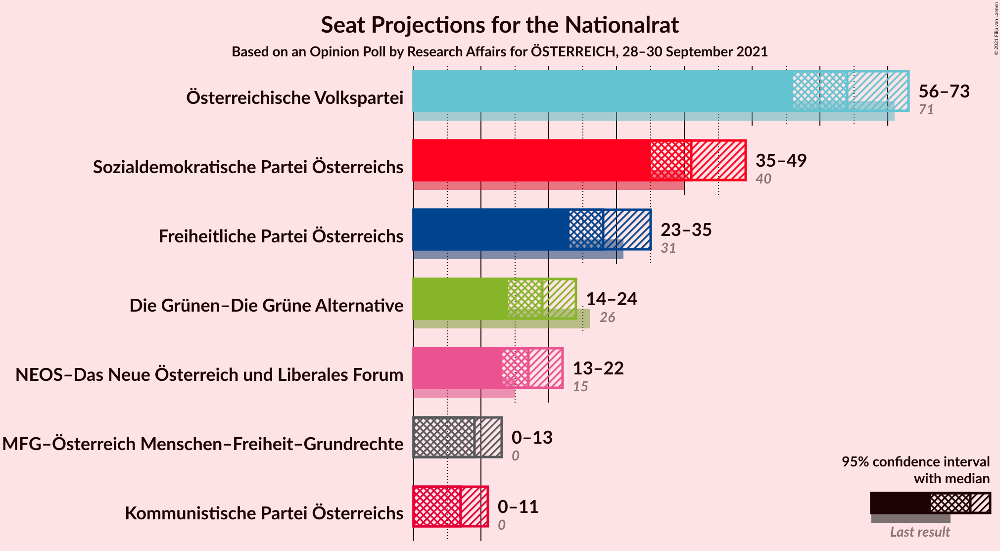
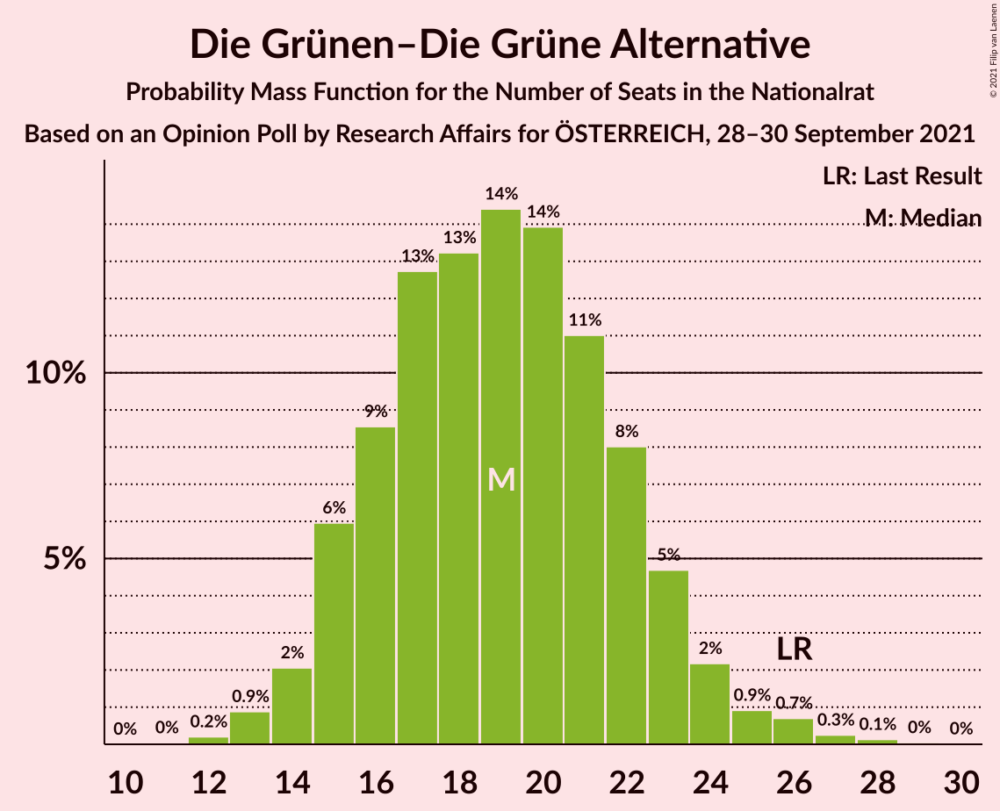
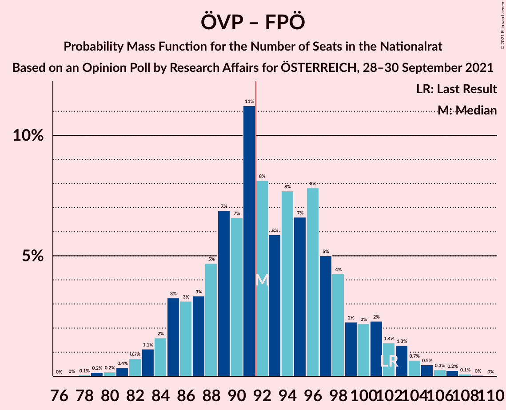

# Opinion Poll by Research Affairs for ÖSTERREICH, 28–30 September 2021

<a href="#voting-intentions">Voting Intentions</a> | <a href="#seats">Seats</a> | <a href="#coalitions">Coalitions</a> | <a href="#technical-information">Technical Information</a>

## Voting Intentions

### Confidence Intervals

| Party | Last Result | Poll Result | 80% Confidence Interval | 90% Confidence Interval | 95% Confidence Interval | 99% Confidence Interval |
|:-----:|:-----------:|:-----------:|:-----------------------:|:-----------------------:|:-----------------------:|:-----------------------:|
| Österreichische Volkspartei | 37.5% | 34.0% | 31.4–36.8% |30.6–37.6% |30.0–38.2% |28.8–39.6% |
| Sozialdemokratische Partei Österreichs | 21.2% | 21.9% | 19.7–24.4% |19.1–25.1% |18.5–25.8% |17.5–27.0% |
| Freiheitliche Partei Österreichs | 16.2% | 15.0% | 13.1–17.2% |12.6–17.9% |12.2–18.4% |11.3–19.5% |
| Die Grünen–Die Grüne Alternative | 13.9% | 10.1% | 8.5–12.0% |8.1–12.5% |7.7–13.0% |7.1–14.0% |
| NEOS–Das Neue Österreich und Liberales Forum | 8.1% | 9.1% | 7.6–10.9% |7.2–11.5% |6.9–11.9% |6.2–12.9% |
| MFG–Österreich Menschen–Freiheit–Grundrechte | 0.0% | 4.9% | 3.9–6.4% |3.6–6.8% |3.4–7.2% |2.9–8.0% |
| Kommunistische Partei Österreichs | 0.7% | 4.0% | 3.0–5.3% |2.8–5.7% |2.6–6.0% |2.2–6.8% |

*Note:* The poll result column reflects the actual value used in the calculations. Published results may vary slightly, and in addition be rounded to fewer digits.

## Seats

### Confidence Intervals

| Party | Last Result | Median | 80% Confidence Interval | 90% Confidence Interval | 95% Confidence Interval | 99% Confidence Interval |
|:-----:|:-----------:|:------:|:-----------------------:|:-----------------------:|:-----------------------:|:-----------------------:|
| <a href="#österreichische-volkspartei">Österreichische Volkspartei</a> | 71 | 65 | 59–69 |57–71 |56–73 |53–76 |
| <a href="#sozialdemokratische-partei-österreichs">Sozialdemokratische Partei Österreichs</a> | 40 | 42 | 36–46 |36–48 |35–49 |33–52 |
| <a href="#freiheitliche-partei-österreichs">Freiheitliche Partei Österreichs</a> | 31 | 28 | 25–32 |23–34 |23–34 |21–37 |
| <a href="#die-grünen–die-grüne-alternative">Die Grünen–Die Grüne Alternative</a> | 26 | 19 | 15–22 |15–24 |14–24 |13–27 |
| <a href="#neos–das-neue-österreich-und-liberales-forum">NEOS–Das Neue Österreich und Liberales Forum</a> | 15 | 17 | 14–20 |13–21 |13–23 |11–24 |
| <a href="#mfg–österreich-menschen–freiheit–grundrechte">MFG–Österreich Menschen–Freiheit–Grundrechte</a> | 0 | 9 | 0–11 |0–12 |0–14 |0–14 |
| <a href="#kommunistische-partei-österreichs">Kommunistische Partei Österreichs</a> | 0 | 0 | 0–9 |0–10 |0–11 |0–12 |

### Österreichische Volkspartei

*For a full overview of the results for this party, see the [Österreichische Volkspartei](party-österreichischevolkspartei.html) page.*

| Number of Seats | Probability | Accumulated | Special Marks |
|:---------------:|:-----------:|:-----------:|:-------------:|
| 51 | 0.1% | 100% |  |
| 52 | 0.2% | 99.9% |  |
| 53 | 0.5% | 99.7% |  |
| 54 | 0.2% | 99.2% |  |
| 55 | 0.5% | 98.9% |  |
| 56 | 2% | 98% |  |
| 57 | 3% | 97% |  |
| 58 | 3% | 94% |  |
| 59 | 4% | 91% |  |
| 60 | 5% | 87% |  |
| 61 | 4% | 82% |  |
| 62 | 12% | 78% |  |
| 63 | 7% | 66% |  |
| 64 | 6% | 60% |  |
| 65 | 11% | 54% | Median |
| 66 | 14% | 43% |  |
| 67 | 6% | 29% |  |
| 68 | 10% | 23% |  |
| 69 | 4% | 13% |  |
| 70 | 2% | 9% |  |
| 71 | 3% | 7% | Last Result |
| 72 | 0.7% | 4% |  |
| 73 | 2% | 4% |  |
| 74 | 0.7% | 2% |  |
| 75 | 0.9% | 1.4% |  |
| 76 | 0.1% | 0.6% |  |
| 77 | 0.2% | 0.5% |  |
| 78 | 0.2% | 0.3% |  |
| 79 | 0% | 0.1% |  |
| 80 | 0.1% | 0.1% |  |
| 81 | 0% | 0% |  |

### Sozialdemokratische Partei Österreichs

*For a full overview of the results for this party, see the [Sozialdemokratische Partei Österreichs](party-sozialdemokratischeparteiösterreichs.html) page.*

| Number of Seats | Probability | Accumulated | Special Marks |
|:---------------:|:-----------:|:-----------:|:-------------:|
| 30 | 0% | 100% |  |
| 31 | 0.1% | 99.9% |  |
| 32 | 0.2% | 99.8% |  |
| 33 | 1.0% | 99.6% |  |
| 34 | 0.9% | 98.7% |  |
| 35 | 2% | 98% |  |
| 36 | 6% | 95% |  |
| 37 | 5% | 89% |  |
| 38 | 5% | 84% |  |
| 39 | 4% | 78% |  |
| 40 | 13% | 74% | Last Result |
| 41 | 6% | 61% |  |
| 42 | 14% | 55% | Median |
| 43 | 9% | 41% |  |
| 44 | 10% | 32% |  |
| 45 | 10% | 22% |  |
| 46 | 3% | 11% |  |
| 47 | 2% | 8% |  |
| 48 | 3% | 6% |  |
| 49 | 1.0% | 3% |  |
| 50 | 1.0% | 2% |  |
| 51 | 0.2% | 0.8% |  |
| 52 | 0.4% | 0.6% |  |
| 53 | 0.1% | 0.2% |  |
| 54 | 0% | 0.1% |  |
| 55 | 0.1% | 0.1% |  |
| 56 | 0% | 0% |  |

### Freiheitliche Partei Österreichs

*For a full overview of the results for this party, see the [Freiheitliche Partei Österreichs](party-freiheitlicheparteiösterreichs.html) page.*

| Number of Seats | Probability | Accumulated | Special Marks |
|:---------------:|:-----------:|:-----------:|:-------------:|
| 19 | 0.1% | 100% |  |
| 20 | 0.2% | 99.9% |  |
| 21 | 0.5% | 99.7% |  |
| 22 | 1.3% | 99.2% |  |
| 23 | 4% | 98% |  |
| 24 | 4% | 94% |  |
| 25 | 6% | 90% |  |
| 26 | 18% | 84% |  |
| 27 | 9% | 67% |  |
| 28 | 10% | 58% | Median |
| 29 | 17% | 48% |  |
| 30 | 10% | 30% |  |
| 31 | 5% | 20% | Last Result |
| 32 | 6% | 15% |  |
| 33 | 3% | 9% |  |
| 34 | 4% | 6% |  |
| 35 | 1.0% | 2% |  |
| 36 | 0.5% | 1.2% |  |
| 37 | 0.5% | 0.7% |  |
| 38 | 0.1% | 0.3% |  |
| 39 | 0.1% | 0.2% |  |
| 40 | 0.1% | 0.1% |  |
| 41 | 0% | 0% |  |

### Die Grünen–Die Grüne Alternative

*For a full overview of the results for this party, see the [Die Grünen–Die Grüne Alternative](party-diegrünen–diegrünealternative.html) page.*

| Number of Seats | Probability | Accumulated | Special Marks |
|:---------------:|:-----------:|:-----------:|:-------------:|
| 11 | 0.1% | 100% |  |
| 12 | 0.3% | 99.9% |  |
| 13 | 0.3% | 99.7% |  |
| 14 | 3% | 99.4% |  |
| 15 | 7% | 96% |  |
| 16 | 3% | 89% |  |
| 17 | 14% | 86% |  |
| 18 | 18% | 72% |  |
| 19 | 12% | 55% | Median |
| 20 | 14% | 42% |  |
| 21 | 15% | 28% |  |
| 22 | 5% | 13% |  |
| 23 | 3% | 8% |  |
| 24 | 3% | 5% |  |
| 25 | 0.9% | 2% |  |
| 26 | 0.4% | 1.0% | Last Result |
| 27 | 0.3% | 0.5% |  |
| 28 | 0.2% | 0.2% |  |
| 29 | 0% | 0% |  |

### NEOS–Das Neue Österreich und Liberales Forum

*For a full overview of the results for this party, see the [NEOS–Das Neue Österreich und Liberales Forum](party-neos–dasneueösterreichundliberalesforum.html) page.*

| Number of Seats | Probability | Accumulated | Special Marks |
|:---------------:|:-----------:|:-----------:|:-------------:|
| 10 | 0.1% | 100% |  |
| 11 | 0.6% | 99.9% |  |
| 12 | 1.5% | 99.3% |  |
| 13 | 3% | 98% |  |
| 14 | 11% | 95% |  |
| 15 | 14% | 84% | Last Result |
| 16 | 10% | 70% |  |
| 17 | 21% | 61% | Median |
| 18 | 7% | 40% |  |
| 19 | 11% | 33% |  |
| 20 | 12% | 21% |  |
| 21 | 6% | 10% |  |
| 22 | 1.3% | 4% |  |
| 23 | 2% | 3% |  |
| 24 | 0.3% | 0.6% |  |
| 25 | 0.2% | 0.3% |  |
| 26 | 0.1% | 0.1% |  |
| 27 | 0% | 0% |  |

### MFG–Österreich Menschen–Freiheit–Grundrechte

*For a full overview of the results for this party, see the [MFG–Österreich Menschen–Freiheit–Grundrechte](party-mfg–österreichmenschen–freiheit–grundrechte.html) page.*

| Number of Seats | Probability | Accumulated | Special Marks |
|:---------------:|:-----------:|:-----------:|:-------------:|
| 0 | 11% | 100% | Last Result |
| 1 | 0% | 89% |  |
| 2 | 0% | 89% |  |
| 3 | 0% | 89% |  |
| 4 | 0% | 89% |  |
| 5 | 0% | 89% |  |
| 6 | 0% | 89% |  |
| 7 | 1.2% | 89% |  |
| 8 | 28% | 88% |  |
| 9 | 27% | 59% | Median |
| 10 | 8% | 32% |  |
| 11 | 15% | 25% |  |
| 12 | 6% | 10% |  |
| 13 | 1.2% | 4% |  |
| 14 | 2% | 3% |  |
| 15 | 0.2% | 0.4% |  |
| 16 | 0.1% | 0.2% |  |
| 17 | 0.1% | 0.1% |  |
| 18 | 0% | 0% |  |

### Kommunistische Partei Österreichs

*For a full overview of the results for this party, see the [Kommunistische Partei Österreichs](party-kommunistischeparteiösterreichs.html) page.*

| Number of Seats | Probability | Accumulated | Special Marks |
|:---------------:|:-----------:|:-----------:|:-------------:|
| 0 | 51% | 100% | Last Result, Median |
| 1 | 0% | 49% |  |
| 2 | 0% | 49% |  |
| 3 | 0% | 49% |  |
| 4 | 0% | 49% |  |
| 5 | 0% | 49% |  |
| 6 | 0% | 49% |  |
| 7 | 13% | 49% |  |
| 8 | 12% | 36% |  |
| 9 | 14% | 24% |  |
| 10 | 5% | 9% |  |
| 11 | 3% | 4% |  |
| 12 | 1.2% | 2% |  |
| 13 | 0.2% | 0.3% |  |
| 14 | 0% | 0.1% |  |
| 15 | 0% | 0% |  |

## Coalitions

### Confidence Intervals

| Coalition | Last Result | Median | Majority? | 80% Confidence Interval | 90% Confidence Interval | 95% Confidence Interval | 99% Confidence Interval |
|:---------:|:-----------:|:------:|:---------:|:-----------------------:|:-----------------------:|:-----------------------:|:-----------------------:|
| Österreichische Volkspartei – Sozialdemokratische Partei Österreichs | 111 | 107 | 99.9% | 99–113 | 98–114 | 96–117 | 93–120 |
| Österreichische Volkspartei – Die Grünen–Die Grüne Alternative – NEOS–Das Neue Österreich und Liberales Forum | 112 | 100 | 95% | 94–107 | 91–108 | 91–111 | 89–114 |
| Österreichische Volkspartei – Freiheitliche Partei Österreichs | 102 | 93 | 66% | 87–99 | 85–101 | 83–103 | 81–106 |
| Österreichische Volkspartei – Die Grünen–Die Grüne Alternative | 97 | 83 | 5% | 77–89 | 75–91 | 74–93 | 72–96 |
| Österreichische Volkspartei – NEOS–Das Neue Österreich und Liberales Forum | 86 | 82 | 2% | 75–87 | 74–89 | 72–91 | 70–94 |
| Sozialdemokratische Partei Österreichs – Die Grünen–Die Grüne Alternative – NEOS–Das Neue Österreich und Liberales Forum | 81 | 78 | 0.2% | 71–84 | 70–85 | 69–86 | 67–91 |
| Sozialdemokratische Partei Österreichs – Freiheitliche Partei Österreichs | 71 | 70 | 0% | 65–75 | 63–77 | 62–80 | 59–80 |
| Österreichische Volkspartei | 71 | 65 | 0% | 59–69 | 57–71 | 56–73 | 53–76 |
| Sozialdemokratische Partei Österreichs – Die Grünen–Die Grüne Alternative | 66 | 61 | 0% | 54–66 | 53–67 | 52–69 | 51–72 |
| Sozialdemokratische Partei Österreichs | 40 | 42 | 0% | 36–46 | 36–48 | 35–49 | 33–52 |

### Österreichische Volkspartei – Sozialdemokratische Partei Österreichs

| Number of Seats | Probability | Accumulated | Special Marks |
|:---------------:|:-----------:|:-----------:|:-------------:|
| 90 | 0% | 100% |  |
| 91 | 0% | 99.9% |  |
| 92 | 0.1% | 99.9% | Majority |
| 93 | 0.6% | 99.8% |  |
| 94 | 0.6% | 99.2% |  |
| 95 | 0.8% | 98.7% |  |
| 96 | 0.7% | 98% |  |
| 97 | 2% | 97% |  |
| 98 | 2% | 95% |  |
| 99 | 3% | 93% |  |
| 100 | 2% | 90% |  |
| 101 | 9% | 88% |  |
| 102 | 7% | 79% |  |
| 103 | 5% | 73% |  |
| 104 | 6% | 68% |  |
| 105 | 6% | 62% |  |
| 106 | 4% | 55% |  |
| 107 | 8% | 51% | Median |
| 108 | 12% | 43% |  |
| 109 | 12% | 32% |  |
| 110 | 4% | 20% |  |
| 111 | 2% | 16% | Last Result |
| 112 | 2% | 14% |  |
| 113 | 7% | 12% |  |
| 114 | 1.2% | 5% |  |
| 115 | 0.8% | 4% |  |
| 116 | 0.5% | 3% |  |
| 117 | 0.6% | 3% |  |
| 118 | 1.1% | 2% |  |
| 119 | 0.2% | 0.8% |  |
| 120 | 0.2% | 0.5% |  |
| 121 | 0.1% | 0.3% |  |
| 122 | 0.1% | 0.2% |  |
| 123 | 0% | 0.1% |  |
| 124 | 0% | 0.1% |  |
| 125 | 0% | 0% |  |

### Österreichische Volkspartei – Die Grünen–Die Grüne Alternative – NEOS–Das Neue Österreich und Liberales Forum

| Number of Seats | Probability | Accumulated | Special Marks |
|:---------------:|:-----------:|:-----------:|:-------------:|
| 85 | 0% | 100% |  |
| 86 | 0% | 99.9% |  |
| 87 | 0.1% | 99.9% |  |
| 88 | 0.2% | 99.8% |  |
| 89 | 1.3% | 99.6% |  |
| 90 | 0.6% | 98% |  |
| 91 | 3% | 98% |  |
| 92 | 3% | 95% | Majority |
| 93 | 1.1% | 92% |  |
| 94 | 0.9% | 90% |  |
| 95 | 5% | 90% |  |
| 96 | 3% | 85% |  |
| 97 | 4% | 82% |  |
| 98 | 5% | 78% |  |
| 99 | 12% | 73% |  |
| 100 | 12% | 61% |  |
| 101 | 11% | 50% | Median |
| 102 | 2% | 39% |  |
| 103 | 13% | 37% |  |
| 104 | 1.5% | 23% |  |
| 105 | 8% | 22% |  |
| 106 | 2% | 14% |  |
| 107 | 6% | 12% |  |
| 108 | 2% | 6% |  |
| 109 | 0.7% | 4% |  |
| 110 | 0.9% | 4% |  |
| 111 | 0.9% | 3% |  |
| 112 | 0.5% | 2% | Last Result |
| 113 | 0.3% | 1.2% |  |
| 114 | 0.6% | 1.0% |  |
| 115 | 0.1% | 0.3% |  |
| 116 | 0.1% | 0.3% |  |
| 117 | 0% | 0.1% |  |
| 118 | 0.1% | 0.1% |  |
| 119 | 0% | 0% |  |

### Österreichische Volkspartei – Freiheitliche Partei Österreichs

| Number of Seats | Probability | Accumulated | Special Marks |
|:---------------:|:-----------:|:-----------:|:-------------:|
| 78 | 0.1% | 100% |  |
| 79 | 0% | 99.9% |  |
| 80 | 0.2% | 99.9% |  |
| 81 | 0.3% | 99.7% |  |
| 82 | 2% | 99.4% |  |
| 83 | 2% | 98% |  |
| 84 | 0.9% | 96% |  |
| 85 | 2% | 95% |  |
| 86 | 2% | 93% |  |
| 87 | 5% | 92% |  |
| 88 | 5% | 86% |  |
| 89 | 5% | 81% |  |
| 90 | 4% | 76% |  |
| 91 | 6% | 71% |  |
| 92 | 9% | 66% | Majority |
| 93 | 7% | 57% | Median |
| 94 | 20% | 50% |  |
| 95 | 11% | 29% |  |
| 96 | 6% | 19% |  |
| 97 | 1.3% | 12% |  |
| 98 | 0.7% | 11% |  |
| 99 | 0.9% | 10% |  |
| 100 | 4% | 9% |  |
| 101 | 1.1% | 6% |  |
| 102 | 2% | 5% | Last Result |
| 103 | 1.4% | 3% |  |
| 104 | 0.3% | 2% |  |
| 105 | 0.6% | 1.2% |  |
| 106 | 0.4% | 0.6% |  |
| 107 | 0.1% | 0.2% |  |
| 108 | 0.1% | 0.1% |  |
| 109 | 0% | 0% |  |

### Österreichische Volkspartei – Die Grünen–Die Grüne Alternative

| Number of Seats | Probability | Accumulated | Special Marks |
|:---------------:|:-----------:|:-----------:|:-------------:|
| 69 | 0% | 100% |  |
| 70 | 0.1% | 99.9% |  |
| 71 | 0.2% | 99.8% |  |
| 72 | 0.4% | 99.6% |  |
| 73 | 0.5% | 99.2% |  |
| 74 | 2% | 98.7% |  |
| 75 | 2% | 97% |  |
| 76 | 2% | 94% |  |
| 77 | 4% | 92% |  |
| 78 | 2% | 88% |  |
| 79 | 4% | 86% |  |
| 80 | 5% | 82% |  |
| 81 | 7% | 77% |  |
| 82 | 14% | 71% |  |
| 83 | 7% | 56% |  |
| 84 | 6% | 49% | Median |
| 85 | 7% | 43% |  |
| 86 | 18% | 36% |  |
| 87 | 3% | 18% |  |
| 88 | 4% | 15% |  |
| 89 | 2% | 11% |  |
| 90 | 2% | 9% |  |
| 91 | 2% | 7% |  |
| 92 | 2% | 5% | Majority |
| 93 | 0.8% | 3% |  |
| 94 | 0.4% | 2% |  |
| 95 | 0.5% | 1.3% |  |
| 96 | 0.4% | 0.8% |  |
| 97 | 0.1% | 0.4% | Last Result |
| 98 | 0.1% | 0.3% |  |
| 99 | 0.1% | 0.2% |  |
| 100 | 0% | 0% |  |

### Österreichische Volkspartei – NEOS–Das Neue Österreich und Liberales Forum

| Number of Seats | Probability | Accumulated | Special Marks |
|:---------------:|:-----------:|:-----------:|:-------------:|
| 67 | 0.1% | 100% |  |
| 68 | 0% | 99.9% |  |
| 69 | 0.2% | 99.9% |  |
| 70 | 0.9% | 99.6% |  |
| 71 | 1.1% | 98.8% |  |
| 72 | 2% | 98% |  |
| 73 | 0.5% | 96% |  |
| 74 | 2% | 96% |  |
| 75 | 4% | 93% |  |
| 76 | 2% | 89% |  |
| 77 | 6% | 88% |  |
| 78 | 5% | 81% |  |
| 79 | 9% | 76% |  |
| 80 | 13% | 68% |  |
| 81 | 4% | 55% |  |
| 82 | 9% | 51% | Median |
| 83 | 5% | 42% |  |
| 84 | 3% | 37% |  |
| 85 | 12% | 34% |  |
| 86 | 11% | 21% | Last Result |
| 87 | 3% | 11% |  |
| 88 | 2% | 8% |  |
| 89 | 1.4% | 6% |  |
| 90 | 2% | 4% |  |
| 91 | 0.8% | 3% |  |
| 92 | 1.1% | 2% | Majority |
| 93 | 0.4% | 0.9% |  |
| 94 | 0.2% | 0.5% |  |
| 95 | 0.1% | 0.4% |  |
| 96 | 0% | 0.3% |  |
| 97 | 0.1% | 0.3% |  |
| 98 | 0.1% | 0.2% |  |
| 99 | 0% | 0% |  |

### Sozialdemokratische Partei Österreichs – Die Grünen–Die Grüne Alternative – NEOS–Das Neue Österreich und Liberales Forum

| Number of Seats | Probability | Accumulated | Special Marks |
|:---------------:|:-----------:|:-----------:|:-------------:|
| 63 | 0% | 100% |  |
| 64 | 0% | 99.9% |  |
| 65 | 0.1% | 99.9% |  |
| 66 | 0.2% | 99.8% |  |
| 67 | 0.2% | 99.5% |  |
| 68 | 0.6% | 99.3% |  |
| 69 | 3% | 98.7% |  |
| 70 | 4% | 95% |  |
| 71 | 3% | 91% |  |
| 72 | 7% | 89% |  |
| 73 | 3% | 81% |  |
| 74 | 3% | 78% |  |
| 75 | 6% | 75% |  |
| 76 | 9% | 70% |  |
| 77 | 9% | 61% |  |
| 78 | 5% | 52% | Median |
| 79 | 4% | 47% |  |
| 80 | 13% | 44% |  |
| 81 | 9% | 30% | Last Result |
| 82 | 7% | 22% |  |
| 83 | 4% | 14% |  |
| 84 | 4% | 10% |  |
| 85 | 1.4% | 6% |  |
| 86 | 3% | 5% |  |
| 87 | 0.8% | 2% |  |
| 88 | 0.2% | 1.3% |  |
| 89 | 0.1% | 1.1% |  |
| 90 | 0.1% | 1.0% |  |
| 91 | 0.7% | 0.9% |  |
| 92 | 0.1% | 0.2% | Majority |
| 93 | 0.1% | 0.1% |  |
| 94 | 0% | 0% |  |

### Sozialdemokratische Partei Österreichs – Freiheitliche Partei Österreichs

| Number of Seats | Probability | Accumulated | Special Marks |
|:---------------:|:-----------:|:-----------:|:-------------:|
| 56 | 0.1% | 100% |  |
| 57 | 0.1% | 99.9% |  |
| 58 | 0.2% | 99.8% |  |
| 59 | 0.4% | 99.6% |  |
| 60 | 0.7% | 99.2% |  |
| 61 | 0.8% | 98% |  |
| 62 | 1.2% | 98% |  |
| 63 | 3% | 96% |  |
| 64 | 3% | 93% |  |
| 65 | 6% | 90% |  |
| 66 | 9% | 85% |  |
| 67 | 6% | 76% |  |
| 68 | 8% | 70% |  |
| 69 | 10% | 62% |  |
| 70 | 9% | 52% | Median |
| 71 | 9% | 43% | Last Result |
| 72 | 8% | 35% |  |
| 73 | 8% | 27% |  |
| 74 | 6% | 19% |  |
| 75 | 3% | 13% |  |
| 76 | 4% | 9% |  |
| 77 | 2% | 6% |  |
| 78 | 0.9% | 4% |  |
| 79 | 0.6% | 3% |  |
| 80 | 2% | 3% |  |
| 81 | 0.2% | 0.5% |  |
| 82 | 0.1% | 0.3% |  |
| 83 | 0.1% | 0.2% |  |
| 84 | 0% | 0.1% |  |
| 85 | 0% | 0.1% |  |
| 86 | 0% | 0.1% |  |
| 87 | 0% | 0% |  |

### Österreichische Volkspartei

| Number of Seats | Probability | Accumulated | Special Marks |
|:---------------:|:-----------:|:-----------:|:-------------:|
| 51 | 0.1% | 100% |  |
| 52 | 0.2% | 99.9% |  |
| 53 | 0.5% | 99.7% |  |
| 54 | 0.2% | 99.2% |  |
| 55 | 0.5% | 98.9% |  |
| 56 | 2% | 98% |  |
| 57 | 3% | 97% |  |
| 58 | 3% | 94% |  |
| 59 | 4% | 91% |  |
| 60 | 5% | 87% |  |
| 61 | 4% | 82% |  |
| 62 | 12% | 78% |  |
| 63 | 7% | 66% |  |
| 64 | 6% | 60% |  |
| 65 | 11% | 54% | Median |
| 66 | 14% | 43% |  |
| 67 | 6% | 29% |  |
| 68 | 10% | 23% |  |
| 69 | 4% | 13% |  |
| 70 | 2% | 9% |  |
| 71 | 3% | 7% | Last Result |
| 72 | 0.7% | 4% |  |
| 73 | 2% | 4% |  |
| 74 | 0.7% | 2% |  |
| 75 | 0.9% | 1.4% |  |
| 76 | 0.1% | 0.6% |  |
| 77 | 0.2% | 0.5% |  |
| 78 | 0.2% | 0.3% |  |
| 79 | 0% | 0.1% |  |
| 80 | 0.1% | 0.1% |  |
| 81 | 0% | 0% |  |

### Sozialdemokratische Partei Österreichs – Die Grünen–Die Grüne Alternative

| Number of Seats | Probability | Accumulated | Special Marks |
|:---------------:|:-----------:|:-----------:|:-------------:|
| 47 | 0% | 100% |  |
| 48 | 0.1% | 99.9% |  |
| 49 | 0.1% | 99.8% |  |
| 50 | 0.2% | 99.7% |  |
| 51 | 0.7% | 99.5% |  |
| 52 | 3% | 98.8% |  |
| 53 | 4% | 96% |  |
| 54 | 2% | 92% |  |
| 55 | 4% | 90% |  |
| 56 | 5% | 85% |  |
| 57 | 4% | 81% |  |
| 58 | 8% | 77% |  |
| 59 | 6% | 69% |  |
| 60 | 7% | 63% |  |
| 61 | 14% | 56% | Median |
| 62 | 7% | 42% |  |
| 63 | 11% | 35% |  |
| 64 | 6% | 24% |  |
| 65 | 8% | 19% |  |
| 66 | 4% | 11% | Last Result |
| 67 | 3% | 8% |  |
| 68 | 0.9% | 4% |  |
| 69 | 1.5% | 3% |  |
| 70 | 0.5% | 2% |  |
| 71 | 0.7% | 1.4% |  |
| 72 | 0.5% | 0.7% |  |
| 73 | 0.1% | 0.3% |  |
| 74 | 0% | 0.1% |  |
| 75 | 0% | 0.1% |  |
| 76 | 0.1% | 0.1% |  |
| 77 | 0% | 0% |  |

### Sozialdemokratische Partei Österreichs

| Number of Seats | Probability | Accumulated | Special Marks |
|:---------------:|:-----------:|:-----------:|:-------------:|
| 30 | 0% | 100% |  |
| 31 | 0.1% | 99.9% |  |
| 32 | 0.2% | 99.8% |  |
| 33 | 1.0% | 99.6% |  |
| 34 | 0.9% | 98.7% |  |
| 35 | 2% | 98% |  |
| 36 | 6% | 95% |  |
| 37 | 5% | 89% |  |
| 38 | 5% | 84% |  |
| 39 | 4% | 78% |  |
| 40 | 13% | 74% | Last Result |
| 41 | 6% | 61% |  |
| 42 | 14% | 55% | Median |
| 43 | 9% | 41% |  |
| 44 | 10% | 32% |  |
| 45 | 10% | 22% |  |
| 46 | 3% | 11% |  |
| 47 | 2% | 8% |  |
| 48 | 3% | 6% |  |
| 49 | 1.0% | 3% |  |
| 50 | 1.0% | 2% |  |
| 51 | 0.2% | 0.8% |  |
| 52 | 0.4% | 0.6% |  |
| 53 | 0.1% | 0.2% |  |
| 54 | 0% | 0.1% |  |
| 55 | 0.1% | 0.1% |  |
| 56 | 0% | 0% |  |

## Technical Information

### Opinion Poll

+ **Polling firm:** Research Affairs
+ **Commissioner(s):** ÖSTERREICH
+ **Fieldwork period:** 28–30 September 2021

### Calculations

+ **Sample size:** 506
+ **Simulations done:** 131,072
+ **Error estimate:** 1.34%

