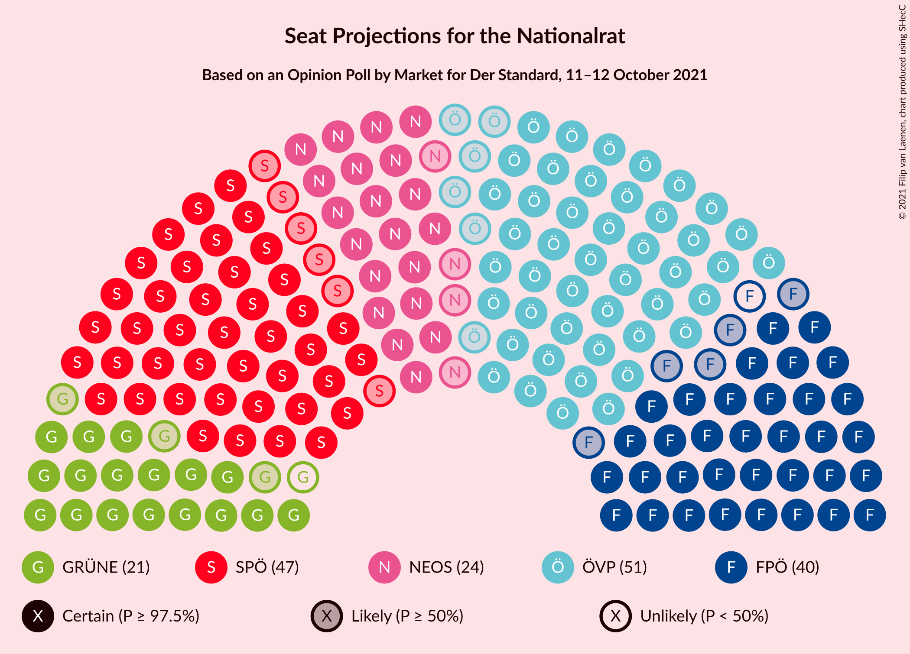
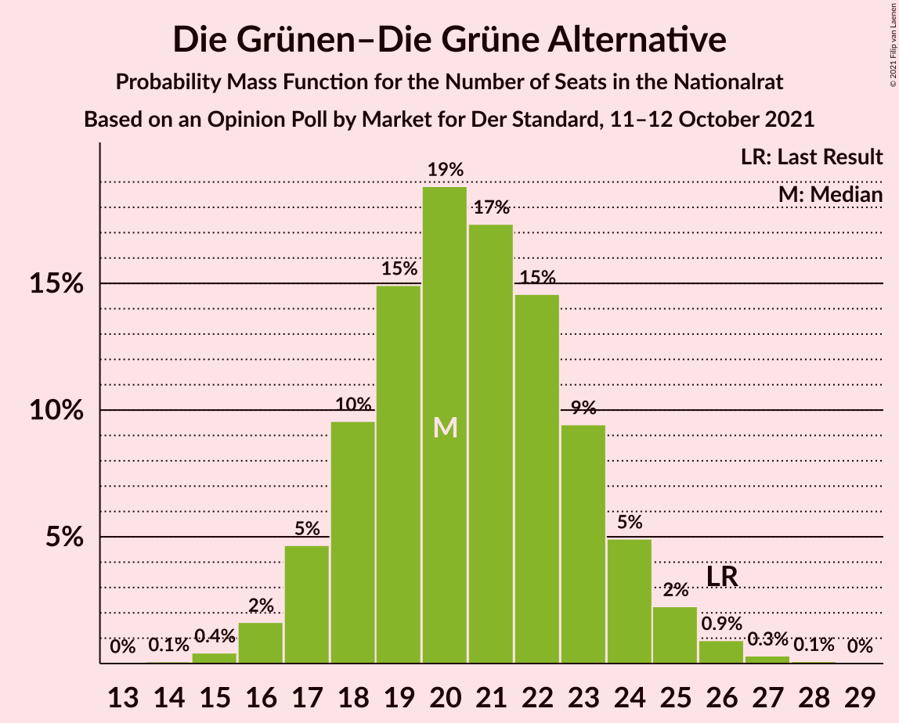
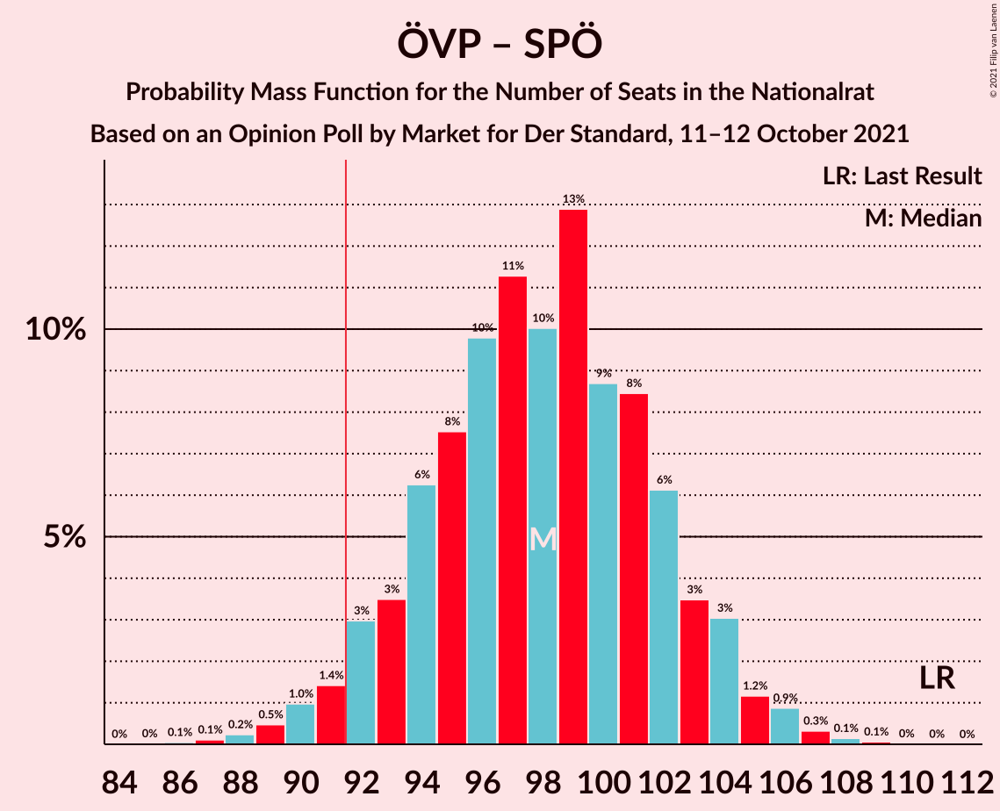
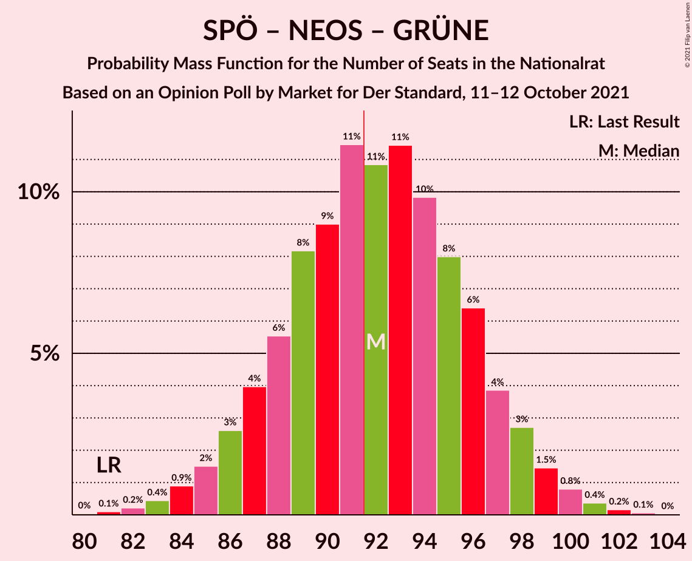
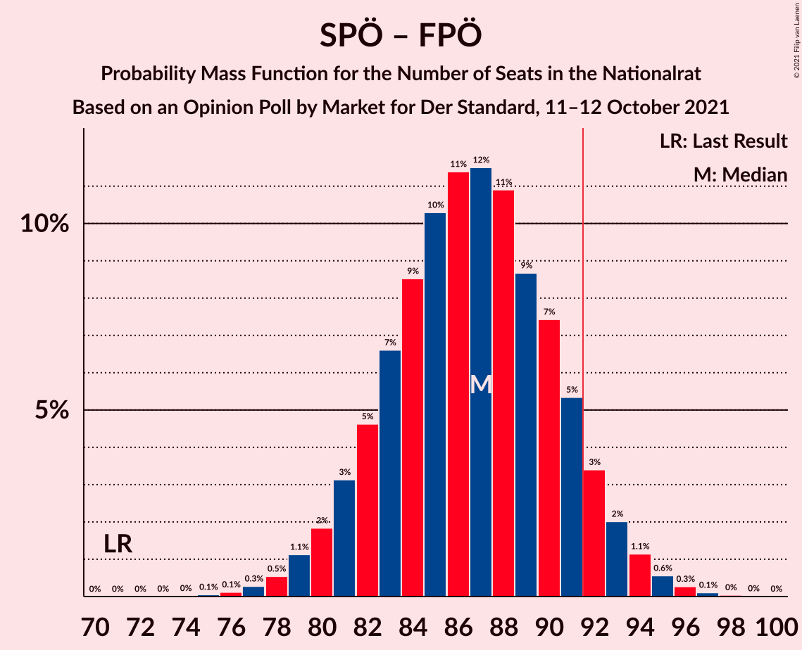
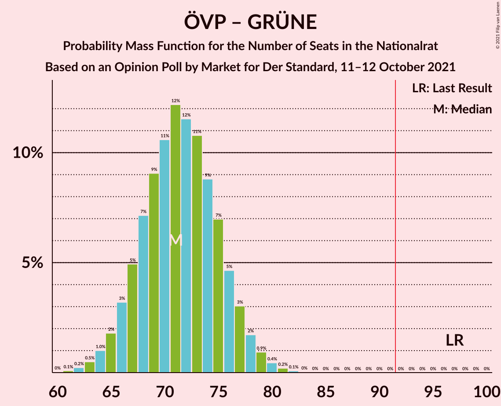
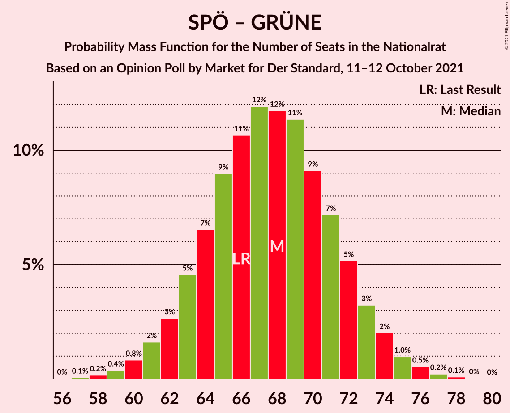

# Opinion Poll by Market for Der Standard, 11–12 October 2021

<a href="#voting-intentions">Voting Intentions</a> | <a href="#seats">Seats</a> | <a href="#coalitions">Coalitions</a> | <a href="#technical-information">Technical Information</a>

## Voting Intentions

### Confidence Intervals

| Party | Last Result | Poll Result | 80% Confidence Interval | 90% Confidence Interval | 95% Confidence Interval | 99% Confidence Interval |
|:-----:|:-----------:|:-----------:|:-----------------------:|:-----------------------:|:-----------------------:|:-----------------------:|
| Österreichische Volkspartei | 37.5% | 27.0% | 25.1–29.1% |24.5–29.7% |24.0–30.2% |23.1–31.2% |
| Sozialdemokratische Partei Österreichs | 21.2% | 25.0% | 23.1–27.0% |22.6–27.6% |22.1–28.1% |21.2–29.1% |
| Freiheitliche Partei Österreichs | 16.2% | 21.0% | 19.2–22.9% |18.7–23.5% |18.3–24.0% |17.5–24.9% |
| NEOS–Das Neue Österreich und Liberales Forum | 8.1% | 13.0% | 11.6–14.6% |11.2–15.1% |10.8–15.5% |10.2–16.3% |
| Die Grünen–Die Grüne Alternative | 13.9% | 11.0% | 9.7–12.5% |9.3–13.0% |9.0–13.4% |8.4–14.1% |

*Note:* The poll result column reflects the actual value used in the calculations. Published results may vary slightly, and in addition be rounded to fewer digits.

## Seats

### Confidence Intervals

| Party | Last Result | Median | 80% Confidence Interval | 90% Confidence Interval | 95% Confidence Interval | 99% Confidence Interval |
|:-----:|:-----------:|:------:|:-----------------------:|:-----------------------:|:-----------------------:|:-----------------------:|
| <a href="#österreichische-volkspartei">Österreichische Volkspartei</a> | 71 | 51 | 47–55 |46–56 |45–57 |43–59 |
| <a href="#sozialdemokratische-partei-österreichs">Sozialdemokratische Partei Österreichs</a> | 40 | 47 | 43–51 |42–52 |41–53 |40–55 |
| <a href="#freiheitliche-partei-österreichs">Freiheitliche Partei Österreichs</a> | 31 | 40 | 36–43 |35–44 |34–45 |33–47 |
| <a href="#neos–das-neue-österreich-und-liberales-forum">NEOS–Das Neue Österreich und Liberales Forum</a> | 15 | 24 | 21–27 |21–28 |20–29 |19–31 |
| <a href="#die-grünen–die-grüne-alternative">Die Grünen–Die Grüne Alternative</a> | 26 | 20 | 18–23 |17–24 |17–25 |16–26 |

### Österreichische Volkspartei

*For a full overview of the results for this party, see the [Österreichische Volkspartei](party-österreichischevolkspartei.html) page.*

| Number of Seats | Probability | Accumulated | Special Marks |
|:---------------:|:-----------:|:-----------:|:-------------:|
| 41 | 0.1% | 100% |  |
| 42 | 0.2% | 99.9% |  |
| 43 | 0.4% | 99.8% |  |
| 44 | 0.9% | 99.3% |  |
| 45 | 2% | 98% |  |
| 46 | 3% | 97% |  |
| 47 | 7% | 93% |  |
| 48 | 7% | 86% |  |
| 49 | 12% | 80% |  |
| 50 | 14% | 67% |  |
| 51 | 11% | 53% | Median |
| 52 | 12% | 43% |  |
| 53 | 12% | 31% |  |
| 54 | 6% | 18% |  |
| 55 | 6% | 12% |  |
| 56 | 4% | 7% |  |
| 57 | 1.3% | 3% |  |
| 58 | 1.0% | 2% |  |
| 59 | 0.4% | 0.6% |  |
| 60 | 0.1% | 0.2% |  |
| 61 | 0.1% | 0.1% |  |
| 62 | 0% | 0% |  |
| 63 | 0% | 0% |  |
| 64 | 0% | 0% |  |
| 65 | 0% | 0% |  |
| 66 | 0% | 0% |  |
| 67 | 0% | 0% |  |
| 68 | 0% | 0% |  |
| 69 | 0% | 0% |  |
| 70 | 0% | 0% |  |
| 71 | 0% | 0% | Last Result |

### Sozialdemokratische Partei Österreichs

*For a full overview of the results for this party, see the [Sozialdemokratische Partei Österreichs](party-sozialdemokratischeparteiösterreichs.html) page.*

| Number of Seats | Probability | Accumulated | Special Marks |
|:---------------:|:-----------:|:-----------:|:-------------:|
| 38 | 0.1% | 100% |  |
| 39 | 0.3% | 99.9% |  |
| 40 | 0.7% | 99.6% | Last Result |
| 41 | 1.5% | 98.9% |  |
| 42 | 3% | 97% |  |
| 43 | 6% | 95% |  |
| 44 | 7% | 89% |  |
| 45 | 9% | 82% |  |
| 46 | 16% | 72% |  |
| 47 | 14% | 57% | Median |
| 48 | 10% | 43% |  |
| 49 | 11% | 33% |  |
| 50 | 11% | 22% |  |
| 51 | 4% | 11% |  |
| 52 | 3% | 7% |  |
| 53 | 3% | 4% |  |
| 54 | 0.7% | 1.3% |  |
| 55 | 0.3% | 0.6% |  |
| 56 | 0.2% | 0.3% |  |
| 57 | 0.1% | 0.1% |  |
| 58 | 0% | 0% |  |

### Freiheitliche Partei Österreichs

*For a full overview of the results for this party, see the [Freiheitliche Partei Österreichs](party-freiheitlicheparteiösterreichs.html) page.*

| Number of Seats | Probability | Accumulated | Special Marks |
|:---------------:|:-----------:|:-----------:|:-------------:|
| 31 | 0.1% | 100% | Last Result |
| 32 | 0.3% | 99.9% |  |
| 33 | 0.8% | 99.6% |  |
| 34 | 2% | 98.8% |  |
| 35 | 4% | 97% |  |
| 36 | 7% | 93% |  |
| 37 | 10% | 86% |  |
| 38 | 13% | 76% |  |
| 39 | 13% | 64% |  |
| 40 | 14% | 50% | Median |
| 41 | 12% | 36% |  |
| 42 | 11% | 24% |  |
| 43 | 6% | 14% |  |
| 44 | 4% | 8% |  |
| 45 | 2% | 4% |  |
| 46 | 1.0% | 2% |  |
| 47 | 0.4% | 0.7% |  |
| 48 | 0.2% | 0.3% |  |
| 49 | 0.1% | 0.1% |  |
| 50 | 0% | 0% |  |

### NEOS–Das Neue Österreich und Liberales Forum

*For a full overview of the results for this party, see the [NEOS–Das Neue Österreich und Liberales Forum](party-neos–dasneueösterreichundliberalesforum.html) page.*

| Number of Seats | Probability | Accumulated | Special Marks |
|:---------------:|:-----------:|:-----------:|:-------------:|
| 15 | 0% | 100% | Last Result |
| 16 | 0% | 100% |  |
| 17 | 0% | 100% |  |
| 18 | 0.2% | 99.9% |  |
| 19 | 0.9% | 99.7% |  |
| 20 | 3% | 98.8% |  |
| 21 | 6% | 96% |  |
| 22 | 10% | 90% |  |
| 23 | 15% | 79% |  |
| 24 | 19% | 64% | Median |
| 25 | 15% | 46% |  |
| 26 | 13% | 31% |  |
| 27 | 10% | 18% |  |
| 28 | 4% | 8% |  |
| 29 | 2% | 4% |  |
| 30 | 1.0% | 1.5% |  |
| 31 | 0.4% | 0.5% |  |
| 32 | 0.1% | 0.1% |  |
| 33 | 0% | 0% |  |

### Die Grünen–Die Grüne Alternative

*For a full overview of the results for this party, see the [Die Grünen–Die Grüne Alternative](party-diegrünen–diegrünealternative.html) page.*

| Number of Seats | Probability | Accumulated | Special Marks |
|:---------------:|:-----------:|:-----------:|:-------------:|
| 14 | 0.1% | 100% |  |
| 15 | 0.3% | 99.9% |  |
| 16 | 2% | 99.6% |  |
| 17 | 5% | 98% |  |
| 18 | 10% | 93% |  |
| 19 | 15% | 84% |  |
| 20 | 19% | 68% | Median |
| 21 | 17% | 49% |  |
| 22 | 15% | 33% |  |
| 23 | 10% | 18% |  |
| 24 | 5% | 8% |  |
| 25 | 2% | 3% |  |
| 26 | 0.8% | 1.3% | Last Result |
| 27 | 0.3% | 0.5% |  |
| 28 | 0.1% | 0.1% |  |
| 29 | 0% | 0% |  |

## Coalitions

### Confidence Intervals

| Coalition | Last Result | Median | Majority? | 80% Confidence Interval | 90% Confidence Interval | 95% Confidence Interval | 99% Confidence Interval |
|:---------:|:-----------:|:------:|:---------:|:-----------------------:|:-----------------------:|:-----------------------:|:-----------------------:|
| Österreichische Volkspartei – Sozialdemokratische Partei Österreichs | 111 | 98 | 97% | 94–102 | 92–104 | 91–105 | 89–107 |
| Österreichische Volkspartei – NEOS–Das Neue Österreich und Liberales Forum – Die Grünen–Die Grüne Alternative | 112 | 96 | 89% | 91–100 | 90–101 | 89–102 | 87–104 |
| Sozialdemokratische Partei Österreichs – NEOS–Das Neue Österreich und Liberales Forum – Die Grünen–Die Grüne Alternative | 81 | 92 | 53% | 88–96 | 86–98 | 85–98 | 83–101 |
| Österreichische Volkspartei – Freiheitliche Partei Österreichs | 102 | 90 | 42% | 86–95 | 85–96 | 83–97 | 81–99 |
| Sozialdemokratische Partei Österreichs – Freiheitliche Partei Österreichs | 71 | 87 | 8% | 82–91 | 81–92 | 80–93 | 77–95 |
| Österreichische Volkspartei – NEOS–Das Neue Österreich und Liberales Forum | 86 | 75 | 0% | 71–79 | 70–81 | 69–82 | 66–84 |
| Österreichische Volkspartei – Die Grünen–Die Grüne Alternative | 97 | 71 | 0% | 67–76 | 66–77 | 65–78 | 63–80 |
| Sozialdemokratische Partei Österreichs – Die Grünen–Die Grüne Alternative | 66 | 68 | 0% | 64–72 | 62–73 | 61–74 | 59–76 |
| Österreichische Volkspartei | 71 | 51 | 0% | 47–55 | 46–56 | 45–57 | 43–59 |
| Sozialdemokratische Partei Österreichs | 40 | 47 | 0% | 43–51 | 42–52 | 41–53 | 40–55 |

### Österreichische Volkspartei – Sozialdemokratische Partei Österreichs

| Number of Seats | Probability | Accumulated | Special Marks |
|:---------------:|:-----------:|:-----------:|:-------------:|
| 86 | 0% | 100% |  |
| 87 | 0.1% | 99.9% |  |
| 88 | 0.2% | 99.8% |  |
| 89 | 0.5% | 99.6% |  |
| 90 | 0.9% | 99.1% |  |
| 91 | 1.5% | 98% |  |
| 92 | 2% | 97% | Majority |
| 93 | 4% | 94% |  |
| 94 | 6% | 90% |  |
| 95 | 7% | 84% |  |
| 96 | 11% | 78% |  |
| 97 | 10% | 67% |  |
| 98 | 10% | 57% | Median |
| 99 | 14% | 47% |  |
| 100 | 8% | 33% |  |
| 101 | 9% | 25% |  |
| 102 | 6% | 15% |  |
| 103 | 4% | 9% |  |
| 104 | 3% | 5% |  |
| 105 | 1.2% | 3% |  |
| 106 | 0.8% | 1.3% |  |
| 107 | 0.3% | 0.6% |  |
| 108 | 0.2% | 0.2% |  |
| 109 | 0.1% | 0.1% |  |
| 110 | 0% | 0% |  |
| 111 | 0% | 0% | Last Result |

### Österreichische Volkspartei – NEOS–Das Neue Österreich und Liberales Forum – Die Grünen–Die Grüne Alternative

| Number of Seats | Probability | Accumulated | Special Marks |
|:---------------:|:-----------:|:-----------:|:-------------:|
| 84 | 0.1% | 100% |  |
| 85 | 0.1% | 99.9% |  |
| 86 | 0.3% | 99.8% |  |
| 87 | 0.5% | 99.5% |  |
| 88 | 0.9% | 99.0% |  |
| 89 | 2% | 98% |  |
| 90 | 3% | 96% |  |
| 91 | 4% | 94% |  |
| 92 | 7% | 89% | Majority |
| 93 | 7% | 83% |  |
| 94 | 9% | 75% |  |
| 95 | 12% | 66% | Median |
| 96 | 11% | 54% |  |
| 97 | 12% | 43% |  |
| 98 | 10% | 31% |  |
| 99 | 7% | 21% |  |
| 100 | 6% | 15% |  |
| 101 | 4% | 8% |  |
| 102 | 2% | 5% |  |
| 103 | 1.1% | 2% |  |
| 104 | 0.8% | 1.2% |  |
| 105 | 0.3% | 0.5% |  |
| 106 | 0.1% | 0.2% |  |
| 107 | 0.1% | 0.1% |  |
| 108 | 0% | 0% |  |
| 109 | 0% | 0% |  |
| 110 | 0% | 0% |  |
| 111 | 0% | 0% |  |
| 112 | 0% | 0% | Last Result |

### Sozialdemokratische Partei Österreichs – NEOS–Das Neue Österreich und Liberales Forum – Die Grünen–Die Grüne Alternative

| Number of Seats | Probability | Accumulated | Special Marks |
|:---------------:|:-----------:|:-----------:|:-------------:|
| 80 | 0% | 100% |  |
| 81 | 0.1% | 99.9% | Last Result |
| 82 | 0.3% | 99.8% |  |
| 83 | 0.3% | 99.6% |  |
| 84 | 1.2% | 99.3% |  |
| 85 | 0.8% | 98% |  |
| 86 | 3% | 97% |  |
| 87 | 3% | 94% |  |
| 88 | 5% | 91% |  |
| 89 | 10% | 86% |  |
| 90 | 6% | 76% |  |
| 91 | 17% | 70% | Median |
| 92 | 5% | 53% | Majority |
| 93 | 16% | 48% |  |
| 94 | 6% | 32% |  |
| 95 | 9% | 26% |  |
| 96 | 8% | 17% |  |
| 97 | 2% | 8% |  |
| 98 | 4% | 6% |  |
| 99 | 0.6% | 2% |  |
| 100 | 1.1% | 2% |  |
| 101 | 0.2% | 0.5% |  |
| 102 | 0.2% | 0.3% |  |
| 103 | 0.1% | 0.1% |  |
| 104 | 0% | 0% |  |

### Österreichische Volkspartei – Freiheitliche Partei Österreichs

| Number of Seats | Probability | Accumulated | Special Marks |
|:---------------:|:-----------:|:-----------:|:-------------:|
| 79 | 0% | 100% |  |
| 80 | 0.2% | 99.9% |  |
| 81 | 0.4% | 99.7% |  |
| 82 | 0.5% | 99.4% |  |
| 83 | 2% | 98.9% |  |
| 84 | 1.1% | 97% |  |
| 85 | 5% | 96% |  |
| 86 | 3% | 92% |  |
| 87 | 9% | 89% |  |
| 88 | 10% | 80% |  |
| 89 | 6% | 70% |  |
| 90 | 17% | 63% |  |
| 91 | 4% | 46% | Median |
| 92 | 16% | 42% | Majority |
| 93 | 5% | 25% |  |
| 94 | 9% | 20% |  |
| 95 | 4% | 11% |  |
| 96 | 3% | 7% |  |
| 97 | 3% | 4% |  |
| 98 | 0.4% | 2% |  |
| 99 | 0.8% | 1.1% |  |
| 100 | 0.1% | 0.3% |  |
| 101 | 0.1% | 0.2% |  |
| 102 | 0% | 0% | Last Result |

### Sozialdemokratische Partei Österreichs – Freiheitliche Partei Österreichs

| Number of Seats | Probability | Accumulated | Special Marks |
|:---------------:|:-----------:|:-----------:|:-------------:|
| 71 | 0% | 100% | Last Result |
| 72 | 0% | 100% |  |
| 73 | 0% | 100% |  |
| 74 | 0% | 100% |  |
| 75 | 0.1% | 100% |  |
| 76 | 0.1% | 99.9% |  |
| 77 | 0.3% | 99.8% |  |
| 78 | 0.4% | 99.5% |  |
| 79 | 1.2% | 99.0% |  |
| 80 | 2% | 98% |  |
| 81 | 3% | 96% |  |
| 82 | 4% | 93% |  |
| 83 | 7% | 89% |  |
| 84 | 7% | 82% |  |
| 85 | 10% | 74% |  |
| 86 | 13% | 64% |  |
| 87 | 11% | 52% | Median |
| 88 | 12% | 41% |  |
| 89 | 9% | 29% |  |
| 90 | 7% | 20% |  |
| 91 | 6% | 14% |  |
| 92 | 4% | 8% | Majority |
| 93 | 2% | 4% |  |
| 94 | 1.2% | 2% |  |
| 95 | 0.6% | 1.0% |  |
| 96 | 0.3% | 0.4% |  |
| 97 | 0.1% | 0.2% |  |
| 98 | 0% | 0.1% |  |
| 99 | 0% | 0% |  |

### Österreichische Volkspartei – NEOS–Das Neue Österreich und Liberales Forum

| Number of Seats | Probability | Accumulated | Special Marks |
|:---------------:|:-----------:|:-----------:|:-------------:|
| 64 | 0.1% | 100% |  |
| 65 | 0.1% | 99.9% |  |
| 66 | 0.3% | 99.8% |  |
| 67 | 0.8% | 99.5% |  |
| 68 | 0.8% | 98.7% |  |
| 69 | 2% | 98% |  |
| 70 | 3% | 95% |  |
| 71 | 5% | 92% |  |
| 72 | 8% | 88% |  |
| 73 | 11% | 80% |  |
| 74 | 8% | 69% |  |
| 75 | 15% | 61% | Median |
| 76 | 10% | 46% |  |
| 77 | 10% | 36% |  |
| 78 | 11% | 27% |  |
| 79 | 6% | 16% |  |
| 80 | 4% | 10% |  |
| 81 | 3% | 6% |  |
| 82 | 1.1% | 3% |  |
| 83 | 0.8% | 2% |  |
| 84 | 0.5% | 0.8% |  |
| 85 | 0.2% | 0.3% |  |
| 86 | 0.1% | 0.1% | Last Result |
| 87 | 0% | 0% |  |

### Österreichische Volkspartei – Die Grünen–Die Grüne Alternative

| Number of Seats | Probability | Accumulated | Special Marks |
|:---------------:|:-----------:|:-----------:|:-------------:|
| 61 | 0.1% | 100% |  |
| 62 | 0.2% | 99.8% |  |
| 63 | 0.5% | 99.7% |  |
| 64 | 1.0% | 99.2% |  |
| 65 | 2% | 98% |  |
| 66 | 3% | 96% |  |
| 67 | 5% | 93% |  |
| 68 | 7% | 88% |  |
| 69 | 9% | 81% |  |
| 70 | 10% | 72% |  |
| 71 | 13% | 62% | Median |
| 72 | 12% | 49% |  |
| 73 | 10% | 37% |  |
| 74 | 9% | 27% |  |
| 75 | 7% | 18% |  |
| 76 | 5% | 11% |  |
| 77 | 3% | 7% |  |
| 78 | 2% | 3% |  |
| 79 | 0.9% | 2% |  |
| 80 | 0.4% | 0.8% |  |
| 81 | 0.2% | 0.3% |  |
| 82 | 0.1% | 0.1% |  |
| 83 | 0% | 0% |  |
| 84 | 0% | 0% |  |
| 85 | 0% | 0% |  |
| 86 | 0% | 0% |  |
| 87 | 0% | 0% |  |
| 88 | 0% | 0% |  |
| 89 | 0% | 0% |  |
| 90 | 0% | 0% |  |
| 91 | 0% | 0% |  |
| 92 | 0% | 0% | Majority |
| 93 | 0% | 0% |  |
| 94 | 0% | 0% |  |
| 95 | 0% | 0% |  |
| 96 | 0% | 0% |  |
| 97 | 0% | 0% | Last Result |

### Sozialdemokratische Partei Österreichs – Die Grünen–Die Grüne Alternative

| Number of Seats | Probability | Accumulated | Special Marks |
|:---------------:|:-----------:|:-----------:|:-------------:|
| 57 | 0.1% | 100% |  |
| 58 | 0.2% | 99.9% |  |
| 59 | 0.4% | 99.7% |  |
| 60 | 0.8% | 99.3% |  |
| 61 | 2% | 98.5% |  |
| 62 | 2% | 97% |  |
| 63 | 4% | 95% |  |
| 64 | 6% | 90% |  |
| 65 | 8% | 84% |  |
| 66 | 12% | 76% | Last Result |
| 67 | 12% | 63% | Median |
| 68 | 11% | 51% |  |
| 69 | 12% | 40% |  |
| 70 | 9% | 28% |  |
| 71 | 6% | 19% |  |
| 72 | 6% | 12% |  |
| 73 | 3% | 7% |  |
| 74 | 2% | 4% |  |
| 75 | 1.1% | 2% |  |
| 76 | 0.5% | 0.8% |  |
| 77 | 0.2% | 0.4% |  |
| 78 | 0.1% | 0.1% |  |
| 79 | 0% | 0.1% |  |
| 80 | 0% | 0% |  |

### Österreichische Volkspartei

| Number of Seats | Probability | Accumulated | Special Marks |
|:---------------:|:-----------:|:-----------:|:-------------:|
| 41 | 0.1% | 100% |  |
| 42 | 0.2% | 99.9% |  |
| 43 | 0.4% | 99.8% |  |
| 44 | 0.9% | 99.3% |  |
| 45 | 2% | 98% |  |
| 46 | 3% | 97% |  |
| 47 | 7% | 93% |  |
| 48 | 7% | 86% |  |
| 49 | 12% | 80% |  |
| 50 | 14% | 67% |  |
| 51 | 11% | 53% | Median |
| 52 | 12% | 43% |  |
| 53 | 12% | 31% |  |
| 54 | 6% | 18% |  |
| 55 | 6% | 12% |  |
| 56 | 4% | 7% |  |
| 57 | 1.3% | 3% |  |
| 58 | 1.0% | 2% |  |
| 59 | 0.4% | 0.6% |  |
| 60 | 0.1% | 0.2% |  |
| 61 | 0.1% | 0.1% |  |
| 62 | 0% | 0% |  |
| 63 | 0% | 0% |  |
| 64 | 0% | 0% |  |
| 65 | 0% | 0% |  |
| 66 | 0% | 0% |  |
| 67 | 0% | 0% |  |
| 68 | 0% | 0% |  |
| 69 | 0% | 0% |  |
| 70 | 0% | 0% |  |
| 71 | 0% | 0% | Last Result |

### Sozialdemokratische Partei Österreichs

| Number of Seats | Probability | Accumulated | Special Marks |
|:---------------:|:-----------:|:-----------:|:-------------:|
| 38 | 0.1% | 100% |  |
| 39 | 0.3% | 99.9% |  |
| 40 | 0.7% | 99.6% | Last Result |
| 41 | 1.5% | 98.9% |  |
| 42 | 3% | 97% |  |
| 43 | 6% | 95% |  |
| 44 | 7% | 89% |  |
| 45 | 9% | 82% |  |
| 46 | 16% | 72% |  |
| 47 | 14% | 57% | Median |
| 48 | 10% | 43% |  |
| 49 | 11% | 33% |  |
| 50 | 11% | 22% |  |
| 51 | 4% | 11% |  |
| 52 | 3% | 7% |  |
| 53 | 3% | 4% |  |
| 54 | 0.7% | 1.3% |  |
| 55 | 0.3% | 0.6% |  |
| 56 | 0.2% | 0.3% |  |
| 57 | 0.1% | 0.1% |  |
| 58 | 0% | 0% |  |

## Technical Information

### Opinion Poll

+ **Polling firm:** Market
+ **Commissioner(s):** Der Standard
+ **Fieldwork period:** 11–12 October 2021

### Calculations

+ **Sample size:** 800
+ **Simulations done:** 131,072
+ **Error estimate:** 1.30%

