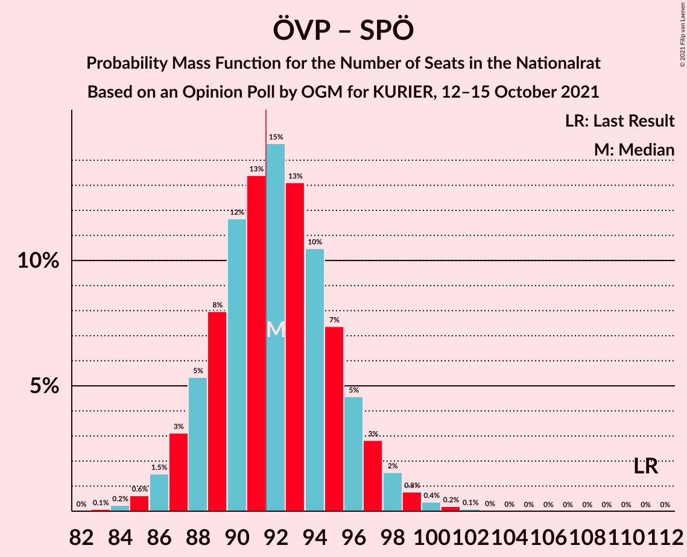
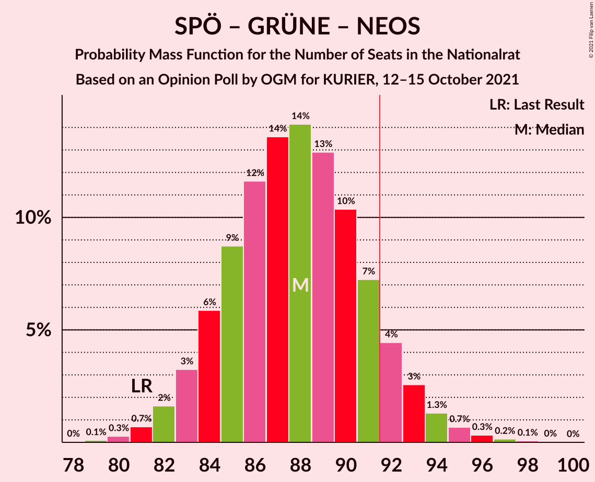
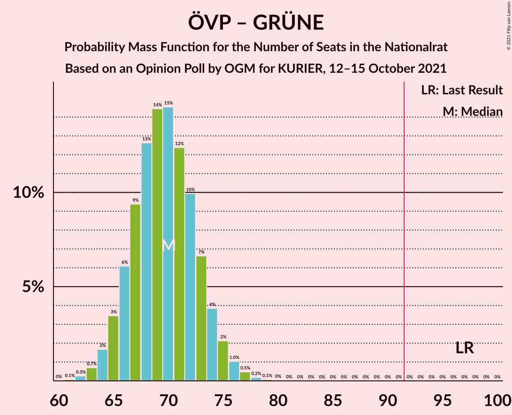
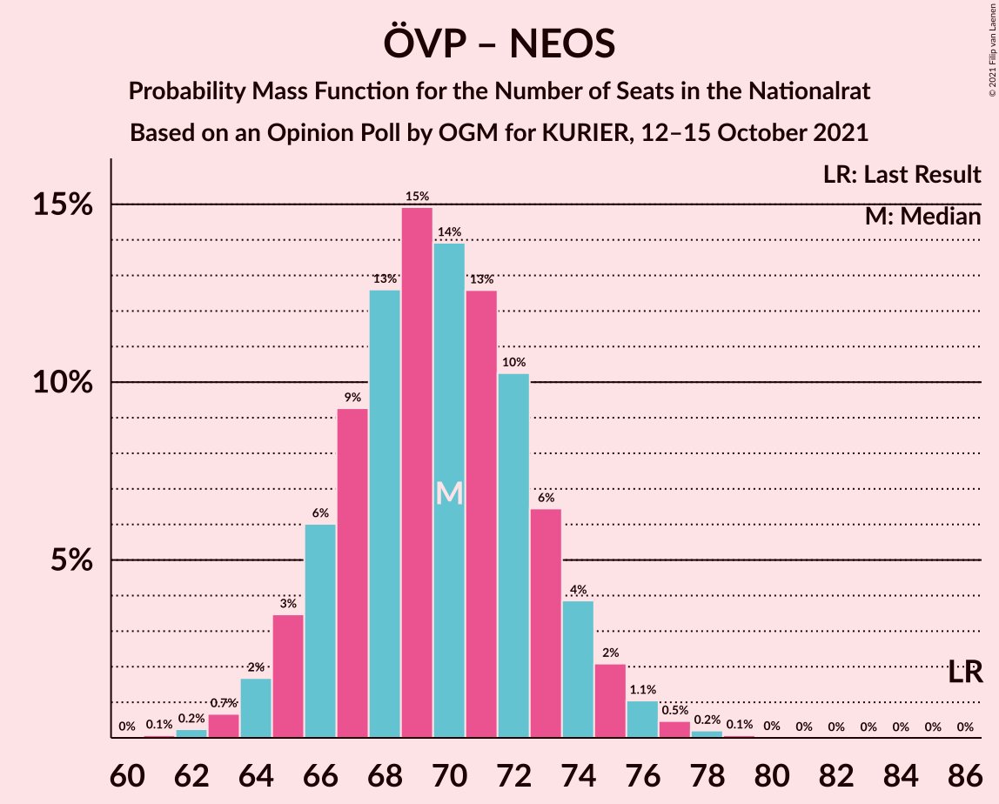
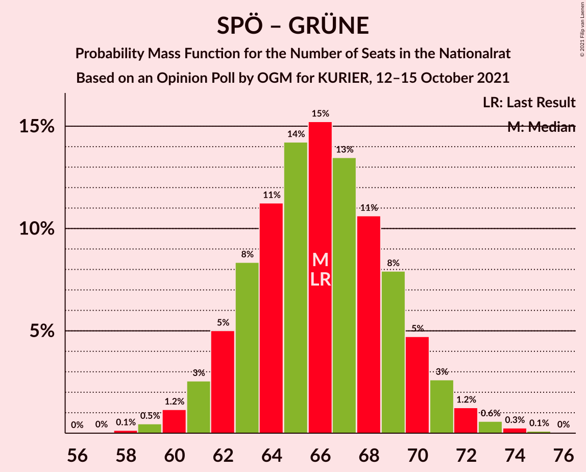

# Opinion Poll by OGM for KURIER, 12–15 October 2021

<a href="#voting-intentions">Voting Intentions</a> | <a href="#seats">Seats</a> | <a href="#coalitions">Coalitions</a> | <a href="#technical-information">Technical Information</a>

## Voting Intentions

### Confidence Intervals

| Party | Last Result | Poll Result | 80% Confidence Interval | 90% Confidence Interval | 95% Confidence Interval | 99% Confidence Interval |
|:-----:|:-----------:|:-----------:|:-----------------------:|:-----------------------:|:-----------------------:|:-----------------------:|
| Österreichische Volkspartei | 37.5% | 26.0% | 24.4–27.7% |23.9–28.2% |23.5–28.6% |22.8–29.4% |
| Sozialdemokratische Partei Österreichs | 21.2% | 24.0% | 22.5–25.7% |22.0–26.1% |21.6–26.6% |20.9–27.4% |
| Freiheitliche Partei Österreichs | 16.2% | 21.0% | 19.6–22.6% |19.1–23.1% |18.8–23.5% |18.1–24.2% |
| NEOS–Das Neue Österreich und Liberales Forum | 8.1% | 12.0% | 10.8–13.3% |10.5–13.6% |10.2–14.0% |9.7–14.6% |
| Die Grünen–Die Grüne Alternative | 13.9% | 12.0% | 10.8–13.3% |10.5–13.6% |10.2–14.0% |9.7–14.6% |

*Note:* The poll result column reflects the actual value used in the calculations. Published results may vary slightly, and in addition be rounded to fewer digits.

## Seats

### Confidence Intervals

| Party | Last Result | Median | 80% Confidence Interval | 90% Confidence Interval | 95% Confidence Interval | 99% Confidence Interval |
|:-----:|:-----------:|:------:|:-----------------------:|:-----------------------:|:-----------------------:|:-----------------------:|
| <a href="#österreichische-volkspartei">Österreichische Volkspartei</a> | 71 | 48 | 45–51 |44–52 |43–53 |42–54 |
| <a href="#sozialdemokratische-partei-österreichs">Sozialdemokratische Partei Österreichs</a> | 40 | 44 | 41–47 |40–48 |40–49 |38–50 |
| <a href="#freiheitliche-partei-österreichs">Freiheitliche Partei Österreichs</a> | 31 | 39 | 36–42 |35–42 |34–43 |33–45 |
| <a href="#neos–das-neue-österreich-und-liberales-forum">NEOS–Das Neue Österreich und Liberales Forum</a> | 15 | 21 | 20–24 |19–24 |18–26 |18–27 |
| <a href="#die-grünen–die-grüne-alternative">Die Grünen–Die Grüne Alternative</a> | 26 | 22 | 20–24 |19–25 |19–25 |17–27 |

### Österreichische Volkspartei

*For a full overview of the results for this party, see the [Österreichische Volkspartei](party-österreichischevolkspartei.html) page.*

| Number of Seats | Probability | Accumulated | Special Marks |
|:---------------:|:-----------:|:-----------:|:-------------:|
| 40 | 0.1% | 100% |  |
| 41 | 0.3% | 99.9% |  |
| 42 | 0.9% | 99.7% |  |
| 43 | 2% | 98.8% |  |
| 44 | 5% | 97% |  |
| 45 | 9% | 92% |  |
| 46 | 13% | 83% |  |
| 47 | 16% | 70% |  |
| 48 | 16% | 54% | Median |
| 49 | 14% | 38% |  |
| 50 | 10% | 24% |  |
| 51 | 7% | 13% |  |
| 52 | 4% | 7% |  |
| 53 | 2% | 3% |  |
| 54 | 0.8% | 1.2% |  |
| 55 | 0.3% | 0.4% |  |
| 56 | 0.1% | 0.1% |  |
| 57 | 0% | 0% |  |
| 58 | 0% | 0% |  |
| 59 | 0% | 0% |  |
| 60 | 0% | 0% |  |
| 61 | 0% | 0% |  |
| 62 | 0% | 0% |  |
| 63 | 0% | 0% |  |
| 64 | 0% | 0% |  |
| 65 | 0% | 0% |  |
| 66 | 0% | 0% |  |
| 67 | 0% | 0% |  |
| 68 | 0% | 0% |  |
| 69 | 0% | 0% |  |
| 70 | 0% | 0% |  |
| 71 | 0% | 0% | Last Result |

### Sozialdemokratische Partei Österreichs

*For a full overview of the results for this party, see the [Sozialdemokratische Partei Österreichs](party-sozialdemokratischeparteiösterreichs.html) page.*

| Number of Seats | Probability | Accumulated | Special Marks |
|:---------------:|:-----------:|:-----------:|:-------------:|
| 37 | 0.1% | 100% |  |
| 38 | 0.5% | 99.8% |  |
| 39 | 1.5% | 99.4% |  |
| 40 | 4% | 98% | Last Result |
| 41 | 7% | 94% |  |
| 42 | 12% | 87% |  |
| 43 | 15% | 76% |  |
| 44 | 17% | 61% | Median |
| 45 | 16% | 44% |  |
| 46 | 12% | 28% |  |
| 47 | 8% | 16% |  |
| 48 | 4% | 8% |  |
| 49 | 2% | 4% |  |
| 50 | 0.9% | 1.4% |  |
| 51 | 0.3% | 0.5% |  |
| 52 | 0.1% | 0.2% |  |
| 53 | 0% | 0% |  |

### Freiheitliche Partei Österreichs

*For a full overview of the results for this party, see the [Freiheitliche Partei Österreichs](party-freiheitlicheparteiösterreichs.html) page.*

| Number of Seats | Probability | Accumulated | Special Marks |
|:---------------:|:-----------:|:-----------:|:-------------:|
| 31 | 0% | 100% | Last Result |
| 32 | 0.2% | 100% |  |
| 33 | 0.7% | 99.8% |  |
| 34 | 2% | 99.1% |  |
| 35 | 5% | 97% |  |
| 36 | 9% | 92% |  |
| 37 | 14% | 83% |  |
| 38 | 18% | 69% |  |
| 39 | 18% | 51% | Median |
| 40 | 13% | 33% |  |
| 41 | 10% | 20% |  |
| 42 | 6% | 10% |  |
| 43 | 3% | 4% |  |
| 44 | 1.1% | 2% |  |
| 45 | 0.4% | 0.6% |  |
| 46 | 0.1% | 0.2% |  |
| 47 | 0% | 0% |  |

### NEOS–Das Neue Österreich und Liberales Forum

*For a full overview of the results for this party, see the [NEOS–Das Neue Österreich und Liberales Forum](party-neos–dasneueösterreichundliberalesforum.html) page.*

| Number of Seats | Probability | Accumulated | Special Marks |
|:---------------:|:-----------:|:-----------:|:-------------:|
| 15 | 0% | 100% | Last Result |
| 16 | 0.1% | 100% |  |
| 17 | 0.2% | 99.9% |  |
| 18 | 3% | 99.8% |  |
| 19 | 4% | 96% |  |
| 20 | 13% | 92% |  |
| 21 | 32% | 80% | Median |
| 22 | 6% | 48% |  |
| 23 | 25% | 42% |  |
| 24 | 12% | 17% |  |
| 25 | 1.3% | 5% |  |
| 26 | 3% | 3% |  |
| 27 | 0.4% | 0.5% |  |
| 28 | 0.1% | 0.1% |  |
| 29 | 0% | 0% |  |

### Die Grünen–Die Grüne Alternative

*For a full overview of the results for this party, see the [Die Grünen–Die Grüne Alternative](party-diegrünen–diegrünealternative.html) page.*

| Number of Seats | Probability | Accumulated | Special Marks |
|:---------------:|:-----------:|:-----------:|:-------------:|
| 16 | 0.1% | 100% |  |
| 17 | 0.5% | 99.9% |  |
| 18 | 2% | 99.5% |  |
| 19 | 6% | 98% |  |
| 20 | 14% | 91% |  |
| 21 | 20% | 77% |  |
| 22 | 22% | 56% | Median |
| 23 | 17% | 34% |  |
| 24 | 10% | 17% |  |
| 25 | 5% | 7% |  |
| 26 | 2% | 2% | Last Result |
| 27 | 0.5% | 0.6% |  |
| 28 | 0.1% | 0.1% |  |
| 29 | 0% | 0% |  |

## Coalitions

### Confidence Intervals

| Coalition | Last Result | Median | Majority? | 80% Confidence Interval | 90% Confidence Interval | 95% Confidence Interval | 99% Confidence Interval |
|:---------:|:-----------:|:------:|:---------:|:-----------------------:|:-----------------------:|:-----------------------:|:-----------------------:|
| Österreichische Volkspartei – Sozialdemokratische Partei Österreichs | 111 | 92 | 56% | 88–96 | 87–97 | 87–98 | 85–100 |
| Österreichische Volkspartei – Die Grünen–Die Grüne Alternative – NEOS–Das Neue Österreich und Liberales Forum | 112 | 91 | 49% | 88–95 | 87–96 | 86–97 | 84–99 |
| Sozialdemokratische Partei Österreichs – Die Grünen–Die Grüne Alternative – NEOS–Das Neue Österreich und Liberales Forum | 81 | 88 | 10% | 84–91 | 83–93 | 82–94 | 81–96 |
| Österreichische Volkspartei – Freiheitliche Partei Österreichs | 102 | 86 | 4% | 83–90 | 82–91 | 81–92 | 79–94 |
| Sozialdemokratische Partei Österreichs – Freiheitliche Partei Österreichs | 71 | 83 | 0.2% | 79–86 | 78–87 | 77–88 | 76–91 |
| Österreichische Volkspartei – Die Grünen–Die Grüne Alternative | 97 | 70 | 0% | 66–73 | 65–74 | 64–75 | 63–77 |
| Österreichische Volkspartei – NEOS–Das Neue Österreich und Liberales Forum | 86 | 70 | 0% | 66–73 | 65–74 | 64–75 | 63–77 |
| Sozialdemokratische Partei Österreichs – Die Grünen–Die Grüne Alternative | 66 | 66 | 0% | 63–69 | 62–70 | 61–71 | 59–73 |
| Österreichische Volkspartei | 71 | 48 | 0% | 45–51 | 44–52 | 43–53 | 42–54 |
| Sozialdemokratische Partei Österreichs | 40 | 44 | 0% | 41–47 | 40–48 | 40–49 | 38–50 |

### Österreichische Volkspartei – Sozialdemokratische Partei Österreichs

| Number of Seats | Probability | Accumulated | Special Marks |
|:---------------:|:-----------:|:-----------:|:-------------:|
| 83 | 0.1% | 100% |  |
| 84 | 0.2% | 99.9% |  |
| 85 | 0.6% | 99.7% |  |
| 86 | 1.5% | 99.0% |  |
| 87 | 3% | 98% |  |
| 88 | 5% | 94% |  |
| 89 | 8% | 89% |  |
| 90 | 12% | 81% |  |
| 91 | 13% | 69% |  |
| 92 | 15% | 56% | Median, Majority |
| 93 | 13% | 41% |  |
| 94 | 10% | 28% |  |
| 95 | 7% | 18% |  |
| 96 | 5% | 10% |  |
| 97 | 3% | 6% |  |
| 98 | 2% | 3% |  |
| 99 | 0.8% | 1.5% |  |
| 100 | 0.4% | 0.7% |  |
| 101 | 0.2% | 0.3% |  |
| 102 | 0.1% | 0.1% |  |
| 103 | 0% | 0.1% |  |
| 104 | 0% | 0% |  |
| 105 | 0% | 0% |  |
| 106 | 0% | 0% |  |
| 107 | 0% | 0% |  |
| 108 | 0% | 0% |  |
| 109 | 0% | 0% |  |
| 110 | 0% | 0% |  |
| 111 | 0% | 0% | Last Result |

### Österreichische Volkspartei – Die Grünen–Die Grüne Alternative – NEOS–Das Neue Österreich und Liberales Forum

| Number of Seats | Probability | Accumulated | Special Marks |
|:---------------:|:-----------:|:-----------:|:-------------:|
| 82 | 0% | 100% |  |
| 83 | 0.1% | 99.9% |  |
| 84 | 0.4% | 99.8% |  |
| 85 | 1.0% | 99.4% |  |
| 86 | 2% | 98% |  |
| 87 | 4% | 96% |  |
| 88 | 7% | 92% |  |
| 89 | 10% | 85% |  |
| 90 | 13% | 76% |  |
| 91 | 14% | 63% | Median |
| 92 | 14% | 49% | Majority |
| 93 | 12% | 35% |  |
| 94 | 9% | 23% |  |
| 95 | 6% | 14% |  |
| 96 | 4% | 8% |  |
| 97 | 2% | 4% |  |
| 98 | 1.1% | 2% |  |
| 99 | 0.6% | 1.0% |  |
| 100 | 0.3% | 0.5% |  |
| 101 | 0.1% | 0.2% |  |
| 102 | 0.1% | 0.1% |  |
| 103 | 0% | 0% |  |
| 104 | 0% | 0% |  |
| 105 | 0% | 0% |  |
| 106 | 0% | 0% |  |
| 107 | 0% | 0% |  |
| 108 | 0% | 0% |  |
| 109 | 0% | 0% |  |
| 110 | 0% | 0% |  |
| 111 | 0% | 0% |  |
| 112 | 0% | 0% | Last Result |

### Sozialdemokratische Partei Österreichs – Die Grünen–Die Grüne Alternative – NEOS–Das Neue Österreich und Liberales Forum

| Number of Seats | Probability | Accumulated | Special Marks |
|:---------------:|:-----------:|:-----------:|:-------------:|
| 79 | 0.1% | 100% |  |
| 80 | 0.3% | 99.9% |  |
| 81 | 0.7% | 99.6% | Last Result |
| 82 | 2% | 98.9% |  |
| 83 | 3% | 97% |  |
| 84 | 6% | 94% |  |
| 85 | 9% | 88% |  |
| 86 | 12% | 79% |  |
| 87 | 14% | 68% | Median |
| 88 | 14% | 54% |  |
| 89 | 13% | 40% |  |
| 90 | 10% | 27% |  |
| 91 | 7% | 17% |  |
| 92 | 4% | 10% | Majority |
| 93 | 3% | 5% |  |
| 94 | 1.3% | 3% |  |
| 95 | 0.7% | 1.3% |  |
| 96 | 0.3% | 0.6% |  |
| 97 | 0.2% | 0.3% |  |
| 98 | 0.1% | 0.1% |  |
| 99 | 0% | 0% |  |

### Österreichische Volkspartei – Freiheitliche Partei Österreichs

| Number of Seats | Probability | Accumulated | Special Marks |
|:---------------:|:-----------:|:-----------:|:-------------:|
| 77 | 0% | 100% |  |
| 78 | 0.1% | 99.9% |  |
| 79 | 0.4% | 99.8% |  |
| 80 | 1.0% | 99.4% |  |
| 81 | 2% | 98% |  |
| 82 | 4% | 96% |  |
| 83 | 7% | 92% |  |
| 84 | 10% | 85% |  |
| 85 | 13% | 75% |  |
| 86 | 14% | 62% |  |
| 87 | 14% | 48% | Median |
| 88 | 12% | 34% |  |
| 89 | 9% | 23% |  |
| 90 | 6% | 13% |  |
| 91 | 4% | 8% |  |
| 92 | 2% | 4% | Majority |
| 93 | 1.0% | 2% |  |
| 94 | 0.5% | 0.9% |  |
| 95 | 0.2% | 0.4% |  |
| 96 | 0.1% | 0.2% |  |
| 97 | 0% | 0.1% |  |
| 98 | 0% | 0% |  |
| 99 | 0% | 0% |  |
| 100 | 0% | 0% |  |
| 101 | 0% | 0% |  |
| 102 | 0% | 0% | Last Result |

### Sozialdemokratische Partei Österreichs – Freiheitliche Partei Österreichs

| Number of Seats | Probability | Accumulated | Special Marks |
|:---------------:|:-----------:|:-----------:|:-------------:|
| 71 | 0% | 100% | Last Result |
| 72 | 0% | 100% |  |
| 73 | 0% | 100% |  |
| 74 | 0.1% | 100% |  |
| 75 | 0.3% | 99.9% |  |
| 76 | 0.7% | 99.6% |  |
| 77 | 2% | 98.9% |  |
| 78 | 3% | 97% |  |
| 79 | 6% | 94% |  |
| 80 | 9% | 88% |  |
| 81 | 12% | 79% |  |
| 82 | 14% | 67% |  |
| 83 | 15% | 53% | Median |
| 84 | 12% | 39% |  |
| 85 | 10% | 26% |  |
| 86 | 7% | 16% |  |
| 87 | 4% | 9% |  |
| 88 | 2% | 5% |  |
| 89 | 1.3% | 2% |  |
| 90 | 0.6% | 1.1% |  |
| 91 | 0.3% | 0.5% |  |
| 92 | 0.1% | 0.2% | Majority |
| 93 | 0.1% | 0.1% |  |
| 94 | 0% | 0% |  |

### Österreichische Volkspartei – Die Grünen–Die Grüne Alternative

| Number of Seats | Probability | Accumulated | Special Marks |
|:---------------:|:-----------:|:-----------:|:-------------:|
| 61 | 0.1% | 100% |  |
| 62 | 0.3% | 99.9% |  |
| 63 | 0.7% | 99.6% |  |
| 64 | 2% | 98.9% |  |
| 65 | 3% | 97% |  |
| 66 | 6% | 94% |  |
| 67 | 9% | 88% |  |
| 68 | 13% | 78% |  |
| 69 | 14% | 66% |  |
| 70 | 15% | 51% | Median |
| 71 | 12% | 37% |  |
| 72 | 10% | 24% |  |
| 73 | 7% | 14% |  |
| 74 | 4% | 8% |  |
| 75 | 2% | 4% |  |
| 76 | 1.0% | 2% |  |
| 77 | 0.5% | 0.8% |  |
| 78 | 0.2% | 0.3% |  |
| 79 | 0.1% | 0.1% |  |
| 80 | 0% | 0.1% |  |
| 81 | 0% | 0% |  |
| 82 | 0% | 0% |  |
| 83 | 0% | 0% |  |
| 84 | 0% | 0% |  |
| 85 | 0% | 0% |  |
| 86 | 0% | 0% |  |
| 87 | 0% | 0% |  |
| 88 | 0% | 0% |  |
| 89 | 0% | 0% |  |
| 90 | 0% | 0% |  |
| 91 | 0% | 0% |  |
| 92 | 0% | 0% | Majority |
| 93 | 0% | 0% |  |
| 94 | 0% | 0% |  |
| 95 | 0% | 0% |  |
| 96 | 0% | 0% |  |
| 97 | 0% | 0% | Last Result |

### Österreichische Volkspartei – NEOS–Das Neue Österreich und Liberales Forum

| Number of Seats | Probability | Accumulated | Special Marks |
|:---------------:|:-----------:|:-----------:|:-------------:|
| 61 | 0.1% | 100% |  |
| 62 | 0.2% | 99.9% |  |
| 63 | 0.7% | 99.7% |  |
| 64 | 2% | 99.0% |  |
| 65 | 3% | 97% |  |
| 66 | 6% | 94% |  |
| 67 | 9% | 88% |  |
| 68 | 13% | 79% |  |
| 69 | 15% | 66% | Median |
| 70 | 14% | 51% |  |
| 71 | 13% | 37% |  |
| 72 | 10% | 25% |  |
| 73 | 6% | 14% |  |
| 74 | 4% | 8% |  |
| 75 | 2% | 4% |  |
| 76 | 1.1% | 2% |  |
| 77 | 0.5% | 0.8% |  |
| 78 | 0.2% | 0.3% |  |
| 79 | 0.1% | 0.1% |  |
| 80 | 0% | 0% |  |
| 81 | 0% | 0% |  |
| 82 | 0% | 0% |  |
| 83 | 0% | 0% |  |
| 84 | 0% | 0% |  |
| 85 | 0% | 0% |  |
| 86 | 0% | 0% | Last Result |

### Sozialdemokratische Partei Österreichs – Die Grünen–Die Grüne Alternative

| Number of Seats | Probability | Accumulated | Special Marks |
|:---------------:|:-----------:|:-----------:|:-------------:|
| 57 | 0% | 100% |  |
| 58 | 0.1% | 99.9% |  |
| 59 | 0.5% | 99.8% |  |
| 60 | 1.2% | 99.3% |  |
| 61 | 3% | 98% |  |
| 62 | 5% | 96% |  |
| 63 | 8% | 91% |  |
| 64 | 11% | 82% |  |
| 65 | 14% | 71% |  |
| 66 | 15% | 57% | Last Result, Median |
| 67 | 13% | 42% |  |
| 68 | 11% | 28% |  |
| 69 | 8% | 17% |  |
| 70 | 5% | 10% |  |
| 71 | 3% | 5% |  |
| 72 | 1.2% | 2% |  |
| 73 | 0.6% | 1.0% |  |
| 74 | 0.3% | 0.4% |  |
| 75 | 0.1% | 0.2% |  |
| 76 | 0% | 0% |  |

### Österreichische Volkspartei

| Number of Seats | Probability | Accumulated | Special Marks |
|:---------------:|:-----------:|:-----------:|:-------------:|
| 40 | 0.1% | 100% |  |
| 41 | 0.3% | 99.9% |  |
| 42 | 0.9% | 99.7% |  |
| 43 | 2% | 98.8% |  |
| 44 | 5% | 97% |  |
| 45 | 9% | 92% |  |
| 46 | 13% | 83% |  |
| 47 | 16% | 70% |  |
| 48 | 16% | 54% | Median |
| 49 | 14% | 38% |  |
| 50 | 10% | 24% |  |
| 51 | 7% | 13% |  |
| 52 | 4% | 7% |  |
| 53 | 2% | 3% |  |
| 54 | 0.8% | 1.2% |  |
| 55 | 0.3% | 0.4% |  |
| 56 | 0.1% | 0.1% |  |
| 57 | 0% | 0% |  |
| 58 | 0% | 0% |  |
| 59 | 0% | 0% |  |
| 60 | 0% | 0% |  |
| 61 | 0% | 0% |  |
| 62 | 0% | 0% |  |
| 63 | 0% | 0% |  |
| 64 | 0% | 0% |  |
| 65 | 0% | 0% |  |
| 66 | 0% | 0% |  |
| 67 | 0% | 0% |  |
| 68 | 0% | 0% |  |
| 69 | 0% | 0% |  |
| 70 | 0% | 0% |  |
| 71 | 0% | 0% | Last Result |

### Sozialdemokratische Partei Österreichs

| Number of Seats | Probability | Accumulated | Special Marks |
|:---------------:|:-----------:|:-----------:|:-------------:|
| 37 | 0.1% | 100% |  |
| 38 | 0.5% | 99.8% |  |
| 39 | 1.5% | 99.4% |  |
| 40 | 4% | 98% | Last Result |
| 41 | 7% | 94% |  |
| 42 | 12% | 87% |  |
| 43 | 15% | 76% |  |
| 44 | 17% | 61% | Median |
| 45 | 16% | 44% |  |
| 46 | 12% | 28% |  |
| 47 | 8% | 16% |  |
| 48 | 4% | 8% |  |
| 49 | 2% | 4% |  |
| 50 | 0.9% | 1.4% |  |
| 51 | 0.3% | 0.5% |  |
| 52 | 0.1% | 0.2% |  |
| 53 | 0% | 0% |  |

## Technical Information

### Opinion Poll

+ **Polling firm:** OGM
+ **Commissioner(s):** KURIER
+ **Fieldwork period:** 12–15 October 2021

### Calculations

+ **Sample size:** 1170
+ **Simulations done:** 1,048,576
+ **Error estimate:** 0.30%

