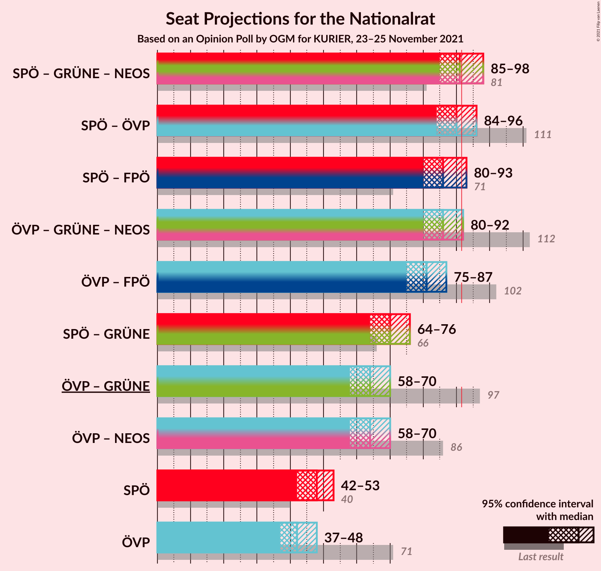
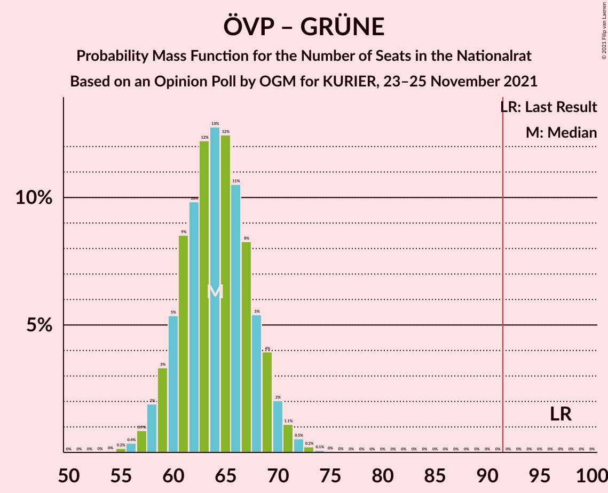

# Opinion Poll by OGM for KURIER, 23–25 November 2021

<a href="#voting-intentions">Voting Intentions</a> | <a href="#seats">Seats</a> | <a href="#coalitions">Coalitions</a> | <a href="#technical-information">Technical Information</a>

## Voting Intentions

### Confidence Intervals

| Party | Last Result | Poll Result | 80% Confidence Interval | 90% Confidence Interval | 95% Confidence Interval | 99% Confidence Interval |
|:-----:|:-----------:|:-----------:|:-----------------------:|:-----------------------:|:-----------------------:|:-----------------------:|
| Sozialdemokratische Partei Österreichs | 21.2% | 26.0% | 24.2–28.1% |23.6–28.6% |23.2–29.1% |22.3–30.1% |
| Österreichische Volkspartei | 37.5% | 23.1% | 21.3–25.0% |20.8–25.6% |20.3–26.0% |19.5–27.0% |
| Freiheitliche Partei Österreichs | 16.2% | 21.0% | 19.3–22.9% |18.8–23.5% |18.4–23.9% |17.6–24.9% |
| NEOS–Das Neue Österreich und Liberales Forum | 8.1% | 11.9% | 10.6–13.5% |10.2–13.9% |9.9–14.3% |9.3–15.1% |
| Die Grünen–Die Grüne Alternative | 13.9% | 11.9% | 10.6–13.5% |10.2–13.9% |9.9–14.3% |9.3–15.1% |

*Note:* The poll result column reflects the actual value used in the calculations. Published results may vary slightly, and in addition be rounded to fewer digits.

## Seats

### Confidence Intervals

| Party | Last Result | Median | 80% Confidence Interval | 90% Confidence Interval | 95% Confidence Interval | 99% Confidence Interval |
|:-----:|:-----------:|:------:|:-----------------------:|:-----------------------:|:-----------------------:|:-----------------------:|
| <a href="#sozialdemokratische-partei-österreichs">Sozialdemokratische Partei Österreichs</a> | 40 | 48 | 44–51 |43–53 |42–53 |41–55 |
| <a href="#österreichische-volkspartei">Österreichische Volkspartei</a> | 71 | 42 | 39–46 |38–47 |37–48 |36–49 |
| <a href="#freiheitliche-partei-österreichs">Freiheitliche Partei Österreichs</a> | 31 | 39 | 35–42 |34–43 |34–44 |32–46 |
| <a href="#neos–das-neue-österreich-und-liberales-forum">NEOS–Das Neue Österreich und Liberales Forum</a> | 15 | 23 | 20–24 |19–26 |17–26 |17–27 |
| <a href="#die-grünen–die-grüne-alternative">Die Grünen–Die Grüne Alternative</a> | 26 | 22 | 19–25 |18–25 |18–26 |17–27 |

### Sozialdemokratische Partei Österreichs

*For a full overview of the results for this party, see the [Sozialdemokratische Partei Österreichs](party-sozialdemokratischeparteiösterreichs.html) page.*

| Number of Seats | Probability | Accumulated | Special Marks |
|:---------------:|:-----------:|:-----------:|:-------------:|
| 39 | 0.1% | 100% |  |
| 40 | 0.3% | 99.9% | Last Result |
| 41 | 0.7% | 99.6% |  |
| 42 | 2% | 99.0% |  |
| 43 | 3% | 97% |  |
| 44 | 6% | 94% |  |
| 45 | 9% | 88% |  |
| 46 | 12% | 79% |  |
| 47 | 14% | 68% |  |
| 48 | 14% | 54% | Median |
| 49 | 13% | 40% |  |
| 50 | 10% | 27% |  |
| 51 | 7% | 17% |  |
| 52 | 5% | 10% |  |
| 53 | 3% | 5% |  |
| 54 | 1.4% | 2% |  |
| 55 | 0.6% | 1.0% |  |
| 56 | 0.3% | 0.4% |  |
| 57 | 0.1% | 0.1% |  |
| 58 | 0% | 0% |  |

### Österreichische Volkspartei

*For a full overview of the results for this party, see the [Österreichische Volkspartei](party-österreichischevolkspartei.html) page.*

| Number of Seats | Probability | Accumulated | Special Marks |
|:---------------:|:-----------:|:-----------:|:-------------:|
| 34 | 0.1% | 100% |  |
| 35 | 0.3% | 99.9% |  |
| 36 | 0.9% | 99.6% |  |
| 37 | 2% | 98.7% |  |
| 38 | 4% | 97% |  |
| 39 | 7% | 92% |  |
| 40 | 11% | 85% |  |
| 41 | 13% | 75% |  |
| 42 | 14% | 61% | Median |
| 43 | 14% | 47% |  |
| 44 | 12% | 33% |  |
| 45 | 9% | 21% |  |
| 46 | 6% | 12% |  |
| 47 | 3% | 6% |  |
| 48 | 2% | 3% |  |
| 49 | 0.8% | 1.3% |  |
| 50 | 0.3% | 0.5% |  |
| 51 | 0.1% | 0.2% |  |
| 52 | 0% | 0.1% |  |
| 53 | 0% | 0% |  |
| 54 | 0% | 0% |  |
| 55 | 0% | 0% |  |
| 56 | 0% | 0% |  |
| 57 | 0% | 0% |  |
| 58 | 0% | 0% |  |
| 59 | 0% | 0% |  |
| 60 | 0% | 0% |  |
| 61 | 0% | 0% |  |
| 62 | 0% | 0% |  |
| 63 | 0% | 0% |  |
| 64 | 0% | 0% |  |
| 65 | 0% | 0% |  |
| 66 | 0% | 0% |  |
| 67 | 0% | 0% |  |
| 68 | 0% | 0% |  |
| 69 | 0% | 0% |  |
| 70 | 0% | 0% |  |
| 71 | 0% | 0% | Last Result |

### Freiheitliche Partei Österreichs

*For a full overview of the results for this party, see the [Freiheitliche Partei Österreichs](party-freiheitlicheparteiösterreichs.html) page.*

| Number of Seats | Probability | Accumulated | Special Marks |
|:---------------:|:-----------:|:-----------:|:-------------:|
| 30 | 0% | 100% |  |
| 31 | 0.2% | 99.9% | Last Result |
| 32 | 0.6% | 99.8% |  |
| 33 | 1.5% | 99.2% |  |
| 34 | 3% | 98% |  |
| 35 | 6% | 94% |  |
| 36 | 10% | 88% |  |
| 37 | 13% | 78% |  |
| 38 | 15% | 65% |  |
| 39 | 15% | 50% | Median |
| 40 | 13% | 35% |  |
| 41 | 9% | 22% |  |
| 42 | 6% | 13% |  |
| 43 | 4% | 7% |  |
| 44 | 2% | 3% |  |
| 45 | 0.9% | 1.4% |  |
| 46 | 0.3% | 0.5% |  |
| 47 | 0.1% | 0.2% |  |
| 48 | 0% | 0.1% |  |
| 49 | 0% | 0% |  |

### NEOS–Das Neue Österreich und Liberales Forum

*For a full overview of the results for this party, see the [NEOS–Das Neue Österreich und Liberales Forum](party-neos–dasneueösterreichundliberalesforum.html) page.*

| Number of Seats | Probability | Accumulated | Special Marks |
|:---------------:|:-----------:|:-----------:|:-------------:|
| 15 | 0% | 100% | Last Result |
| 16 | 0% | 100% |  |
| 17 | 3% | 100% |  |
| 18 | 1.5% | 97% |  |
| 19 | 0.6% | 95% |  |
| 20 | 36% | 95% |  |
| 21 | 5% | 59% |  |
| 22 | 3% | 54% |  |
| 23 | 40% | 51% | Median |
| 24 | 1.4% | 11% |  |
| 25 | 2% | 9% |  |
| 26 | 7% | 7% |  |
| 27 | 0.1% | 0.5% |  |
| 28 | 0.2% | 0.4% |  |
| 29 | 0.2% | 0.3% |  |
| 30 | 0% | 0% |  |

### Die Grünen–Die Grüne Alternative

*For a full overview of the results for this party, see the [Die Grünen–Die Grüne Alternative](party-diegrünen–diegrünealternative.html) page.*

| Number of Seats | Probability | Accumulated | Special Marks |
|:---------------:|:-----------:|:-----------:|:-------------:|
| 16 | 0.3% | 100% |  |
| 17 | 1.1% | 99.7% |  |
| 18 | 4% | 98.5% |  |
| 19 | 9% | 95% |  |
| 20 | 14% | 86% |  |
| 21 | 17% | 72% |  |
| 22 | 19% | 54% | Median |
| 23 | 15% | 36% |  |
| 24 | 11% | 21% |  |
| 25 | 6% | 10% |  |
| 26 | 2% | 4% | Last Result |
| 27 | 1.0% | 1.5% |  |
| 28 | 0.3% | 0.5% |  |
| 29 | 0.1% | 0.1% |  |
| 30 | 0% | 0% |  |

## Coalitions

### Confidence Intervals

| Coalition | Last Result | Median | Majority? | 80% Confidence Interval | 90% Confidence Interval | 95% Confidence Interval | 99% Confidence Interval |
|:---------:|:-----------:|:------:|:---------:|:-----------------------:|:-----------------------:|:-----------------------:|:-----------------------:|
| Sozialdemokratische Partei Österreichs – Die Grünen–Die Grüne Alternative – NEOS–Das Neue Österreich und Liberales Forum | 81 | 91 | 49% | 87–96 | 86–97 | 85–98 | 83–100 |
| Sozialdemokratische Partei Österreichs – Österreichische Volkspartei | 111 | 90 | 34% | 86–94 | 85–95 | 84–96 | 82–98 |
| Sozialdemokratische Partei Österreichs – Freiheitliche Partei Österreichs | 71 | 86 | 5% | 82–90 | 81–92 | 80–93 | 78–95 |
| Österreichische Volkspartei – Die Grünen–Die Grüne Alternative – NEOS–Das Neue Österreich und Liberales Forum | 112 | 86 | 4% | 82–90 | 81–91 | 80–92 | 78–94 |
| Österreichische Volkspartei – Freiheitliche Partei Österreichs | 102 | 81 | 0.1% | 77–85 | 76–86 | 75–87 | 73–89 |
| Sozialdemokratische Partei Österreichs – Die Grünen–Die Grüne Alternative | 66 | 70 | 0% | 66–74 | 64–75 | 64–76 | 62–78 |
| Österreichische Volkspartei – Die Grünen–Die Grüne Alternative | 97 | 64 | 0% | 60–68 | 59–69 | 58–70 | 56–72 |
| Österreichische Volkspartei – NEOS–Das Neue Österreich und Liberales Forum | 86 | 64 | 0% | 60–68 | 59–69 | 58–70 | 56–72 |
| Sozialdemokratische Partei Österreichs | 40 | 48 | 0% | 44–51 | 43–53 | 42–53 | 41–55 |
| Österreichische Volkspartei | 71 | 42 | 0% | 39–46 | 38–47 | 37–48 | 36–49 |

### Sozialdemokratische Partei Österreichs – Die Grünen–Die Grüne Alternative – NEOS–Das Neue Österreich und Liberales Forum

| Number of Seats | Probability | Accumulated | Special Marks |
|:---------------:|:-----------:|:-----------:|:-------------:|
| 81 | 0.1% | 100% | Last Result |
| 82 | 0.2% | 99.9% |  |
| 83 | 0.4% | 99.7% |  |
| 84 | 0.9% | 99.3% |  |
| 85 | 2% | 98% |  |
| 86 | 3% | 97% |  |
| 87 | 5% | 94% |  |
| 88 | 7% | 89% |  |
| 89 | 9% | 82% |  |
| 90 | 11% | 72% |  |
| 91 | 12% | 61% |  |
| 92 | 12% | 49% | Majority |
| 93 | 11% | 37% | Median |
| 94 | 8% | 25% |  |
| 95 | 7% | 17% |  |
| 96 | 5% | 10% |  |
| 97 | 3% | 6% |  |
| 98 | 2% | 3% |  |
| 99 | 0.8% | 1.4% |  |
| 100 | 0.4% | 0.6% |  |
| 101 | 0.2% | 0.3% |  |
| 102 | 0.1% | 0.1% |  |
| 103 | 0% | 0% |  |

### Sozialdemokratische Partei Österreichs – Österreichische Volkspartei

| Number of Seats | Probability | Accumulated | Special Marks |
|:---------------:|:-----------:|:-----------:|:-------------:|
| 80 | 0.1% | 100% |  |
| 81 | 0.2% | 99.9% |  |
| 82 | 0.5% | 99.7% |  |
| 83 | 1.1% | 99.1% |  |
| 84 | 2% | 98% |  |
| 85 | 3% | 96% |  |
| 86 | 5% | 93% |  |
| 87 | 8% | 87% |  |
| 88 | 10% | 80% |  |
| 89 | 12% | 69% |  |
| 90 | 12% | 58% | Median |
| 91 | 12% | 46% |  |
| 92 | 10% | 34% | Majority |
| 93 | 9% | 23% |  |
| 94 | 6% | 15% |  |
| 95 | 4% | 9% |  |
| 96 | 2% | 5% |  |
| 97 | 1.3% | 2% |  |
| 98 | 0.6% | 1.1% |  |
| 99 | 0.3% | 0.5% |  |
| 100 | 0.1% | 0.2% |  |
| 101 | 0% | 0.1% |  |
| 102 | 0% | 0% |  |
| 103 | 0% | 0% |  |
| 104 | 0% | 0% |  |
| 105 | 0% | 0% |  |
| 106 | 0% | 0% |  |
| 107 | 0% | 0% |  |
| 108 | 0% | 0% |  |
| 109 | 0% | 0% |  |
| 110 | 0% | 0% |  |
| 111 | 0% | 0% | Last Result |

### Sozialdemokratische Partei Österreichs – Freiheitliche Partei Österreichs

| Number of Seats | Probability | Accumulated | Special Marks |
|:---------------:|:-----------:|:-----------:|:-------------:|
| 71 | 0% | 100% | Last Result |
| 72 | 0% | 100% |  |
| 73 | 0% | 100% |  |
| 74 | 0% | 100% |  |
| 75 | 0% | 100% |  |
| 76 | 0.1% | 100% |  |
| 77 | 0.2% | 99.9% |  |
| 78 | 0.4% | 99.7% |  |
| 79 | 0.9% | 99.3% |  |
| 80 | 2% | 98% |  |
| 81 | 3% | 97% |  |
| 82 | 5% | 94% |  |
| 83 | 7% | 89% |  |
| 84 | 10% | 82% |  |
| 85 | 11% | 72% |  |
| 86 | 12% | 61% |  |
| 87 | 13% | 49% | Median |
| 88 | 11% | 36% |  |
| 89 | 9% | 25% |  |
| 90 | 7% | 17% |  |
| 91 | 5% | 10% |  |
| 92 | 3% | 5% | Majority |
| 93 | 1.5% | 3% |  |
| 94 | 0.7% | 1.4% |  |
| 95 | 0.4% | 0.6% |  |
| 96 | 0.2% | 0.2% |  |
| 97 | 0.1% | 0.1% |  |
| 98 | 0% | 0% |  |

### Österreichische Volkspartei – Die Grünen–Die Grüne Alternative – NEOS–Das Neue Österreich und Liberales Forum

| Number of Seats | Probability | Accumulated | Special Marks |
|:---------------:|:-----------:|:-----------:|:-------------:|
| 75 | 0% | 100% |  |
| 76 | 0.1% | 99.9% |  |
| 77 | 0.3% | 99.8% |  |
| 78 | 0.6% | 99.6% |  |
| 79 | 1.3% | 99.0% |  |
| 80 | 2% | 98% |  |
| 81 | 4% | 96% |  |
| 82 | 6% | 91% |  |
| 83 | 8% | 86% |  |
| 84 | 11% | 77% |  |
| 85 | 12% | 67% |  |
| 86 | 12% | 54% |  |
| 87 | 11% | 42% | Median |
| 88 | 11% | 31% |  |
| 89 | 8% | 20% |  |
| 90 | 5% | 13% |  |
| 91 | 3% | 8% |  |
| 92 | 2% | 4% | Majority |
| 93 | 1.0% | 2% |  |
| 94 | 0.5% | 0.9% |  |
| 95 | 0.2% | 0.4% |  |
| 96 | 0.1% | 0.2% |  |
| 97 | 0% | 0.1% |  |
| 98 | 0% | 0% |  |
| 99 | 0% | 0% |  |
| 100 | 0% | 0% |  |
| 101 | 0% | 0% |  |
| 102 | 0% | 0% |  |
| 103 | 0% | 0% |  |
| 104 | 0% | 0% |  |
| 105 | 0% | 0% |  |
| 106 | 0% | 0% |  |
| 107 | 0% | 0% |  |
| 108 | 0% | 0% |  |
| 109 | 0% | 0% |  |
| 110 | 0% | 0% |  |
| 111 | 0% | 0% |  |
| 112 | 0% | 0% | Last Result |

### Österreichische Volkspartei – Freiheitliche Partei Österreichs

| Number of Seats | Probability | Accumulated | Special Marks |
|:---------------:|:-----------:|:-----------:|:-------------:|
| 71 | 0.1% | 100% |  |
| 72 | 0.3% | 99.9% |  |
| 73 | 0.6% | 99.6% |  |
| 74 | 1.2% | 99.0% |  |
| 75 | 2% | 98% |  |
| 76 | 4% | 95% |  |
| 77 | 6% | 92% |  |
| 78 | 8% | 86% |  |
| 79 | 11% | 77% |  |
| 80 | 12% | 66% |  |
| 81 | 12% | 54% | Median |
| 82 | 12% | 42% |  |
| 83 | 10% | 30% |  |
| 84 | 8% | 21% |  |
| 85 | 5% | 12% |  |
| 86 | 3% | 7% |  |
| 87 | 2% | 4% |  |
| 88 | 1.0% | 2% |  |
| 89 | 0.5% | 0.9% |  |
| 90 | 0.2% | 0.4% |  |
| 91 | 0.1% | 0.1% |  |
| 92 | 0% | 0.1% | Majority |
| 93 | 0% | 0% |  |
| 94 | 0% | 0% |  |
| 95 | 0% | 0% |  |
| 96 | 0% | 0% |  |
| 97 | 0% | 0% |  |
| 98 | 0% | 0% |  |
| 99 | 0% | 0% |  |
| 100 | 0% | 0% |  |
| 101 | 0% | 0% |  |
| 102 | 0% | 0% | Last Result |

### Sozialdemokratische Partei Österreichs – Die Grünen–Die Grüne Alternative

| Number of Seats | Probability | Accumulated | Special Marks |
|:---------------:|:-----------:|:-----------:|:-------------:|
| 60 | 0.1% | 100% |  |
| 61 | 0.3% | 99.8% |  |
| 62 | 0.6% | 99.6% |  |
| 63 | 1.4% | 99.0% |  |
| 64 | 3% | 98% |  |
| 65 | 4% | 95% |  |
| 66 | 7% | 91% | Last Result |
| 67 | 9% | 84% |  |
| 68 | 11% | 75% |  |
| 69 | 12% | 64% |  |
| 70 | 13% | 51% | Median |
| 71 | 10% | 38% |  |
| 72 | 10% | 28% |  |
| 73 | 7% | 18% |  |
| 74 | 4% | 11% |  |
| 75 | 3% | 6% |  |
| 76 | 2% | 3% |  |
| 77 | 0.8% | 1.5% |  |
| 78 | 0.4% | 0.6% |  |
| 79 | 0.2% | 0.3% |  |
| 80 | 0.1% | 0.1% |  |
| 81 | 0% | 0% |  |

### Österreichische Volkspartei – Die Grünen–Die Grüne Alternative

| Number of Seats | Probability | Accumulated | Special Marks |
|:---------------:|:-----------:|:-----------:|:-------------:|
| 54 | 0% | 100% |  |
| 55 | 0.2% | 99.9% |  |
| 56 | 0.4% | 99.8% |  |
| 57 | 0.9% | 99.4% |  |
| 58 | 2% | 98.6% |  |
| 59 | 3% | 97% |  |
| 60 | 5% | 93% |  |
| 61 | 9% | 88% |  |
| 62 | 10% | 79% |  |
| 63 | 12% | 70% |  |
| 64 | 13% | 57% | Median |
| 65 | 12% | 45% |  |
| 66 | 11% | 32% |  |
| 67 | 8% | 22% |  |
| 68 | 5% | 13% |  |
| 69 | 4% | 8% |  |
| 70 | 2% | 4% |  |
| 71 | 1.1% | 2% |  |
| 72 | 0.5% | 0.9% |  |
| 73 | 0.2% | 0.4% |  |
| 74 | 0.1% | 0.1% |  |
| 75 | 0% | 0.1% |  |
| 76 | 0% | 0% |  |
| 77 | 0% | 0% |  |
| 78 | 0% | 0% |  |
| 79 | 0% | 0% |  |
| 80 | 0% | 0% |  |
| 81 | 0% | 0% |  |
| 82 | 0% | 0% |  |
| 83 | 0% | 0% |  |
| 84 | 0% | 0% |  |
| 85 | 0% | 0% |  |
| 86 | 0% | 0% |  |
| 87 | 0% | 0% |  |
| 88 | 0% | 0% |  |
| 89 | 0% | 0% |  |
| 90 | 0% | 0% |  |
| 91 | 0% | 0% |  |
| 92 | 0% | 0% | Majority |
| 93 | 0% | 0% |  |
| 94 | 0% | 0% |  |
| 95 | 0% | 0% |  |
| 96 | 0% | 0% |  |
| 97 | 0% | 0% | Last Result |

### Österreichische Volkspartei – NEOS–Das Neue Österreich und Liberales Forum

| Number of Seats | Probability | Accumulated | Special Marks |
|:---------------:|:-----------:|:-----------:|:-------------:|
| 54 | 0.1% | 100% |  |
| 55 | 0.1% | 99.9% |  |
| 56 | 0.4% | 99.8% |  |
| 57 | 0.9% | 99.4% |  |
| 58 | 2% | 98.5% |  |
| 59 | 3% | 97% |  |
| 60 | 5% | 93% |  |
| 61 | 8% | 88% |  |
| 62 | 10% | 80% |  |
| 63 | 12% | 70% |  |
| 64 | 13% | 57% |  |
| 65 | 12% | 44% | Median |
| 66 | 11% | 32% |  |
| 67 | 8% | 22% |  |
| 68 | 6% | 14% |  |
| 69 | 4% | 8% |  |
| 70 | 2% | 4% |  |
| 71 | 1.1% | 2% |  |
| 72 | 0.5% | 0.9% |  |
| 73 | 0.2% | 0.4% |  |
| 74 | 0.1% | 0.1% |  |
| 75 | 0% | 0% |  |
| 76 | 0% | 0% |  |
| 77 | 0% | 0% |  |
| 78 | 0% | 0% |  |
| 79 | 0% | 0% |  |
| 80 | 0% | 0% |  |
| 81 | 0% | 0% |  |
| 82 | 0% | 0% |  |
| 83 | 0% | 0% |  |
| 84 | 0% | 0% |  |
| 85 | 0% | 0% |  |
| 86 | 0% | 0% | Last Result |

### Sozialdemokratische Partei Österreichs

| Number of Seats | Probability | Accumulated | Special Marks |
|:---------------:|:-----------:|:-----------:|:-------------:|
| 39 | 0.1% | 100% |  |
| 40 | 0.3% | 99.9% | Last Result |
| 41 | 0.7% | 99.6% |  |
| 42 | 2% | 99.0% |  |
| 43 | 3% | 97% |  |
| 44 | 6% | 94% |  |
| 45 | 9% | 88% |  |
| 46 | 12% | 79% |  |
| 47 | 14% | 68% |  |
| 48 | 14% | 54% | Median |
| 49 | 13% | 40% |  |
| 50 | 10% | 27% |  |
| 51 | 7% | 17% |  |
| 52 | 5% | 10% |  |
| 53 | 3% | 5% |  |
| 54 | 1.4% | 2% |  |
| 55 | 0.6% | 1.0% |  |
| 56 | 0.3% | 0.4% |  |
| 57 | 0.1% | 0.1% |  |
| 58 | 0% | 0% |  |

### Österreichische Volkspartei

| Number of Seats | Probability | Accumulated | Special Marks |
|:---------------:|:-----------:|:-----------:|:-------------:|
| 34 | 0.1% | 100% |  |
| 35 | 0.3% | 99.9% |  |
| 36 | 0.9% | 99.6% |  |
| 37 | 2% | 98.7% |  |
| 38 | 4% | 97% |  |
| 39 | 7% | 92% |  |
| 40 | 11% | 85% |  |
| 41 | 13% | 75% |  |
| 42 | 14% | 61% | Median |
| 43 | 14% | 47% |  |
| 44 | 12% | 33% |  |
| 45 | 9% | 21% |  |
| 46 | 6% | 12% |  |
| 47 | 3% | 6% |  |
| 48 | 2% | 3% |  |
| 49 | 0.8% | 1.3% |  |
| 50 | 0.3% | 0.5% |  |
| 51 | 0.1% | 0.2% |  |
| 52 | 0% | 0.1% |  |
| 53 | 0% | 0% |  |
| 54 | 0% | 0% |  |
| 55 | 0% | 0% |  |
| 56 | 0% | 0% |  |
| 57 | 0% | 0% |  |
| 58 | 0% | 0% |  |
| 59 | 0% | 0% |  |
| 60 | 0% | 0% |  |
| 61 | 0% | 0% |  |
| 62 | 0% | 0% |  |
| 63 | 0% | 0% |  |
| 64 | 0% | 0% |  |
| 65 | 0% | 0% |  |
| 66 | 0% | 0% |  |
| 67 | 0% | 0% |  |
| 68 | 0% | 0% |  |
| 69 | 0% | 0% |  |
| 70 | 0% | 0% |  |
| 71 | 0% | 0% | Last Result |

## Technical Information

### Opinion Poll

+ **Polling firm:** OGM
+ **Commissioner(s):** KURIER
+ **Fieldwork period:** 23–25 November 2021

### Calculations

+ **Sample size:** 837
+ **Simulations done:** 1,048,576
+ **Error estimate:** 0.30%

