# Opinion Poll by IFDD for PULS 24, 6–9 December 2021

<a href="#voting-intentions">Voting Intentions</a> | <a href="#seats">Seats</a> | <a href="#coalitions">Coalitions</a> | <a href="#technical-information">Technical Information</a>

## Voting Intentions

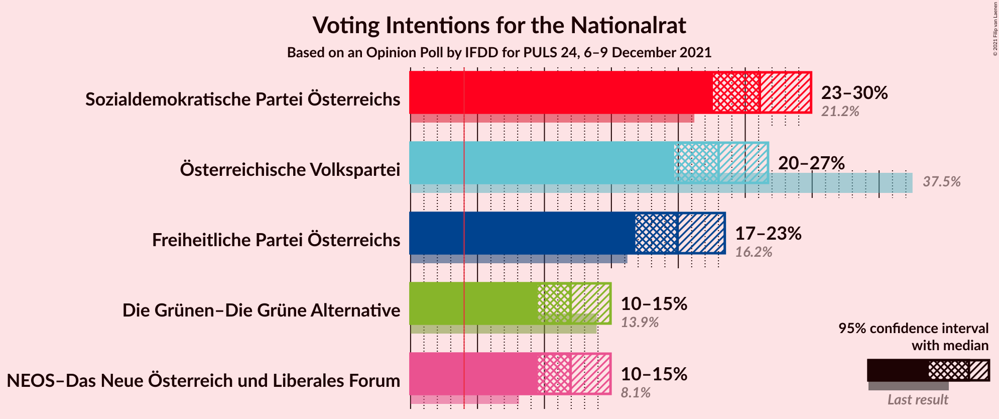

### Confidence Intervals

| Party | Last Result | Poll Result | 80% Confidence Interval | 90% Confidence Interval | 95% Confidence Interval | 99% Confidence Interval |
|:-----:|:-----------:|:-----------:|:-----------------------:|:-----------------------:|:-----------------------:|:-----------------------:|
| Sozialdemokratische Partei Österreichs | 21.2% | 26.1% | 23.8–28.6% |23.2–29.3% |22.6–29.9% |21.5–31.1% |
| Österreichische Volkspartei | 37.5% | 23.0% | 20.8–25.4% |20.2–26.1% |19.7–26.7% |18.7–27.9% |
| Freiheitliche Partei Österreichs | 16.2% | 19.9% | 17.9–22.2% |17.3–22.9% |16.8–23.5% |15.9–24.6% |
| NEOS–Das Neue Österreich und Liberales Forum | 8.1% | 12.0% | 10.3–13.9% |9.9–14.4% |9.5–14.9% |8.8–15.9% |
| Die Grünen–Die Grüne Alternative | 13.9% | 12.0% | 10.3–13.9% |9.9–14.4% |9.5–14.9% |8.8–15.9% |

*Note:* The poll result column reflects the actual value used in the calculations. Published results may vary slightly, and in addition be rounded to fewer digits.

## Seats

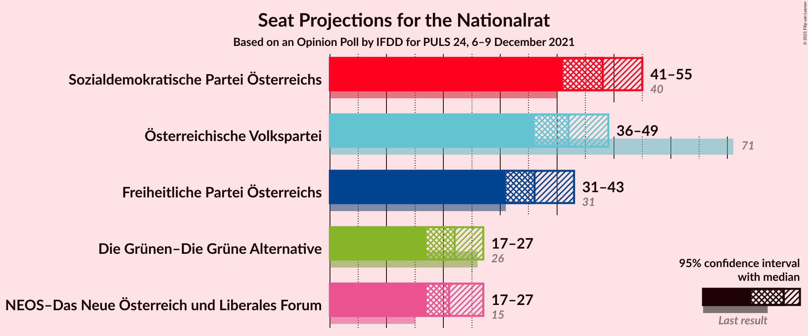

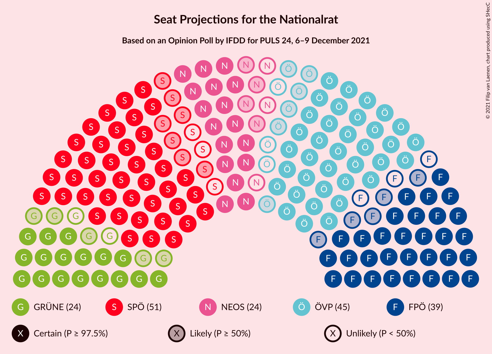

### Confidence Intervals

| Party | Last Result | Median | 80% Confidence Interval | 90% Confidence Interval | 95% Confidence Interval | 99% Confidence Interval |
|:-----:|:-----------:|:------:|:-----------------------:|:-----------------------:|:-----------------------:|:-----------------------:|
| <a href="#sozialdemokratische-partei-österreichs">Sozialdemokratische Partei Österreichs</a> | 40 | 48 | 43–52 |42–54 |41–55 |39–57 |
| <a href="#österreichische-volkspartei">Österreichische Volkspartei</a> | 71 | 42 | 38–46 |37–48 |36–49 |34–51 |
| <a href="#freiheitliche-partei-österreichs">Freiheitliche Partei Österreichs</a> | 31 | 36 | 32–41 |31–42 |31–43 |29–45 |
| <a href="#neos–das-neue-österreich-und-liberales-forum">NEOS–Das Neue Österreich und Liberales Forum</a> | 15 | 21 | 20–24 |17–27 |17–27 |16–28 |
| <a href="#die-grünen–die-grüne-alternative">Die Grünen–Die Grüne Alternative</a> | 26 | 22 | 19–25 |18–26 |17–27 |16–29 |

### Sozialdemokratische Partei Österreichs

*For a full overview of the results for this party, see the [Sozialdemokratische Partei Österreichs](party-sozialdemokratischeparteiösterreichs.html) page.*

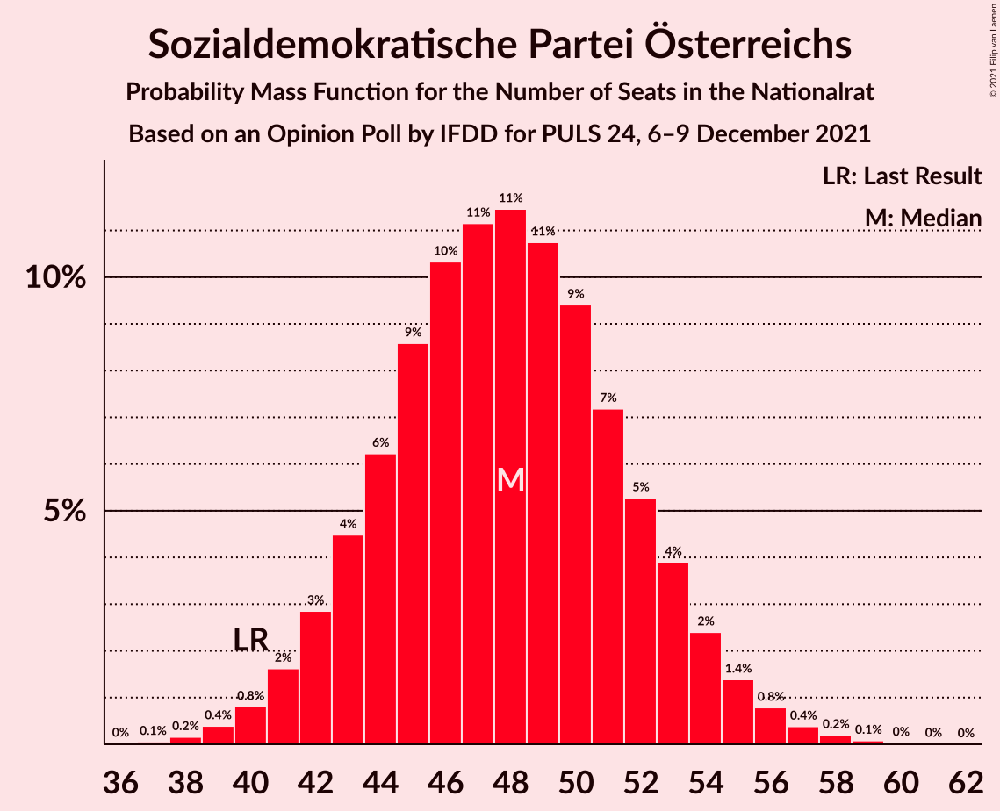

| Number of Seats | Probability | Accumulated | Special Marks |
|:---------------:|:-----------:|:-----------:|:-------------:|
| 37 | 0.1% | 100% |  |
| 38 | 0.2% | 99.9% |  |
| 39 | 0.4% | 99.8% |  |
| 40 | 0.8% | 99.4% | Last Result |
| 41 | 2% | 98.6% |  |
| 42 | 3% | 97% |  |
| 43 | 4% | 94% |  |
| 44 | 6% | 90% |  |
| 45 | 9% | 83% |  |
| 46 | 10% | 75% |  |
| 47 | 11% | 64% |  |
| 48 | 11% | 53% | Median |
| 49 | 11% | 42% |  |
| 50 | 9% | 31% |  |
| 51 | 7% | 22% |  |
| 52 | 5% | 14% |  |
| 53 | 4% | 9% |  |
| 54 | 2% | 5% |  |
| 55 | 1.4% | 3% |  |
| 56 | 0.8% | 2% |  |
| 57 | 0.4% | 0.7% |  |
| 58 | 0.2% | 0.3% |  |
| 59 | 0.1% | 0.1% |  |
| 60 | 0% | 0.1% |  |
| 61 | 0% | 0% |  |

### Österreichische Volkspartei

*For a full overview of the results for this party, see the [Österreichische Volkspartei](party-österreichischevolkspartei.html) page.*

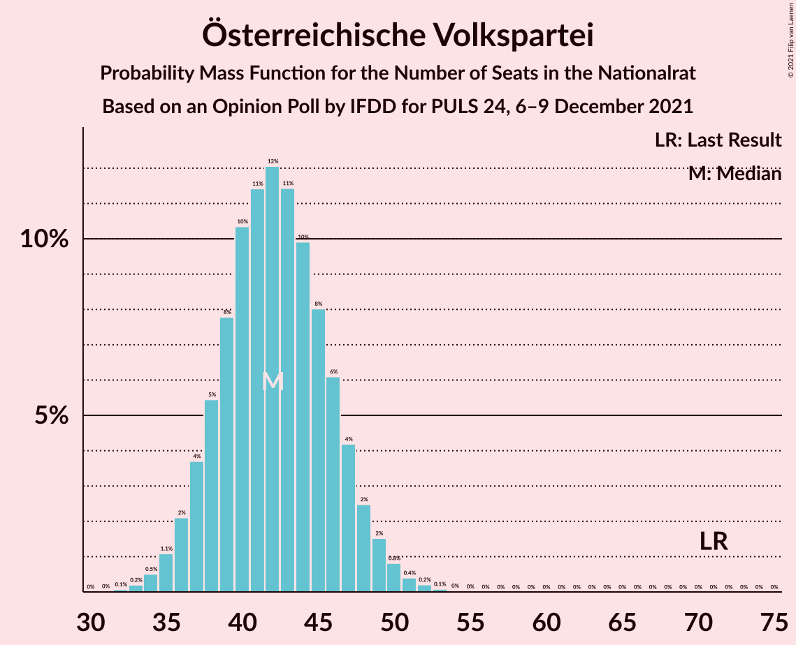

| Number of Seats | Probability | Accumulated | Special Marks |
|:---------------:|:-----------:|:-----------:|:-------------:|
| 32 | 0.1% | 100% |  |
| 33 | 0.2% | 99.9% |  |
| 34 | 0.5% | 99.7% |  |
| 35 | 1.1% | 99.2% |  |
| 36 | 2% | 98% |  |
| 37 | 4% | 96% |  |
| 38 | 5% | 92% |  |
| 39 | 8% | 87% |  |
| 40 | 10% | 79% |  |
| 41 | 11% | 69% |  |
| 42 | 12% | 57% | Median |
| 43 | 11% | 45% |  |
| 44 | 10% | 34% |  |
| 45 | 8% | 24% |  |
| 46 | 6% | 16% |  |
| 47 | 4% | 10% |  |
| 48 | 2% | 6% |  |
| 49 | 2% | 3% |  |
| 50 | 0.8% | 2% |  |
| 51 | 0.4% | 0.7% |  |
| 52 | 0.2% | 0.3% |  |
| 53 | 0.1% | 0.1% |  |
| 54 | 0% | 0.1% |  |
| 55 | 0% | 0% |  |
| 56 | 0% | 0% |  |
| 57 | 0% | 0% |  |
| 58 | 0% | 0% |  |
| 59 | 0% | 0% |  |
| 60 | 0% | 0% |  |
| 61 | 0% | 0% |  |
| 62 | 0% | 0% |  |
| 63 | 0% | 0% |  |
| 64 | 0% | 0% |  |
| 65 | 0% | 0% |  |
| 66 | 0% | 0% |  |
| 67 | 0% | 0% |  |
| 68 | 0% | 0% |  |
| 69 | 0% | 0% |  |
| 70 | 0% | 0% |  |
| 71 | 0% | 0% | Last Result |

### Freiheitliche Partei Österreichs

*For a full overview of the results for this party, see the [Freiheitliche Partei Österreichs](party-freiheitlicheparteiösterreichs.html) page.*

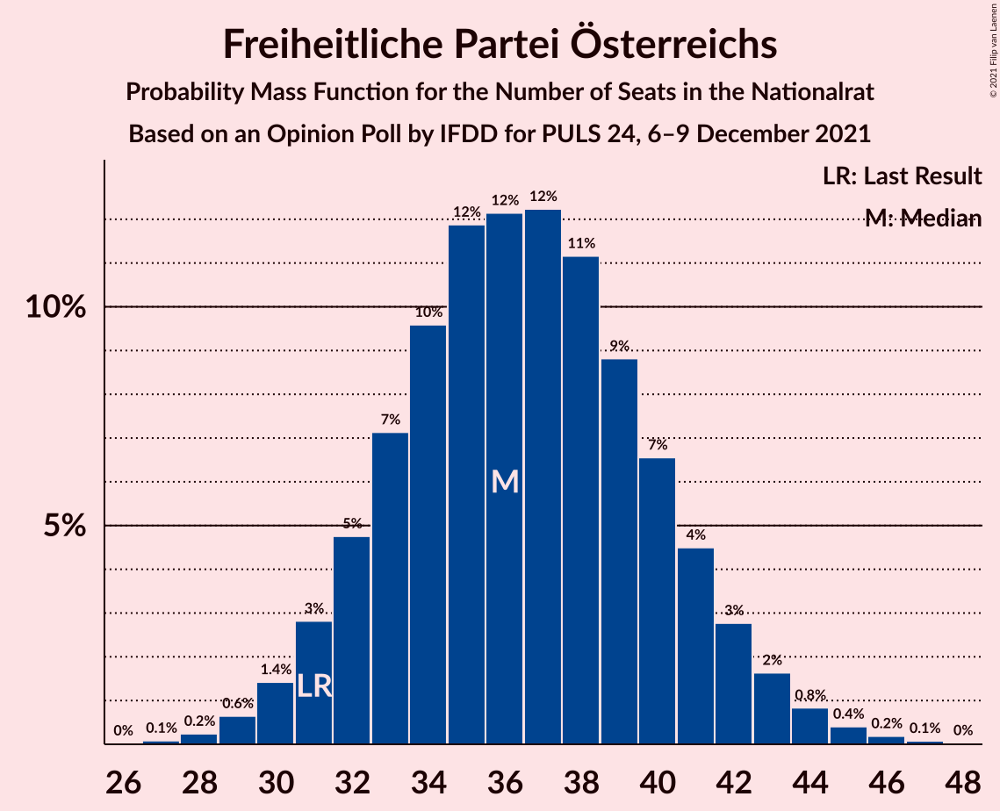

| Number of Seats | Probability | Accumulated | Special Marks |
|:---------------:|:-----------:|:-----------:|:-------------:|
| 27 | 0.1% | 100% |  |
| 28 | 0.2% | 99.9% |  |
| 29 | 0.6% | 99.6% |  |
| 30 | 1.4% | 99.0% |  |
| 31 | 3% | 98% | Last Result |
| 32 | 5% | 95% |  |
| 33 | 7% | 90% |  |
| 34 | 10% | 83% |  |
| 35 | 12% | 73% |  |
| 36 | 12% | 61% | Median |
| 37 | 12% | 49% |  |
| 38 | 11% | 37% |  |
| 39 | 9% | 26% |  |
| 40 | 7% | 17% |  |
| 41 | 4% | 10% |  |
| 42 | 3% | 6% |  |
| 43 | 2% | 3% |  |
| 44 | 0.8% | 2% |  |
| 45 | 0.4% | 0.7% |  |
| 46 | 0.2% | 0.3% |  |
| 47 | 0.1% | 0.1% |  |
| 48 | 0% | 0% |  |

### NEOS–Das Neue Österreich und Liberales Forum

*For a full overview of the results for this party, see the [NEOS–Das Neue Österreich und Liberales Forum](party-neos–dasneueösterreichundliberalesforum.html) page.*

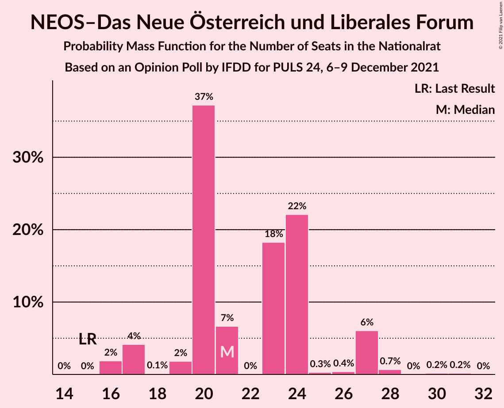

| Number of Seats | Probability | Accumulated | Special Marks |
|:---------------:|:-----------:|:-----------:|:-------------:|
| 15 | 0% | 100% | Last Result |
| 16 | 2% | 100% |  |
| 17 | 4% | 98% |  |
| 18 | 0.1% | 94% |  |
| 19 | 2% | 94% |  |
| 20 | 37% | 92% |  |
| 21 | 7% | 55% | Median |
| 22 | 0% | 48% |  |
| 23 | 18% | 48% |  |
| 24 | 22% | 30% |  |
| 25 | 0.3% | 8% |  |
| 26 | 0.4% | 7% |  |
| 27 | 6% | 7% |  |
| 28 | 0.7% | 1.0% |  |
| 29 | 0% | 0.3% |  |
| 30 | 0.2% | 0.3% |  |
| 31 | 0.2% | 0.2% |  |
| 32 | 0% | 0% |  |

### Die Grünen–Die Grüne Alternative

*For a full overview of the results for this party, see the [Die Grünen–Die Grüne Alternative](party-diegrünen–diegrünealternative.html) page.*

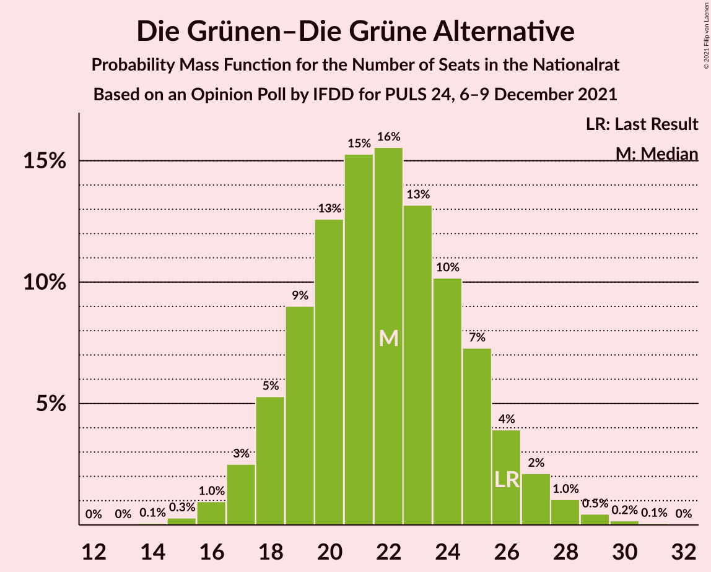

| Number of Seats | Probability | Accumulated | Special Marks |
|:---------------:|:-----------:|:-----------:|:-------------:|
| 14 | 0.1% | 100% |  |
| 15 | 0.3% | 99.9% |  |
| 16 | 1.0% | 99.6% |  |
| 17 | 3% | 98.7% |  |
| 18 | 5% | 96% |  |
| 19 | 9% | 91% |  |
| 20 | 13% | 82% |  |
| 21 | 15% | 69% |  |
| 22 | 16% | 54% | Median |
| 23 | 13% | 38% |  |
| 24 | 10% | 25% |  |
| 25 | 7% | 15% |  |
| 26 | 4% | 8% | Last Result |
| 27 | 2% | 4% |  |
| 28 | 1.0% | 2% |  |
| 29 | 0.5% | 0.7% |  |
| 30 | 0.2% | 0.3% |  |
| 31 | 0.1% | 0.1% |  |
| 32 | 0% | 0% |  |

## Coalitions

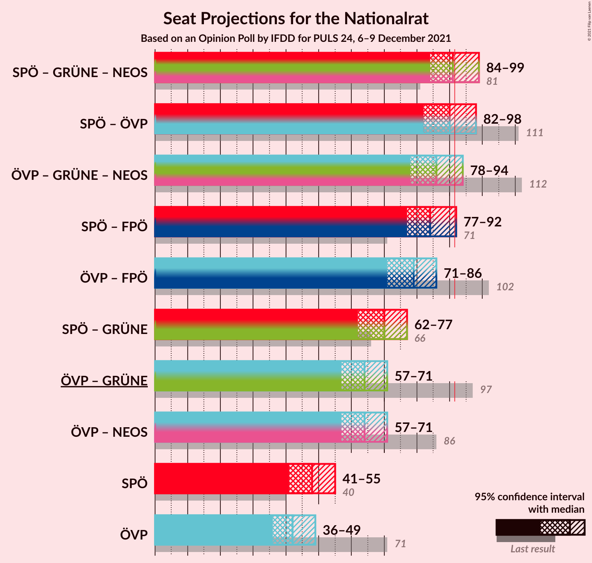

### Confidence Intervals

| Coalition | Last Result | Median | Majority? | 80% Confidence Interval | 90% Confidence Interval | 95% Confidence Interval | 99% Confidence Interval |
|:---------:|:-----------:|:------:|:---------:|:-----------------------:|:-----------------------:|:-----------------------:|:-----------------------:|
| Sozialdemokratische Partei Österreichs – Die Grünen–Die Grüne Alternative – NEOS–Das Neue Österreich und Liberales Forum | 81 | 91 | 50% | 86–97 | 85–98 | 84–99 | 81–102 |
| Sozialdemokratische Partei Österreichs – Österreichische Volkspartei | 111 | 90 | 35% | 85–95 | 84–96 | 82–98 | 80–100 |
| Österreichische Volkspartei – Die Grünen–Die Grüne Alternative – NEOS–Das Neue Österreich und Liberales Forum | 112 | 86 | 8% | 81–91 | 79–92 | 78–94 | 76–96 |
| Sozialdemokratische Partei Österreichs – Freiheitliche Partei Österreichs | 71 | 84 | 3% | 79–89 | 78–91 | 77–92 | 74–95 |
| Österreichische Volkspartei – Freiheitliche Partei Österreichs | 102 | 79 | 0.1% | 74–84 | 72–85 | 71–86 | 69–89 |
| Sozialdemokratische Partei Österreichs – Die Grünen–Die Grüne Alternative | 66 | 70 | 0% | 65–75 | 63–76 | 62–77 | 60–80 |
| Österreichische Volkspartei – Die Grünen–Die Grüne Alternative | 97 | 64 | 0% | 59–69 | 58–70 | 57–71 | 55–74 |
| Österreichische Volkspartei – NEOS–Das Neue Österreich und Liberales Forum | 86 | 64 | 0% | 59–69 | 58–70 | 57–71 | 55–74 |
| Sozialdemokratische Partei Österreichs | 40 | 48 | 0% | 43–52 | 42–54 | 41–55 | 39–57 |
| Österreichische Volkspartei | 71 | 42 | 0% | 38–46 | 37–48 | 36–49 | 34–51 |

### Sozialdemokratische Partei Österreichs – Die Grünen–Die Grüne Alternative – NEOS–Das Neue Österreich und Liberales Forum

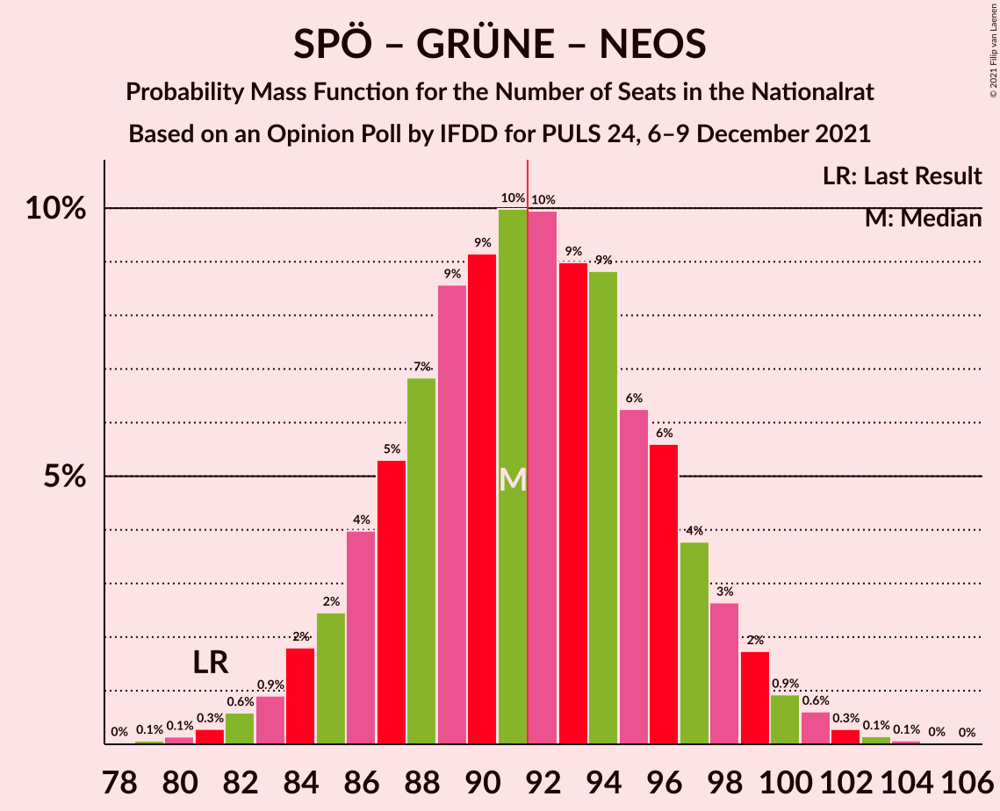

| Number of Seats | Probability | Accumulated | Special Marks |
|:---------------:|:-----------:|:-----------:|:-------------:|
| 79 | 0.1% | 100% |  |
| 80 | 0.1% | 99.9% |  |
| 81 | 0.3% | 99.7% | Last Result |
| 82 | 0.6% | 99.5% |  |
| 83 | 0.9% | 98.9% |  |
| 84 | 2% | 98% |  |
| 85 | 2% | 96% |  |
| 86 | 4% | 94% |  |
| 87 | 5% | 90% |  |
| 88 | 7% | 84% |  |
| 89 | 9% | 78% |  |
| 90 | 9% | 69% |  |
| 91 | 10% | 60% | Median |
| 92 | 10% | 50% | Majority |
| 93 | 9% | 40% |  |
| 94 | 9% | 31% |  |
| 95 | 6% | 22% |  |
| 96 | 6% | 16% |  |
| 97 | 4% | 10% |  |
| 98 | 3% | 6% |  |
| 99 | 2% | 4% |  |
| 100 | 0.9% | 2% |  |
| 101 | 0.6% | 1.2% |  |
| 102 | 0.3% | 0.5% |  |
| 103 | 0.1% | 0.3% |  |
| 104 | 0.1% | 0.1% |  |
| 105 | 0% | 0% |  |

### Sozialdemokratische Partei Österreichs – Österreichische Volkspartei

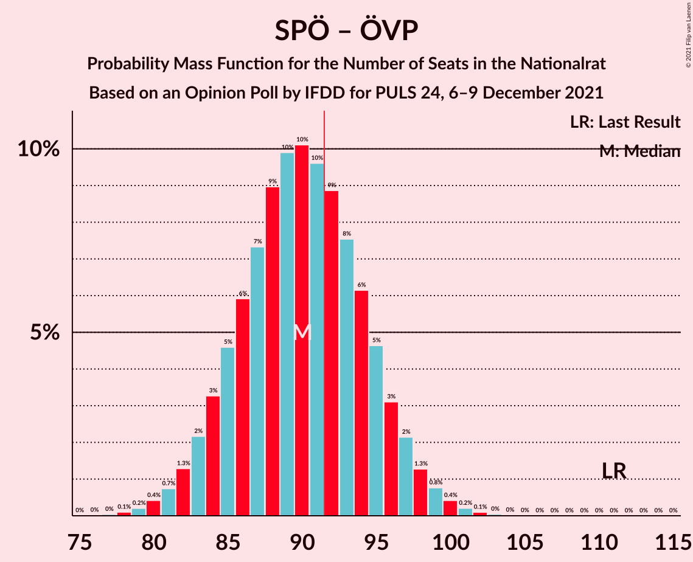

| Number of Seats | Probability | Accumulated | Special Marks |
|:---------------:|:-----------:|:-----------:|:-------------:|
| 77 | 0% | 100% |  |
| 78 | 0.1% | 99.9% |  |
| 79 | 0.2% | 99.8% |  |
| 80 | 0.4% | 99.6% |  |
| 81 | 0.7% | 99.2% |  |
| 82 | 1.3% | 98% |  |
| 83 | 2% | 97% |  |
| 84 | 3% | 95% |  |
| 85 | 5% | 92% |  |
| 86 | 6% | 87% |  |
| 87 | 7% | 81% |  |
| 88 | 9% | 74% |  |
| 89 | 10% | 65% |  |
| 90 | 10% | 55% | Median |
| 91 | 10% | 45% |  |
| 92 | 9% | 35% | Majority |
| 93 | 8% | 26% |  |
| 94 | 6% | 19% |  |
| 95 | 5% | 13% |  |
| 96 | 3% | 8% |  |
| 97 | 2% | 5% |  |
| 98 | 1.3% | 3% |  |
| 99 | 0.8% | 2% |  |
| 100 | 0.4% | 0.8% |  |
| 101 | 0.2% | 0.4% |  |
| 102 | 0.1% | 0.2% |  |
| 103 | 0% | 0.1% |  |
| 104 | 0% | 0% |  |
| 105 | 0% | 0% |  |
| 106 | 0% | 0% |  |
| 107 | 0% | 0% |  |
| 108 | 0% | 0% |  |
| 109 | 0% | 0% |  |
| 110 | 0% | 0% |  |
| 111 | 0% | 0% | Last Result |

### Österreichische Volkspartei – Die Grünen–Die Grüne Alternative – NEOS–Das Neue Österreich und Liberales Forum

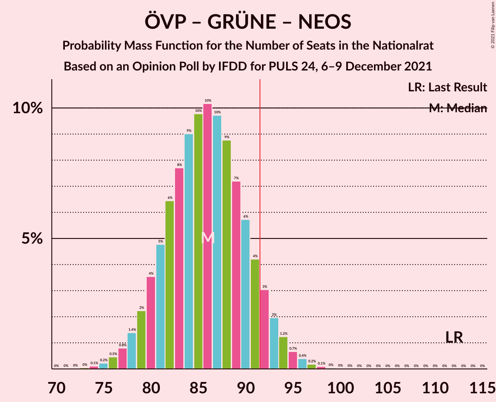

| Number of Seats | Probability | Accumulated | Special Marks |
|:---------------:|:-----------:|:-----------:|:-------------:|
| 73 | 0% | 100% |  |
| 74 | 0.1% | 99.9% |  |
| 75 | 0.2% | 99.8% |  |
| 76 | 0.5% | 99.6% |  |
| 77 | 0.8% | 99.1% |  |
| 78 | 1.4% | 98% |  |
| 79 | 2% | 97% |  |
| 80 | 4% | 95% |  |
| 81 | 5% | 91% |  |
| 82 | 6% | 86% |  |
| 83 | 8% | 80% |  |
| 84 | 9% | 72% |  |
| 85 | 10% | 63% | Median |
| 86 | 10% | 53% |  |
| 87 | 10% | 43% |  |
| 88 | 9% | 34% |  |
| 89 | 7% | 25% |  |
| 90 | 6% | 18% |  |
| 91 | 4% | 12% |  |
| 92 | 3% | 8% | Majority |
| 93 | 2% | 5% |  |
| 94 | 1.2% | 3% |  |
| 95 | 0.7% | 1.4% |  |
| 96 | 0.4% | 0.7% |  |
| 97 | 0.2% | 0.3% |  |
| 98 | 0.1% | 0.2% |  |
| 99 | 0% | 0.1% |  |
| 100 | 0% | 0% |  |
| 101 | 0% | 0% |  |
| 102 | 0% | 0% |  |
| 103 | 0% | 0% |  |
| 104 | 0% | 0% |  |
| 105 | 0% | 0% |  |
| 106 | 0% | 0% |  |
| 107 | 0% | 0% |  |
| 108 | 0% | 0% |  |
| 109 | 0% | 0% |  |
| 110 | 0% | 0% |  |
| 111 | 0% | 0% |  |
| 112 | 0% | 0% | Last Result |

### Sozialdemokratische Partei Österreichs – Freiheitliche Partei Österreichs

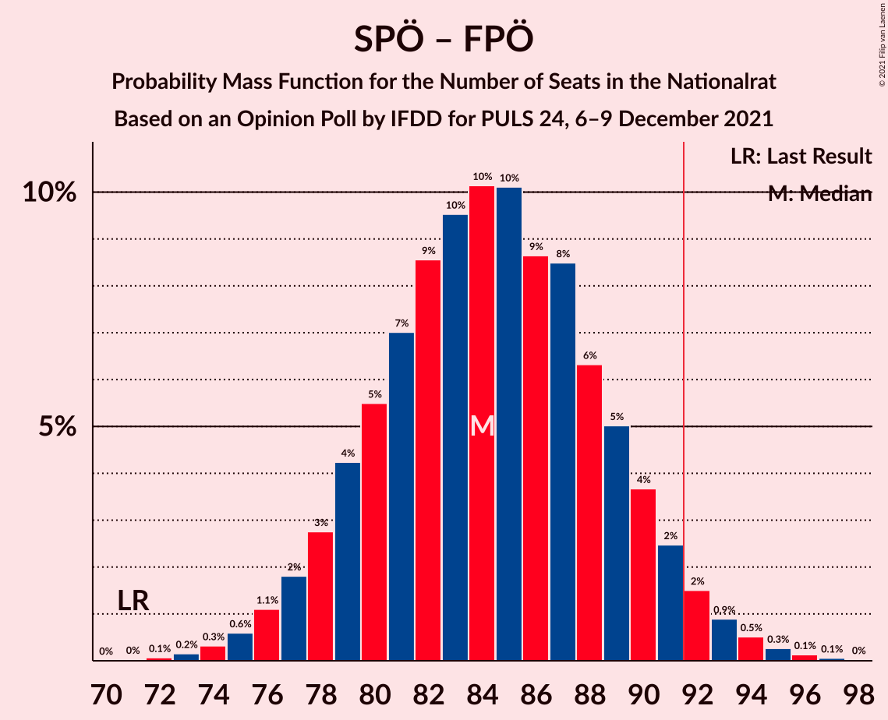

| Number of Seats | Probability | Accumulated | Special Marks |
|:---------------:|:-----------:|:-----------:|:-------------:|
| 71 | 0% | 100% | Last Result |
| 72 | 0.1% | 100% |  |
| 73 | 0.2% | 99.9% |  |
| 74 | 0.3% | 99.7% |  |
| 75 | 0.6% | 99.4% |  |
| 76 | 1.1% | 98.8% |  |
| 77 | 2% | 98% |  |
| 78 | 3% | 96% |  |
| 79 | 4% | 93% |  |
| 80 | 5% | 89% |  |
| 81 | 7% | 83% |  |
| 82 | 9% | 76% |  |
| 83 | 10% | 68% |  |
| 84 | 10% | 58% | Median |
| 85 | 10% | 48% |  |
| 86 | 9% | 38% |  |
| 87 | 8% | 29% |  |
| 88 | 6% | 21% |  |
| 89 | 5% | 15% |  |
| 90 | 4% | 10% |  |
| 91 | 2% | 6% |  |
| 92 | 2% | 3% | Majority |
| 93 | 0.9% | 2% |  |
| 94 | 0.5% | 1.0% |  |
| 95 | 0.3% | 0.5% |  |
| 96 | 0.1% | 0.2% |  |
| 97 | 0.1% | 0.1% |  |
| 98 | 0% | 0% |  |

### Österreichische Volkspartei – Freiheitliche Partei Österreichs

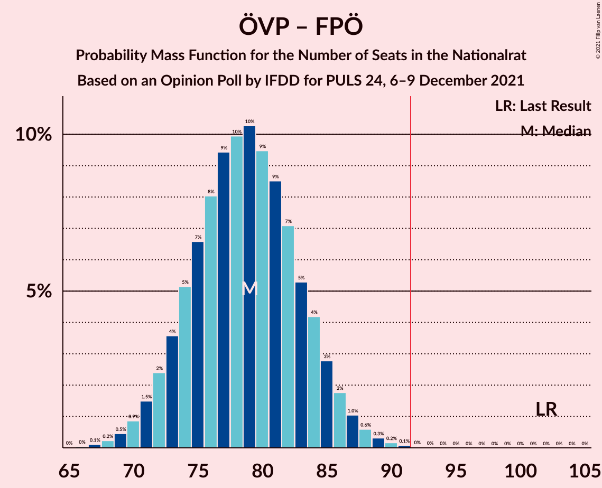

| Number of Seats | Probability | Accumulated | Special Marks |
|:---------------:|:-----------:|:-----------:|:-------------:|
| 66 | 0% | 100% |  |
| 67 | 0.1% | 99.9% |  |
| 68 | 0.2% | 99.8% |  |
| 69 | 0.5% | 99.6% |  |
| 70 | 0.9% | 99.1% |  |
| 71 | 1.5% | 98% |  |
| 72 | 2% | 97% |  |
| 73 | 4% | 94% |  |
| 74 | 5% | 91% |  |
| 75 | 7% | 86% |  |
| 76 | 8% | 79% |  |
| 77 | 9% | 71% |  |
| 78 | 10% | 62% | Median |
| 79 | 10% | 52% |  |
| 80 | 9% | 41% |  |
| 81 | 9% | 32% |  |
| 82 | 7% | 23% |  |
| 83 | 5% | 16% |  |
| 84 | 4% | 11% |  |
| 85 | 3% | 7% |  |
| 86 | 2% | 4% |  |
| 87 | 1.0% | 2% |  |
| 88 | 0.6% | 1.2% |  |
| 89 | 0.3% | 0.6% |  |
| 90 | 0.2% | 0.3% |  |
| 91 | 0.1% | 0.1% |  |
| 92 | 0% | 0.1% | Majority |
| 93 | 0% | 0% |  |
| 94 | 0% | 0% |  |
| 95 | 0% | 0% |  |
| 96 | 0% | 0% |  |
| 97 | 0% | 0% |  |
| 98 | 0% | 0% |  |
| 99 | 0% | 0% |  |
| 100 | 0% | 0% |  |
| 101 | 0% | 0% |  |
| 102 | 0% | 0% | Last Result |

### Sozialdemokratische Partei Österreichs – Die Grünen–Die Grüne Alternative

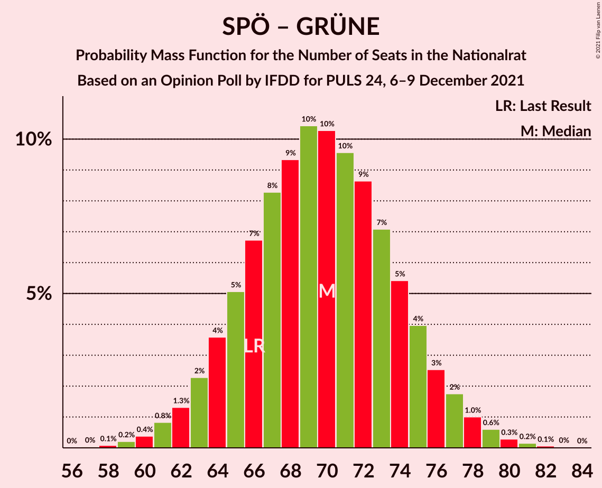

| Number of Seats | Probability | Accumulated | Special Marks |
|:---------------:|:-----------:|:-----------:|:-------------:|
| 57 | 0% | 100% |  |
| 58 | 0.1% | 99.9% |  |
| 59 | 0.2% | 99.9% |  |
| 60 | 0.4% | 99.7% |  |
| 61 | 0.8% | 99.3% |  |
| 62 | 1.3% | 98% |  |
| 63 | 2% | 97% |  |
| 64 | 4% | 95% |  |
| 65 | 5% | 91% |  |
| 66 | 7% | 86% | Last Result |
| 67 | 8% | 79% |  |
| 68 | 9% | 71% |  |
| 69 | 10% | 62% |  |
| 70 | 10% | 51% | Median |
| 71 | 10% | 41% |  |
| 72 | 9% | 32% |  |
| 73 | 7% | 23% |  |
| 74 | 5% | 16% |  |
| 75 | 4% | 10% |  |
| 76 | 3% | 6% |  |
| 77 | 2% | 4% |  |
| 78 | 1.0% | 2% |  |
| 79 | 0.6% | 1.2% |  |
| 80 | 0.3% | 0.6% |  |
| 81 | 0.2% | 0.3% |  |
| 82 | 0.1% | 0.1% |  |
| 83 | 0% | 0.1% |  |
| 84 | 0% | 0% |  |

### Österreichische Volkspartei – Die Grünen–Die Grüne Alternative

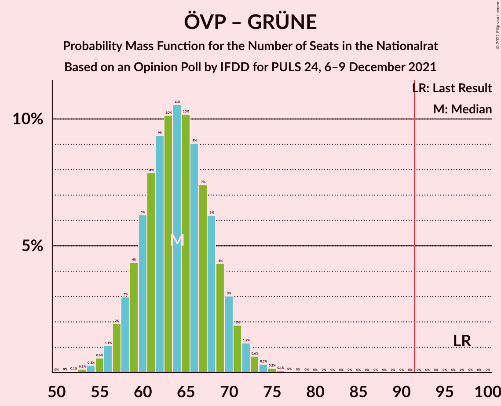

| Number of Seats | Probability | Accumulated | Special Marks |
|:---------------:|:-----------:|:-----------:|:-------------:|
| 52 | 0.1% | 100% |  |
| 53 | 0.1% | 99.9% |  |
| 54 | 0.3% | 99.8% |  |
| 55 | 0.6% | 99.5% |  |
| 56 | 1.1% | 98.9% |  |
| 57 | 2% | 98% |  |
| 58 | 3% | 96% |  |
| 59 | 4% | 93% |  |
| 60 | 6% | 89% |  |
| 61 | 8% | 82% |  |
| 62 | 9% | 75% |  |
| 63 | 10% | 65% |  |
| 64 | 11% | 55% | Median |
| 65 | 10% | 44% |  |
| 66 | 9% | 34% |  |
| 67 | 7% | 25% |  |
| 68 | 6% | 18% |  |
| 69 | 4% | 12% |  |
| 70 | 3% | 7% |  |
| 71 | 2% | 4% |  |
| 72 | 1.2% | 2% |  |
| 73 | 0.6% | 1.3% |  |
| 74 | 0.3% | 0.6% |  |
| 75 | 0.2% | 0.3% |  |
| 76 | 0.1% | 0.1% |  |
| 77 | 0% | 0.1% |  |
| 78 | 0% | 0% |  |
| 79 | 0% | 0% |  |
| 80 | 0% | 0% |  |
| 81 | 0% | 0% |  |
| 82 | 0% | 0% |  |
| 83 | 0% | 0% |  |
| 84 | 0% | 0% |  |
| 85 | 0% | 0% |  |
| 86 | 0% | 0% |  |
| 87 | 0% | 0% |  |
| 88 | 0% | 0% |  |
| 89 | 0% | 0% |  |
| 90 | 0% | 0% |  |
| 91 | 0% | 0% |  |
| 92 | 0% | 0% | Majority |
| 93 | 0% | 0% |  |
| 94 | 0% | 0% |  |
| 95 | 0% | 0% |  |
| 96 | 0% | 0% |  |
| 97 | 0% | 0% | Last Result |

### Österreichische Volkspartei – NEOS–Das Neue Österreich und Liberales Forum

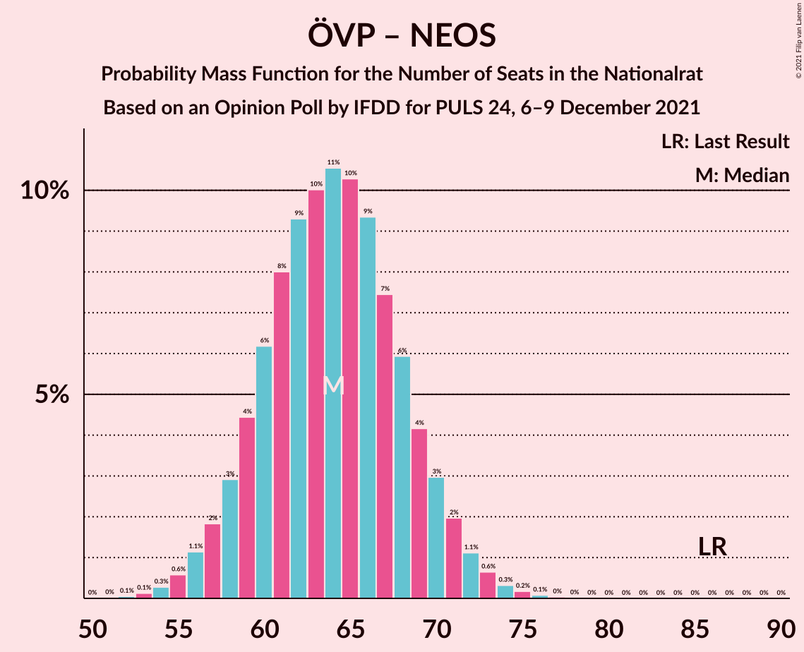

| Number of Seats | Probability | Accumulated | Special Marks |
|:---------------:|:-----------:|:-----------:|:-------------:|
| 52 | 0.1% | 100% |  |
| 53 | 0.1% | 99.9% |  |
| 54 | 0.3% | 99.8% |  |
| 55 | 0.6% | 99.5% |  |
| 56 | 1.1% | 98.9% |  |
| 57 | 2% | 98% |  |
| 58 | 3% | 96% |  |
| 59 | 4% | 93% |  |
| 60 | 6% | 89% |  |
| 61 | 8% | 82% |  |
| 62 | 9% | 74% |  |
| 63 | 10% | 65% | Median |
| 64 | 11% | 55% |  |
| 65 | 10% | 45% |  |
| 66 | 9% | 34% |  |
| 67 | 7% | 25% |  |
| 68 | 6% | 17% |  |
| 69 | 4% | 12% |  |
| 70 | 3% | 7% |  |
| 71 | 2% | 4% |  |
| 72 | 1.1% | 2% |  |
| 73 | 0.6% | 1.3% |  |
| 74 | 0.3% | 0.6% |  |
| 75 | 0.2% | 0.3% |  |
| 76 | 0.1% | 0.1% |  |
| 77 | 0% | 0.1% |  |
| 78 | 0% | 0% |  |
| 79 | 0% | 0% |  |
| 80 | 0% | 0% |  |
| 81 | 0% | 0% |  |
| 82 | 0% | 0% |  |
| 83 | 0% | 0% |  |
| 84 | 0% | 0% |  |
| 85 | 0% | 0% |  |
| 86 | 0% | 0% | Last Result |

### Sozialdemokratische Partei Österreichs

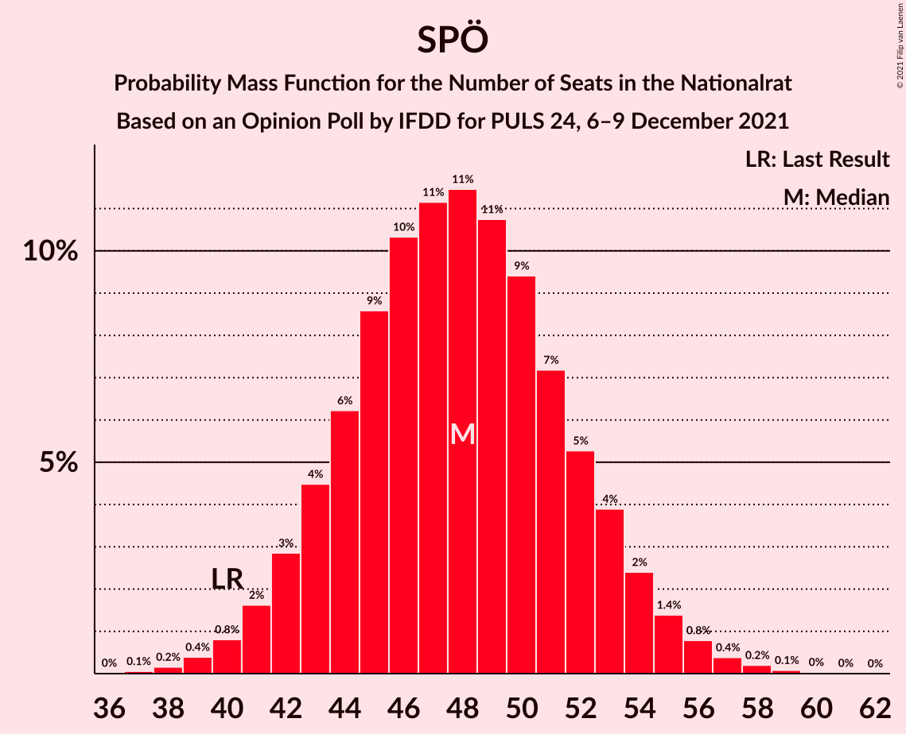

| Number of Seats | Probability | Accumulated | Special Marks |
|:---------------:|:-----------:|:-----------:|:-------------:|
| 37 | 0.1% | 100% |  |
| 38 | 0.2% | 99.9% |  |
| 39 | 0.4% | 99.8% |  |
| 40 | 0.8% | 99.4% | Last Result |
| 41 | 2% | 98.6% |  |
| 42 | 3% | 97% |  |
| 43 | 4% | 94% |  |
| 44 | 6% | 90% |  |
| 45 | 9% | 83% |  |
| 46 | 10% | 75% |  |
| 47 | 11% | 64% |  |
| 48 | 11% | 53% | Median |
| 49 | 11% | 42% |  |
| 50 | 9% | 31% |  |
| 51 | 7% | 22% |  |
| 52 | 5% | 14% |  |
| 53 | 4% | 9% |  |
| 54 | 2% | 5% |  |
| 55 | 1.4% | 3% |  |
| 56 | 0.8% | 2% |  |
| 57 | 0.4% | 0.7% |  |
| 58 | 0.2% | 0.3% |  |
| 59 | 0.1% | 0.1% |  |
| 60 | 0% | 0.1% |  |
| 61 | 0% | 0% |  |

### Österreichische Volkspartei

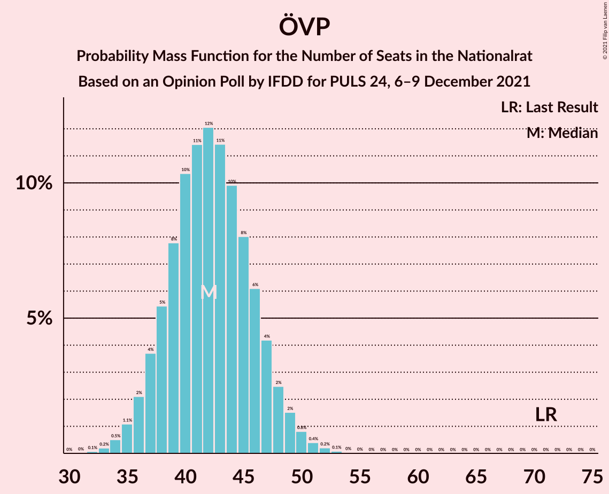

| Number of Seats | Probability | Accumulated | Special Marks |
|:---------------:|:-----------:|:-----------:|:-------------:|
| 32 | 0.1% | 100% |  |
| 33 | 0.2% | 99.9% |  |
| 34 | 0.5% | 99.7% |  |
| 35 | 1.1% | 99.2% |  |
| 36 | 2% | 98% |  |
| 37 | 4% | 96% |  |
| 38 | 5% | 92% |  |
| 39 | 8% | 87% |  |
| 40 | 10% | 79% |  |
| 41 | 11% | 69% |  |
| 42 | 12% | 57% | Median |
| 43 | 11% | 45% |  |
| 44 | 10% | 34% |  |
| 45 | 8% | 24% |  |
| 46 | 6% | 16% |  |
| 47 | 4% | 10% |  |
| 48 | 2% | 6% |  |
| 49 | 2% | 3% |  |
| 50 | 0.8% | 2% |  |
| 51 | 0.4% | 0.7% |  |
| 52 | 0.2% | 0.3% |  |
| 53 | 0.1% | 0.1% |  |
| 54 | 0% | 0.1% |  |
| 55 | 0% | 0% |  |
| 56 | 0% | 0% |  |
| 57 | 0% | 0% |  |
| 58 | 0% | 0% |  |
| 59 | 0% | 0% |  |
| 60 | 0% | 0% |  |
| 61 | 0% | 0% |  |
| 62 | 0% | 0% |  |
| 63 | 0% | 0% |  |
| 64 | 0% | 0% |  |
| 65 | 0% | 0% |  |
| 66 | 0% | 0% |  |
| 67 | 0% | 0% |  |
| 68 | 0% | 0% |  |
| 69 | 0% | 0% |  |
| 70 | 0% | 0% |  |
| 71 | 0% | 0% | Last Result |

## Technical Information

### Opinion Poll

+ **Polling firm:** IFDD
+ **Commissioner(s):** PULS 24
+ **Fieldwork period:** 6–9 December 2021

### Calculations

+ **Sample size:** 552
+ **Simulations done:** 1,048,576
+ **Error estimate:** 0.62%

