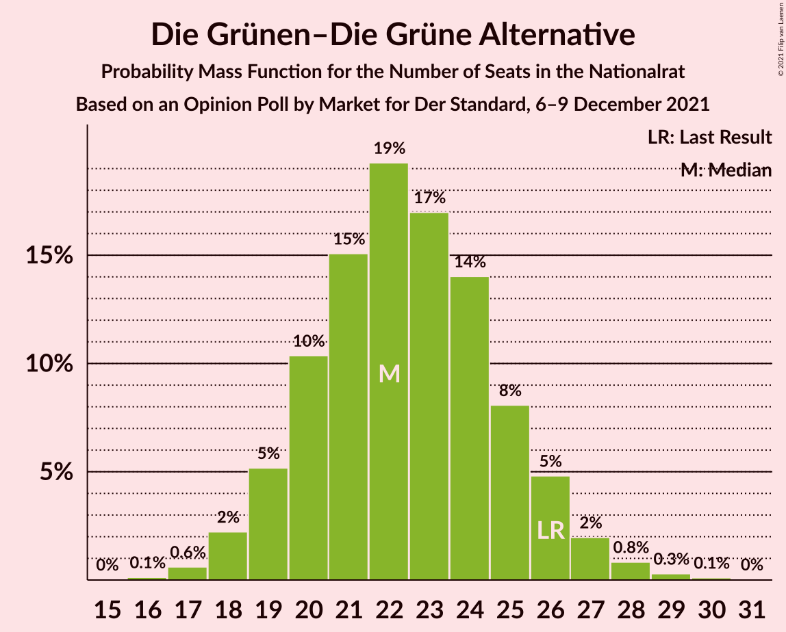
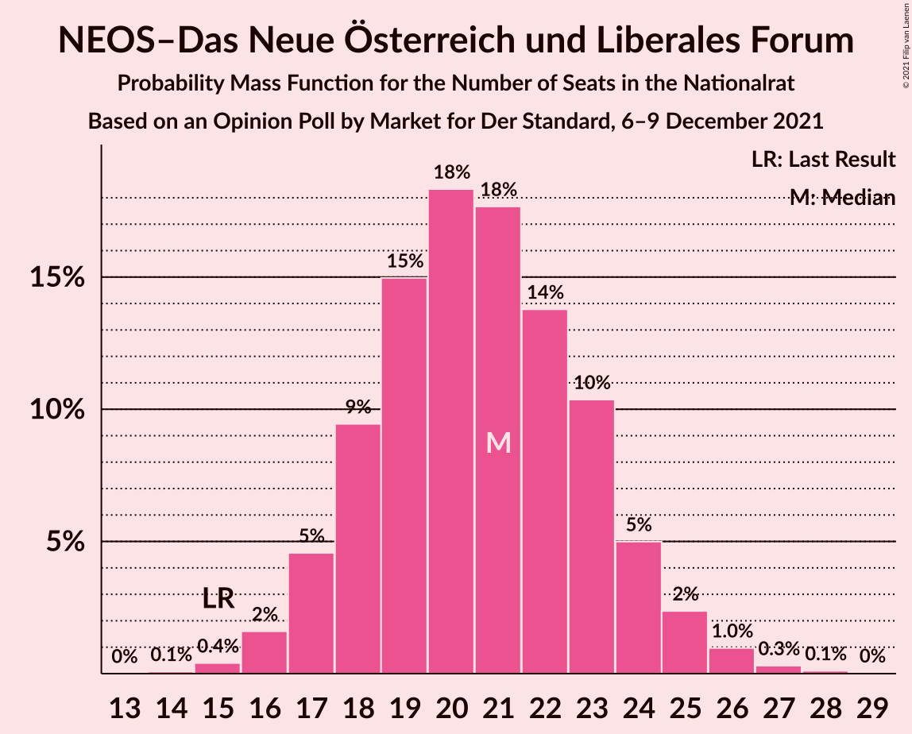
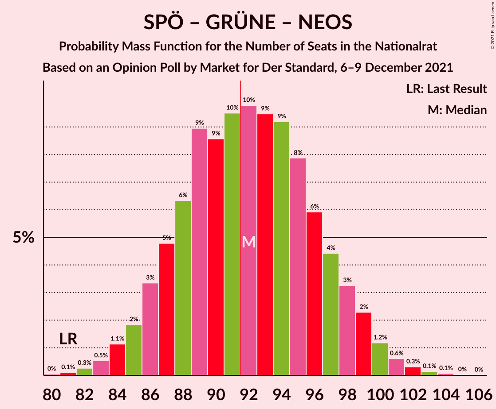
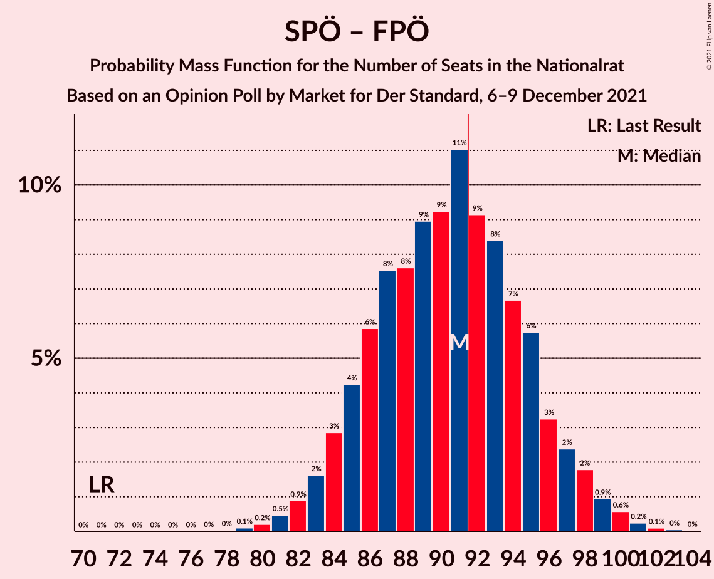
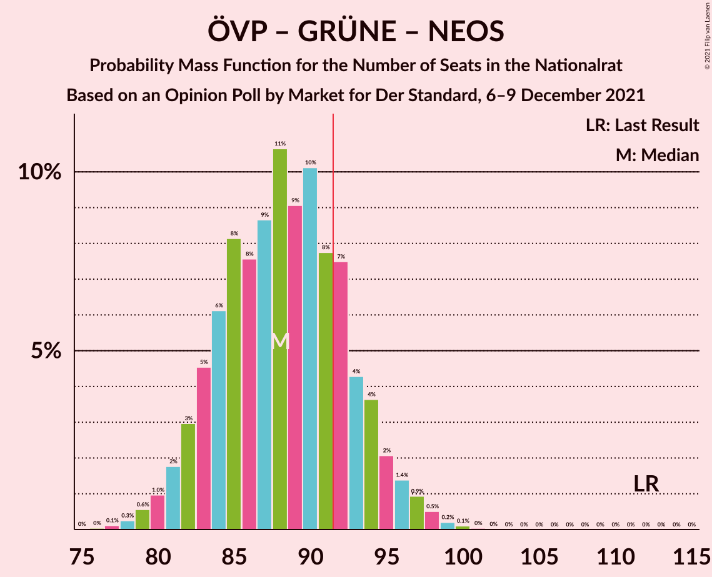
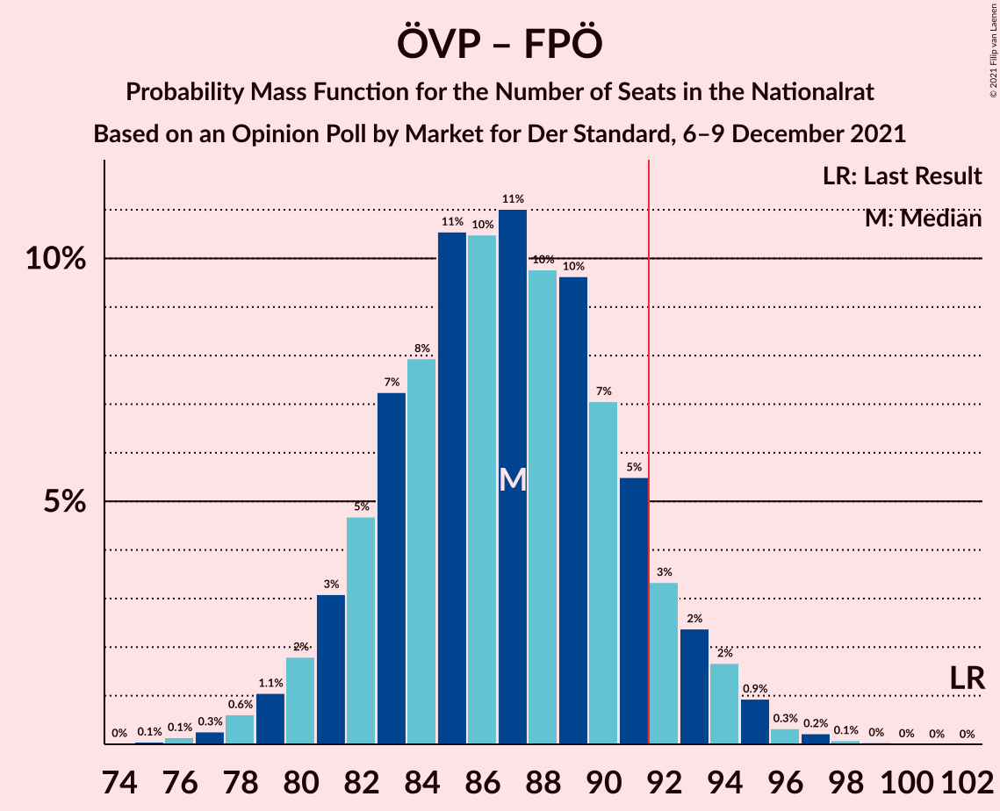
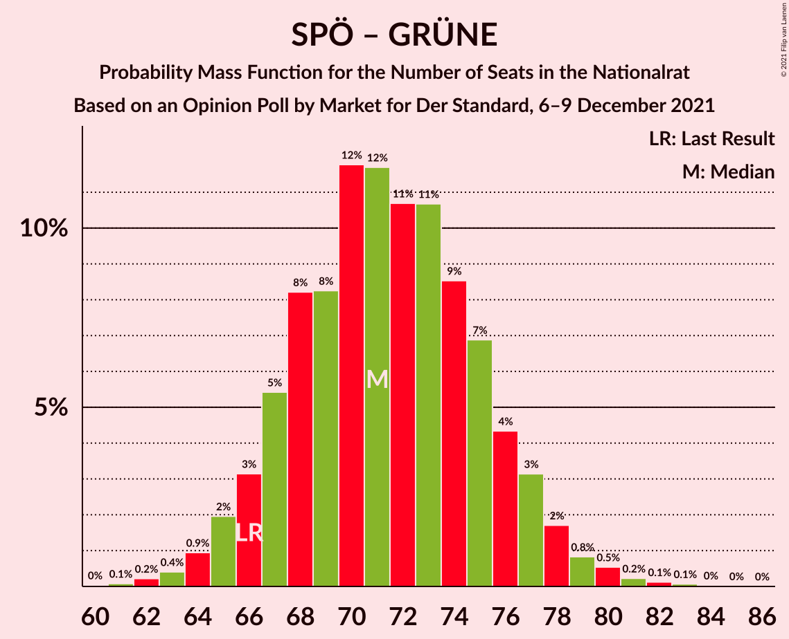
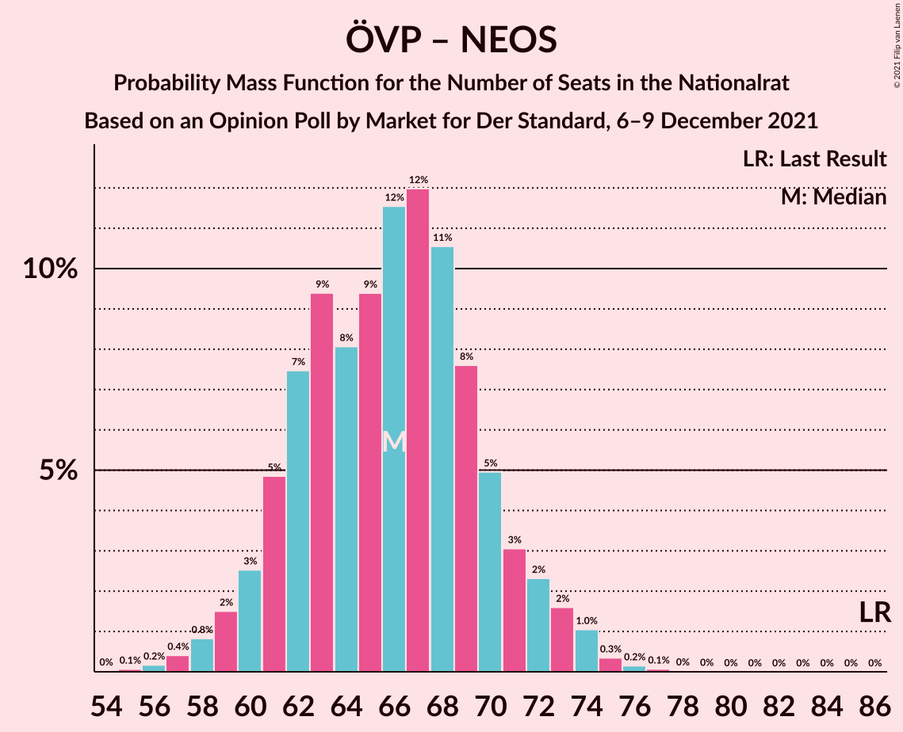

# Opinion Poll by Market for Der Standard, 6–9 December 2021

<a href="#voting-intentions">Voting Intentions</a> | <a href="#seats">Seats</a> | <a href="#coalitions">Coalitions</a> | <a href="#technical-information">Technical Information</a>

## Voting Intentions

### Confidence Intervals

| Party | Last Result | Poll Result | 80% Confidence Interval | 90% Confidence Interval | 95% Confidence Interval | 99% Confidence Interval |
|:-----:|:-----------:|:-----------:|:-----------------------:|:-----------------------:|:-----------------------:|:-----------------------:|
| Sozialdemokratische Partei Österreichs | 21.2% | 26.2% | 24.3–28.3% |23.8–28.9% |23.3–29.4% |22.4–30.4% |
| Österreichische Volkspartei | 37.5% | 24.2% | 22.4–26.3% |21.9–26.8% |21.4–27.3% |20.5–28.3% |
| Freiheitliche Partei Österreichs | 16.2% | 22.2% | 20.4–24.2% |19.9–24.8% |19.5–25.3% |18.7–26.2% |
| Die Grünen–Die Grüne Alternative | 13.9% | 12.1% | 10.7–13.7% |10.4–14.2% |10.0–14.6% |9.4–15.4% |
| NEOS–Das Neue Österreich und Liberales Forum | 8.1% | 11.1% | 9.8–12.7% |9.4–13.1% |9.1–13.5% |8.5–14.3% |

*Note:* The poll result column reflects the actual value used in the calculations. Published results may vary slightly, and in addition be rounded to fewer digits.

## Seats

### Confidence Intervals

| Party | Last Result | Median | 80% Confidence Interval | 90% Confidence Interval | 95% Confidence Interval | 99% Confidence Interval |
|:-----:|:-----------:|:------:|:-----------------------:|:-----------------------:|:-----------------------:|:-----------------------:|
| <a href="#sozialdemokratische-partei-österreichs">Sozialdemokratische Partei Österreichs</a> | 40 | 49 | 45–53 |44–54 |43–55 |41–57 |
| <a href="#österreichische-volkspartei">Österreichische Volkspartei</a> | 71 | 45 | 41–49 |40–50 |39–51 |38–53 |
| <a href="#freiheitliche-partei-österreichs">Freiheitliche Partei Österreichs</a> | 31 | 41 | 38–45 |37–46 |36–47 |34–49 |
| <a href="#die-grünen–die-grüne-alternative">Die Grünen–Die Grüne Alternative</a> | 26 | 22 | 20–25 |19–26 |18–27 |17–29 |
| <a href="#neos–das-neue-österreich-und-liberales-forum">NEOS–Das Neue Österreich und Liberales Forum</a> | 15 | 21 | 18–23 |17–24 |17–25 |16–26 |

### Sozialdemokratische Partei Österreichs

*For a full overview of the results for this party, see the [Sozialdemokratische Partei Österreichs](party-sozialdemokratischeparteiösterreichs.html) page.*

| Number of Seats | Probability | Accumulated | Special Marks |
|:---------------:|:-----------:|:-----------:|:-------------:|
| 39 | 0% | 100% |  |
| 40 | 0.1% | 99.9% | Last Result |
| 41 | 0.4% | 99.8% |  |
| 42 | 1.0% | 99.4% |  |
| 43 | 2% | 98% |  |
| 44 | 4% | 96% |  |
| 45 | 6% | 93% |  |
| 46 | 9% | 87% |  |
| 47 | 11% | 78% |  |
| 48 | 12% | 68% |  |
| 49 | 13% | 55% | Median |
| 50 | 11% | 42% |  |
| 51 | 10% | 31% |  |
| 52 | 7% | 20% |  |
| 53 | 6% | 13% |  |
| 54 | 4% | 8% |  |
| 55 | 2% | 4% |  |
| 56 | 1.2% | 2% |  |
| 57 | 0.5% | 0.9% |  |
| 58 | 0.2% | 0.4% |  |
| 59 | 0.1% | 0.2% |  |
| 60 | 0% | 0.1% |  |
| 61 | 0% | 0% |  |

### Österreichische Volkspartei

*For a full overview of the results for this party, see the [Österreichische Volkspartei](party-österreichischevolkspartei.html) page.*

| Number of Seats | Probability | Accumulated | Special Marks |
|:---------------:|:-----------:|:-----------:|:-------------:|
| 36 | 0.1% | 100% |  |
| 37 | 0.3% | 99.9% |  |
| 38 | 0.7% | 99.6% |  |
| 39 | 1.5% | 99.0% |  |
| 40 | 3% | 97% |  |
| 41 | 5% | 94% |  |
| 42 | 8% | 89% |  |
| 43 | 11% | 81% |  |
| 44 | 12% | 71% |  |
| 45 | 13% | 59% | Median |
| 46 | 13% | 46% |  |
| 47 | 11% | 33% |  |
| 48 | 8% | 22% |  |
| 49 | 6% | 14% |  |
| 50 | 4% | 8% |  |
| 51 | 2% | 4% |  |
| 52 | 1.1% | 2% |  |
| 53 | 0.5% | 0.9% |  |
| 54 | 0.2% | 0.4% |  |
| 55 | 0.1% | 0.2% |  |
| 56 | 0% | 0.1% |  |
| 57 | 0% | 0% |  |
| 58 | 0% | 0% |  |
| 59 | 0% | 0% |  |
| 60 | 0% | 0% |  |
| 61 | 0% | 0% |  |
| 62 | 0% | 0% |  |
| 63 | 0% | 0% |  |
| 64 | 0% | 0% |  |
| 65 | 0% | 0% |  |
| 66 | 0% | 0% |  |
| 67 | 0% | 0% |  |
| 68 | 0% | 0% |  |
| 69 | 0% | 0% |  |
| 70 | 0% | 0% |  |
| 71 | 0% | 0% | Last Result |

### Freiheitliche Partei Österreichs

*For a full overview of the results for this party, see the [Freiheitliche Partei Österreichs](party-freiheitlicheparteiösterreichs.html) page.*

| Number of Seats | Probability | Accumulated | Special Marks |
|:---------------:|:-----------:|:-----------:|:-------------:|
| 31 | 0% | 100% | Last Result |
| 32 | 0% | 100% |  |
| 33 | 0.1% | 99.9% |  |
| 34 | 0.4% | 99.8% |  |
| 35 | 1.1% | 99.4% |  |
| 36 | 2% | 98% |  |
| 37 | 4% | 96% |  |
| 38 | 7% | 92% |  |
| 39 | 10% | 84% |  |
| 40 | 12% | 75% |  |
| 41 | 14% | 63% | Median |
| 42 | 13% | 49% |  |
| 43 | 11% | 35% |  |
| 44 | 9% | 24% |  |
| 45 | 6% | 15% |  |
| 46 | 4% | 8% |  |
| 47 | 2% | 5% |  |
| 48 | 1.2% | 2% |  |
| 49 | 0.6% | 1.0% |  |
| 50 | 0.2% | 0.4% |  |
| 51 | 0.1% | 0.2% |  |
| 52 | 0% | 0% |  |

### Die Grünen–Die Grüne Alternative

*For a full overview of the results for this party, see the [Die Grünen–Die Grüne Alternative](party-diegrünen–diegrünealternative.html) page.*

| Number of Seats | Probability | Accumulated | Special Marks |
|:---------------:|:-----------:|:-----------:|:-------------:|
| 16 | 0.2% | 100% |  |
| 17 | 0.7% | 99.8% |  |
| 18 | 2% | 99.1% |  |
| 19 | 6% | 97% |  |
| 20 | 11% | 91% |  |
| 21 | 15% | 81% |  |
| 22 | 18% | 66% | Median |
| 23 | 17% | 48% |  |
| 24 | 13% | 31% |  |
| 25 | 9% | 18% |  |
| 26 | 5% | 9% | Last Result |
| 27 | 2% | 4% |  |
| 28 | 1.0% | 2% |  |
| 29 | 0.4% | 0.6% |  |
| 30 | 0.1% | 0.2% |  |
| 31 | 0% | 0% |  |

### NEOS–Das Neue Österreich und Liberales Forum

*For a full overview of the results for this party, see the [NEOS–Das Neue Österreich und Liberales Forum](party-neos–dasneueösterreichundliberalesforum.html) page.*

| Number of Seats | Probability | Accumulated | Special Marks |
|:---------------:|:-----------:|:-----------:|:-------------:|
| 14 | 0.1% | 100% |  |
| 15 | 0.4% | 99.9% | Last Result |
| 16 | 2% | 99.5% |  |
| 17 | 4% | 98% |  |
| 18 | 9% | 93% |  |
| 19 | 15% | 84% |  |
| 20 | 18% | 69% |  |
| 21 | 18% | 51% | Median |
| 22 | 14% | 32% |  |
| 23 | 9% | 18% |  |
| 24 | 5% | 9% |  |
| 25 | 2% | 4% |  |
| 26 | 0.9% | 1.4% |  |
| 27 | 0.3% | 0.5% |  |
| 28 | 0.1% | 0.2% |  |
| 29 | 0% | 0% |  |

## Coalitions

### Confidence Intervals

| Coalition | Last Result | Median | Majority? | 80% Confidence Interval | 90% Confidence Interval | 95% Confidence Interval | 99% Confidence Interval |
|:---------:|:-----------:|:------:|:---------:|:-----------------------:|:-----------------------:|:-----------------------:|:-----------------------:|
| Sozialdemokratische Partei Österreichs – Österreichische Volkspartei | 111 | 94 | 75% | 89–99 | 88–101 | 87–102 | 85–104 |
| Sozialdemokratische Partei Österreichs – Die Grünen–Die Grüne Alternative – NEOS–Das Neue Österreich und Liberales Forum | 81 | 92 | 54% | 87–97 | 86–99 | 85–100 | 82–102 |
| Sozialdemokratische Partei Österreichs – Freiheitliche Partei Österreichs | 71 | 90 | 39% | 85–95 | 84–97 | 83–98 | 81–100 |
| Österreichische Volkspartei – Die Grünen–Die Grüne Alternative – NEOS–Das Neue Österreich und Liberales Forum | 112 | 88 | 20% | 83–93 | 82–95 | 81–96 | 79–98 |
| Österreichische Volkspartei – Freiheitliche Partei Österreichs | 102 | 87 | 11% | 82–92 | 80–93 | 79–94 | 77–96 |
| Sozialdemokratische Partei Österreichs – Die Grünen–Die Grüne Alternative | 66 | 71 | 0% | 67–76 | 66–77 | 65–79 | 63–81 |
| Österreichische Volkspartei – Die Grünen–Die Grüne Alternative | 97 | 68 | 0% | 63–72 | 62–74 | 61–75 | 59–77 |
| Österreichische Volkspartei – NEOS–Das Neue Österreich und Liberales Forum | 86 | 66 | 0% | 61–70 | 60–72 | 59–73 | 57–75 |
| Sozialdemokratische Partei Österreichs | 40 | 49 | 0% | 45–53 | 44–54 | 43–55 | 41–57 |
| Österreichische Volkspartei | 71 | 45 | 0% | 41–49 | 40–50 | 39–51 | 38–53 |

### Sozialdemokratische Partei Österreichs – Österreichische Volkspartei

| Number of Seats | Probability | Accumulated | Special Marks |
|:---------------:|:-----------:|:-----------:|:-------------:|
| 82 | 0% | 100% |  |
| 83 | 0.1% | 99.9% |  |
| 84 | 0.3% | 99.8% |  |
| 85 | 0.6% | 99.5% |  |
| 86 | 1.1% | 98.9% |  |
| 87 | 2% | 98% |  |
| 88 | 3% | 96% |  |
| 89 | 5% | 93% |  |
| 90 | 6% | 88% |  |
| 91 | 7% | 83% |  |
| 92 | 9% | 75% | Majority |
| 93 | 10% | 66% |  |
| 94 | 11% | 56% | Median |
| 95 | 9% | 46% |  |
| 96 | 9% | 36% |  |
| 97 | 8% | 27% |  |
| 98 | 6% | 20% |  |
| 99 | 5% | 14% |  |
| 100 | 3% | 9% |  |
| 101 | 2% | 5% |  |
| 102 | 1.5% | 3% |  |
| 103 | 0.9% | 2% |  |
| 104 | 0.4% | 0.8% |  |
| 105 | 0.2% | 0.4% |  |
| 106 | 0.1% | 0.2% |  |
| 107 | 0% | 0.1% |  |
| 108 | 0% | 0% |  |
| 109 | 0% | 0% |  |
| 110 | 0% | 0% |  |
| 111 | 0% | 0% | Last Result |

### Sozialdemokratische Partei Österreichs – Die Grünen–Die Grüne Alternative – NEOS–Das Neue Österreich und Liberales Forum

| Number of Seats | Probability | Accumulated | Special Marks |
|:---------------:|:-----------:|:-----------:|:-------------:|
| 80 | 0% | 100% |  |
| 81 | 0.1% | 99.9% | Last Result |
| 82 | 0.3% | 99.8% |  |
| 83 | 0.6% | 99.5% |  |
| 84 | 1.2% | 98.9% |  |
| 85 | 2% | 98% |  |
| 86 | 3% | 96% |  |
| 87 | 5% | 92% |  |
| 88 | 6% | 87% |  |
| 89 | 8% | 82% |  |
| 90 | 10% | 74% |  |
| 91 | 10% | 64% |  |
| 92 | 10% | 54% | Median, Majority |
| 93 | 9% | 44% |  |
| 94 | 9% | 36% |  |
| 95 | 7% | 26% |  |
| 96 | 6% | 19% |  |
| 97 | 5% | 13% |  |
| 98 | 3% | 8% |  |
| 99 | 2% | 5% |  |
| 100 | 1.4% | 3% |  |
| 101 | 0.8% | 1.4% |  |
| 102 | 0.4% | 0.7% |  |
| 103 | 0.2% | 0.3% |  |
| 104 | 0.1% | 0.1% |  |
| 105 | 0% | 0% |  |

### Sozialdemokratische Partei Österreichs – Freiheitliche Partei Österreichs

| Number of Seats | Probability | Accumulated | Special Marks |
|:---------------:|:-----------:|:-----------:|:-------------:|
| 71 | 0% | 100% | Last Result |
| 72 | 0% | 100% |  |
| 73 | 0% | 100% |  |
| 74 | 0% | 100% |  |
| 75 | 0% | 100% |  |
| 76 | 0% | 100% |  |
| 77 | 0% | 100% |  |
| 78 | 0% | 100% |  |
| 79 | 0.1% | 99.9% |  |
| 80 | 0.2% | 99.9% |  |
| 81 | 0.5% | 99.7% |  |
| 82 | 0.9% | 99.2% |  |
| 83 | 2% | 98% |  |
| 84 | 3% | 97% |  |
| 85 | 4% | 94% |  |
| 86 | 6% | 90% |  |
| 87 | 7% | 84% |  |
| 88 | 9% | 77% |  |
| 89 | 10% | 68% |  |
| 90 | 10% | 59% | Median |
| 91 | 10% | 49% |  |
| 92 | 9% | 39% | Majority |
| 93 | 8% | 30% |  |
| 94 | 6% | 21% |  |
| 95 | 5% | 15% |  |
| 96 | 4% | 10% |  |
| 97 | 3% | 6% |  |
| 98 | 2% | 3% |  |
| 99 | 0.9% | 2% |  |
| 100 | 0.5% | 0.9% |  |
| 101 | 0.2% | 0.4% |  |
| 102 | 0.1% | 0.2% |  |
| 103 | 0% | 0.1% |  |
| 104 | 0% | 0% |  |

### Österreichische Volkspartei – Die Grünen–Die Grüne Alternative – NEOS–Das Neue Österreich und Liberales Forum

| Number of Seats | Probability | Accumulated | Special Marks |
|:---------------:|:-----------:|:-----------:|:-------------:|
| 76 | 0% | 100% |  |
| 77 | 0.1% | 99.9% |  |
| 78 | 0.2% | 99.9% |  |
| 79 | 0.5% | 99.6% |  |
| 80 | 1.0% | 99.1% |  |
| 81 | 2% | 98% |  |
| 82 | 3% | 96% |  |
| 83 | 4% | 94% |  |
| 84 | 6% | 89% |  |
| 85 | 8% | 83% |  |
| 86 | 9% | 76% |  |
| 87 | 10% | 67% |  |
| 88 | 10% | 57% | Median |
| 89 | 10% | 47% |  |
| 90 | 9% | 37% |  |
| 91 | 8% | 28% |  |
| 92 | 6% | 20% | Majority |
| 93 | 5% | 14% |  |
| 94 | 3% | 9% |  |
| 95 | 2% | 5% |  |
| 96 | 2% | 3% |  |
| 97 | 0.8% | 2% |  |
| 98 | 0.4% | 0.8% |  |
| 99 | 0.2% | 0.4% |  |
| 100 | 0.1% | 0.1% |  |
| 101 | 0% | 0.1% |  |
| 102 | 0% | 0% |  |
| 103 | 0% | 0% |  |
| 104 | 0% | 0% |  |
| 105 | 0% | 0% |  |
| 106 | 0% | 0% |  |
| 107 | 0% | 0% |  |
| 108 | 0% | 0% |  |
| 109 | 0% | 0% |  |
| 110 | 0% | 0% |  |
| 111 | 0% | 0% |  |
| 112 | 0% | 0% | Last Result |

### Österreichische Volkspartei – Freiheitliche Partei Österreichs

| Number of Seats | Probability | Accumulated | Special Marks |
|:---------------:|:-----------:|:-----------:|:-------------:|
| 75 | 0.1% | 100% |  |
| 76 | 0.2% | 99.9% |  |
| 77 | 0.3% | 99.7% |  |
| 78 | 0.7% | 99.4% |  |
| 79 | 1.4% | 98.7% |  |
| 80 | 2% | 97% |  |
| 81 | 4% | 95% |  |
| 82 | 5% | 91% |  |
| 83 | 7% | 86% |  |
| 84 | 8% | 80% |  |
| 85 | 9% | 71% |  |
| 86 | 11% | 62% | Median |
| 87 | 10% | 51% |  |
| 88 | 9% | 41% |  |
| 89 | 9% | 31% |  |
| 90 | 6% | 23% |  |
| 91 | 6% | 16% |  |
| 92 | 4% | 11% | Majority |
| 93 | 3% | 6% |  |
| 94 | 2% | 4% |  |
| 95 | 1.0% | 2% |  |
| 96 | 0.6% | 1.1% |  |
| 97 | 0.3% | 0.5% |  |
| 98 | 0.1% | 0.2% |  |
| 99 | 0.1% | 0.1% |  |
| 100 | 0% | 0% |  |
| 101 | 0% | 0% |  |
| 102 | 0% | 0% | Last Result |

### Sozialdemokratische Partei Österreichs – Die Grünen–Die Grüne Alternative

| Number of Seats | Probability | Accumulated | Special Marks |
|:---------------:|:-----------:|:-----------:|:-------------:|
| 60 | 0% | 100% |  |
| 61 | 0.1% | 99.9% |  |
| 62 | 0.3% | 99.8% |  |
| 63 | 0.6% | 99.5% |  |
| 64 | 1.3% | 98.9% |  |
| 65 | 2% | 98% |  |
| 66 | 4% | 95% | Last Result |
| 67 | 5% | 92% |  |
| 68 | 7% | 86% |  |
| 69 | 9% | 79% |  |
| 70 | 10% | 70% |  |
| 71 | 11% | 59% | Median |
| 72 | 11% | 48% |  |
| 73 | 10% | 38% |  |
| 74 | 8% | 28% |  |
| 75 | 7% | 20% |  |
| 76 | 5% | 13% |  |
| 77 | 3% | 8% |  |
| 78 | 2% | 5% |  |
| 79 | 1.3% | 3% |  |
| 80 | 0.7% | 1.3% |  |
| 81 | 0.4% | 0.6% |  |
| 82 | 0.2% | 0.3% |  |
| 83 | 0.1% | 0.1% |  |
| 84 | 0% | 0% |  |

### Österreichische Volkspartei – Die Grünen–Die Grüne Alternative

| Number of Seats | Probability | Accumulated | Special Marks |
|:---------------:|:-----------:|:-----------:|:-------------:|
| 57 | 0.1% | 100% |  |
| 58 | 0.2% | 99.9% |  |
| 59 | 0.5% | 99.7% |  |
| 60 | 1.0% | 99.2% |  |
| 61 | 2% | 98% |  |
| 62 | 3% | 96% |  |
| 63 | 5% | 93% |  |
| 64 | 7% | 88% |  |
| 65 | 9% | 81% |  |
| 66 | 10% | 72% |  |
| 67 | 10% | 62% | Median |
| 68 | 12% | 52% |  |
| 69 | 10% | 40% |  |
| 70 | 9% | 30% |  |
| 71 | 7% | 21% |  |
| 72 | 5% | 14% |  |
| 73 | 4% | 9% |  |
| 74 | 2% | 5% |  |
| 75 | 1.4% | 3% |  |
| 76 | 0.7% | 1.4% |  |
| 77 | 0.4% | 0.7% |  |
| 78 | 0.2% | 0.3% |  |
| 79 | 0.1% | 0.1% |  |
| 80 | 0% | 0% |  |
| 81 | 0% | 0% |  |
| 82 | 0% | 0% |  |
| 83 | 0% | 0% |  |
| 84 | 0% | 0% |  |
| 85 | 0% | 0% |  |
| 86 | 0% | 0% |  |
| 87 | 0% | 0% |  |
| 88 | 0% | 0% |  |
| 89 | 0% | 0% |  |
| 90 | 0% | 0% |  |
| 91 | 0% | 0% |  |
| 92 | 0% | 0% | Majority |
| 93 | 0% | 0% |  |
| 94 | 0% | 0% |  |
| 95 | 0% | 0% |  |
| 96 | 0% | 0% |  |
| 97 | 0% | 0% | Last Result |

### Österreichische Volkspartei – NEOS–Das Neue Österreich und Liberales Forum

| Number of Seats | Probability | Accumulated | Special Marks |
|:---------------:|:-----------:|:-----------:|:-------------:|
| 55 | 0.1% | 100% |  |
| 56 | 0.2% | 99.9% |  |
| 57 | 0.4% | 99.7% |  |
| 58 | 0.9% | 99.3% |  |
| 59 | 2% | 98% |  |
| 60 | 3% | 97% |  |
| 61 | 5% | 94% |  |
| 62 | 7% | 89% |  |
| 63 | 9% | 83% |  |
| 64 | 10% | 74% |  |
| 65 | 11% | 64% |  |
| 66 | 11% | 53% | Median |
| 67 | 10% | 42% |  |
| 68 | 9% | 31% |  |
| 69 | 7% | 22% |  |
| 70 | 5% | 15% |  |
| 71 | 4% | 9% |  |
| 72 | 2% | 5% |  |
| 73 | 1.4% | 3% |  |
| 74 | 0.8% | 2% |  |
| 75 | 0.4% | 0.7% |  |
| 76 | 0.2% | 0.3% |  |
| 77 | 0.1% | 0.1% |  |
| 78 | 0% | 0% |  |
| 79 | 0% | 0% |  |
| 80 | 0% | 0% |  |
| 81 | 0% | 0% |  |
| 82 | 0% | 0% |  |
| 83 | 0% | 0% |  |
| 84 | 0% | 0% |  |
| 85 | 0% | 0% |  |
| 86 | 0% | 0% | Last Result |

### Sozialdemokratische Partei Österreichs

| Number of Seats | Probability | Accumulated | Special Marks |
|:---------------:|:-----------:|:-----------:|:-------------:|
| 39 | 0% | 100% |  |
| 40 | 0.1% | 99.9% | Last Result |
| 41 | 0.4% | 99.8% |  |
| 42 | 1.0% | 99.4% |  |
| 43 | 2% | 98% |  |
| 44 | 4% | 96% |  |
| 45 | 6% | 93% |  |
| 46 | 9% | 87% |  |
| 47 | 11% | 78% |  |
| 48 | 12% | 68% |  |
| 49 | 13% | 55% | Median |
| 50 | 11% | 42% |  |
| 51 | 10% | 31% |  |
| 52 | 7% | 20% |  |
| 53 | 6% | 13% |  |
| 54 | 4% | 8% |  |
| 55 | 2% | 4% |  |
| 56 | 1.2% | 2% |  |
| 57 | 0.5% | 0.9% |  |
| 58 | 0.2% | 0.4% |  |
| 59 | 0.1% | 0.2% |  |
| 60 | 0% | 0.1% |  |
| 61 | 0% | 0% |  |

### Österreichische Volkspartei

| Number of Seats | Probability | Accumulated | Special Marks |
|:---------------:|:-----------:|:-----------:|:-------------:|
| 36 | 0.1% | 100% |  |
| 37 | 0.3% | 99.9% |  |
| 38 | 0.7% | 99.6% |  |
| 39 | 1.5% | 99.0% |  |
| 40 | 3% | 97% |  |
| 41 | 5% | 94% |  |
| 42 | 8% | 89% |  |
| 43 | 11% | 81% |  |
| 44 | 12% | 71% |  |
| 45 | 13% | 59% | Median |
| 46 | 13% | 46% |  |
| 47 | 11% | 33% |  |
| 48 | 8% | 22% |  |
| 49 | 6% | 14% |  |
| 50 | 4% | 8% |  |
| 51 | 2% | 4% |  |
| 52 | 1.1% | 2% |  |
| 53 | 0.5% | 0.9% |  |
| 54 | 0.2% | 0.4% |  |
| 55 | 0.1% | 0.2% |  |
| 56 | 0% | 0.1% |  |
| 57 | 0% | 0% |  |
| 58 | 0% | 0% |  |
| 59 | 0% | 0% |  |
| 60 | 0% | 0% |  |
| 61 | 0% | 0% |  |
| 62 | 0% | 0% |  |
| 63 | 0% | 0% |  |
| 64 | 0% | 0% |  |
| 65 | 0% | 0% |  |
| 66 | 0% | 0% |  |
| 67 | 0% | 0% |  |
| 68 | 0% | 0% |  |
| 69 | 0% | 0% |  |
| 70 | 0% | 0% |  |
| 71 | 0% | 0% | Last Result |

## Technical Information

### Opinion Poll

+ **Polling firm:** Market
+ **Commissioner(s):** Der Standard
+ **Fieldwork period:** 6–9 December 2021

### Calculations

+ **Sample size:** 800
+ **Simulations done:** 1,048,576
+ **Error estimate:** 0.38%

