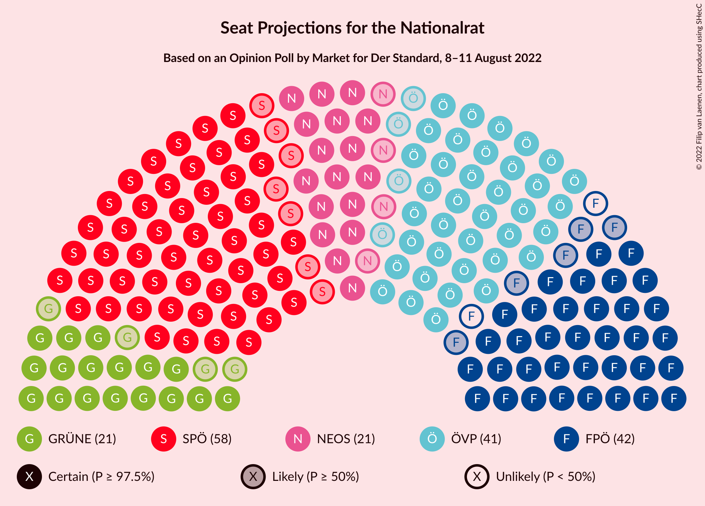

# Opinion Poll by Market for Der Standard, 8–11 August 2022

<a href="#voting-intentions">Voting Intentions</a> | <a href="#seats">Seats</a> | <a href="#coalitions">Coalitions</a> | <a href="#technical-information">Technical Information</a>

## Voting Intentions

### Confidence Intervals

| Party | Last Result | Poll Result | 80% Confidence Interval | 90% Confidence Interval | 95% Confidence Interval | 99% Confidence Interval |
|:-----:|:-----------:|:-----------:|:-----------------------:|:-----------------------:|:-----------------------:|:-----------------------:|
| Sozialdemokratische Partei Österreichs | 21.2% | 30.0% | 28.0–32.1% |27.4–32.7% |26.9–33.2% |26.0–34.2% |
| Österreichische Volkspartei | 37.5% | 22.0% | 20.3–24.0% |19.8–24.5% |19.3–25.0% |18.5–26.0% |
| Freiheitliche Partei Österreichs | 16.2% | 21.1% | 19.3–23.0% |18.8–23.5% |18.4–24.0% |17.6–24.9% |
| NEOS–Das Neue Österreich und Liberales Forum | 8.1% | 11.0% | 9.7–12.5% |9.4–13.0% |9.0–13.4% |8.5–14.1% |
| Die Grünen–Die Grüne Alternative | 13.9% | 11.0% | 9.7–12.5% |9.4–13.0% |9.0–13.4% |8.5–14.1% |
| MFG–Österreich Menschen–Freiheit–Grundrechte | N/A | 3.1% | 2.4–4.0% |2.2–4.3% |2.1–4.5% |1.8–5.0% |

*Note:* The poll result column reflects the actual value used in the calculations. Published results may vary slightly, and in addition be rounded to fewer digits.

## Seats

### Confidence Intervals

| Party | Last Result | Median | 80% Confidence Interval | 90% Confidence Interval | 95% Confidence Interval | 99% Confidence Interval |
|:-----:|:-----------:|:------:|:-----------------------:|:-----------------------:|:-----------------------:|:-----------------------:|
| <a href="#sozialdemokratische-partei-österreichs">Sozialdemokratische Partei Österreichs</a> | 40 | 58 | 54–62 |53–63 |51–64 |50–66 |
| <a href="#österreichische-volkspartei">Österreichische Volkspartei</a> | 71 | 41 | 40–45 |37–48 |37–48 |36–49 |
| <a href="#freiheitliche-partei-österreichs">Freiheitliche Partei Österreichs</a> | 31 | 40 | 37–44 |36–45 |35–46 |33–48 |
| <a href="#neos–das-neue-österreich-und-liberales-forum">NEOS–Das Neue Österreich und Liberales Forum</a> | 15 | 21 | 18–24 |18–24 |17–25 |16–27 |
| <a href="#die-grünen–die-grüne-alternative">Die Grünen–Die Grüne Alternative</a> | 26 | 21 | 18–24 |18–25 |17–25 |16–27 |
| <a href="#mfg–österreich-menschen–freiheit–grundrechte">MFG–Österreich Menschen–Freiheit–Grundrechte</a> | N/A | 0 | 0 |0–7 |0–8 |0–9 |

