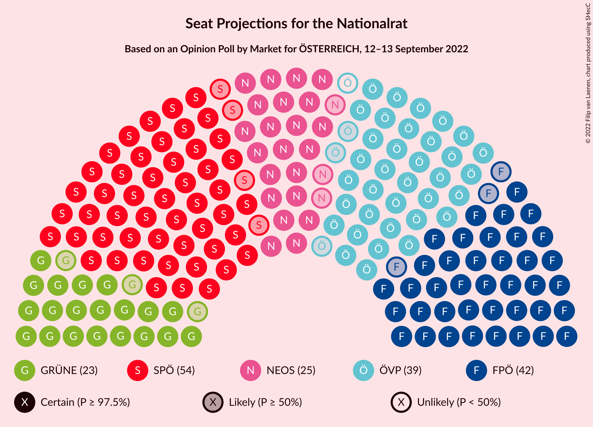

# Opinion Poll by Market for ÖSTERREICH, 12–13 September 2022

<a href="#voting-intentions">Voting Intentions</a> | <a href="#seats">Seats</a> | <a href="#coalitions">Coalitions</a> | <a href="#technical-information">Technical Information</a>

## Voting Intentions

### Confidence Intervals

| Party | Last Result | Poll Result | 80% Confidence Interval | 90% Confidence Interval | 95% Confidence Interval | 99% Confidence Interval |
|:-----:|:-----------:|:-----------:|:-----------------------:|:-----------------------:|:-----------------------:|:-----------------------:|
| Sozialdemokratische Partei Österreichs | 21.2% | 28.0% | 26.7–29.3% |26.4–29.7% |26.1–30.0% |25.5–30.7% |
| Freiheitliche Partei Österreichs | 16.2% | 22.0% | 20.8–23.2% |20.5–23.6% |20.2–23.9% |19.7–24.5% |
| Österreichische Volkspartei | 37.5% | 20.0% | 18.9–21.2% |18.6–21.5% |18.3–21.8% |17.8–22.4% |
| NEOS–Das Neue Österreich und Liberales Forum | 8.1% | 13.0% | 12.1–14.0% |11.8–14.3% |11.6–14.6% |11.2–15.0% |
| Die Grünen–Die Grüne Alternative | 13.9% | 12.0% | 11.1–13.0% |10.9–13.3% |10.6–13.5% |10.2–14.0% |
| MFG–Österreich Menschen–Freiheit–Grundrechte | N/A | 3.0% | 2.6–3.6% |2.4–3.7% |2.3–3.9% |2.1–4.1% |

*Note:* The poll result column reflects the actual value used in the calculations. Published results may vary slightly, and in addition be rounded to fewer digits.

## Seats

### Confidence Intervals

| Party | Last Result | Median | 80% Confidence Interval | 90% Confidence Interval | 95% Confidence Interval | 99% Confidence Interval |
|:-----:|:-----------:|:------:|:-----------------------:|:-----------------------:|:-----------------------:|:-----------------------:|
| <a href="#sozialdemokratische-partei-österreichs">Sozialdemokratische Partei Österreichs</a> | 40 | 54 | 52–57 |51–57 |50–58 |49–59 |
| <a href="#freiheitliche-partei-österreichs">Freiheitliche Partei Österreichs</a> | 31 | 42 | 40–45 |39–45 |39–46 |38–47 |
| <a href="#österreichische-volkspartei">Österreichische Volkspartei</a> | 71 | 38 | 36–41 |36–41 |35–42 |34–43 |
| <a href="#neos–das-neue-österreich-und-liberales-forum">NEOS–Das Neue Österreich und Liberales Forum</a> | 15 | 25 | 23–27 |23–27 |22–28 |21–29 |
| <a href="#die-grünen–die-grüne-alternative">Die Grünen–Die Grüne Alternative</a> | 26 | 23 | 21–25 |21–25 |20–26 |19–27 |
| <a href="#mfg–österreich-menschen–freiheit–grundrechte">MFG–Österreich Menschen–Freiheit–Grundrechte</a> | N/A | 0 | 0 |0 |0 |0–7 |

