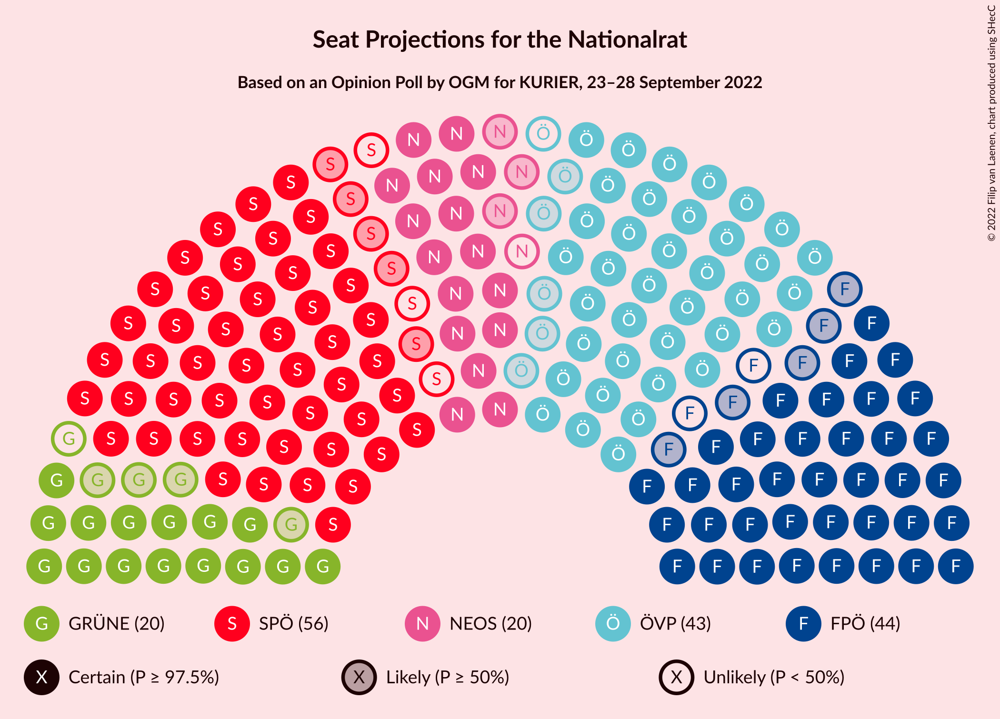

# Opinion Poll by OGM for KURIER, 23–28 September 2022

<a href="#voting-intentions">Voting Intentions</a> | <a href="#seats">Seats</a> | <a href="#coalitions">Coalitions</a> | <a href="#technical-information">Technical Information</a>

## Voting Intentions

### Confidence Intervals

| Party | Last Result | Poll Result | 80% Confidence Interval | 90% Confidence Interval | 95% Confidence Interval | 99% Confidence Interval |
|:-----:|:-----------:|:-----------:|:-----------------------:|:-----------------------:|:-----------------------:|:-----------------------:|
| Sozialdemokratische Partei Österreichs | 21.2% | 28.0% | 26.3–29.8% |25.8–30.3% |25.4–30.7% |24.6–31.6% |
| Österreichische Volkspartei | 37.5% | 22.0% | 20.5–23.7% |20.1–24.2% |19.7–24.6% |19.0–25.4% |
| Freiheitliche Partei Österreichs | 16.2% | 22.0% | 20.5–23.7% |20.1–24.2% |19.7–24.6% |19.0–25.4% |
| NEOS–Das Neue Österreich und Liberales Forum | 8.1% | 10.0% | 8.9–11.3% |8.6–11.6% |8.4–11.9% |7.9–12.6% |
| Die Grünen–Die Grüne Alternative | 13.9% | 10.0% | 8.9–11.3% |8.6–11.6% |8.4–11.9% |7.9–12.6% |
| MFG–Österreich Menschen–Freiheit–Grundrechte | N/A | 3.0% | 2.4–3.8% |2.3–4.0% |2.1–4.2% |1.9–4.6% |

*Note:* The poll result column reflects the actual value used in the calculations. Published results may vary slightly, and in addition be rounded to fewer digits.

## Seats

### Confidence Intervals

| Party | Last Result | Median | 80% Confidence Interval | 90% Confidence Interval | 95% Confidence Interval | 99% Confidence Interval |
|:-----:|:-----------:|:------:|:-----------------------:|:-----------------------:|:-----------------------:|:-----------------------:|
| <a href="#sozialdemokratische-partei-österreichs">Sozialdemokratische Partei Österreichs</a> | 40 | 53 | 50–56 |49–58 |48–59 |46–61 |
| <a href="#österreichische-volkspartei">Österreichische Volkspartei</a> | 71 | 42 | 38–45 |38–46 |37–47 |36–48 |
| <a href="#freiheitliche-partei-österreichs">Freiheitliche Partei Österreichs</a> | 31 | 42 | 39–45 |38–46 |37–47 |36–48 |
| <a href="#neos–das-neue-österreich-und-liberales-forum">NEOS–Das Neue Österreich und Liberales Forum</a> | 15 | 19 | 17–21 |16–22 |16–22 |15–24 |
| <a href="#die-grünen–die-grüne-alternative">Die Grünen–Die Grüne Alternative</a> | 26 | 19 | 17–21 |16–22 |15–22 |15–24 |
| <a href="#mfg–österreich-menschen–freiheit–grundrechte">MFG–Österreich Menschen–Freiheit–Grundrechte</a> | N/A | 0 | 0 |0 |0–7 |0–8 |

