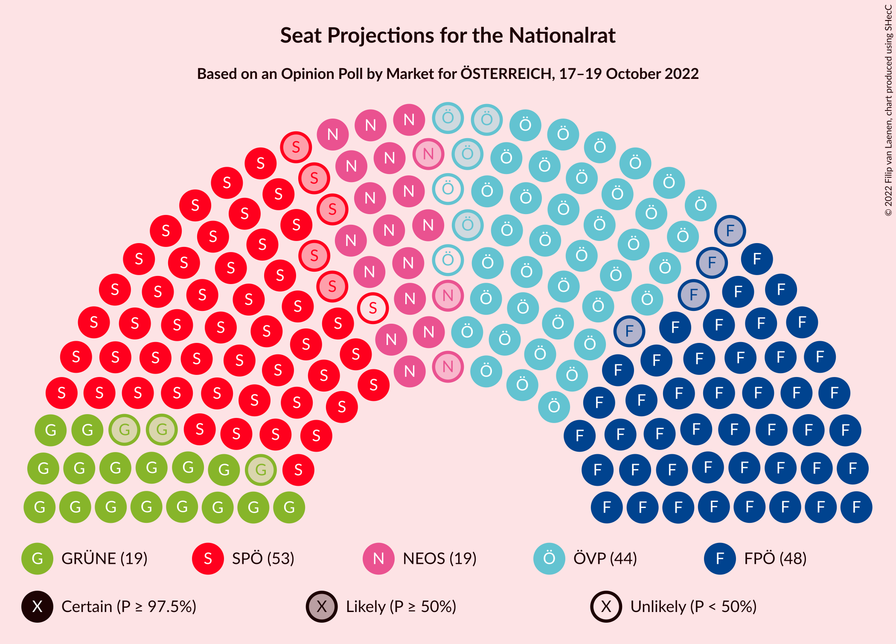

# Opinion Poll by Market for ÖSTERREICH, 17–19 October 2022

<a href="#voting-intentions">Voting Intentions</a> | <a href="#seats">Seats</a> | <a href="#coalitions">Coalitions</a> | <a href="#technical-information">Technical Information</a>

## Voting Intentions

### Confidence Intervals

| Party | Last Result | Poll Result | 80% Confidence Interval | 90% Confidence Interval | 95% Confidence Interval | 99% Confidence Interval |
|:-----:|:-----------:|:-----------:|:-----------------------:|:-----------------------:|:-----------------------:|:-----------------------:|
| Sozialdemokratische Partei Österreichs | 21.2% | 27.0% | 25.7–28.3% |25.4–28.7% |25.1–29.0% |24.5–29.6% |
| Freiheitliche Partei Österreichs | 16.2% | 25.0% | 23.8–26.3% |23.4–26.6% |23.2–26.9% |22.6–27.6% |
| Österreichische Volkspartei | 37.5% | 22.0% | 20.8–23.2% |20.5–23.6% |20.2–23.9% |19.7–24.5% |
| NEOS–Das Neue Österreich und Liberales Forum | 8.1% | 10.0% | 9.2–10.9% |8.9–11.2% |8.7–11.4% |8.4–11.9% |
| Die Grünen–Die Grüne Alternative | 13.9% | 10.0% | 9.2–10.9% |8.9–11.2% |8.7–11.4% |8.4–11.9% |
| MFG–Österreich Menschen–Freiheit–Grundrechte | N/A | 2.0% | 1.6–2.5% |1.6–2.6% |1.5–2.7% |1.3–3.0% |

*Note:* The poll result column reflects the actual value used in the calculations. Published results may vary slightly, and in addition be rounded to fewer digits.

## Seats

### Confidence Intervals

| Party | Last Result | Median | 80% Confidence Interval | 90% Confidence Interval | 95% Confidence Interval | 99% Confidence Interval |
|:-----:|:-----------:|:------:|:-----------------------:|:-----------------------:|:-----------------------:|:-----------------------:|
| <a href="#sozialdemokratische-partei-österreichs">Sozialdemokratische Partei Österreichs</a> | 40 | 52 | 49–54 |48–55 |47–56 |46–57 |
| <a href="#freiheitliche-partei-österreichs">Freiheitliche Partei Österreichs</a> | 31 | 48 | 45–50 |44–51 |44–52 |43–53 |
| <a href="#österreichische-volkspartei">Österreichische Volkspartei</a> | 71 | 42 | 39–45 |39–45 |38–46 |37–47 |
| <a href="#neos–das-neue-österreich-und-liberales-forum">NEOS–Das Neue Österreich und Liberales Forum</a> | 15 | 19 | 17–21 |17–21 |16–22 |16–22 |
| <a href="#die-grünen–die-grüne-alternative">Die Grünen–Die Grüne Alternative</a> | 26 | 19 | 17–21 |17–21 |16–22 |16–23 |
| <a href="#mfg–österreich-menschen–freiheit–grundrechte">MFG–Österreich Menschen–Freiheit–Grundrechte</a> | N/A | 0 | 0 |0 |0 |0 |

