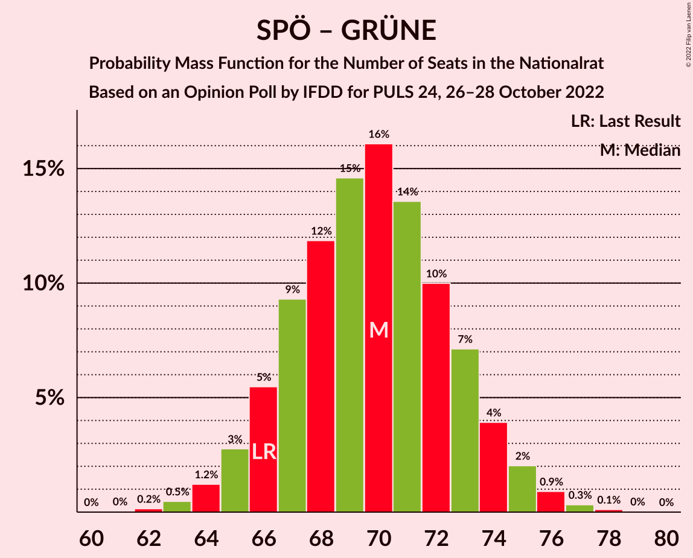

# Opinion Poll by IFDD for PULS 24, 26–28 October 2022

<a href="#voting-intentions">Voting Intentions</a> | <a href="#seats">Seats</a> | <a href="#coalitions">Coalitions</a> | <a href="#technical-information">Technical Information</a>

## Voting Intentions

### Confidence Intervals

| Party | Last Result | Poll Result | 80% Confidence Interval | 90% Confidence Interval | 95% Confidence Interval | 99% Confidence Interval |
|:-----:|:-----------:|:-----------:|:-----------------------:|:-----------------------:|:-----------------------:|:-----------------------:|
| Sozialdemokratische Partei Österreichs | 21.2% | 27.0% | 25.5–28.7% |25.0–29.2% |24.6–29.6% |23.9–30.4% |
| Freiheitliche Partei Österreichs | 16.2% | 25.0% | 23.5–26.7% |23.1–27.1% |22.7–27.5% |22.0–28.3% |
| Österreichische Volkspartei | 37.5% | 20.0% | 18.6–21.5% |18.2–21.9% |17.9–22.3% |17.2–23.1% |
| NEOS–Das Neue Österreich und Liberales Forum | 8.1% | 11.0% | 10.0–12.3% |9.7–12.6% |9.4–12.9% |8.9–13.5% |
| Die Grünen–Die Grüne Alternative | 13.9% | 11.0% | 10.0–12.3% |9.7–12.6% |9.4–12.9% |8.9–13.5% |

*Note:* The poll result column reflects the actual value used in the calculations. Published results may vary slightly, and in addition be rounded to fewer digits.

## Seats

### Confidence Intervals

| Party | Last Result | Median | 80% Confidence Interval | 90% Confidence Interval | 95% Confidence Interval | 99% Confidence Interval |
|:-----:|:-----------:|:------:|:-----------------------:|:-----------------------:|:-----------------------:|:-----------------------:|
| <a href="#sozialdemokratische-partei-österreichs">Sozialdemokratische Partei Österreichs</a> | 40 | 50 | 47–53 |46–54 |45–54 |44–56 |
| <a href="#freiheitliche-partei-österreichs">Freiheitliche Partei Österreichs</a> | 31 | 46 | 43–49 |42–50 |42–51 |40–52 |
| <a href="#österreichische-volkspartei">Österreichische Volkspartei</a> | 71 | 37 | 34–39 |33–40 |33–41 |31–42 |
| <a href="#neos–das-neue-österreich-und-liberales-forum">NEOS–Das Neue Österreich und Liberales Forum</a> | 15 | 21 | 18–21 |17–24 |17–24 |17–24 |
| <a href="#die-grünen–die-grüne-alternative">Die Grünen–Die Grüne Alternative</a> | 26 | 20 | 18–22 |17–23 |17–23 |16–25 |

### Sozialdemokratische Partei Österreichs

*For a full overview of the results for this party, see the [Sozialdemokratische Partei Österreichs](party-sozialdemokratischeparteiösterreichs.html) page.*

| Number of Seats | Probability | Accumulated | Special Marks |
|:---------------:|:-----------:|:-----------:|:-------------:|
| 40 | 0% | 100% | Last Result |
| 41 | 0% | 100% |  |
| 42 | 0.1% | 100% |  |
| 43 | 0.2% | 99.9% |  |
| 44 | 0.9% | 99.7% |  |
| 45 | 2% | 98.8% |  |
| 46 | 5% | 97% |  |
| 47 | 9% | 92% |  |
| 48 | 14% | 82% |  |
| 49 | 16% | 69% |  |
| 50 | 17% | 53% | Median |
| 51 | 15% | 36% |  |
| 52 | 10% | 21% |  |
| 53 | 6% | 12% |  |
| 54 | 3% | 5% |  |
| 55 | 1.4% | 2% |  |
| 56 | 0.5% | 0.8% |  |
| 57 | 0.2% | 0.2% |  |
| 58 | 0% | 0.1% |  |
| 59 | 0% | 0% |  |

### Freiheitliche Partei Österreichs

*For a full overview of the results for this party, see the [Freiheitliche Partei Österreichs](party-freiheitlicheparteiösterreichs.html) page.*

| Number of Seats | Probability | Accumulated | Special Marks |
|:---------------:|:-----------:|:-----------:|:-------------:|
| 31 | 0% | 100% | Last Result |
| 32 | 0% | 100% |  |
| 33 | 0% | 100% |  |
| 34 | 0% | 100% |  |
| 35 | 0% | 100% |  |
| 36 | 0% | 100% |  |
| 37 | 0% | 100% |  |
| 38 | 0% | 100% |  |
| 39 | 0.1% | 100% |  |
| 40 | 0.5% | 99.8% |  |
| 41 | 2% | 99.3% |  |
| 42 | 4% | 98% |  |
| 43 | 7% | 94% |  |
| 44 | 13% | 87% |  |
| 45 | 16% | 74% |  |
| 46 | 17% | 58% | Median |
| 47 | 16% | 41% |  |
| 48 | 11% | 25% |  |
| 49 | 7% | 14% |  |
| 50 | 4% | 6% |  |
| 51 | 2% | 3% |  |
| 52 | 0.6% | 0.9% |  |
| 53 | 0.2% | 0.3% |  |
| 54 | 0.1% | 0.1% |  |
| 55 | 0% | 0% |  |

### Österreichische Volkspartei

*For a full overview of the results for this party, see the [Österreichische Volkspartei](party-österreichischevolkspartei.html) page.*

| Number of Seats | Probability | Accumulated | Special Marks |
|:---------------:|:-----------:|:-----------:|:-------------:|
| 30 | 0.1% | 100% |  |
| 31 | 0.4% | 99.9% |  |
| 32 | 2% | 99.4% |  |
| 33 | 4% | 98% |  |
| 34 | 9% | 94% |  |
| 35 | 14% | 85% |  |
| 36 | 18% | 70% |  |
| 37 | 18% | 52% | Median |
| 38 | 15% | 34% |  |
| 39 | 10% | 19% |  |
| 40 | 6% | 9% |  |
| 41 | 2% | 4% |  |
| 42 | 0.9% | 1.2% |  |
| 43 | 0.3% | 0.4% |  |
| 44 | 0.1% | 0.1% |  |
| 45 | 0% | 0% |  |
| 46 | 0% | 0% |  |
| 47 | 0% | 0% |  |
| 48 | 0% | 0% |  |
| 49 | 0% | 0% |  |
| 50 | 0% | 0% |  |
| 51 | 0% | 0% |  |
| 52 | 0% | 0% |  |
| 53 | 0% | 0% |  |
| 54 | 0% | 0% |  |
| 55 | 0% | 0% |  |
| 56 | 0% | 0% |  |
| 57 | 0% | 0% |  |
| 58 | 0% | 0% |  |
| 59 | 0% | 0% |  |
| 60 | 0% | 0% |  |
| 61 | 0% | 0% |  |
| 62 | 0% | 0% |  |
| 63 | 0% | 0% |  |
| 64 | 0% | 0% |  |
| 65 | 0% | 0% |  |
| 66 | 0% | 0% |  |
| 67 | 0% | 0% |  |
| 68 | 0% | 0% |  |
| 69 | 0% | 0% |  |
| 70 | 0% | 0% |  |
| 71 | 0% | 0% | Last Result |

### NEOS–Das Neue Österreich und Liberales Forum

*For a full overview of the results for this party, see the [NEOS–Das Neue Österreich und Liberales Forum](party-neos–dasneueösterreichundliberalesforum.html) page.*

| Number of Seats | Probability | Accumulated | Special Marks |
|:---------------:|:-----------:|:-----------:|:-------------:|
| 15 | 0.1% | 100% | Last Result |
| 16 | 0% | 99.8% |  |
| 17 | 6% | 99.8% |  |
| 18 | 22% | 94% |  |
| 19 | 0.5% | 72% |  |
| 20 | 11% | 72% |  |
| 21 | 54% | 60% | Median |
| 22 | 1.2% | 7% |  |
| 23 | 0.6% | 6% |  |
| 24 | 5% | 5% |  |
| 25 | 0.1% | 0.2% |  |
| 26 | 0% | 0% |  |

### Die Grünen–Die Grüne Alternative

*For a full overview of the results for this party, see the [Die Grünen–Die Grüne Alternative](party-diegrünen–diegrünealternative.html) page.*

| Number of Seats | Probability | Accumulated | Special Marks |
|:---------------:|:-----------:|:-----------:|:-------------:|
| 15 | 0.1% | 100% |  |
| 16 | 1.0% | 99.8% |  |
| 17 | 4% | 98.9% |  |
| 18 | 12% | 95% |  |
| 19 | 21% | 83% |  |
| 20 | 24% | 62% | Median |
| 21 | 19% | 39% |  |
| 22 | 12% | 19% |  |
| 23 | 5% | 8% |  |
| 24 | 2% | 2% |  |
| 25 | 0.4% | 0.5% |  |
| 26 | 0.1% | 0.1% | Last Result |
| 27 | 0% | 0% |  |

## Coalitions

### Confidence Intervals

| Coalition | Last Result | Median | Majority? | 80% Confidence Interval | 90% Confidence Interval | 95% Confidence Interval | 99% Confidence Interval |
|:---------:|:-----------:|:------:|:---------:|:-----------------------:|:-----------------------:|:-----------------------:|:-----------------------:|
| Sozialdemokratische Partei Österreichs – Freiheitliche Partei Österreichs | 71 | 96 | 94% | 92–99 | 91–100 | 91–101 | 89–103 |
| Sozialdemokratische Partei Österreichs – Die Grünen–Die Grüne Alternative – NEOS–Das Neue Österreich und Liberales Forum | 81 | 90 | 27% | 87–93 | 86–94 | 85–95 | 83–97 |
| Sozialdemokratische Partei Österreichs – Österreichische Volkspartei | 111 | 86 | 3% | 83–90 | 82–91 | 81–92 | 80–93 |
| Freiheitliche Partei Österreichs – Österreichische Volkspartei | 102 | 83 | 0% | 79–86 | 78–87 | 78–88 | 76–89 |
| Österreichische Volkspartei – Die Grünen–Die Grüne Alternative – NEOS–Das Neue Österreich und Liberales Forum | 112 | 77 | 0% | 74–80 | 73–81 | 72–82 | 70–84 |
| Sozialdemokratische Partei Österreichs – Die Grünen–Die Grüne Alternative | 66 | 70 | 0% | 66–73 | 66–74 | 65–75 | 63–76 |
| Österreichische Volkspartei – Die Grünen–Die Grüne Alternative | 97 | 57 | 0% | 54–60 | 53–61 | 52–62 | 51–63 |
| Österreichische Volkspartei – NEOS–Das Neue Österreich und Liberales Forum | 86 | 57 | 0% | 54–60 | 53–61 | 52–62 | 51–63 |
| Sozialdemokratische Partei Österreichs | 40 | 50 | 0% | 47–53 | 46–54 | 45–54 | 44–56 |
| Österreichische Volkspartei | 71 | 37 | 0% | 34–39 | 33–40 | 33–41 | 31–42 |

### Sozialdemokratische Partei Österreichs – Freiheitliche Partei Österreichs

| Number of Seats | Probability | Accumulated | Special Marks |
|:---------------:|:-----------:|:-----------:|:-------------:|
| 71 | 0% | 100% | Last Result |
| 72 | 0% | 100% |  |
| 73 | 0% | 100% |  |
| 74 | 0% | 100% |  |
| 75 | 0% | 100% |  |
| 76 | 0% | 100% |  |
| 77 | 0% | 100% |  |
| 78 | 0% | 100% |  |
| 79 | 0% | 100% |  |
| 80 | 0% | 100% |  |
| 81 | 0% | 100% |  |
| 82 | 0% | 100% |  |
| 83 | 0% | 100% |  |
| 84 | 0% | 100% |  |
| 85 | 0% | 100% |  |
| 86 | 0% | 100% |  |
| 87 | 0.1% | 100% |  |
| 88 | 0.2% | 99.9% |  |
| 89 | 0.6% | 99.7% |  |
| 90 | 1.5% | 99.1% |  |
| 91 | 3% | 98% |  |
| 92 | 6% | 94% | Majority |
| 93 | 9% | 89% |  |
| 94 | 12% | 79% |  |
| 95 | 15% | 67% |  |
| 96 | 15% | 52% | Median |
| 97 | 13% | 37% |  |
| 98 | 10% | 24% |  |
| 99 | 7% | 14% |  |
| 100 | 4% | 7% |  |
| 101 | 2% | 3% |  |
| 102 | 1.0% | 1.5% |  |
| 103 | 0.4% | 0.5% |  |
| 104 | 0.1% | 0.2% |  |
| 105 | 0% | 0.1% |  |
| 106 | 0% | 0% |  |

### Sozialdemokratische Partei Österreichs – Die Grünen–Die Grüne Alternative – NEOS–Das Neue Österreich und Liberales Forum

| Number of Seats | Probability | Accumulated | Special Marks |
|:---------------:|:-----------:|:-----------:|:-------------:|
| 81 | 0.1% | 100% | Last Result |
| 82 | 0.2% | 99.9% |  |
| 83 | 0.5% | 99.7% |  |
| 84 | 1.3% | 99.2% |  |
| 85 | 3% | 98% |  |
| 86 | 5% | 95% |  |
| 87 | 8% | 90% |  |
| 88 | 12% | 82% |  |
| 89 | 14% | 70% |  |
| 90 | 15% | 57% |  |
| 91 | 14% | 42% | Median |
| 92 | 11% | 27% | Majority |
| 93 | 7% | 16% |  |
| 94 | 5% | 9% |  |
| 95 | 2% | 4% |  |
| 96 | 1.0% | 2% |  |
| 97 | 0.4% | 0.6% |  |
| 98 | 0.1% | 0.2% |  |
| 99 | 0% | 0.1% |  |
| 100 | 0% | 0% |  |

### Sozialdemokratische Partei Österreichs – Österreichische Volkspartei

| Number of Seats | Probability | Accumulated | Special Marks |
|:---------------:|:-----------:|:-----------:|:-------------:|
| 78 | 0.1% | 100% |  |
| 79 | 0.3% | 99.9% |  |
| 80 | 0.8% | 99.6% |  |
| 81 | 2% | 98.7% |  |
| 82 | 4% | 97% |  |
| 83 | 7% | 93% |  |
| 84 | 10% | 86% |  |
| 85 | 14% | 76% |  |
| 86 | 15% | 62% |  |
| 87 | 14% | 47% | Median |
| 88 | 13% | 33% |  |
| 89 | 9% | 20% |  |
| 90 | 6% | 11% |  |
| 91 | 3% | 6% |  |
| 92 | 2% | 3% | Majority |
| 93 | 0.6% | 1.0% |  |
| 94 | 0.3% | 0.4% |  |
| 95 | 0.1% | 0.1% |  |
| 96 | 0% | 0% |  |
| 97 | 0% | 0% |  |
| 98 | 0% | 0% |  |
| 99 | 0% | 0% |  |
| 100 | 0% | 0% |  |
| 101 | 0% | 0% |  |
| 102 | 0% | 0% |  |
| 103 | 0% | 0% |  |
| 104 | 0% | 0% |  |
| 105 | 0% | 0% |  |
| 106 | 0% | 0% |  |
| 107 | 0% | 0% |  |
| 108 | 0% | 0% |  |
| 109 | 0% | 0% |  |
| 110 | 0% | 0% |  |
| 111 | 0% | 0% | Last Result |

### Freiheitliche Partei Österreichs – Österreichische Volkspartei

| Number of Seats | Probability | Accumulated | Special Marks |
|:---------------:|:-----------:|:-----------:|:-------------:|
| 74 | 0.1% | 100% |  |
| 75 | 0.2% | 99.9% |  |
| 76 | 0.6% | 99.7% |  |
| 77 | 2% | 99.1% |  |
| 78 | 3% | 98% |  |
| 79 | 6% | 94% |  |
| 80 | 9% | 89% |  |
| 81 | 12% | 79% |  |
| 82 | 15% | 67% |  |
| 83 | 14% | 51% | Median |
| 84 | 13% | 37% |  |
| 85 | 10% | 24% |  |
| 86 | 7% | 14% |  |
| 87 | 4% | 7% |  |
| 88 | 2% | 3% |  |
| 89 | 0.9% | 1.3% |  |
| 90 | 0.3% | 0.5% |  |
| 91 | 0.1% | 0.2% |  |
| 92 | 0% | 0% | Majority |
| 93 | 0% | 0% |  |
| 94 | 0% | 0% |  |
| 95 | 0% | 0% |  |
| 96 | 0% | 0% |  |
| 97 | 0% | 0% |  |
| 98 | 0% | 0% |  |
| 99 | 0% | 0% |  |
| 100 | 0% | 0% |  |
| 101 | 0% | 0% |  |
| 102 | 0% | 0% | Last Result |

### Österreichische Volkspartei – Die Grünen–Die Grüne Alternative – NEOS–Das Neue Österreich und Liberales Forum

| Number of Seats | Probability | Accumulated | Special Marks |
|:---------------:|:-----------:|:-----------:|:-------------:|
| 68 | 0.1% | 100% |  |
| 69 | 0.2% | 99.9% |  |
| 70 | 0.5% | 99.7% |  |
| 71 | 1.2% | 99.2% |  |
| 72 | 3% | 98% |  |
| 73 | 5% | 95% |  |
| 74 | 8% | 90% |  |
| 75 | 12% | 82% |  |
| 76 | 14% | 70% |  |
| 77 | 16% | 56% |  |
| 78 | 14% | 41% | Median |
| 79 | 11% | 27% |  |
| 80 | 8% | 16% |  |
| 81 | 4% | 8% |  |
| 82 | 2% | 4% |  |
| 83 | 1.0% | 2% |  |
| 84 | 0.4% | 0.5% |  |
| 85 | 0.1% | 0.2% |  |
| 86 | 0% | 0.1% |  |
| 87 | 0% | 0% |  |
| 88 | 0% | 0% |  |
| 89 | 0% | 0% |  |
| 90 | 0% | 0% |  |
| 91 | 0% | 0% |  |
| 92 | 0% | 0% | Majority |
| 93 | 0% | 0% |  |
| 94 | 0% | 0% |  |
| 95 | 0% | 0% |  |
| 96 | 0% | 0% |  |
| 97 | 0% | 0% |  |
| 98 | 0% | 0% |  |
| 99 | 0% | 0% |  |
| 100 | 0% | 0% |  |
| 101 | 0% | 0% |  |
| 102 | 0% | 0% |  |
| 103 | 0% | 0% |  |
| 104 | 0% | 0% |  |
| 105 | 0% | 0% |  |
| 106 | 0% | 0% |  |
| 107 | 0% | 0% |  |
| 108 | 0% | 0% |  |
| 109 | 0% | 0% |  |
| 110 | 0% | 0% |  |
| 111 | 0% | 0% |  |
| 112 | 0% | 0% | Last Result |

### Sozialdemokratische Partei Österreichs – Die Grünen–Die Grüne Alternative

| Number of Seats | Probability | Accumulated | Special Marks |
|:---------------:|:-----------:|:-----------:|:-------------:|
| 62 | 0.2% | 100% |  |
| 63 | 0.5% | 99.8% |  |
| 64 | 1.2% | 99.3% |  |
| 65 | 3% | 98% |  |
| 66 | 5% | 95% | Last Result |
| 67 | 9% | 90% |  |
| 68 | 12% | 81% |  |
| 69 | 15% | 69% |  |
| 70 | 16% | 54% | Median |
| 71 | 14% | 38% |  |
| 72 | 10% | 24% |  |
| 73 | 7% | 14% |  |
| 74 | 4% | 7% |  |
| 75 | 2% | 3% |  |
| 76 | 0.9% | 1.4% |  |
| 77 | 0.3% | 0.5% |  |
| 78 | 0.1% | 0.2% |  |
| 79 | 0% | 0% |  |

### Österreichische Volkspartei – Die Grünen–Die Grüne Alternative

| Number of Seats | Probability | Accumulated | Special Marks |
|:---------------:|:-----------:|:-----------:|:-------------:|
| 49 | 0.1% | 100% |  |
| 50 | 0.3% | 99.9% |  |
| 51 | 1.0% | 99.6% |  |
| 52 | 3% | 98.5% |  |
| 53 | 5% | 96% |  |
| 54 | 9% | 91% |  |
| 55 | 13% | 82% |  |
| 56 | 16% | 69% |  |
| 57 | 16% | 53% | Median |
| 58 | 14% | 37% |  |
| 59 | 10% | 23% |  |
| 60 | 7% | 13% |  |
| 61 | 4% | 6% |  |
| 62 | 2% | 3% |  |
| 63 | 0.7% | 1.0% |  |
| 64 | 0.2% | 0.3% |  |
| 65 | 0.1% | 0.1% |  |
| 66 | 0% | 0% |  |
| 67 | 0% | 0% |  |
| 68 | 0% | 0% |  |
| 69 | 0% | 0% |  |
| 70 | 0% | 0% |  |
| 71 | 0% | 0% |  |
| 72 | 0% | 0% |  |
| 73 | 0% | 0% |  |
| 74 | 0% | 0% |  |
| 75 | 0% | 0% |  |
| 76 | 0% | 0% |  |
| 77 | 0% | 0% |  |
| 78 | 0% | 0% |  |
| 79 | 0% | 0% |  |
| 80 | 0% | 0% |  |
| 81 | 0% | 0% |  |
| 82 | 0% | 0% |  |
| 83 | 0% | 0% |  |
| 84 | 0% | 0% |  |
| 85 | 0% | 0% |  |
| 86 | 0% | 0% |  |
| 87 | 0% | 0% |  |
| 88 | 0% | 0% |  |
| 89 | 0% | 0% |  |
| 90 | 0% | 0% |  |
| 91 | 0% | 0% |  |
| 92 | 0% | 0% | Majority |
| 93 | 0% | 0% |  |
| 94 | 0% | 0% |  |
| 95 | 0% | 0% |  |
| 96 | 0% | 0% |  |
| 97 | 0% | 0% | Last Result |

### Österreichische Volkspartei – NEOS–Das Neue Österreich und Liberales Forum

| Number of Seats | Probability | Accumulated | Special Marks |
|:---------------:|:-----------:|:-----------:|:-------------:|
| 49 | 0.1% | 100% |  |
| 50 | 0.4% | 99.9% |  |
| 51 | 1.0% | 99.5% |  |
| 52 | 2% | 98% |  |
| 53 | 5% | 96% |  |
| 54 | 8% | 91% |  |
| 55 | 12% | 83% |  |
| 56 | 16% | 71% |  |
| 57 | 16% | 55% |  |
| 58 | 14% | 39% | Median |
| 59 | 12% | 25% |  |
| 60 | 7% | 13% |  |
| 61 | 4% | 7% |  |
| 62 | 2% | 3% |  |
| 63 | 0.7% | 1.0% |  |
| 64 | 0.3% | 0.4% |  |
| 65 | 0.1% | 0.1% |  |
| 66 | 0% | 0% |  |
| 67 | 0% | 0% |  |
| 68 | 0% | 0% |  |
| 69 | 0% | 0% |  |
| 70 | 0% | 0% |  |
| 71 | 0% | 0% |  |
| 72 | 0% | 0% |  |
| 73 | 0% | 0% |  |
| 74 | 0% | 0% |  |
| 75 | 0% | 0% |  |
| 76 | 0% | 0% |  |
| 77 | 0% | 0% |  |
| 78 | 0% | 0% |  |
| 79 | 0% | 0% |  |
| 80 | 0% | 0% |  |
| 81 | 0% | 0% |  |
| 82 | 0% | 0% |  |
| 83 | 0% | 0% |  |
| 84 | 0% | 0% |  |
| 85 | 0% | 0% |  |
| 86 | 0% | 0% | Last Result |

### Sozialdemokratische Partei Österreichs

| Number of Seats | Probability | Accumulated | Special Marks |
|:---------------:|:-----------:|:-----------:|:-------------:|
| 40 | 0% | 100% | Last Result |
| 41 | 0% | 100% |  |
| 42 | 0.1% | 100% |  |
| 43 | 0.2% | 99.9% |  |
| 44 | 0.9% | 99.7% |  |
| 45 | 2% | 98.8% |  |
| 46 | 5% | 97% |  |
| 47 | 9% | 92% |  |
| 48 | 14% | 82% |  |
| 49 | 16% | 69% |  |
| 50 | 17% | 53% | Median |
| 51 | 15% | 36% |  |
| 52 | 10% | 21% |  |
| 53 | 6% | 12% |  |
| 54 | 3% | 5% |  |
| 55 | 1.4% | 2% |  |
| 56 | 0.5% | 0.8% |  |
| 57 | 0.2% | 0.2% |  |
| 58 | 0% | 0.1% |  |
| 59 | 0% | 0% |  |

### Österreichische Volkspartei

| Number of Seats | Probability | Accumulated | Special Marks |
|:---------------:|:-----------:|:-----------:|:-------------:|
| 30 | 0.1% | 100% |  |
| 31 | 0.4% | 99.9% |  |
| 32 | 2% | 99.4% |  |
| 33 | 4% | 98% |  |
| 34 | 9% | 94% |  |
| 35 | 14% | 85% |  |
| 36 | 18% | 70% |  |
| 37 | 18% | 52% | Median |
| 38 | 15% | 34% |  |
| 39 | 10% | 19% |  |
| 40 | 6% | 9% |  |
| 41 | 2% | 4% |  |
| 42 | 0.9% | 1.2% |  |
| 43 | 0.3% | 0.4% |  |
| 44 | 0.1% | 0.1% |  |
| 45 | 0% | 0% |  |
| 46 | 0% | 0% |  |
| 47 | 0% | 0% |  |
| 48 | 0% | 0% |  |
| 49 | 0% | 0% |  |
| 50 | 0% | 0% |  |
| 51 | 0% | 0% |  |
| 52 | 0% | 0% |  |
| 53 | 0% | 0% |  |
| 54 | 0% | 0% |  |
| 55 | 0% | 0% |  |
| 56 | 0% | 0% |  |
| 57 | 0% | 0% |  |
| 58 | 0% | 0% |  |
| 59 | 0% | 0% |  |
| 60 | 0% | 0% |  |
| 61 | 0% | 0% |  |
| 62 | 0% | 0% |  |
| 63 | 0% | 0% |  |
| 64 | 0% | 0% |  |
| 65 | 0% | 0% |  |
| 66 | 0% | 0% |  |
| 67 | 0% | 0% |  |
| 68 | 0% | 0% |  |
| 69 | 0% | 0% |  |
| 70 | 0% | 0% |  |
| 71 | 0% | 0% | Last Result |

## Technical Information

### Opinion Poll

+ **Polling firm:** IFDD
+ **Commissioner(s):** PULS 24
+ **Fieldwork period:** 26–28 October 2022

### Calculations

+ **Sample size:** 1250
+ **Simulations done:** 1,048,576
+ **Error estimate:** 0.15%

