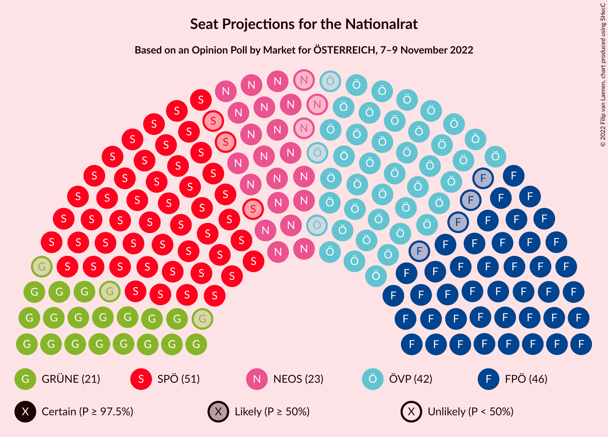

# Opinion Poll by Market for ÖSTERREICH, 7–9 November 2022

<a href="#voting-intentions">Voting Intentions</a> | <a href="#seats">Seats</a> | <a href="#coalitions">Coalitions</a> | <a href="#technical-information">Technical Information</a>

## Voting Intentions

### Confidence Intervals

| Party | Last Result | Poll Result | 80% Confidence Interval | 90% Confidence Interval | 95% Confidence Interval | 99% Confidence Interval |
|:-----:|:-----------:|:-----------:|:-----------------------:|:-----------------------:|:-----------------------:|:-----------------------:|
| Sozialdemokratische Partei Österreichs | 21.2% | 27.0% | 25.7–28.3% |25.4–28.7% |25.1–29.0% |24.5–29.6% |
| Freiheitliche Partei Österreichs | 16.2% | 24.0% | 22.8–25.3% |22.5–25.6% |22.2–25.9% |21.6–26.5% |
| Österreichische Volkspartei | 37.5% | 22.0% | 20.8–23.2% |20.5–23.6% |20.2–23.9% |19.7–24.5% |
| NEOS–Das Neue Österreich und Liberales Forum | 8.1% | 12.0% | 11.1–13.0% |10.9–13.3% |10.6–13.5% |10.2–14.0% |
| Die Grünen–Die Grüne Alternative | 13.9% | 11.0% | 10.1–11.9% |9.9–12.2% |9.7–12.5% |9.3–12.9% |
| MFG–Österreich Menschen–Freiheit–Grundrechte | N/A | 1.0% | 0.8–1.4% |0.7–1.5% |0.6–1.5% |0.5–1.7% |

*Note:* The poll result column reflects the actual value used in the calculations. Published results may vary slightly, and in addition be rounded to fewer digits.

## Seats

### Confidence Intervals

| Party | Last Result | Median | 80% Confidence Interval | 90% Confidence Interval | 95% Confidence Interval | 99% Confidence Interval |
|:-----:|:-----------:|:------:|:-----------------------:|:-----------------------:|:-----------------------:|:-----------------------:|
| <a href="#sozialdemokratische-partei-österreichs">Sozialdemokratische Partei Österreichs</a> | 40 | 51 | 49–54 |48–55 |48–56 |47–57 |
| <a href="#freiheitliche-partei-österreichs">Freiheitliche Partei Österreichs</a> | 31 | 46 | 44–48 |43–49 |42–49 |41–51 |
| <a href="#österreichische-volkspartei">Österreichische Volkspartei</a> | 71 | 42 | 40–44 |39–45 |39–46 |37–47 |
| <a href="#neos–das-neue-österreich-und-liberales-forum">NEOS–Das Neue Österreich und Liberales Forum</a> | 15 | 23 | 21–25 |20–25 |20–26 |19–26 |
| <a href="#die-grünen–die-grüne-alternative">Die Grünen–Die Grüne Alternative</a> | 26 | 21 | 19–23 |19–23 |18–24 |17–24 |
| <a href="#mfg–österreich-menschen–freiheit–grundrechte">MFG–Österreich Menschen–Freiheit–Grundrechte</a> | N/A | 0 | 0 |0 |0 |0 |

