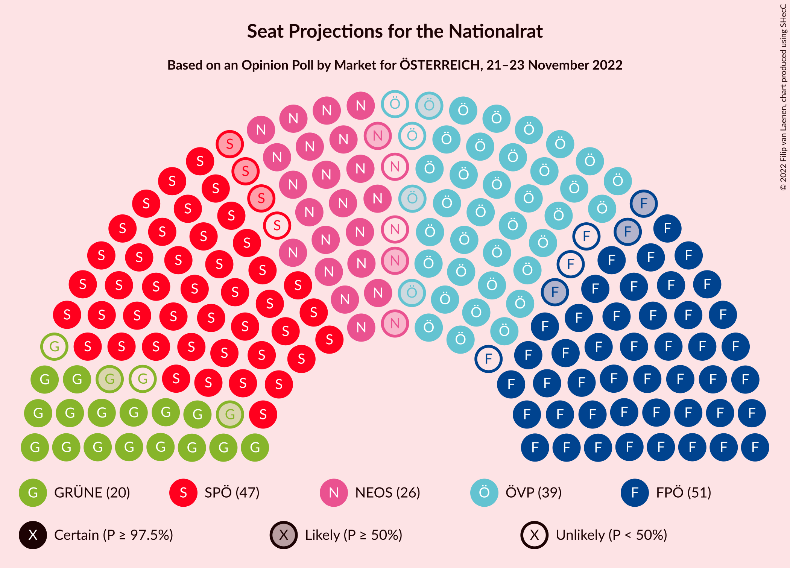

# Opinion Poll by Market for ÖSTERREICH, 21–23 November 2022

<a href="#voting-intentions">Voting Intentions</a> | <a href="#seats">Seats</a> | <a href="#coalitions">Coalitions</a> | <a href="#technical-information">Technical Information</a>

## Voting Intentions

### Confidence Intervals

| Party | Last Result | Poll Result | 80% Confidence Interval | 90% Confidence Interval | 95% Confidence Interval | 99% Confidence Interval |
|:-----:|:-----------:|:-----------:|:-----------------------:|:-----------------------:|:-----------------------:|:-----------------------:|
| Freiheitliche Partei Österreichs | 16.2% | 26.0% | 24.8–27.3% |24.4–27.7% |24.1–28.0% |23.5–28.6% |
| Sozialdemokratische Partei Österreichs | 21.2% | 25.0% | 23.8–26.3% |23.4–26.6% |23.2–26.9% |22.6–27.6% |
| Österreichische Volkspartei | 37.5% | 20.0% | 18.9–21.2% |18.6–21.5% |18.3–21.8% |17.8–22.4% |
| NEOS–Das Neue Österreich und Liberales Forum | 8.1% | 13.0% | 12.1–14.0% |11.8–14.3% |11.6–14.6% |11.2–15.0% |
| Die Grünen–Die Grüne Alternative | 13.9% | 10.0% | 9.2–10.9% |8.9–11.2% |8.7–11.4% |8.4–11.9% |
| MFG–Österreich Menschen–Freiheit–Grundrechte | N/A | 1.0% | 0.8–1.4% |0.7–1.5% |0.6–1.5% |0.5–1.7% |

*Note:* The poll result column reflects the actual value used in the calculations. Published results may vary slightly, and in addition be rounded to fewer digits.

## Seats

### Confidence Intervals

| Party | Last Result | Median | 80% Confidence Interval | 90% Confidence Interval | 95% Confidence Interval | 99% Confidence Interval |
|:-----:|:-----------:|:------:|:-----------------------:|:-----------------------:|:-----------------------:|:-----------------------:|
| <a href="#freiheitliche-partei-österreichs">Freiheitliche Partei Österreichs</a> | 31 | 48 | 46–51 |45–51 |45–52 |44–53 |
| <a href="#sozialdemokratische-partei-österreichs">Sozialdemokratische Partei Österreichs</a> | 40 | 46 | 45–49 |44–50 |43–50 |42–51 |
| <a href="#österreichische-volkspartei">Österreichische Volkspartei</a> | 71 | 37 | 35–39 |34–40 |34–40 |33–42 |
| <a href="#neos–das-neue-österreich-und-liberales-forum">NEOS–Das Neue Österreich und Liberales Forum</a> | 15 | 24 | 22–26 |22–26 |21–27 |20–28 |
| <a href="#die-grünen–die-grüne-alternative">Die Grünen–Die Grüne Alternative</a> | 26 | 18 | 17–20 |16–20 |16–21 |15–22 |
| <a href="#mfg–österreich-menschen–freiheit–grundrechte">MFG–Österreich Menschen–Freiheit–Grundrechte</a> | N/A | 0 | 0 |0 |0 |0 |

