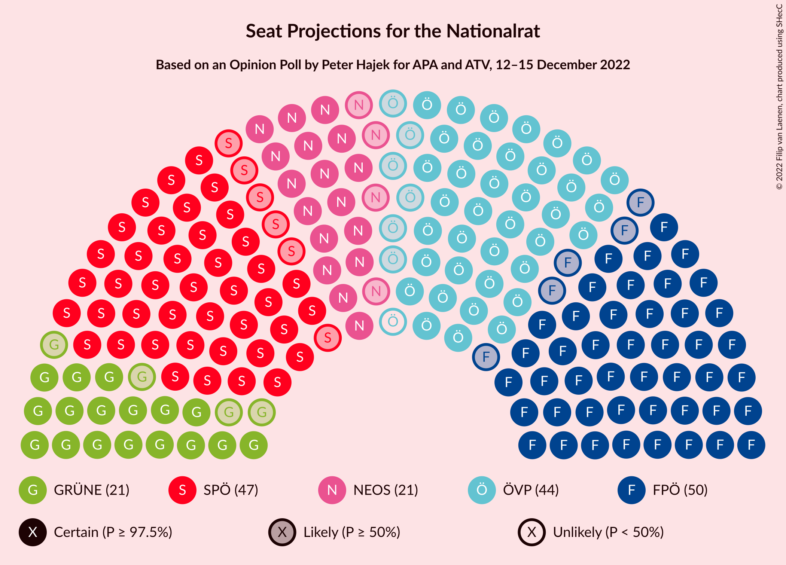

# Opinion Poll by Peter Hajek for APA and ATV, 12–15 December 2022

<a href="#voting-intentions">Voting Intentions</a> | <a href="#seats">Seats</a> | <a href="#coalitions">Coalitions</a> | <a href="#technical-information">Technical Information</a>

## Voting Intentions

### Confidence Intervals

| Party | Last Result | Poll Result | 80% Confidence Interval | 90% Confidence Interval | 95% Confidence Interval | 99% Confidence Interval |
|:-----:|:-----------:|:-----------:|:-----------------------:|:-----------------------:|:-----------------------:|:-----------------------:|
| Freiheitliche Partei Österreichs | 16.2% | 26.5% | 24.6–28.6% |24.0–29.2% |23.5–29.7% |22.6–30.7% |
| Sozialdemokratische Partei Österreichs | 21.2% | 24.5% | 22.6–26.5% |22.1–27.1% |21.6–27.6% |20.8–28.6% |
| Österreichische Volkspartei | 37.5% | 22.5% | 20.7–24.5% |20.2–25.0% |19.7–25.5% |18.9–26.5% |
| NEOS–Das Neue Österreich und Liberales Forum | 8.1% | 11.2% | 9.9–12.8% |9.6–13.2% |9.2–13.6% |8.6–14.4% |
| Die Grünen–Die Grüne Alternative | 13.9% | 11.2% | 9.9–12.8% |9.6–13.2% |9.2–13.6% |8.6–14.4% |
| MFG–Österreich Menschen–Freiheit–Grundrechte | N/A | 3.0% | 2.3–3.9% |2.2–4.2% |2.0–4.4% |1.8–4.9% |

*Note:* The poll result column reflects the actual value used in the calculations. Published results may vary slightly, and in addition be rounded to fewer digits.

## Seats

### Confidence Intervals

| Party | Last Result | Median | 80% Confidence Interval | 90% Confidence Interval | 95% Confidence Interval | 99% Confidence Interval |
|:-----:|:-----------:|:------:|:-----------------------:|:-----------------------:|:-----------------------:|:-----------------------:|
| <a href="#freiheitliche-partei-österreichs">Freiheitliche Partei Österreichs</a> | 31 | 50 | 47–54 |46–55 |45–56 |43–58 |
| <a href="#sozialdemokratische-partei-österreichs">Sozialdemokratische Partei Österreichs</a> | 40 | 47 | 43–50 |42–52 |41–52 |39–54 |
| <a href="#österreichische-volkspartei">Österreichische Volkspartei</a> | 71 | 43 | 39–46 |38–48 |37–48 |36–50 |
| <a href="#neos–das-neue-österreich-und-liberales-forum">NEOS–Das Neue Österreich und Liberales Forum</a> | 15 | 21 | 19–24 |18–25 |17–26 |16–27 |
| <a href="#die-grünen–die-grüne-alternative">Die Grünen–Die Grüne Alternative</a> | 26 | 21 | 19–24 |18–25 |17–26 |16–27 |
| <a href="#mfg–österreich-menschen–freiheit–grundrechte">MFG–Österreich Menschen–Freiheit–Grundrechte</a> | N/A | 0 | 0 |0–7 |0–8 |0–9 |

