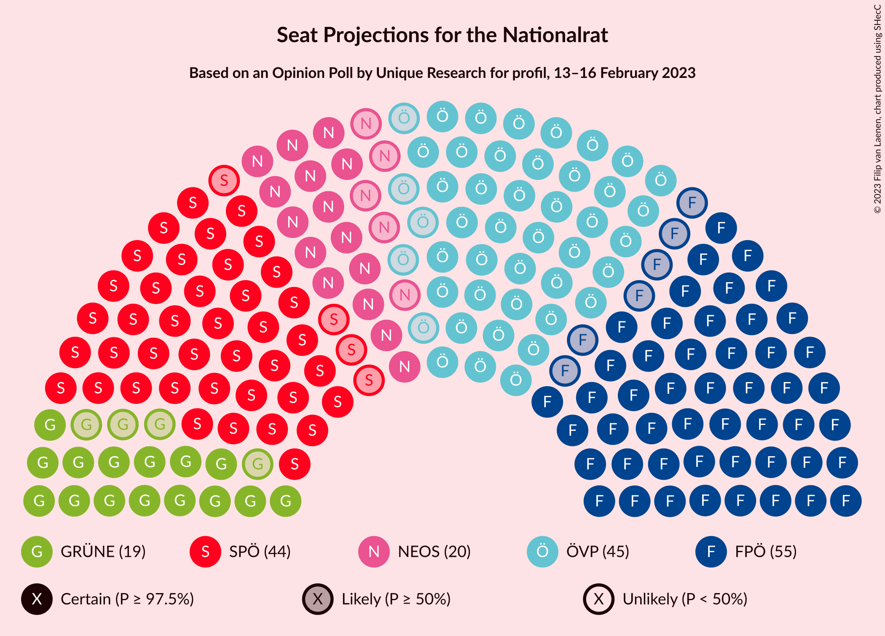

# Opinion Poll by Unique Research for profil, 13–16 February 2023

<a href="#voting-intentions">Voting Intentions</a> | <a href="#seats">Seats</a> | <a href="#coalitions">Coalitions</a> | <a href="#technical-information">Technical Information</a>

## Voting Intentions

### Confidence Intervals

| Party | Last Result | Poll Result | 80% Confidence Interval | 90% Confidence Interval | 95% Confidence Interval | 99% Confidence Interval |
|:-----:|:-----------:|:-----------:|:-----------------------:|:-----------------------:|:-----------------------:|:-----------------------:|
| Freiheitliche Partei Österreichs | 16.2% | 29.0% | 27.0–31.1% |26.4–31.7% |26.0–32.2% |25.0–33.3% |
| Österreichische Volkspartei | 37.5% | 24.0% | 22.1–26.0% |21.6–26.6% |21.2–27.1% |20.3–28.1% |
| Sozialdemokratische Partei Österreichs | 21.2% | 24.0% | 22.1–26.0% |21.6–26.6% |21.2–27.1% |20.3–28.1% |
| NEOS–Das Neue Österreich und Liberales Forum | 8.1% | 10.0% | 8.8–11.5% |8.4–11.9% |8.1–12.3% |7.5–13.0% |
| Die Grünen–Die Grüne Alternative | 13.9% | 10.0% | 8.8–11.5% |8.4–11.9% |8.1–12.3% |7.5–13.0% |

*Note:* The poll result column reflects the actual value used in the calculations. Published results may vary slightly, and in addition be rounded to fewer digits.

## Seats

### Confidence Intervals

| Party | Last Result | Median | 80% Confidence Interval | 90% Confidence Interval | 95% Confidence Interval | 99% Confidence Interval |
|:-----:|:-----------:|:------:|:-----------------------:|:-----------------------:|:-----------------------:|:-----------------------:|
| <a href="#freiheitliche-partei-österreichs">Freiheitliche Partei Österreichs</a> | 31 | 55 | 51–59 |50–60 |49–61 |47–63 |
| <a href="#österreichische-volkspartei">Österreichische Volkspartei</a> | 71 | 45 | 41–49 |40–50 |40–51 |38–53 |
| <a href="#sozialdemokratische-partei-österreichs">Sozialdemokratische Partei Österreichs</a> | 40 | 45 | 42–49 |40–50 |40–51 |38–53 |
| <a href="#neos–das-neue-österreich-und-liberales-forum">NEOS–Das Neue Österreich und Liberales Forum</a> | 15 | 20 | 16–20 |16–21 |15–24 |15–24 |
| <a href="#die-grünen–die-grüne-alternative">Die Grünen–Die Grüne Alternative</a> | 26 | 19 | 16–21 |15–22 |15–23 |14–24 |

### Freiheitliche Partei Österreichs

*For a full overview of the results for this party, see the [Freiheitliche Partei Österreichs](party-freiheitlicheparteiösterreichs.html) page.*

| Number of Seats | Probability | Accumulated | Special Marks |
|:---------------:|:-----------:|:-----------:|:-------------:|
| 31 | 0% | 100% | Last Result |
| 32 | 0% | 100% |  |
| 33 | 0% | 100% |  |
| 34 | 0% | 100% |  |
| 35 | 0% | 100% |  |
| 36 | 0% | 100% |  |
| 37 | 0% | 100% |  |
| 38 | 0% | 100% |  |
| 39 | 0% | 100% |  |
| 40 | 0% | 100% |  |
| 41 | 0% | 100% |  |
| 42 | 0% | 100% |  |
| 43 | 0% | 100% |  |
| 44 | 0% | 100% |  |
| 45 | 0.1% | 100% |  |
| 46 | 0.2% | 99.9% |  |
| 47 | 0.5% | 99.6% |  |
| 48 | 1.4% | 99.1% |  |
| 49 | 2% | 98% |  |
| 50 | 4% | 95% |  |
| 51 | 6% | 91% |  |
| 52 | 10% | 85% |  |
| 53 | 10% | 75% |  |
| 54 | 14% | 65% |  |
| 55 | 13% | 52% | Median |
| 56 | 11% | 39% |  |
| 57 | 11% | 28% |  |
| 58 | 6% | 17% |  |
| 59 | 5% | 11% |  |
| 60 | 3% | 6% |  |
| 61 | 2% | 3% |  |
| 62 | 0.7% | 1.4% |  |
| 63 | 0.4% | 0.7% |  |
| 64 | 0.2% | 0.2% |  |
| 65 | 0.1% | 0.1% |  |
| 66 | 0% | 0% |  |

### Österreichische Volkspartei

*For a full overview of the results for this party, see the [Österreichische Volkspartei](party-österreichischevolkspartei.html) page.*

| Number of Seats | Probability | Accumulated | Special Marks |
|:---------------:|:-----------:|:-----------:|:-------------:|
| 36 | 0.1% | 100% |  |
| 37 | 0.2% | 99.9% |  |
| 38 | 0.6% | 99.7% |  |
| 39 | 1.2% | 99.1% |  |
| 40 | 3% | 98% |  |
| 41 | 5% | 95% |  |
| 42 | 7% | 90% |  |
| 43 | 11% | 82% |  |
| 44 | 13% | 71% |  |
| 45 | 13% | 58% | Median |
| 46 | 14% | 45% |  |
| 47 | 11% | 32% |  |
| 48 | 8% | 21% |  |
| 49 | 6% | 13% |  |
| 50 | 4% | 7% |  |
| 51 | 2% | 4% |  |
| 52 | 0.9% | 2% |  |
| 53 | 0.5% | 0.7% |  |
| 54 | 0.2% | 0.3% |  |
| 55 | 0.1% | 0.1% |  |
| 56 | 0% | 0% |  |
| 57 | 0% | 0% |  |
| 58 | 0% | 0% |  |
| 59 | 0% | 0% |  |
| 60 | 0% | 0% |  |
| 61 | 0% | 0% |  |
| 62 | 0% | 0% |  |
| 63 | 0% | 0% |  |
| 64 | 0% | 0% |  |
| 65 | 0% | 0% |  |
| 66 | 0% | 0% |  |
| 67 | 0% | 0% |  |
| 68 | 0% | 0% |  |
| 69 | 0% | 0% |  |
| 70 | 0% | 0% |  |
| 71 | 0% | 0% | Last Result |

### Sozialdemokratische Partei Österreichs

*For a full overview of the results for this party, see the [Sozialdemokratische Partei Österreichs](party-sozialdemokratischeparteiösterreichs.html) page.*

| Number of Seats | Probability | Accumulated | Special Marks |
|:---------------:|:-----------:|:-----------:|:-------------:|
| 36 | 0.1% | 100% |  |
| 37 | 0.2% | 99.9% |  |
| 38 | 0.6% | 99.7% |  |
| 39 | 1.4% | 99.1% |  |
| 40 | 3% | 98% | Last Result |
| 41 | 4% | 95% |  |
| 42 | 7% | 90% |  |
| 43 | 12% | 83% |  |
| 44 | 14% | 71% |  |
| 45 | 11% | 57% | Median |
| 46 | 13% | 46% |  |
| 47 | 12% | 33% |  |
| 48 | 9% | 21% |  |
| 49 | 5% | 12% |  |
| 50 | 3% | 7% |  |
| 51 | 2% | 4% |  |
| 52 | 1.1% | 2% |  |
| 53 | 0.3% | 0.6% |  |
| 54 | 0.2% | 0.3% |  |
| 55 | 0.1% | 0.1% |  |
| 56 | 0% | 0% |  |

### NEOS–Das Neue Österreich und Liberales Forum

*For a full overview of the results for this party, see the [NEOS–Das Neue Österreich und Liberales Forum](party-neos–dasneueösterreichundliberalesforum.html) page.*

| Number of Seats | Probability | Accumulated | Special Marks |
|:---------------:|:-----------:|:-----------:|:-------------:|
| 12 | 0.1% | 100% |  |
| 13 | 0.1% | 99.9% |  |
| 14 | 0% | 99.8% |  |
| 15 | 3% | 99.8% | Last Result |
| 16 | 25% | 97% |  |
| 17 | 6% | 72% |  |
| 18 | 0.1% | 66% |  |
| 19 | 13% | 65% |  |
| 20 | 45% | 53% | Median |
| 21 | 3% | 8% |  |
| 22 | 0% | 4% |  |
| 23 | 2% | 4% |  |
| 24 | 3% | 3% |  |
| 25 | 0.1% | 0.1% |  |
| 26 | 0% | 0% |  |

### Die Grünen–Die Grüne Alternative

*For a full overview of the results for this party, see the [Die Grünen–Die Grüne Alternative](party-diegrünen–diegrünealternative.html) page.*

| Number of Seats | Probability | Accumulated | Special Marks |
|:---------------:|:-----------:|:-----------:|:-------------:|
| 13 | 0.3% | 100% |  |
| 14 | 1.1% | 99.7% |  |
| 15 | 4% | 98.5% |  |
| 16 | 9% | 95% |  |
| 17 | 16% | 86% |  |
| 18 | 18% | 70% |  |
| 19 | 18% | 52% | Median |
| 20 | 15% | 34% |  |
| 21 | 10% | 19% |  |
| 22 | 5% | 9% |  |
| 23 | 2% | 3% |  |
| 24 | 0.8% | 1.2% |  |
| 25 | 0.3% | 0.4% |  |
| 26 | 0.1% | 0.1% | Last Result |
| 27 | 0% | 0% |  |

## Coalitions

### Confidence Intervals

| Coalition | Last Result | Median | Majority? | 80% Confidence Interval | 90% Confidence Interval | 95% Confidence Interval | 99% Confidence Interval |
|:---------:|:-----------:|:------:|:---------:|:-----------------------:|:-----------------------:|:-----------------------:|:-----------------------:|
| Freiheitliche Partei Österreichs – Sozialdemokratische Partei Österreichs | 71 | 100 | 99.0% | 95–104 | 94–106 | 93–107 | 91–109 |
| Freiheitliche Partei Österreichs – Österreichische Volkspartei | 102 | 100 | 98.9% | 95–104 | 94–105 | 93–107 | 90–109 |
| Sozialdemokratische Partei Österreichs – Österreichische Volkspartei | 111 | 90 | 37% | 86–95 | 85–96 | 83–97 | 81–99 |
| Sozialdemokratische Partei Österreichs – Die Grünen–Die Grüne Alternative – NEOS–Das Neue Österreich und Liberales Forum | 81 | 83 | 0.5% | 78–87 | 77–88 | 76–89 | 74–91 |
| Österreichische Volkspartei – Die Grünen–Die Grüne Alternative – NEOS–Das Neue Österreich und Liberales Forum | 112 | 83 | 0.4% | 78–87 | 77–88 | 76–89 | 74–91 |
| Sozialdemokratische Partei Österreichs – Die Grünen–Die Grüne Alternative | 66 | 64 | 0% | 60–68 | 58–69 | 58–70 | 56–72 |
| Österreichische Volkspartei – Die Grünen–Die Grüne Alternative | 97 | 64 | 0% | 60–68 | 59–69 | 58–70 | 56–72 |
| Österreichische Volkspartei – NEOS–Das Neue Österreich und Liberales Forum | 86 | 64 | 0% | 60–68 | 59–69 | 57–70 | 56–72 |
| Sozialdemokratische Partei Österreichs | 40 | 45 | 0% | 42–49 | 40–50 | 40–51 | 38–53 |
| Österreichische Volkspartei | 71 | 45 | 0% | 41–49 | 40–50 | 40–51 | 38–53 |

### Freiheitliche Partei Österreichs – Sozialdemokratische Partei Österreichs

| Number of Seats | Probability | Accumulated | Special Marks |
|:---------------:|:-----------:|:-----------:|:-------------:|
| 71 | 0% | 100% | Last Result |
| 72 | 0% | 100% |  |
| 73 | 0% | 100% |  |
| 74 | 0% | 100% |  |
| 75 | 0% | 100% |  |
| 76 | 0% | 100% |  |
| 77 | 0% | 100% |  |
| 78 | 0% | 100% |  |
| 79 | 0% | 100% |  |
| 80 | 0% | 100% |  |
| 81 | 0% | 100% |  |
| 82 | 0% | 100% |  |
| 83 | 0% | 100% |  |
| 84 | 0% | 100% |  |
| 85 | 0% | 100% |  |
| 86 | 0% | 100% |  |
| 87 | 0% | 100% |  |
| 88 | 0.1% | 100% |  |
| 89 | 0.1% | 99.9% |  |
| 90 | 0.3% | 99.8% |  |
| 91 | 0.5% | 99.5% |  |
| 92 | 1.0% | 99.0% | Majority |
| 93 | 2% | 98% |  |
| 94 | 3% | 96% |  |
| 95 | 4% | 93% |  |
| 96 | 6% | 89% |  |
| 97 | 8% | 83% |  |
| 98 | 9% | 75% |  |
| 99 | 12% | 66% |  |
| 100 | 12% | 54% | Median |
| 101 | 11% | 43% |  |
| 102 | 9% | 32% |  |
| 103 | 9% | 23% |  |
| 104 | 5% | 14% |  |
| 105 | 4% | 9% |  |
| 106 | 2% | 5% |  |
| 107 | 1.4% | 3% |  |
| 108 | 0.6% | 1.2% |  |
| 109 | 0.4% | 0.6% |  |
| 110 | 0.1% | 0.2% |  |
| 111 | 0% | 0.1% |  |
| 112 | 0% | 0% |  |

### Freiheitliche Partei Österreichs – Österreichische Volkspartei

| Number of Seats | Probability | Accumulated | Special Marks |
|:---------------:|:-----------:|:-----------:|:-------------:|
| 88 | 0.1% | 100% |  |
| 89 | 0.1% | 99.9% |  |
| 90 | 0.3% | 99.8% |  |
| 91 | 0.6% | 99.5% |  |
| 92 | 0.9% | 98.9% | Majority |
| 93 | 2% | 98% |  |
| 94 | 3% | 96% |  |
| 95 | 5% | 94% |  |
| 96 | 7% | 89% |  |
| 97 | 6% | 82% |  |
| 98 | 10% | 76% |  |
| 99 | 12% | 66% |  |
| 100 | 12% | 54% | Median |
| 101 | 9% | 42% |  |
| 102 | 10% | 33% | Last Result |
| 103 | 8% | 23% |  |
| 104 | 5% | 14% |  |
| 105 | 4% | 9% |  |
| 106 | 2% | 5% |  |
| 107 | 2% | 3% |  |
| 108 | 0.7% | 1.2% |  |
| 109 | 0.3% | 0.5% |  |
| 110 | 0.1% | 0.2% |  |
| 111 | 0.1% | 0.1% |  |
| 112 | 0% | 0% |  |

### Sozialdemokratische Partei Österreichs – Österreichische Volkspartei

| Number of Seats | Probability | Accumulated | Special Marks |
|:---------------:|:-----------:|:-----------:|:-------------:|
| 79 | 0.1% | 100% |  |
| 80 | 0.1% | 99.9% |  |
| 81 | 0.3% | 99.7% |  |
| 82 | 0.7% | 99.4% |  |
| 83 | 1.3% | 98.7% |  |
| 84 | 2% | 97% |  |
| 85 | 3% | 95% |  |
| 86 | 6% | 92% |  |
| 87 | 6% | 87% |  |
| 88 | 9% | 81% |  |
| 89 | 12% | 71% |  |
| 90 | 10% | 59% | Median |
| 91 | 11% | 48% |  |
| 92 | 10% | 37% | Majority |
| 93 | 8% | 27% |  |
| 94 | 7% | 19% |  |
| 95 | 5% | 11% |  |
| 96 | 3% | 7% |  |
| 97 | 2% | 4% |  |
| 98 | 1.1% | 2% |  |
| 99 | 0.4% | 0.8% |  |
| 100 | 0.3% | 0.4% |  |
| 101 | 0.1% | 0.1% |  |
| 102 | 0% | 0.1% |  |
| 103 | 0% | 0% |  |
| 104 | 0% | 0% |  |
| 105 | 0% | 0% |  |
| 106 | 0% | 0% |  |
| 107 | 0% | 0% |  |
| 108 | 0% | 0% |  |
| 109 | 0% | 0% |  |
| 110 | 0% | 0% |  |
| 111 | 0% | 0% | Last Result |

### Sozialdemokratische Partei Österreichs – Die Grünen–Die Grüne Alternative – NEOS–Das Neue Österreich und Liberales Forum

| Number of Seats | Probability | Accumulated | Special Marks |
|:---------------:|:-----------:|:-----------:|:-------------:|
| 71 | 0.1% | 100% |  |
| 72 | 0.1% | 99.9% |  |
| 73 | 0.2% | 99.8% |  |
| 74 | 0.6% | 99.6% |  |
| 75 | 1.0% | 99.0% |  |
| 76 | 2% | 98% |  |
| 77 | 3% | 96% |  |
| 78 | 5% | 93% |  |
| 79 | 6% | 88% |  |
| 80 | 9% | 82% |  |
| 81 | 11% | 73% | Last Result |
| 82 | 9% | 62% |  |
| 83 | 12% | 52% |  |
| 84 | 11% | 40% | Median |
| 85 | 10% | 28% |  |
| 86 | 6% | 19% |  |
| 87 | 6% | 13% |  |
| 88 | 4% | 7% |  |
| 89 | 2% | 4% |  |
| 90 | 1.1% | 2% |  |
| 91 | 0.5% | 0.9% |  |
| 92 | 0.3% | 0.5% | Majority |
| 93 | 0.1% | 0.2% |  |
| 94 | 0% | 0.1% |  |
| 95 | 0% | 0% |  |

### Österreichische Volkspartei – Die Grünen–Die Grüne Alternative – NEOS–Das Neue Österreich und Liberales Forum

| Number of Seats | Probability | Accumulated | Special Marks |
|:---------------:|:-----------:|:-----------:|:-------------:|
| 71 | 0.1% | 100% |  |
| 72 | 0.1% | 99.9% |  |
| 73 | 0.3% | 99.8% |  |
| 74 | 0.6% | 99.6% |  |
| 75 | 1.0% | 98.9% |  |
| 76 | 2% | 98% |  |
| 77 | 3% | 96% |  |
| 78 | 5% | 93% |  |
| 79 | 6% | 88% |  |
| 80 | 10% | 82% |  |
| 81 | 10% | 72% |  |
| 82 | 11% | 63% |  |
| 83 | 12% | 51% |  |
| 84 | 11% | 40% | Median |
| 85 | 9% | 28% |  |
| 86 | 7% | 20% |  |
| 87 | 5% | 12% |  |
| 88 | 3% | 7% |  |
| 89 | 2% | 4% |  |
| 90 | 1.1% | 2% |  |
| 91 | 0.6% | 1.0% |  |
| 92 | 0.2% | 0.4% | Majority |
| 93 | 0.1% | 0.2% |  |
| 94 | 0% | 0.1% |  |
| 95 | 0% | 0% |  |
| 96 | 0% | 0% |  |
| 97 | 0% | 0% |  |
| 98 | 0% | 0% |  |
| 99 | 0% | 0% |  |
| 100 | 0% | 0% |  |
| 101 | 0% | 0% |  |
| 102 | 0% | 0% |  |
| 103 | 0% | 0% |  |
| 104 | 0% | 0% |  |
| 105 | 0% | 0% |  |
| 106 | 0% | 0% |  |
| 107 | 0% | 0% |  |
| 108 | 0% | 0% |  |
| 109 | 0% | 0% |  |
| 110 | 0% | 0% |  |
| 111 | 0% | 0% |  |
| 112 | 0% | 0% | Last Result |

### Sozialdemokratische Partei Österreichs – Die Grünen–Die Grüne Alternative

| Number of Seats | Probability | Accumulated | Special Marks |
|:---------------:|:-----------:|:-----------:|:-------------:|
| 53 | 0% | 100% |  |
| 54 | 0.1% | 99.9% |  |
| 55 | 0.3% | 99.8% |  |
| 56 | 0.7% | 99.5% |  |
| 57 | 1.3% | 98.9% |  |
| 58 | 3% | 98% |  |
| 59 | 3% | 95% |  |
| 60 | 7% | 91% |  |
| 61 | 8% | 85% |  |
| 62 | 11% | 76% |  |
| 63 | 10% | 66% |  |
| 64 | 15% | 56% | Median |
| 65 | 11% | 41% |  |
| 66 | 8% | 30% | Last Result |
| 67 | 9% | 22% |  |
| 68 | 6% | 13% |  |
| 69 | 3% | 7% |  |
| 70 | 2% | 5% |  |
| 71 | 1.2% | 2% |  |
| 72 | 0.6% | 1.0% |  |
| 73 | 0.2% | 0.4% |  |
| 74 | 0.1% | 0.2% |  |
| 75 | 0% | 0.1% |  |
| 76 | 0% | 0% |  |

### Österreichische Volkspartei – Die Grünen–Die Grüne Alternative

| Number of Seats | Probability | Accumulated | Special Marks |
|:---------------:|:-----------:|:-----------:|:-------------:|
| 53 | 0% | 100% |  |
| 54 | 0.1% | 99.9% |  |
| 55 | 0.3% | 99.8% |  |
| 56 | 0.6% | 99.5% |  |
| 57 | 1.3% | 98.9% |  |
| 58 | 2% | 98% |  |
| 59 | 4% | 95% |  |
| 60 | 7% | 91% |  |
| 61 | 8% | 84% |  |
| 62 | 11% | 77% |  |
| 63 | 12% | 66% |  |
| 64 | 13% | 54% | Median |
| 65 | 11% | 41% |  |
| 66 | 9% | 30% |  |
| 67 | 8% | 21% |  |
| 68 | 6% | 13% |  |
| 69 | 3% | 8% |  |
| 70 | 2% | 4% |  |
| 71 | 1.1% | 2% |  |
| 72 | 0.6% | 1.0% |  |
| 73 | 0.3% | 0.4% |  |
| 74 | 0.1% | 0.2% |  |
| 75 | 0% | 0.1% |  |
| 76 | 0% | 0% |  |
| 77 | 0% | 0% |  |
| 78 | 0% | 0% |  |
| 79 | 0% | 0% |  |
| 80 | 0% | 0% |  |
| 81 | 0% | 0% |  |
| 82 | 0% | 0% |  |
| 83 | 0% | 0% |  |
| 84 | 0% | 0% |  |
| 85 | 0% | 0% |  |
| 86 | 0% | 0% |  |
| 87 | 0% | 0% |  |
| 88 | 0% | 0% |  |
| 89 | 0% | 0% |  |
| 90 | 0% | 0% |  |
| 91 | 0% | 0% |  |
| 92 | 0% | 0% | Majority |
| 93 | 0% | 0% |  |
| 94 | 0% | 0% |  |
| 95 | 0% | 0% |  |
| 96 | 0% | 0% |  |
| 97 | 0% | 0% | Last Result |

### Österreichische Volkspartei – NEOS–Das Neue Österreich und Liberales Forum

| Number of Seats | Probability | Accumulated | Special Marks |
|:---------------:|:-----------:|:-----------:|:-------------:|
| 53 | 0% | 100% |  |
| 54 | 0.1% | 99.9% |  |
| 55 | 0.3% | 99.8% |  |
| 56 | 0.7% | 99.5% |  |
| 57 | 1.4% | 98.8% |  |
| 58 | 2% | 97% |  |
| 59 | 4% | 95% |  |
| 60 | 6% | 91% |  |
| 61 | 8% | 85% |  |
| 62 | 10% | 77% |  |
| 63 | 11% | 66% |  |
| 64 | 13% | 56% |  |
| 65 | 11% | 42% | Median |
| 66 | 10% | 31% |  |
| 67 | 8% | 21% |  |
| 68 | 5% | 13% |  |
| 69 | 4% | 8% |  |
| 70 | 2% | 4% |  |
| 71 | 1.2% | 2% |  |
| 72 | 0.6% | 1.0% |  |
| 73 | 0.2% | 0.4% |  |
| 74 | 0.1% | 0.2% |  |
| 75 | 0% | 0.1% |  |
| 76 | 0% | 0% |  |
| 77 | 0% | 0% |  |
| 78 | 0% | 0% |  |
| 79 | 0% | 0% |  |
| 80 | 0% | 0% |  |
| 81 | 0% | 0% |  |
| 82 | 0% | 0% |  |
| 83 | 0% | 0% |  |
| 84 | 0% | 0% |  |
| 85 | 0% | 0% |  |
| 86 | 0% | 0% | Last Result |

### Sozialdemokratische Partei Österreichs

| Number of Seats | Probability | Accumulated | Special Marks |
|:---------------:|:-----------:|:-----------:|:-------------:|
| 36 | 0.1% | 100% |  |
| 37 | 0.2% | 99.9% |  |
| 38 | 0.6% | 99.7% |  |
| 39 | 1.4% | 99.1% |  |
| 40 | 3% | 98% | Last Result |
| 41 | 4% | 95% |  |
| 42 | 7% | 90% |  |
| 43 | 12% | 83% |  |
| 44 | 14% | 71% |  |
| 45 | 11% | 57% | Median |
| 46 | 13% | 46% |  |
| 47 | 12% | 33% |  |
| 48 | 9% | 21% |  |
| 49 | 5% | 12% |  |
| 50 | 3% | 7% |  |
| 51 | 2% | 4% |  |
| 52 | 1.1% | 2% |  |
| 53 | 0.3% | 0.6% |  |
| 54 | 0.2% | 0.3% |  |
| 55 | 0.1% | 0.1% |  |
| 56 | 0% | 0% |  |

### Österreichische Volkspartei

| Number of Seats | Probability | Accumulated | Special Marks |
|:---------------:|:-----------:|:-----------:|:-------------:|
| 36 | 0.1% | 100% |  |
| 37 | 0.2% | 99.9% |  |
| 38 | 0.6% | 99.7% |  |
| 39 | 1.2% | 99.1% |  |
| 40 | 3% | 98% |  |
| 41 | 5% | 95% |  |
| 42 | 7% | 90% |  |
| 43 | 11% | 82% |  |
| 44 | 13% | 71% |  |
| 45 | 13% | 58% | Median |
| 46 | 14% | 45% |  |
| 47 | 11% | 32% |  |
| 48 | 8% | 21% |  |
| 49 | 6% | 13% |  |
| 50 | 4% | 7% |  |
| 51 | 2% | 4% |  |
| 52 | 0.9% | 2% |  |
| 53 | 0.5% | 0.7% |  |
| 54 | 0.2% | 0.3% |  |
| 55 | 0.1% | 0.1% |  |
| 56 | 0% | 0% |  |
| 57 | 0% | 0% |  |
| 58 | 0% | 0% |  |
| 59 | 0% | 0% |  |
| 60 | 0% | 0% |  |
| 61 | 0% | 0% |  |
| 62 | 0% | 0% |  |
| 63 | 0% | 0% |  |
| 64 | 0% | 0% |  |
| 65 | 0% | 0% |  |
| 66 | 0% | 0% |  |
| 67 | 0% | 0% |  |
| 68 | 0% | 0% |  |
| 69 | 0% | 0% |  |
| 70 | 0% | 0% |  |
| 71 | 0% | 0% | Last Result |

## Technical Information

### Opinion Poll

+ **Polling firm:** Unique Research
+ **Commissioner(s):** profil
+ **Fieldwork period:** 13–16 February 2023

### Calculations

+ **Sample size:** 800
+ **Simulations done:** 1,048,576
+ **Error estimate:** 1.06%

