# Opinion Poll by Market for Der Standard, 20–23 March 2023

<a href="#voting-intentions">Voting Intentions</a> | <a href="#seats">Seats</a> | <a href="#coalitions">Coalitions</a> | <a href="#technical-information">Technical Information</a>

## Voting Intentions

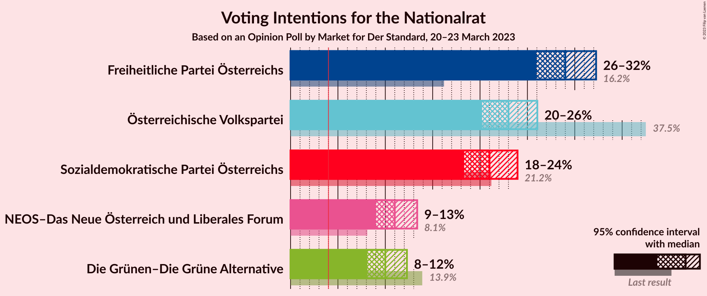

### Confidence Intervals

| Party | Last Result | Poll Result | 80% Confidence Interval | 90% Confidence Interval | 95% Confidence Interval | 99% Confidence Interval |
|:-----:|:-----------:|:-----------:|:-----------------------:|:-----------------------:|:-----------------------:|:-----------------------:|
| Freiheitliche Partei Österreichs | 16.2% | 29.0% | 27.0–31.1% |26.4–31.7% |26.0–32.3% |25.0–33.3% |
| Österreichische Volkspartei | 37.5% | 23.0% | 21.2–25.0% |20.7–25.6% |20.2–26.0% |19.4–27.0% |
| Sozialdemokratische Partei Österreichs | 21.2% | 21.0% | 19.2–22.9% |18.7–23.5% |18.3–24.0% |17.5–24.9% |
| NEOS–Das Neue Österreich und Liberales Forum | 8.1% | 11.0% | 9.7–12.5% |9.3–13.0% |9.0–13.4% |8.4–14.1% |
| Die Grünen–Die Grüne Alternative | 13.9% | 10.0% | 8.7–11.5% |8.4–11.9% |8.1–12.3% |7.5–13.0% |

*Note:* The poll result column reflects the actual value used in the calculations. Published results may vary slightly, and in addition be rounded to fewer digits.

## Seats

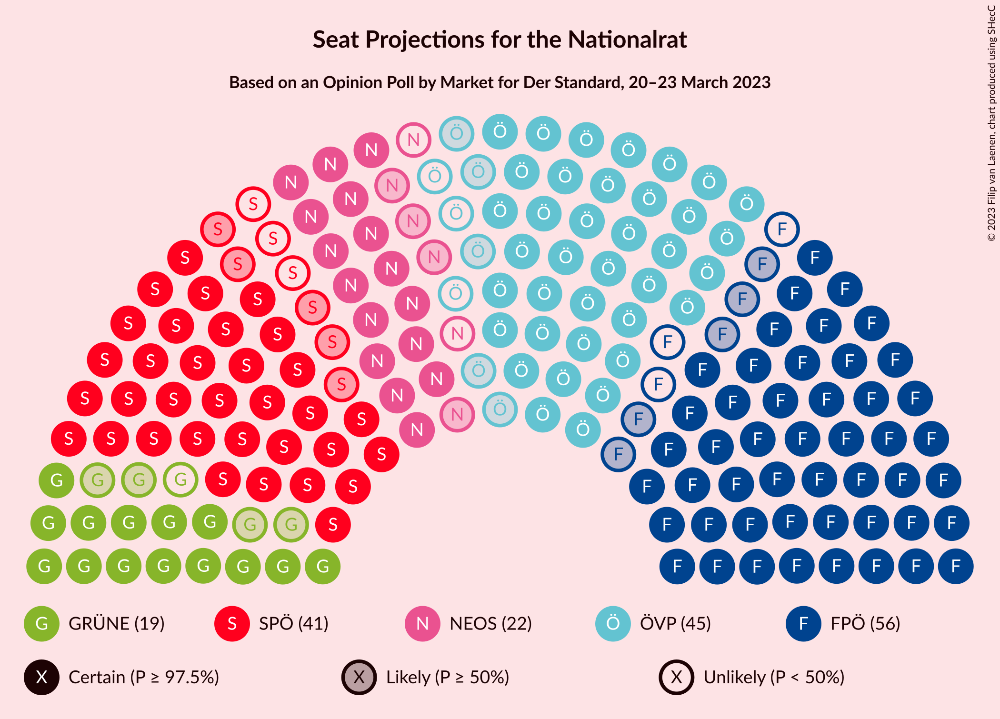

### Confidence Intervals

| Party | Last Result | Median | 80% Confidence Interval | 90% Confidence Interval | 95% Confidence Interval | 99% Confidence Interval |
|:-----:|:-----------:|:------:|:-----------------------:|:-----------------------:|:-----------------------:|:-----------------------:|
| <a href="#freiheitliche-partei-österreichs">Freiheitliche Partei Österreichs</a> | 31 | 53 | 49–57 |48–58 |48–59 |46–61 |
| <a href="#österreichische-volkspartei">Österreichische Volkspartei</a> | 71 | 42 | 39–46 |38–47 |37–48 |35–50 |
| <a href="#sozialdemokratische-partei-österreichs">Sozialdemokratische Partei Österreichs</a> | 40 | 38 | 35–42 |34–43 |33–44 |32–46 |
| <a href="#neos–das-neue-österreich-und-liberales-forum">NEOS–Das Neue Österreich und Liberales Forum</a> | 15 | 20 | 17–23 |17–24 |16–24 |15–26 |
| <a href="#die-grünen–die-grüne-alternative">Die Grünen–Die Grüne Alternative</a> | 26 | 18 | 16–21 |15–22 |14–22 |13–24 |

### Freiheitliche Partei Österreichs

*For a full overview of the results for this party, see the [Freiheitliche Partei Österreichs](party-freiheitlicheparteiösterreichs.html) page.*

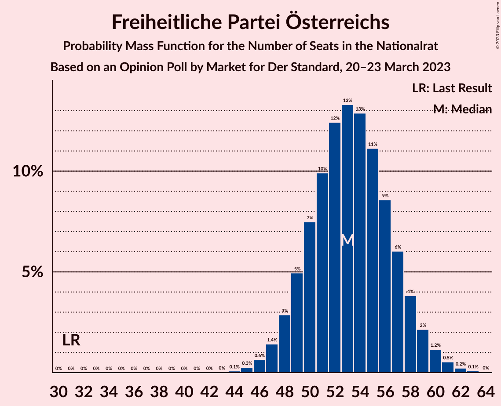

| Number of Seats | Probability | Accumulated | Special Marks |
|:---------------:|:-----------:|:-----------:|:-------------:|
| 31 | 0% | 100% | Last Result |
| 32 | 0% | 100% |  |
| 33 | 0% | 100% |  |
| 34 | 0% | 100% |  |
| 35 | 0% | 100% |  |
| 36 | 0% | 100% |  |
| 37 | 0% | 100% |  |
| 38 | 0% | 100% |  |
| 39 | 0% | 100% |  |
| 40 | 0% | 100% |  |
| 41 | 0% | 100% |  |
| 42 | 0% | 100% |  |
| 43 | 0% | 100% |  |
| 44 | 0.1% | 100% |  |
| 45 | 0.3% | 99.9% |  |
| 46 | 0.6% | 99.6% |  |
| 47 | 1.4% | 99.0% |  |
| 48 | 3% | 98% |  |
| 49 | 5% | 95% |  |
| 50 | 7% | 90% |  |
| 51 | 10% | 82% |  |
| 52 | 12% | 72% |  |
| 53 | 13% | 60% | Median |
| 54 | 13% | 47% |  |
| 55 | 11% | 34% |  |
| 56 | 9% | 23% |  |
| 57 | 6% | 14% |  |
| 58 | 4% | 8% |  |
| 59 | 2% | 4% |  |
| 60 | 1.2% | 2% |  |
| 61 | 0.5% | 0.9% |  |
| 62 | 0.2% | 0.4% |  |
| 63 | 0.1% | 0.1% |  |
| 64 | 0% | 0% |  |

### Österreichische Volkspartei

*For a full overview of the results for this party, see the [Österreichische Volkspartei](party-österreichischevolkspartei.html) page.*

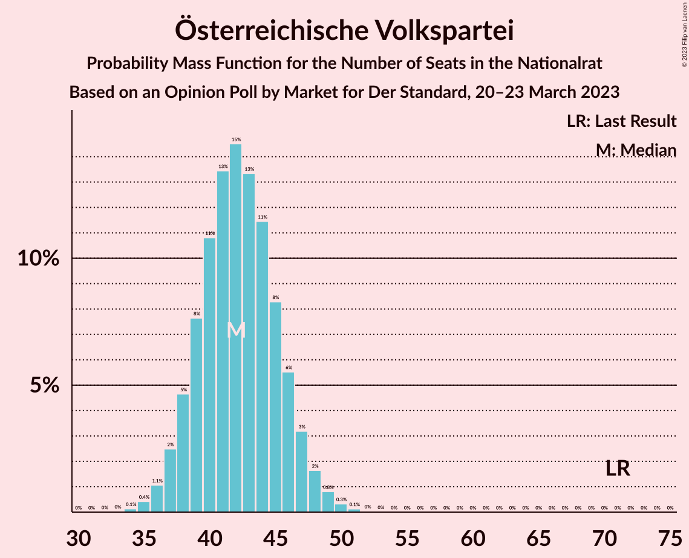

| Number of Seats | Probability | Accumulated | Special Marks |
|:---------------:|:-----------:|:-----------:|:-------------:|
| 34 | 0.1% | 100% |  |
| 35 | 0.4% | 99.8% |  |
| 36 | 1.1% | 99.4% |  |
| 37 | 2% | 98% |  |
| 38 | 5% | 96% |  |
| 39 | 8% | 91% |  |
| 40 | 11% | 84% |  |
| 41 | 13% | 73% |  |
| 42 | 15% | 59% | Median |
| 43 | 13% | 45% |  |
| 44 | 11% | 31% |  |
| 45 | 8% | 20% |  |
| 46 | 6% | 12% |  |
| 47 | 3% | 6% |  |
| 48 | 2% | 3% |  |
| 49 | 0.8% | 1.3% |  |
| 50 | 0.3% | 0.5% |  |
| 51 | 0.1% | 0.2% |  |
| 52 | 0% | 0.1% |  |
| 53 | 0% | 0% |  |
| 54 | 0% | 0% |  |
| 55 | 0% | 0% |  |
| 56 | 0% | 0% |  |
| 57 | 0% | 0% |  |
| 58 | 0% | 0% |  |
| 59 | 0% | 0% |  |
| 60 | 0% | 0% |  |
| 61 | 0% | 0% |  |
| 62 | 0% | 0% |  |
| 63 | 0% | 0% |  |
| 64 | 0% | 0% |  |
| 65 | 0% | 0% |  |
| 66 | 0% | 0% |  |
| 67 | 0% | 0% |  |
| 68 | 0% | 0% |  |
| 69 | 0% | 0% |  |
| 70 | 0% | 0% |  |
| 71 | 0% | 0% | Last Result |

### Sozialdemokratische Partei Österreichs

*For a full overview of the results for this party, see the [Sozialdemokratische Partei Österreichs](party-sozialdemokratischeparteiösterreichs.html) page.*

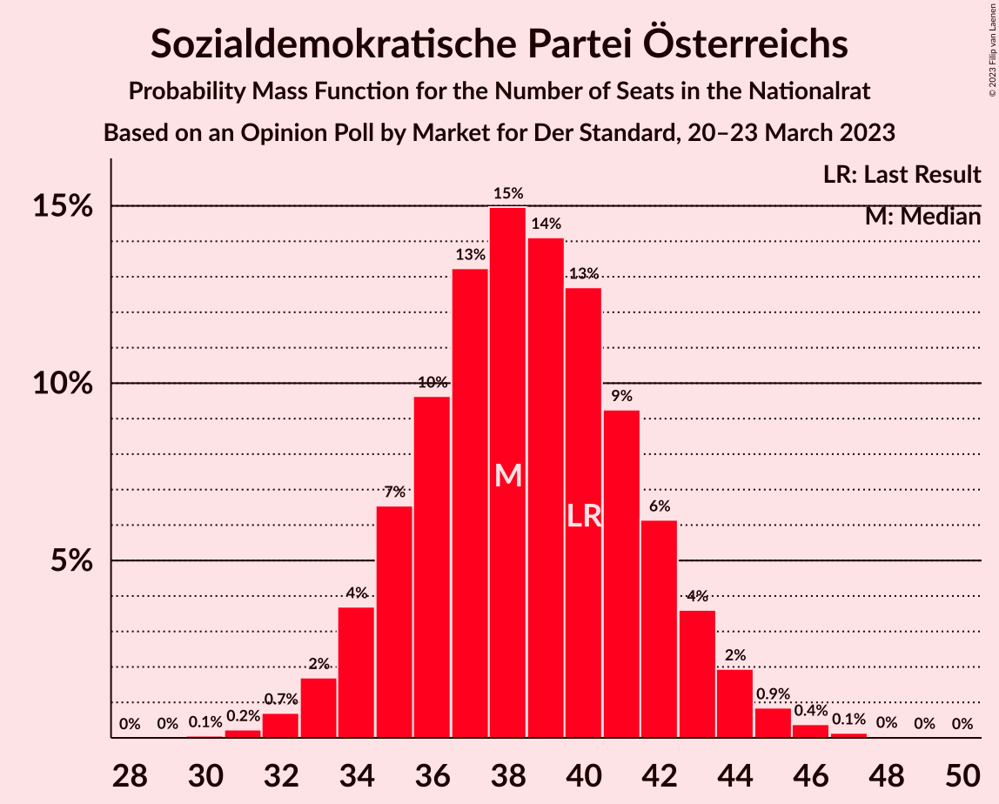

| Number of Seats | Probability | Accumulated | Special Marks |
|:---------------:|:-----------:|:-----------:|:-------------:|
| 30 | 0.1% | 100% |  |
| 31 | 0.2% | 99.9% |  |
| 32 | 0.7% | 99.7% |  |
| 33 | 2% | 99.0% |  |
| 34 | 4% | 97% |  |
| 35 | 7% | 94% |  |
| 36 | 10% | 87% |  |
| 37 | 13% | 77% |  |
| 38 | 15% | 64% | Median |
| 39 | 14% | 49% |  |
| 40 | 13% | 35% | Last Result |
| 41 | 9% | 22% |  |
| 42 | 6% | 13% |  |
| 43 | 4% | 7% |  |
| 44 | 2% | 3% |  |
| 45 | 0.9% | 1.4% |  |
| 46 | 0.4% | 0.6% |  |
| 47 | 0.1% | 0.2% |  |
| 48 | 0% | 0.1% |  |
| 49 | 0% | 0% |  |

### NEOS–Das Neue Österreich und Liberales Forum

*For a full overview of the results for this party, see the [NEOS–Das Neue Österreich und Liberales Forum](party-neos–dasneueösterreichundliberalesforum.html) page.*

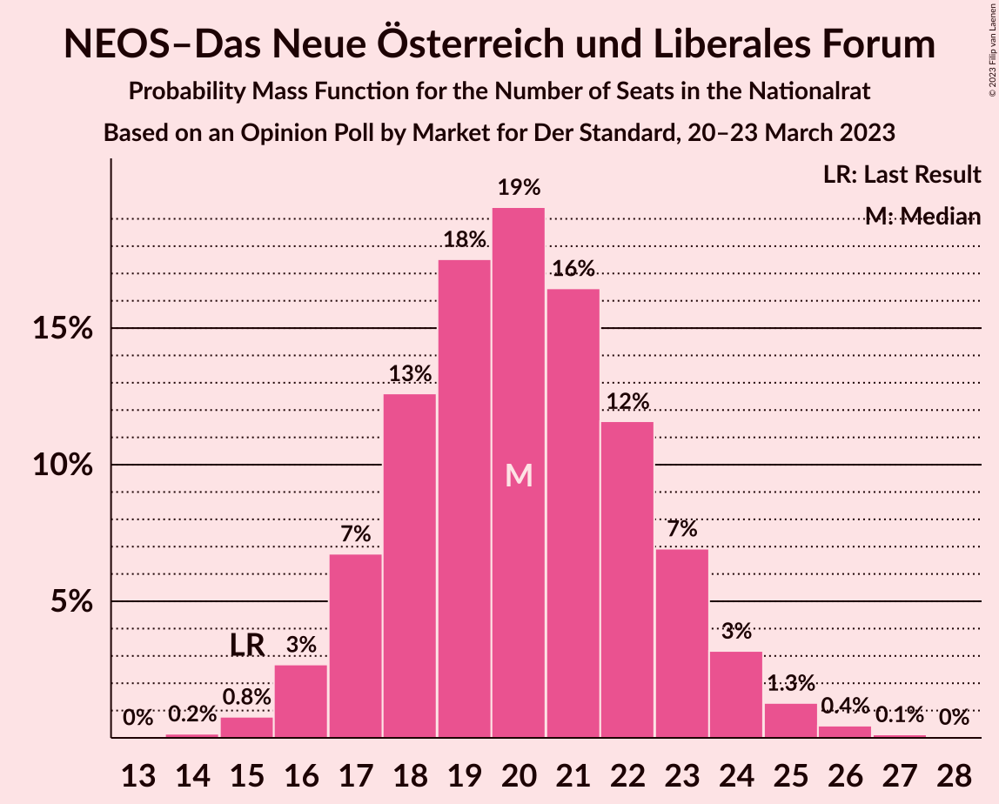

| Number of Seats | Probability | Accumulated | Special Marks |
|:---------------:|:-----------:|:-----------:|:-------------:|
| 14 | 0.2% | 100% |  |
| 15 | 0.8% | 99.8% | Last Result |
| 16 | 3% | 99.1% |  |
| 17 | 7% | 96% |  |
| 18 | 13% | 90% |  |
| 19 | 18% | 77% |  |
| 20 | 19% | 59% | Median |
| 21 | 16% | 40% |  |
| 22 | 12% | 24% |  |
| 23 | 7% | 12% |  |
| 24 | 3% | 5% |  |
| 25 | 1.3% | 2% |  |
| 26 | 0.4% | 0.6% |  |
| 27 | 0.1% | 0.2% |  |
| 28 | 0% | 0% |  |

### Die Grünen–Die Grüne Alternative

*For a full overview of the results for this party, see the [Die Grünen–Die Grüne Alternative](party-diegrünen–diegrünealternative.html) page.*

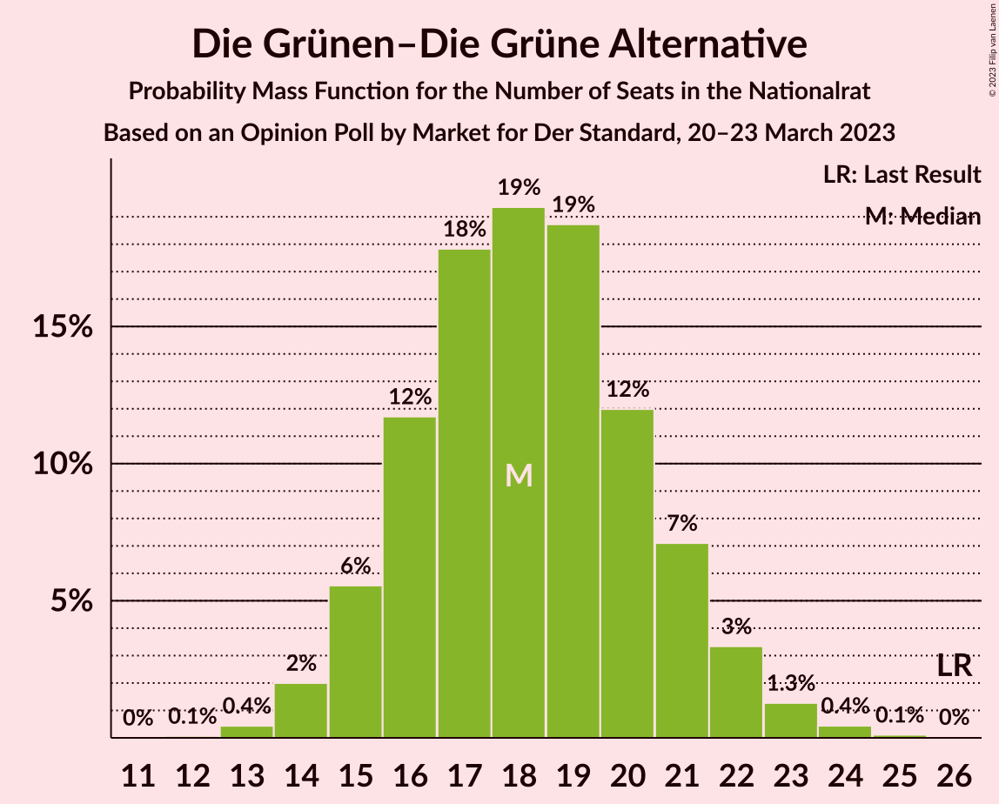

| Number of Seats | Probability | Accumulated | Special Marks |
|:---------------:|:-----------:|:-----------:|:-------------:|
| 12 | 0.1% | 100% |  |
| 13 | 0.4% | 99.9% |  |
| 14 | 2% | 99.5% |  |
| 15 | 6% | 97% |  |
| 16 | 12% | 92% |  |
| 17 | 18% | 80% |  |
| 18 | 19% | 62% | Median |
| 19 | 19% | 43% |  |
| 20 | 12% | 24% |  |
| 21 | 7% | 12% |  |
| 22 | 3% | 5% |  |
| 23 | 1.3% | 2% |  |
| 24 | 0.4% | 0.6% |  |
| 25 | 0.1% | 0.1% |  |
| 26 | 0% | 0% | Last Result |

## Coalitions

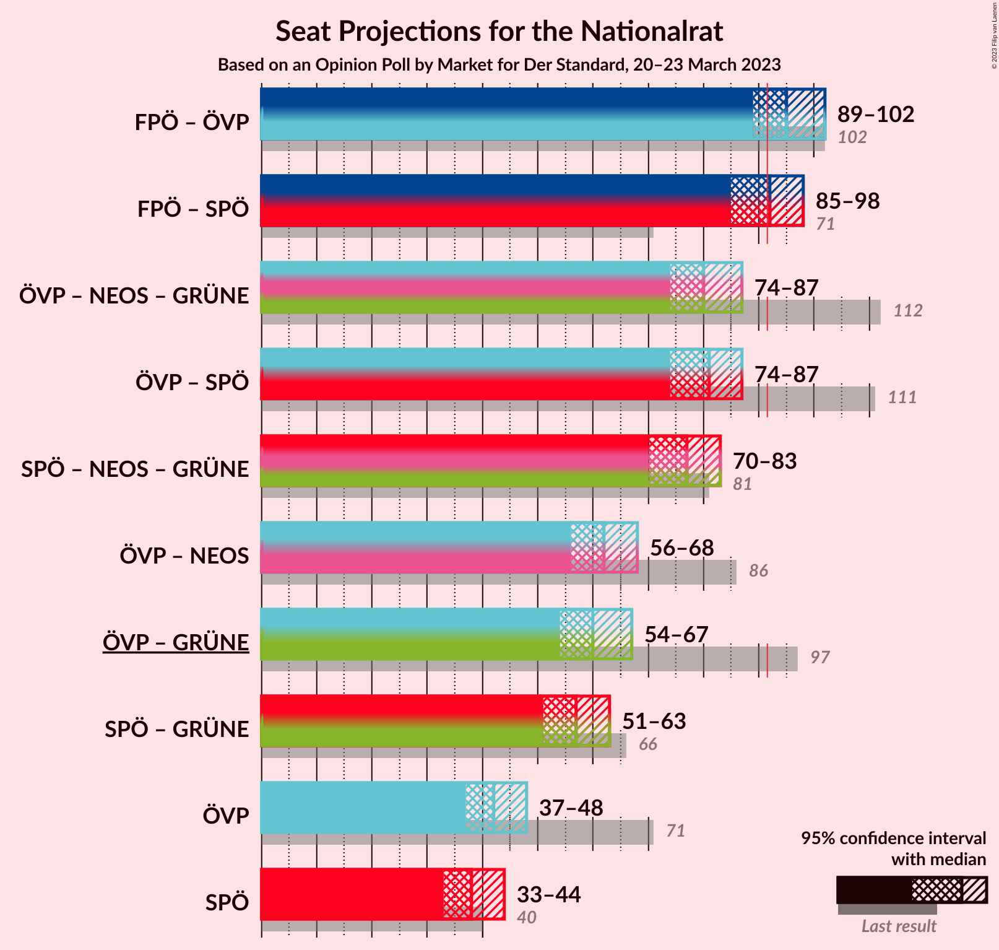

### Confidence Intervals

| Coalition | Last Result | Median | Majority? | 80% Confidence Interval | 90% Confidence Interval | 95% Confidence Interval | 99% Confidence Interval |
|:---------:|:-----------:|:------:|:---------:|:-----------------------:|:-----------------------:|:-----------------------:|:-----------------------:|
| Freiheitliche Partei Österreichs – Österreichische Volkspartei | 102 | 95 | 88% | 91–100 | 90–101 | 89–102 | 87–104 |
| Freiheitliche Partei Österreichs – Sozialdemokratische Partei Österreichs | 71 | 92 | 53% | 88–96 | 86–97 | 85–98 | 83–100 |
| Österreichische Volkspartei – NEOS–Das Neue Österreich und Liberales Forum – Die Grünen–Die Grüne Alternative | 112 | 80 | 0% | 76–85 | 75–86 | 74–87 | 72–89 |
| Österreichische Volkspartei – Sozialdemokratische Partei Österreichs | 111 | 81 | 0.1% | 76–85 | 75–86 | 74–87 | 72–89 |
| Sozialdemokratische Partei Österreichs – NEOS–Das Neue Österreich und Liberales Forum – Die Grünen–Die Grüne Alternative | 81 | 77 | 0% | 73–81 | 72–82 | 70–83 | 68–85 |
| Österreichische Volkspartei – NEOS–Das Neue Österreich und Liberales Forum | 86 | 62 | 0% | 58–66 | 57–67 | 56–68 | 54–70 |
| Österreichische Volkspartei – Die Grünen–Die Grüne Alternative | 97 | 60 | 0% | 56–64 | 55–66 | 54–67 | 53–69 |
| Sozialdemokratische Partei Österreichs – Die Grünen–Die Grüne Alternative | 66 | 57 | 0% | 53–61 | 52–62 | 51–63 | 49–65 |
| Österreichische Volkspartei | 71 | 42 | 0% | 39–46 | 38–47 | 37–48 | 35–50 |
| Sozialdemokratische Partei Österreichs | 40 | 38 | 0% | 35–42 | 34–43 | 33–44 | 32–46 |

### Freiheitliche Partei Österreichs – Österreichische Volkspartei

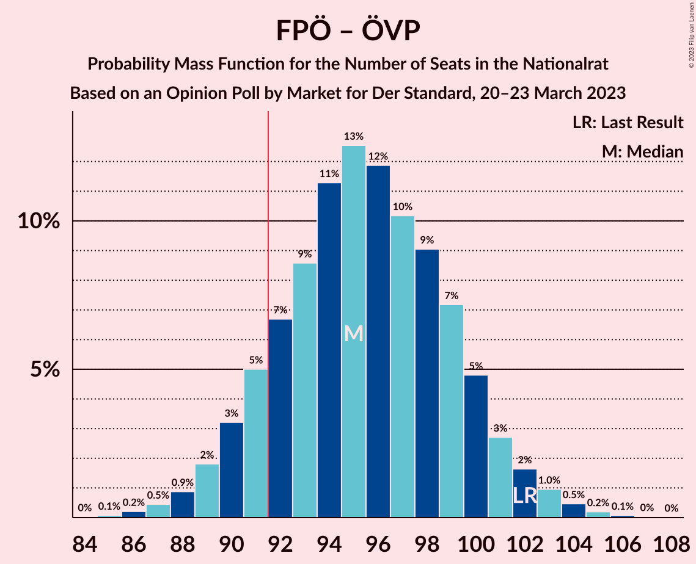

| Number of Seats | Probability | Accumulated | Special Marks |
|:---------------:|:-----------:|:-----------:|:-------------:|
| 85 | 0.1% | 100% |  |
| 86 | 0.2% | 99.9% |  |
| 87 | 0.5% | 99.7% |  |
| 88 | 0.9% | 99.2% |  |
| 89 | 2% | 98% |  |
| 90 | 3% | 97% |  |
| 91 | 5% | 93% |  |
| 92 | 7% | 88% | Majority |
| 93 | 9% | 82% |  |
| 94 | 11% | 73% |  |
| 95 | 13% | 62% | Median |
| 96 | 12% | 49% |  |
| 97 | 10% | 37% |  |
| 98 | 9% | 27% |  |
| 99 | 7% | 18% |  |
| 100 | 5% | 11% |  |
| 101 | 3% | 6% |  |
| 102 | 2% | 3% | Last Result |
| 103 | 1.0% | 2% |  |
| 104 | 0.5% | 0.8% |  |
| 105 | 0.2% | 0.3% |  |
| 106 | 0.1% | 0.1% |  |
| 107 | 0% | 0.1% |  |
| 108 | 0% | 0% |  |

### Freiheitliche Partei Österreichs – Sozialdemokratische Partei Österreichs

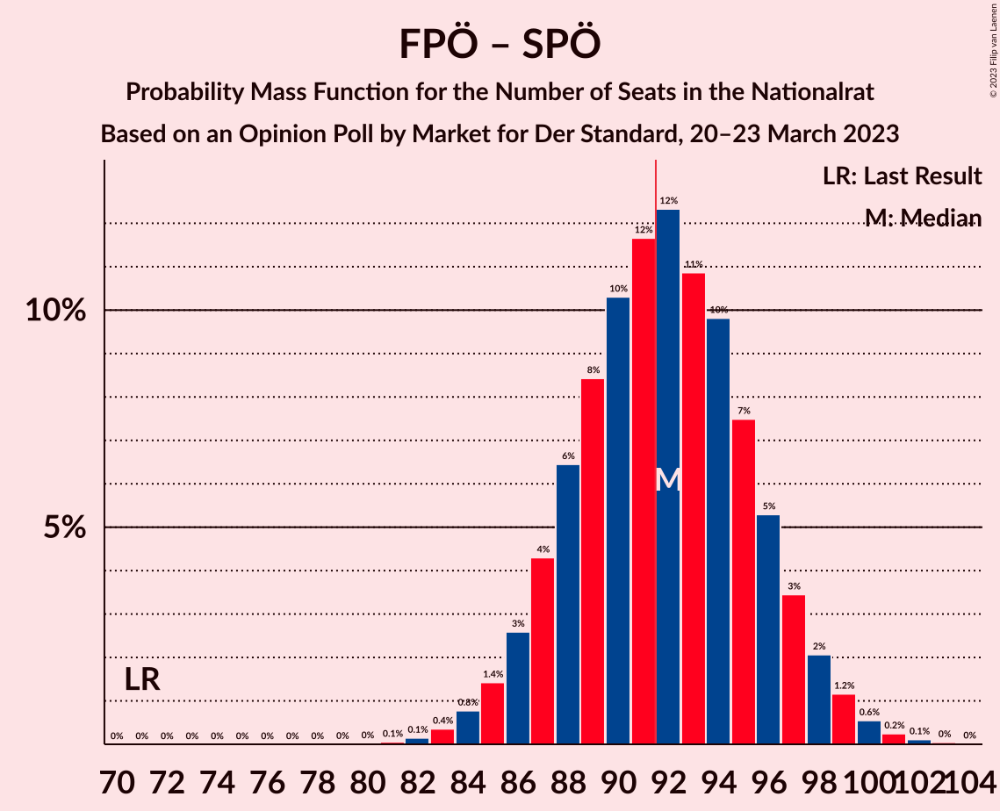

| Number of Seats | Probability | Accumulated | Special Marks |
|:---------------:|:-----------:|:-----------:|:-------------:|
| 71 | 0% | 100% | Last Result |
| 72 | 0% | 100% |  |
| 73 | 0% | 100% |  |
| 74 | 0% | 100% |  |
| 75 | 0% | 100% |  |
| 76 | 0% | 100% |  |
| 77 | 0% | 100% |  |
| 78 | 0% | 100% |  |
| 79 | 0% | 100% |  |
| 80 | 0% | 100% |  |
| 81 | 0.1% | 100% |  |
| 82 | 0.1% | 99.9% |  |
| 83 | 0.4% | 99.8% |  |
| 84 | 0.8% | 99.4% |  |
| 85 | 1.4% | 98.6% |  |
| 86 | 3% | 97% |  |
| 87 | 4% | 95% |  |
| 88 | 6% | 90% |  |
| 89 | 8% | 84% |  |
| 90 | 10% | 75% |  |
| 91 | 12% | 65% | Median |
| 92 | 12% | 53% | Majority |
| 93 | 11% | 41% |  |
| 94 | 10% | 30% |  |
| 95 | 7% | 20% |  |
| 96 | 5% | 13% |  |
| 97 | 3% | 8% |  |
| 98 | 2% | 4% |  |
| 99 | 1.2% | 2% |  |
| 100 | 0.6% | 1.0% |  |
| 101 | 0.2% | 0.4% |  |
| 102 | 0.1% | 0.2% |  |
| 103 | 0% | 0.1% |  |
| 104 | 0% | 0% |  |

### Österreichische Volkspartei – NEOS–Das Neue Österreich und Liberales Forum – Die Grünen–Die Grüne Alternative

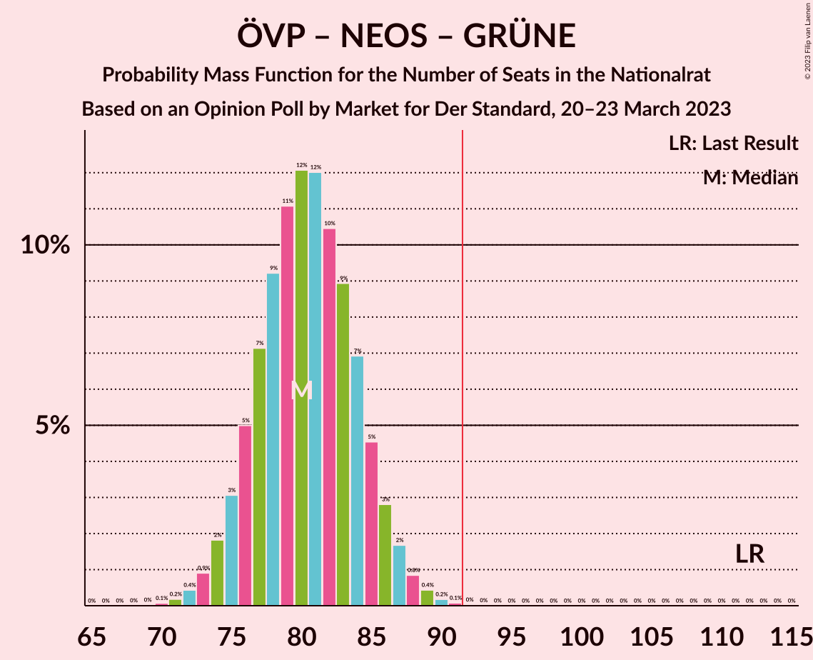

| Number of Seats | Probability | Accumulated | Special Marks |
|:---------------:|:-----------:|:-----------:|:-------------:|
| 70 | 0.1% | 100% |  |
| 71 | 0.2% | 99.9% |  |
| 72 | 0.4% | 99.7% |  |
| 73 | 0.9% | 99.3% |  |
| 74 | 2% | 98% |  |
| 75 | 3% | 97% |  |
| 76 | 5% | 93% |  |
| 77 | 7% | 88% |  |
| 78 | 9% | 81% |  |
| 79 | 11% | 72% |  |
| 80 | 12% | 61% | Median |
| 81 | 12% | 49% |  |
| 82 | 10% | 37% |  |
| 83 | 9% | 26% |  |
| 84 | 7% | 18% |  |
| 85 | 5% | 11% |  |
| 86 | 3% | 6% |  |
| 87 | 2% | 3% |  |
| 88 | 0.8% | 2% |  |
| 89 | 0.4% | 0.7% |  |
| 90 | 0.2% | 0.3% |  |
| 91 | 0.1% | 0.1% |  |
| 92 | 0% | 0% | Majority |
| 93 | 0% | 0% |  |
| 94 | 0% | 0% |  |
| 95 | 0% | 0% |  |
| 96 | 0% | 0% |  |
| 97 | 0% | 0% |  |
| 98 | 0% | 0% |  |
| 99 | 0% | 0% |  |
| 100 | 0% | 0% |  |
| 101 | 0% | 0% |  |
| 102 | 0% | 0% |  |
| 103 | 0% | 0% |  |
| 104 | 0% | 0% |  |
| 105 | 0% | 0% |  |
| 106 | 0% | 0% |  |
| 107 | 0% | 0% |  |
| 108 | 0% | 0% |  |
| 109 | 0% | 0% |  |
| 110 | 0% | 0% |  |
| 111 | 0% | 0% |  |
| 112 | 0% | 0% | Last Result |

### Österreichische Volkspartei – Sozialdemokratische Partei Österreichs

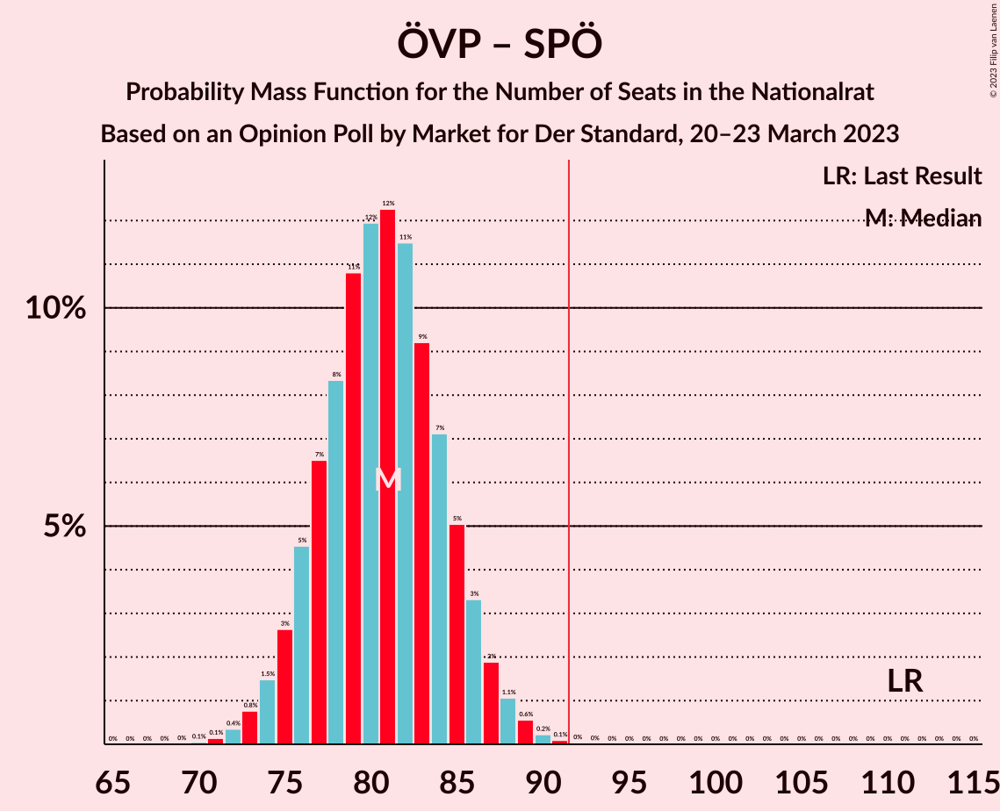

| Number of Seats | Probability | Accumulated | Special Marks |
|:---------------:|:-----------:|:-----------:|:-------------:|
| 70 | 0.1% | 100% |  |
| 71 | 0.1% | 99.9% |  |
| 72 | 0.4% | 99.8% |  |
| 73 | 0.8% | 99.4% |  |
| 74 | 1.5% | 98.7% |  |
| 75 | 3% | 97% |  |
| 76 | 5% | 95% |  |
| 77 | 7% | 90% |  |
| 78 | 8% | 83% |  |
| 79 | 11% | 75% |  |
| 80 | 12% | 64% | Median |
| 81 | 12% | 52% |  |
| 82 | 11% | 40% |  |
| 83 | 9% | 29% |  |
| 84 | 7% | 19% |  |
| 85 | 5% | 12% |  |
| 86 | 3% | 7% |  |
| 87 | 2% | 4% |  |
| 88 | 1.1% | 2% |  |
| 89 | 0.6% | 0.9% |  |
| 90 | 0.2% | 0.4% |  |
| 91 | 0.1% | 0.2% |  |
| 92 | 0% | 0.1% | Majority |
| 93 | 0% | 0% |  |
| 94 | 0% | 0% |  |
| 95 | 0% | 0% |  |
| 96 | 0% | 0% |  |
| 97 | 0% | 0% |  |
| 98 | 0% | 0% |  |
| 99 | 0% | 0% |  |
| 100 | 0% | 0% |  |
| 101 | 0% | 0% |  |
| 102 | 0% | 0% |  |
| 103 | 0% | 0% |  |
| 104 | 0% | 0% |  |
| 105 | 0% | 0% |  |
| 106 | 0% | 0% |  |
| 107 | 0% | 0% |  |
| 108 | 0% | 0% |  |
| 109 | 0% | 0% |  |
| 110 | 0% | 0% |  |
| 111 | 0% | 0% | Last Result |

### Sozialdemokratische Partei Österreichs – NEOS–Das Neue Österreich und Liberales Forum – Die Grünen–Die Grüne Alternative

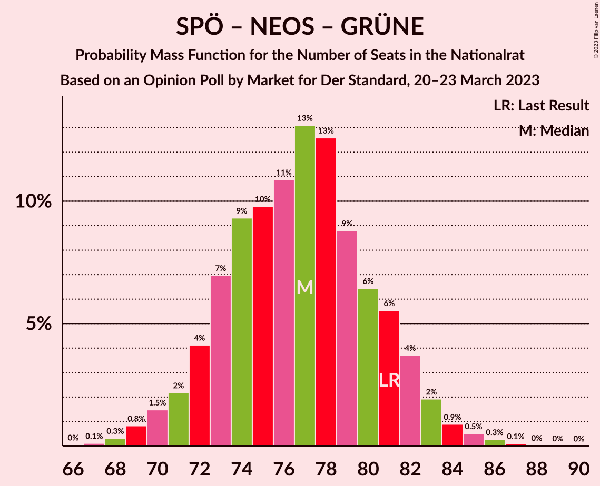

| Number of Seats | Probability | Accumulated | Special Marks |
|:---------------:|:-----------:|:-----------:|:-------------:|
| 66 | 0% | 100% |  |
| 67 | 0.1% | 99.9% |  |
| 68 | 0.3% | 99.8% |  |
| 69 | 0.8% | 99.5% |  |
| 70 | 1.5% | 98.7% |  |
| 71 | 2% | 97% |  |
| 72 | 4% | 95% |  |
| 73 | 7% | 91% |  |
| 74 | 9% | 84% |  |
| 75 | 10% | 75% |  |
| 76 | 11% | 65% | Median |
| 77 | 13% | 54% |  |
| 78 | 13% | 41% |  |
| 79 | 9% | 28% |  |
| 80 | 6% | 19% |  |
| 81 | 6% | 13% | Last Result |
| 82 | 4% | 7% |  |
| 83 | 2% | 4% |  |
| 84 | 0.9% | 2% |  |
| 85 | 0.5% | 0.9% |  |
| 86 | 0.3% | 0.4% |  |
| 87 | 0.1% | 0.2% |  |
| 88 | 0% | 0.1% |  |
| 89 | 0% | 0% |  |

### Österreichische Volkspartei – NEOS–Das Neue Österreich und Liberales Forum

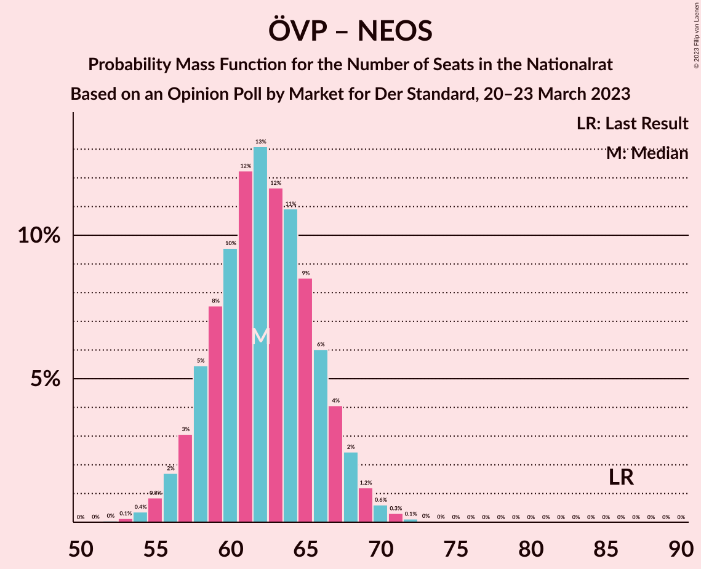

| Number of Seats | Probability | Accumulated | Special Marks |
|:---------------:|:-----------:|:-----------:|:-------------:|
| 52 | 0% | 100% |  |
| 53 | 0.1% | 99.9% |  |
| 54 | 0.4% | 99.8% |  |
| 55 | 0.8% | 99.4% |  |
| 56 | 2% | 98.6% |  |
| 57 | 3% | 97% |  |
| 58 | 5% | 94% |  |
| 59 | 8% | 88% |  |
| 60 | 10% | 81% |  |
| 61 | 12% | 71% |  |
| 62 | 13% | 59% | Median |
| 63 | 12% | 46% |  |
| 64 | 11% | 34% |  |
| 65 | 9% | 23% |  |
| 66 | 6% | 15% |  |
| 67 | 4% | 9% |  |
| 68 | 2% | 5% |  |
| 69 | 1.2% | 2% |  |
| 70 | 0.6% | 1.1% |  |
| 71 | 0.3% | 0.5% |  |
| 72 | 0.1% | 0.2% |  |
| 73 | 0% | 0.1% |  |
| 74 | 0% | 0% |  |
| 75 | 0% | 0% |  |
| 76 | 0% | 0% |  |
| 77 | 0% | 0% |  |
| 78 | 0% | 0% |  |
| 79 | 0% | 0% |  |
| 80 | 0% | 0% |  |
| 81 | 0% | 0% |  |
| 82 | 0% | 0% |  |
| 83 | 0% | 0% |  |
| 84 | 0% | 0% |  |
| 85 | 0% | 0% |  |
| 86 | 0% | 0% | Last Result |

### Österreichische Volkspartei – Die Grünen–Die Grüne Alternative

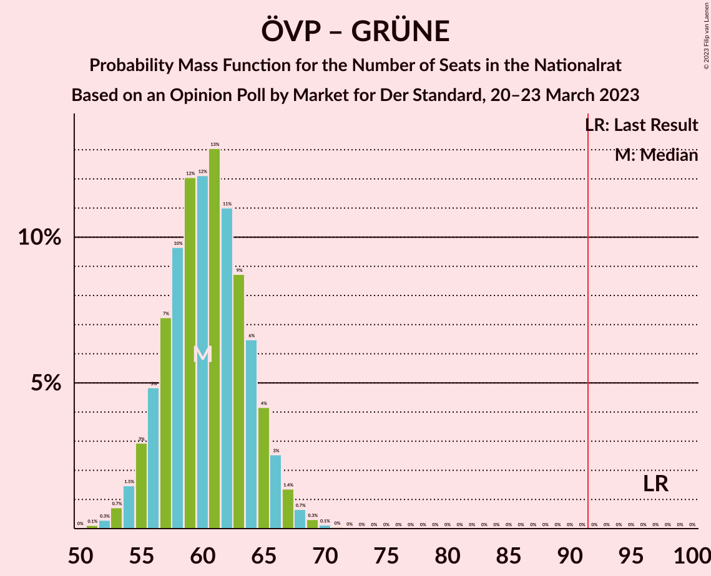

| Number of Seats | Probability | Accumulated | Special Marks |
|:---------------:|:-----------:|:-----------:|:-------------:|
| 50 | 0% | 100% |  |
| 51 | 0.1% | 99.9% |  |
| 52 | 0.3% | 99.8% |  |
| 53 | 0.7% | 99.5% |  |
| 54 | 1.5% | 98.8% |  |
| 55 | 3% | 97% |  |
| 56 | 5% | 94% |  |
| 57 | 7% | 90% |  |
| 58 | 10% | 82% |  |
| 59 | 12% | 73% |  |
| 60 | 12% | 61% | Median |
| 61 | 13% | 49% |  |
| 62 | 11% | 35% |  |
| 63 | 9% | 24% |  |
| 64 | 6% | 16% |  |
| 65 | 4% | 9% |  |
| 66 | 3% | 5% |  |
| 67 | 1.4% | 3% |  |
| 68 | 0.7% | 1.2% |  |
| 69 | 0.3% | 0.5% |  |
| 70 | 0.1% | 0.2% |  |
| 71 | 0% | 0.1% |  |
| 72 | 0% | 0% |  |
| 73 | 0% | 0% |  |
| 74 | 0% | 0% |  |
| 75 | 0% | 0% |  |
| 76 | 0% | 0% |  |
| 77 | 0% | 0% |  |
| 78 | 0% | 0% |  |
| 79 | 0% | 0% |  |
| 80 | 0% | 0% |  |
| 81 | 0% | 0% |  |
| 82 | 0% | 0% |  |
| 83 | 0% | 0% |  |
| 84 | 0% | 0% |  |
| 85 | 0% | 0% |  |
| 86 | 0% | 0% |  |
| 87 | 0% | 0% |  |
| 88 | 0% | 0% |  |
| 89 | 0% | 0% |  |
| 90 | 0% | 0% |  |
| 91 | 0% | 0% |  |
| 92 | 0% | 0% | Majority |
| 93 | 0% | 0% |  |
| 94 | 0% | 0% |  |
| 95 | 0% | 0% |  |
| 96 | 0% | 0% |  |
| 97 | 0% | 0% | Last Result |

### Sozialdemokratische Partei Österreichs – Die Grünen–Die Grüne Alternative

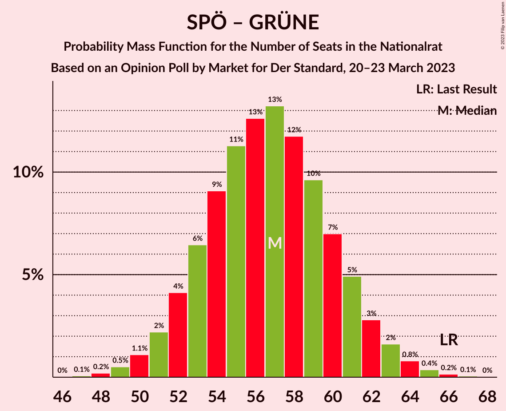

| Number of Seats | Probability | Accumulated | Special Marks |
|:---------------:|:-----------:|:-----------:|:-------------:|
| 47 | 0.1% | 100% |  |
| 48 | 0.2% | 99.9% |  |
| 49 | 0.5% | 99.7% |  |
| 50 | 1.1% | 99.2% |  |
| 51 | 2% | 98% |  |
| 52 | 4% | 96% |  |
| 53 | 6% | 92% |  |
| 54 | 9% | 85% |  |
| 55 | 11% | 76% |  |
| 56 | 13% | 65% | Median |
| 57 | 13% | 52% |  |
| 58 | 12% | 39% |  |
| 59 | 10% | 27% |  |
| 60 | 7% | 18% |  |
| 61 | 5% | 11% |  |
| 62 | 3% | 6% |  |
| 63 | 2% | 3% |  |
| 64 | 0.8% | 1.4% |  |
| 65 | 0.4% | 0.6% |  |
| 66 | 0.2% | 0.2% | Last Result |
| 67 | 0.1% | 0.1% |  |
| 68 | 0% | 0% |  |

### Österreichische Volkspartei

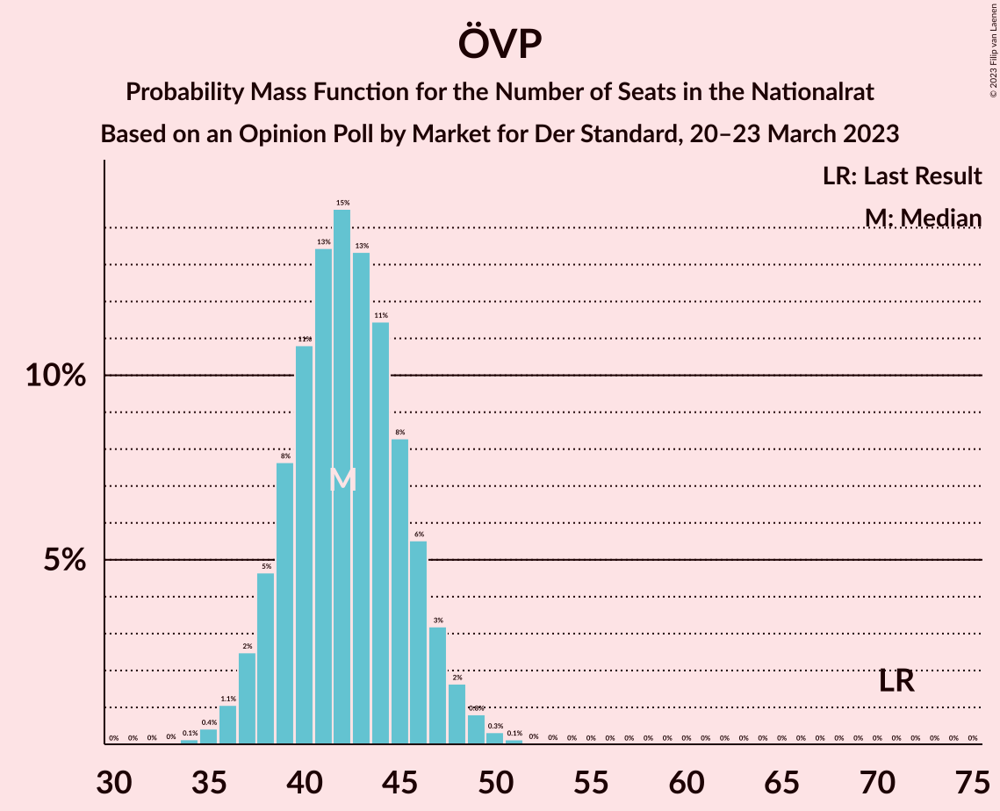

| Number of Seats | Probability | Accumulated | Special Marks |
|:---------------:|:-----------:|:-----------:|:-------------:|
| 34 | 0.1% | 100% |  |
| 35 | 0.4% | 99.8% |  |
| 36 | 1.1% | 99.4% |  |
| 37 | 2% | 98% |  |
| 38 | 5% | 96% |  |
| 39 | 8% | 91% |  |
| 40 | 11% | 84% |  |
| 41 | 13% | 73% |  |
| 42 | 15% | 59% | Median |
| 43 | 13% | 45% |  |
| 44 | 11% | 31% |  |
| 45 | 8% | 20% |  |
| 46 | 6% | 12% |  |
| 47 | 3% | 6% |  |
| 48 | 2% | 3% |  |
| 49 | 0.8% | 1.3% |  |
| 50 | 0.3% | 0.5% |  |
| 51 | 0.1% | 0.2% |  |
| 52 | 0% | 0.1% |  |
| 53 | 0% | 0% |  |
| 54 | 0% | 0% |  |
| 55 | 0% | 0% |  |
| 56 | 0% | 0% |  |
| 57 | 0% | 0% |  |
| 58 | 0% | 0% |  |
| 59 | 0% | 0% |  |
| 60 | 0% | 0% |  |
| 61 | 0% | 0% |  |
| 62 | 0% | 0% |  |
| 63 | 0% | 0% |  |
| 64 | 0% | 0% |  |
| 65 | 0% | 0% |  |
| 66 | 0% | 0% |  |
| 67 | 0% | 0% |  |
| 68 | 0% | 0% |  |
| 69 | 0% | 0% |  |
| 70 | 0% | 0% |  |
| 71 | 0% | 0% | Last Result |

### Sozialdemokratische Partei Österreichs

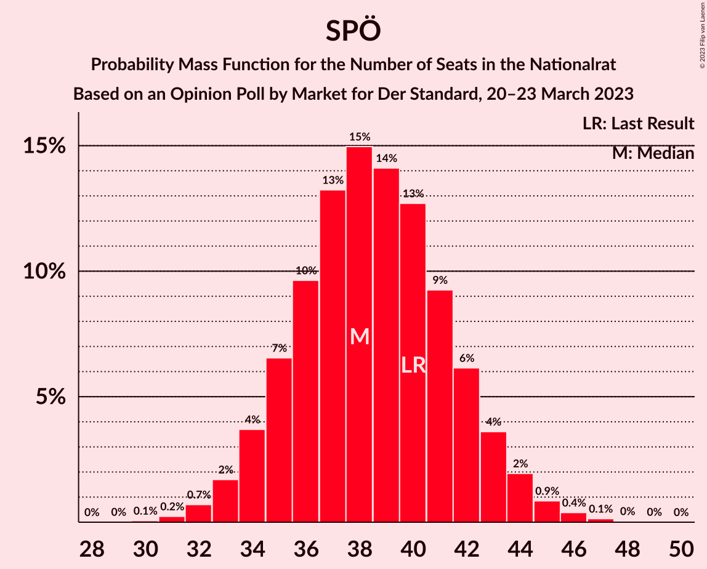

| Number of Seats | Probability | Accumulated | Special Marks |
|:---------------:|:-----------:|:-----------:|:-------------:|
| 30 | 0.1% | 100% |  |
| 31 | 0.2% | 99.9% |  |
| 32 | 0.7% | 99.7% |  |
| 33 | 2% | 99.0% |  |
| 34 | 4% | 97% |  |
| 35 | 7% | 94% |  |
| 36 | 10% | 87% |  |
| 37 | 13% | 77% |  |
| 38 | 15% | 64% | Median |
| 39 | 14% | 49% |  |
| 40 | 13% | 35% | Last Result |
| 41 | 9% | 22% |  |
| 42 | 6% | 13% |  |
| 43 | 4% | 7% |  |
| 44 | 2% | 3% |  |
| 45 | 0.9% | 1.4% |  |
| 46 | 0.4% | 0.6% |  |
| 47 | 0.1% | 0.2% |  |
| 48 | 0% | 0.1% |  |
| 49 | 0% | 0% |  |

## Technical Information

### Opinion Poll

+ **Polling firm:** Market
+ **Commissioner(s):** Der Standard
+ **Fieldwork period:** 20–23 March 2023

### Calculations

+ **Sample size:** 800
+ **Simulations done:** 1,048,576
+ **Error estimate:** 1.19%

