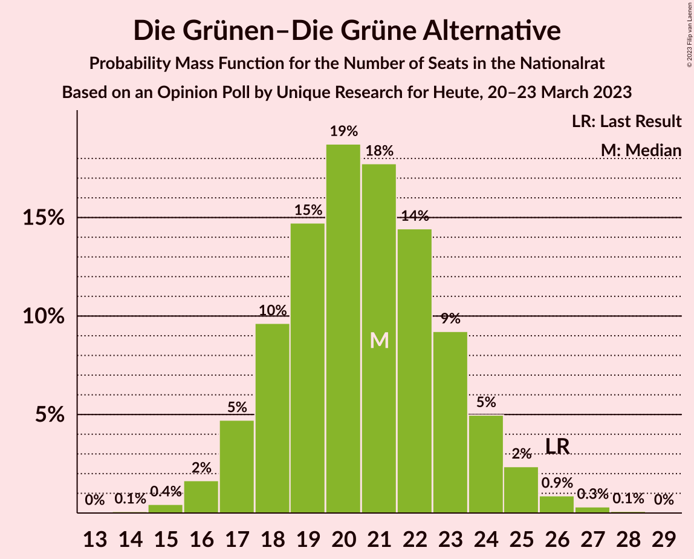

# Opinion Poll by Unique Research for Heute, 20–23 March 2023

<a href="#voting-intentions">Voting Intentions</a> | <a href="#seats">Seats</a> | <a href="#coalitions">Coalitions</a> | <a href="#technical-information">Technical Information</a>

## Voting Intentions

### Confidence Intervals

| Party | Last Result | Poll Result | 80% Confidence Interval | 90% Confidence Interval | 95% Confidence Interval | 99% Confidence Interval |
|:-----:|:-----------:|:-----------:|:-----------------------:|:-----------------------:|:-----------------------:|:-----------------------:|
| Freiheitliche Partei Österreichs | 16.2% | 28.0% | 26.0–30.1% |25.5–30.7% |25.0–31.2% |24.1–32.3% |
| Österreichische Volkspartei | 37.5% | 25.0% | 23.1–27.0% |22.6–27.6% |22.1–28.1% |21.2–29.1% |
| Sozialdemokratische Partei Österreichs | 21.2% | 24.0% | 22.1–26.0% |21.6–26.6% |21.2–27.1% |20.3–28.1% |
| Die Grünen–Die Grüne Alternative | 13.9% | 11.0% | 9.7–12.5% |9.3–13.0% |9.0–13.4% |8.4–14.1% |
| NEOS–Das Neue Österreich und Liberales Forum | 8.1% | 9.0% | 7.8–10.4% |7.5–10.8% |7.2–11.2% |6.7–11.9% |

*Note:* The poll result column reflects the actual value used in the calculations. Published results may vary slightly, and in addition be rounded to fewer digits.

## Seats

### Confidence Intervals

| Party | Last Result | Median | 80% Confidence Interval | 90% Confidence Interval | 95% Confidence Interval | 99% Confidence Interval |
|:-----:|:-----------:|:------:|:-----------------------:|:-----------------------:|:-----------------------:|:-----------------------:|
| <a href="#freiheitliche-partei-österreichs">Freiheitliche Partei Österreichs</a> | 31 | 53 | 49–57 |48–58 |47–59 |45–61 |
| <a href="#österreichische-volkspartei">Österreichische Volkspartei</a> | 71 | 47 | 43–51 |42–52 |41–53 |40–55 |
| <a href="#sozialdemokratische-partei-österreichs">Sozialdemokratische Partei Österreichs</a> | 40 | 45 | 42–49 |40–50 |40–51 |38–53 |
| <a href="#die-grünen–die-grüne-alternative">Die Grünen–Die Grüne Alternative</a> | 26 | 21 | 18–23 |17–24 |17–25 |15–26 |
| <a href="#neos–das-neue-österreich-und-liberales-forum">NEOS–Das Neue Österreich und Liberales Forum</a> | 15 | 17 | 14–19 |14–20 |13–21 |12–22 |

### Freiheitliche Partei Österreichs

*For a full overview of the results for this party, see the [Freiheitliche Partei Österreichs](party-freiheitlicheparteiösterreichs.html) page.*

| Number of Seats | Probability | Accumulated | Special Marks |
|:---------------:|:-----------:|:-----------:|:-------------:|
| 31 | 0% | 100% | Last Result |
| 32 | 0% | 100% |  |
| 33 | 0% | 100% |  |
| 34 | 0% | 100% |  |
| 35 | 0% | 100% |  |
| 36 | 0% | 100% |  |
| 37 | 0% | 100% |  |
| 38 | 0% | 100% |  |
| 39 | 0% | 100% |  |
| 40 | 0% | 100% |  |
| 41 | 0% | 100% |  |
| 42 | 0% | 100% |  |
| 43 | 0.1% | 100% |  |
| 44 | 0.2% | 99.9% |  |
| 45 | 0.5% | 99.7% |  |
| 46 | 1.1% | 99.2% |  |
| 47 | 2% | 98% |  |
| 48 | 4% | 96% |  |
| 49 | 6% | 92% |  |
| 50 | 9% | 86% |  |
| 51 | 11% | 77% |  |
| 52 | 13% | 66% |  |
| 53 | 13% | 53% | Median |
| 54 | 11% | 40% |  |
| 55 | 10% | 29% |  |
| 56 | 7% | 18% |  |
| 57 | 5% | 11% |  |
| 58 | 3% | 6% |  |
| 59 | 2% | 3% |  |
| 60 | 0.8% | 1.5% |  |
| 61 | 0.4% | 0.6% |  |
| 62 | 0.2% | 0.3% |  |
| 63 | 0.1% | 0.1% |  |
| 64 | 0% | 0% |  |

### Österreichische Volkspartei

*For a full overview of the results for this party, see the [Österreichische Volkspartei](party-österreichischevolkspartei.html) page.*

| Number of Seats | Probability | Accumulated | Special Marks |
|:---------------:|:-----------:|:-----------:|:-------------:|
| 38 | 0.1% | 100% |  |
| 39 | 0.3% | 99.9% |  |
| 40 | 0.7% | 99.6% |  |
| 41 | 2% | 98.9% |  |
| 42 | 3% | 97% |  |
| 43 | 5% | 94% |  |
| 44 | 8% | 89% |  |
| 45 | 11% | 81% |  |
| 46 | 13% | 71% |  |
| 47 | 14% | 58% | Median |
| 48 | 13% | 44% |  |
| 49 | 11% | 31% |  |
| 50 | 8% | 20% |  |
| 51 | 6% | 12% |  |
| 52 | 3% | 7% |  |
| 53 | 2% | 3% |  |
| 54 | 0.9% | 2% |  |
| 55 | 0.4% | 0.7% |  |
| 56 | 0.2% | 0.3% |  |
| 57 | 0.1% | 0.1% |  |
| 58 | 0% | 0% |  |
| 59 | 0% | 0% |  |
| 60 | 0% | 0% |  |
| 61 | 0% | 0% |  |
| 62 | 0% | 0% |  |
| 63 | 0% | 0% |  |
| 64 | 0% | 0% |  |
| 65 | 0% | 0% |  |
| 66 | 0% | 0% |  |
| 67 | 0% | 0% |  |
| 68 | 0% | 0% |  |
| 69 | 0% | 0% |  |
| 70 | 0% | 0% |  |
| 71 | 0% | 0% | Last Result |

### Sozialdemokratische Partei Österreichs

*For a full overview of the results for this party, see the [Sozialdemokratische Partei Österreichs](party-sozialdemokratischeparteiösterreichs.html) page.*

| Number of Seats | Probability | Accumulated | Special Marks |
|:---------------:|:-----------:|:-----------:|:-------------:|
| 36 | 0.1% | 100% |  |
| 37 | 0.2% | 99.9% |  |
| 38 | 0.6% | 99.7% |  |
| 39 | 1.3% | 99.1% |  |
| 40 | 3% | 98% | Last Result |
| 41 | 5% | 95% |  |
| 42 | 8% | 90% |  |
| 43 | 10% | 82% |  |
| 44 | 13% | 72% |  |
| 45 | 14% | 59% | Median |
| 46 | 13% | 45% |  |
| 47 | 11% | 32% |  |
| 48 | 8% | 21% |  |
| 49 | 6% | 13% |  |
| 50 | 3% | 7% |  |
| 51 | 2% | 4% |  |
| 52 | 1.0% | 2% |  |
| 53 | 0.4% | 0.7% |  |
| 54 | 0.2% | 0.3% |  |
| 55 | 0.1% | 0.1% |  |
| 56 | 0% | 0% |  |

### Die Grünen–Die Grüne Alternative

*For a full overview of the results for this party, see the [Die Grünen–Die Grüne Alternative](party-diegrünen–diegrünealternative.html) page.*

| Number of Seats | Probability | Accumulated | Special Marks |
|:---------------:|:-----------:|:-----------:|:-------------:|
| 14 | 0.1% | 100% |  |
| 15 | 0.4% | 99.9% |  |
| 16 | 2% | 99.5% |  |
| 17 | 5% | 98% |  |
| 18 | 10% | 93% |  |
| 19 | 15% | 83% |  |
| 20 | 19% | 69% |  |
| 21 | 18% | 50% | Median |
| 22 | 14% | 32% |  |
| 23 | 9% | 18% |  |
| 24 | 5% | 9% |  |
| 25 | 2% | 4% |  |
| 26 | 0.9% | 1.3% | Last Result |
| 27 | 0.3% | 0.4% |  |
| 28 | 0.1% | 0.1% |  |
| 29 | 0% | 0% |  |

### NEOS–Das Neue Österreich und Liberales Forum

*For a full overview of the results for this party, see the [NEOS–Das Neue Österreich und Liberales Forum](party-neos–dasneueösterreichundliberalesforum.html) page.*

| Number of Seats | Probability | Accumulated | Special Marks |
|:---------------:|:-----------:|:-----------:|:-------------:|
| 11 | 0.1% | 100% |  |
| 12 | 0.7% | 99.9% |  |
| 13 | 3% | 99.1% |  |
| 14 | 8% | 96% |  |
| 15 | 14% | 88% | Last Result |
| 16 | 19% | 74% |  |
| 17 | 20% | 54% | Median |
| 18 | 16% | 34% |  |
| 19 | 10% | 19% |  |
| 20 | 5% | 9% |  |
| 21 | 2% | 3% |  |
| 22 | 0.8% | 1.1% |  |
| 23 | 0.2% | 0.3% |  |
| 24 | 0.1% | 0.1% |  |
| 25 | 0% | 0% |  |

## Coalitions

### Confidence Intervals

| Coalition | Last Result | Median | Majority? | 80% Confidence Interval | 90% Confidence Interval | 95% Confidence Interval | 99% Confidence Interval |
|:---------:|:-----------:|:------:|:---------:|:-----------------------:|:-----------------------:|:-----------------------:|:-----------------------:|
| Freiheitliche Partei Österreichs – Österreichische Volkspartei | 102 | 100 | 99.0% | 95–104 | 94–105 | 93–107 | 90–109 |
| Freiheitliche Partei Österreichs – Sozialdemokratische Partei Österreichs | 71 | 98 | 97% | 93–102 | 92–104 | 91–105 | 89–107 |
| Österreichische Volkspartei – Sozialdemokratische Partei Österreichs | 111 | 92 | 59% | 88–97 | 86–98 | 85–99 | 83–101 |
| Österreichische Volkspartei – Die Grünen–Die Grüne Alternative – NEOS–Das Neue Österreich und Liberales Forum | 112 | 84 | 2% | 80–89 | 79–90 | 78–91 | 75–93 |
| Sozialdemokratische Partei Österreichs – Die Grünen–Die Grüne Alternative – NEOS–Das Neue Österreich und Liberales Forum | 81 | 83 | 0.4% | 78–87 | 77–88 | 76–89 | 74–91 |
| Österreichische Volkspartei – Die Grünen–Die Grüne Alternative | 97 | 68 | 0% | 63–72 | 62–73 | 61–74 | 59–76 |
| Sozialdemokratische Partei Österreichs – Die Grünen–Die Grüne Alternative | 66 | 66 | 0% | 62–70 | 60–71 | 59–72 | 57–74 |
| Österreichische Volkspartei – NEOS–Das Neue Österreich und Liberales Forum | 86 | 64 | 0% | 60–68 | 59–69 | 58–70 | 56–72 |
| Österreichische Volkspartei | 71 | 47 | 0% | 43–51 | 42–52 | 41–53 | 40–55 |
| Sozialdemokratische Partei Österreichs | 40 | 45 | 0% | 42–49 | 40–50 | 40–51 | 38–53 |

### Freiheitliche Partei Österreichs – Österreichische Volkspartei

| Number of Seats | Probability | Accumulated | Special Marks |
|:---------------:|:-----------:|:-----------:|:-------------:|
| 88 | 0.1% | 100% |  |
| 89 | 0.1% | 99.9% |  |
| 90 | 0.3% | 99.8% |  |
| 91 | 0.5% | 99.5% |  |
| 92 | 0.9% | 99.0% | Majority |
| 93 | 2% | 98% |  |
| 94 | 3% | 96% |  |
| 95 | 4% | 94% |  |
| 96 | 6% | 89% |  |
| 97 | 8% | 83% |  |
| 98 | 10% | 76% |  |
| 99 | 11% | 66% |  |
| 100 | 12% | 55% | Median |
| 101 | 11% | 43% |  |
| 102 | 9% | 32% | Last Result |
| 103 | 8% | 23% |  |
| 104 | 6% | 15% |  |
| 105 | 4% | 9% |  |
| 106 | 2% | 5% |  |
| 107 | 1.3% | 3% |  |
| 108 | 0.7% | 1.2% |  |
| 109 | 0.3% | 0.5% |  |
| 110 | 0.1% | 0.2% |  |
| 111 | 0.1% | 0.1% |  |
| 112 | 0% | 0% |  |

### Freiheitliche Partei Österreichs – Sozialdemokratische Partei Österreichs

| Number of Seats | Probability | Accumulated | Special Marks |
|:---------------:|:-----------:|:-----------:|:-------------:|
| 71 | 0% | 100% | Last Result |
| 72 | 0% | 100% |  |
| 73 | 0% | 100% |  |
| 74 | 0% | 100% |  |
| 75 | 0% | 100% |  |
| 76 | 0% | 100% |  |
| 77 | 0% | 100% |  |
| 78 | 0% | 100% |  |
| 79 | 0% | 100% |  |
| 80 | 0% | 100% |  |
| 81 | 0% | 100% |  |
| 82 | 0% | 100% |  |
| 83 | 0% | 100% |  |
| 84 | 0% | 100% |  |
| 85 | 0% | 100% |  |
| 86 | 0% | 100% |  |
| 87 | 0.1% | 99.9% |  |
| 88 | 0.3% | 99.8% |  |
| 89 | 0.5% | 99.6% |  |
| 90 | 1.0% | 99.1% |  |
| 91 | 2% | 98% |  |
| 92 | 3% | 97% | Majority |
| 93 | 4% | 94% |  |
| 94 | 6% | 90% |  |
| 95 | 8% | 84% |  |
| 96 | 9% | 76% |  |
| 97 | 11% | 67% |  |
| 98 | 11% | 56% | Median |
| 99 | 11% | 45% |  |
| 100 | 10% | 33% |  |
| 101 | 8% | 23% |  |
| 102 | 6% | 15% |  |
| 103 | 4% | 9% |  |
| 104 | 3% | 5% |  |
| 105 | 1.4% | 3% |  |
| 106 | 0.8% | 1.4% |  |
| 107 | 0.3% | 0.6% |  |
| 108 | 0.2% | 0.2% |  |
| 109 | 0.1% | 0.1% |  |
| 110 | 0% | 0% |  |

### Österreichische Volkspartei – Sozialdemokratische Partei Österreichs

| Number of Seats | Probability | Accumulated | Special Marks |
|:---------------:|:-----------:|:-----------:|:-------------:|
| 80 | 0% | 100% |  |
| 81 | 0.1% | 99.9% |  |
| 82 | 0.2% | 99.9% |  |
| 83 | 0.4% | 99.7% |  |
| 84 | 0.7% | 99.3% |  |
| 85 | 1.3% | 98.6% |  |
| 86 | 2% | 97% |  |
| 87 | 4% | 95% |  |
| 88 | 5% | 91% |  |
| 89 | 7% | 86% |  |
| 90 | 9% | 79% |  |
| 91 | 10% | 70% |  |
| 92 | 12% | 59% | Median, Majority |
| 93 | 11% | 48% |  |
| 94 | 10% | 37% |  |
| 95 | 9% | 26% |  |
| 96 | 7% | 18% |  |
| 97 | 5% | 11% |  |
| 98 | 3% | 6% |  |
| 99 | 2% | 4% |  |
| 100 | 1.0% | 2% |  |
| 101 | 0.5% | 0.8% |  |
| 102 | 0.2% | 0.3% |  |
| 103 | 0.1% | 0.1% |  |
| 104 | 0% | 0% |  |
| 105 | 0% | 0% |  |
| 106 | 0% | 0% |  |
| 107 | 0% | 0% |  |
| 108 | 0% | 0% |  |
| 109 | 0% | 0% |  |
| 110 | 0% | 0% |  |
| 111 | 0% | 0% | Last Result |

### Österreichische Volkspartei – Die Grünen–Die Grüne Alternative – NEOS–Das Neue Österreich und Liberales Forum

| Number of Seats | Probability | Accumulated | Special Marks |
|:---------------:|:-----------:|:-----------:|:-------------:|
| 73 | 0.1% | 100% |  |
| 74 | 0.1% | 99.9% |  |
| 75 | 0.3% | 99.8% |  |
| 76 | 0.6% | 99.5% |  |
| 77 | 1.2% | 98.9% |  |
| 78 | 2% | 98% |  |
| 79 | 3% | 96% |  |
| 80 | 5% | 92% |  |
| 81 | 7% | 87% |  |
| 82 | 9% | 81% |  |
| 83 | 10% | 72% |  |
| 84 | 12% | 61% |  |
| 85 | 11% | 49% | Median |
| 86 | 11% | 38% |  |
| 87 | 9% | 27% |  |
| 88 | 7% | 19% |  |
| 89 | 5% | 12% |  |
| 90 | 3% | 7% |  |
| 91 | 2% | 4% |  |
| 92 | 1.0% | 2% | Majority |
| 93 | 0.5% | 0.9% |  |
| 94 | 0.2% | 0.4% |  |
| 95 | 0.1% | 0.1% |  |
| 96 | 0% | 0.1% |  |
| 97 | 0% | 0% |  |
| 98 | 0% | 0% |  |
| 99 | 0% | 0% |  |
| 100 | 0% | 0% |  |
| 101 | 0% | 0% |  |
| 102 | 0% | 0% |  |
| 103 | 0% | 0% |  |
| 104 | 0% | 0% |  |
| 105 | 0% | 0% |  |
| 106 | 0% | 0% |  |
| 107 | 0% | 0% |  |
| 108 | 0% | 0% |  |
| 109 | 0% | 0% |  |
| 110 | 0% | 0% |  |
| 111 | 0% | 0% |  |
| 112 | 0% | 0% | Last Result |

### Sozialdemokratische Partei Österreichs – Die Grünen–Die Grüne Alternative – NEOS–Das Neue Österreich und Liberales Forum

| Number of Seats | Probability | Accumulated | Special Marks |
|:---------------:|:-----------:|:-----------:|:-------------:|
| 71 | 0% | 100% |  |
| 72 | 0.1% | 99.9% |  |
| 73 | 0.3% | 99.8% |  |
| 74 | 0.6% | 99.5% |  |
| 75 | 1.1% | 99.0% |  |
| 76 | 2% | 98% |  |
| 77 | 3% | 96% |  |
| 78 | 5% | 93% |  |
| 79 | 7% | 88% |  |
| 80 | 9% | 81% |  |
| 81 | 10% | 73% | Last Result |
| 82 | 12% | 62% |  |
| 83 | 12% | 51% | Median |
| 84 | 11% | 39% |  |
| 85 | 9% | 28% |  |
| 86 | 7% | 19% |  |
| 87 | 5% | 12% |  |
| 88 | 3% | 7% |  |
| 89 | 2% | 4% |  |
| 90 | 1.1% | 2% |  |
| 91 | 0.5% | 0.9% |  |
| 92 | 0.2% | 0.4% | Majority |
| 93 | 0.1% | 0.2% |  |
| 94 | 0% | 0.1% |  |
| 95 | 0% | 0% |  |

### Österreichische Volkspartei – Die Grünen–Die Grüne Alternative

| Number of Seats | Probability | Accumulated | Special Marks |
|:---------------:|:-----------:|:-----------:|:-------------:|
| 57 | 0.1% | 100% |  |
| 58 | 0.2% | 99.9% |  |
| 59 | 0.4% | 99.7% |  |
| 60 | 0.8% | 99.3% |  |
| 61 | 2% | 98.5% |  |
| 62 | 3% | 97% |  |
| 63 | 5% | 94% |  |
| 64 | 7% | 90% |  |
| 65 | 9% | 83% |  |
| 66 | 11% | 74% |  |
| 67 | 12% | 64% |  |
| 68 | 13% | 52% | Median |
| 69 | 11% | 40% |  |
| 70 | 9% | 29% |  |
| 71 | 7% | 19% |  |
| 72 | 5% | 12% |  |
| 73 | 3% | 7% |  |
| 74 | 2% | 4% |  |
| 75 | 1.0% | 2% |  |
| 76 | 0.5% | 0.9% |  |
| 77 | 0.2% | 0.4% |  |
| 78 | 0.1% | 0.1% |  |
| 79 | 0% | 0.1% |  |
| 80 | 0% | 0% |  |
| 81 | 0% | 0% |  |
| 82 | 0% | 0% |  |
| 83 | 0% | 0% |  |
| 84 | 0% | 0% |  |
| 85 | 0% | 0% |  |
| 86 | 0% | 0% |  |
| 87 | 0% | 0% |  |
| 88 | 0% | 0% |  |
| 89 | 0% | 0% |  |
| 90 | 0% | 0% |  |
| 91 | 0% | 0% |  |
| 92 | 0% | 0% | Majority |
| 93 | 0% | 0% |  |
| 94 | 0% | 0% |  |
| 95 | 0% | 0% |  |
| 96 | 0% | 0% |  |
| 97 | 0% | 0% | Last Result |

### Sozialdemokratische Partei Österreichs – Die Grünen–Die Grüne Alternative

| Number of Seats | Probability | Accumulated | Special Marks |
|:---------------:|:-----------:|:-----------:|:-------------:|
| 55 | 0.1% | 100% |  |
| 56 | 0.2% | 99.9% |  |
| 57 | 0.3% | 99.8% |  |
| 58 | 0.7% | 99.5% |  |
| 59 | 2% | 98.8% |  |
| 60 | 3% | 97% |  |
| 61 | 4% | 95% |  |
| 62 | 6% | 91% |  |
| 63 | 9% | 84% |  |
| 64 | 10% | 75% |  |
| 65 | 12% | 65% |  |
| 66 | 13% | 53% | Last Result, Median |
| 67 | 11% | 41% |  |
| 68 | 10% | 30% |  |
| 69 | 8% | 20% |  |
| 70 | 5% | 13% |  |
| 71 | 3% | 7% |  |
| 72 | 2% | 4% |  |
| 73 | 1.1% | 2% |  |
| 74 | 0.5% | 0.9% |  |
| 75 | 0.2% | 0.4% |  |
| 76 | 0.1% | 0.2% |  |
| 77 | 0% | 0.1% |  |
| 78 | 0% | 0% |  |

### Österreichische Volkspartei – NEOS–Das Neue Österreich und Liberales Forum

| Number of Seats | Probability | Accumulated | Special Marks |
|:---------------:|:-----------:|:-----------:|:-------------:|
| 53 | 0% | 100% |  |
| 54 | 0.1% | 99.9% |  |
| 55 | 0.3% | 99.8% |  |
| 56 | 0.6% | 99.5% |  |
| 57 | 1.3% | 98.9% |  |
| 58 | 2% | 98% |  |
| 59 | 4% | 95% |  |
| 60 | 6% | 91% |  |
| 61 | 8% | 85% |  |
| 62 | 11% | 77% |  |
| 63 | 12% | 66% |  |
| 64 | 12% | 54% | Median |
| 65 | 12% | 42% |  |
| 66 | 10% | 30% |  |
| 67 | 8% | 21% |  |
| 68 | 5% | 13% |  |
| 69 | 4% | 8% |  |
| 70 | 2% | 4% |  |
| 71 | 1.1% | 2% |  |
| 72 | 0.6% | 1.0% |  |
| 73 | 0.3% | 0.4% |  |
| 74 | 0.1% | 0.2% |  |
| 75 | 0% | 0.1% |  |
| 76 | 0% | 0% |  |
| 77 | 0% | 0% |  |
| 78 | 0% | 0% |  |
| 79 | 0% | 0% |  |
| 80 | 0% | 0% |  |
| 81 | 0% | 0% |  |
| 82 | 0% | 0% |  |
| 83 | 0% | 0% |  |
| 84 | 0% | 0% |  |
| 85 | 0% | 0% |  |
| 86 | 0% | 0% | Last Result |

### Österreichische Volkspartei

| Number of Seats | Probability | Accumulated | Special Marks |
|:---------------:|:-----------:|:-----------:|:-------------:|
| 38 | 0.1% | 100% |  |
| 39 | 0.3% | 99.9% |  |
| 40 | 0.7% | 99.6% |  |
| 41 | 2% | 98.9% |  |
| 42 | 3% | 97% |  |
| 43 | 5% | 94% |  |
| 44 | 8% | 89% |  |
| 45 | 11% | 81% |  |
| 46 | 13% | 71% |  |
| 47 | 14% | 58% | Median |
| 48 | 13% | 44% |  |
| 49 | 11% | 31% |  |
| 50 | 8% | 20% |  |
| 51 | 6% | 12% |  |
| 52 | 3% | 7% |  |
| 53 | 2% | 3% |  |
| 54 | 0.9% | 2% |  |
| 55 | 0.4% | 0.7% |  |
| 56 | 0.2% | 0.3% |  |
| 57 | 0.1% | 0.1% |  |
| 58 | 0% | 0% |  |
| 59 | 0% | 0% |  |
| 60 | 0% | 0% |  |
| 61 | 0% | 0% |  |
| 62 | 0% | 0% |  |
| 63 | 0% | 0% |  |
| 64 | 0% | 0% |  |
| 65 | 0% | 0% |  |
| 66 | 0% | 0% |  |
| 67 | 0% | 0% |  |
| 68 | 0% | 0% |  |
| 69 | 0% | 0% |  |
| 70 | 0% | 0% |  |
| 71 | 0% | 0% | Last Result |

### Sozialdemokratische Partei Österreichs

| Number of Seats | Probability | Accumulated | Special Marks |
|:---------------:|:-----------:|:-----------:|:-------------:|
| 36 | 0.1% | 100% |  |
| 37 | 0.2% | 99.9% |  |
| 38 | 0.6% | 99.7% |  |
| 39 | 1.3% | 99.1% |  |
| 40 | 3% | 98% | Last Result |
| 41 | 5% | 95% |  |
| 42 | 8% | 90% |  |
| 43 | 10% | 82% |  |
| 44 | 13% | 72% |  |
| 45 | 14% | 59% | Median |
| 46 | 13% | 45% |  |
| 47 | 11% | 32% |  |
| 48 | 8% | 21% |  |
| 49 | 6% | 13% |  |
| 50 | 3% | 7% |  |
| 51 | 2% | 4% |  |
| 52 | 1.0% | 2% |  |
| 53 | 0.4% | 0.7% |  |
| 54 | 0.2% | 0.3% |  |
| 55 | 0.1% | 0.1% |  |
| 56 | 0% | 0% |  |

## Technical Information

### Opinion Poll

+ **Polling firm:** Unique Research
+ **Commissioner(s):** Heute
+ **Fieldwork period:** 20–23 March 2023

### Calculations

+ **Sample size:** 800
+ **Simulations done:** 1,048,576
+ **Error estimate:** 0.69%

