# Opinion Poll by Market for ÖSTERREICH, 27–29 March 2023

<a href="#voting-intentions">Voting Intentions</a> | <a href="#seats">Seats</a> | <a href="#coalitions">Coalitions</a> | <a href="#technical-information">Technical Information</a>

## Voting Intentions

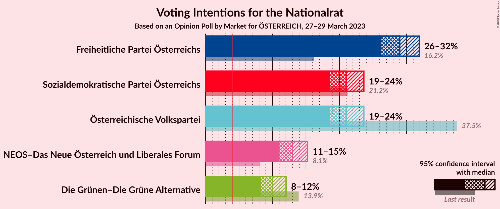

### Confidence Intervals

| Party | Last Result | Poll Result | 80% Confidence Interval | 90% Confidence Interval | 95% Confidence Interval | 99% Confidence Interval |
|:-----:|:-----------:|:-----------:|:-----------------------:|:-----------------------:|:-----------------------:|:-----------------------:|
| Freiheitliche Partei Österreichs | 16.2% | 29.0% | 27.2–30.9% |26.7–31.4% |26.3–31.9% |25.4–32.8% |
| Österreichische Volkspartei | 37.5% | 21.0% | 19.4–22.7% |19.0–23.2% |18.6–23.6% |17.8–24.5% |
| Sozialdemokratische Partei Österreichs | 21.2% | 21.0% | 19.4–22.7% |19.0–23.2% |18.6–23.6% |17.8–24.5% |
| NEOS–Das Neue Österreich und Liberales Forum | 8.1% | 13.0% | 11.7–14.5% |11.4–14.9% |11.1–15.2% |10.5–16.0% |
| Die Grünen–Die Grüne Alternative | 13.9% | 10.0% | 8.9–11.3% |8.6–11.7% |8.3–12.0% |7.8–12.7% |

*Note:* The poll result column reflects the actual value used in the calculations. Published results may vary slightly, and in addition be rounded to fewer digits.

## Seats

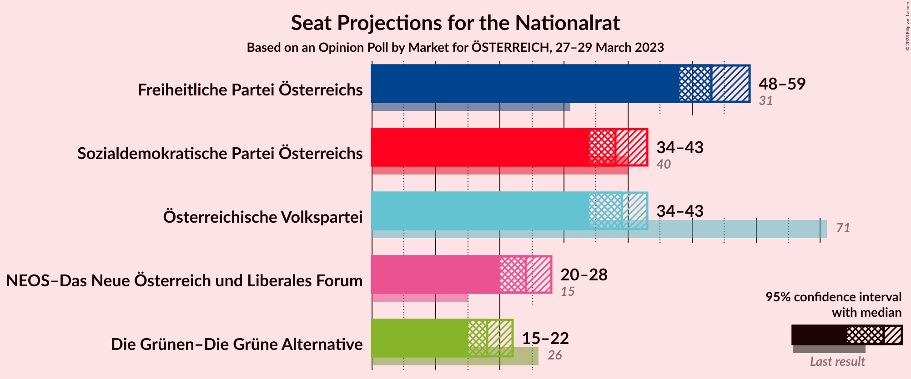

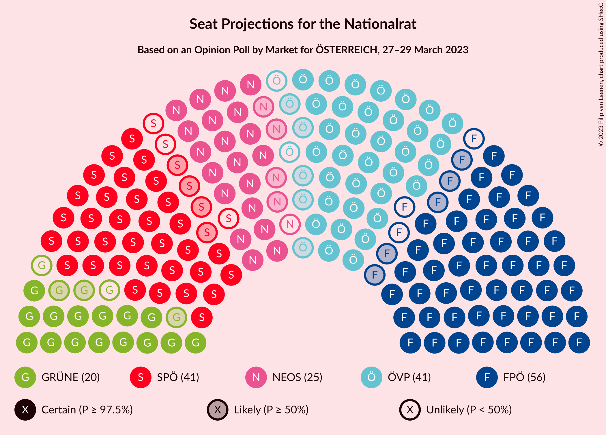

### Confidence Intervals

| Party | Last Result | Median | 80% Confidence Interval | 90% Confidence Interval | 95% Confidence Interval | 99% Confidence Interval |
|:-----:|:-----------:|:------:|:-----------------------:|:-----------------------:|:-----------------------:|:-----------------------:|
| <a href="#freiheitliche-partei-österreichs">Freiheitliche Partei Österreichs</a> | 31 | 53 | 50–57 |49–58 |48–59 |47–60 |
| <a href="#österreichische-volkspartei">Österreichische Volkspartei</a> | 71 | 39 | 35–42 |35–42 |34–43 |33–45 |
| <a href="#sozialdemokratische-partei-österreichs">Sozialdemokratische Partei Österreichs</a> | 40 | 38 | 35–42 |35–43 |34–43 |33–45 |
| <a href="#neos–das-neue-österreich-und-liberales-forum">NEOS–Das Neue Österreich und Liberales Forum</a> | 15 | 24 | 21–26 |21–27 |20–28 |19–29 |
| <a href="#die-grünen–die-grüne-alternative">Die Grünen–Die Grüne Alternative</a> | 26 | 18 | 16–20 |15–21 |15–22 |14–23 |

### Freiheitliche Partei Österreichs

*For a full overview of the results for this party, see the [Freiheitliche Partei Österreichs](party-freiheitlicheparteiösterreichs.html) page.*

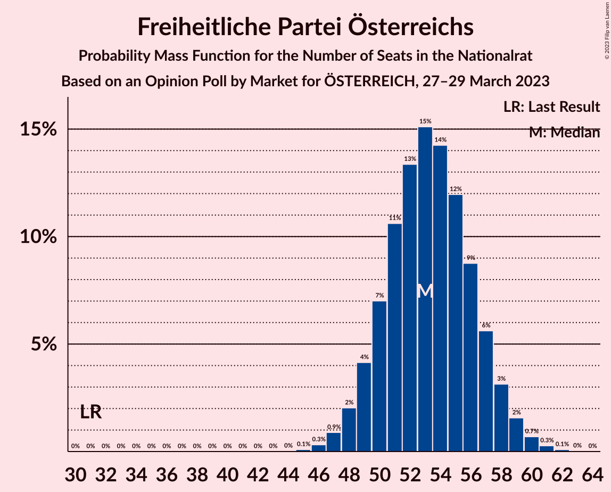

| Number of Seats | Probability | Accumulated | Special Marks |
|:---------------:|:-----------:|:-----------:|:-------------:|
| 31 | 0% | 100% | Last Result |
| 32 | 0% | 100% |  |
| 33 | 0% | 100% |  |
| 34 | 0% | 100% |  |
| 35 | 0% | 100% |  |
| 36 | 0% | 100% |  |
| 37 | 0% | 100% |  |
| 38 | 0% | 100% |  |
| 39 | 0% | 100% |  |
| 40 | 0% | 100% |  |
| 41 | 0% | 100% |  |
| 42 | 0% | 100% |  |
| 43 | 0% | 100% |  |
| 44 | 0% | 100% |  |
| 45 | 0.1% | 100% |  |
| 46 | 0.3% | 99.9% |  |
| 47 | 0.9% | 99.6% |  |
| 48 | 2% | 98.7% |  |
| 49 | 4% | 97% |  |
| 50 | 7% | 92% |  |
| 51 | 11% | 85% |  |
| 52 | 13% | 75% |  |
| 53 | 15% | 62% | Median |
| 54 | 14% | 46% |  |
| 55 | 12% | 32% |  |
| 56 | 9% | 20% |  |
| 57 | 6% | 11% |  |
| 58 | 3% | 6% |  |
| 59 | 2% | 3% |  |
| 60 | 0.7% | 1.1% |  |
| 61 | 0.3% | 0.4% |  |
| 62 | 0.1% | 0.1% |  |
| 63 | 0% | 0% |  |

### Österreichische Volkspartei

*For a full overview of the results for this party, see the [Österreichische Volkspartei](party-österreichischevolkspartei.html) page.*

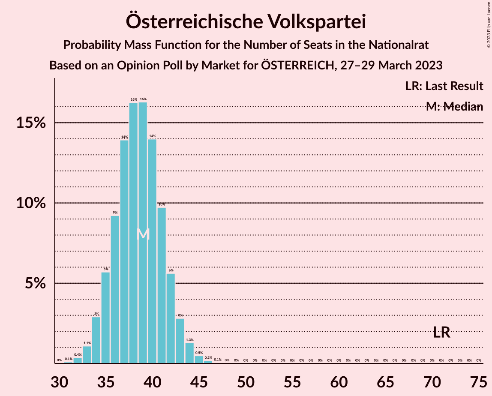

| Number of Seats | Probability | Accumulated | Special Marks |
|:---------------:|:-----------:|:-----------:|:-------------:|
| 31 | 0.1% | 100% |  |
| 32 | 0.4% | 99.9% |  |
| 33 | 1.1% | 99.5% |  |
| 34 | 3% | 98% |  |
| 35 | 6% | 96% |  |
| 36 | 9% | 90% |  |
| 37 | 14% | 81% |  |
| 38 | 16% | 67% |  |
| 39 | 16% | 50% | Median |
| 40 | 14% | 34% |  |
| 41 | 10% | 20% |  |
| 42 | 6% | 10% |  |
| 43 | 3% | 5% |  |
| 44 | 1.3% | 2% |  |
| 45 | 0.5% | 0.7% |  |
| 46 | 0.2% | 0.2% |  |
| 47 | 0.1% | 0.1% |  |
| 48 | 0% | 0% |  |
| 49 | 0% | 0% |  |
| 50 | 0% | 0% |  |
| 51 | 0% | 0% |  |
| 52 | 0% | 0% |  |
| 53 | 0% | 0% |  |
| 54 | 0% | 0% |  |
| 55 | 0% | 0% |  |
| 56 | 0% | 0% |  |
| 57 | 0% | 0% |  |
| 58 | 0% | 0% |  |
| 59 | 0% | 0% |  |
| 60 | 0% | 0% |  |
| 61 | 0% | 0% |  |
| 62 | 0% | 0% |  |
| 63 | 0% | 0% |  |
| 64 | 0% | 0% |  |
| 65 | 0% | 0% |  |
| 66 | 0% | 0% |  |
| 67 | 0% | 0% |  |
| 68 | 0% | 0% |  |
| 69 | 0% | 0% |  |
| 70 | 0% | 0% |  |
| 71 | 0% | 0% | Last Result |

### Sozialdemokratische Partei Österreichs

*For a full overview of the results for this party, see the [Sozialdemokratische Partei Österreichs](party-sozialdemokratischeparteiösterreichs.html) page.*

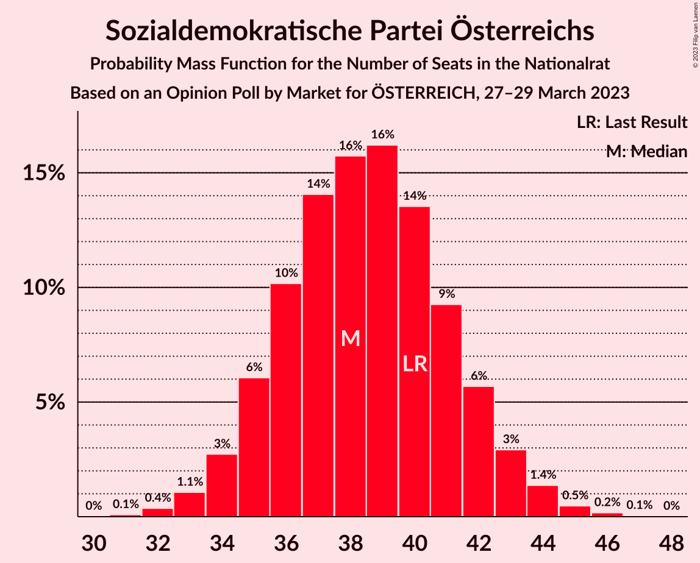

| Number of Seats | Probability | Accumulated | Special Marks |
|:---------------:|:-----------:|:-----------:|:-------------:|
| 31 | 0.1% | 100% |  |
| 32 | 0.4% | 99.9% |  |
| 33 | 1.1% | 99.5% |  |
| 34 | 3% | 98% |  |
| 35 | 6% | 96% |  |
| 36 | 10% | 90% |  |
| 37 | 14% | 79% |  |
| 38 | 16% | 65% | Median |
| 39 | 16% | 50% |  |
| 40 | 14% | 33% | Last Result |
| 41 | 9% | 20% |  |
| 42 | 6% | 11% |  |
| 43 | 3% | 5% |  |
| 44 | 1.4% | 2% |  |
| 45 | 0.5% | 0.7% |  |
| 46 | 0.2% | 0.2% |  |
| 47 | 0.1% | 0.1% |  |
| 48 | 0% | 0% |  |

### NEOS–Das Neue Österreich und Liberales Forum

*For a full overview of the results for this party, see the [NEOS–Das Neue Österreich und Liberales Forum](party-neos–dasneueösterreichundliberalesforum.html) page.*

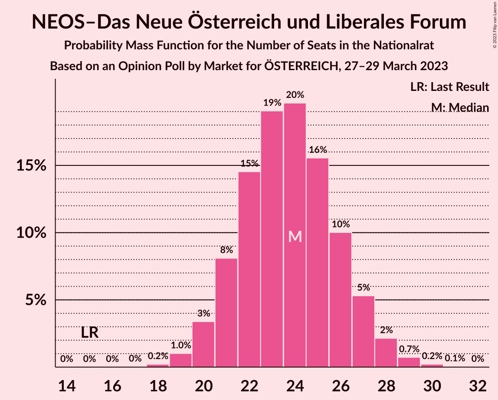

| Number of Seats | Probability | Accumulated | Special Marks |
|:---------------:|:-----------:|:-----------:|:-------------:|
| 15 | 0% | 100% | Last Result |
| 16 | 0% | 100% |  |
| 17 | 0% | 100% |  |
| 18 | 0.2% | 100% |  |
| 19 | 1.0% | 99.8% |  |
| 20 | 3% | 98.7% |  |
| 21 | 8% | 95% |  |
| 22 | 15% | 87% |  |
| 23 | 19% | 73% |  |
| 24 | 20% | 54% | Median |
| 25 | 16% | 34% |  |
| 26 | 10% | 18% |  |
| 27 | 5% | 8% |  |
| 28 | 2% | 3% |  |
| 29 | 0.7% | 1.0% |  |
| 30 | 0.2% | 0.3% |  |
| 31 | 0.1% | 0.1% |  |
| 32 | 0% | 0% |  |

### Die Grünen–Die Grüne Alternative

*For a full overview of the results for this party, see the [Die Grünen–Die Grüne Alternative](party-diegrünen–diegrünealternative.html) page.*

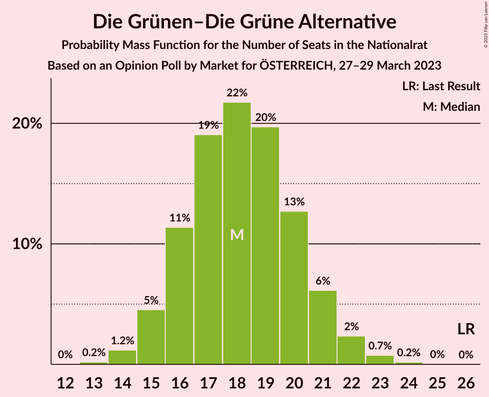

| Number of Seats | Probability | Accumulated | Special Marks |
|:---------------:|:-----------:|:-----------:|:-------------:|
| 13 | 0.2% | 100% |  |
| 14 | 1.2% | 99.8% |  |
| 15 | 5% | 98.6% |  |
| 16 | 11% | 94% |  |
| 17 | 19% | 83% |  |
| 18 | 22% | 64% | Median |
| 19 | 20% | 42% |  |
| 20 | 13% | 22% |  |
| 21 | 6% | 9% |  |
| 22 | 2% | 3% |  |
| 23 | 0.7% | 1.0% |  |
| 24 | 0.2% | 0.2% |  |
| 25 | 0% | 0% |  |
| 26 | 0% | 0% | Last Result |

## Coalitions

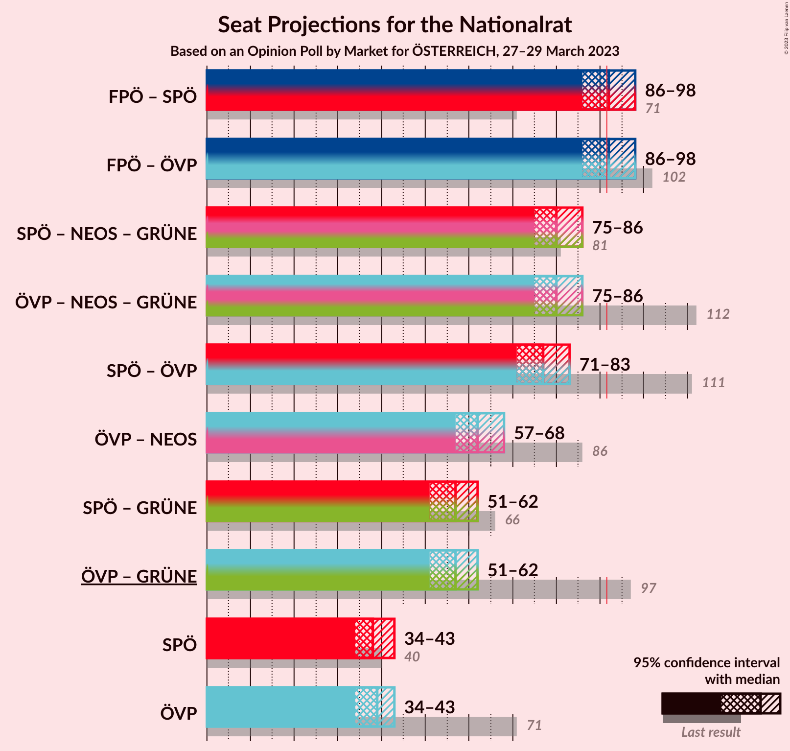

### Confidence Intervals

| Coalition | Last Result | Median | Majority? | 80% Confidence Interval | 90% Confidence Interval | 95% Confidence Interval | 99% Confidence Interval |
|:---------:|:-----------:|:------:|:---------:|:-----------------------:|:-----------------------:|:-----------------------:|:-----------------------:|
| Freiheitliche Partei Österreichs – Sozialdemokratische Partei Österreichs | 71 | 92 | 54% | 88–96 | 87–97 | 86–98 | 84–99 |
| Freiheitliche Partei Österreichs – Österreichische Volkspartei | 102 | 92 | 55% | 88–96 | 87–97 | 86–98 | 84–99 |
| Sozialdemokratische Partei Österreichs – NEOS–Das Neue Österreich und Liberales Forum – Die Grünen–Die Grüne Alternative | 81 | 80 | 0% | 77–84 | 76–85 | 75–86 | 73–88 |
| Österreichische Volkspartei – NEOS–Das Neue Österreich und Liberales Forum – Die Grünen–Die Grüne Alternative | 112 | 80 | 0% | 77–84 | 76–85 | 75–86 | 73–88 |
| Sozialdemokratische Partei Österreichs – Österreichische Volkspartei | 111 | 77 | 0% | 73–81 | 72–82 | 71–83 | 69–85 |
| Österreichische Volkspartei – NEOS–Das Neue Österreich und Liberales Forum | 86 | 62 | 0% | 59–66 | 58–67 | 57–68 | 55–70 |
| Sozialdemokratische Partei Österreichs – Die Grünen–Die Grüne Alternative | 66 | 57 | 0% | 53–60 | 52–61 | 51–62 | 50–64 |
| Österreichische Volkspartei – Die Grünen–Die Grüne Alternative | 97 | 57 | 0% | 53–60 | 52–61 | 51–62 | 50–64 |
| Sozialdemokratische Partei Österreichs | 40 | 38 | 0% | 35–42 | 35–43 | 34–43 | 33–45 |
| Österreichische Volkspartei | 71 | 39 | 0% | 35–42 | 35–42 | 34–43 | 33–45 |

### Freiheitliche Partei Österreichs – Sozialdemokratische Partei Österreichs

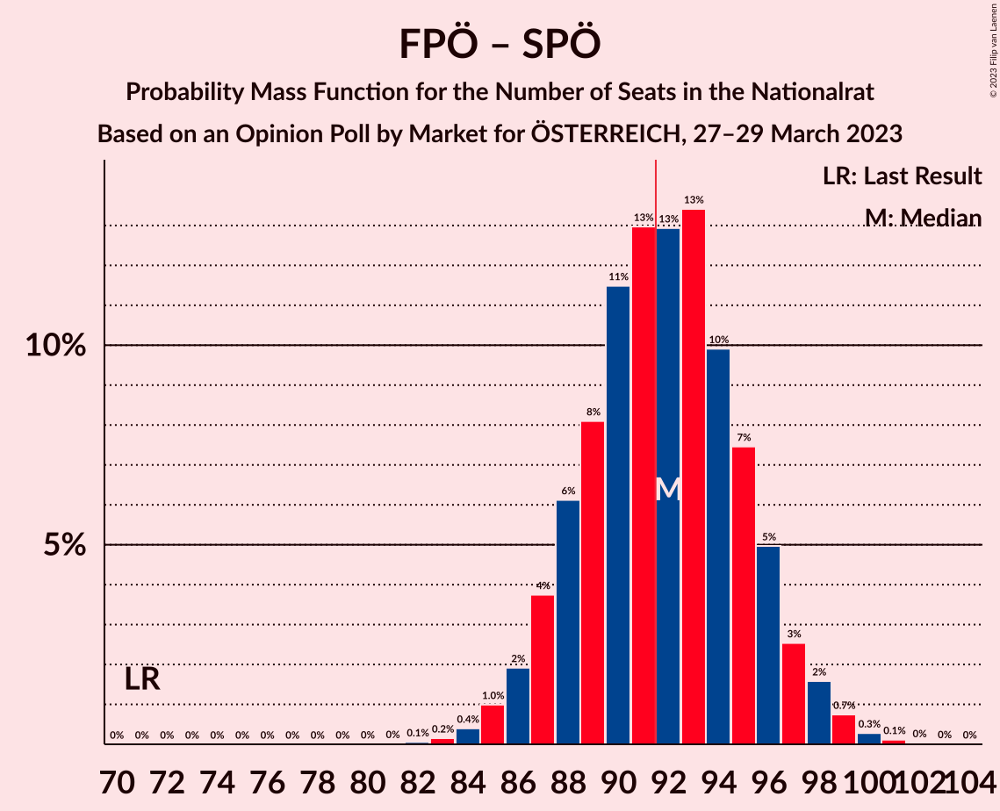

| Number of Seats | Probability | Accumulated | Special Marks |
|:---------------:|:-----------:|:-----------:|:-------------:|
| 71 | 0% | 100% | Last Result |
| 72 | 0% | 100% |  |
| 73 | 0% | 100% |  |
| 74 | 0% | 100% |  |
| 75 | 0% | 100% |  |
| 76 | 0% | 100% |  |
| 77 | 0% | 100% |  |
| 78 | 0% | 100% |  |
| 79 | 0% | 100% |  |
| 80 | 0% | 100% |  |
| 81 | 0% | 100% |  |
| 82 | 0.1% | 100% |  |
| 83 | 0.2% | 99.9% |  |
| 84 | 0.4% | 99.8% |  |
| 85 | 1.0% | 99.4% |  |
| 86 | 2% | 98% |  |
| 87 | 4% | 96% |  |
| 88 | 6% | 93% |  |
| 89 | 8% | 87% |  |
| 90 | 11% | 78% |  |
| 91 | 13% | 67% | Median |
| 92 | 13% | 54% | Majority |
| 93 | 13% | 41% |  |
| 94 | 10% | 28% |  |
| 95 | 7% | 18% |  |
| 96 | 5% | 10% |  |
| 97 | 3% | 5% |  |
| 98 | 2% | 3% |  |
| 99 | 0.7% | 1.2% |  |
| 100 | 0.3% | 0.5% |  |
| 101 | 0.1% | 0.2% |  |
| 102 | 0% | 0.1% |  |
| 103 | 0% | 0% |  |

### Freiheitliche Partei Österreichs – Österreichische Volkspartei

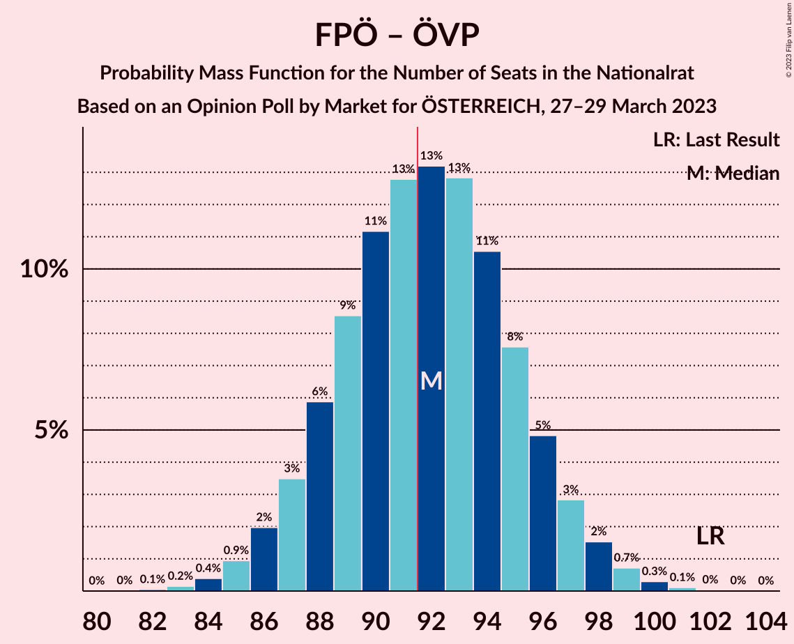

| Number of Seats | Probability | Accumulated | Special Marks |
|:---------------:|:-----------:|:-----------:|:-------------:|
| 82 | 0.1% | 100% |  |
| 83 | 0.2% | 99.9% |  |
| 84 | 0.4% | 99.8% |  |
| 85 | 0.9% | 99.4% |  |
| 86 | 2% | 98% |  |
| 87 | 3% | 96% |  |
| 88 | 6% | 93% |  |
| 89 | 9% | 87% |  |
| 90 | 11% | 79% |  |
| 91 | 13% | 67% |  |
| 92 | 13% | 55% | Median, Majority |
| 93 | 13% | 41% |  |
| 94 | 11% | 29% |  |
| 95 | 8% | 18% |  |
| 96 | 5% | 10% |  |
| 97 | 3% | 6% |  |
| 98 | 2% | 3% |  |
| 99 | 0.7% | 1.2% |  |
| 100 | 0.3% | 0.5% |  |
| 101 | 0.1% | 0.2% |  |
| 102 | 0% | 0.1% | Last Result |
| 103 | 0% | 0% |  |

### Sozialdemokratische Partei Österreichs – NEOS–Das Neue Österreich und Liberales Forum – Die Grünen–Die Grüne Alternative

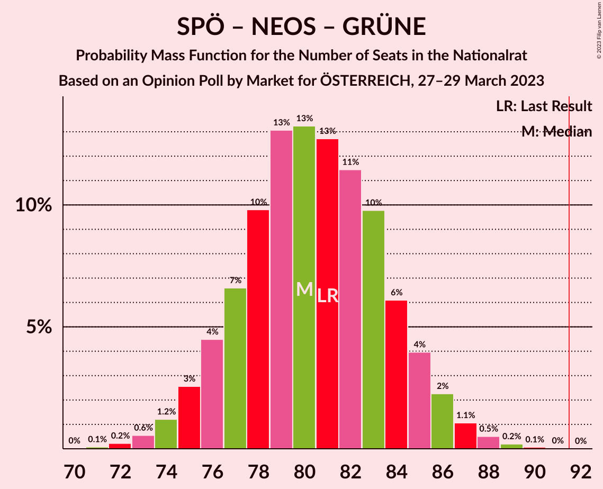

| Number of Seats | Probability | Accumulated | Special Marks |
|:---------------:|:-----------:|:-----------:|:-------------:|
| 71 | 0.1% | 100% |  |
| 72 | 0.2% | 99.9% |  |
| 73 | 0.6% | 99.7% |  |
| 74 | 1.2% | 99.1% |  |
| 75 | 3% | 98% |  |
| 76 | 4% | 95% |  |
| 77 | 7% | 91% |  |
| 78 | 10% | 84% |  |
| 79 | 13% | 74% |  |
| 80 | 13% | 61% | Median |
| 81 | 13% | 48% | Last Result |
| 82 | 11% | 35% |  |
| 83 | 10% | 24% |  |
| 84 | 6% | 14% |  |
| 85 | 4% | 8% |  |
| 86 | 2% | 4% |  |
| 87 | 1.1% | 2% |  |
| 88 | 0.5% | 0.8% |  |
| 89 | 0.2% | 0.3% |  |
| 90 | 0.1% | 0.1% |  |
| 91 | 0% | 0% |  |

### Österreichische Volkspartei – NEOS–Das Neue Österreich und Liberales Forum – Die Grünen–Die Grüne Alternative

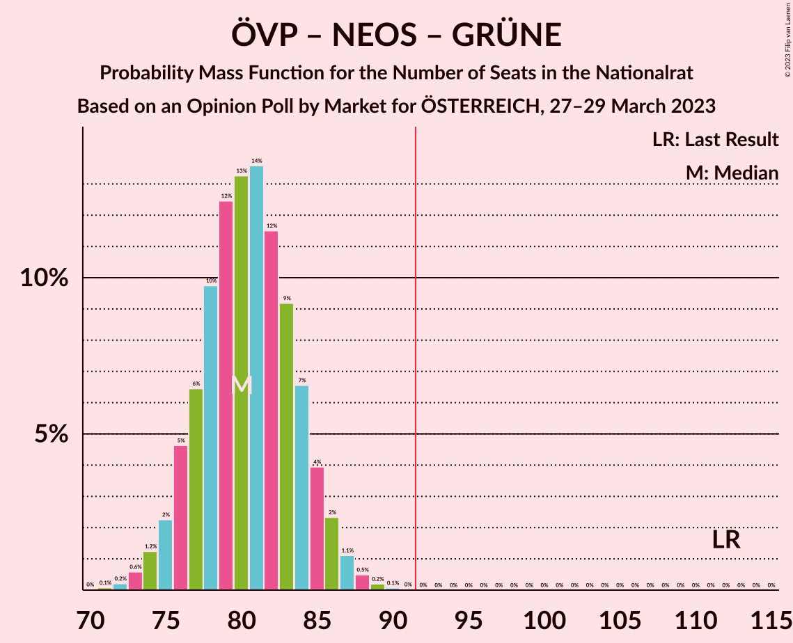

| Number of Seats | Probability | Accumulated | Special Marks |
|:---------------:|:-----------:|:-----------:|:-------------:|
| 71 | 0.1% | 100% |  |
| 72 | 0.2% | 99.9% |  |
| 73 | 0.6% | 99.7% |  |
| 74 | 1.2% | 99.1% |  |
| 75 | 2% | 98% |  |
| 76 | 5% | 96% |  |
| 77 | 6% | 91% |  |
| 78 | 10% | 85% |  |
| 79 | 12% | 75% |  |
| 80 | 13% | 62% |  |
| 81 | 14% | 49% | Median |
| 82 | 12% | 35% |  |
| 83 | 9% | 24% |  |
| 84 | 7% | 15% |  |
| 85 | 4% | 8% |  |
| 86 | 2% | 4% |  |
| 87 | 1.1% | 2% |  |
| 88 | 0.5% | 0.8% |  |
| 89 | 0.2% | 0.3% |  |
| 90 | 0.1% | 0.1% |  |
| 91 | 0% | 0% |  |
| 92 | 0% | 0% | Majority |
| 93 | 0% | 0% |  |
| 94 | 0% | 0% |  |
| 95 | 0% | 0% |  |
| 96 | 0% | 0% |  |
| 97 | 0% | 0% |  |
| 98 | 0% | 0% |  |
| 99 | 0% | 0% |  |
| 100 | 0% | 0% |  |
| 101 | 0% | 0% |  |
| 102 | 0% | 0% |  |
| 103 | 0% | 0% |  |
| 104 | 0% | 0% |  |
| 105 | 0% | 0% |  |
| 106 | 0% | 0% |  |
| 107 | 0% | 0% |  |
| 108 | 0% | 0% |  |
| 109 | 0% | 0% |  |
| 110 | 0% | 0% |  |
| 111 | 0% | 0% |  |
| 112 | 0% | 0% | Last Result |

### Sozialdemokratische Partei Österreichs – Österreichische Volkspartei

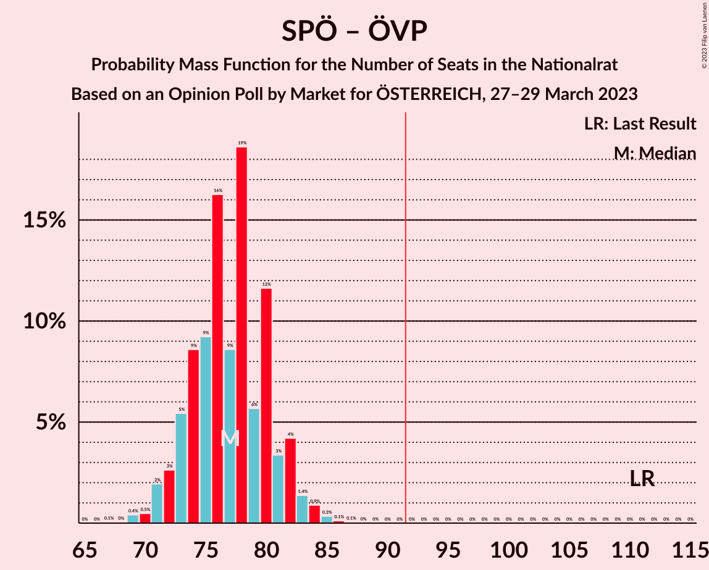

| Number of Seats | Probability | Accumulated | Special Marks |
|:---------------:|:-----------:|:-----------:|:-------------:|
| 67 | 0.1% | 100% |  |
| 68 | 0% | 99.9% |  |
| 69 | 0.4% | 99.9% |  |
| 70 | 0.5% | 99.5% |  |
| 71 | 2% | 99.0% |  |
| 72 | 3% | 97% |  |
| 73 | 5% | 94% |  |
| 74 | 9% | 89% |  |
| 75 | 9% | 80% |  |
| 76 | 16% | 71% |  |
| 77 | 9% | 55% | Median |
| 78 | 19% | 46% |  |
| 79 | 6% | 28% |  |
| 80 | 12% | 22% |  |
| 81 | 3% | 10% |  |
| 82 | 4% | 7% |  |
| 83 | 1.4% | 3% |  |
| 84 | 0.9% | 1.4% |  |
| 85 | 0.3% | 0.5% |  |
| 86 | 0.1% | 0.2% |  |
| 87 | 0.1% | 0.1% |  |
| 88 | 0% | 0% |  |
| 89 | 0% | 0% |  |
| 90 | 0% | 0% |  |
| 91 | 0% | 0% |  |
| 92 | 0% | 0% | Majority |
| 93 | 0% | 0% |  |
| 94 | 0% | 0% |  |
| 95 | 0% | 0% |  |
| 96 | 0% | 0% |  |
| 97 | 0% | 0% |  |
| 98 | 0% | 0% |  |
| 99 | 0% | 0% |  |
| 100 | 0% | 0% |  |
| 101 | 0% | 0% |  |
| 102 | 0% | 0% |  |
| 103 | 0% | 0% |  |
| 104 | 0% | 0% |  |
| 105 | 0% | 0% |  |
| 106 | 0% | 0% |  |
| 107 | 0% | 0% |  |
| 108 | 0% | 0% |  |
| 109 | 0% | 0% |  |
| 110 | 0% | 0% |  |
| 111 | 0% | 0% | Last Result |

### Österreichische Volkspartei – NEOS–Das Neue Österreich und Liberales Forum

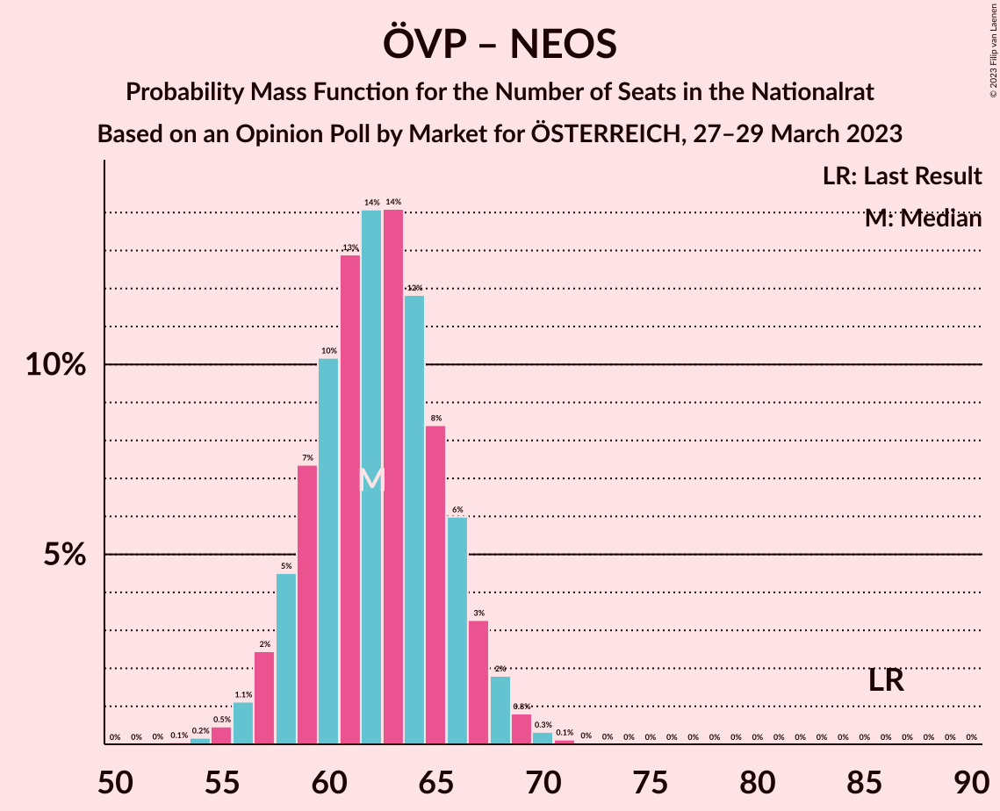

| Number of Seats | Probability | Accumulated | Special Marks |
|:---------------:|:-----------:|:-----------:|:-------------:|
| 53 | 0.1% | 100% |  |
| 54 | 0.2% | 99.9% |  |
| 55 | 0.5% | 99.8% |  |
| 56 | 1.1% | 99.3% |  |
| 57 | 2% | 98% |  |
| 58 | 5% | 96% |  |
| 59 | 7% | 91% |  |
| 60 | 10% | 84% |  |
| 61 | 13% | 74% |  |
| 62 | 14% | 61% |  |
| 63 | 14% | 47% | Median |
| 64 | 12% | 33% |  |
| 65 | 8% | 21% |  |
| 66 | 6% | 12% |  |
| 67 | 3% | 6% |  |
| 68 | 2% | 3% |  |
| 69 | 0.8% | 1.3% |  |
| 70 | 0.3% | 0.5% |  |
| 71 | 0.1% | 0.2% |  |
| 72 | 0% | 0.1% |  |
| 73 | 0% | 0% |  |
| 74 | 0% | 0% |  |
| 75 | 0% | 0% |  |
| 76 | 0% | 0% |  |
| 77 | 0% | 0% |  |
| 78 | 0% | 0% |  |
| 79 | 0% | 0% |  |
| 80 | 0% | 0% |  |
| 81 | 0% | 0% |  |
| 82 | 0% | 0% |  |
| 83 | 0% | 0% |  |
| 84 | 0% | 0% |  |
| 85 | 0% | 0% |  |
| 86 | 0% | 0% | Last Result |

### Sozialdemokratische Partei Österreichs – Die Grünen–Die Grüne Alternative

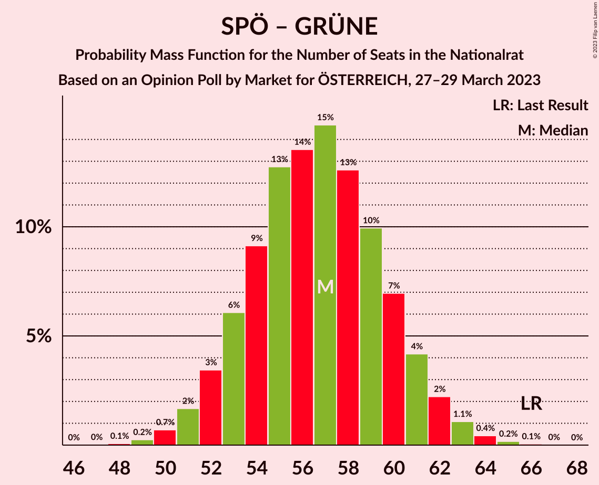

| Number of Seats | Probability | Accumulated | Special Marks |
|:---------------:|:-----------:|:-----------:|:-------------:|
| 48 | 0.1% | 100% |  |
| 49 | 0.2% | 99.9% |  |
| 50 | 0.7% | 99.7% |  |
| 51 | 2% | 99.0% |  |
| 52 | 3% | 97% |  |
| 53 | 6% | 94% |  |
| 54 | 9% | 88% |  |
| 55 | 13% | 79% |  |
| 56 | 14% | 66% | Median |
| 57 | 15% | 52% |  |
| 58 | 13% | 38% |  |
| 59 | 10% | 25% |  |
| 60 | 7% | 15% |  |
| 61 | 4% | 8% |  |
| 62 | 2% | 4% |  |
| 63 | 1.1% | 2% |  |
| 64 | 0.4% | 0.7% |  |
| 65 | 0.2% | 0.3% |  |
| 66 | 0.1% | 0.1% | Last Result |
| 67 | 0% | 0% |  |

### Österreichische Volkspartei – Die Grünen–Die Grüne Alternative

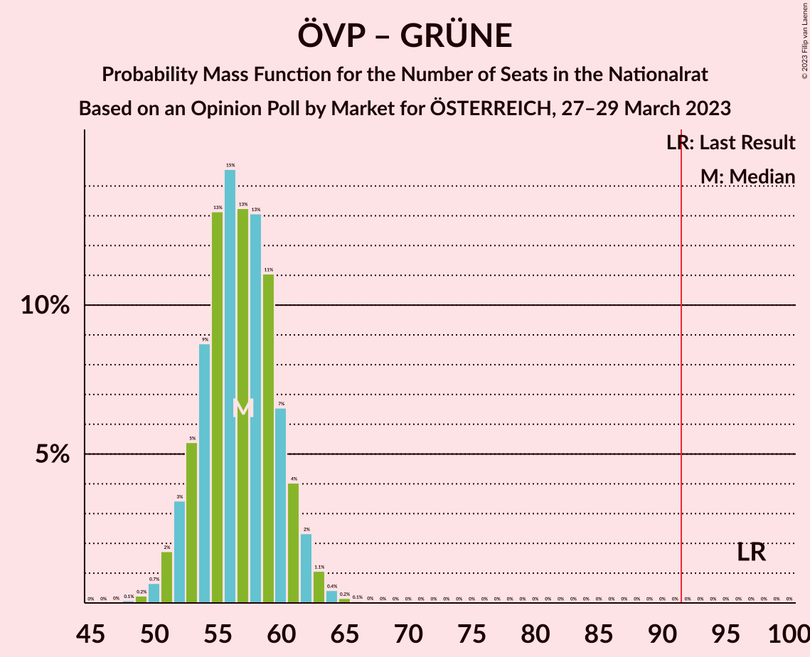

| Number of Seats | Probability | Accumulated | Special Marks |
|:---------------:|:-----------:|:-----------:|:-------------:|
| 48 | 0.1% | 100% |  |
| 49 | 0.2% | 99.9% |  |
| 50 | 0.7% | 99.7% |  |
| 51 | 2% | 99.0% |  |
| 52 | 3% | 97% |  |
| 53 | 5% | 94% |  |
| 54 | 9% | 88% |  |
| 55 | 13% | 80% |  |
| 56 | 15% | 67% |  |
| 57 | 13% | 52% | Median |
| 58 | 13% | 39% |  |
| 59 | 11% | 26% |  |
| 60 | 7% | 15% |  |
| 61 | 4% | 8% |  |
| 62 | 2% | 4% |  |
| 63 | 1.1% | 2% |  |
| 64 | 0.4% | 0.7% |  |
| 65 | 0.2% | 0.2% |  |
| 66 | 0.1% | 0.1% |  |
| 67 | 0% | 0% |  |
| 68 | 0% | 0% |  |
| 69 | 0% | 0% |  |
| 70 | 0% | 0% |  |
| 71 | 0% | 0% |  |
| 72 | 0% | 0% |  |
| 73 | 0% | 0% |  |
| 74 | 0% | 0% |  |
| 75 | 0% | 0% |  |
| 76 | 0% | 0% |  |
| 77 | 0% | 0% |  |
| 78 | 0% | 0% |  |
| 79 | 0% | 0% |  |
| 80 | 0% | 0% |  |
| 81 | 0% | 0% |  |
| 82 | 0% | 0% |  |
| 83 | 0% | 0% |  |
| 84 | 0% | 0% |  |
| 85 | 0% | 0% |  |
| 86 | 0% | 0% |  |
| 87 | 0% | 0% |  |
| 88 | 0% | 0% |  |
| 89 | 0% | 0% |  |
| 90 | 0% | 0% |  |
| 91 | 0% | 0% |  |
| 92 | 0% | 0% | Majority |
| 93 | 0% | 0% |  |
| 94 | 0% | 0% |  |
| 95 | 0% | 0% |  |
| 96 | 0% | 0% |  |
| 97 | 0% | 0% | Last Result |

### Sozialdemokratische Partei Österreichs

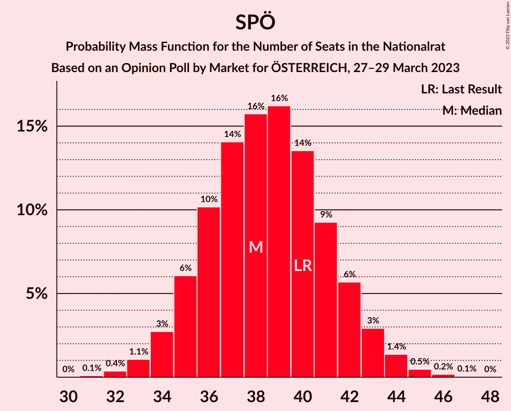

| Number of Seats | Probability | Accumulated | Special Marks |
|:---------------:|:-----------:|:-----------:|:-------------:|
| 31 | 0.1% | 100% |  |
| 32 | 0.4% | 99.9% |  |
| 33 | 1.1% | 99.5% |  |
| 34 | 3% | 98% |  |
| 35 | 6% | 96% |  |
| 36 | 10% | 90% |  |
| 37 | 14% | 79% |  |
| 38 | 16% | 65% | Median |
| 39 | 16% | 50% |  |
| 40 | 14% | 33% | Last Result |
| 41 | 9% | 20% |  |
| 42 | 6% | 11% |  |
| 43 | 3% | 5% |  |
| 44 | 1.4% | 2% |  |
| 45 | 0.5% | 0.7% |  |
| 46 | 0.2% | 0.2% |  |
| 47 | 0.1% | 0.1% |  |
| 48 | 0% | 0% |  |

### Österreichische Volkspartei

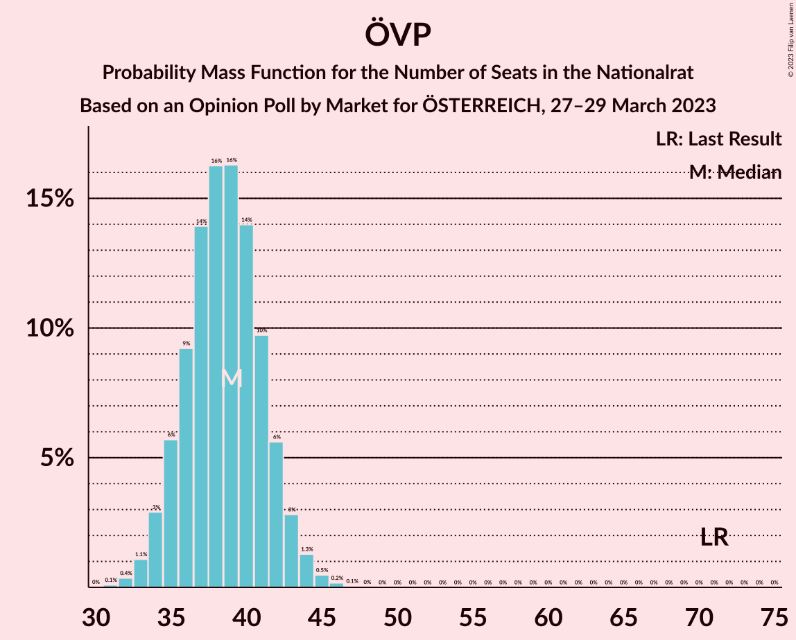

| Number of Seats | Probability | Accumulated | Special Marks |
|:---------------:|:-----------:|:-----------:|:-------------:|
| 31 | 0.1% | 100% |  |
| 32 | 0.4% | 99.9% |  |
| 33 | 1.1% | 99.5% |  |
| 34 | 3% | 98% |  |
| 35 | 6% | 96% |  |
| 36 | 9% | 90% |  |
| 37 | 14% | 81% |  |
| 38 | 16% | 67% |  |
| 39 | 16% | 50% | Median |
| 40 | 14% | 34% |  |
| 41 | 10% | 20% |  |
| 42 | 6% | 10% |  |
| 43 | 3% | 5% |  |
| 44 | 1.3% | 2% |  |
| 45 | 0.5% | 0.7% |  |
| 46 | 0.2% | 0.2% |  |
| 47 | 0.1% | 0.1% |  |
| 48 | 0% | 0% |  |
| 49 | 0% | 0% |  |
| 50 | 0% | 0% |  |
| 51 | 0% | 0% |  |
| 52 | 0% | 0% |  |
| 53 | 0% | 0% |  |
| 54 | 0% | 0% |  |
| 55 | 0% | 0% |  |
| 56 | 0% | 0% |  |
| 57 | 0% | 0% |  |
| 58 | 0% | 0% |  |
| 59 | 0% | 0% |  |
| 60 | 0% | 0% |  |
| 61 | 0% | 0% |  |
| 62 | 0% | 0% |  |
| 63 | 0% | 0% |  |
| 64 | 0% | 0% |  |
| 65 | 0% | 0% |  |
| 66 | 0% | 0% |  |
| 67 | 0% | 0% |  |
| 68 | 0% | 0% |  |
| 69 | 0% | 0% |  |
| 70 | 0% | 0% |  |
| 71 | 0% | 0% | Last Result |

## Technical Information

### Opinion Poll

+ **Polling firm:** Market
+ **Commissioner(s):** ÖSTERREICH
+ **Fieldwork period:** 27–29 March 2023

### Calculations

+ **Sample size:** 1000
+ **Simulations done:** 1,048,576
+ **Error estimate:** 0.40%

