# Opinion Poll by Market, 3–12 April 2023

<a href="#voting-intentions">Voting Intentions</a> | <a href="#seats">Seats</a> | <a href="#coalitions">Coalitions</a> | <a href="#technical-information">Technical Information</a>

## Voting Intentions

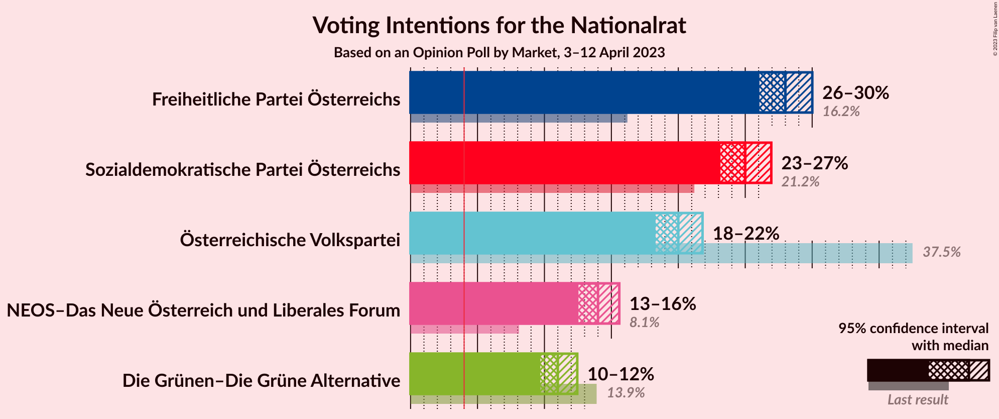

### Confidence Intervals

| Party | Last Result | Poll Result | 80% Confidence Interval | 90% Confidence Interval | 95% Confidence Interval | 99% Confidence Interval |
|:-----:|:-----------:|:-----------:|:-----------------------:|:-----------------------:|:-----------------------:|:-----------------------:|
| Freiheitliche Partei Österreichs | 16.2% | 28.0% | 26.7–29.3% |26.4–29.7% |26.1–30.0% |25.5–30.7% |
| Sozialdemokratische Partei Österreichs | 21.2% | 25.0% | 23.8–26.3% |23.4–26.6% |23.2–26.9% |22.6–27.6% |
| Österreichische Volkspartei | 37.5% | 20.0% | 18.9–21.2% |18.6–21.5% |18.3–21.8% |17.8–22.4% |
| NEOS–Das Neue Österreich und Liberales Forum | 8.1% | 14.0% | 13.0–15.0% |12.8–15.3% |12.5–15.6% |12.1–16.1% |
| Die Grünen–Die Grüne Alternative | 13.9% | 11.0% | 10.1–11.9% |9.9–12.2% |9.7–12.5% |9.3–12.9% |

*Note:* The poll result column reflects the actual value used in the calculations. Published results may vary slightly, and in addition be rounded to fewer digits.

## Seats

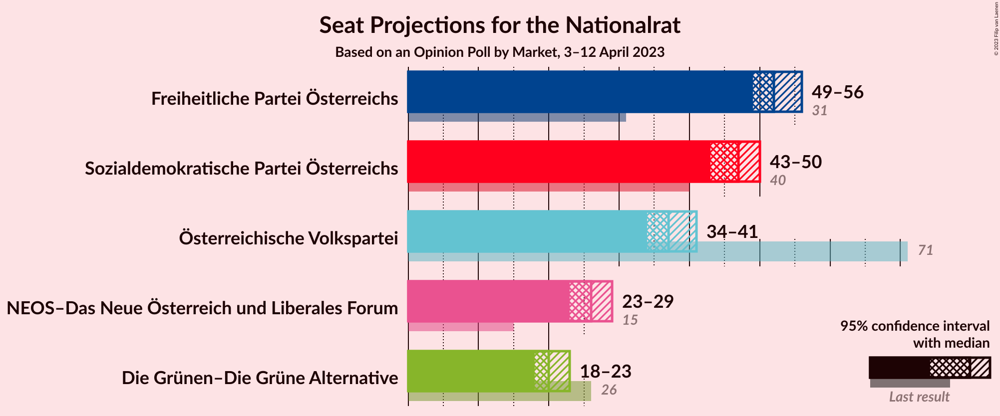

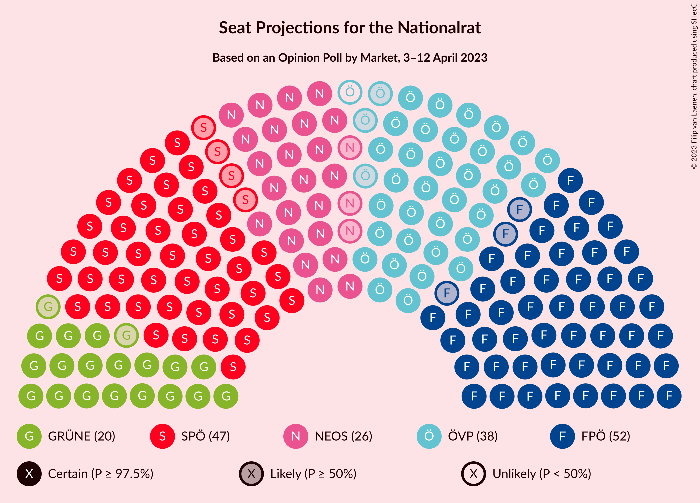

### Confidence Intervals

| Party | Last Result | Median | 80% Confidence Interval | 90% Confidence Interval | 95% Confidence Interval | 99% Confidence Interval |
|:-----:|:-----------:|:------:|:-----------------------:|:-----------------------:|:-----------------------:|:-----------------------:|
| <a href="#freiheitliche-partei-österreichs">Freiheitliche Partei Österreichs</a> | 31 | 52 | 50–55 |49–56 |49–56 |48–57 |
| <a href="#sozialdemokratische-partei-österreichs">Sozialdemokratische Partei Österreichs</a> | 40 | 47 | 44–49 |44–50 |43–50 |42–52 |
| <a href="#österreichische-volkspartei">Österreichische Volkspartei</a> | 71 | 37 | 35–40 |35–40 |34–41 |33–42 |
| <a href="#neos–das-neue-österreich-und-liberales-forum">NEOS–Das Neue Österreich und Liberales Forum</a> | 15 | 26 | 24–28 |24–28 |23–29 |22–30 |
| <a href="#die-grünen–die-grüne-alternative">Die Grünen–Die Grüne Alternative</a> | 26 | 20 | 19–22 |18–23 |18–23 |17–24 |

### Freiheitliche Partei Österreichs

*For a full overview of the results for this party, see the [Freiheitliche Partei Österreichs](party-freiheitlicheparteiösterreichs.html) page.*

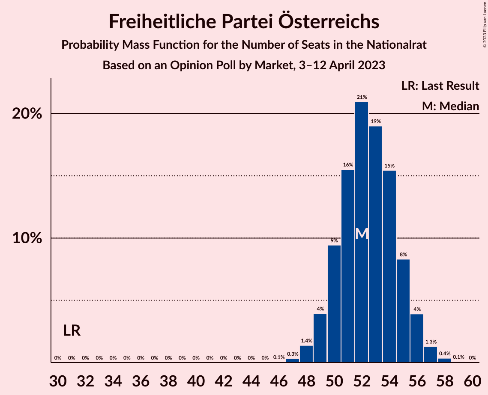

| Number of Seats | Probability | Accumulated | Special Marks |
|:---------------:|:-----------:|:-----------:|:-------------:|
| 31 | 0% | 100% | Last Result |
| 32 | 0% | 100% |  |
| 33 | 0% | 100% |  |
| 34 | 0% | 100% |  |
| 35 | 0% | 100% |  |
| 36 | 0% | 100% |  |
| 37 | 0% | 100% |  |
| 38 | 0% | 100% |  |
| 39 | 0% | 100% |  |
| 40 | 0% | 100% |  |
| 41 | 0% | 100% |  |
| 42 | 0% | 100% |  |
| 43 | 0% | 100% |  |
| 44 | 0% | 100% |  |
| 45 | 0% | 100% |  |
| 46 | 0.1% | 100% |  |
| 47 | 0.3% | 99.9% |  |
| 48 | 1.4% | 99.6% |  |
| 49 | 4% | 98% |  |
| 50 | 9% | 94% |  |
| 51 | 16% | 85% |  |
| 52 | 21% | 69% | Median |
| 53 | 19% | 48% |  |
| 54 | 15% | 29% |  |
| 55 | 8% | 14% |  |
| 56 | 4% | 6% |  |
| 57 | 1.3% | 2% |  |
| 58 | 0.4% | 0.4% |  |
| 59 | 0.1% | 0.1% |  |
| 60 | 0% | 0% |  |

### Sozialdemokratische Partei Österreichs

*For a full overview of the results for this party, see the [Sozialdemokratische Partei Österreichs](party-sozialdemokratischeparteiösterreichs.html) page.*

| Number of Seats | Probability | Accumulated | Special Marks |
|:---------------:|:-----------:|:-----------:|:-------------:|
| 40 | 0% | 100% | Last Result |
| 41 | 0.1% | 100% |  |
| 42 | 0.7% | 99.9% |  |
| 43 | 3% | 99.2% |  |
| 44 | 7% | 97% |  |
| 45 | 14% | 90% |  |
| 46 | 20% | 76% |  |
| 47 | 21% | 56% | Median |
| 48 | 17% | 35% |  |
| 49 | 10% | 18% |  |
| 50 | 5% | 7% |  |
| 51 | 2% | 2% |  |
| 52 | 0.5% | 0.6% |  |
| 53 | 0.1% | 0.1% |  |
| 54 | 0% | 0% |  |

### Österreichische Volkspartei

*For a full overview of the results for this party, see the [Österreichische Volkspartei](party-österreichischevolkspartei.html) page.*

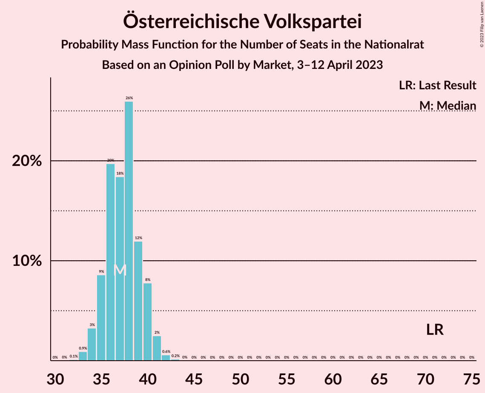

| Number of Seats | Probability | Accumulated | Special Marks |
|:---------------:|:-----------:|:-----------:|:-------------:|
| 32 | 0.1% | 100% |  |
| 33 | 0.9% | 99.9% |  |
| 34 | 3% | 99.0% |  |
| 35 | 9% | 96% |  |
| 36 | 20% | 87% |  |
| 37 | 18% | 67% | Median |
| 38 | 26% | 49% |  |
| 39 | 12% | 23% |  |
| 40 | 8% | 11% |  |
| 41 | 2% | 3% |  |
| 42 | 0.6% | 0.8% |  |
| 43 | 0.2% | 0.2% |  |
| 44 | 0% | 0% |  |
| 45 | 0% | 0% |  |
| 46 | 0% | 0% |  |
| 47 | 0% | 0% |  |
| 48 | 0% | 0% |  |
| 49 | 0% | 0% |  |
| 50 | 0% | 0% |  |
| 51 | 0% | 0% |  |
| 52 | 0% | 0% |  |
| 53 | 0% | 0% |  |
| 54 | 0% | 0% |  |
| 55 | 0% | 0% |  |
| 56 | 0% | 0% |  |
| 57 | 0% | 0% |  |
| 58 | 0% | 0% |  |
| 59 | 0% | 0% |  |
| 60 | 0% | 0% |  |
| 61 | 0% | 0% |  |
| 62 | 0% | 0% |  |
| 63 | 0% | 0% |  |
| 64 | 0% | 0% |  |
| 65 | 0% | 0% |  |
| 66 | 0% | 0% |  |
| 67 | 0% | 0% |  |
| 68 | 0% | 0% |  |
| 69 | 0% | 0% |  |
| 70 | 0% | 0% |  |
| 71 | 0% | 0% | Last Result |

### NEOS–Das Neue Österreich und Liberales Forum

*For a full overview of the results for this party, see the [NEOS–Das Neue Österreich und Liberales Forum](party-neos–dasneueösterreichundliberalesforum.html) page.*

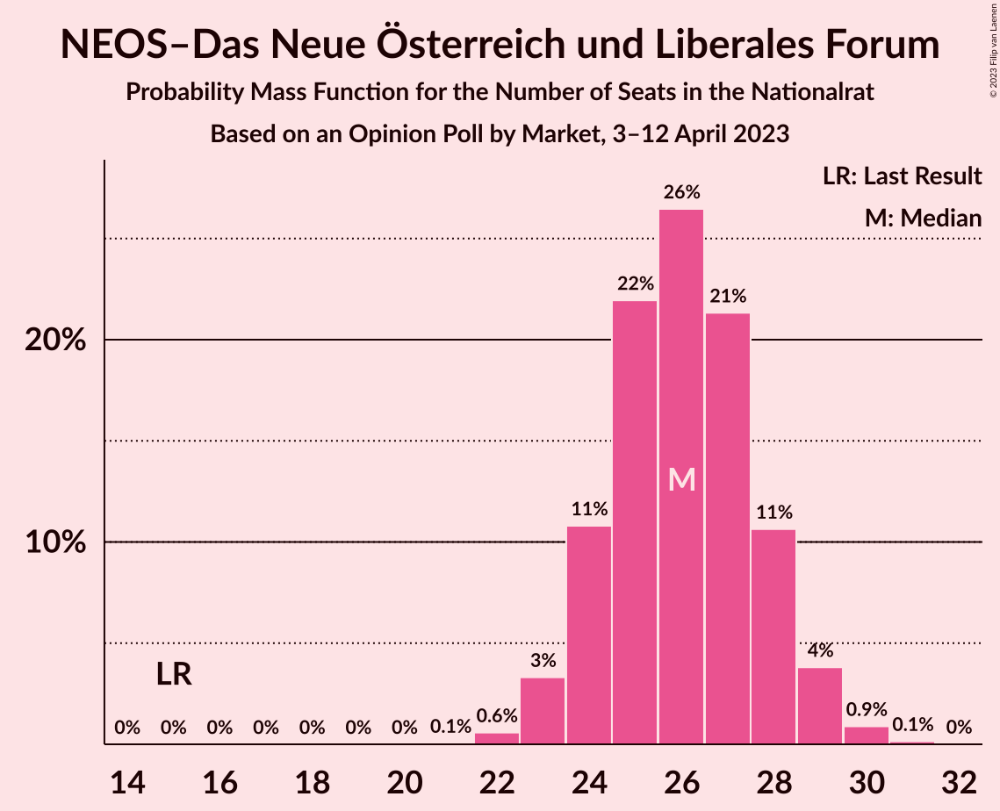

| Number of Seats | Probability | Accumulated | Special Marks |
|:---------------:|:-----------:|:-----------:|:-------------:|
| 15 | 0% | 100% | Last Result |
| 16 | 0% | 100% |  |
| 17 | 0% | 100% |  |
| 18 | 0% | 100% |  |
| 19 | 0% | 100% |  |
| 20 | 0% | 100% |  |
| 21 | 0.1% | 100% |  |
| 22 | 0.6% | 99.9% |  |
| 23 | 3% | 99.4% |  |
| 24 | 11% | 96% |  |
| 25 | 22% | 85% |  |
| 26 | 26% | 63% | Median |
| 27 | 21% | 37% |  |
| 28 | 11% | 16% |  |
| 29 | 4% | 5% |  |
| 30 | 0.9% | 1.1% |  |
| 31 | 0.1% | 0.2% |  |
| 32 | 0% | 0% |  |

### Die Grünen–Die Grüne Alternative

*For a full overview of the results for this party, see the [Die Grünen–Die Grüne Alternative](party-diegrünen–diegrünealternative.html) page.*

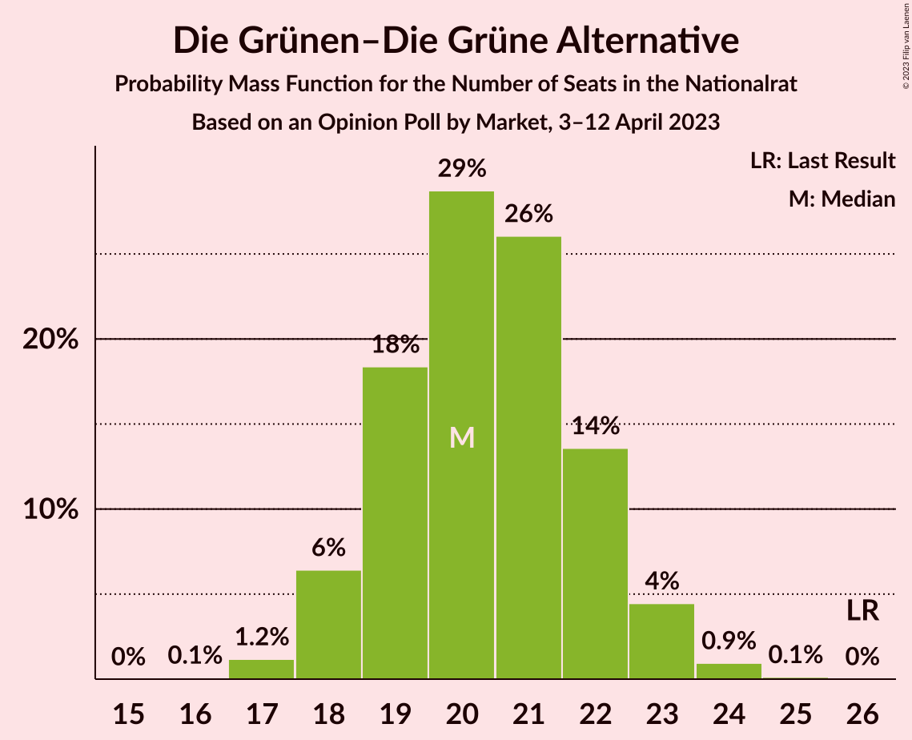

| Number of Seats | Probability | Accumulated | Special Marks |
|:---------------:|:-----------:|:-----------:|:-------------:|
| 16 | 0.1% | 100% |  |
| 17 | 1.2% | 99.9% |  |
| 18 | 6% | 98.7% |  |
| 19 | 18% | 92% |  |
| 20 | 29% | 74% | Median |
| 21 | 26% | 45% |  |
| 22 | 14% | 19% |  |
| 23 | 4% | 6% |  |
| 24 | 0.9% | 1.1% |  |
| 25 | 0.1% | 0.1% |  |
| 26 | 0% | 0% | Last Result |

## Coalitions

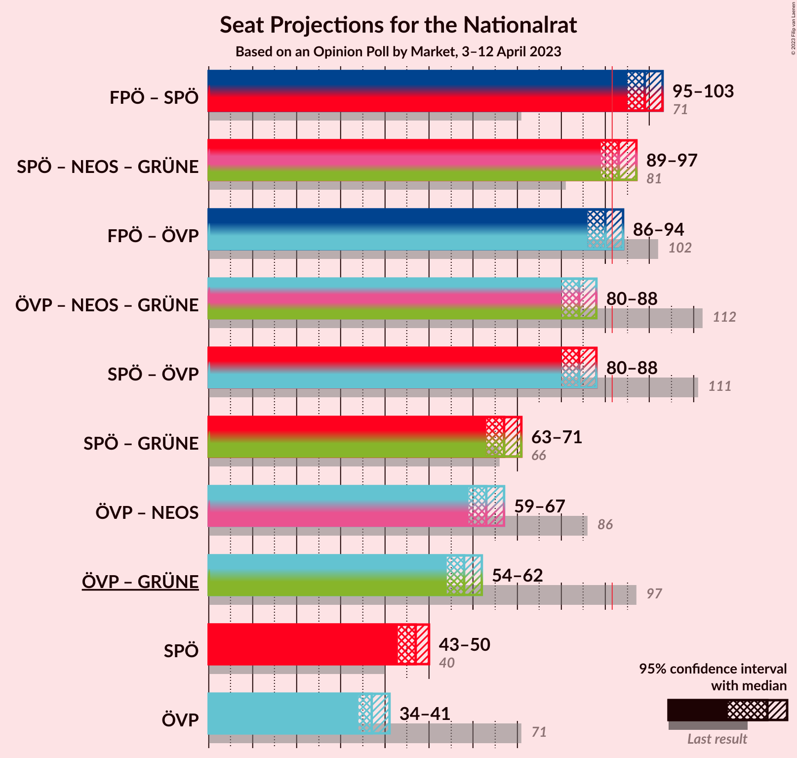

### Confidence Intervals

| Coalition | Last Result | Median | Majority? | 80% Confidence Interval | 90% Confidence Interval | 95% Confidence Interval | 99% Confidence Interval |
|:---------:|:-----------:|:------:|:---------:|:-----------------------:|:-----------------------:|:-----------------------:|:-----------------------:|
| Freiheitliche Partei Österreichs – Sozialdemokratische Partei Österreichs | 71 | 99 | 100% | 97–102 | 96–103 | 95–103 | 94–105 |
| Sozialdemokratische Partei Österreichs – NEOS–Das Neue Österreich und Liberales Forum – Die Grünen–Die Grüne Alternative | 81 | 93 | 79% | 90–96 | 90–97 | 89–97 | 88–99 |
| Freiheitliche Partei Österreichs – Österreichische Volkspartei | 102 | 90 | 21% | 87–93 | 86–93 | 86–94 | 84–95 |
| Österreichische Volkspartei – NEOS–Das Neue Österreich und Liberales Forum – Die Grünen–Die Grüne Alternative | 112 | 84 | 0% | 81–86 | 80–87 | 80–88 | 78–89 |
| Sozialdemokratische Partei Österreichs – Österreichische Volkspartei | 111 | 84 | 0% | 81–87 | 81–88 | 80–88 | 79–90 |
| Sozialdemokratische Partei Österreichs – Die Grünen–Die Grüne Alternative | 66 | 67 | 0% | 65–70 | 64–71 | 63–71 | 62–72 |
| Österreichische Volkspartei – NEOS–Das Neue Österreich und Liberales Forum | 86 | 63 | 0% | 61–66 | 60–67 | 59–67 | 58–69 |
| Österreichische Volkspartei – Die Grünen–Die Grüne Alternative | 97 | 58 | 0% | 55–60 | 55–61 | 54–62 | 53–63 |
| Sozialdemokratische Partei Österreichs | 40 | 47 | 0% | 44–49 | 44–50 | 43–50 | 42–52 |
| Österreichische Volkspartei | 71 | 37 | 0% | 35–40 | 35–40 | 34–41 | 33–42 |

### Freiheitliche Partei Österreichs – Sozialdemokratische Partei Österreichs

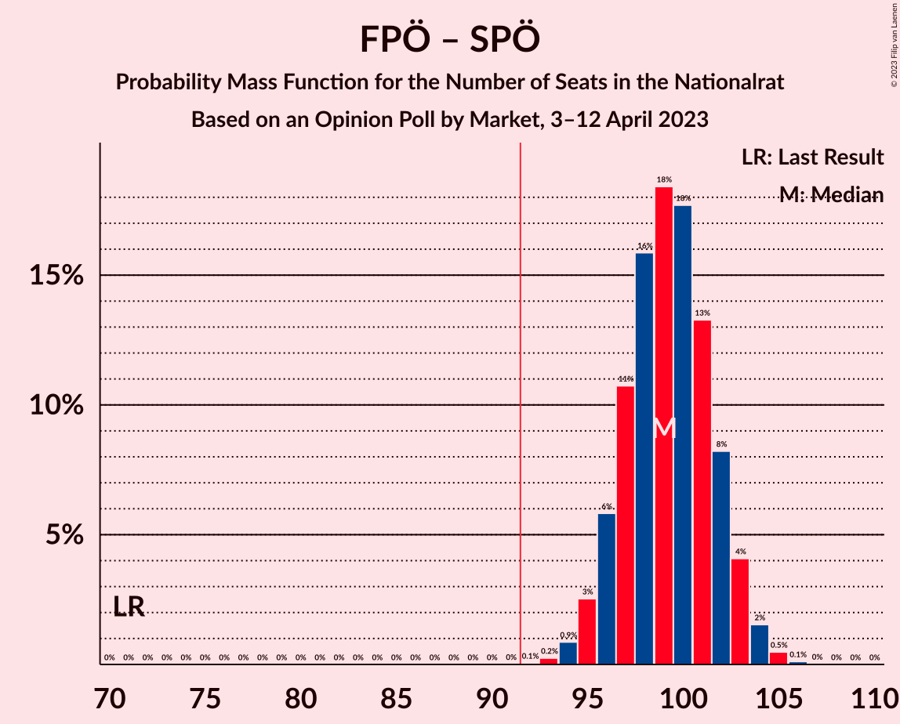

| Number of Seats | Probability | Accumulated | Special Marks |
|:---------------:|:-----------:|:-----------:|:-------------:|
| 71 | 0% | 100% | Last Result |
| 72 | 0% | 100% |  |
| 73 | 0% | 100% |  |
| 74 | 0% | 100% |  |
| 75 | 0% | 100% |  |
| 76 | 0% | 100% |  |
| 77 | 0% | 100% |  |
| 78 | 0% | 100% |  |
| 79 | 0% | 100% |  |
| 80 | 0% | 100% |  |
| 81 | 0% | 100% |  |
| 82 | 0% | 100% |  |
| 83 | 0% | 100% |  |
| 84 | 0% | 100% |  |
| 85 | 0% | 100% |  |
| 86 | 0% | 100% |  |
| 87 | 0% | 100% |  |
| 88 | 0% | 100% |  |
| 89 | 0% | 100% |  |
| 90 | 0% | 100% |  |
| 91 | 0% | 100% |  |
| 92 | 0.1% | 100% | Majority |
| 93 | 0.2% | 99.9% |  |
| 94 | 0.9% | 99.7% |  |
| 95 | 3% | 98.8% |  |
| 96 | 6% | 96% |  |
| 97 | 11% | 90% |  |
| 98 | 16% | 80% |  |
| 99 | 18% | 64% | Median |
| 100 | 18% | 45% |  |
| 101 | 13% | 28% |  |
| 102 | 8% | 14% |  |
| 103 | 4% | 6% |  |
| 104 | 2% | 2% |  |
| 105 | 0.5% | 0.6% |  |
| 106 | 0.1% | 0.1% |  |
| 107 | 0% | 0% |  |

### Sozialdemokratische Partei Österreichs – NEOS–Das Neue Österreich und Liberales Forum – Die Grünen–Die Grüne Alternative

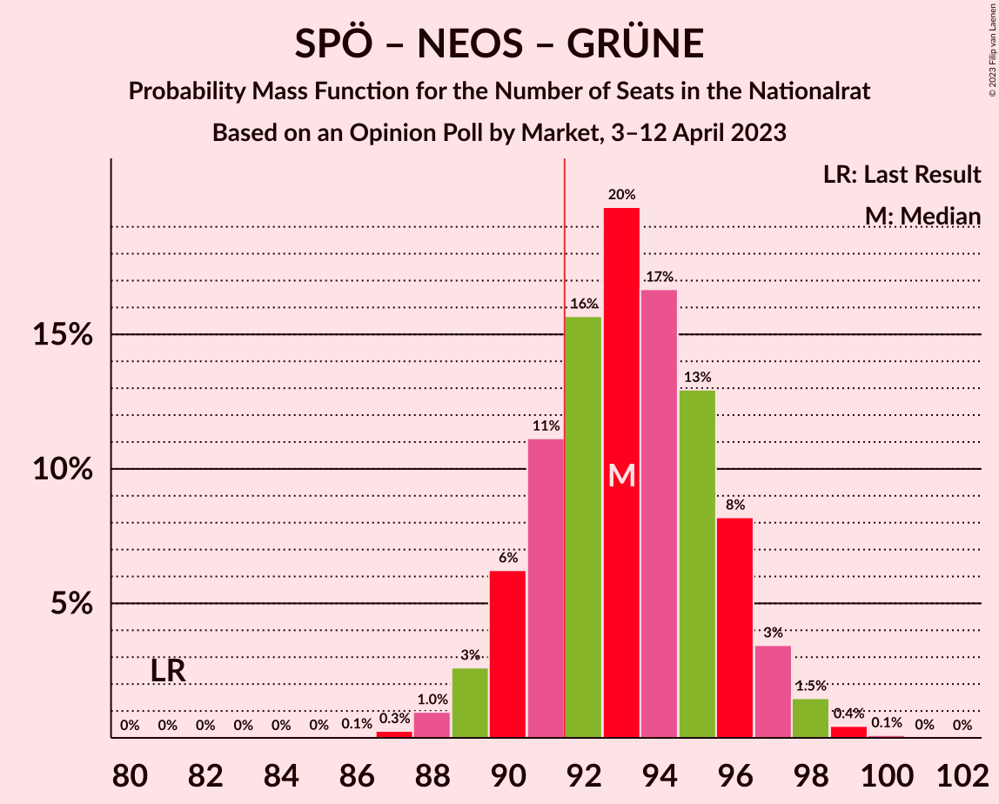

| Number of Seats | Probability | Accumulated | Special Marks |
|:---------------:|:-----------:|:-----------:|:-------------:|
| 81 | 0% | 100% | Last Result |
| 82 | 0% | 100% |  |
| 83 | 0% | 100% |  |
| 84 | 0% | 100% |  |
| 85 | 0% | 100% |  |
| 86 | 0.1% | 100% |  |
| 87 | 0.3% | 99.9% |  |
| 88 | 1.0% | 99.7% |  |
| 89 | 3% | 98.7% |  |
| 90 | 6% | 96% |  |
| 91 | 11% | 90% |  |
| 92 | 16% | 79% | Majority |
| 93 | 20% | 63% | Median |
| 94 | 17% | 43% |  |
| 95 | 13% | 27% |  |
| 96 | 8% | 14% |  |
| 97 | 3% | 5% |  |
| 98 | 1.5% | 2% |  |
| 99 | 0.4% | 0.6% |  |
| 100 | 0.1% | 0.1% |  |
| 101 | 0% | 0% |  |

### Freiheitliche Partei Österreichs – Österreichische Volkspartei

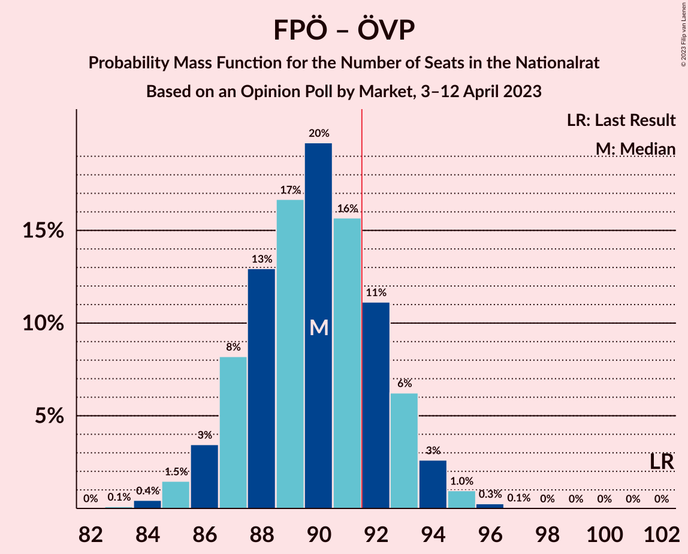

| Number of Seats | Probability | Accumulated | Special Marks |
|:---------------:|:-----------:|:-----------:|:-------------:|
| 83 | 0.1% | 100% |  |
| 84 | 0.4% | 99.9% |  |
| 85 | 1.5% | 99.4% |  |
| 86 | 3% | 98% |  |
| 87 | 8% | 95% |  |
| 88 | 13% | 86% |  |
| 89 | 17% | 73% | Median |
| 90 | 20% | 57% |  |
| 91 | 16% | 37% |  |
| 92 | 11% | 21% | Majority |
| 93 | 6% | 10% |  |
| 94 | 3% | 4% |  |
| 95 | 1.0% | 1.3% |  |
| 96 | 0.3% | 0.3% |  |
| 97 | 0.1% | 0.1% |  |
| 98 | 0% | 0% |  |
| 99 | 0% | 0% |  |
| 100 | 0% | 0% |  |
| 101 | 0% | 0% |  |
| 102 | 0% | 0% | Last Result |

### Österreichische Volkspartei – NEOS–Das Neue Österreich und Liberales Forum – Die Grünen–Die Grüne Alternative

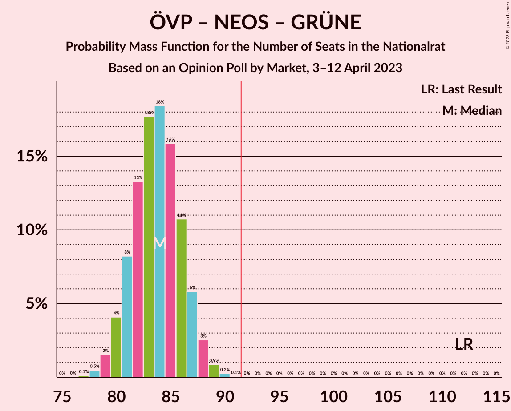

| Number of Seats | Probability | Accumulated | Special Marks |
|:---------------:|:-----------:|:-----------:|:-------------:|
| 77 | 0.1% | 100% |  |
| 78 | 0.5% | 99.9% |  |
| 79 | 2% | 99.4% |  |
| 80 | 4% | 98% |  |
| 81 | 8% | 94% |  |
| 82 | 13% | 86% |  |
| 83 | 18% | 72% | Median |
| 84 | 18% | 55% |  |
| 85 | 16% | 36% |  |
| 86 | 11% | 20% |  |
| 87 | 6% | 10% |  |
| 88 | 3% | 4% |  |
| 89 | 0.9% | 1.2% |  |
| 90 | 0.2% | 0.3% |  |
| 91 | 0.1% | 0.1% |  |
| 92 | 0% | 0% | Majority |
| 93 | 0% | 0% |  |
| 94 | 0% | 0% |  |
| 95 | 0% | 0% |  |
| 96 | 0% | 0% |  |
| 97 | 0% | 0% |  |
| 98 | 0% | 0% |  |
| 99 | 0% | 0% |  |
| 100 | 0% | 0% |  |
| 101 | 0% | 0% |  |
| 102 | 0% | 0% |  |
| 103 | 0% | 0% |  |
| 104 | 0% | 0% |  |
| 105 | 0% | 0% |  |
| 106 | 0% | 0% |  |
| 107 | 0% | 0% |  |
| 108 | 0% | 0% |  |
| 109 | 0% | 0% |  |
| 110 | 0% | 0% |  |
| 111 | 0% | 0% |  |
| 112 | 0% | 0% | Last Result |

### Sozialdemokratische Partei Österreichs – Österreichische Volkspartei

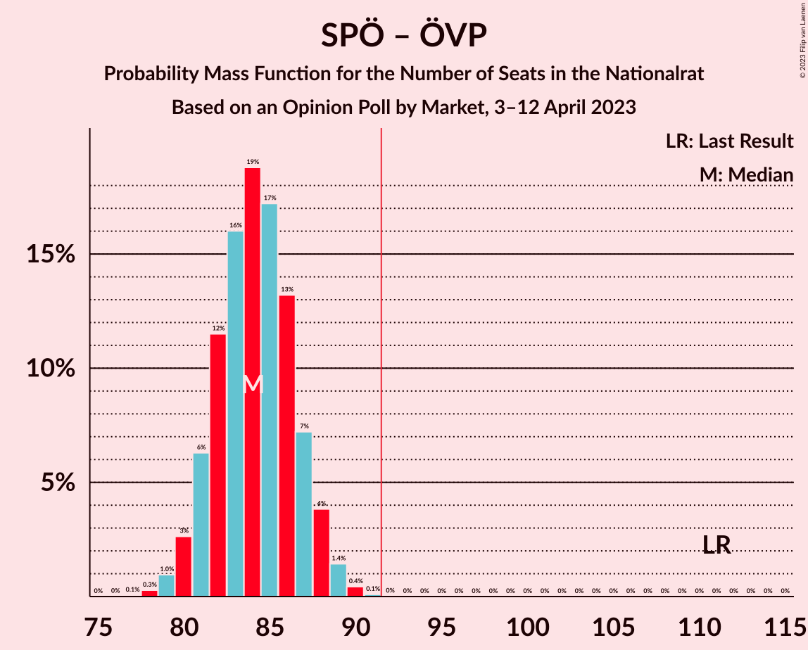

| Number of Seats | Probability | Accumulated | Special Marks |
|:---------------:|:-----------:|:-----------:|:-------------:|
| 77 | 0.1% | 100% |  |
| 78 | 0.3% | 99.9% |  |
| 79 | 1.0% | 99.6% |  |
| 80 | 3% | 98.7% |  |
| 81 | 6% | 96% |  |
| 82 | 12% | 90% |  |
| 83 | 16% | 78% |  |
| 84 | 19% | 62% | Median |
| 85 | 17% | 43% |  |
| 86 | 13% | 26% |  |
| 87 | 7% | 13% |  |
| 88 | 4% | 6% |  |
| 89 | 1.4% | 2% |  |
| 90 | 0.4% | 0.6% |  |
| 91 | 0.1% | 0.1% |  |
| 92 | 0% | 0% | Majority |
| 93 | 0% | 0% |  |
| 94 | 0% | 0% |  |
| 95 | 0% | 0% |  |
| 96 | 0% | 0% |  |
| 97 | 0% | 0% |  |
| 98 | 0% | 0% |  |
| 99 | 0% | 0% |  |
| 100 | 0% | 0% |  |
| 101 | 0% | 0% |  |
| 102 | 0% | 0% |  |
| 103 | 0% | 0% |  |
| 104 | 0% | 0% |  |
| 105 | 0% | 0% |  |
| 106 | 0% | 0% |  |
| 107 | 0% | 0% |  |
| 108 | 0% | 0% |  |
| 109 | 0% | 0% |  |
| 110 | 0% | 0% |  |
| 111 | 0% | 0% | Last Result |

### Sozialdemokratische Partei Österreichs – Die Grünen–Die Grüne Alternative

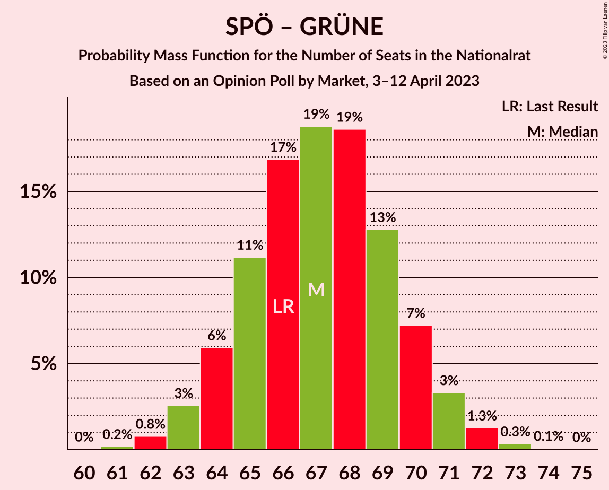

| Number of Seats | Probability | Accumulated | Special Marks |
|:---------------:|:-----------:|:-----------:|:-------------:|
| 61 | 0.2% | 100% |  |
| 62 | 0.8% | 99.8% |  |
| 63 | 3% | 99.0% |  |
| 64 | 6% | 96% |  |
| 65 | 11% | 90% |  |
| 66 | 17% | 79% | Last Result |
| 67 | 19% | 62% | Median |
| 68 | 19% | 44% |  |
| 69 | 13% | 25% |  |
| 70 | 7% | 12% |  |
| 71 | 3% | 5% |  |
| 72 | 1.3% | 2% |  |
| 73 | 0.3% | 0.4% |  |
| 74 | 0.1% | 0.1% |  |
| 75 | 0% | 0% |  |

### Österreichische Volkspartei – NEOS–Das Neue Österreich und Liberales Forum

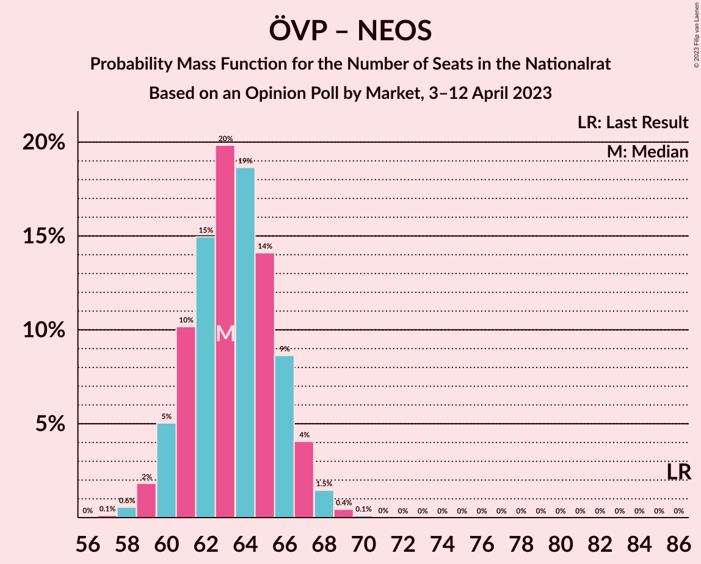

| Number of Seats | Probability | Accumulated | Special Marks |
|:---------------:|:-----------:|:-----------:|:-------------:|
| 57 | 0.1% | 100% |  |
| 58 | 0.6% | 99.9% |  |
| 59 | 2% | 99.3% |  |
| 60 | 5% | 97% |  |
| 61 | 10% | 92% |  |
| 62 | 15% | 82% |  |
| 63 | 20% | 67% | Median |
| 64 | 19% | 47% |  |
| 65 | 14% | 29% |  |
| 66 | 9% | 15% |  |
| 67 | 4% | 6% |  |
| 68 | 1.5% | 2% |  |
| 69 | 0.4% | 0.6% |  |
| 70 | 0.1% | 0.1% |  |
| 71 | 0% | 0% |  |
| 72 | 0% | 0% |  |
| 73 | 0% | 0% |  |
| 74 | 0% | 0% |  |
| 75 | 0% | 0% |  |
| 76 | 0% | 0% |  |
| 77 | 0% | 0% |  |
| 78 | 0% | 0% |  |
| 79 | 0% | 0% |  |
| 80 | 0% | 0% |  |
| 81 | 0% | 0% |  |
| 82 | 0% | 0% |  |
| 83 | 0% | 0% |  |
| 84 | 0% | 0% |  |
| 85 | 0% | 0% |  |
| 86 | 0% | 0% | Last Result |

### Österreichische Volkspartei – Die Grünen–Die Grüne Alternative

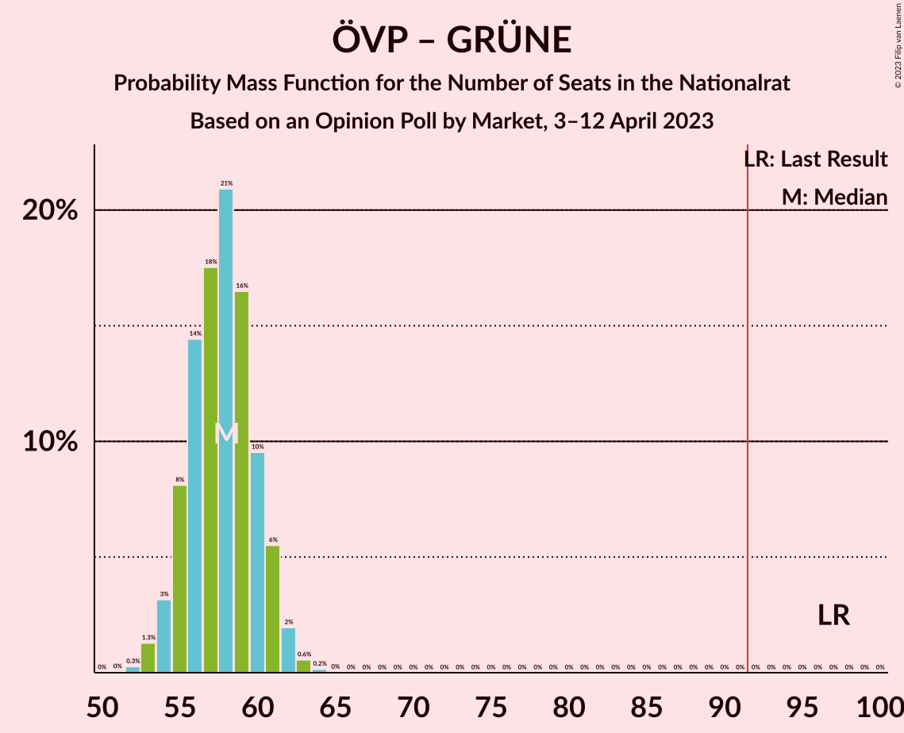

| Number of Seats | Probability | Accumulated | Special Marks |
|:---------------:|:-----------:|:-----------:|:-------------:|
| 51 | 0% | 100% |  |
| 52 | 0.3% | 99.9% |  |
| 53 | 1.3% | 99.7% |  |
| 54 | 3% | 98% |  |
| 55 | 8% | 95% |  |
| 56 | 14% | 87% |  |
| 57 | 18% | 73% | Median |
| 58 | 21% | 55% |  |
| 59 | 16% | 34% |  |
| 60 | 10% | 18% |  |
| 61 | 6% | 8% |  |
| 62 | 2% | 3% |  |
| 63 | 0.6% | 0.8% |  |
| 64 | 0.2% | 0.2% |  |
| 65 | 0% | 0% |  |
| 66 | 0% | 0% |  |
| 67 | 0% | 0% |  |
| 68 | 0% | 0% |  |
| 69 | 0% | 0% |  |
| 70 | 0% | 0% |  |
| 71 | 0% | 0% |  |
| 72 | 0% | 0% |  |
| 73 | 0% | 0% |  |
| 74 | 0% | 0% |  |
| 75 | 0% | 0% |  |
| 76 | 0% | 0% |  |
| 77 | 0% | 0% |  |
| 78 | 0% | 0% |  |
| 79 | 0% | 0% |  |
| 80 | 0% | 0% |  |
| 81 | 0% | 0% |  |
| 82 | 0% | 0% |  |
| 83 | 0% | 0% |  |
| 84 | 0% | 0% |  |
| 85 | 0% | 0% |  |
| 86 | 0% | 0% |  |
| 87 | 0% | 0% |  |
| 88 | 0% | 0% |  |
| 89 | 0% | 0% |  |
| 90 | 0% | 0% |  |
| 91 | 0% | 0% |  |
| 92 | 0% | 0% | Majority |
| 93 | 0% | 0% |  |
| 94 | 0% | 0% |  |
| 95 | 0% | 0% |  |
| 96 | 0% | 0% |  |
| 97 | 0% | 0% | Last Result |

### Sozialdemokratische Partei Österreichs

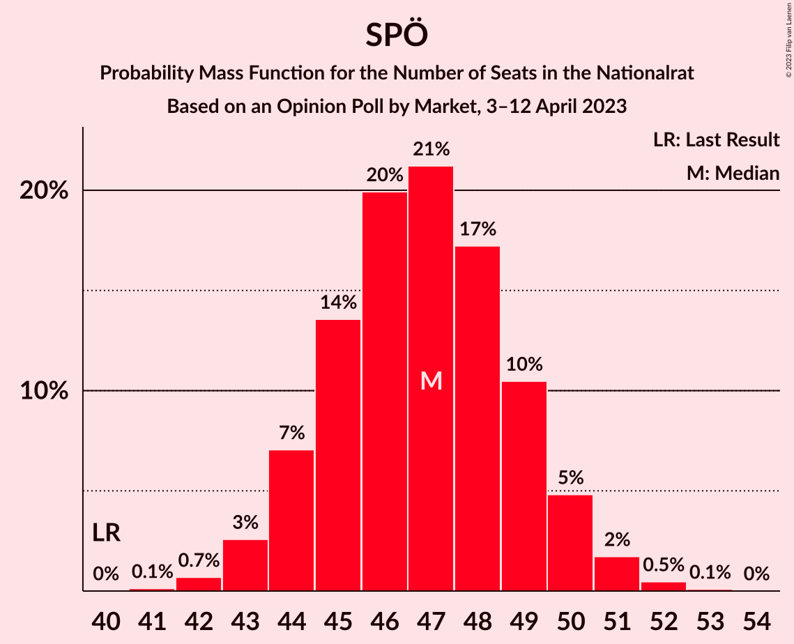

| Number of Seats | Probability | Accumulated | Special Marks |
|:---------------:|:-----------:|:-----------:|:-------------:|
| 40 | 0% | 100% | Last Result |
| 41 | 0.1% | 100% |  |
| 42 | 0.7% | 99.9% |  |
| 43 | 3% | 99.2% |  |
| 44 | 7% | 97% |  |
| 45 | 14% | 90% |  |
| 46 | 20% | 76% |  |
| 47 | 21% | 56% | Median |
| 48 | 17% | 35% |  |
| 49 | 10% | 18% |  |
| 50 | 5% | 7% |  |
| 51 | 2% | 2% |  |
| 52 | 0.5% | 0.6% |  |
| 53 | 0.1% | 0.1% |  |
| 54 | 0% | 0% |  |

### Österreichische Volkspartei

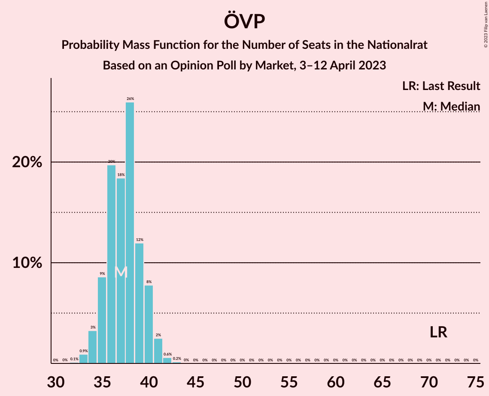

| Number of Seats | Probability | Accumulated | Special Marks |
|:---------------:|:-----------:|:-----------:|:-------------:|
| 32 | 0.1% | 100% |  |
| 33 | 0.9% | 99.9% |  |
| 34 | 3% | 99.0% |  |
| 35 | 9% | 96% |  |
| 36 | 20% | 87% |  |
| 37 | 18% | 67% | Median |
| 38 | 26% | 49% |  |
| 39 | 12% | 23% |  |
| 40 | 8% | 11% |  |
| 41 | 2% | 3% |  |
| 42 | 0.6% | 0.8% |  |
| 43 | 0.2% | 0.2% |  |
| 44 | 0% | 0% |  |
| 45 | 0% | 0% |  |
| 46 | 0% | 0% |  |
| 47 | 0% | 0% |  |
| 48 | 0% | 0% |  |
| 49 | 0% | 0% |  |
| 50 | 0% | 0% |  |
| 51 | 0% | 0% |  |
| 52 | 0% | 0% |  |
| 53 | 0% | 0% |  |
| 54 | 0% | 0% |  |
| 55 | 0% | 0% |  |
| 56 | 0% | 0% |  |
| 57 | 0% | 0% |  |
| 58 | 0% | 0% |  |
| 59 | 0% | 0% |  |
| 60 | 0% | 0% |  |
| 61 | 0% | 0% |  |
| 62 | 0% | 0% |  |
| 63 | 0% | 0% |  |
| 64 | 0% | 0% |  |
| 65 | 0% | 0% |  |
| 66 | 0% | 0% |  |
| 67 | 0% | 0% |  |
| 68 | 0% | 0% |  |
| 69 | 0% | 0% |  |
| 70 | 0% | 0% |  |
| 71 | 0% | 0% | Last Result |

## Technical Information

### Opinion Poll

+ **Polling firm:** Market
+ **Commissioner(s):** —
+ **Fieldwork period:** 3–12 April 2023

### Calculations

+ **Sample size:** 2000
+ **Simulations done:** 1,048,576
+ **Error estimate:** 0.81%

