# Opinion Poll by Market for ÖSTERREICH, 28 April–3 May 2023

<a href="#voting-intentions">Voting Intentions</a> | <a href="#seats">Seats</a> | <a href="#coalitions">Coalitions</a> | <a href="#technical-information">Technical Information</a>

## Voting Intentions

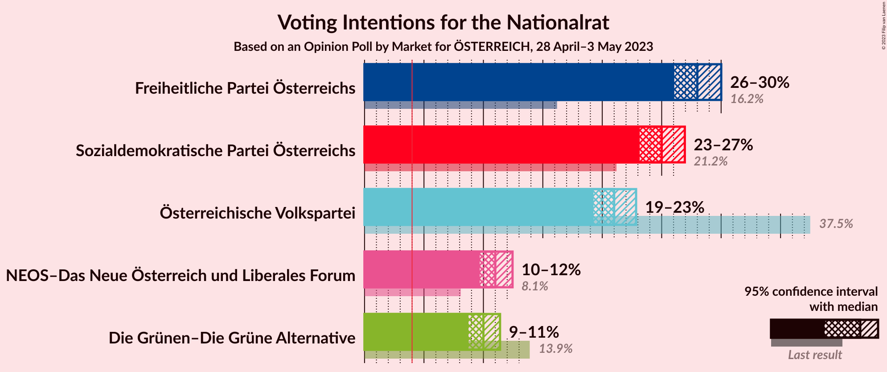

### Confidence Intervals

| Party | Last Result | Poll Result | 80% Confidence Interval | 90% Confidence Interval | 95% Confidence Interval | 99% Confidence Interval |
|:-----:|:-----------:|:-----------:|:-----------------------:|:-----------------------:|:-----------------------:|:-----------------------:|
| Freiheitliche Partei Österreichs | 16.2% | 28.0% | 26.7–29.3% |26.4–29.7% |26.1–30.0% |25.5–30.7% |
| Sozialdemokratische Partei Österreichs | 21.2% | 25.0% | 23.8–26.3% |23.4–26.6% |23.2–26.9% |22.6–27.6% |
| Österreichische Volkspartei | 37.5% | 21.0% | 19.9–22.2% |19.5–22.6% |19.3–22.8% |18.7–23.4% |
| NEOS–Das Neue Österreich und Liberales Forum | 8.1% | 11.0% | 10.1–11.9% |9.9–12.2% |9.7–12.5% |9.3–12.9% |
| Die Grünen–Die Grüne Alternative | 13.9% | 10.0% | 9.2–10.9% |8.9–11.2% |8.7–11.4% |8.4–11.9% |

*Note:* The poll result column reflects the actual value used in the calculations. Published results may vary slightly, and in addition be rounded to fewer digits.

## Seats

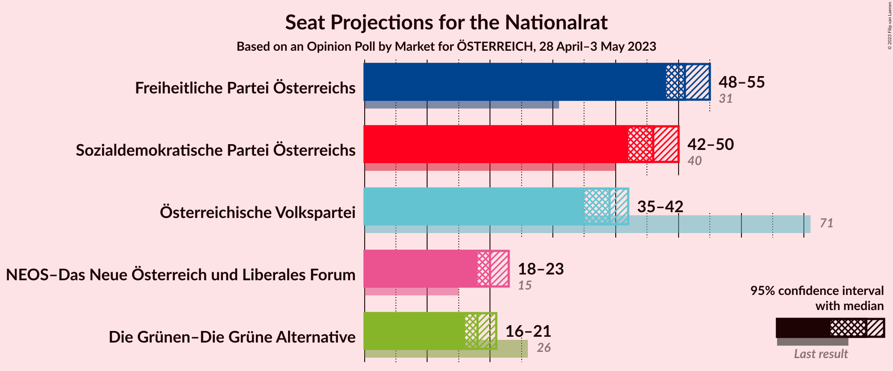

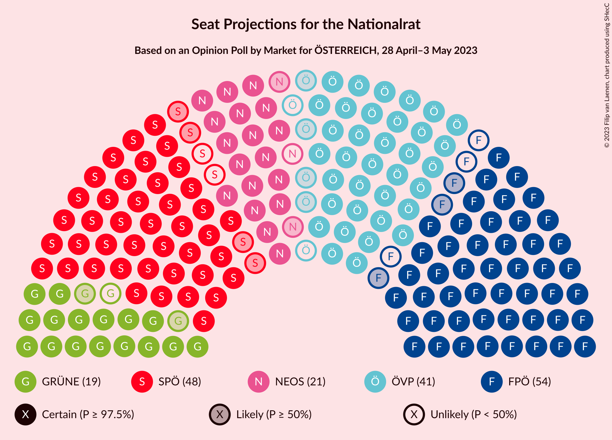

### Confidence Intervals

| Party | Last Result | Median | 80% Confidence Interval | 90% Confidence Interval | 95% Confidence Interval | 99% Confidence Interval |
|:-----:|:-----------:|:------:|:-----------------------:|:-----------------------:|:-----------------------:|:-----------------------:|
| <a href="#freiheitliche-partei-österreichs">Freiheitliche Partei Österreichs</a> | 31 | 51 | 49–54 |48–55 |48–55 |47–57 |
| <a href="#sozialdemokratische-partei-österreichs">Sozialdemokratische Partei Österreichs</a> | 40 | 46 | 44–48 |43–49 |42–50 |41–51 |
| <a href="#österreichische-volkspartei">Österreichische Volkspartei</a> | 71 | 39 | 36–41 |36–41 |35–42 |34–43 |
| <a href="#neos–das-neue-österreich-und-liberales-forum">NEOS–Das Neue Österreich und Liberales Forum</a> | 15 | 20 | 18–22 |18–22 |18–23 |17–24 |
| <a href="#die-grünen–die-grüne-alternative">Die Grünen–Die Grüne Alternative</a> | 26 | 18 | 17–20 |16–20 |16–21 |15–22 |

### Freiheitliche Partei Österreichs

*For a full overview of the results for this party, see the [Freiheitliche Partei Österreichs](party-freiheitlicheparteiösterreichs.html) page.*

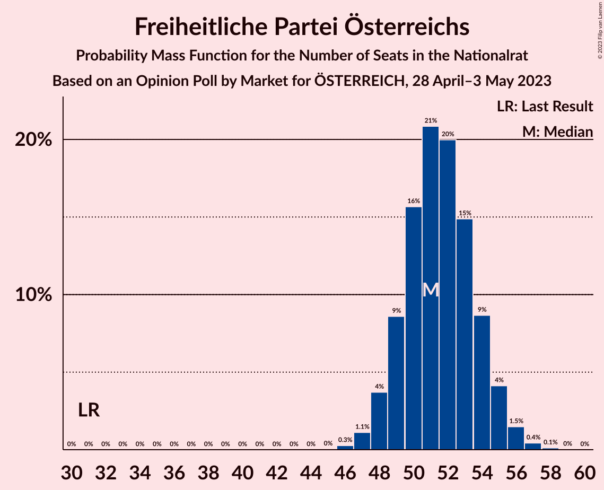

| Number of Seats | Probability | Accumulated | Special Marks |
|:---------------:|:-----------:|:-----------:|:-------------:|
| 31 | 0% | 100% | Last Result |
| 32 | 0% | 100% |  |
| 33 | 0% | 100% |  |
| 34 | 0% | 100% |  |
| 35 | 0% | 100% |  |
| 36 | 0% | 100% |  |
| 37 | 0% | 100% |  |
| 38 | 0% | 100% |  |
| 39 | 0% | 100% |  |
| 40 | 0% | 100% |  |
| 41 | 0% | 100% |  |
| 42 | 0% | 100% |  |
| 43 | 0% | 100% |  |
| 44 | 0% | 100% |  |
| 45 | 0% | 100% |  |
| 46 | 0.3% | 100% |  |
| 47 | 1.1% | 99.7% |  |
| 48 | 4% | 98.6% |  |
| 49 | 9% | 95% |  |
| 50 | 16% | 86% |  |
| 51 | 21% | 71% | Median |
| 52 | 20% | 50% |  |
| 53 | 15% | 30% |  |
| 54 | 9% | 15% |  |
| 55 | 4% | 6% |  |
| 56 | 1.5% | 2% |  |
| 57 | 0.4% | 0.6% |  |
| 58 | 0.1% | 0.1% |  |
| 59 | 0% | 0% |  |

### Sozialdemokratische Partei Österreichs

*For a full overview of the results for this party, see the [Sozialdemokratische Partei Österreichs](party-sozialdemokratischeparteiösterreichs.html) page.*

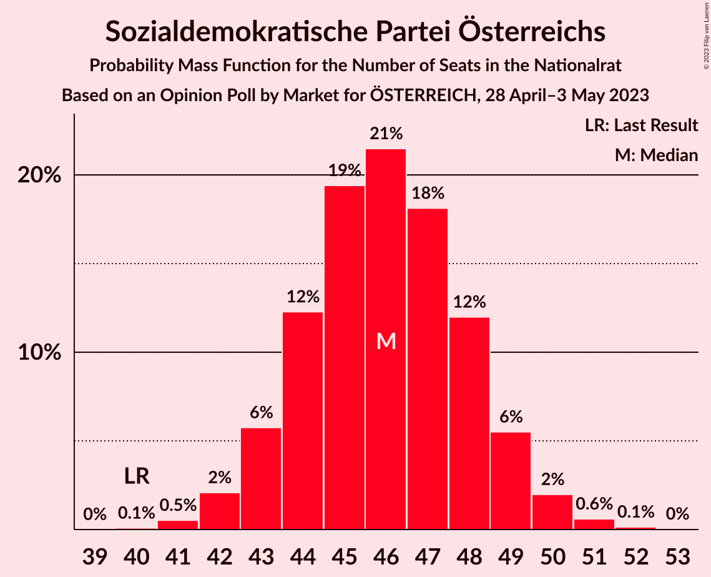

| Number of Seats | Probability | Accumulated | Special Marks |
|:---------------:|:-----------:|:-----------:|:-------------:|
| 40 | 0.1% | 100% | Last Result |
| 41 | 0.5% | 99.9% |  |
| 42 | 2% | 99.4% |  |
| 43 | 6% | 97% |  |
| 44 | 12% | 92% |  |
| 45 | 19% | 79% |  |
| 46 | 21% | 60% | Median |
| 47 | 18% | 38% |  |
| 48 | 12% | 20% |  |
| 49 | 6% | 8% |  |
| 50 | 2% | 3% |  |
| 51 | 0.6% | 0.8% |  |
| 52 | 0.1% | 0.2% |  |
| 53 | 0% | 0% |  |

### Österreichische Volkspartei

*For a full overview of the results for this party, see the [Österreichische Volkspartei](party-österreichischevolkspartei.html) page.*

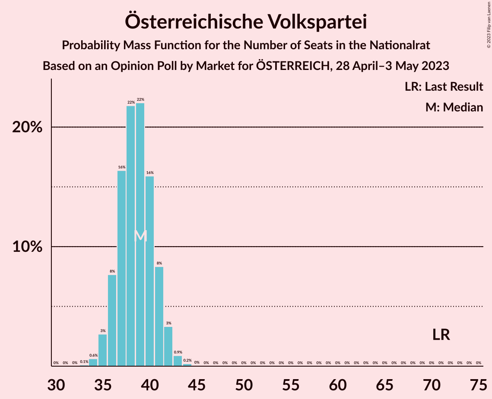

| Number of Seats | Probability | Accumulated | Special Marks |
|:---------------:|:-----------:|:-----------:|:-------------:|
| 33 | 0.1% | 100% |  |
| 34 | 0.6% | 99.9% |  |
| 35 | 3% | 99.3% |  |
| 36 | 8% | 97% |  |
| 37 | 16% | 89% |  |
| 38 | 22% | 73% |  |
| 39 | 22% | 51% | Median |
| 40 | 16% | 29% |  |
| 41 | 8% | 13% |  |
| 42 | 3% | 4% |  |
| 43 | 0.9% | 1.1% |  |
| 44 | 0.2% | 0.3% |  |
| 45 | 0% | 0% |  |
| 46 | 0% | 0% |  |
| 47 | 0% | 0% |  |
| 48 | 0% | 0% |  |
| 49 | 0% | 0% |  |
| 50 | 0% | 0% |  |
| 51 | 0% | 0% |  |
| 52 | 0% | 0% |  |
| 53 | 0% | 0% |  |
| 54 | 0% | 0% |  |
| 55 | 0% | 0% |  |
| 56 | 0% | 0% |  |
| 57 | 0% | 0% |  |
| 58 | 0% | 0% |  |
| 59 | 0% | 0% |  |
| 60 | 0% | 0% |  |
| 61 | 0% | 0% |  |
| 62 | 0% | 0% |  |
| 63 | 0% | 0% |  |
| 64 | 0% | 0% |  |
| 65 | 0% | 0% |  |
| 66 | 0% | 0% |  |
| 67 | 0% | 0% |  |
| 68 | 0% | 0% |  |
| 69 | 0% | 0% |  |
| 70 | 0% | 0% |  |
| 71 | 0% | 0% | Last Result |

### NEOS–Das Neue Österreich und Liberales Forum

*For a full overview of the results for this party, see the [NEOS–Das Neue Österreich und Liberales Forum](party-neos–dasneueösterreichundliberalesforum.html) page.*

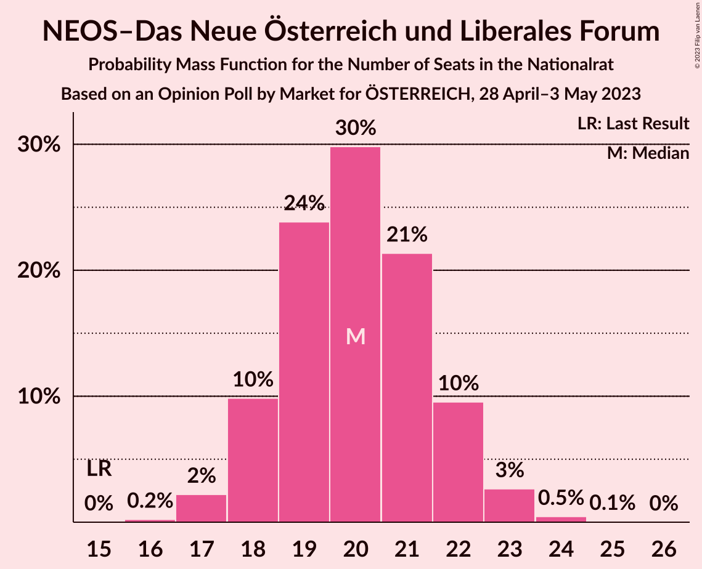

| Number of Seats | Probability | Accumulated | Special Marks |
|:---------------:|:-----------:|:-----------:|:-------------:|
| 15 | 0% | 100% | Last Result |
| 16 | 0.2% | 100% |  |
| 17 | 2% | 99.8% |  |
| 18 | 10% | 98% |  |
| 19 | 24% | 88% |  |
| 20 | 30% | 64% | Median |
| 21 | 21% | 34% |  |
| 22 | 10% | 13% |  |
| 23 | 3% | 3% |  |
| 24 | 0.5% | 0.5% |  |
| 25 | 0.1% | 0.1% |  |
| 26 | 0% | 0% |  |

### Die Grünen–Die Grüne Alternative

*For a full overview of the results for this party, see the [Die Grünen–Die Grüne Alternative](party-diegrünen–diegrünealternative.html) page.*

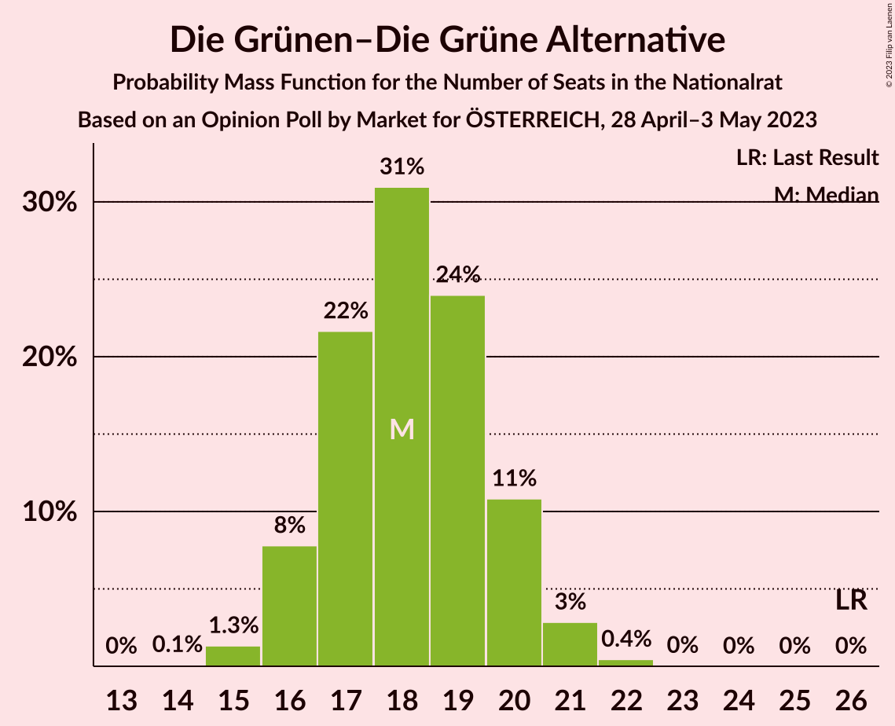

| Number of Seats | Probability | Accumulated | Special Marks |
|:---------------:|:-----------:|:-----------:|:-------------:|
| 14 | 0.1% | 100% |  |
| 15 | 1.3% | 99.9% |  |
| 16 | 8% | 98.6% |  |
| 17 | 22% | 91% |  |
| 18 | 31% | 69% | Median |
| 19 | 24% | 38% |  |
| 20 | 11% | 14% |  |
| 21 | 3% | 3% |  |
| 22 | 0.4% | 0.5% |  |
| 23 | 0% | 0.1% |  |
| 24 | 0% | 0% |  |
| 25 | 0% | 0% |  |
| 26 | 0% | 0% | Last Result |

## Coalitions

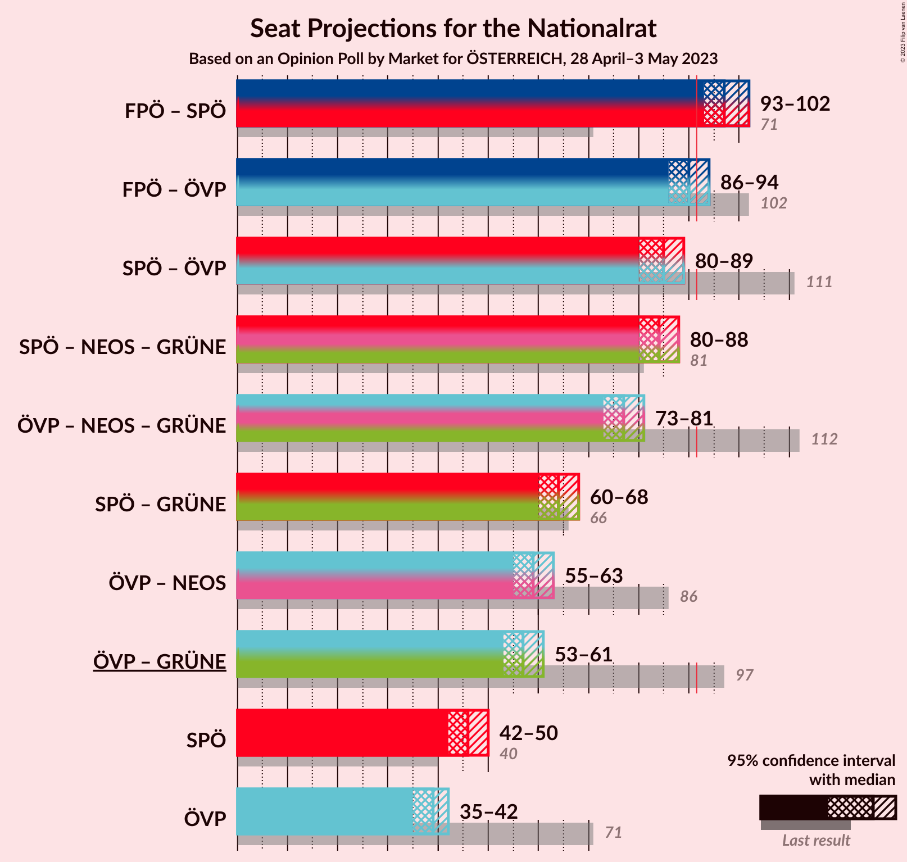

### Confidence Intervals

| Coalition | Last Result | Median | Majority? | 80% Confidence Interval | 90% Confidence Interval | 95% Confidence Interval | 99% Confidence Interval |
|:---------:|:-----------:|:------:|:---------:|:-----------------------:|:-----------------------:|:-----------------------:|:-----------------------:|
| Freiheitliche Partei Österreichs – Sozialdemokratische Partei Österreichs | 71 | 97 | 99.8% | 95–100 | 94–101 | 93–102 | 92–104 |
| Freiheitliche Partei Österreichs – Österreichische Volkspartei | 102 | 90 | 25% | 87–93 | 87–94 | 86–94 | 85–96 |
| Sozialdemokratische Partei Österreichs – Österreichische Volkspartei | 111 | 85 | 0.1% | 82–87 | 81–88 | 80–89 | 79–90 |
| Sozialdemokratische Partei Österreichs – NEOS–Das Neue Österreich und Liberales Forum – Die Grünen–Die Grüne Alternative | 81 | 84 | 0.1% | 81–87 | 81–88 | 80–88 | 79–90 |
| Österreichische Volkspartei – NEOS–Das Neue Österreich und Liberales Forum – Die Grünen–Die Grüne Alternative | 112 | 77 | 0% | 74–79 | 73–80 | 73–81 | 71–82 |
| Sozialdemokratische Partei Österreichs – Die Grünen–Die Grüne Alternative | 66 | 64 | 0% | 62–67 | 61–67 | 60–68 | 59–70 |
| Österreichische Volkspartei – NEOS–Das Neue Österreich und Liberales Forum | 86 | 59 | 0% | 56–61 | 55–62 | 55–63 | 54–64 |
| Österreichische Volkspartei – Die Grünen–Die Grüne Alternative | 97 | 57 | 0% | 54–59 | 53–60 | 53–61 | 52–62 |
| Sozialdemokratische Partei Österreichs | 40 | 46 | 0% | 44–48 | 43–49 | 42–50 | 41–51 |
| Österreichische Volkspartei | 71 | 39 | 0% | 36–41 | 36–41 | 35–42 | 34–43 |

### Freiheitliche Partei Österreichs – Sozialdemokratische Partei Österreichs

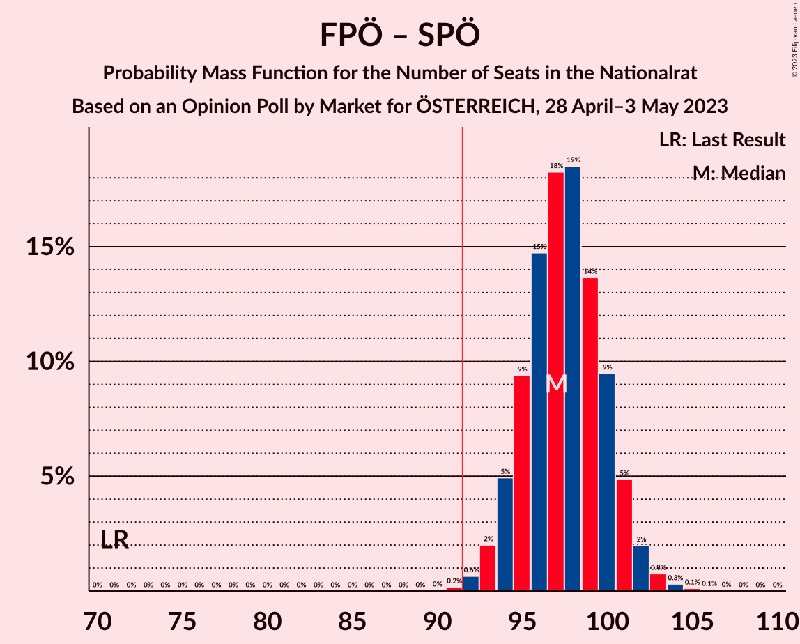

| Number of Seats | Probability | Accumulated | Special Marks |
|:---------------:|:-----------:|:-----------:|:-------------:|
| 71 | 0% | 100% | Last Result |
| 72 | 0% | 100% |  |
| 73 | 0% | 100% |  |
| 74 | 0% | 100% |  |
| 75 | 0% | 100% |  |
| 76 | 0% | 100% |  |
| 77 | 0% | 100% |  |
| 78 | 0% | 100% |  |
| 79 | 0% | 100% |  |
| 80 | 0% | 100% |  |
| 81 | 0% | 100% |  |
| 82 | 0% | 100% |  |
| 83 | 0% | 100% |  |
| 84 | 0% | 100% |  |
| 85 | 0% | 100% |  |
| 86 | 0% | 100% |  |
| 87 | 0% | 100% |  |
| 88 | 0% | 100% |  |
| 89 | 0% | 100% |  |
| 90 | 0% | 100% |  |
| 91 | 0.2% | 100% |  |
| 92 | 0.6% | 99.8% | Majority |
| 93 | 2% | 99.1% |  |
| 94 | 5% | 97% |  |
| 95 | 9% | 92% |  |
| 96 | 15% | 83% |  |
| 97 | 18% | 68% | Median |
| 98 | 19% | 50% |  |
| 99 | 14% | 31% |  |
| 100 | 9% | 18% |  |
| 101 | 5% | 8% |  |
| 102 | 2% | 3% |  |
| 103 | 0.8% | 1.3% |  |
| 104 | 0.3% | 0.5% |  |
| 105 | 0.1% | 0.2% |  |
| 106 | 0.1% | 0.1% |  |
| 107 | 0% | 0% |  |

### Freiheitliche Partei Österreichs – Österreichische Volkspartei

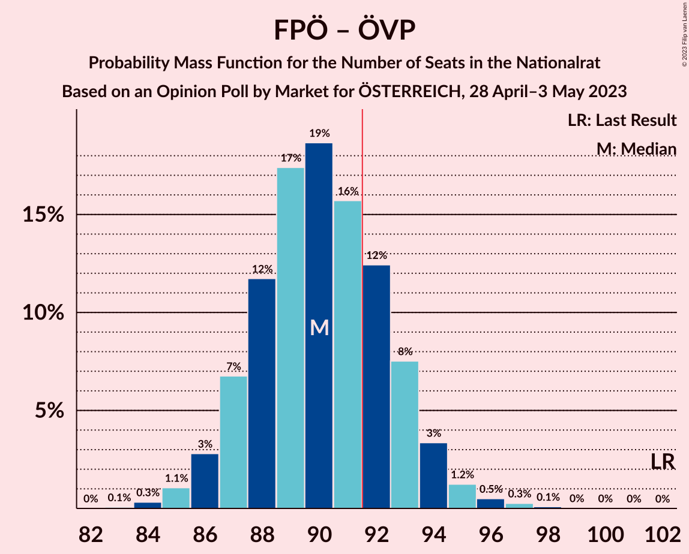

| Number of Seats | Probability | Accumulated | Special Marks |
|:---------------:|:-----------:|:-----------:|:-------------:|
| 83 | 0.1% | 100% |  |
| 84 | 0.3% | 99.9% |  |
| 85 | 1.1% | 99.6% |  |
| 86 | 3% | 98.5% |  |
| 87 | 7% | 96% |  |
| 88 | 12% | 89% |  |
| 89 | 17% | 77% |  |
| 90 | 19% | 60% | Median |
| 91 | 16% | 41% |  |
| 92 | 12% | 25% | Majority |
| 93 | 8% | 13% |  |
| 94 | 3% | 5% |  |
| 95 | 1.2% | 2% |  |
| 96 | 0.5% | 0.9% |  |
| 97 | 0.3% | 0.4% |  |
| 98 | 0.1% | 0.1% |  |
| 99 | 0% | 0% |  |
| 100 | 0% | 0% |  |
| 101 | 0% | 0% |  |
| 102 | 0% | 0% | Last Result |

### Sozialdemokratische Partei Österreichs – Österreichische Volkspartei

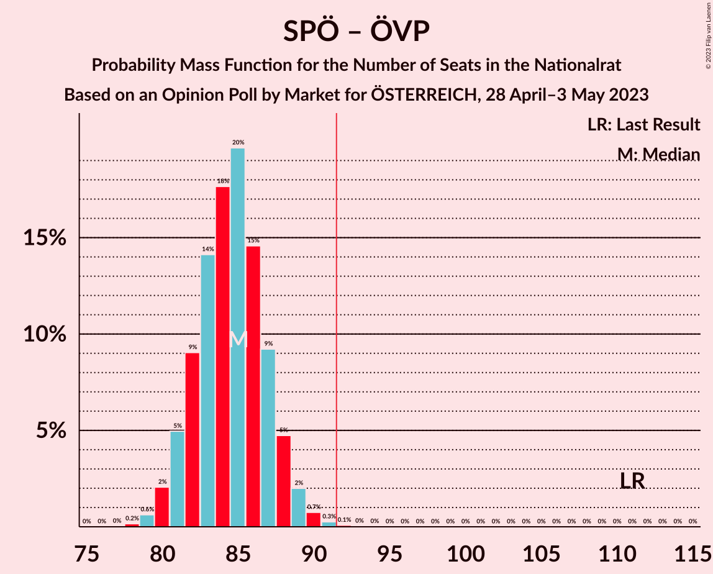

| Number of Seats | Probability | Accumulated | Special Marks |
|:---------------:|:-----------:|:-----------:|:-------------:|
| 78 | 0.2% | 100% |  |
| 79 | 0.6% | 99.8% |  |
| 80 | 2% | 99.2% |  |
| 81 | 5% | 97% |  |
| 82 | 9% | 92% |  |
| 83 | 14% | 83% |  |
| 84 | 18% | 69% |  |
| 85 | 20% | 51% | Median |
| 86 | 15% | 32% |  |
| 87 | 9% | 17% |  |
| 88 | 5% | 8% |  |
| 89 | 2% | 3% |  |
| 90 | 0.7% | 1.1% |  |
| 91 | 0.3% | 0.4% |  |
| 92 | 0.1% | 0.1% | Majority |
| 93 | 0% | 0.1% |  |
| 94 | 0% | 0% |  |
| 95 | 0% | 0% |  |
| 96 | 0% | 0% |  |
| 97 | 0% | 0% |  |
| 98 | 0% | 0% |  |
| 99 | 0% | 0% |  |
| 100 | 0% | 0% |  |
| 101 | 0% | 0% |  |
| 102 | 0% | 0% |  |
| 103 | 0% | 0% |  |
| 104 | 0% | 0% |  |
| 105 | 0% | 0% |  |
| 106 | 0% | 0% |  |
| 107 | 0% | 0% |  |
| 108 | 0% | 0% |  |
| 109 | 0% | 0% |  |
| 110 | 0% | 0% |  |
| 111 | 0% | 0% | Last Result |

### Sozialdemokratische Partei Österreichs – NEOS–Das Neue Österreich und Liberales Forum – Die Grünen–Die Grüne Alternative

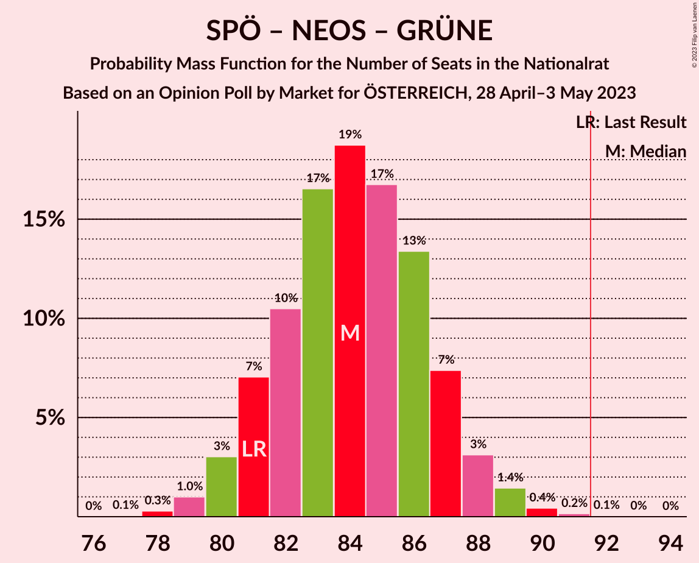

| Number of Seats | Probability | Accumulated | Special Marks |
|:---------------:|:-----------:|:-----------:|:-------------:|
| 77 | 0.1% | 100% |  |
| 78 | 0.3% | 99.9% |  |
| 79 | 1.0% | 99.6% |  |
| 80 | 3% | 98.6% |  |
| 81 | 7% | 96% | Last Result |
| 82 | 10% | 89% |  |
| 83 | 17% | 78% |  |
| 84 | 19% | 62% | Median |
| 85 | 17% | 43% |  |
| 86 | 13% | 26% |  |
| 87 | 7% | 13% |  |
| 88 | 3% | 5% |  |
| 89 | 1.4% | 2% |  |
| 90 | 0.4% | 0.7% |  |
| 91 | 0.2% | 0.3% |  |
| 92 | 0.1% | 0.1% | Majority |
| 93 | 0% | 0% |  |

### Österreichische Volkspartei – NEOS–Das Neue Österreich und Liberales Forum – Die Grünen–Die Grüne Alternative

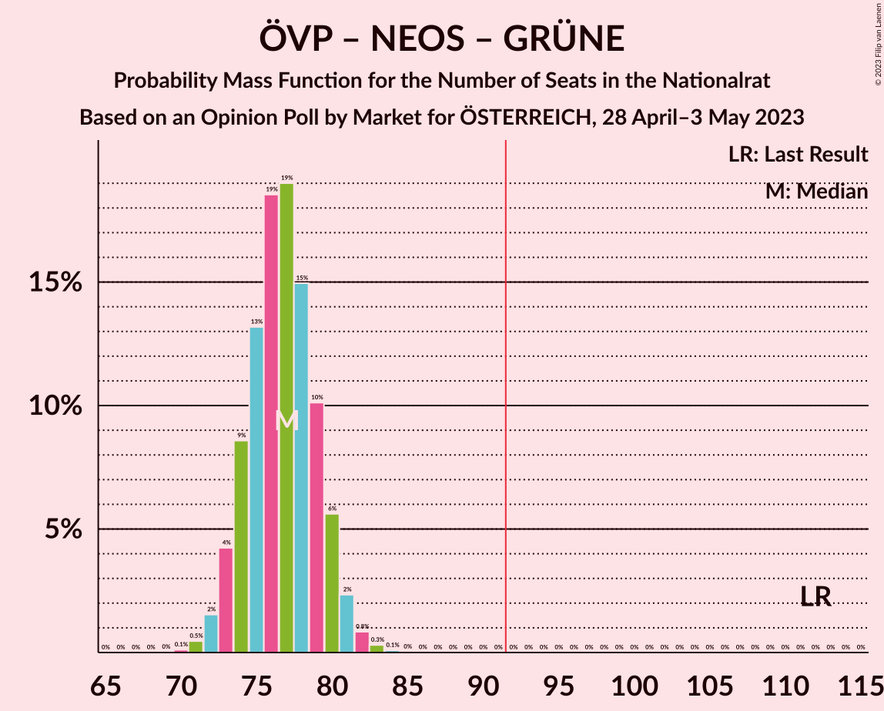

| Number of Seats | Probability | Accumulated | Special Marks |
|:---------------:|:-----------:|:-----------:|:-------------:|
| 70 | 0.1% | 100% |  |
| 71 | 0.5% | 99.9% |  |
| 72 | 2% | 99.4% |  |
| 73 | 4% | 98% |  |
| 74 | 9% | 94% |  |
| 75 | 13% | 85% |  |
| 76 | 19% | 72% |  |
| 77 | 19% | 53% | Median |
| 78 | 15% | 34% |  |
| 79 | 10% | 19% |  |
| 80 | 6% | 9% |  |
| 81 | 2% | 4% |  |
| 82 | 0.8% | 1.3% |  |
| 83 | 0.3% | 0.4% |  |
| 84 | 0.1% | 0.1% |  |
| 85 | 0% | 0% |  |
| 86 | 0% | 0% |  |
| 87 | 0% | 0% |  |
| 88 | 0% | 0% |  |
| 89 | 0% | 0% |  |
| 90 | 0% | 0% |  |
| 91 | 0% | 0% |  |
| 92 | 0% | 0% | Majority |
| 93 | 0% | 0% |  |
| 94 | 0% | 0% |  |
| 95 | 0% | 0% |  |
| 96 | 0% | 0% |  |
| 97 | 0% | 0% |  |
| 98 | 0% | 0% |  |
| 99 | 0% | 0% |  |
| 100 | 0% | 0% |  |
| 101 | 0% | 0% |  |
| 102 | 0% | 0% |  |
| 103 | 0% | 0% |  |
| 104 | 0% | 0% |  |
| 105 | 0% | 0% |  |
| 106 | 0% | 0% |  |
| 107 | 0% | 0% |  |
| 108 | 0% | 0% |  |
| 109 | 0% | 0% |  |
| 110 | 0% | 0% |  |
| 111 | 0% | 0% |  |
| 112 | 0% | 0% | Last Result |

### Sozialdemokratische Partei Österreichs – Die Grünen–Die Grüne Alternative

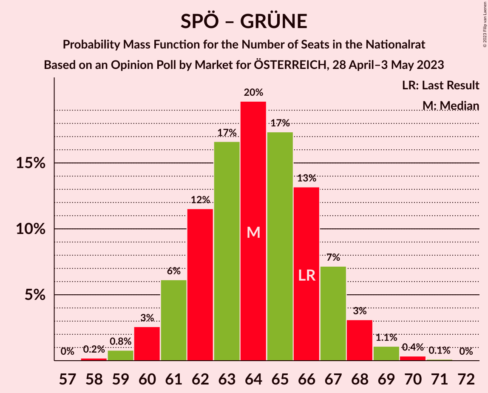

| Number of Seats | Probability | Accumulated | Special Marks |
|:---------------:|:-----------:|:-----------:|:-------------:|
| 58 | 0.2% | 100% |  |
| 59 | 0.8% | 99.8% |  |
| 60 | 3% | 99.0% |  |
| 61 | 6% | 96% |  |
| 62 | 12% | 90% |  |
| 63 | 17% | 79% |  |
| 64 | 20% | 62% | Median |
| 65 | 17% | 42% |  |
| 66 | 13% | 25% | Last Result |
| 67 | 7% | 12% |  |
| 68 | 3% | 5% |  |
| 69 | 1.1% | 2% |  |
| 70 | 0.4% | 0.5% |  |
| 71 | 0.1% | 0.2% |  |
| 72 | 0% | 0% |  |

### Österreichische Volkspartei – NEOS–Das Neue Österreich und Liberales Forum

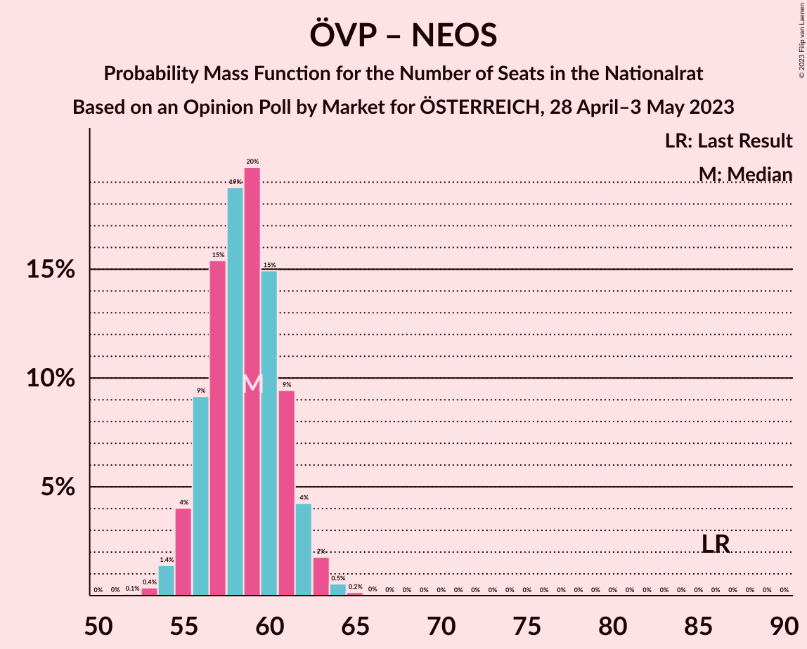

| Number of Seats | Probability | Accumulated | Special Marks |
|:---------------:|:-----------:|:-----------:|:-------------:|
| 52 | 0.1% | 100% |  |
| 53 | 0.4% | 99.9% |  |
| 54 | 1.4% | 99.6% |  |
| 55 | 4% | 98% |  |
| 56 | 9% | 94% |  |
| 57 | 15% | 85% |  |
| 58 | 19% | 70% |  |
| 59 | 20% | 51% | Median |
| 60 | 15% | 31% |  |
| 61 | 9% | 16% |  |
| 62 | 4% | 7% |  |
| 63 | 2% | 3% |  |
| 64 | 0.5% | 0.7% |  |
| 65 | 0.2% | 0.2% |  |
| 66 | 0% | 0.1% |  |
| 67 | 0% | 0% |  |
| 68 | 0% | 0% |  |
| 69 | 0% | 0% |  |
| 70 | 0% | 0% |  |
| 71 | 0% | 0% |  |
| 72 | 0% | 0% |  |
| 73 | 0% | 0% |  |
| 74 | 0% | 0% |  |
| 75 | 0% | 0% |  |
| 76 | 0% | 0% |  |
| 77 | 0% | 0% |  |
| 78 | 0% | 0% |  |
| 79 | 0% | 0% |  |
| 80 | 0% | 0% |  |
| 81 | 0% | 0% |  |
| 82 | 0% | 0% |  |
| 83 | 0% | 0% |  |
| 84 | 0% | 0% |  |
| 85 | 0% | 0% |  |
| 86 | 0% | 0% | Last Result |

### Österreichische Volkspartei – Die Grünen–Die Grüne Alternative

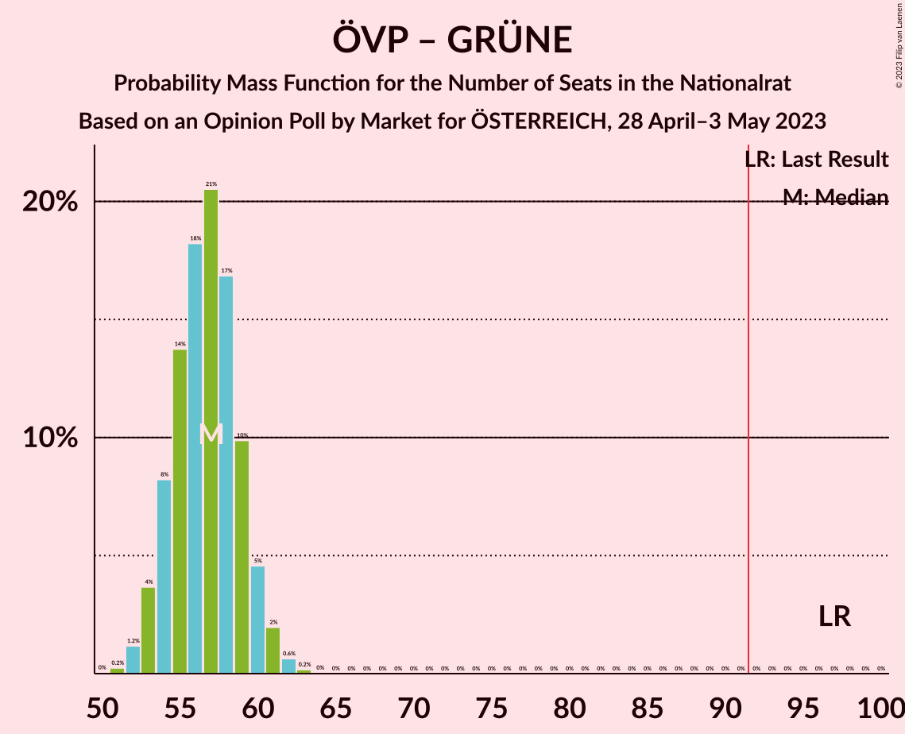

| Number of Seats | Probability | Accumulated | Special Marks |
|:---------------:|:-----------:|:-----------:|:-------------:|
| 50 | 0% | 100% |  |
| 51 | 0.2% | 99.9% |  |
| 52 | 1.2% | 99.7% |  |
| 53 | 4% | 98.5% |  |
| 54 | 8% | 95% |  |
| 55 | 14% | 87% |  |
| 56 | 18% | 73% |  |
| 57 | 21% | 55% | Median |
| 58 | 17% | 34% |  |
| 59 | 10% | 17% |  |
| 60 | 5% | 7% |  |
| 61 | 2% | 3% |  |
| 62 | 0.6% | 0.9% |  |
| 63 | 0.2% | 0.2% |  |
| 64 | 0% | 0.1% |  |
| 65 | 0% | 0% |  |
| 66 | 0% | 0% |  |
| 67 | 0% | 0% |  |
| 68 | 0% | 0% |  |
| 69 | 0% | 0% |  |
| 70 | 0% | 0% |  |
| 71 | 0% | 0% |  |
| 72 | 0% | 0% |  |
| 73 | 0% | 0% |  |
| 74 | 0% | 0% |  |
| 75 | 0% | 0% |  |
| 76 | 0% | 0% |  |
| 77 | 0% | 0% |  |
| 78 | 0% | 0% |  |
| 79 | 0% | 0% |  |
| 80 | 0% | 0% |  |
| 81 | 0% | 0% |  |
| 82 | 0% | 0% |  |
| 83 | 0% | 0% |  |
| 84 | 0% | 0% |  |
| 85 | 0% | 0% |  |
| 86 | 0% | 0% |  |
| 87 | 0% | 0% |  |
| 88 | 0% | 0% |  |
| 89 | 0% | 0% |  |
| 90 | 0% | 0% |  |
| 91 | 0% | 0% |  |
| 92 | 0% | 0% | Majority |
| 93 | 0% | 0% |  |
| 94 | 0% | 0% |  |
| 95 | 0% | 0% |  |
| 96 | 0% | 0% |  |
| 97 | 0% | 0% | Last Result |

### Sozialdemokratische Partei Österreichs

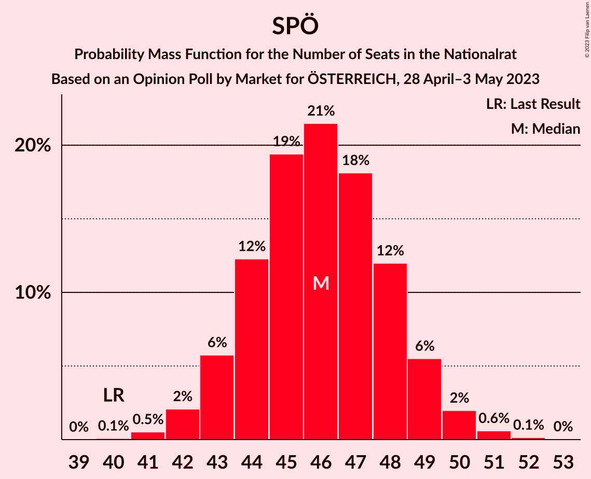

| Number of Seats | Probability | Accumulated | Special Marks |
|:---------------:|:-----------:|:-----------:|:-------------:|
| 40 | 0.1% | 100% | Last Result |
| 41 | 0.5% | 99.9% |  |
| 42 | 2% | 99.4% |  |
| 43 | 6% | 97% |  |
| 44 | 12% | 92% |  |
| 45 | 19% | 79% |  |
| 46 | 21% | 60% | Median |
| 47 | 18% | 38% |  |
| 48 | 12% | 20% |  |
| 49 | 6% | 8% |  |
| 50 | 2% | 3% |  |
| 51 | 0.6% | 0.8% |  |
| 52 | 0.1% | 0.2% |  |
| 53 | 0% | 0% |  |

### Österreichische Volkspartei

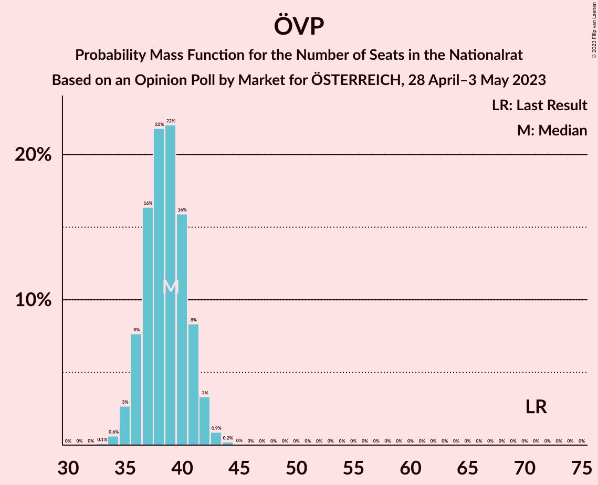

| Number of Seats | Probability | Accumulated | Special Marks |
|:---------------:|:-----------:|:-----------:|:-------------:|
| 33 | 0.1% | 100% |  |
| 34 | 0.6% | 99.9% |  |
| 35 | 3% | 99.3% |  |
| 36 | 8% | 97% |  |
| 37 | 16% | 89% |  |
| 38 | 22% | 73% |  |
| 39 | 22% | 51% | Median |
| 40 | 16% | 29% |  |
| 41 | 8% | 13% |  |
| 42 | 3% | 4% |  |
| 43 | 0.9% | 1.1% |  |
| 44 | 0.2% | 0.3% |  |
| 45 | 0% | 0% |  |
| 46 | 0% | 0% |  |
| 47 | 0% | 0% |  |
| 48 | 0% | 0% |  |
| 49 | 0% | 0% |  |
| 50 | 0% | 0% |  |
| 51 | 0% | 0% |  |
| 52 | 0% | 0% |  |
| 53 | 0% | 0% |  |
| 54 | 0% | 0% |  |
| 55 | 0% | 0% |  |
| 56 | 0% | 0% |  |
| 57 | 0% | 0% |  |
| 58 | 0% | 0% |  |
| 59 | 0% | 0% |  |
| 60 | 0% | 0% |  |
| 61 | 0% | 0% |  |
| 62 | 0% | 0% |  |
| 63 | 0% | 0% |  |
| 64 | 0% | 0% |  |
| 65 | 0% | 0% |  |
| 66 | 0% | 0% |  |
| 67 | 0% | 0% |  |
| 68 | 0% | 0% |  |
| 69 | 0% | 0% |  |
| 70 | 0% | 0% |  |
| 71 | 0% | 0% | Last Result |

## Technical Information

### Opinion Poll

+ **Polling firm:** Market
+ **Commissioner(s):** ÖSTERREICH
+ **Fieldwork period:** 28 April–3 May 2023

### Calculations

+ **Sample size:** 2000
+ **Simulations done:** 1,048,576
+ **Error estimate:** 0.90%

