# Opinion Poll by INSA for eXXpress, 2–4 May 2023

<a href="#voting-intentions">Voting Intentions</a> | <a href="#seats">Seats</a> | <a href="#coalitions">Coalitions</a> | <a href="#technical-information">Technical Information</a>

## Voting Intentions

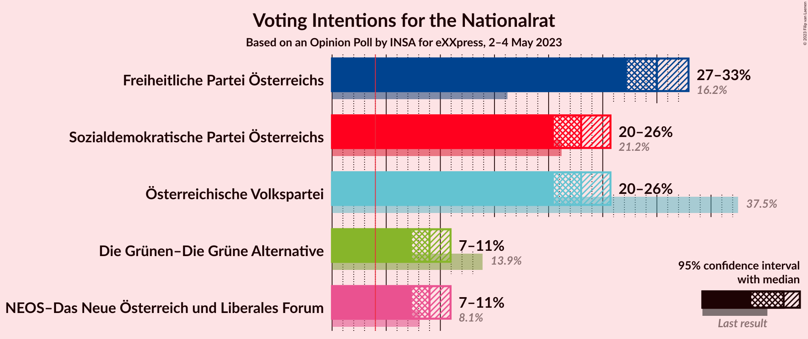

### Confidence Intervals

| Party | Last Result | Poll Result | 80% Confidence Interval | 90% Confidence Interval | 95% Confidence Interval | 99% Confidence Interval |
|:-----:|:-----------:|:-----------:|:-----------------------:|:-----------------------:|:-----------------------:|:-----------------------:|
| Freiheitliche Partei Österreichs | 16.2% | 30.0% | 28.2–31.9% |27.7–32.4% |27.2–32.9% |26.4–33.9% |
| Österreichische Volkspartei | 37.5% | 23.0% | 21.4–24.8% |20.9–25.3% |20.5–25.7% |19.7–26.6% |
| Sozialdemokratische Partei Österreichs | 21.2% | 23.0% | 21.4–24.8% |20.9–25.3% |20.5–25.7% |19.7–26.6% |
| NEOS–Das Neue Österreich und Liberales Forum | 8.1% | 9.0% | 7.9–10.3% |7.6–10.6% |7.4–10.9% |6.9–11.6% |
| Die Grünen–Die Grüne Alternative | 13.9% | 9.0% | 7.9–10.3% |7.6–10.6% |7.4–10.9% |6.9–11.6% |

*Note:* The poll result column reflects the actual value used in the calculations. Published results may vary slightly, and in addition be rounded to fewer digits.

## Seats

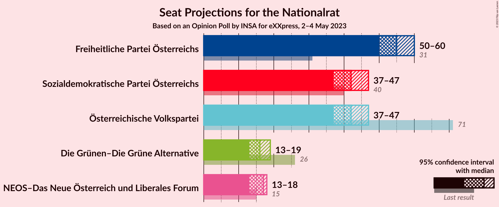

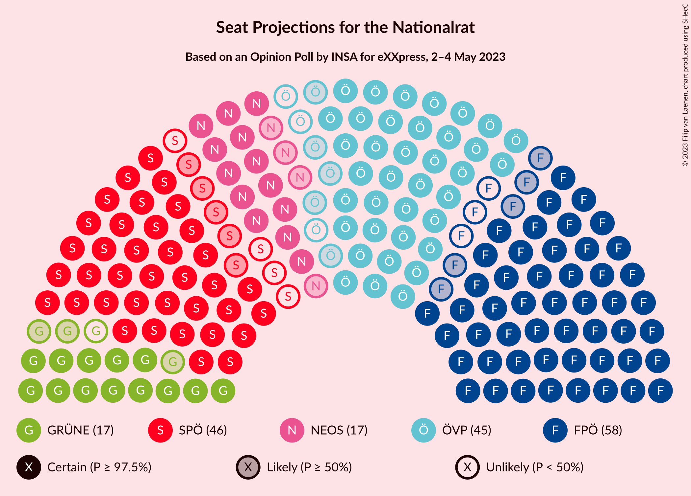

### Confidence Intervals

| Party | Last Result | Median | 80% Confidence Interval | 90% Confidence Interval | 95% Confidence Interval | 99% Confidence Interval |
|:-----:|:-----------:|:------:|:-----------------------:|:-----------------------:|:-----------------------:|:-----------------------:|
| <a href="#freiheitliche-partei-österreichs">Freiheitliche Partei Österreichs</a> | 31 | 55 | 52–58 |51–59 |50–60 |48–62 |
| <a href="#österreichische-volkspartei">Österreichische Volkspartei</a> | 71 | 42 | 39–45 |38–46 |37–47 |36–49 |
| <a href="#sozialdemokratische-partei-österreichs">Sozialdemokratische Partei Österreichs</a> | 40 | 42 | 39–45 |38–46 |37–47 |36–49 |
| <a href="#neos–das-neue-österreich-und-liberales-forum">NEOS–Das Neue Österreich und Liberales Forum</a> | 15 | 17 | 16–18 |16–18 |13–18 |12–20 |
| <a href="#die-grünen–die-grüne-alternative">Die Grünen–Die Grüne Alternative</a> | 26 | 16 | 14–18 |14–19 |13–19 |12–21 |

### Freiheitliche Partei Österreichs

*For a full overview of the results for this party, see the [Freiheitliche Partei Österreichs](party-freiheitlicheparteiösterreichs.html) page.*

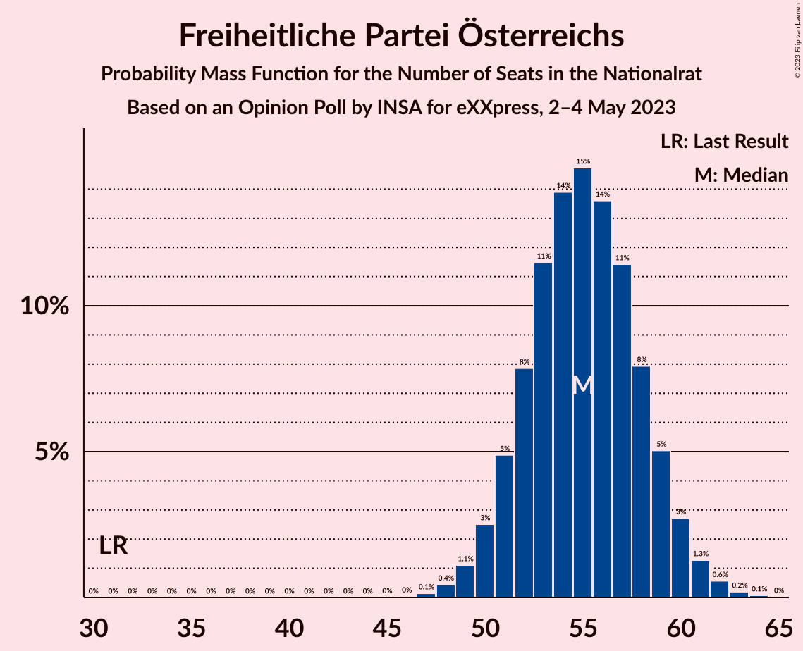

| Number of Seats | Probability | Accumulated | Special Marks |
|:---------------:|:-----------:|:-----------:|:-------------:|
| 31 | 0% | 100% | Last Result |
| 32 | 0% | 100% |  |
| 33 | 0% | 100% |  |
| 34 | 0% | 100% |  |
| 35 | 0% | 100% |  |
| 36 | 0% | 100% |  |
| 37 | 0% | 100% |  |
| 38 | 0% | 100% |  |
| 39 | 0% | 100% |  |
| 40 | 0% | 100% |  |
| 41 | 0% | 100% |  |
| 42 | 0% | 100% |  |
| 43 | 0% | 100% |  |
| 44 | 0% | 100% |  |
| 45 | 0% | 100% |  |
| 46 | 0% | 100% |  |
| 47 | 0.1% | 100% |  |
| 48 | 0.4% | 99.8% |  |
| 49 | 1.1% | 99.4% |  |
| 50 | 3% | 98% |  |
| 51 | 5% | 96% |  |
| 52 | 8% | 91% |  |
| 53 | 11% | 83% |  |
| 54 | 14% | 72% |  |
| 55 | 15% | 58% | Median |
| 56 | 14% | 43% |  |
| 57 | 11% | 29% |  |
| 58 | 8% | 18% |  |
| 59 | 5% | 10% |  |
| 60 | 3% | 5% |  |
| 61 | 1.3% | 2% |  |
| 62 | 0.6% | 0.9% |  |
| 63 | 0.2% | 0.3% |  |
| 64 | 0.1% | 0.1% |  |
| 65 | 0% | 0% |  |

### Österreichische Volkspartei

*For a full overview of the results for this party, see the [Österreichische Volkspartei](party-österreichischevolkspartei.html) page.*

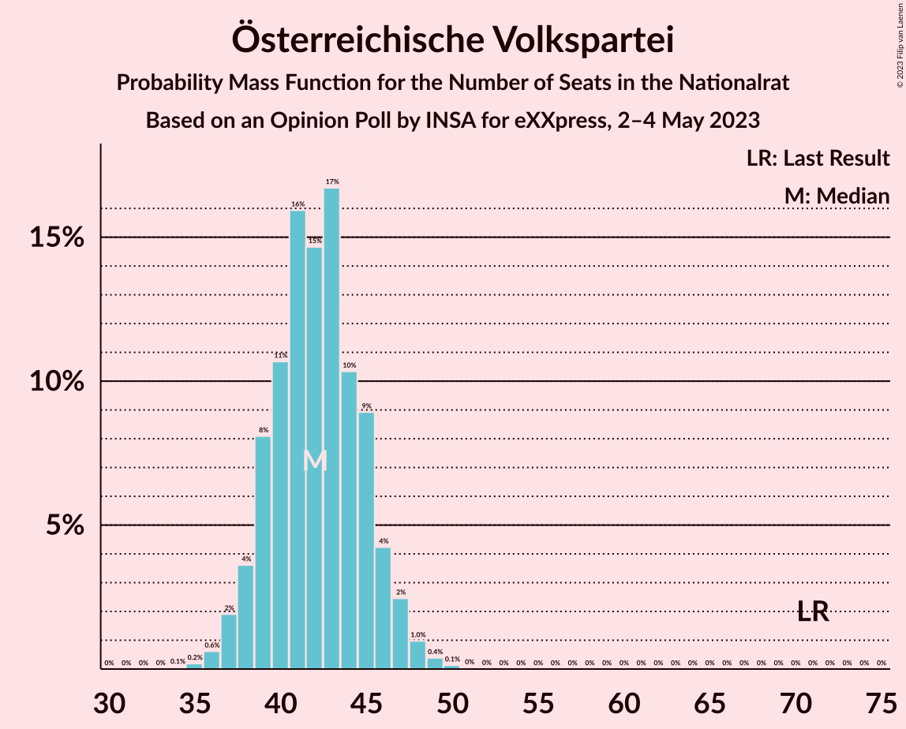

| Number of Seats | Probability | Accumulated | Special Marks |
|:---------------:|:-----------:|:-----------:|:-------------:|
| 34 | 0.1% | 100% |  |
| 35 | 0.2% | 99.9% |  |
| 36 | 0.6% | 99.7% |  |
| 37 | 2% | 99.1% |  |
| 38 | 4% | 97% |  |
| 39 | 8% | 94% |  |
| 40 | 11% | 86% |  |
| 41 | 16% | 75% |  |
| 42 | 15% | 59% | Median |
| 43 | 17% | 44% |  |
| 44 | 10% | 28% |  |
| 45 | 9% | 17% |  |
| 46 | 4% | 8% |  |
| 47 | 2% | 4% |  |
| 48 | 1.0% | 2% |  |
| 49 | 0.4% | 0.6% |  |
| 50 | 0.1% | 0.2% |  |
| 51 | 0% | 0.1% |  |
| 52 | 0% | 0% |  |
| 53 | 0% | 0% |  |
| 54 | 0% | 0% |  |
| 55 | 0% | 0% |  |
| 56 | 0% | 0% |  |
| 57 | 0% | 0% |  |
| 58 | 0% | 0% |  |
| 59 | 0% | 0% |  |
| 60 | 0% | 0% |  |
| 61 | 0% | 0% |  |
| 62 | 0% | 0% |  |
| 63 | 0% | 0% |  |
| 64 | 0% | 0% |  |
| 65 | 0% | 0% |  |
| 66 | 0% | 0% |  |
| 67 | 0% | 0% |  |
| 68 | 0% | 0% |  |
| 69 | 0% | 0% |  |
| 70 | 0% | 0% |  |
| 71 | 0% | 0% | Last Result |

### Sozialdemokratische Partei Österreichs

*For a full overview of the results for this party, see the [Sozialdemokratische Partei Österreichs](party-sozialdemokratischeparteiösterreichs.html) page.*

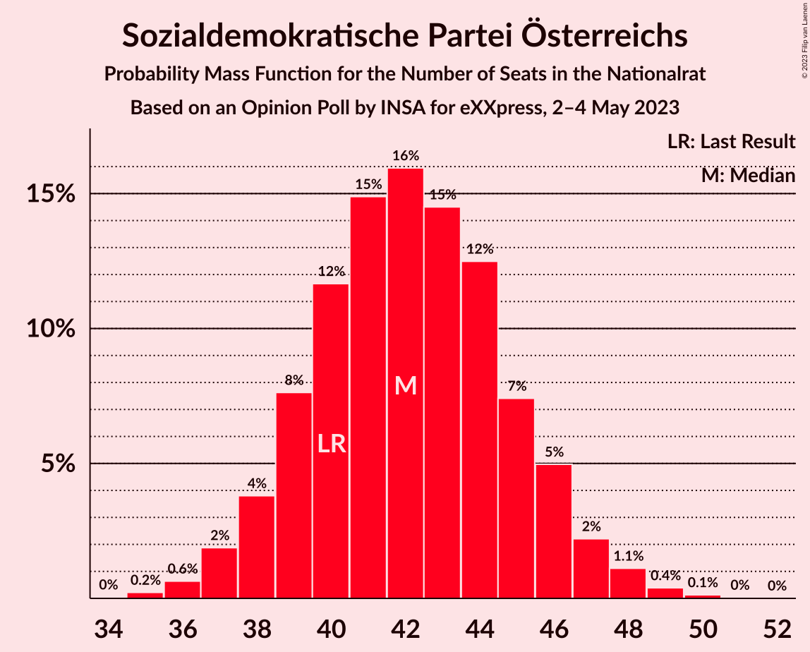

| Number of Seats | Probability | Accumulated | Special Marks |
|:---------------:|:-----------:|:-----------:|:-------------:|
| 34 | 0% | 100% |  |
| 35 | 0.2% | 99.9% |  |
| 36 | 0.6% | 99.7% |  |
| 37 | 2% | 99.1% |  |
| 38 | 4% | 97% |  |
| 39 | 8% | 93% |  |
| 40 | 12% | 86% | Last Result |
| 41 | 15% | 74% |  |
| 42 | 16% | 59% | Median |
| 43 | 15% | 43% |  |
| 44 | 12% | 29% |  |
| 45 | 7% | 16% |  |
| 46 | 5% | 9% |  |
| 47 | 2% | 4% |  |
| 48 | 1.1% | 2% |  |
| 49 | 0.4% | 0.6% |  |
| 50 | 0.1% | 0.2% |  |
| 51 | 0% | 0% |  |

### NEOS–Das Neue Österreich und Liberales Forum

*For a full overview of the results for this party, see the [NEOS–Das Neue Österreich und Liberales Forum](party-neos–dasneueösterreichundliberalesforum.html) page.*

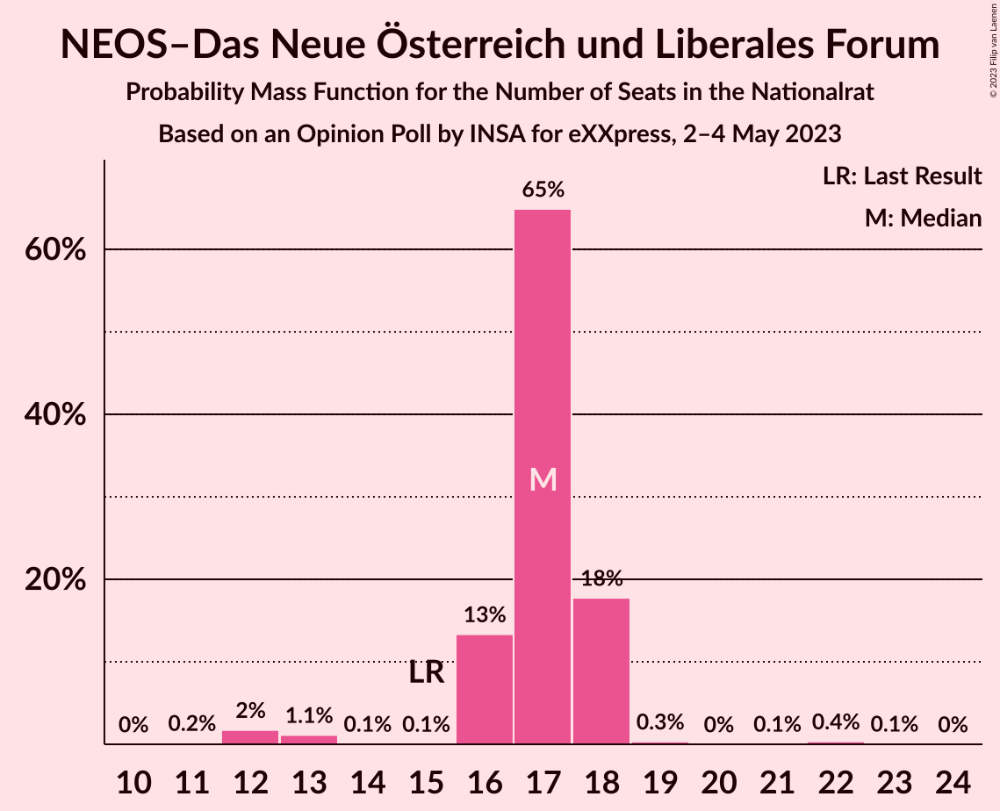

| Number of Seats | Probability | Accumulated | Special Marks |
|:---------------:|:-----------:|:-----------:|:-------------:|
| 11 | 0.2% | 100% |  |
| 12 | 2% | 99.8% |  |
| 13 | 1.1% | 98% |  |
| 14 | 0.1% | 97% |  |
| 15 | 0.1% | 97% | Last Result |
| 16 | 13% | 97% |  |
| 17 | 65% | 84% | Median |
| 18 | 18% | 19% |  |
| 19 | 0.3% | 0.8% |  |
| 20 | 0% | 0.5% |  |
| 21 | 0.1% | 0.5% |  |
| 22 | 0.4% | 0.4% |  |
| 23 | 0.1% | 0.1% |  |
| 24 | 0% | 0% |  |

### Die Grünen–Die Grüne Alternative

*For a full overview of the results for this party, see the [Die Grünen–Die Grüne Alternative](party-diegrünen–diegrünealternative.html) page.*

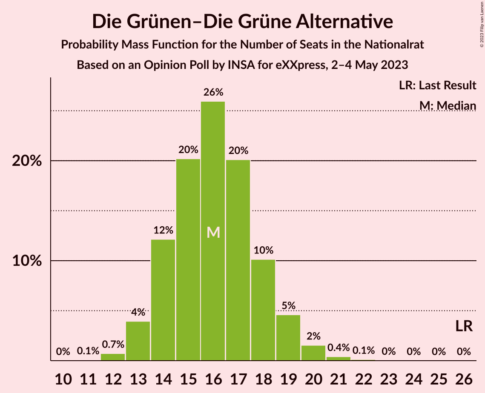

| Number of Seats | Probability | Accumulated | Special Marks |
|:---------------:|:-----------:|:-----------:|:-------------:|
| 11 | 0.1% | 100% |  |
| 12 | 0.7% | 99.9% |  |
| 13 | 4% | 99.2% |  |
| 14 | 12% | 95% |  |
| 15 | 20% | 83% |  |
| 16 | 26% | 63% | Median |
| 17 | 20% | 37% |  |
| 18 | 10% | 17% |  |
| 19 | 5% | 7% |  |
| 20 | 2% | 2% |  |
| 21 | 0.4% | 0.6% |  |
| 22 | 0.1% | 0.2% |  |
| 23 | 0% | 0% |  |
| 24 | 0% | 0% |  |
| 25 | 0% | 0% |  |
| 26 | 0% | 0% | Last Result |

## Coalitions

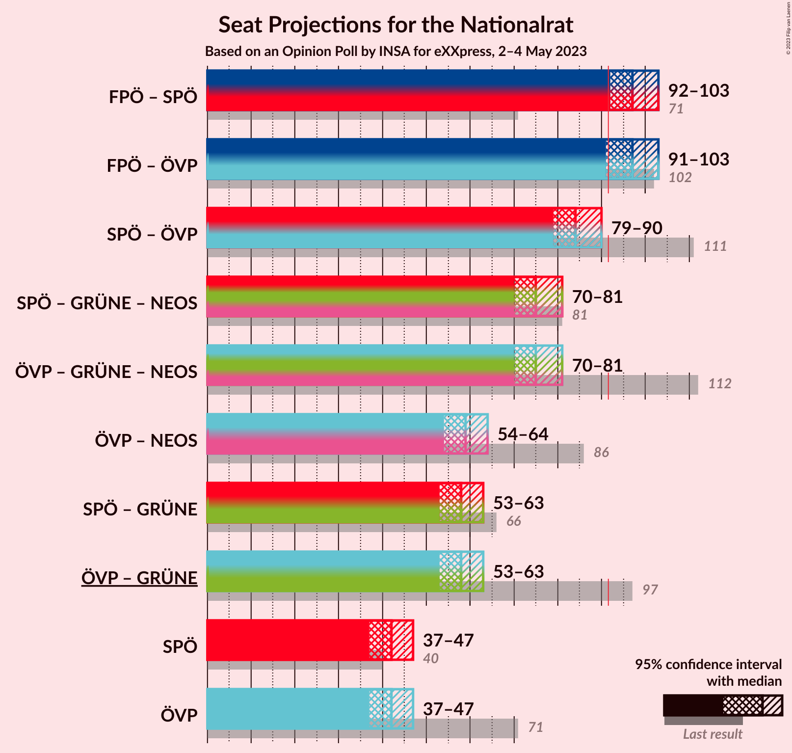

### Confidence Intervals

| Coalition | Last Result | Median | Majority? | 80% Confidence Interval | 90% Confidence Interval | 95% Confidence Interval | 99% Confidence Interval |
|:---------:|:-----------:|:------:|:---------:|:-----------------------:|:-----------------------:|:-----------------------:|:-----------------------:|
| Freiheitliche Partei Österreichs – Sozialdemokratische Partei Österreichs | 71 | 97 | 98% | 93–101 | 92–102 | 92–103 | 90–105 |
| Freiheitliche Partei Österreichs – Österreichische Volkspartei | 102 | 97 | 97% | 93–101 | 92–102 | 91–103 | 90–105 |
| Sozialdemokratische Partei Österreichs – Österreichische Volkspartei | 111 | 84 | 0.5% | 81–88 | 79–89 | 79–90 | 77–92 |
| Sozialdemokratische Partei Österreichs – Die Grünen–Die Grüne Alternative – NEOS–Das Neue Österreich und Liberales Forum | 81 | 75 | 0% | 71–79 | 70–80 | 70–81 | 68–82 |
| Österreichische Volkspartei – Die Grünen–Die Grüne Alternative – NEOS–Das Neue Österreich und Liberales Forum | 112 | 75 | 0% | 72–79 | 70–80 | 70–81 | 68–82 |
| Österreichische Volkspartei – NEOS–Das Neue Österreich und Liberales Forum | 86 | 59 | 0% | 56–62 | 55–63 | 54–64 | 52–66 |
| Sozialdemokratische Partei Österreichs – Die Grünen–Die Grüne Alternative | 66 | 58 | 0% | 55–62 | 54–63 | 53–63 | 52–65 |
| Österreichische Volkspartei – Die Grünen–Die Grüne Alternative | 97 | 58 | 0% | 55–62 | 54–63 | 53–63 | 52–65 |
| Sozialdemokratische Partei Österreichs | 40 | 42 | 0% | 39–45 | 38–46 | 37–47 | 36–49 |
| Österreichische Volkspartei | 71 | 42 | 0% | 39–45 | 38–46 | 37–47 | 36–49 |

### Freiheitliche Partei Österreichs – Sozialdemokratische Partei Österreichs

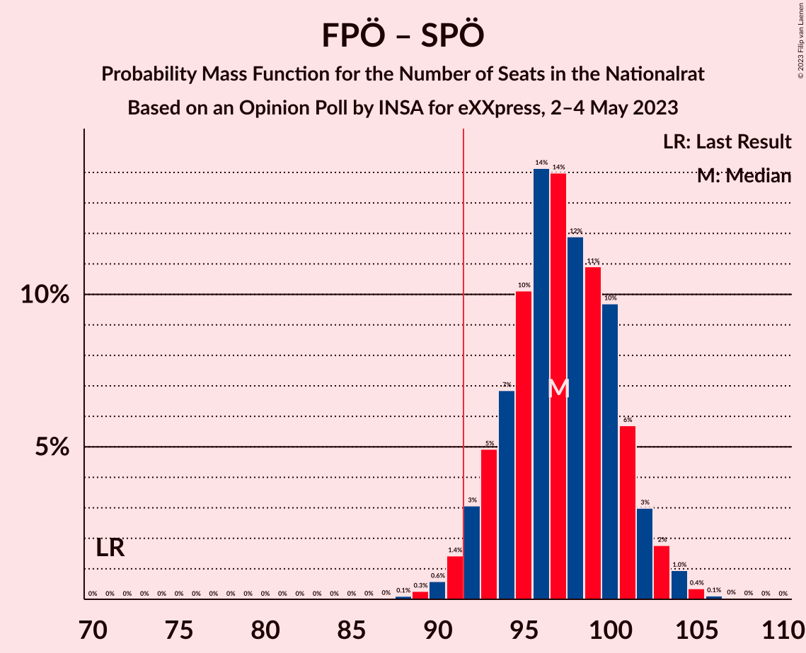

| Number of Seats | Probability | Accumulated | Special Marks |
|:---------------:|:-----------:|:-----------:|:-------------:|
| 71 | 0% | 100% | Last Result |
| 72 | 0% | 100% |  |
| 73 | 0% | 100% |  |
| 74 | 0% | 100% |  |
| 75 | 0% | 100% |  |
| 76 | 0% | 100% |  |
| 77 | 0% | 100% |  |
| 78 | 0% | 100% |  |
| 79 | 0% | 100% |  |
| 80 | 0% | 100% |  |
| 81 | 0% | 100% |  |
| 82 | 0% | 100% |  |
| 83 | 0% | 100% |  |
| 84 | 0% | 100% |  |
| 85 | 0% | 100% |  |
| 86 | 0% | 100% |  |
| 87 | 0% | 100% |  |
| 88 | 0.1% | 100% |  |
| 89 | 0.3% | 99.9% |  |
| 90 | 0.6% | 99.6% |  |
| 91 | 1.4% | 99.0% |  |
| 92 | 3% | 98% | Majority |
| 93 | 5% | 94% |  |
| 94 | 7% | 90% |  |
| 95 | 10% | 83% |  |
| 96 | 14% | 73% |  |
| 97 | 14% | 58% | Median |
| 98 | 12% | 44% |  |
| 99 | 11% | 33% |  |
| 100 | 10% | 22% |  |
| 101 | 6% | 12% |  |
| 102 | 3% | 6% |  |
| 103 | 2% | 3% |  |
| 104 | 1.0% | 1.5% |  |
| 105 | 0.4% | 0.5% |  |
| 106 | 0.1% | 0.2% |  |
| 107 | 0% | 0.1% |  |
| 108 | 0% | 0% |  |

### Freiheitliche Partei Österreichs – Österreichische Volkspartei

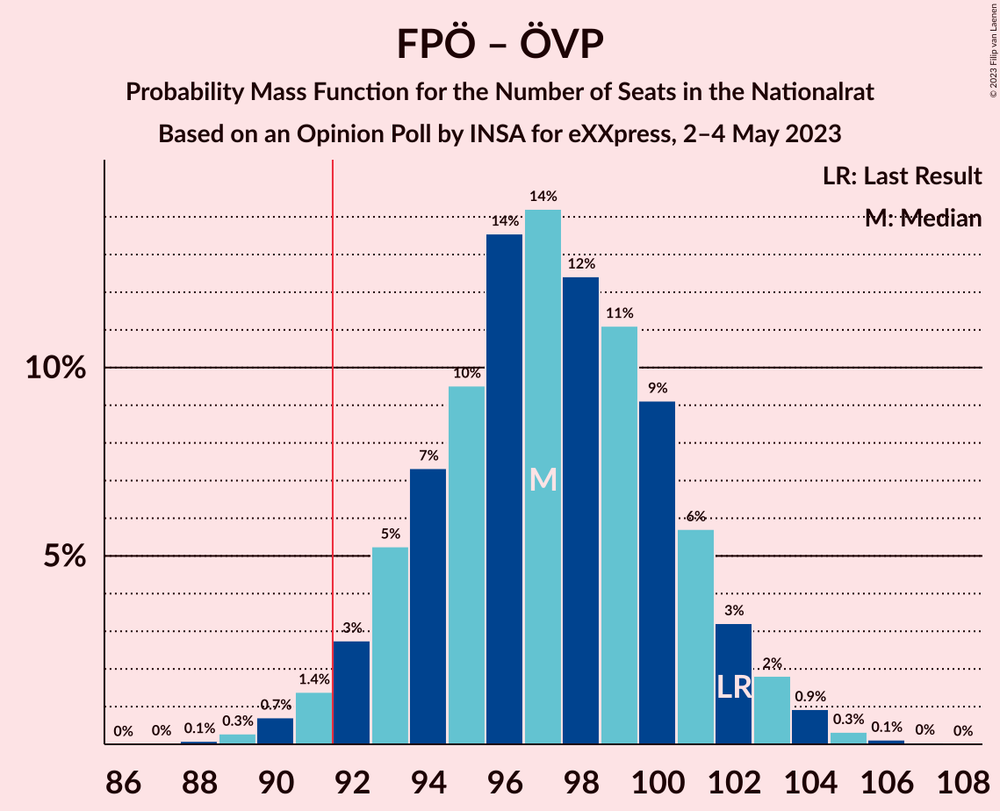

| Number of Seats | Probability | Accumulated | Special Marks |
|:---------------:|:-----------:|:-----------:|:-------------:|
| 88 | 0.1% | 100% |  |
| 89 | 0.3% | 99.9% |  |
| 90 | 0.7% | 99.6% |  |
| 91 | 1.4% | 98.9% |  |
| 92 | 3% | 97% | Majority |
| 93 | 5% | 95% |  |
| 94 | 7% | 89% |  |
| 95 | 10% | 82% |  |
| 96 | 14% | 73% |  |
| 97 | 14% | 59% | Median |
| 98 | 12% | 45% |  |
| 99 | 11% | 32% |  |
| 100 | 9% | 21% |  |
| 101 | 6% | 12% |  |
| 102 | 3% | 6% | Last Result |
| 103 | 2% | 3% |  |
| 104 | 0.9% | 1.5% |  |
| 105 | 0.3% | 0.5% |  |
| 106 | 0.1% | 0.2% |  |
| 107 | 0% | 0.1% |  |
| 108 | 0% | 0% |  |

### Sozialdemokratische Partei Österreichs – Österreichische Volkspartei

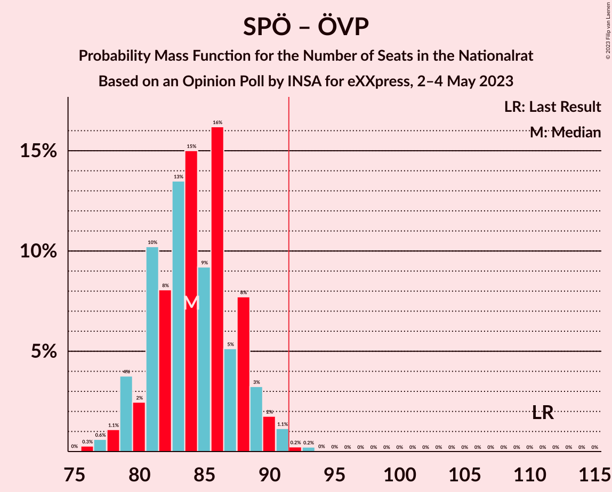

| Number of Seats | Probability | Accumulated | Special Marks |
|:---------------:|:-----------:|:-----------:|:-------------:|
| 75 | 0% | 100% |  |
| 76 | 0.3% | 99.9% |  |
| 77 | 0.6% | 99.6% |  |
| 78 | 1.1% | 99.0% |  |
| 79 | 4% | 98% |  |
| 80 | 2% | 94% |  |
| 81 | 10% | 92% |  |
| 82 | 8% | 81% |  |
| 83 | 13% | 73% |  |
| 84 | 15% | 60% | Median |
| 85 | 9% | 45% |  |
| 86 | 16% | 36% |  |
| 87 | 5% | 20% |  |
| 88 | 8% | 14% |  |
| 89 | 3% | 7% |  |
| 90 | 2% | 3% |  |
| 91 | 1.1% | 2% |  |
| 92 | 0.2% | 0.5% | Majority |
| 93 | 0.2% | 0.3% |  |
| 94 | 0% | 0.1% |  |
| 95 | 0% | 0% |  |
| 96 | 0% | 0% |  |
| 97 | 0% | 0% |  |
| 98 | 0% | 0% |  |
| 99 | 0% | 0% |  |
| 100 | 0% | 0% |  |
| 101 | 0% | 0% |  |
| 102 | 0% | 0% |  |
| 103 | 0% | 0% |  |
| 104 | 0% | 0% |  |
| 105 | 0% | 0% |  |
| 106 | 0% | 0% |  |
| 107 | 0% | 0% |  |
| 108 | 0% | 0% |  |
| 109 | 0% | 0% |  |
| 110 | 0% | 0% |  |
| 111 | 0% | 0% | Last Result |

### Sozialdemokratische Partei Österreichs – Die Grünen–Die Grüne Alternative – NEOS–Das Neue Österreich und Liberales Forum

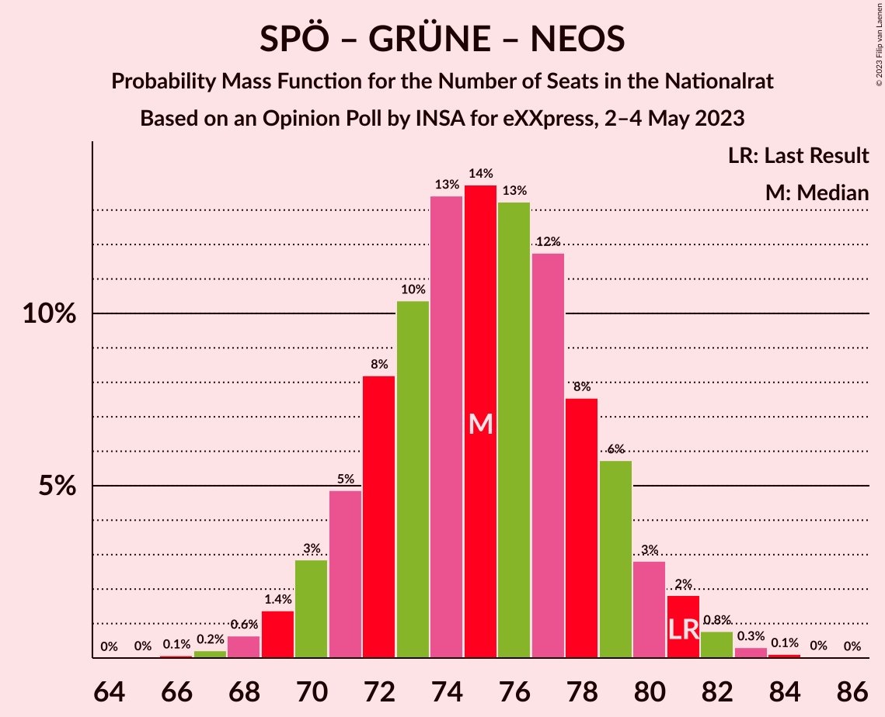

| Number of Seats | Probability | Accumulated | Special Marks |
|:---------------:|:-----------:|:-----------:|:-------------:|
| 66 | 0.1% | 100% |  |
| 67 | 0.2% | 99.9% |  |
| 68 | 0.6% | 99.7% |  |
| 69 | 1.4% | 99.0% |  |
| 70 | 3% | 98% |  |
| 71 | 5% | 95% |  |
| 72 | 8% | 90% |  |
| 73 | 10% | 82% |  |
| 74 | 13% | 71% |  |
| 75 | 14% | 58% | Median |
| 76 | 13% | 44% |  |
| 77 | 12% | 31% |  |
| 78 | 8% | 19% |  |
| 79 | 6% | 12% |  |
| 80 | 3% | 6% |  |
| 81 | 2% | 3% | Last Result |
| 82 | 0.8% | 1.3% |  |
| 83 | 0.3% | 0.5% |  |
| 84 | 0.1% | 0.2% |  |
| 85 | 0% | 0.1% |  |
| 86 | 0% | 0% |  |

### Österreichische Volkspartei – Die Grünen–Die Grüne Alternative – NEOS–Das Neue Österreich und Liberales Forum

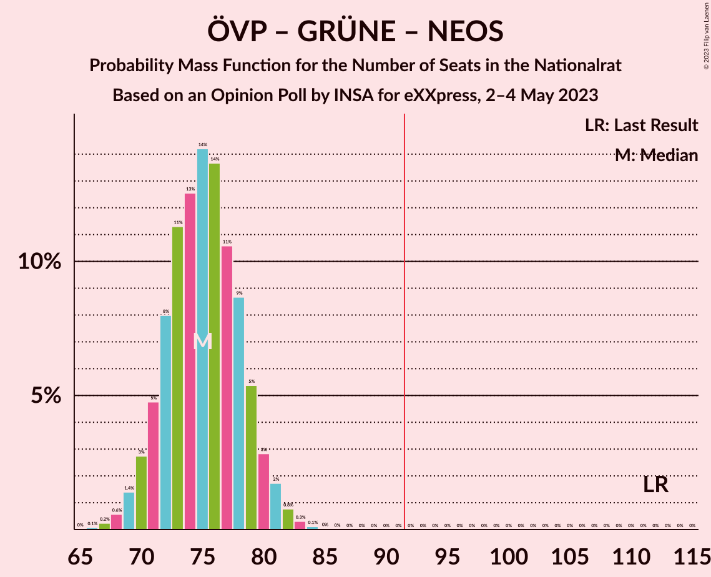

| Number of Seats | Probability | Accumulated | Special Marks |
|:---------------:|:-----------:|:-----------:|:-------------:|
| 66 | 0.1% | 100% |  |
| 67 | 0.2% | 99.9% |  |
| 68 | 0.6% | 99.7% |  |
| 69 | 1.4% | 99.1% |  |
| 70 | 3% | 98% |  |
| 71 | 5% | 95% |  |
| 72 | 8% | 90% |  |
| 73 | 11% | 82% |  |
| 74 | 13% | 71% |  |
| 75 | 14% | 58% | Median |
| 76 | 14% | 44% |  |
| 77 | 11% | 30% |  |
| 78 | 9% | 20% |  |
| 79 | 5% | 11% |  |
| 80 | 3% | 6% |  |
| 81 | 2% | 3% |  |
| 82 | 0.8% | 1.3% |  |
| 83 | 0.3% | 0.5% |  |
| 84 | 0.1% | 0.2% |  |
| 85 | 0% | 0.1% |  |
| 86 | 0% | 0% |  |
| 87 | 0% | 0% |  |
| 88 | 0% | 0% |  |
| 89 | 0% | 0% |  |
| 90 | 0% | 0% |  |
| 91 | 0% | 0% |  |
| 92 | 0% | 0% | Majority |
| 93 | 0% | 0% |  |
| 94 | 0% | 0% |  |
| 95 | 0% | 0% |  |
| 96 | 0% | 0% |  |
| 97 | 0% | 0% |  |
| 98 | 0% | 0% |  |
| 99 | 0% | 0% |  |
| 100 | 0% | 0% |  |
| 101 | 0% | 0% |  |
| 102 | 0% | 0% |  |
| 103 | 0% | 0% |  |
| 104 | 0% | 0% |  |
| 105 | 0% | 0% |  |
| 106 | 0% | 0% |  |
| 107 | 0% | 0% |  |
| 108 | 0% | 0% |  |
| 109 | 0% | 0% |  |
| 110 | 0% | 0% |  |
| 111 | 0% | 0% |  |
| 112 | 0% | 0% | Last Result |

### Österreichische Volkspartei – NEOS–Das Neue Österreich und Liberales Forum

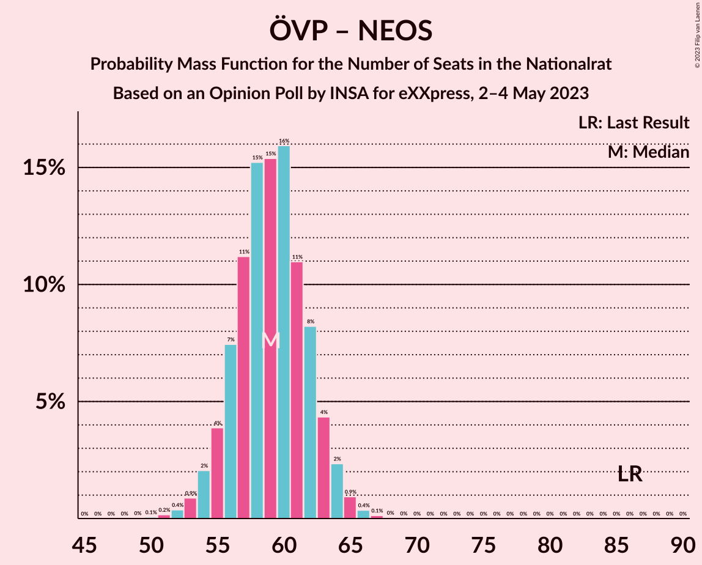

| Number of Seats | Probability | Accumulated | Special Marks |
|:---------------:|:-----------:|:-----------:|:-------------:|
| 50 | 0.1% | 100% |  |
| 51 | 0.2% | 99.9% |  |
| 52 | 0.4% | 99.7% |  |
| 53 | 0.9% | 99.4% |  |
| 54 | 2% | 98% |  |
| 55 | 4% | 96% |  |
| 56 | 7% | 93% |  |
| 57 | 11% | 85% |  |
| 58 | 15% | 74% |  |
| 59 | 15% | 59% | Median |
| 60 | 16% | 43% |  |
| 61 | 11% | 27% |  |
| 62 | 8% | 16% |  |
| 63 | 4% | 8% |  |
| 64 | 2% | 4% |  |
| 65 | 0.9% | 1.5% |  |
| 66 | 0.4% | 0.5% |  |
| 67 | 0.1% | 0.2% |  |
| 68 | 0% | 0.1% |  |
| 69 | 0% | 0% |  |
| 70 | 0% | 0% |  |
| 71 | 0% | 0% |  |
| 72 | 0% | 0% |  |
| 73 | 0% | 0% |  |
| 74 | 0% | 0% |  |
| 75 | 0% | 0% |  |
| 76 | 0% | 0% |  |
| 77 | 0% | 0% |  |
| 78 | 0% | 0% |  |
| 79 | 0% | 0% |  |
| 80 | 0% | 0% |  |
| 81 | 0% | 0% |  |
| 82 | 0% | 0% |  |
| 83 | 0% | 0% |  |
| 84 | 0% | 0% |  |
| 85 | 0% | 0% |  |
| 86 | 0% | 0% | Last Result |

### Sozialdemokratische Partei Österreichs – Die Grünen–Die Grüne Alternative

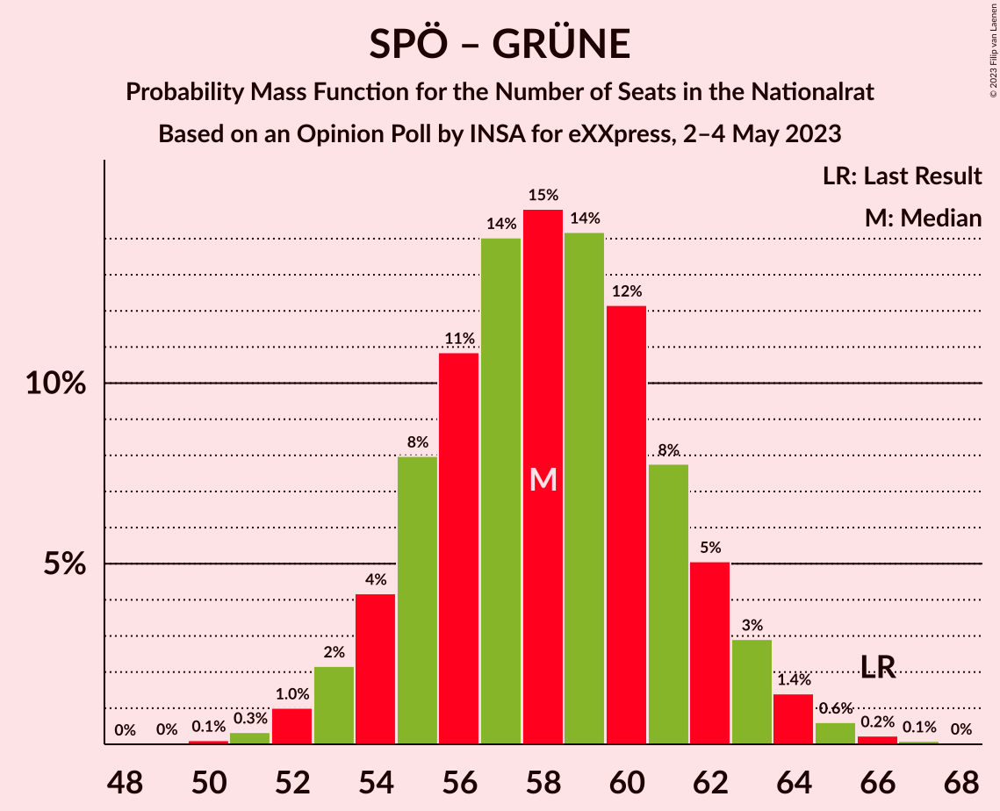

| Number of Seats | Probability | Accumulated | Special Marks |
|:---------------:|:-----------:|:-----------:|:-------------:|
| 50 | 0.1% | 100% |  |
| 51 | 0.3% | 99.9% |  |
| 52 | 1.0% | 99.5% |  |
| 53 | 2% | 98.5% |  |
| 54 | 4% | 96% |  |
| 55 | 8% | 92% |  |
| 56 | 11% | 84% |  |
| 57 | 14% | 73% |  |
| 58 | 15% | 59% | Median |
| 59 | 14% | 44% |  |
| 60 | 12% | 30% |  |
| 61 | 8% | 18% |  |
| 62 | 5% | 10% |  |
| 63 | 3% | 5% |  |
| 64 | 1.4% | 2% |  |
| 65 | 0.6% | 1.0% |  |
| 66 | 0.2% | 0.4% | Last Result |
| 67 | 0.1% | 0.1% |  |
| 68 | 0% | 0% |  |

### Österreichische Volkspartei – Die Grünen–Die Grüne Alternative

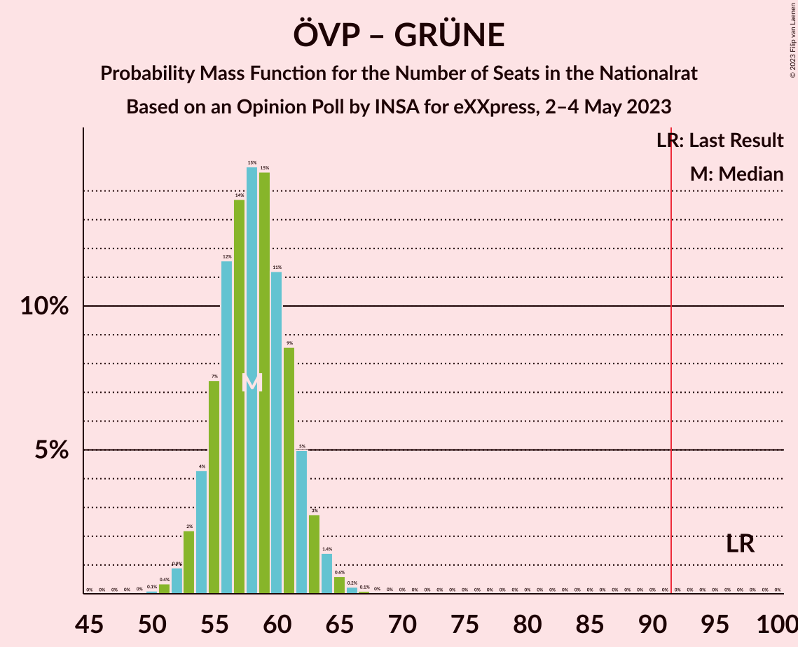

| Number of Seats | Probability | Accumulated | Special Marks |
|:---------------:|:-----------:|:-----------:|:-------------:|
| 50 | 0.1% | 100% |  |
| 51 | 0.4% | 99.9% |  |
| 52 | 0.9% | 99.5% |  |
| 53 | 2% | 98.6% |  |
| 54 | 4% | 96% |  |
| 55 | 7% | 92% |  |
| 56 | 12% | 85% |  |
| 57 | 14% | 73% |  |
| 58 | 15% | 59% | Median |
| 59 | 15% | 45% |  |
| 60 | 11% | 30% |  |
| 61 | 9% | 19% |  |
| 62 | 5% | 10% |  |
| 63 | 3% | 5% |  |
| 64 | 1.4% | 2% |  |
| 65 | 0.6% | 1.0% |  |
| 66 | 0.2% | 0.4% |  |
| 67 | 0.1% | 0.1% |  |
| 68 | 0% | 0% |  |
| 69 | 0% | 0% |  |
| 70 | 0% | 0% |  |
| 71 | 0% | 0% |  |
| 72 | 0% | 0% |  |
| 73 | 0% | 0% |  |
| 74 | 0% | 0% |  |
| 75 | 0% | 0% |  |
| 76 | 0% | 0% |  |
| 77 | 0% | 0% |  |
| 78 | 0% | 0% |  |
| 79 | 0% | 0% |  |
| 80 | 0% | 0% |  |
| 81 | 0% | 0% |  |
| 82 | 0% | 0% |  |
| 83 | 0% | 0% |  |
| 84 | 0% | 0% |  |
| 85 | 0% | 0% |  |
| 86 | 0% | 0% |  |
| 87 | 0% | 0% |  |
| 88 | 0% | 0% |  |
| 89 | 0% | 0% |  |
| 90 | 0% | 0% |  |
| 91 | 0% | 0% |  |
| 92 | 0% | 0% | Majority |
| 93 | 0% | 0% |  |
| 94 | 0% | 0% |  |
| 95 | 0% | 0% |  |
| 96 | 0% | 0% |  |
| 97 | 0% | 0% | Last Result |

### Sozialdemokratische Partei Österreichs

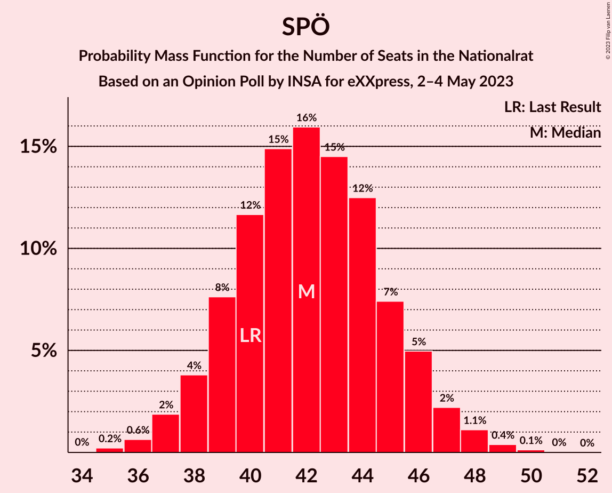

| Number of Seats | Probability | Accumulated | Special Marks |
|:---------------:|:-----------:|:-----------:|:-------------:|
| 34 | 0% | 100% |  |
| 35 | 0.2% | 99.9% |  |
| 36 | 0.6% | 99.7% |  |
| 37 | 2% | 99.1% |  |
| 38 | 4% | 97% |  |
| 39 | 8% | 93% |  |
| 40 | 12% | 86% | Last Result |
| 41 | 15% | 74% |  |
| 42 | 16% | 59% | Median |
| 43 | 15% | 43% |  |
| 44 | 12% | 29% |  |
| 45 | 7% | 16% |  |
| 46 | 5% | 9% |  |
| 47 | 2% | 4% |  |
| 48 | 1.1% | 2% |  |
| 49 | 0.4% | 0.6% |  |
| 50 | 0.1% | 0.2% |  |
| 51 | 0% | 0% |  |

### Österreichische Volkspartei

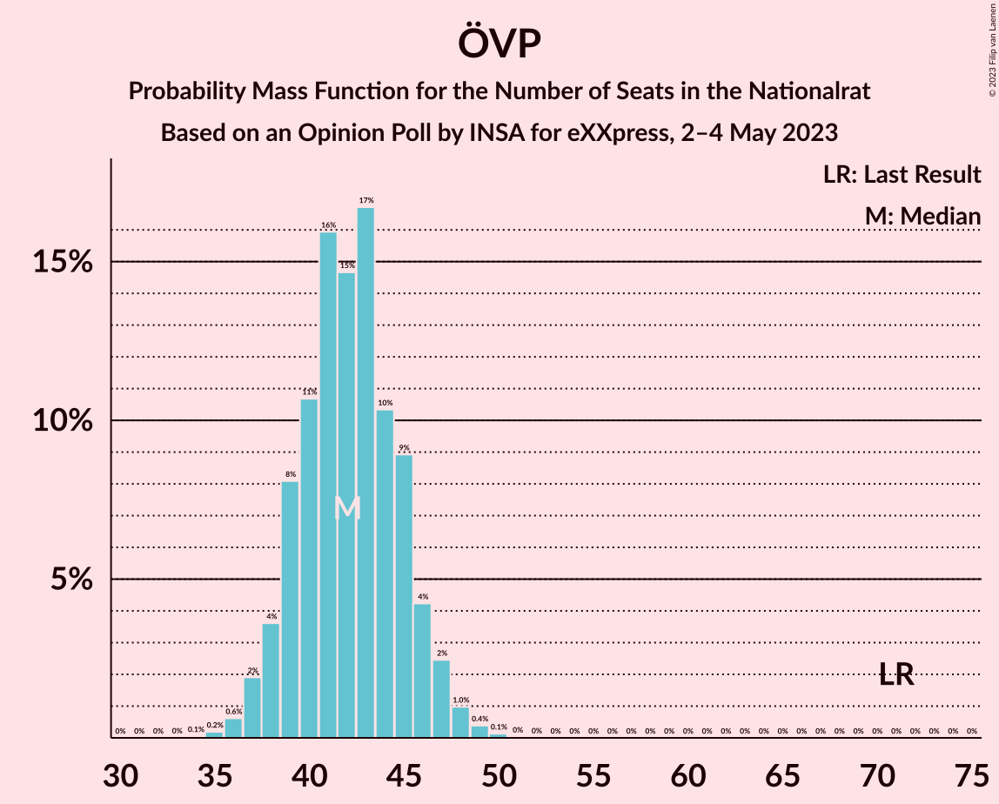

| Number of Seats | Probability | Accumulated | Special Marks |
|:---------------:|:-----------:|:-----------:|:-------------:|
| 34 | 0.1% | 100% |  |
| 35 | 0.2% | 99.9% |  |
| 36 | 0.6% | 99.7% |  |
| 37 | 2% | 99.1% |  |
| 38 | 4% | 97% |  |
| 39 | 8% | 94% |  |
| 40 | 11% | 86% |  |
| 41 | 16% | 75% |  |
| 42 | 15% | 59% | Median |
| 43 | 17% | 44% |  |
| 44 | 10% | 28% |  |
| 45 | 9% | 17% |  |
| 46 | 4% | 8% |  |
| 47 | 2% | 4% |  |
| 48 | 1.0% | 2% |  |
| 49 | 0.4% | 0.6% |  |
| 50 | 0.1% | 0.2% |  |
| 51 | 0% | 0.1% |  |
| 52 | 0% | 0% |  |
| 53 | 0% | 0% |  |
| 54 | 0% | 0% |  |
| 55 | 0% | 0% |  |
| 56 | 0% | 0% |  |
| 57 | 0% | 0% |  |
| 58 | 0% | 0% |  |
| 59 | 0% | 0% |  |
| 60 | 0% | 0% |  |
| 61 | 0% | 0% |  |
| 62 | 0% | 0% |  |
| 63 | 0% | 0% |  |
| 64 | 0% | 0% |  |
| 65 | 0% | 0% |  |
| 66 | 0% | 0% |  |
| 67 | 0% | 0% |  |
| 68 | 0% | 0% |  |
| 69 | 0% | 0% |  |
| 70 | 0% | 0% |  |
| 71 | 0% | 0% | Last Result |

## Technical Information

### Opinion Poll

+ **Polling firm:** INSA
+ **Commissioner(s):** eXXpress
+ **Fieldwork period:** 2–4 May 2023

### Calculations

+ **Sample size:** 1000
+ **Simulations done:** 1,048,576
+ **Error estimate:** 0.53%

