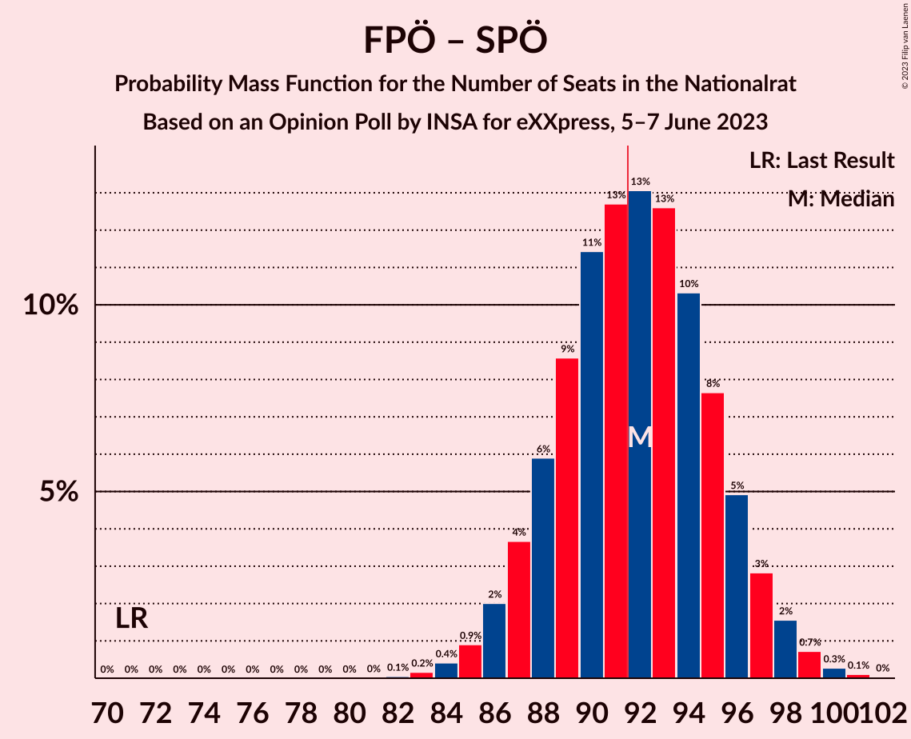

# Opinion Poll by INSA for eXXpress, 5–7 June 2023

<a href="#voting-intentions">Voting Intentions</a> | <a href="#seats">Seats</a> | <a href="#coalitions">Coalitions</a> | <a href="#technical-information">Technical Information</a>

## Voting Intentions

### Confidence Intervals

| Party | Last Result | Poll Result | 80% Confidence Interval | 90% Confidence Interval | 95% Confidence Interval | 99% Confidence Interval |
|:-----:|:-----------:|:-----------:|:-----------------------:|:-----------------------:|:-----------------------:|:-----------------------:|
| Freiheitliche Partei Österreichs | 16.2% | 30.0% | 28.2–31.9% |27.7–32.4% |27.2–32.9% |26.4–33.9% |
| Österreichische Volkspartei | 37.5% | 24.0% | 22.3–25.8% |21.9–26.3% |21.4–26.7% |20.7–27.6% |
| Sozialdemokratische Partei Österreichs | 21.2% | 20.0% | 18.4–21.7% |18.0–22.2% |17.6–22.6% |16.9–23.4% |
| Die Grünen–Die Grüne Alternative | 13.9% | 10.0% | 8.9–11.3% |8.6–11.7% |8.3–12.0% |7.8–12.7% |
| NEOS–Das Neue Österreich und Liberales Forum | 8.1% | 9.0% | 7.9–10.3% |7.6–10.6% |7.4–10.9% |6.9–11.6% |

*Note:* The poll result column reflects the actual value used in the calculations. Published results may vary slightly, and in addition be rounded to fewer digits.

## Seats

### Confidence Intervals

| Party | Last Result | Median | 80% Confidence Interval | 90% Confidence Interval | 95% Confidence Interval | 99% Confidence Interval |
|:-----:|:-----------:|:------:|:-----------------------:|:-----------------------:|:-----------------------:|:-----------------------:|
| <a href="#freiheitliche-partei-österreichs">Freiheitliche Partei Österreichs</a> | 31 | 55 | 52–59 |51–60 |50–61 |48–62 |
| <a href="#österreichische-volkspartei">Österreichische Volkspartei</a> | 71 | 44 | 41–47 |40–48 |39–49 |38–51 |
| <a href="#sozialdemokratische-partei-österreichs">Sozialdemokratische Partei Österreichs</a> | 40 | 37 | 34–40 |33–41 |32–41 |31–43 |
| <a href="#die-grünen–die-grüne-alternative">Die Grünen–Die Grüne Alternative</a> | 26 | 18 | 16–20 |15–21 |15–22 |14–23 |
| <a href="#neos–das-neue-österreich-und-liberales-forum">NEOS–Das Neue Österreich und Liberales Forum</a> | 15 | 16 | 14–19 |14–19 |13–20 |12–21 |

### Freiheitliche Partei Österreichs

*For a full overview of the results for this party, see the [Freiheitliche Partei Österreichs](party-freiheitlicheparteiösterreichs.html) page.*

| Number of Seats | Probability | Accumulated | Special Marks |
|:---------------:|:-----------:|:-----------:|:-------------:|
| 31 | 0% | 100% | Last Result |
| 32 | 0% | 100% |  |
| 33 | 0% | 100% |  |
| 34 | 0% | 100% |  |
| 35 | 0% | 100% |  |
| 36 | 0% | 100% |  |
| 37 | 0% | 100% |  |
| 38 | 0% | 100% |  |
| 39 | 0% | 100% |  |
| 40 | 0% | 100% |  |
| 41 | 0% | 100% |  |
| 42 | 0% | 100% |  |
| 43 | 0% | 100% |  |
| 44 | 0% | 100% |  |
| 45 | 0% | 100% |  |
| 46 | 0% | 100% |  |
| 47 | 0.1% | 100% |  |
| 48 | 0.4% | 99.8% |  |
| 49 | 1.1% | 99.4% |  |
| 50 | 2% | 98% |  |
| 51 | 4% | 96% |  |
| 52 | 8% | 91% |  |
| 53 | 11% | 83% |  |
| 54 | 13% | 73% |  |
| 55 | 15% | 59% | Median |
| 56 | 14% | 44% |  |
| 57 | 11% | 31% |  |
| 58 | 9% | 19% |  |
| 59 | 5% | 11% |  |
| 60 | 3% | 6% |  |
| 61 | 2% | 3% |  |
| 62 | 0.6% | 1.0% |  |
| 63 | 0.3% | 0.4% |  |
| 64 | 0.1% | 0.1% |  |
| 65 | 0% | 0% |  |

### Österreichische Volkspartei

*For a full overview of the results for this party, see the [Österreichische Volkspartei](party-österreichischevolkspartei.html) page.*

| Number of Seats | Probability | Accumulated | Special Marks |
|:---------------:|:-----------:|:-----------:|:-------------:|
| 36 | 0.1% | 100% |  |
| 37 | 0.3% | 99.9% |  |
| 38 | 0.8% | 99.7% |  |
| 39 | 2% | 98.9% |  |
| 40 | 4% | 97% |  |
| 41 | 8% | 92% |  |
| 42 | 11% | 85% |  |
| 43 | 15% | 73% |  |
| 44 | 15% | 58% | Median |
| 45 | 15% | 43% |  |
| 46 | 12% | 28% |  |
| 47 | 8% | 16% |  |
| 48 | 5% | 9% |  |
| 49 | 2% | 4% |  |
| 50 | 1.0% | 2% |  |
| 51 | 0.4% | 0.6% |  |
| 52 | 0.1% | 0.2% |  |
| 53 | 0% | 0.1% |  |
| 54 | 0% | 0% |  |
| 55 | 0% | 0% |  |
| 56 | 0% | 0% |  |
| 57 | 0% | 0% |  |
| 58 | 0% | 0% |  |
| 59 | 0% | 0% |  |
| 60 | 0% | 0% |  |
| 61 | 0% | 0% |  |
| 62 | 0% | 0% |  |
| 63 | 0% | 0% |  |
| 64 | 0% | 0% |  |
| 65 | 0% | 0% |  |
| 66 | 0% | 0% |  |
| 67 | 0% | 0% |  |
| 68 | 0% | 0% |  |
| 69 | 0% | 0% |  |
| 70 | 0% | 0% |  |
| 71 | 0% | 0% | Last Result |

### Sozialdemokratische Partei Österreichs

*For a full overview of the results for this party, see the [Sozialdemokratische Partei Österreichs](party-sozialdemokratischeparteiösterreichs.html) page.*

| Number of Seats | Probability | Accumulated | Special Marks |
|:---------------:|:-----------:|:-----------:|:-------------:|
| 29 | 0% | 100% |  |
| 30 | 0.3% | 99.9% |  |
| 31 | 0.9% | 99.7% |  |
| 32 | 2% | 98.8% |  |
| 33 | 5% | 97% |  |
| 34 | 10% | 91% |  |
| 35 | 13% | 82% |  |
| 36 | 16% | 69% |  |
| 37 | 18% | 53% | Median |
| 38 | 13% | 35% |  |
| 39 | 10% | 22% |  |
| 40 | 7% | 12% | Last Result |
| 41 | 3% | 5% |  |
| 42 | 1.2% | 2% |  |
| 43 | 0.6% | 0.9% |  |
| 44 | 0.2% | 0.3% |  |
| 45 | 0% | 0.1% |  |
| 46 | 0% | 0% |  |

### Die Grünen–Die Grüne Alternative

*For a full overview of the results for this party, see the [Die Grünen–Die Grüne Alternative](party-diegrünen–diegrünealternative.html) page.*

| Number of Seats | Probability | Accumulated | Special Marks |
|:---------------:|:-----------:|:-----------:|:-------------:|
| 13 | 0.2% | 100% |  |
| 14 | 1.2% | 99.8% |  |
| 15 | 5% | 98.6% |  |
| 16 | 11% | 94% |  |
| 17 | 19% | 83% |  |
| 18 | 22% | 64% | Median |
| 19 | 19% | 41% |  |
| 20 | 12% | 22% |  |
| 21 | 6% | 10% |  |
| 22 | 2% | 3% |  |
| 23 | 0.7% | 1.0% |  |
| 24 | 0.2% | 0.2% |  |
| 25 | 0% | 0% |  |
| 26 | 0% | 0% | Last Result |

### NEOS–Das Neue Österreich und Liberales Forum

*For a full overview of the results for this party, see the [NEOS–Das Neue Österreich und Liberales Forum](party-neos–dasneueösterreichundliberalesforum.html) page.*

| Number of Seats | Probability | Accumulated | Special Marks |
|:---------------:|:-----------:|:-----------:|:-------------:|
| 11 | 0.1% | 100% |  |
| 12 | 0.7% | 99.9% |  |
| 13 | 3% | 99.2% |  |
| 14 | 10% | 96% |  |
| 15 | 18% | 86% | Last Result |
| 16 | 23% | 68% | Median |
| 17 | 21% | 45% |  |
| 18 | 14% | 24% |  |
| 19 | 7% | 10% |  |
| 20 | 3% | 3% |  |
| 21 | 0.7% | 0.9% |  |
| 22 | 0.2% | 0.2% |  |
| 23 | 0% | 0% |  |

## Coalitions

### Confidence Intervals

| Coalition | Last Result | Median | Majority? | 80% Confidence Interval | 90% Confidence Interval | 95% Confidence Interval | 99% Confidence Interval |
|:---------:|:-----------:|:------:|:---------:|:-----------------------:|:-----------------------:|:-----------------------:|:-----------------------:|
| Freiheitliche Partei Österreichs – Österreichische Volkspartei | 102 | 99 | 99.6% | 95–103 | 94–104 | 93–105 | 92–107 |
| Freiheitliche Partei Österreichs – Sozialdemokratische Partei Österreichs | 71 | 92 | 54% | 88–96 | 87–97 | 86–98 | 84–99 |
| Österreichische Volkspartei – Sozialdemokratische Partei Österreichs | 111 | 81 | 0% | 77–84 | 76–86 | 75–86 | 73–88 |
| Österreichische Volkspartei – Die Grünen–Die Grüne Alternative – NEOS–Das Neue Österreich und Liberales Forum | 112 | 79 | 0% | 75–82 | 74–83 | 73–84 | 71–86 |
| Sozialdemokratische Partei Österreichs – Die Grünen–Die Grüne Alternative – NEOS–Das Neue Österreich und Liberales Forum | 81 | 71 | 0% | 68–75 | 66–76 | 66–77 | 64–79 |
| Österreichische Volkspartei – Die Grünen–Die Grüne Alternative | 97 | 62 | 0% | 59–66 | 58–67 | 57–68 | 55–70 |
| Österreichische Volkspartei – NEOS–Das Neue Österreich und Liberales Forum | 86 | 60 | 0% | 57–64 | 56–65 | 55–66 | 53–68 |
| Sozialdemokratische Partei Österreichs – Die Grünen–Die Grüne Alternative | 66 | 55 | 0% | 51–58 | 50–59 | 50–60 | 48–62 |
| Österreichische Volkspartei | 71 | 44 | 0% | 41–47 | 40–48 | 39–49 | 38–51 |
| Sozialdemokratische Partei Österreichs | 40 | 37 | 0% | 34–40 | 33–41 | 32–41 | 31–43 |

### Freiheitliche Partei Österreichs – Österreichische Volkspartei

| Number of Seats | Probability | Accumulated | Special Marks |
|:---------------:|:-----------:|:-----------:|:-------------:|
| 90 | 0.1% | 100% |  |
| 91 | 0.3% | 99.8% |  |
| 92 | 0.7% | 99.6% | Majority |
| 93 | 1.5% | 98.9% |  |
| 94 | 3% | 97% |  |
| 95 | 5% | 94% |  |
| 96 | 7% | 90% |  |
| 97 | 10% | 82% |  |
| 98 | 12% | 72% |  |
| 99 | 13% | 59% | Median |
| 100 | 13% | 46% |  |
| 101 | 12% | 33% |  |
| 102 | 8% | 22% | Last Result |
| 103 | 6% | 13% |  |
| 104 | 3% | 7% |  |
| 105 | 2% | 4% |  |
| 106 | 0.9% | 2% |  |
| 107 | 0.4% | 0.7% |  |
| 108 | 0.2% | 0.2% |  |
| 109 | 0.1% | 0.1% |  |
| 110 | 0% | 0% |  |

### Freiheitliche Partei Österreichs – Sozialdemokratische Partei Österreichs

| Number of Seats | Probability | Accumulated | Special Marks |
|:---------------:|:-----------:|:-----------:|:-------------:|
| 71 | 0% | 100% | Last Result |
| 72 | 0% | 100% |  |
| 73 | 0% | 100% |  |
| 74 | 0% | 100% |  |
| 75 | 0% | 100% |  |
| 76 | 0% | 100% |  |
| 77 | 0% | 100% |  |
| 78 | 0% | 100% |  |
| 79 | 0% | 100% |  |
| 80 | 0% | 100% |  |
| 81 | 0% | 100% |  |
| 82 | 0.1% | 100% |  |
| 83 | 0.2% | 99.9% |  |
| 84 | 0.4% | 99.8% |  |
| 85 | 0.9% | 99.3% |  |
| 86 | 2% | 98% |  |
| 87 | 4% | 96% |  |
| 88 | 6% | 93% |  |
| 89 | 9% | 87% |  |
| 90 | 11% | 78% |  |
| 91 | 13% | 67% |  |
| 92 | 13% | 54% | Median, Majority |
| 93 | 13% | 41% |  |
| 94 | 10% | 28% |  |
| 95 | 8% | 18% |  |
| 96 | 5% | 10% |  |
| 97 | 3% | 6% |  |
| 98 | 2% | 3% |  |
| 99 | 0.7% | 1.2% |  |
| 100 | 0.3% | 0.4% |  |
| 101 | 0.1% | 0.2% |  |
| 102 | 0% | 0% |  |

### Österreichische Volkspartei – Sozialdemokratische Partei Österreichs

| Number of Seats | Probability | Accumulated | Special Marks |
|:---------------:|:-----------:|:-----------:|:-------------:|
| 71 | 0% | 100% |  |
| 72 | 0.2% | 99.9% |  |
| 73 | 0.4% | 99.8% |  |
| 74 | 1.0% | 99.3% |  |
| 75 | 2% | 98% |  |
| 76 | 4% | 96% |  |
| 77 | 6% | 93% |  |
| 78 | 9% | 87% |  |
| 79 | 12% | 77% |  |
| 80 | 13% | 66% |  |
| 81 | 13% | 53% | Median |
| 82 | 12% | 40% |  |
| 83 | 11% | 28% |  |
| 84 | 7% | 17% |  |
| 85 | 4% | 10% |  |
| 86 | 3% | 5% |  |
| 87 | 1.4% | 2% |  |
| 88 | 0.6% | 1.0% |  |
| 89 | 0.3% | 0.4% |  |
| 90 | 0.1% | 0.1% |  |
| 91 | 0% | 0% |  |
| 92 | 0% | 0% | Majority |
| 93 | 0% | 0% |  |
| 94 | 0% | 0% |  |
| 95 | 0% | 0% |  |
| 96 | 0% | 0% |  |
| 97 | 0% | 0% |  |
| 98 | 0% | 0% |  |
| 99 | 0% | 0% |  |
| 100 | 0% | 0% |  |
| 101 | 0% | 0% |  |
| 102 | 0% | 0% |  |
| 103 | 0% | 0% |  |
| 104 | 0% | 0% |  |
| 105 | 0% | 0% |  |
| 106 | 0% | 0% |  |
| 107 | 0% | 0% |  |
| 108 | 0% | 0% |  |
| 109 | 0% | 0% |  |
| 110 | 0% | 0% |  |
| 111 | 0% | 0% | Last Result |

### Österreichische Volkspartei – Die Grünen–Die Grüne Alternative – NEOS–Das Neue Österreich und Liberales Forum

| Number of Seats | Probability | Accumulated | Special Marks |
|:---------------:|:-----------:|:-----------:|:-------------:|
| 69 | 0.1% | 100% |  |
| 70 | 0.2% | 99.9% |  |
| 71 | 0.5% | 99.7% |  |
| 72 | 1.1% | 99.3% |  |
| 73 | 2% | 98% |  |
| 74 | 4% | 96% |  |
| 75 | 7% | 92% |  |
| 76 | 9% | 85% |  |
| 77 | 12% | 76% |  |
| 78 | 13% | 64% | Median |
| 79 | 14% | 51% |  |
| 80 | 12% | 37% |  |
| 81 | 10% | 26% |  |
| 82 | 7% | 16% |  |
| 83 | 4% | 9% |  |
| 84 | 2% | 5% |  |
| 85 | 1.2% | 2% |  |
| 86 | 0.5% | 0.9% |  |
| 87 | 0.2% | 0.3% |  |
| 88 | 0.1% | 0.1% |  |
| 89 | 0% | 0% |  |
| 90 | 0% | 0% |  |
| 91 | 0% | 0% |  |
| 92 | 0% | 0% | Majority |
| 93 | 0% | 0% |  |
| 94 | 0% | 0% |  |
| 95 | 0% | 0% |  |
| 96 | 0% | 0% |  |
| 97 | 0% | 0% |  |
| 98 | 0% | 0% |  |
| 99 | 0% | 0% |  |
| 100 | 0% | 0% |  |
| 101 | 0% | 0% |  |
| 102 | 0% | 0% |  |
| 103 | 0% | 0% |  |
| 104 | 0% | 0% |  |
| 105 | 0% | 0% |  |
| 106 | 0% | 0% |  |
| 107 | 0% | 0% |  |
| 108 | 0% | 0% |  |
| 109 | 0% | 0% |  |
| 110 | 0% | 0% |  |
| 111 | 0% | 0% |  |
| 112 | 0% | 0% | Last Result |

### Sozialdemokratische Partei Österreichs – Die Grünen–Die Grüne Alternative – NEOS–Das Neue Österreich und Liberales Forum

| Number of Seats | Probability | Accumulated | Special Marks |
|:---------------:|:-----------:|:-----------:|:-------------:|
| 62 | 0.1% | 100% |  |
| 63 | 0.3% | 99.9% |  |
| 64 | 0.6% | 99.6% |  |
| 65 | 1.4% | 99.1% |  |
| 66 | 3% | 98% |  |
| 67 | 5% | 95% |  |
| 68 | 8% | 90% |  |
| 69 | 11% | 82% |  |
| 70 | 13% | 71% |  |
| 71 | 13% | 58% | Median |
| 72 | 14% | 46% |  |
| 73 | 11% | 32% |  |
| 74 | 8% | 21% |  |
| 75 | 6% | 12% |  |
| 76 | 3% | 7% |  |
| 77 | 2% | 3% |  |
| 78 | 0.8% | 1.4% |  |
| 79 | 0.4% | 0.6% |  |
| 80 | 0.1% | 0.2% |  |
| 81 | 0% | 0.1% | Last Result |
| 82 | 0% | 0% |  |

### Österreichische Volkspartei – Die Grünen–Die Grüne Alternative

| Number of Seats | Probability | Accumulated | Special Marks |
|:---------------:|:-----------:|:-----------:|:-------------:|
| 53 | 0% | 100% |  |
| 54 | 0.2% | 99.9% |  |
| 55 | 0.5% | 99.8% |  |
| 56 | 1.2% | 99.3% |  |
| 57 | 3% | 98% |  |
| 58 | 5% | 96% |  |
| 59 | 7% | 91% |  |
| 60 | 10% | 84% |  |
| 61 | 13% | 73% |  |
| 62 | 14% | 60% | Median |
| 63 | 13% | 46% |  |
| 64 | 12% | 32% |  |
| 65 | 8% | 21% |  |
| 66 | 6% | 12% |  |
| 67 | 3% | 6% |  |
| 68 | 2% | 3% |  |
| 69 | 0.8% | 1.3% |  |
| 70 | 0.3% | 0.5% |  |
| 71 | 0.1% | 0.2% |  |
| 72 | 0% | 0.1% |  |
| 73 | 0% | 0% |  |
| 74 | 0% | 0% |  |
| 75 | 0% | 0% |  |
| 76 | 0% | 0% |  |
| 77 | 0% | 0% |  |
| 78 | 0% | 0% |  |
| 79 | 0% | 0% |  |
| 80 | 0% | 0% |  |
| 81 | 0% | 0% |  |
| 82 | 0% | 0% |  |
| 83 | 0% | 0% |  |
| 84 | 0% | 0% |  |
| 85 | 0% | 0% |  |
| 86 | 0% | 0% |  |
| 87 | 0% | 0% |  |
| 88 | 0% | 0% |  |
| 89 | 0% | 0% |  |
| 90 | 0% | 0% |  |
| 91 | 0% | 0% |  |
| 92 | 0% | 0% | Majority |
| 93 | 0% | 0% |  |
| 94 | 0% | 0% |  |
| 95 | 0% | 0% |  |
| 96 | 0% | 0% |  |
| 97 | 0% | 0% | Last Result |

### Österreichische Volkspartei – NEOS–Das Neue Österreich und Liberales Forum

| Number of Seats | Probability | Accumulated | Special Marks |
|:---------------:|:-----------:|:-----------:|:-------------:|
| 51 | 0% | 100% |  |
| 52 | 0.1% | 99.9% |  |
| 53 | 0.4% | 99.8% |  |
| 54 | 1.0% | 99.4% |  |
| 55 | 2% | 98% |  |
| 56 | 4% | 96% |  |
| 57 | 7% | 92% |  |
| 58 | 10% | 86% |  |
| 59 | 13% | 75% |  |
| 60 | 14% | 62% | Median |
| 61 | 14% | 48% |  |
| 62 | 12% | 34% |  |
| 63 | 9% | 22% |  |
| 64 | 6% | 13% |  |
| 65 | 4% | 7% |  |
| 66 | 2% | 3% |  |
| 67 | 0.9% | 1.4% |  |
| 68 | 0.4% | 0.5% |  |
| 69 | 0.1% | 0.2% |  |
| 70 | 0% | 0.1% |  |
| 71 | 0% | 0% |  |
| 72 | 0% | 0% |  |
| 73 | 0% | 0% |  |
| 74 | 0% | 0% |  |
| 75 | 0% | 0% |  |
| 76 | 0% | 0% |  |
| 77 | 0% | 0% |  |
| 78 | 0% | 0% |  |
| 79 | 0% | 0% |  |
| 80 | 0% | 0% |  |
| 81 | 0% | 0% |  |
| 82 | 0% | 0% |  |
| 83 | 0% | 0% |  |
| 84 | 0% | 0% |  |
| 85 | 0% | 0% |  |
| 86 | 0% | 0% | Last Result |

### Sozialdemokratische Partei Österreichs – Die Grünen–Die Grüne Alternative

| Number of Seats | Probability | Accumulated | Special Marks |
|:---------------:|:-----------:|:-----------:|:-------------:|
| 46 | 0.1% | 100% |  |
| 47 | 0.2% | 99.9% |  |
| 48 | 0.5% | 99.7% |  |
| 49 | 1.4% | 99.2% |  |
| 50 | 3% | 98% |  |
| 51 | 6% | 95% |  |
| 52 | 9% | 89% |  |
| 53 | 12% | 81% |  |
| 54 | 14% | 69% |  |
| 55 | 15% | 54% | Median |
| 56 | 13% | 40% |  |
| 57 | 11% | 27% |  |
| 58 | 7% | 16% |  |
| 59 | 4% | 9% |  |
| 60 | 3% | 4% |  |
| 61 | 1.1% | 2% |  |
| 62 | 0.5% | 0.8% |  |
| 63 | 0.2% | 0.3% |  |
| 64 | 0.1% | 0.1% |  |
| 65 | 0% | 0% |  |
| 66 | 0% | 0% | Last Result |

### Österreichische Volkspartei

| Number of Seats | Probability | Accumulated | Special Marks |
|:---------------:|:-----------:|:-----------:|:-------------:|
| 36 | 0.1% | 100% |  |
| 37 | 0.3% | 99.9% |  |
| 38 | 0.8% | 99.7% |  |
| 39 | 2% | 98.9% |  |
| 40 | 4% | 97% |  |
| 41 | 8% | 92% |  |
| 42 | 11% | 85% |  |
| 43 | 15% | 73% |  |
| 44 | 15% | 58% | Median |
| 45 | 15% | 43% |  |
| 46 | 12% | 28% |  |
| 47 | 8% | 16% |  |
| 48 | 5% | 9% |  |
| 49 | 2% | 4% |  |
| 50 | 1.0% | 2% |  |
| 51 | 0.4% | 0.6% |  |
| 52 | 0.1% | 0.2% |  |
| 53 | 0% | 0.1% |  |
| 54 | 0% | 0% |  |
| 55 | 0% | 0% |  |
| 56 | 0% | 0% |  |
| 57 | 0% | 0% |  |
| 58 | 0% | 0% |  |
| 59 | 0% | 0% |  |
| 60 | 0% | 0% |  |
| 61 | 0% | 0% |  |
| 62 | 0% | 0% |  |
| 63 | 0% | 0% |  |
| 64 | 0% | 0% |  |
| 65 | 0% | 0% |  |
| 66 | 0% | 0% |  |
| 67 | 0% | 0% |  |
| 68 | 0% | 0% |  |
| 69 | 0% | 0% |  |
| 70 | 0% | 0% |  |
| 71 | 0% | 0% | Last Result |

### Sozialdemokratische Partei Österreichs

| Number of Seats | Probability | Accumulated | Special Marks |
|:---------------:|:-----------:|:-----------:|:-------------:|
| 29 | 0% | 100% |  |
| 30 | 0.3% | 99.9% |  |
| 31 | 0.9% | 99.7% |  |
| 32 | 2% | 98.8% |  |
| 33 | 5% | 97% |  |
| 34 | 10% | 91% |  |
| 35 | 13% | 82% |  |
| 36 | 16% | 69% |  |
| 37 | 18% | 53% | Median |
| 38 | 13% | 35% |  |
| 39 | 10% | 22% |  |
| 40 | 7% | 12% | Last Result |
| 41 | 3% | 5% |  |
| 42 | 1.2% | 2% |  |
| 43 | 0.6% | 0.9% |  |
| 44 | 0.2% | 0.3% |  |
| 45 | 0% | 0.1% |  |
| 46 | 0% | 0% |  |

## Technical Information

### Opinion Poll

+ **Polling firm:** INSA
+ **Commissioner(s):** eXXpress
+ **Fieldwork period:** 5–7 June 2023

### Calculations

+ **Sample size:** 1000
+ **Simulations done:** 1,048,576
+ **Error estimate:** 0.85%

