# Opinion Poll by INSA for eXXpress, 4–6 July 2023

<a href="#voting-intentions">Voting Intentions</a> | <a href="#seats">Seats</a> | <a href="#coalitions">Coalitions</a> | <a href="#technical-information">Technical Information</a>

## Voting Intentions

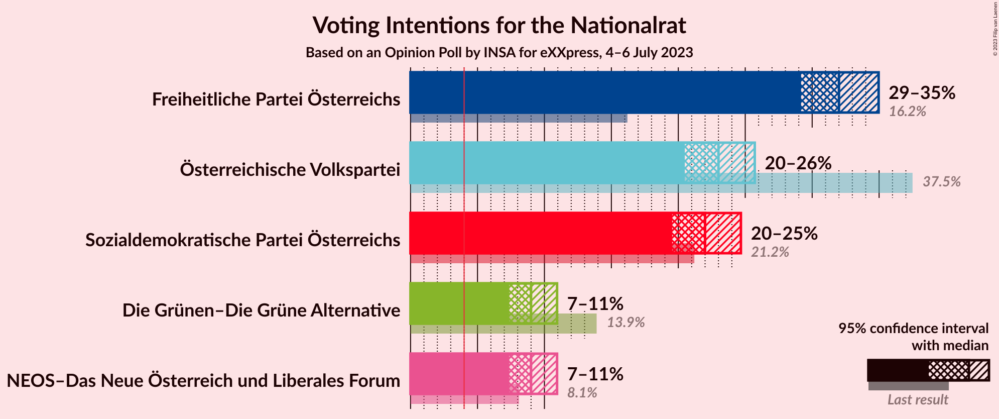

### Confidence Intervals

| Party | Last Result | Poll Result | 80% Confidence Interval | 90% Confidence Interval | 95% Confidence Interval | 99% Confidence Interval |
|:-----:|:-----------:|:-----------:|:-----------------------:|:-----------------------:|:-----------------------:|:-----------------------:|
| Freiheitliche Partei Österreichs | 16.2% | 32.0% | 30.1–33.9% |29.6–34.5% |29.2–35.0% |28.3–35.9% |
| Österreichische Volkspartei | 37.5% | 23.0% | 21.4–24.8% |20.9–25.3% |20.5–25.7% |19.7–26.6% |
| Sozialdemokratische Partei Österreichs | 21.2% | 22.0% | 20.4–23.7% |19.9–24.2% |19.5–24.7% |18.8–25.5% |
| NEOS–Das Neue Österreich und Liberales Forum | 8.1% | 9.0% | 7.9–10.3% |7.6–10.6% |7.4–10.9% |6.9–11.6% |
| Die Grünen–Die Grüne Alternative | 13.9% | 9.0% | 7.9–10.3% |7.6–10.6% |7.4–10.9% |6.9–11.6% |

*Note:* The poll result column reflects the actual value used in the calculations. Published results may vary slightly, and in addition be rounded to fewer digits.

## Seats

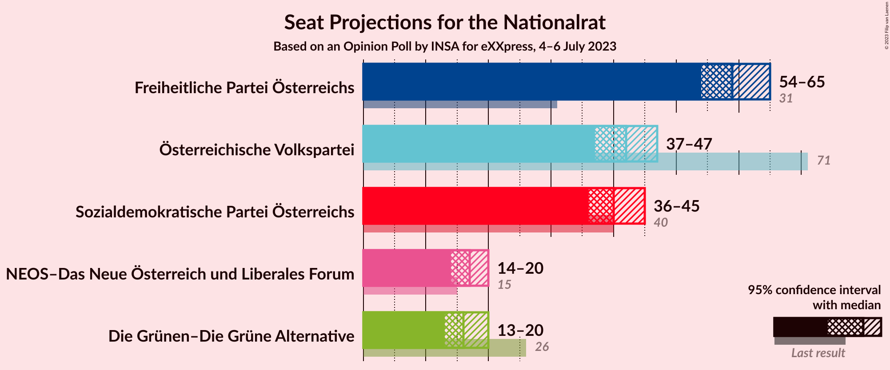

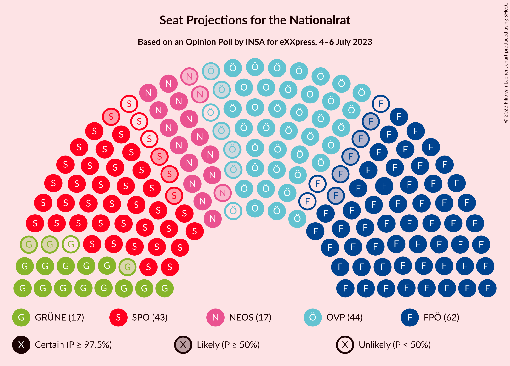

### Confidence Intervals

| Party | Last Result | Median | 80% Confidence Interval | 90% Confidence Interval | 95% Confidence Interval | 99% Confidence Interval |
|:-----:|:-----------:|:------:|:-----------------------:|:-----------------------:|:-----------------------:|:-----------------------:|
| <a href="#freiheitliche-partei-österreichs">Freiheitliche Partei Österreichs</a> | 31 | 59 | 55–63 |54–64 |54–65 |52–67 |
| <a href="#österreichische-volkspartei">Österreichische Volkspartei</a> | 71 | 42 | 39–46 |38–47 |37–47 |36–49 |
| <a href="#sozialdemokratische-partei-österreichs">Sozialdemokratische Partei Österreichs</a> | 40 | 40 | 37–44 |36–45 |36–45 |34–47 |
| <a href="#neos–das-neue-österreich-und-liberales-forum">NEOS–Das Neue Österreich und Liberales Forum</a> | 15 | 17 | 14–18 |14–18 |14–20 |13–21 |
| <a href="#die-grünen–die-grüne-alternative">Die Grünen–Die Grüne Alternative</a> | 26 | 16 | 14–19 |14–19 |13–20 |12–21 |

### Freiheitliche Partei Österreichs

*For a full overview of the results for this party, see the [Freiheitliche Partei Österreichs](party-freiheitlicheparteiösterreichs.html) page.*

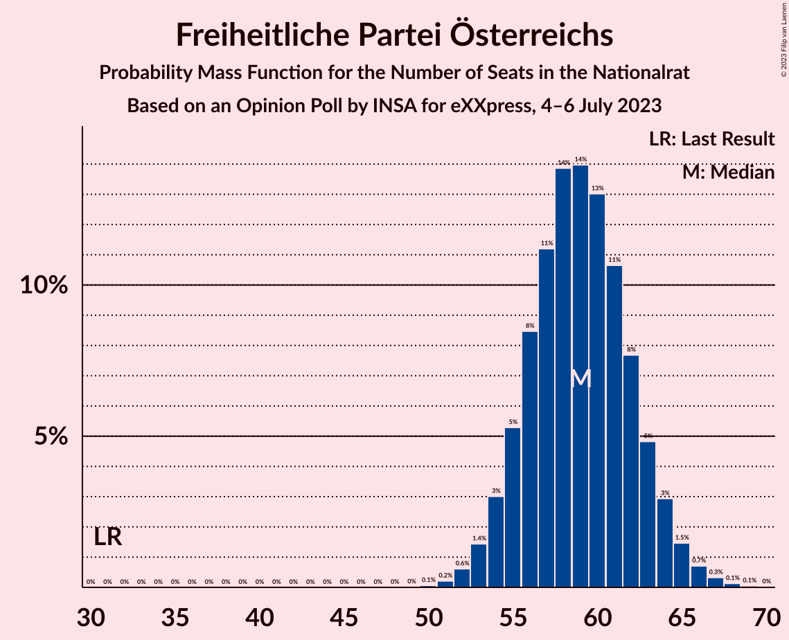

| Number of Seats | Probability | Accumulated | Special Marks |
|:---------------:|:-----------:|:-----------:|:-------------:|
| 31 | 0% | 100% | Last Result |
| 32 | 0% | 100% |  |
| 33 | 0% | 100% |  |
| 34 | 0% | 100% |  |
| 35 | 0% | 100% |  |
| 36 | 0% | 100% |  |
| 37 | 0% | 100% |  |
| 38 | 0% | 100% |  |
| 39 | 0% | 100% |  |
| 40 | 0% | 100% |  |
| 41 | 0% | 100% |  |
| 42 | 0% | 100% |  |
| 43 | 0% | 100% |  |
| 44 | 0% | 100% |  |
| 45 | 0% | 100% |  |
| 46 | 0% | 100% |  |
| 47 | 0% | 100% |  |
| 48 | 0% | 100% |  |
| 49 | 0% | 100% |  |
| 50 | 0.1% | 100% |  |
| 51 | 0.2% | 99.9% |  |
| 52 | 0.6% | 99.7% |  |
| 53 | 1.4% | 99.1% |  |
| 54 | 3% | 98% |  |
| 55 | 5% | 95% |  |
| 56 | 8% | 89% |  |
| 57 | 11% | 81% |  |
| 58 | 14% | 70% |  |
| 59 | 14% | 56% | Median |
| 60 | 13% | 42% |  |
| 61 | 11% | 29% |  |
| 62 | 8% | 18% |  |
| 63 | 5% | 10% |  |
| 64 | 3% | 6% |  |
| 65 | 1.5% | 3% |  |
| 66 | 0.7% | 1.2% |  |
| 67 | 0.3% | 0.5% |  |
| 68 | 0.1% | 0.2% |  |
| 69 | 0.1% | 0.1% |  |
| 70 | 0% | 0% |  |

### Österreichische Volkspartei

*For a full overview of the results for this party, see the [Österreichische Volkspartei](party-österreichischevolkspartei.html) page.*

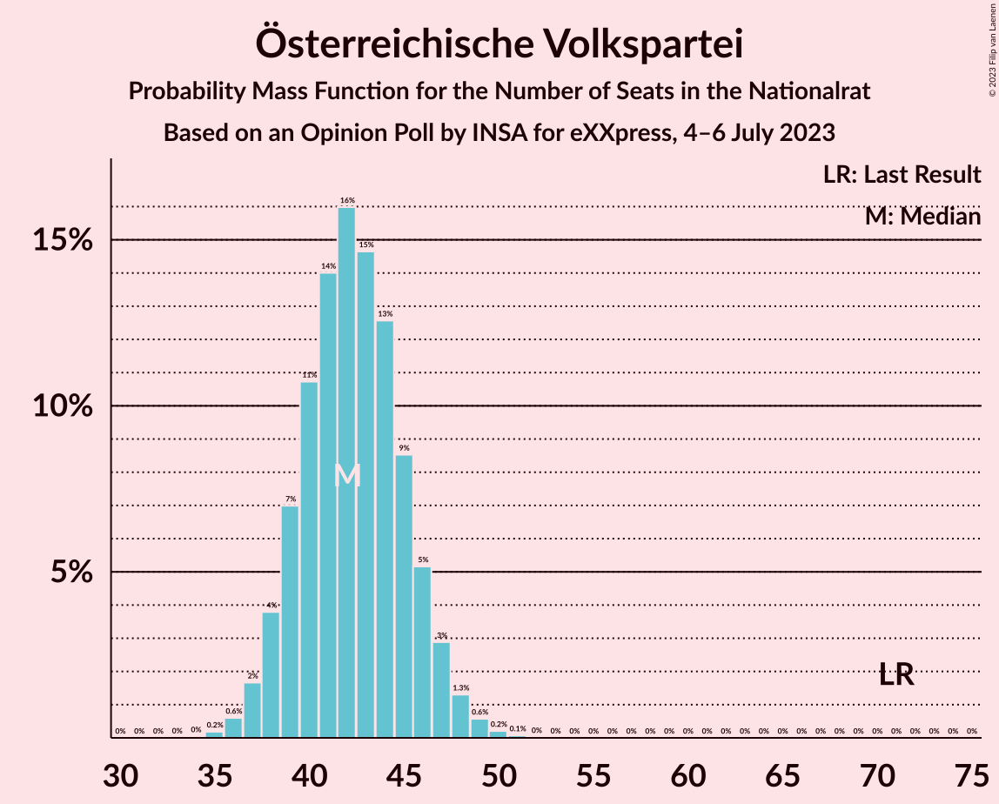

| Number of Seats | Probability | Accumulated | Special Marks |
|:---------------:|:-----------:|:-----------:|:-------------:|
| 34 | 0% | 100% |  |
| 35 | 0.2% | 99.9% |  |
| 36 | 0.6% | 99.8% |  |
| 37 | 2% | 99.2% |  |
| 38 | 4% | 97% |  |
| 39 | 7% | 94% |  |
| 40 | 11% | 87% |  |
| 41 | 14% | 76% |  |
| 42 | 16% | 62% | Median |
| 43 | 15% | 46% |  |
| 44 | 13% | 31% |  |
| 45 | 9% | 19% |  |
| 46 | 5% | 10% |  |
| 47 | 3% | 5% |  |
| 48 | 1.3% | 2% |  |
| 49 | 0.6% | 0.9% |  |
| 50 | 0.2% | 0.3% |  |
| 51 | 0.1% | 0.1% |  |
| 52 | 0% | 0% |  |
| 53 | 0% | 0% |  |
| 54 | 0% | 0% |  |
| 55 | 0% | 0% |  |
| 56 | 0% | 0% |  |
| 57 | 0% | 0% |  |
| 58 | 0% | 0% |  |
| 59 | 0% | 0% |  |
| 60 | 0% | 0% |  |
| 61 | 0% | 0% |  |
| 62 | 0% | 0% |  |
| 63 | 0% | 0% |  |
| 64 | 0% | 0% |  |
| 65 | 0% | 0% |  |
| 66 | 0% | 0% |  |
| 67 | 0% | 0% |  |
| 68 | 0% | 0% |  |
| 69 | 0% | 0% |  |
| 70 | 0% | 0% |  |
| 71 | 0% | 0% | Last Result |

### Sozialdemokratische Partei Österreichs

*For a full overview of the results for this party, see the [Sozialdemokratische Partei Österreichs](party-sozialdemokratischeparteiösterreichs.html) page.*

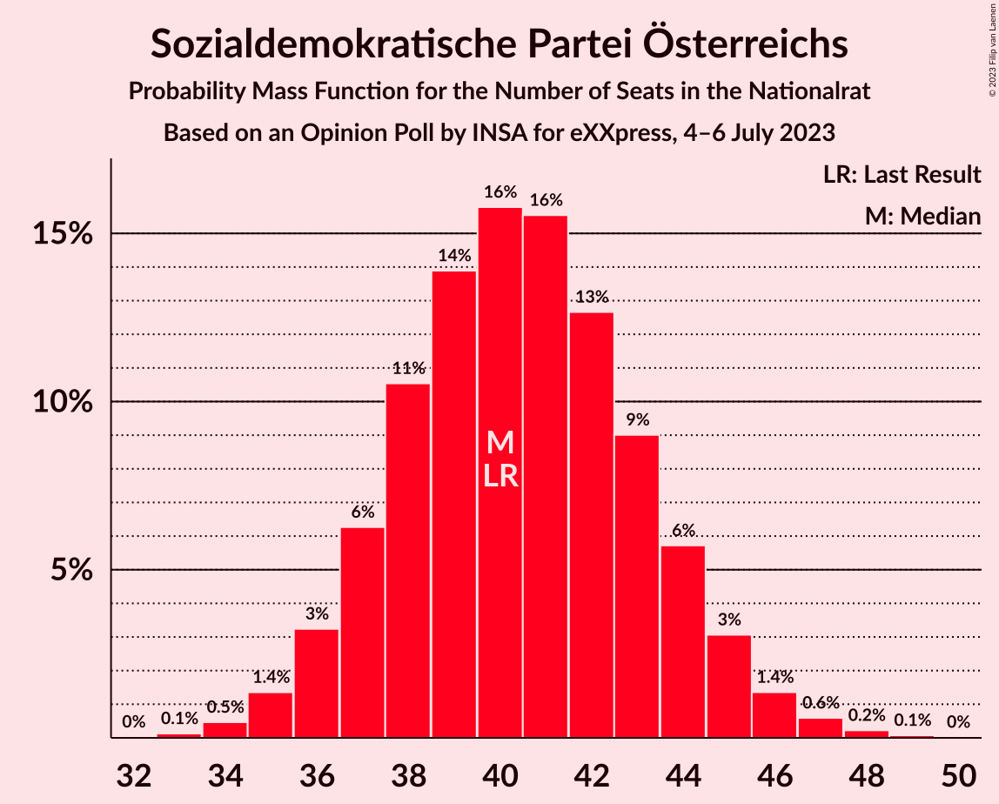

| Number of Seats | Probability | Accumulated | Special Marks |
|:---------------:|:-----------:|:-----------:|:-------------:|
| 33 | 0.1% | 100% |  |
| 34 | 0.5% | 99.8% |  |
| 35 | 1.4% | 99.4% |  |
| 36 | 3% | 98% |  |
| 37 | 6% | 95% |  |
| 38 | 11% | 89% |  |
| 39 | 14% | 78% |  |
| 40 | 16% | 64% | Last Result, Median |
| 41 | 16% | 48% |  |
| 42 | 13% | 33% |  |
| 43 | 9% | 20% |  |
| 44 | 6% | 11% |  |
| 45 | 3% | 5% |  |
| 46 | 1.4% | 2% |  |
| 47 | 0.6% | 0.9% |  |
| 48 | 0.2% | 0.3% |  |
| 49 | 0.1% | 0.1% |  |
| 50 | 0% | 0% |  |

### NEOS–Das Neue Österreich und Liberales Forum

*For a full overview of the results for this party, see the [NEOS–Das Neue Österreich und Liberales Forum](party-neos–dasneueösterreichundliberalesforum.html) page.*

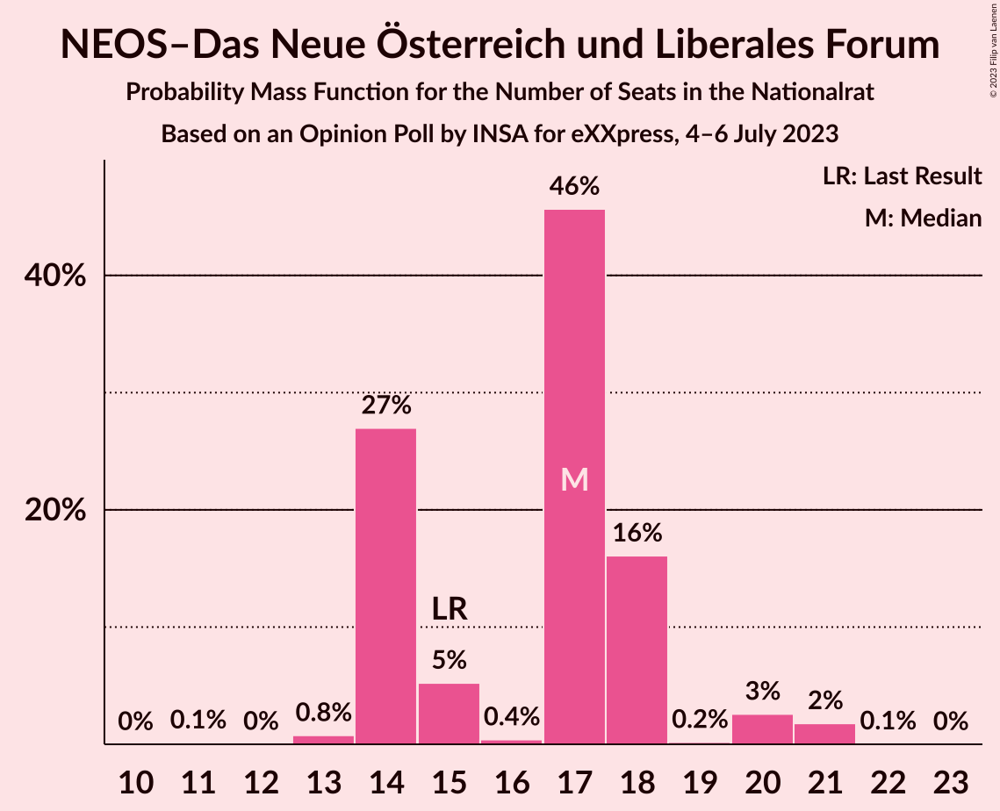

| Number of Seats | Probability | Accumulated | Special Marks |
|:---------------:|:-----------:|:-----------:|:-------------:|
| 11 | 0.1% | 100% |  |
| 12 | 0% | 99.8% |  |
| 13 | 0.8% | 99.8% |  |
| 14 | 27% | 99.1% |  |
| 15 | 5% | 72% | Last Result |
| 16 | 0.4% | 67% |  |
| 17 | 46% | 66% | Median |
| 18 | 16% | 21% |  |
| 19 | 0.2% | 5% |  |
| 20 | 3% | 4% |  |
| 21 | 2% | 2% |  |
| 22 | 0.1% | 0.1% |  |
| 23 | 0% | 0% |  |

### Die Grünen–Die Grüne Alternative

*For a full overview of the results for this party, see the [Die Grünen–Die Grüne Alternative](party-diegrünen–diegrünealternative.html) page.*

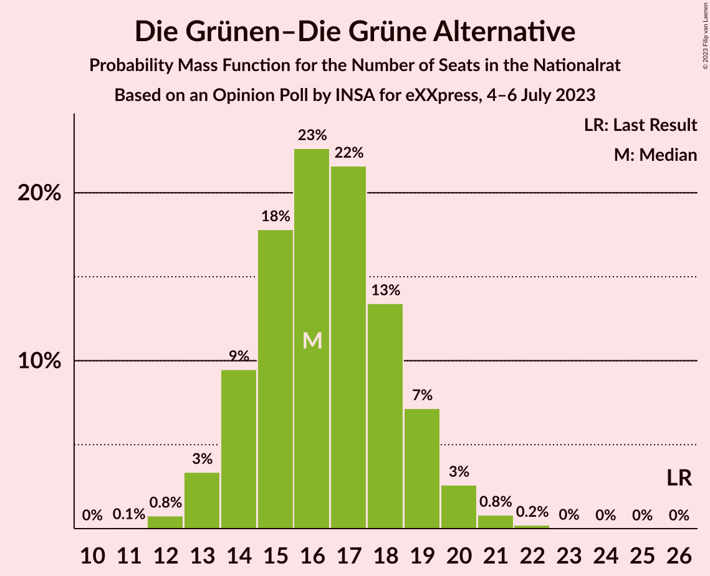

| Number of Seats | Probability | Accumulated | Special Marks |
|:---------------:|:-----------:|:-----------:|:-------------:|
| 11 | 0.1% | 100% |  |
| 12 | 0.8% | 99.9% |  |
| 13 | 3% | 99.2% |  |
| 14 | 9% | 96% |  |
| 15 | 18% | 86% |  |
| 16 | 23% | 68% | Median |
| 17 | 22% | 46% |  |
| 18 | 13% | 24% |  |
| 19 | 7% | 11% |  |
| 20 | 3% | 4% |  |
| 21 | 0.8% | 1.1% |  |
| 22 | 0.2% | 0.3% |  |
| 23 | 0% | 0% |  |
| 24 | 0% | 0% |  |
| 25 | 0% | 0% |  |
| 26 | 0% | 0% | Last Result |

## Coalitions

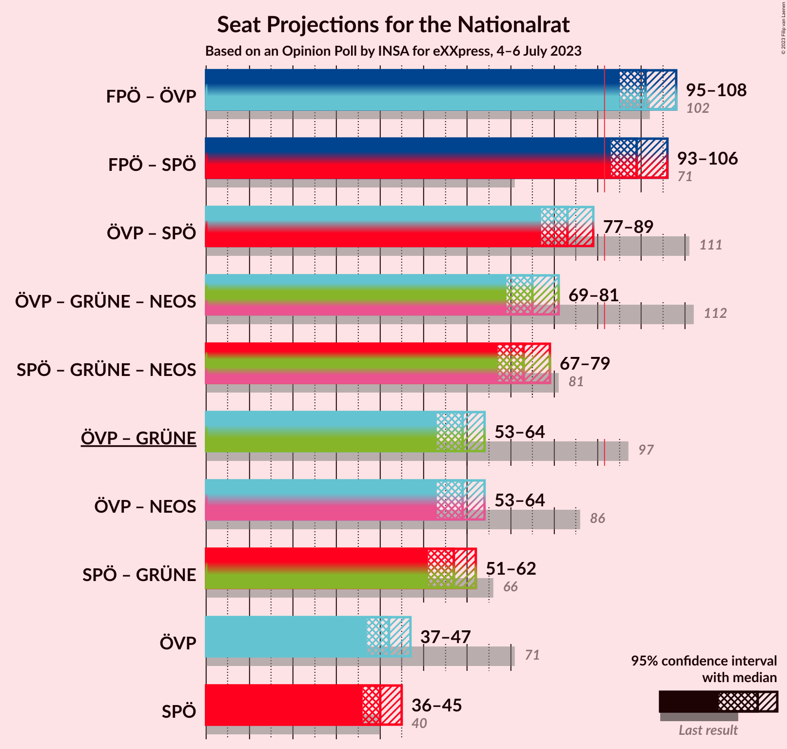

### Confidence Intervals

| Coalition | Last Result | Median | Majority? | 80% Confidence Interval | 90% Confidence Interval | 95% Confidence Interval | 99% Confidence Interval |
|:---------:|:-----------:|:------:|:---------:|:-----------------------:|:-----------------------:|:-----------------------:|:-----------------------:|
| Freiheitliche Partei Österreichs – Österreichische Volkspartei | 102 | 101 | 99.9% | 97–105 | 96–107 | 95–108 | 93–110 |
| Freiheitliche Partei Österreichs – Sozialdemokratische Partei Österreichs | 71 | 99 | 99.5% | 95–103 | 94–105 | 93–106 | 92–108 |
| Österreichische Volkspartei – Sozialdemokratische Partei Österreichs | 111 | 83 | 0.4% | 79–87 | 78–88 | 77–89 | 75–91 |
| Österreichische Volkspartei – Die Grünen–Die Grüne Alternative – NEOS–Das Neue Österreich und Liberales Forum | 112 | 75 | 0% | 71–79 | 70–80 | 69–81 | 68–83 |
| Sozialdemokratische Partei Österreichs – Die Grünen–Die Grüne Alternative – NEOS–Das Neue Österreich und Liberales Forum | 81 | 73 | 0% | 69–77 | 68–78 | 67–79 | 66–81 |
| Österreichische Volkspartei – Die Grünen–Die Grüne Alternative | 97 | 59 | 0% | 55–62 | 54–63 | 53–64 | 52–66 |
| Österreichische Volkspartei – NEOS–Das Neue Österreich und Liberales Forum | 86 | 59 | 0% | 55–62 | 54–63 | 53–64 | 51–66 |
| Sozialdemokratische Partei Österreichs – Die Grünen–Die Grüne Alternative | 66 | 57 | 0% | 53–60 | 52–61 | 51–62 | 50–64 |
| Österreichische Volkspartei | 71 | 42 | 0% | 39–46 | 38–47 | 37–47 | 36–49 |
| Sozialdemokratische Partei Österreichs | 40 | 40 | 0% | 37–44 | 36–45 | 36–45 | 34–47 |

### Freiheitliche Partei Österreichs – Österreichische Volkspartei

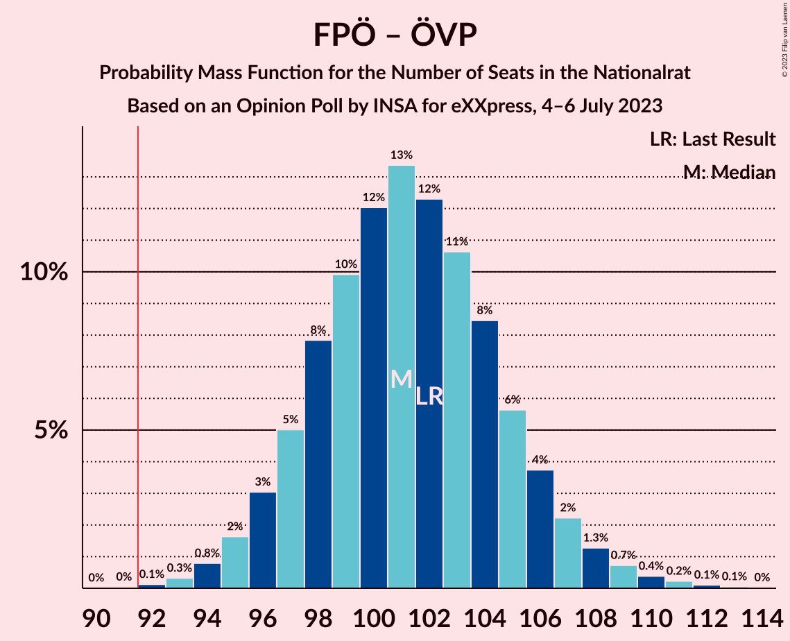

| Number of Seats | Probability | Accumulated | Special Marks |
|:---------------:|:-----------:|:-----------:|:-------------:|
| 91 | 0% | 100% |  |
| 92 | 0.1% | 99.9% | Majority |
| 93 | 0.3% | 99.8% |  |
| 94 | 0.8% | 99.5% |  |
| 95 | 2% | 98.7% |  |
| 96 | 3% | 97% |  |
| 97 | 5% | 94% |  |
| 98 | 8% | 89% |  |
| 99 | 10% | 81% |  |
| 100 | 12% | 71% |  |
| 101 | 13% | 59% | Median |
| 102 | 12% | 46% | Last Result |
| 103 | 11% | 34% |  |
| 104 | 8% | 23% |  |
| 105 | 6% | 14% |  |
| 106 | 4% | 9% |  |
| 107 | 2% | 5% |  |
| 108 | 1.3% | 3% |  |
| 109 | 0.7% | 2% |  |
| 110 | 0.4% | 0.8% |  |
| 111 | 0.2% | 0.4% |  |
| 112 | 0.1% | 0.2% |  |
| 113 | 0.1% | 0.1% |  |
| 114 | 0% | 0% |  |

### Freiheitliche Partei Österreichs – Sozialdemokratische Partei Österreichs

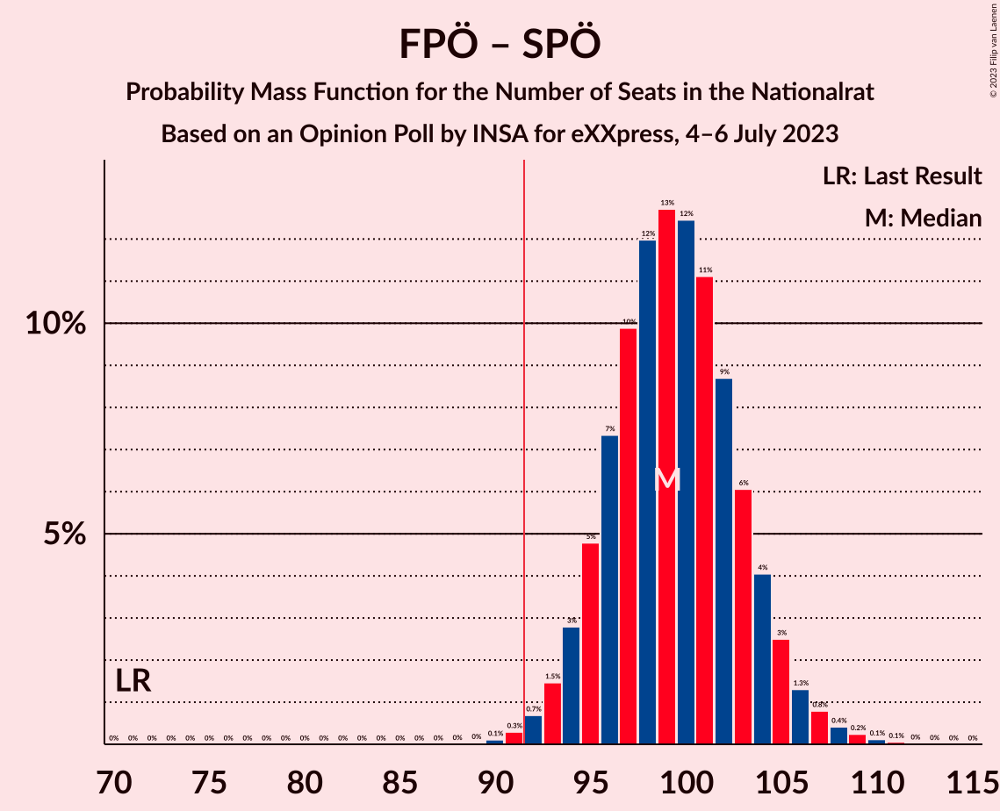

| Number of Seats | Probability | Accumulated | Special Marks |
|:---------------:|:-----------:|:-----------:|:-------------:|
| 71 | 0% | 100% | Last Result |
| 72 | 0% | 100% |  |
| 73 | 0% | 100% |  |
| 74 | 0% | 100% |  |
| 75 | 0% | 100% |  |
| 76 | 0% | 100% |  |
| 77 | 0% | 100% |  |
| 78 | 0% | 100% |  |
| 79 | 0% | 100% |  |
| 80 | 0% | 100% |  |
| 81 | 0% | 100% |  |
| 82 | 0% | 100% |  |
| 83 | 0% | 100% |  |
| 84 | 0% | 100% |  |
| 85 | 0% | 100% |  |
| 86 | 0% | 100% |  |
| 87 | 0% | 100% |  |
| 88 | 0% | 100% |  |
| 89 | 0% | 100% |  |
| 90 | 0.1% | 100% |  |
| 91 | 0.3% | 99.8% |  |
| 92 | 0.7% | 99.5% | Majority |
| 93 | 1.5% | 98.9% |  |
| 94 | 3% | 97% |  |
| 95 | 5% | 95% |  |
| 96 | 7% | 90% |  |
| 97 | 10% | 82% |  |
| 98 | 12% | 73% |  |
| 99 | 13% | 61% | Median |
| 100 | 12% | 48% |  |
| 101 | 11% | 35% |  |
| 102 | 9% | 24% |  |
| 103 | 6% | 16% |  |
| 104 | 4% | 10% |  |
| 105 | 3% | 5% |  |
| 106 | 1.3% | 3% |  |
| 107 | 0.8% | 2% |  |
| 108 | 0.4% | 0.9% |  |
| 109 | 0.2% | 0.5% |  |
| 110 | 0.1% | 0.2% |  |
| 111 | 0.1% | 0.1% |  |
| 112 | 0% | 0% |  |

### Österreichische Volkspartei – Sozialdemokratische Partei Österreichs

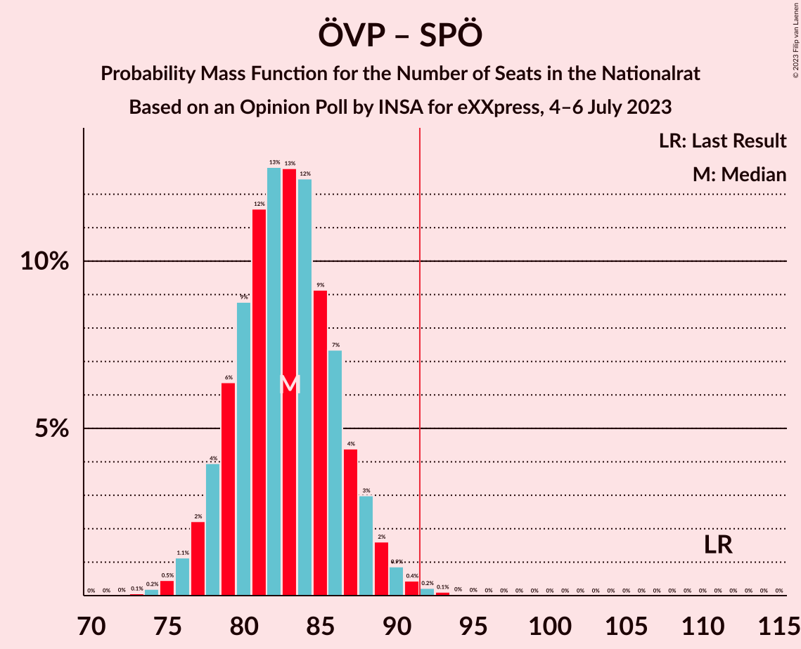

| Number of Seats | Probability | Accumulated | Special Marks |
|:---------------:|:-----------:|:-----------:|:-------------:|
| 73 | 0.1% | 100% |  |
| 74 | 0.2% | 99.9% |  |
| 75 | 0.5% | 99.7% |  |
| 76 | 1.1% | 99.3% |  |
| 77 | 2% | 98% |  |
| 78 | 4% | 96% |  |
| 79 | 6% | 92% |  |
| 80 | 9% | 86% |  |
| 81 | 12% | 77% |  |
| 82 | 13% | 65% | Median |
| 83 | 13% | 52% |  |
| 84 | 12% | 40% |  |
| 85 | 9% | 27% |  |
| 86 | 7% | 18% |  |
| 87 | 4% | 11% |  |
| 88 | 3% | 6% |  |
| 89 | 2% | 3% |  |
| 90 | 0.9% | 2% |  |
| 91 | 0.4% | 0.8% |  |
| 92 | 0.2% | 0.4% | Majority |
| 93 | 0.1% | 0.2% |  |
| 94 | 0% | 0.1% |  |
| 95 | 0% | 0% |  |
| 96 | 0% | 0% |  |
| 97 | 0% | 0% |  |
| 98 | 0% | 0% |  |
| 99 | 0% | 0% |  |
| 100 | 0% | 0% |  |
| 101 | 0% | 0% |  |
| 102 | 0% | 0% |  |
| 103 | 0% | 0% |  |
| 104 | 0% | 0% |  |
| 105 | 0% | 0% |  |
| 106 | 0% | 0% |  |
| 107 | 0% | 0% |  |
| 108 | 0% | 0% |  |
| 109 | 0% | 0% |  |
| 110 | 0% | 0% |  |
| 111 | 0% | 0% | Last Result |

### Österreichische Volkspartei – Die Grünen–Die Grüne Alternative – NEOS–Das Neue Österreich und Liberales Forum

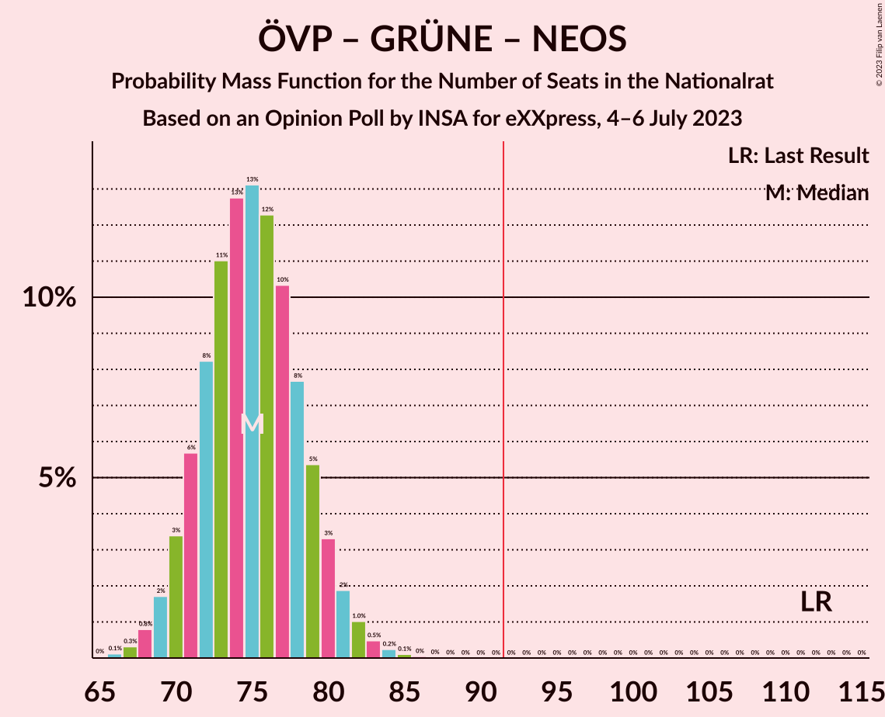

| Number of Seats | Probability | Accumulated | Special Marks |
|:---------------:|:-----------:|:-----------:|:-------------:|
| 65 | 0% | 100% |  |
| 66 | 0.1% | 99.9% |  |
| 67 | 0.3% | 99.8% |  |
| 68 | 0.8% | 99.5% |  |
| 69 | 2% | 98.7% |  |
| 70 | 3% | 97% |  |
| 71 | 6% | 94% |  |
| 72 | 8% | 88% |  |
| 73 | 11% | 80% |  |
| 74 | 13% | 69% |  |
| 75 | 13% | 56% | Median |
| 76 | 12% | 43% |  |
| 77 | 10% | 31% |  |
| 78 | 8% | 20% |  |
| 79 | 5% | 12% |  |
| 80 | 3% | 7% |  |
| 81 | 2% | 4% |  |
| 82 | 1.0% | 2% |  |
| 83 | 0.5% | 0.9% |  |
| 84 | 0.2% | 0.4% |  |
| 85 | 0.1% | 0.2% |  |
| 86 | 0% | 0.1% |  |
| 87 | 0% | 0% |  |
| 88 | 0% | 0% |  |
| 89 | 0% | 0% |  |
| 90 | 0% | 0% |  |
| 91 | 0% | 0% |  |
| 92 | 0% | 0% | Majority |
| 93 | 0% | 0% |  |
| 94 | 0% | 0% |  |
| 95 | 0% | 0% |  |
| 96 | 0% | 0% |  |
| 97 | 0% | 0% |  |
| 98 | 0% | 0% |  |
| 99 | 0% | 0% |  |
| 100 | 0% | 0% |  |
| 101 | 0% | 0% |  |
| 102 | 0% | 0% |  |
| 103 | 0% | 0% |  |
| 104 | 0% | 0% |  |
| 105 | 0% | 0% |  |
| 106 | 0% | 0% |  |
| 107 | 0% | 0% |  |
| 108 | 0% | 0% |  |
| 109 | 0% | 0% |  |
| 110 | 0% | 0% |  |
| 111 | 0% | 0% |  |
| 112 | 0% | 0% | Last Result |

### Sozialdemokratische Partei Österreichs – Die Grünen–Die Grüne Alternative – NEOS–Das Neue Österreich und Liberales Forum

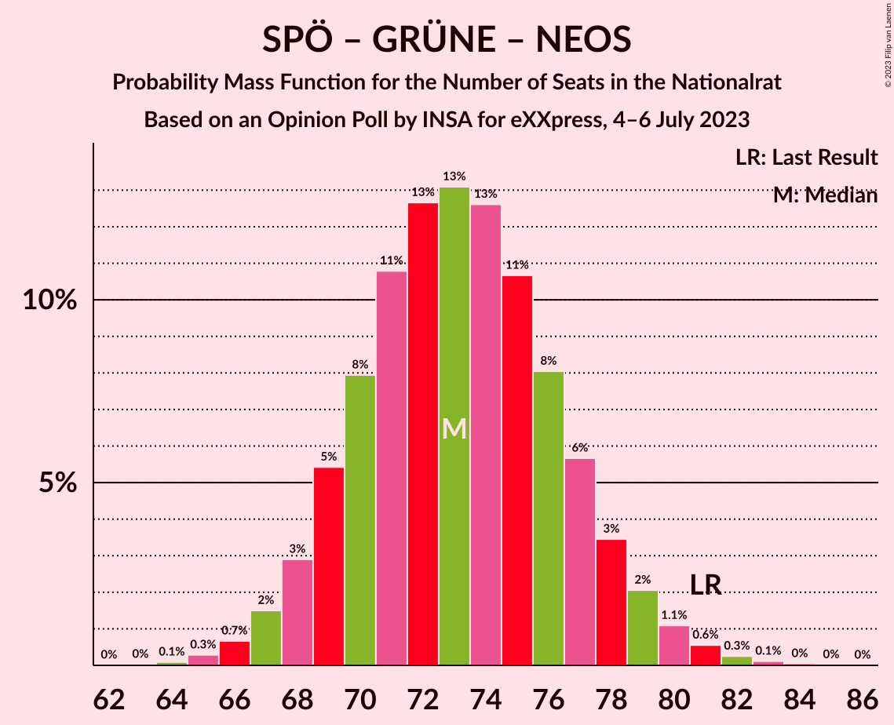

| Number of Seats | Probability | Accumulated | Special Marks |
|:---------------:|:-----------:|:-----------:|:-------------:|
| 64 | 0.1% | 100% |  |
| 65 | 0.3% | 99.9% |  |
| 66 | 0.7% | 99.6% |  |
| 67 | 2% | 98.9% |  |
| 68 | 3% | 97% |  |
| 69 | 5% | 95% |  |
| 70 | 8% | 89% |  |
| 71 | 11% | 81% |  |
| 72 | 13% | 70% |  |
| 73 | 13% | 58% | Median |
| 74 | 13% | 45% |  |
| 75 | 11% | 32% |  |
| 76 | 8% | 21% |  |
| 77 | 6% | 13% |  |
| 78 | 3% | 8% |  |
| 79 | 2% | 4% |  |
| 80 | 1.1% | 2% |  |
| 81 | 0.6% | 1.0% | Last Result |
| 82 | 0.3% | 0.4% |  |
| 83 | 0.1% | 0.2% |  |
| 84 | 0% | 0.1% |  |
| 85 | 0% | 0% |  |

### Österreichische Volkspartei – Die Grünen–Die Grüne Alternative

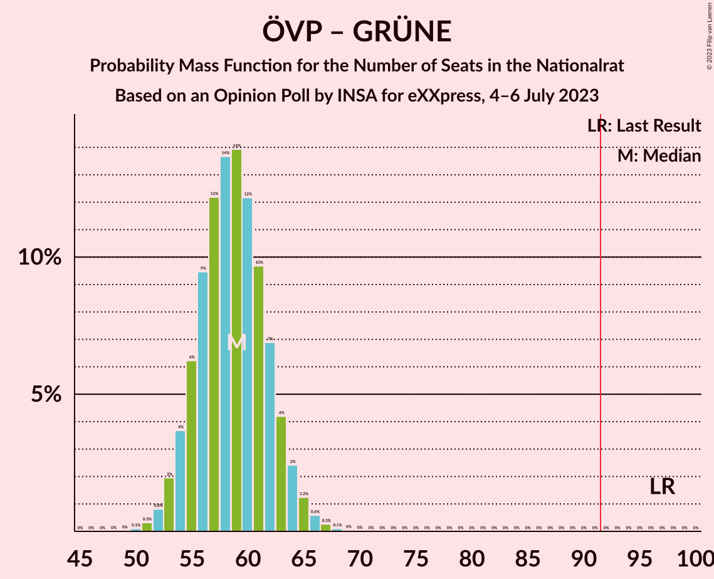

| Number of Seats | Probability | Accumulated | Special Marks |
|:---------------:|:-----------:|:-----------:|:-------------:|
| 50 | 0.1% | 100% |  |
| 51 | 0.3% | 99.9% |  |
| 52 | 0.8% | 99.5% |  |
| 53 | 2% | 98.7% |  |
| 54 | 4% | 97% |  |
| 55 | 6% | 93% |  |
| 56 | 9% | 87% |  |
| 57 | 12% | 77% |  |
| 58 | 14% | 65% | Median |
| 59 | 14% | 52% |  |
| 60 | 12% | 38% |  |
| 61 | 10% | 25% |  |
| 62 | 7% | 16% |  |
| 63 | 4% | 9% |  |
| 64 | 2% | 5% |  |
| 65 | 1.2% | 2% |  |
| 66 | 0.6% | 1.0% |  |
| 67 | 0.3% | 0.4% |  |
| 68 | 0.1% | 0.2% |  |
| 69 | 0% | 0.1% |  |
| 70 | 0% | 0% |  |
| 71 | 0% | 0% |  |
| 72 | 0% | 0% |  |
| 73 | 0% | 0% |  |
| 74 | 0% | 0% |  |
| 75 | 0% | 0% |  |
| 76 | 0% | 0% |  |
| 77 | 0% | 0% |  |
| 78 | 0% | 0% |  |
| 79 | 0% | 0% |  |
| 80 | 0% | 0% |  |
| 81 | 0% | 0% |  |
| 82 | 0% | 0% |  |
| 83 | 0% | 0% |  |
| 84 | 0% | 0% |  |
| 85 | 0% | 0% |  |
| 86 | 0% | 0% |  |
| 87 | 0% | 0% |  |
| 88 | 0% | 0% |  |
| 89 | 0% | 0% |  |
| 90 | 0% | 0% |  |
| 91 | 0% | 0% |  |
| 92 | 0% | 0% | Majority |
| 93 | 0% | 0% |  |
| 94 | 0% | 0% |  |
| 95 | 0% | 0% |  |
| 96 | 0% | 0% |  |
| 97 | 0% | 0% | Last Result |

### Österreichische Volkspartei – NEOS–Das Neue Österreich und Liberales Forum

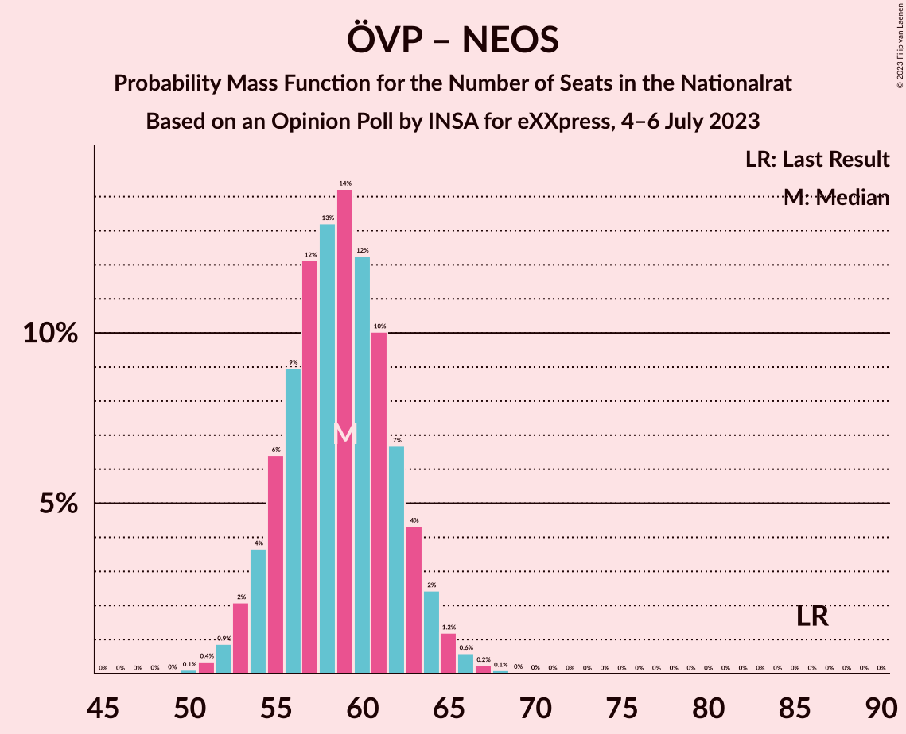

| Number of Seats | Probability | Accumulated | Special Marks |
|:---------------:|:-----------:|:-----------:|:-------------:|
| 50 | 0.1% | 100% |  |
| 51 | 0.4% | 99.9% |  |
| 52 | 0.9% | 99.5% |  |
| 53 | 2% | 98.6% |  |
| 54 | 4% | 97% |  |
| 55 | 6% | 93% |  |
| 56 | 9% | 86% |  |
| 57 | 12% | 77% |  |
| 58 | 13% | 65% |  |
| 59 | 14% | 52% | Median |
| 60 | 12% | 38% |  |
| 61 | 10% | 26% |  |
| 62 | 7% | 16% |  |
| 63 | 4% | 9% |  |
| 64 | 2% | 5% |  |
| 65 | 1.2% | 2% |  |
| 66 | 0.6% | 1.0% |  |
| 67 | 0.2% | 0.4% |  |
| 68 | 0.1% | 0.2% |  |
| 69 | 0% | 0.1% |  |
| 70 | 0% | 0% |  |
| 71 | 0% | 0% |  |
| 72 | 0% | 0% |  |
| 73 | 0% | 0% |  |
| 74 | 0% | 0% |  |
| 75 | 0% | 0% |  |
| 76 | 0% | 0% |  |
| 77 | 0% | 0% |  |
| 78 | 0% | 0% |  |
| 79 | 0% | 0% |  |
| 80 | 0% | 0% |  |
| 81 | 0% | 0% |  |
| 82 | 0% | 0% |  |
| 83 | 0% | 0% |  |
| 84 | 0% | 0% |  |
| 85 | 0% | 0% |  |
| 86 | 0% | 0% | Last Result |

### Sozialdemokratische Partei Österreichs – Die Grünen–Die Grüne Alternative

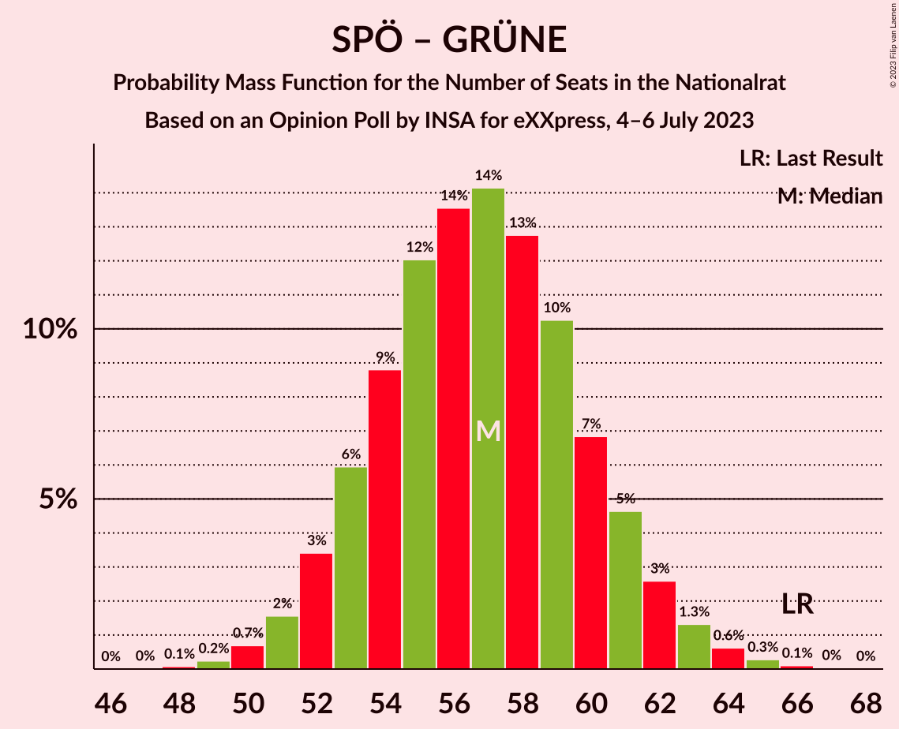

| Number of Seats | Probability | Accumulated | Special Marks |
|:---------------:|:-----------:|:-----------:|:-------------:|
| 48 | 0.1% | 100% |  |
| 49 | 0.2% | 99.9% |  |
| 50 | 0.7% | 99.7% |  |
| 51 | 2% | 99.0% |  |
| 52 | 3% | 97% |  |
| 53 | 6% | 94% |  |
| 54 | 9% | 88% |  |
| 55 | 12% | 79% |  |
| 56 | 14% | 67% | Median |
| 57 | 14% | 54% |  |
| 58 | 13% | 39% |  |
| 59 | 10% | 27% |  |
| 60 | 7% | 16% |  |
| 61 | 5% | 10% |  |
| 62 | 3% | 5% |  |
| 63 | 1.3% | 2% |  |
| 64 | 0.6% | 1.1% |  |
| 65 | 0.3% | 0.4% |  |
| 66 | 0.1% | 0.2% | Last Result |
| 67 | 0% | 0.1% |  |
| 68 | 0% | 0% |  |

### Österreichische Volkspartei

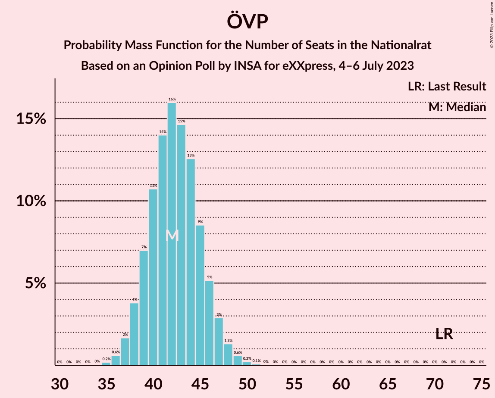

| Number of Seats | Probability | Accumulated | Special Marks |
|:---------------:|:-----------:|:-----------:|:-------------:|
| 34 | 0% | 100% |  |
| 35 | 0.2% | 99.9% |  |
| 36 | 0.6% | 99.8% |  |
| 37 | 2% | 99.2% |  |
| 38 | 4% | 97% |  |
| 39 | 7% | 94% |  |
| 40 | 11% | 87% |  |
| 41 | 14% | 76% |  |
| 42 | 16% | 62% | Median |
| 43 | 15% | 46% |  |
| 44 | 13% | 31% |  |
| 45 | 9% | 19% |  |
| 46 | 5% | 10% |  |
| 47 | 3% | 5% |  |
| 48 | 1.3% | 2% |  |
| 49 | 0.6% | 0.9% |  |
| 50 | 0.2% | 0.3% |  |
| 51 | 0.1% | 0.1% |  |
| 52 | 0% | 0% |  |
| 53 | 0% | 0% |  |
| 54 | 0% | 0% |  |
| 55 | 0% | 0% |  |
| 56 | 0% | 0% |  |
| 57 | 0% | 0% |  |
| 58 | 0% | 0% |  |
| 59 | 0% | 0% |  |
| 60 | 0% | 0% |  |
| 61 | 0% | 0% |  |
| 62 | 0% | 0% |  |
| 63 | 0% | 0% |  |
| 64 | 0% | 0% |  |
| 65 | 0% | 0% |  |
| 66 | 0% | 0% |  |
| 67 | 0% | 0% |  |
| 68 | 0% | 0% |  |
| 69 | 0% | 0% |  |
| 70 | 0% | 0% |  |
| 71 | 0% | 0% | Last Result |

### Sozialdemokratische Partei Österreichs

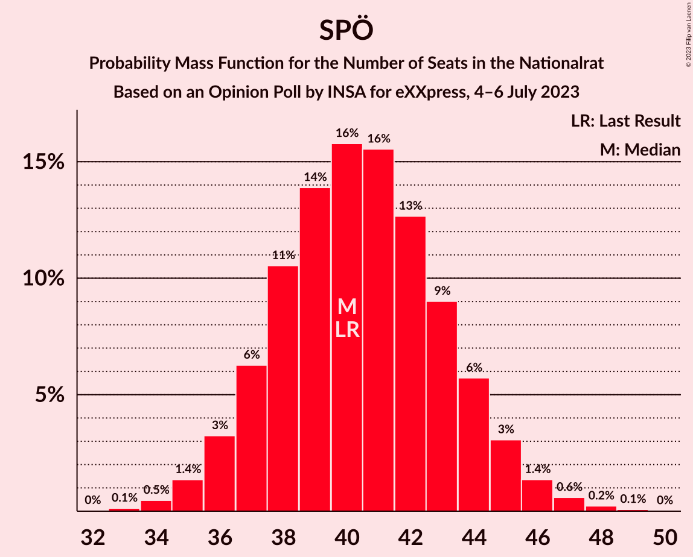

| Number of Seats | Probability | Accumulated | Special Marks |
|:---------------:|:-----------:|:-----------:|:-------------:|
| 33 | 0.1% | 100% |  |
| 34 | 0.5% | 99.8% |  |
| 35 | 1.4% | 99.4% |  |
| 36 | 3% | 98% |  |
| 37 | 6% | 95% |  |
| 38 | 11% | 89% |  |
| 39 | 14% | 78% |  |
| 40 | 16% | 64% | Last Result, Median |
| 41 | 16% | 48% |  |
| 42 | 13% | 33% |  |
| 43 | 9% | 20% |  |
| 44 | 6% | 11% |  |
| 45 | 3% | 5% |  |
| 46 | 1.4% | 2% |  |
| 47 | 0.6% | 0.9% |  |
| 48 | 0.2% | 0.3% |  |
| 49 | 0.1% | 0.1% |  |
| 50 | 0% | 0% |  |

## Technical Information

### Opinion Poll

+ **Polling firm:** INSA
+ **Commissioner(s):** eXXpress
+ **Fieldwork period:** 4–6 July 2023

### Calculations

+ **Sample size:** 1000
+ **Simulations done:** 1,048,576
+ **Error estimate:** 0.64%

