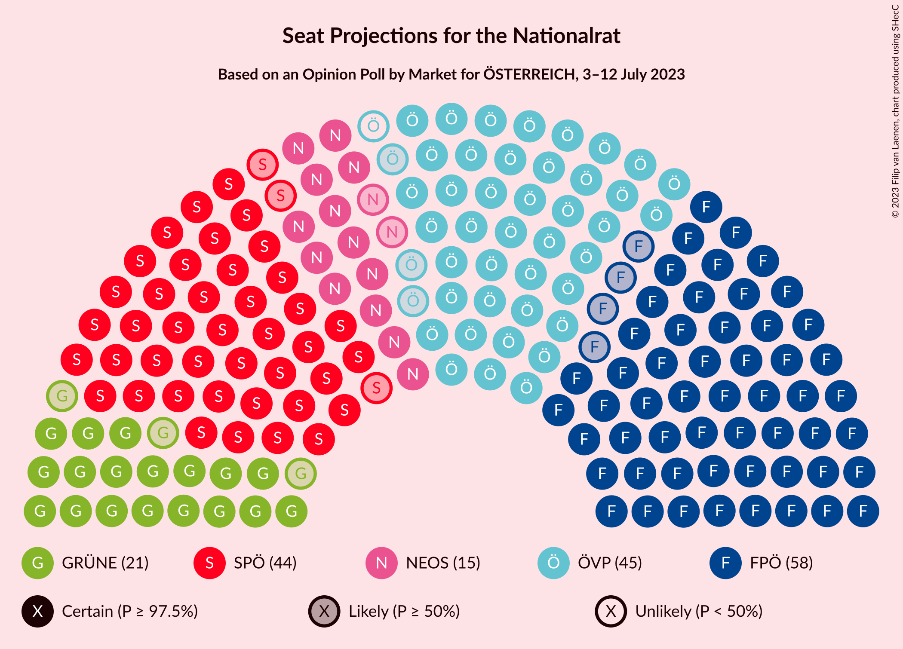

# Opinion Poll by Market for ÖSTERREICH, 3–12 July 2023

<a href="#voting-intentions">Voting Intentions</a> | <a href="#seats">Seats</a> | <a href="#coalitions">Coalitions</a> | <a href="#technical-information">Technical Information</a>

## Voting Intentions

### Confidence Intervals

| Party | Last Result | Poll Result | 80% Confidence Interval | 90% Confidence Interval | 95% Confidence Interval | 99% Confidence Interval |
|:-----:|:-----------:|:-----------:|:-----------------------:|:-----------------------:|:-----------------------:|:-----------------------:|
| Freiheitliche Partei Österreichs | 16.2% | 30.0% | 28.7–31.3% |28.3–31.7% |28.0–32.1% |27.4–32.7% |
| Österreichische Volkspartei | 37.5% | 23.0% | 21.8–24.2% |21.5–24.6% |21.2–24.9% |20.7–25.5% |
| Sozialdemokratische Partei Österreichs | 21.2% | 23.0% | 21.8–24.2% |21.5–24.6% |21.2–24.9% |20.7–25.5% |
| Die Grünen–Die Grüne Alternative | 13.9% | 11.0% | 10.1–11.9% |9.9–12.2% |9.7–12.5% |9.3–12.9% |
| NEOS–Das Neue Österreich und Liberales Forum | 8.1% | 8.0% | 7.3–8.8% |7.1–9.1% |6.9–9.3% |6.6–9.7% |
| Kommunistische Partei Österreichs | N/A | 3.0% | 2.6–3.6% |2.4–3.7% |2.3–3.9% |2.1–4.1% |

*Note:* The poll result column reflects the actual value used in the calculations. Published results may vary slightly, and in addition be rounded to fewer digits.

## Seats

### Confidence Intervals

| Party | Last Result | Median | 80% Confidence Interval | 90% Confidence Interval | 95% Confidence Interval | 99% Confidence Interval |
|:-----:|:-----------:|:------:|:-----------------------:|:-----------------------:|:-----------------------:|:-----------------------:|
| <a href="#freiheitliche-partei-österreichs">Freiheitliche Partei Österreichs</a> | 31 | 58 | 55–61 |55–61 |54–62 |53–63 |
| <a href="#österreichische-volkspartei">Österreichische Volkspartei</a> | 71 | 44 | 42–47 |41–47 |41–48 |40–49 |
| <a href="#sozialdemokratische-partei-österreichs">Sozialdemokratische Partei Österreichs</a> | 40 | 44 | 42–47 |41–47 |41–48 |40–49 |
| <a href="#die-grünen–die-grüne-alternative">Die Grünen–Die Grüne Alternative</a> | 26 | 21 | 19–23 |19–23 |18–24 |18–25 |
| <a href="#neos–das-neue-österreich-und-liberales-forum">NEOS–Das Neue Österreich und Liberales Forum</a> | 15 | 15 | 14–17 |13–17 |13–18 |12–18 |
| <a href="#kommunistische-partei-österreichs">Kommunistische Partei Österreichs</a> | N/A | 0 | 0 |0 |0 |0–7 |

