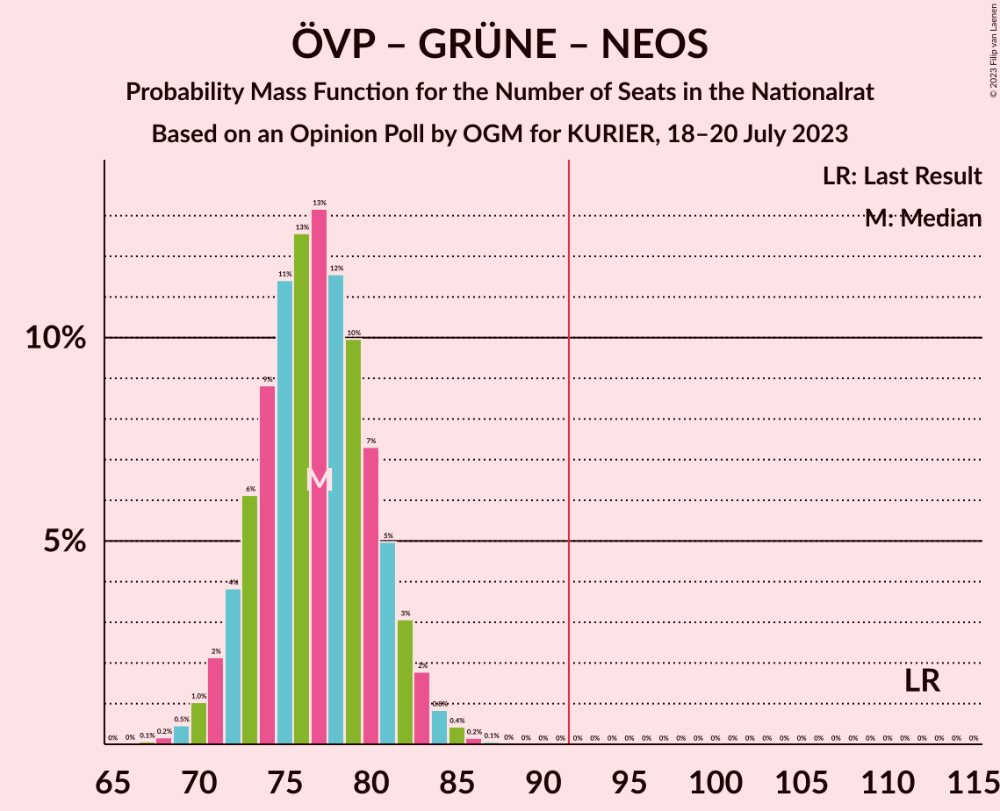

# Opinion Poll by OGM for KURIER, 18–20 July 2023

<a href="#voting-intentions">Voting Intentions</a> | <a href="#seats">Seats</a> | <a href="#coalitions">Coalitions</a> | <a href="#technical-information">Technical Information</a>

## Voting Intentions

### Confidence Intervals

| Party | Last Result | Poll Result | 80% Confidence Interval | 90% Confidence Interval | 95% Confidence Interval | 99% Confidence Interval |
|:-----:|:-----------:|:-----------:|:-----------------------:|:-----------------------:|:-----------------------:|:-----------------------:|
| Freiheitliche Partei Österreichs | 16.2% | 27.0% | 25.1–28.9% |24.6–29.4% |24.2–29.9% |23.3–30.9% |
| Sozialdemokratische Partei Österreichs | 21.2% | 25.0% | 23.2–26.9% |22.7–27.4% |22.3–27.9% |21.5–28.8% |
| Österreichische Volkspartei | 37.5% | 24.0% | 22.3–25.9% |21.8–26.4% |21.4–26.9% |20.6–27.8% |
| NEOS–Das Neue Österreich und Liberales Forum | 8.1% | 9.0% | 7.9–10.3% |7.6–10.7% |7.3–11.1% |6.8–11.7% |
| Die Grünen–Die Grüne Alternative | 13.9% | 9.0% | 7.9–10.3% |7.6–10.7% |7.3–11.1% |6.8–11.7% |

*Note:* The poll result column reflects the actual value used in the calculations. Published results may vary slightly, and in addition be rounded to fewer digits.

## Seats

### Confidence Intervals

| Party | Last Result | Median | 80% Confidence Interval | 90% Confidence Interval | 95% Confidence Interval | 99% Confidence Interval |
|:-----:|:-----------:|:------:|:-----------------------:|:-----------------------:|:-----------------------:|:-----------------------:|
| <a href="#freiheitliche-partei-österreichs">Freiheitliche Partei Österreichs</a> | 31 | 50 | 46–53 |45–54 |44–55 |43–57 |
| <a href="#sozialdemokratische-partei-österreichs">Sozialdemokratische Partei Österreichs</a> | 40 | 46 | 42–49 |42–50 |41–51 |39–53 |
| <a href="#österreichische-volkspartei">Österreichische Volkspartei</a> | 71 | 44 | 41–47 |40–48 |39–49 |38–51 |
| <a href="#neos–das-neue-österreich-und-liberales-forum">NEOS–Das Neue Österreich und Liberales Forum</a> | 15 | 17 | 15–18 |13–20 |13–20 |12–20 |
| <a href="#die-grünen–die-grüne-alternative">Die Grünen–Die Grüne Alternative</a> | 26 | 16 | 14–19 |14–19 |13–20 |12–21 |

### Freiheitliche Partei Österreichs

*For a full overview of the results for this party, see the [Freiheitliche Partei Österreichs](party-freiheitlicheparteiösterreichs.html) page.*

| Number of Seats | Probability | Accumulated | Special Marks |
|:---------------:|:-----------:|:-----------:|:-------------:|
| 31 | 0% | 100% | Last Result |
| 32 | 0% | 100% |  |
| 33 | 0% | 100% |  |
| 34 | 0% | 100% |  |
| 35 | 0% | 100% |  |
| 36 | 0% | 100% |  |
| 37 | 0% | 100% |  |
| 38 | 0% | 100% |  |
| 39 | 0% | 100% |  |
| 40 | 0% | 100% |  |
| 41 | 0.1% | 100% |  |
| 42 | 0.3% | 99.9% |  |
| 43 | 0.8% | 99.6% |  |
| 44 | 2% | 98.8% |  |
| 45 | 4% | 97% |  |
| 46 | 7% | 93% |  |
| 47 | 10% | 86% |  |
| 48 | 12% | 77% |  |
| 49 | 15% | 65% |  |
| 50 | 14% | 50% | Median |
| 51 | 13% | 36% |  |
| 52 | 10% | 23% |  |
| 53 | 6% | 13% |  |
| 54 | 4% | 7% |  |
| 55 | 2% | 4% |  |
| 56 | 1.0% | 2% |  |
| 57 | 0.4% | 0.6% |  |
| 58 | 0.1% | 0.2% |  |
| 59 | 0% | 0.1% |  |
| 60 | 0% | 0% |  |

### Sozialdemokratische Partei Österreichs

*For a full overview of the results for this party, see the [Sozialdemokratische Partei Österreichs](party-sozialdemokratischeparteiösterreichs.html) page.*

| Number of Seats | Probability | Accumulated | Special Marks |
|:---------------:|:-----------:|:-----------:|:-------------:|
| 38 | 0.1% | 100% |  |
| 39 | 0.4% | 99.8% |  |
| 40 | 1.3% | 99.4% | Last Result |
| 41 | 3% | 98% |  |
| 42 | 5% | 95% |  |
| 43 | 8% | 90% |  |
| 44 | 11% | 81% |  |
| 45 | 15% | 71% |  |
| 46 | 13% | 56% | Median |
| 47 | 15% | 43% |  |
| 48 | 12% | 28% |  |
| 49 | 8% | 17% |  |
| 50 | 4% | 9% |  |
| 51 | 3% | 4% |  |
| 52 | 1.0% | 2% |  |
| 53 | 0.5% | 0.8% |  |
| 54 | 0.2% | 0.3% |  |
| 55 | 0.1% | 0.1% |  |
| 56 | 0% | 0% |  |

### Österreichische Volkspartei

*For a full overview of the results for this party, see the [Österreichische Volkspartei](party-österreichischevolkspartei.html) page.*

| Number of Seats | Probability | Accumulated | Special Marks |
|:---------------:|:-----------:|:-----------:|:-------------:|
| 36 | 0.1% | 100% |  |
| 37 | 0.3% | 99.9% |  |
| 38 | 1.0% | 99.5% |  |
| 39 | 2% | 98.6% |  |
| 40 | 5% | 96% |  |
| 41 | 8% | 92% |  |
| 42 | 11% | 84% |  |
| 43 | 14% | 73% |  |
| 44 | 15% | 59% | Median |
| 45 | 14% | 43% |  |
| 46 | 11% | 29% |  |
| 47 | 8% | 18% |  |
| 48 | 5% | 10% |  |
| 49 | 3% | 5% |  |
| 50 | 1.3% | 2% |  |
| 51 | 0.6% | 0.9% |  |
| 52 | 0.2% | 0.3% |  |
| 53 | 0.1% | 0.1% |  |
| 54 | 0% | 0% |  |
| 55 | 0% | 0% |  |
| 56 | 0% | 0% |  |
| 57 | 0% | 0% |  |
| 58 | 0% | 0% |  |
| 59 | 0% | 0% |  |
| 60 | 0% | 0% |  |
| 61 | 0% | 0% |  |
| 62 | 0% | 0% |  |
| 63 | 0% | 0% |  |
| 64 | 0% | 0% |  |
| 65 | 0% | 0% |  |
| 66 | 0% | 0% |  |
| 67 | 0% | 0% |  |
| 68 | 0% | 0% |  |
| 69 | 0% | 0% |  |
| 70 | 0% | 0% |  |
| 71 | 0% | 0% | Last Result |

### NEOS–Das Neue Österreich und Liberales Forum

*For a full overview of the results for this party, see the [NEOS–Das Neue Österreich und Liberales Forum](party-neos–dasneueösterreichundliberalesforum.html) page.*

| Number of Seats | Probability | Accumulated | Special Marks |
|:---------------:|:-----------:|:-----------:|:-------------:|
| 12 | 0.8% | 100% |  |
| 13 | 5% | 99.1% |  |
| 14 | 0.2% | 95% |  |
| 15 | 41% | 94% | Last Result |
| 16 | 2% | 53% |  |
| 17 | 25% | 51% | Median |
| 18 | 18% | 26% |  |
| 19 | 0.5% | 8% |  |
| 20 | 7% | 8% |  |
| 21 | 0.1% | 0.4% |  |
| 22 | 0.3% | 0.4% |  |
| 23 | 0.1% | 0.1% |  |
| 24 | 0% | 0% |  |

### Die Grünen–Die Grüne Alternative

*For a full overview of the results for this party, see the [Die Grünen–Die Grüne Alternative](party-diegrünen–diegrünealternative.html) page.*

| Number of Seats | Probability | Accumulated | Special Marks |
|:---------------:|:-----------:|:-----------:|:-------------:|
| 11 | 0.1% | 100% |  |
| 12 | 0.7% | 99.9% |  |
| 13 | 3% | 99.1% |  |
| 14 | 11% | 96% |  |
| 15 | 20% | 86% |  |
| 16 | 20% | 65% | Median |
| 17 | 18% | 45% |  |
| 18 | 16% | 28% |  |
| 19 | 8% | 11% |  |
| 20 | 2% | 4% |  |
| 21 | 0.8% | 1.2% |  |
| 22 | 0.3% | 0.4% |  |
| 23 | 0.1% | 0.1% |  |
| 24 | 0% | 0% |  |
| 25 | 0% | 0% |  |
| 26 | 0% | 0% | Last Result |

## Coalitions

### Confidence Intervals

| Coalition | Last Result | Median | Majority? | 80% Confidence Interval | 90% Confidence Interval | 95% Confidence Interval | 99% Confidence Interval |
|:---------:|:-----------:|:------:|:---------:|:-----------------------:|:-----------------------:|:-----------------------:|:-----------------------:|
| Freiheitliche Partei Österreichs – Sozialdemokratische Partei Österreichs | 71 | 95 | 90% | 91–99 | 90–100 | 89–101 | 87–103 |
| Freiheitliche Partei Österreichs – Österreichische Volkspartei | 102 | 94 | 76% | 90–98 | 89–99 | 88–100 | 86–102 |
| Sozialdemokratische Partei Österreichs – Österreichische Volkspartei | 111 | 90 | 32% | 86–94 | 85–95 | 84–96 | 82–98 |
| Sozialdemokratische Partei Österreichs – Die Grünen–Die Grüne Alternative – NEOS–Das Neue Österreich und Liberales Forum | 81 | 79 | 0% | 75–82 | 74–84 | 73–85 | 71–87 |
| Österreichische Volkspartei – Die Grünen–Die Grüne Alternative – NEOS–Das Neue Österreich und Liberales Forum | 112 | 77 | 0% | 73–81 | 72–82 | 71–83 | 69–85 |
| Sozialdemokratische Partei Österreichs – Die Grünen–Die Grüne Alternative | 66 | 62 | 0% | 58–66 | 58–67 | 56–68 | 55–70 |
| Österreichische Volkspartei – Die Grünen–Die Grüne Alternative | 97 | 60 | 0% | 57–64 | 56–65 | 55–66 | 53–68 |
| Österreichische Volkspartei – NEOS–Das Neue Österreich und Liberales Forum | 86 | 60 | 0% | 57–64 | 56–65 | 55–66 | 53–68 |
| Sozialdemokratische Partei Österreichs | 40 | 46 | 0% | 42–49 | 42–50 | 41–51 | 39–53 |
| Österreichische Volkspartei | 71 | 44 | 0% | 41–47 | 40–48 | 39–49 | 38–51 |

### Freiheitliche Partei Österreichs – Sozialdemokratische Partei Österreichs

| Number of Seats | Probability | Accumulated | Special Marks |
|:---------------:|:-----------:|:-----------:|:-------------:|
| 71 | 0% | 100% | Last Result |
| 72 | 0% | 100% |  |
| 73 | 0% | 100% |  |
| 74 | 0% | 100% |  |
| 75 | 0% | 100% |  |
| 76 | 0% | 100% |  |
| 77 | 0% | 100% |  |
| 78 | 0% | 100% |  |
| 79 | 0% | 100% |  |
| 80 | 0% | 100% |  |
| 81 | 0% | 100% |  |
| 82 | 0% | 100% |  |
| 83 | 0% | 100% |  |
| 84 | 0% | 100% |  |
| 85 | 0% | 100% |  |
| 86 | 0.1% | 99.9% |  |
| 87 | 0.3% | 99.8% |  |
| 88 | 0.7% | 99.5% |  |
| 89 | 2% | 98.7% |  |
| 90 | 3% | 97% |  |
| 91 | 4% | 94% |  |
| 92 | 7% | 90% | Majority |
| 93 | 9% | 83% |  |
| 94 | 12% | 74% |  |
| 95 | 13% | 62% |  |
| 96 | 13% | 50% | Median |
| 97 | 11% | 37% |  |
| 98 | 10% | 26% |  |
| 99 | 7% | 16% |  |
| 100 | 4% | 9% |  |
| 101 | 3% | 5% |  |
| 102 | 1.4% | 2% |  |
| 103 | 0.6% | 1.1% |  |
| 104 | 0.3% | 0.4% |  |
| 105 | 0.1% | 0.2% |  |
| 106 | 0% | 0.1% |  |
| 107 | 0% | 0% |  |

### Freiheitliche Partei Österreichs – Österreichische Volkspartei

| Number of Seats | Probability | Accumulated | Special Marks |
|:---------------:|:-----------:|:-----------:|:-------------:|
| 83 | 0% | 100% |  |
| 84 | 0.1% | 99.9% |  |
| 85 | 0.3% | 99.9% |  |
| 86 | 0.6% | 99.6% |  |
| 87 | 1.3% | 98.9% |  |
| 88 | 2% | 98% |  |
| 89 | 4% | 95% |  |
| 90 | 6% | 91% |  |
| 91 | 9% | 85% |  |
| 92 | 11% | 76% | Majority |
| 93 | 13% | 65% |  |
| 94 | 14% | 52% | Median |
| 95 | 11% | 39% |  |
| 96 | 10% | 27% |  |
| 97 | 7% | 17% |  |
| 98 | 5% | 10% |  |
| 99 | 3% | 6% |  |
| 100 | 1.4% | 3% |  |
| 101 | 0.8% | 1.3% |  |
| 102 | 0.3% | 0.5% | Last Result |
| 103 | 0.1% | 0.2% |  |
| 104 | 0.1% | 0.1% |  |
| 105 | 0% | 0% |  |

### Sozialdemokratische Partei Österreichs – Österreichische Volkspartei

| Number of Seats | Probability | Accumulated | Special Marks |
|:---------------:|:-----------:|:-----------:|:-------------:|
| 80 | 0.1% | 100% |  |
| 81 | 0.2% | 99.9% |  |
| 82 | 0.4% | 99.7% |  |
| 83 | 1.0% | 99.3% |  |
| 84 | 2% | 98% |  |
| 85 | 3% | 96% |  |
| 86 | 6% | 93% |  |
| 87 | 8% | 87% |  |
| 88 | 10% | 80% |  |
| 89 | 12% | 69% |  |
| 90 | 13% | 57% | Median |
| 91 | 12% | 44% |  |
| 92 | 11% | 32% | Majority |
| 93 | 8% | 21% |  |
| 94 | 6% | 13% |  |
| 95 | 3% | 7% |  |
| 96 | 2% | 4% |  |
| 97 | 1.0% | 2% |  |
| 98 | 0.4% | 0.8% |  |
| 99 | 0.2% | 0.3% |  |
| 100 | 0.1% | 0.1% |  |
| 101 | 0% | 0% |  |
| 102 | 0% | 0% |  |
| 103 | 0% | 0% |  |
| 104 | 0% | 0% |  |
| 105 | 0% | 0% |  |
| 106 | 0% | 0% |  |
| 107 | 0% | 0% |  |
| 108 | 0% | 0% |  |
| 109 | 0% | 0% |  |
| 110 | 0% | 0% |  |
| 111 | 0% | 0% | Last Result |

### Sozialdemokratische Partei Österreichs – Die Grünen–Die Grüne Alternative – NEOS–Das Neue Österreich und Liberales Forum

| Number of Seats | Probability | Accumulated | Special Marks |
|:---------------:|:-----------:|:-----------:|:-------------:|
| 69 | 0.1% | 100% |  |
| 70 | 0.3% | 99.9% |  |
| 71 | 0.4% | 99.6% |  |
| 72 | 1.1% | 99.2% |  |
| 73 | 3% | 98% |  |
| 74 | 3% | 95% |  |
| 75 | 6% | 92% |  |
| 76 | 12% | 86% |  |
| 77 | 8% | 74% |  |
| 78 | 15% | 66% |  |
| 79 | 16% | 51% | Median |
| 80 | 8% | 36% |  |
| 81 | 11% | 28% | Last Result |
| 82 | 7% | 17% |  |
| 83 | 3% | 10% |  |
| 84 | 3% | 6% |  |
| 85 | 2% | 3% |  |
| 86 | 0.6% | 1.2% |  |
| 87 | 0.4% | 0.6% |  |
| 88 | 0.1% | 0.2% |  |
| 89 | 0% | 0.1% |  |
| 90 | 0% | 0% |  |

### Österreichische Volkspartei – Die Grünen–Die Grüne Alternative – NEOS–Das Neue Österreich und Liberales Forum

| Number of Seats | Probability | Accumulated | Special Marks |
|:---------------:|:-----------:|:-----------:|:-------------:|
| 67 | 0.1% | 100% |  |
| 68 | 0.2% | 99.9% |  |
| 69 | 0.5% | 99.7% |  |
| 70 | 1.0% | 99.3% |  |
| 71 | 2% | 98% |  |
| 72 | 4% | 96% |  |
| 73 | 6% | 92% |  |
| 74 | 9% | 86% |  |
| 75 | 11% | 77% |  |
| 76 | 13% | 66% |  |
| 77 | 13% | 53% | Median |
| 78 | 12% | 40% |  |
| 79 | 10% | 29% |  |
| 80 | 7% | 19% |  |
| 81 | 5% | 11% |  |
| 82 | 3% | 6% |  |
| 83 | 2% | 3% |  |
| 84 | 0.8% | 2% |  |
| 85 | 0.4% | 0.7% |  |
| 86 | 0.2% | 0.2% |  |
| 87 | 0.1% | 0.1% |  |
| 88 | 0% | 0% |  |
| 89 | 0% | 0% |  |
| 90 | 0% | 0% |  |
| 91 | 0% | 0% |  |
| 92 | 0% | 0% | Majority |
| 93 | 0% | 0% |  |
| 94 | 0% | 0% |  |
| 95 | 0% | 0% |  |
| 96 | 0% | 0% |  |
| 97 | 0% | 0% |  |
| 98 | 0% | 0% |  |
| 99 | 0% | 0% |  |
| 100 | 0% | 0% |  |
| 101 | 0% | 0% |  |
| 102 | 0% | 0% |  |
| 103 | 0% | 0% |  |
| 104 | 0% | 0% |  |
| 105 | 0% | 0% |  |
| 106 | 0% | 0% |  |
| 107 | 0% | 0% |  |
| 108 | 0% | 0% |  |
| 109 | 0% | 0% |  |
| 110 | 0% | 0% |  |
| 111 | 0% | 0% |  |
| 112 | 0% | 0% | Last Result |

### Sozialdemokratische Partei Österreichs – Die Grünen–Die Grüne Alternative

| Number of Seats | Probability | Accumulated | Special Marks |
|:---------------:|:-----------:|:-----------:|:-------------:|
| 53 | 0.1% | 100% |  |
| 54 | 0.1% | 99.9% |  |
| 55 | 0.6% | 99.8% |  |
| 56 | 2% | 99.1% |  |
| 57 | 2% | 97% |  |
| 58 | 6% | 96% |  |
| 59 | 7% | 90% |  |
| 60 | 8% | 82% |  |
| 61 | 16% | 74% |  |
| 62 | 11% | 59% | Median |
| 63 | 13% | 48% |  |
| 64 | 15% | 35% |  |
| 65 | 5% | 20% |  |
| 66 | 7% | 15% | Last Result |
| 67 | 4% | 8% |  |
| 68 | 1.1% | 3% |  |
| 69 | 1.4% | 2% |  |
| 70 | 0.4% | 0.7% |  |
| 71 | 0.1% | 0.2% |  |
| 72 | 0.1% | 0.1% |  |
| 73 | 0% | 0% |  |

### Österreichische Volkspartei – Die Grünen–Die Grüne Alternative

| Number of Seats | Probability | Accumulated | Special Marks |
|:---------------:|:-----------:|:-----------:|:-------------:|
| 51 | 0.1% | 100% |  |
| 52 | 0.2% | 99.9% |  |
| 53 | 0.4% | 99.8% |  |
| 54 | 1.1% | 99.3% |  |
| 55 | 2% | 98% |  |
| 56 | 4% | 96% |  |
| 57 | 7% | 92% |  |
| 58 | 10% | 84% |  |
| 59 | 12% | 74% |  |
| 60 | 13% | 62% | Median |
| 61 | 13% | 49% |  |
| 62 | 12% | 36% |  |
| 63 | 9% | 24% |  |
| 64 | 6% | 15% |  |
| 65 | 4% | 8% |  |
| 66 | 2% | 4% |  |
| 67 | 1.2% | 2% |  |
| 68 | 0.5% | 0.8% |  |
| 69 | 0.2% | 0.3% |  |
| 70 | 0.1% | 0.1% |  |
| 71 | 0% | 0% |  |
| 72 | 0% | 0% |  |
| 73 | 0% | 0% |  |
| 74 | 0% | 0% |  |
| 75 | 0% | 0% |  |
| 76 | 0% | 0% |  |
| 77 | 0% | 0% |  |
| 78 | 0% | 0% |  |
| 79 | 0% | 0% |  |
| 80 | 0% | 0% |  |
| 81 | 0% | 0% |  |
| 82 | 0% | 0% |  |
| 83 | 0% | 0% |  |
| 84 | 0% | 0% |  |
| 85 | 0% | 0% |  |
| 86 | 0% | 0% |  |
| 87 | 0% | 0% |  |
| 88 | 0% | 0% |  |
| 89 | 0% | 0% |  |
| 90 | 0% | 0% |  |
| 91 | 0% | 0% |  |
| 92 | 0% | 0% | Majority |
| 93 | 0% | 0% |  |
| 94 | 0% | 0% |  |
| 95 | 0% | 0% |  |
| 96 | 0% | 0% |  |
| 97 | 0% | 0% | Last Result |

### Österreichische Volkspartei – NEOS–Das Neue Österreich und Liberales Forum

| Number of Seats | Probability | Accumulated | Special Marks |
|:---------------:|:-----------:|:-----------:|:-------------:|
| 51 | 0.1% | 100% |  |
| 52 | 0.2% | 99.9% |  |
| 53 | 0.5% | 99.8% |  |
| 54 | 1.1% | 99.3% |  |
| 55 | 2% | 98% |  |
| 56 | 4% | 96% |  |
| 57 | 7% | 91% |  |
| 58 | 10% | 85% |  |
| 59 | 12% | 75% |  |
| 60 | 14% | 63% |  |
| 61 | 14% | 49% | Median |
| 62 | 11% | 35% |  |
| 63 | 9% | 23% |  |
| 64 | 6% | 15% |  |
| 65 | 4% | 8% |  |
| 66 | 2% | 4% |  |
| 67 | 1.1% | 2% |  |
| 68 | 0.5% | 0.8% |  |
| 69 | 0.2% | 0.3% |  |
| 70 | 0.1% | 0.1% |  |
| 71 | 0% | 0% |  |
| 72 | 0% | 0% |  |
| 73 | 0% | 0% |  |
| 74 | 0% | 0% |  |
| 75 | 0% | 0% |  |
| 76 | 0% | 0% |  |
| 77 | 0% | 0% |  |
| 78 | 0% | 0% |  |
| 79 | 0% | 0% |  |
| 80 | 0% | 0% |  |
| 81 | 0% | 0% |  |
| 82 | 0% | 0% |  |
| 83 | 0% | 0% |  |
| 84 | 0% | 0% |  |
| 85 | 0% | 0% |  |
| 86 | 0% | 0% | Last Result |

### Sozialdemokratische Partei Österreichs

| Number of Seats | Probability | Accumulated | Special Marks |
|:---------------:|:-----------:|:-----------:|:-------------:|
| 38 | 0.1% | 100% |  |
| 39 | 0.4% | 99.8% |  |
| 40 | 1.3% | 99.4% | Last Result |
| 41 | 3% | 98% |  |
| 42 | 5% | 95% |  |
| 43 | 8% | 90% |  |
| 44 | 11% | 81% |  |
| 45 | 15% | 71% |  |
| 46 | 13% | 56% | Median |
| 47 | 15% | 43% |  |
| 48 | 12% | 28% |  |
| 49 | 8% | 17% |  |
| 50 | 4% | 9% |  |
| 51 | 3% | 4% |  |
| 52 | 1.0% | 2% |  |
| 53 | 0.5% | 0.8% |  |
| 54 | 0.2% | 0.3% |  |
| 55 | 0.1% | 0.1% |  |
| 56 | 0% | 0% |  |

### Österreichische Volkspartei

| Number of Seats | Probability | Accumulated | Special Marks |
|:---------------:|:-----------:|:-----------:|:-------------:|
| 36 | 0.1% | 100% |  |
| 37 | 0.3% | 99.9% |  |
| 38 | 1.0% | 99.5% |  |
| 39 | 2% | 98.6% |  |
| 40 | 5% | 96% |  |
| 41 | 8% | 92% |  |
| 42 | 11% | 84% |  |
| 43 | 14% | 73% |  |
| 44 | 15% | 59% | Median |
| 45 | 14% | 43% |  |
| 46 | 11% | 29% |  |
| 47 | 8% | 18% |  |
| 48 | 5% | 10% |  |
| 49 | 3% | 5% |  |
| 50 | 1.3% | 2% |  |
| 51 | 0.6% | 0.9% |  |
| 52 | 0.2% | 0.3% |  |
| 53 | 0.1% | 0.1% |  |
| 54 | 0% | 0% |  |
| 55 | 0% | 0% |  |
| 56 | 0% | 0% |  |
| 57 | 0% | 0% |  |
| 58 | 0% | 0% |  |
| 59 | 0% | 0% |  |
| 60 | 0% | 0% |  |
| 61 | 0% | 0% |  |
| 62 | 0% | 0% |  |
| 63 | 0% | 0% |  |
| 64 | 0% | 0% |  |
| 65 | 0% | 0% |  |
| 66 | 0% | 0% |  |
| 67 | 0% | 0% |  |
| 68 | 0% | 0% |  |
| 69 | 0% | 0% |  |
| 70 | 0% | 0% |  |
| 71 | 0% | 0% | Last Result |

## Technical Information

### Opinion Poll

+ **Polling firm:** OGM
+ **Commissioner(s):** KURIER
+ **Fieldwork period:** 18–20 July 2023

### Calculations

+ **Sample size:** 920
+ **Simulations done:** 1,048,576
+ **Error estimate:** 0.56%

