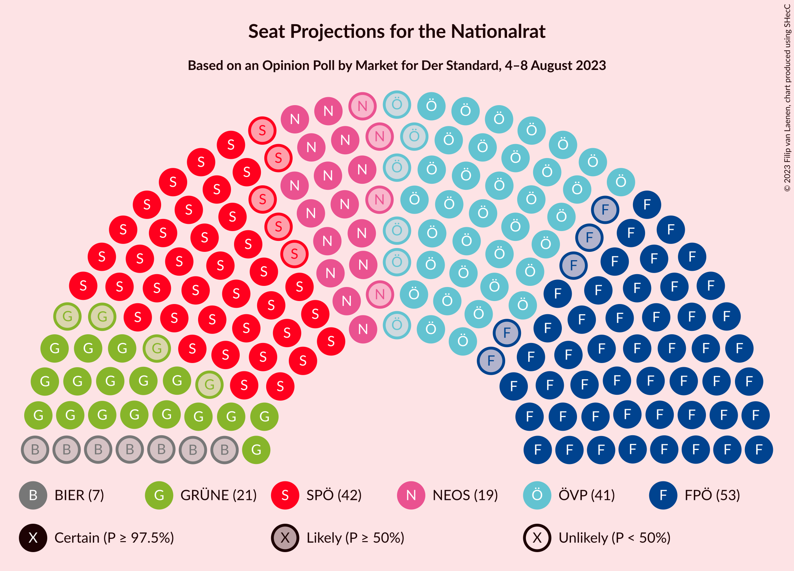

# Opinion Poll by Market for Der Standard, 4–8 August 2023

<a href="#voting-intentions">Voting Intentions</a> | <a href="#seats">Seats</a> | <a href="#coalitions">Coalitions</a> | <a href="#technical-information">Technical Information</a>

## Voting Intentions

### Confidence Intervals

| Party | Last Result | Poll Result | 80% Confidence Interval | 90% Confidence Interval | 95% Confidence Interval | 99% Confidence Interval |
|:-----:|:-----------:|:-----------:|:-----------------------:|:-----------------------:|:-----------------------:|:-----------------------:|
| Freiheitliche Partei Österreichs | 16.2% | 28.0% | 26.0–30.1% |25.4–30.6% |25.0–31.2% |24.0–32.2% |
| Sozialdemokratische Partei Österreichs | 21.2% | 22.0% | 20.2–23.9% |19.7–24.5% |19.3–25.0% |18.4–25.9% |
| Österreichische Volkspartei | 37.5% | 21.0% | 19.2–22.9% |18.7–23.5% |18.3–23.9% |17.5–24.9% |
| Die Grünen–Die Grüne Alternative | 13.9% | 11.1% | 9.8–12.6% |9.4–13.0% |9.1–13.4% |8.5–14.2% |
| NEOS–Das Neue Österreich und Liberales Forum | 8.1% | 10.1% | 8.8–11.6% |8.5–12.0% |8.2–12.3% |7.6–13.1% |
| Bierpartei | 0.0% | 4.0% | 3.2–5.0% |3.0–5.3% |2.8–5.6% |2.5–6.1% |
| Kommunistische Partei Österreichs | N/A | 3.0% | 2.3–3.9% |2.2–4.2% |2.0–4.4% |1.7–4.9% |

*Note:* The poll result column reflects the actual value used in the calculations. Published results may vary slightly, and in addition be rounded to fewer digits.

## Seats

### Confidence Intervals

| Party | Last Result | Median | 80% Confidence Interval | 90% Confidence Interval | 95% Confidence Interval | 99% Confidence Interval |
|:-----:|:-----------:|:------:|:-----------------------:|:-----------------------:|:-----------------------:|:-----------------------:|
| <a href="#freiheitliche-partei-österreichs">Freiheitliche Partei Österreichs</a> | 31 | 54 | 50–59 |49–60 |48–61 |46–63 |
| <a href="#sozialdemokratische-partei-österreichs">Sozialdemokratische Partei Österreichs</a> | 40 | 43 | 39–46 |38–48 |37–49 |35–51 |
| <a href="#österreichische-volkspartei">Österreichische Volkspartei</a> | 71 | 41 | 37–44 |36–45 |35–47 |33–49 |
| <a href="#die-grünen–die-grüne-alternative">Die Grünen–Die Grüne Alternative</a> | 26 | 21 | 18–24 |18–25 |17–26 |16–27 |
| <a href="#neos–das-neue-österreich-und-liberales-forum">NEOS–Das Neue Österreich und Liberales Forum</a> | 15 | 19 | 17–22 |16–23 |15–24 |14–25 |
| <a href="#bierpartei">Bierpartei</a> | 0 | 7 | 0–9 |0–10 |0–10 |0–11 |
| <a href="#kommunistische-partei-österreichs">Kommunistische Partei Österreichs</a> | N/A | 0 | 0 |0–7 |0–8 |0–9 |

