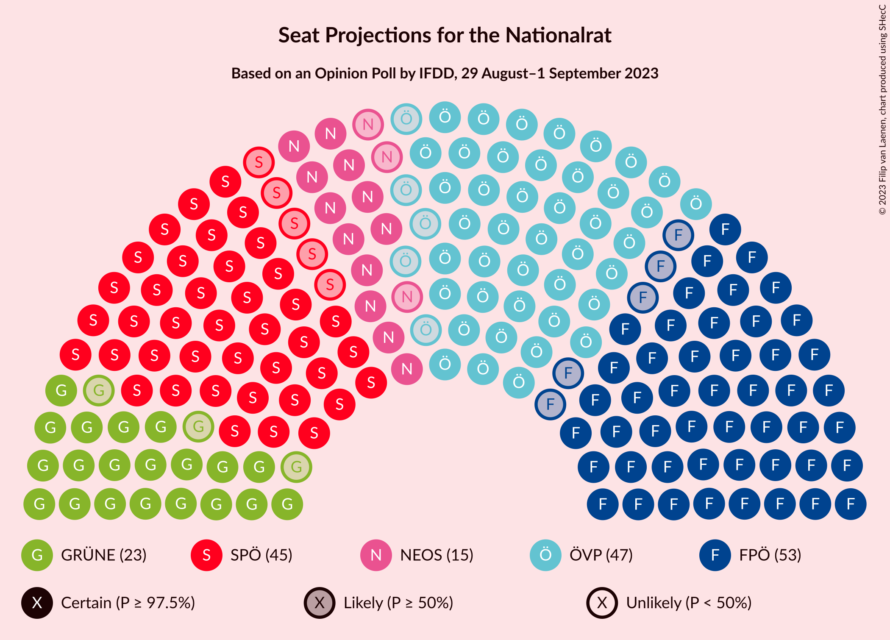

# Opinion Poll by IFDD, 29 August–1 September 2023

<a href="#voting-intentions">Voting Intentions</a> | <a href="#seats">Seats</a> | <a href="#coalitions">Coalitions</a> | <a href="#technical-information">Technical Information</a>

## Voting Intentions

### Confidence Intervals

| Party | Last Result | Poll Result | 80% Confidence Interval | 90% Confidence Interval | 95% Confidence Interval | 99% Confidence Interval |
|:-----:|:-----------:|:-----------:|:-----------------------:|:-----------------------:|:-----------------------:|:-----------------------:|
| Freiheitliche Partei Österreichs | 16.2% | 27.0% | 25.5–28.7% |25.0–29.2% |24.6–29.6% |23.9–30.4% |
| Österreichische Volkspartei | 37.5% | 24.0% | 22.5–25.6% |22.1–26.1% |21.7–26.5% |21.0–27.2% |
| Sozialdemokratische Partei Österreichs | 21.2% | 23.0% | 21.6–24.6% |21.1–25.1% |20.8–25.5% |20.1–26.2% |
| Die Grünen–Die Grüne Alternative | 13.9% | 12.0% | 10.9–13.3% |10.6–13.6% |10.3–13.9% |9.8–14.6% |
| NEOS–Das Neue Österreich und Liberales Forum | 8.1% | 8.0% | 7.1–9.1% |6.8–9.4% |6.6–9.6% |6.2–10.2% |
| Kommunistische Partei Österreichs | N/A | 3.0% | 2.5–3.8% |2.3–4.0% |2.2–4.1% |2.0–4.5% |

*Note:* The poll result column reflects the actual value used in the calculations. Published results may vary slightly, and in addition be rounded to fewer digits.

## Seats

### Confidence Intervals

| Party | Last Result | Median | 80% Confidence Interval | 90% Confidence Interval | 95% Confidence Interval | 99% Confidence Interval |
|:-----:|:-----------:|:------:|:-----------------------:|:-----------------------:|:-----------------------:|:-----------------------:|
| <a href="#freiheitliche-partei-österreichs">Freiheitliche Partei Österreichs</a> | 31 | 53 | 49–56 |49–57 |48–57 |46–59 |
| <a href="#österreichische-volkspartei">Österreichische Volkspartei</a> | 71 | 47 | 44–50 |43–51 |42–51 |41–53 |
| <a href="#sozialdemokratische-partei-österreichs">Sozialdemokratische Partei Österreichs</a> | 40 | 45 | 42–48 |41–49 |40–49 |39–51 |
| <a href="#die-grünen–die-grüne-alternative">Die Grünen–Die Grüne Alternative</a> | 26 | 23 | 21–25 |20–26 |20–27 |19–28 |
| <a href="#neos–das-neue-österreich-und-liberales-forum">NEOS–Das Neue Österreich und Liberales Forum</a> | 15 | 15 | 13–17 |13–18 |12–18 |12–19 |
| <a href="#kommunistische-partei-österreichs">Kommunistische Partei Österreichs</a> | N/A | 0 | 0 |0 |0–7 |0–8 |

