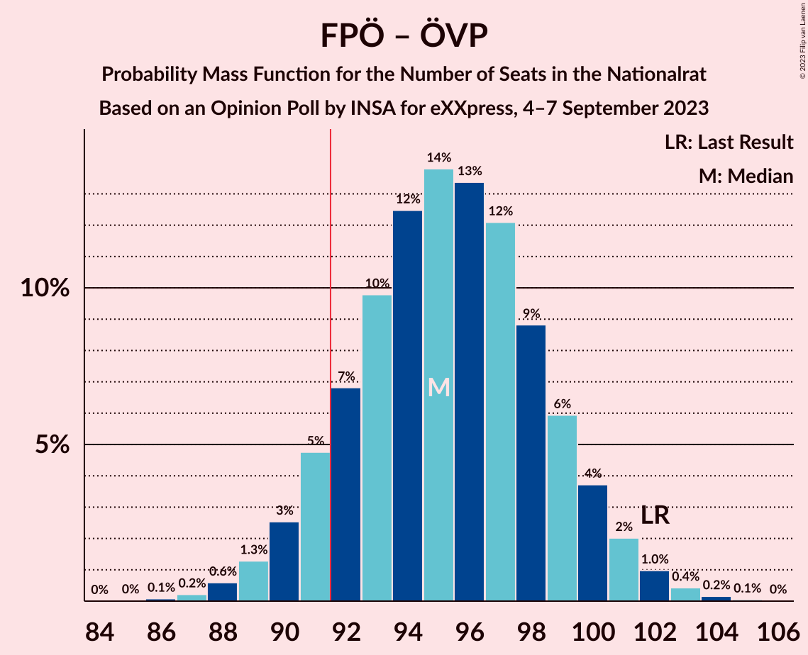

# Opinion Poll by INSA for eXXpress, 4–7 September 2023

<a href="#voting-intentions">Voting Intentions</a> | <a href="#seats">Seats</a> | <a href="#coalitions">Coalitions</a> | <a href="#technical-information">Technical Information</a>

## Voting Intentions

### Confidence Intervals

| Party | Last Result | Poll Result | 80% Confidence Interval | 90% Confidence Interval | 95% Confidence Interval | 99% Confidence Interval |
|:-----:|:-----------:|:-----------:|:-----------------------:|:-----------------------:|:-----------------------:|:-----------------------:|
| Freiheitliche Partei Österreichs | 16.2% | 29.0% | 27.2–30.9% |26.7–31.4% |26.3–31.9% |25.4–32.8% |
| Österreichische Volkspartei | 37.5% | 23.0% | 21.4–24.8% |20.9–25.3% |20.5–25.7% |19.7–26.6% |
| Sozialdemokratische Partei Österreichs | 21.2% | 22.0% | 20.4–23.7% |19.9–24.2% |19.5–24.7% |18.8–25.5% |
| Die Grünen–Die Grüne Alternative | 13.9% | 10.0% | 8.9–11.3% |8.6–11.7% |8.3–12.0% |7.8–12.7% |
| NEOS–Das Neue Österreich und Liberales Forum | 8.1% | 10.0% | 8.9–11.3% |8.6–11.7% |8.3–12.0% |7.8–12.7% |

*Note:* The poll result column reflects the actual value used in the calculations. Published results may vary slightly, and in addition be rounded to fewer digits.

## Seats

### Confidence Intervals

| Party | Last Result | Median | 80% Confidence Interval | 90% Confidence Interval | 95% Confidence Interval | 99% Confidence Interval |
|:-----:|:-----------:|:------:|:-----------------------:|:-----------------------:|:-----------------------:|:-----------------------:|
| <a href="#freiheitliche-partei-österreichs">Freiheitliche Partei Österreichs</a> | 31 | 53 | 50–57 |49–58 |48–58 |47–60 |
| <a href="#österreichische-volkspartei">Österreichische Volkspartei</a> | 71 | 42 | 39–45 |38–46 |37–47 |36–49 |
| <a href="#sozialdemokratische-partei-österreichs">Sozialdemokratische Partei Österreichs</a> | 40 | 40 | 37–43 |36–44 |36–45 |34–47 |
| <a href="#die-grünen–die-grüne-alternative">Die Grünen–Die Grüne Alternative</a> | 26 | 19 | 18–20 |18–20 |14–20 |13–23 |
| <a href="#neos–das-neue-österreich-und-liberales-forum">NEOS–Das Neue Österreich und Liberales Forum</a> | 15 | 18 | 16–20 |15–21 |15–21 |14–23 |

### Freiheitliche Partei Österreichs

*For a full overview of the results for this party, see the [Freiheitliche Partei Österreichs](party-freiheitlicheparteiösterreichs.html) page.*

| Number of Seats | Probability | Accumulated | Special Marks |
|:---------------:|:-----------:|:-----------:|:-------------:|
| 31 | 0% | 100% | Last Result |
| 32 | 0% | 100% |  |
| 33 | 0% | 100% |  |
| 34 | 0% | 100% |  |
| 35 | 0% | 100% |  |
| 36 | 0% | 100% |  |
| 37 | 0% | 100% |  |
| 38 | 0% | 100% |  |
| 39 | 0% | 100% |  |
| 40 | 0% | 100% |  |
| 41 | 0% | 100% |  |
| 42 | 0% | 100% |  |
| 43 | 0% | 100% |  |
| 44 | 0% | 100% |  |
| 45 | 0.1% | 100% |  |
| 46 | 0.4% | 99.9% |  |
| 47 | 0.9% | 99.5% |  |
| 48 | 2% | 98.6% |  |
| 49 | 4% | 96% |  |
| 50 | 8% | 92% |  |
| 51 | 11% | 84% |  |
| 52 | 14% | 74% |  |
| 53 | 15% | 60% | Median |
| 54 | 14% | 45% |  |
| 55 | 11% | 30% |  |
| 56 | 8% | 19% |  |
| 57 | 5% | 11% |  |
| 58 | 3% | 6% |  |
| 59 | 1.5% | 2% |  |
| 60 | 0.6% | 1.0% |  |
| 61 | 0.2% | 0.4% |  |
| 62 | 0.1% | 0.1% |  |
| 63 | 0% | 0% |  |

### Österreichische Volkspartei

*For a full overview of the results for this party, see the [Österreichische Volkspartei](party-österreichischevolkspartei.html) page.*

| Number of Seats | Probability | Accumulated | Special Marks |
|:---------------:|:-----------:|:-----------:|:-------------:|
| 34 | 0% | 100% |  |
| 35 | 0.2% | 99.9% |  |
| 36 | 0.7% | 99.7% |  |
| 37 | 2% | 99.1% |  |
| 38 | 4% | 97% |  |
| 39 | 7% | 93% |  |
| 40 | 11% | 86% |  |
| 41 | 15% | 75% |  |
| 42 | 16% | 60% | Median |
| 43 | 15% | 44% |  |
| 44 | 12% | 28% |  |
| 45 | 8% | 17% |  |
| 46 | 4% | 9% |  |
| 47 | 3% | 4% |  |
| 48 | 1.0% | 2% |  |
| 49 | 0.4% | 0.6% |  |
| 50 | 0.1% | 0.2% |  |
| 51 | 0% | 0.1% |  |
| 52 | 0% | 0% |  |
| 53 | 0% | 0% |  |
| 54 | 0% | 0% |  |
| 55 | 0% | 0% |  |
| 56 | 0% | 0% |  |
| 57 | 0% | 0% |  |
| 58 | 0% | 0% |  |
| 59 | 0% | 0% |  |
| 60 | 0% | 0% |  |
| 61 | 0% | 0% |  |
| 62 | 0% | 0% |  |
| 63 | 0% | 0% |  |
| 64 | 0% | 0% |  |
| 65 | 0% | 0% |  |
| 66 | 0% | 0% |  |
| 67 | 0% | 0% |  |
| 68 | 0% | 0% |  |
| 69 | 0% | 0% |  |
| 70 | 0% | 0% |  |
| 71 | 0% | 0% | Last Result |

### Sozialdemokratische Partei Österreichs

*For a full overview of the results for this party, see the [Sozialdemokratische Partei Österreichs](party-sozialdemokratischeparteiösterreichs.html) page.*

| Number of Seats | Probability | Accumulated | Special Marks |
|:---------------:|:-----------:|:-----------:|:-------------:|
| 33 | 0.1% | 100% |  |
| 34 | 0.5% | 99.8% |  |
| 35 | 1.4% | 99.3% |  |
| 36 | 3% | 98% |  |
| 37 | 7% | 94% |  |
| 38 | 11% | 87% |  |
| 39 | 15% | 77% |  |
| 40 | 17% | 62% | Last Result, Median |
| 41 | 15% | 45% |  |
| 42 | 12% | 30% |  |
| 43 | 9% | 18% |  |
| 44 | 5% | 9% |  |
| 45 | 3% | 4% |  |
| 46 | 1.2% | 2% |  |
| 47 | 0.4% | 0.6% |  |
| 48 | 0.1% | 0.2% |  |
| 49 | 0% | 0.1% |  |
| 50 | 0% | 0% |  |

### Die Grünen–Die Grüne Alternative

*For a full overview of the results for this party, see the [Die Grünen–Die Grüne Alternative](party-diegrünen–diegrünealternative.html) page.*

| Number of Seats | Probability | Accumulated | Special Marks |
|:---------------:|:-----------:|:-----------:|:-------------:|
| 13 | 0.6% | 100% |  |
| 14 | 2% | 99.4% |  |
| 15 | 0.5% | 97% |  |
| 16 | 0% | 97% |  |
| 17 | 0.4% | 97% |  |
| 18 | 24% | 97% |  |
| 19 | 61% | 72% | Median |
| 20 | 11% | 12% |  |
| 21 | 0.2% | 0.7% |  |
| 22 | 0% | 0.5% |  |
| 23 | 0.1% | 0.5% |  |
| 24 | 0.4% | 0.5% |  |
| 25 | 0.1% | 0.1% |  |
| 26 | 0% | 0% | Last Result |

### NEOS–Das Neue Österreich und Liberales Forum

*For a full overview of the results for this party, see the [NEOS–Das Neue Österreich und Liberales Forum](party-neos–dasneueösterreichundliberalesforum.html) page.*

| Number of Seats | Probability | Accumulated | Special Marks |
|:---------------:|:-----------:|:-----------:|:-------------:|
| 13 | 0.2% | 100% |  |
| 14 | 1.4% | 99.8% |  |
| 15 | 5% | 98% | Last Result |
| 16 | 12% | 93% |  |
| 17 | 22% | 81% |  |
| 18 | 23% | 58% | Median |
| 19 | 18% | 35% |  |
| 20 | 11% | 17% |  |
| 21 | 4% | 6% |  |
| 22 | 2% | 2% |  |
| 23 | 0.5% | 0.6% |  |
| 24 | 0.1% | 0.2% |  |
| 25 | 0% | 0% |  |

## Coalitions

### Confidence Intervals

| Coalition | Last Result | Median | Majority? | 80% Confidence Interval | 90% Confidence Interval | 95% Confidence Interval | 99% Confidence Interval |
|:---------:|:-----------:|:------:|:---------:|:-----------------------:|:-----------------------:|:-----------------------:|:-----------------------:|
| Freiheitliche Partei Österreichs – Österreichische Volkspartei | 102 | 95 | 90% | 92–99 | 91–100 | 90–101 | 88–103 |
| Freiheitliche Partei Österreichs – Sozialdemokratische Partei Österreichs | 71 | 93 | 75% | 90–97 | 89–98 | 88–99 | 86–101 |
| Österreichische Volkspartei – Sozialdemokratische Partei Österreichs | 111 | 82 | 0.1% | 79–86 | 78–87 | 77–88 | 75–90 |
| Österreichische Volkspartei – Die Grünen–Die Grüne Alternative – NEOS–Das Neue Österreich und Liberales Forum | 112 | 79 | 0% | 75–82 | 74–83 | 73–84 | 71–86 |
| Sozialdemokratische Partei Österreichs – Die Grünen–Die Grüne Alternative – NEOS–Das Neue Österreich und Liberales Forum | 81 | 77 | 0% | 73–81 | 72–82 | 71–83 | 70–84 |
| Österreichische Volkspartei – Die Grünen–Die Grüne Alternative | 97 | 61 | 0% | 58–64 | 57–65 | 56–66 | 54–67 |
| Österreichische Volkspartei – NEOS–Das Neue Österreich und Liberales Forum | 86 | 60 | 0% | 57–63 | 56–64 | 55–65 | 53–67 |
| Sozialdemokratische Partei Österreichs – Die Grünen–Die Grüne Alternative | 66 | 59 | 0% | 56–62 | 55–63 | 54–64 | 52–66 |
| Österreichische Volkspartei | 71 | 42 | 0% | 39–45 | 38–46 | 37–47 | 36–49 |
| Sozialdemokratische Partei Österreichs | 40 | 40 | 0% | 37–43 | 36–44 | 36–45 | 34–47 |

### Freiheitliche Partei Österreichs – Österreichische Volkspartei

| Number of Seats | Probability | Accumulated | Special Marks |
|:---------------:|:-----------:|:-----------:|:-------------:|
| 86 | 0.1% | 100% |  |
| 87 | 0.2% | 99.9% |  |
| 88 | 0.6% | 99.7% |  |
| 89 | 1.3% | 99.1% |  |
| 90 | 3% | 98% |  |
| 91 | 5% | 95% |  |
| 92 | 7% | 90% | Majority |
| 93 | 10% | 84% |  |
| 94 | 12% | 74% |  |
| 95 | 14% | 61% | Median |
| 96 | 13% | 48% |  |
| 97 | 12% | 34% |  |
| 98 | 9% | 22% |  |
| 99 | 6% | 13% |  |
| 100 | 4% | 7% |  |
| 101 | 2% | 4% |  |
| 102 | 1.0% | 2% | Last Result |
| 103 | 0.4% | 0.7% |  |
| 104 | 0.2% | 0.2% |  |
| 105 | 0.1% | 0.1% |  |
| 106 | 0% | 0% |  |

### Freiheitliche Partei Österreichs – Sozialdemokratische Partei Österreichs

| Number of Seats | Probability | Accumulated | Special Marks |
|:---------------:|:-----------:|:-----------:|:-------------:|
| 71 | 0% | 100% | Last Result |
| 72 | 0% | 100% |  |
| 73 | 0% | 100% |  |
| 74 | 0% | 100% |  |
| 75 | 0% | 100% |  |
| 76 | 0% | 100% |  |
| 77 | 0% | 100% |  |
| 78 | 0% | 100% |  |
| 79 | 0% | 100% |  |
| 80 | 0% | 100% |  |
| 81 | 0% | 100% |  |
| 82 | 0% | 100% |  |
| 83 | 0% | 100% |  |
| 84 | 0.1% | 100% |  |
| 85 | 0.2% | 99.9% |  |
| 86 | 0.5% | 99.7% |  |
| 87 | 1.2% | 99.2% |  |
| 88 | 2% | 98% |  |
| 89 | 4% | 96% |  |
| 90 | 7% | 91% |  |
| 91 | 10% | 85% |  |
| 92 | 12% | 75% | Majority |
| 93 | 14% | 63% | Median |
| 94 | 13% | 49% |  |
| 95 | 12% | 36% |  |
| 96 | 9% | 24% |  |
| 97 | 7% | 15% |  |
| 98 | 4% | 8% |  |
| 99 | 2% | 4% |  |
| 100 | 1.1% | 2% |  |
| 101 | 0.5% | 0.8% |  |
| 102 | 0.2% | 0.3% |  |
| 103 | 0.1% | 0.1% |  |
| 104 | 0% | 0% |  |

### Österreichische Volkspartei – Sozialdemokratische Partei Österreichs

| Number of Seats | Probability | Accumulated | Special Marks |
|:---------------:|:-----------:|:-----------:|:-------------:|
| 73 | 0.1% | 100% |  |
| 74 | 0.2% | 99.9% |  |
| 75 | 0.5% | 99.7% |  |
| 76 | 1.2% | 99.2% |  |
| 77 | 3% | 98% |  |
| 78 | 4% | 95% |  |
| 79 | 7% | 91% |  |
| 80 | 10% | 84% |  |
| 81 | 12% | 74% |  |
| 82 | 13% | 62% | Median |
| 83 | 13% | 49% |  |
| 84 | 12% | 35% |  |
| 85 | 9% | 23% |  |
| 86 | 6% | 14% |  |
| 87 | 4% | 8% |  |
| 88 | 2% | 4% |  |
| 89 | 1.1% | 2% |  |
| 90 | 0.5% | 0.7% |  |
| 91 | 0.2% | 0.3% |  |
| 92 | 0.1% | 0.1% | Majority |
| 93 | 0% | 0% |  |
| 94 | 0% | 0% |  |
| 95 | 0% | 0% |  |
| 96 | 0% | 0% |  |
| 97 | 0% | 0% |  |
| 98 | 0% | 0% |  |
| 99 | 0% | 0% |  |
| 100 | 0% | 0% |  |
| 101 | 0% | 0% |  |
| 102 | 0% | 0% |  |
| 103 | 0% | 0% |  |
| 104 | 0% | 0% |  |
| 105 | 0% | 0% |  |
| 106 | 0% | 0% |  |
| 107 | 0% | 0% |  |
| 108 | 0% | 0% |  |
| 109 | 0% | 0% |  |
| 110 | 0% | 0% |  |
| 111 | 0% | 0% | Last Result |

### Österreichische Volkspartei – Die Grünen–Die Grüne Alternative – NEOS–Das Neue Österreich und Liberales Forum

| Number of Seats | Probability | Accumulated | Special Marks |
|:---------------:|:-----------:|:-----------:|:-------------:|
| 69 | 0% | 100% |  |
| 70 | 0.1% | 99.9% |  |
| 71 | 0.3% | 99.8% |  |
| 72 | 0.8% | 99.5% |  |
| 73 | 2% | 98.6% |  |
| 74 | 4% | 97% |  |
| 75 | 6% | 93% |  |
| 76 | 9% | 87% |  |
| 77 | 11% | 79% |  |
| 78 | 13% | 68% |  |
| 79 | 14% | 54% | Median |
| 80 | 13% | 40% |  |
| 81 | 11% | 28% |  |
| 82 | 7% | 17% |  |
| 83 | 5% | 10% |  |
| 84 | 3% | 5% |  |
| 85 | 1.4% | 2% |  |
| 86 | 0.6% | 1.0% |  |
| 87 | 0.3% | 0.4% |  |
| 88 | 0.1% | 0.1% |  |
| 89 | 0% | 0% |  |
| 90 | 0% | 0% |  |
| 91 | 0% | 0% |  |
| 92 | 0% | 0% | Majority |
| 93 | 0% | 0% |  |
| 94 | 0% | 0% |  |
| 95 | 0% | 0% |  |
| 96 | 0% | 0% |  |
| 97 | 0% | 0% |  |
| 98 | 0% | 0% |  |
| 99 | 0% | 0% |  |
| 100 | 0% | 0% |  |
| 101 | 0% | 0% |  |
| 102 | 0% | 0% |  |
| 103 | 0% | 0% |  |
| 104 | 0% | 0% |  |
| 105 | 0% | 0% |  |
| 106 | 0% | 0% |  |
| 107 | 0% | 0% |  |
| 108 | 0% | 0% |  |
| 109 | 0% | 0% |  |
| 110 | 0% | 0% |  |
| 111 | 0% | 0% |  |
| 112 | 0% | 0% | Last Result |

### Sozialdemokratische Partei Österreichs – Die Grünen–Die Grüne Alternative – NEOS–Das Neue Österreich und Liberales Forum

| Number of Seats | Probability | Accumulated | Special Marks |
|:---------------:|:-----------:|:-----------:|:-------------:|
| 68 | 0.1% | 100% |  |
| 69 | 0.3% | 99.9% |  |
| 70 | 0.7% | 99.6% |  |
| 71 | 2% | 98.9% |  |
| 72 | 3% | 97% |  |
| 73 | 5% | 94% |  |
| 74 | 8% | 89% |  |
| 75 | 12% | 80% |  |
| 76 | 14% | 69% |  |
| 77 | 13% | 55% | Median |
| 78 | 13% | 42% |  |
| 79 | 11% | 29% |  |
| 80 | 8% | 18% |  |
| 81 | 5% | 10% | Last Result |
| 82 | 3% | 5% |  |
| 83 | 1.5% | 3% |  |
| 84 | 0.7% | 1.1% |  |
| 85 | 0.3% | 0.4% |  |
| 86 | 0.1% | 0.1% |  |
| 87 | 0% | 0% |  |

### Österreichische Volkspartei – Die Grünen–Die Grüne Alternative

| Number of Seats | Probability | Accumulated | Special Marks |
|:---------------:|:-----------:|:-----------:|:-------------:|
| 52 | 0.1% | 100% |  |
| 53 | 0.2% | 99.9% |  |
| 54 | 0.5% | 99.7% |  |
| 55 | 1.0% | 99.2% |  |
| 56 | 2% | 98% |  |
| 57 | 5% | 96% |  |
| 58 | 8% | 91% |  |
| 59 | 12% | 83% |  |
| 60 | 16% | 71% |  |
| 61 | 15% | 56% | Median |
| 62 | 15% | 40% |  |
| 63 | 11% | 25% |  |
| 64 | 8% | 15% |  |
| 65 | 4% | 7% |  |
| 66 | 2% | 3% |  |
| 67 | 0.7% | 1.2% |  |
| 68 | 0.3% | 0.5% |  |
| 69 | 0.1% | 0.1% |  |
| 70 | 0% | 0% |  |
| 71 | 0% | 0% |  |
| 72 | 0% | 0% |  |
| 73 | 0% | 0% |  |
| 74 | 0% | 0% |  |
| 75 | 0% | 0% |  |
| 76 | 0% | 0% |  |
| 77 | 0% | 0% |  |
| 78 | 0% | 0% |  |
| 79 | 0% | 0% |  |
| 80 | 0% | 0% |  |
| 81 | 0% | 0% |  |
| 82 | 0% | 0% |  |
| 83 | 0% | 0% |  |
| 84 | 0% | 0% |  |
| 85 | 0% | 0% |  |
| 86 | 0% | 0% |  |
| 87 | 0% | 0% |  |
| 88 | 0% | 0% |  |
| 89 | 0% | 0% |  |
| 90 | 0% | 0% |  |
| 91 | 0% | 0% |  |
| 92 | 0% | 0% | Majority |
| 93 | 0% | 0% |  |
| 94 | 0% | 0% |  |
| 95 | 0% | 0% |  |
| 96 | 0% | 0% |  |
| 97 | 0% | 0% | Last Result |

### Österreichische Volkspartei – NEOS–Das Neue Österreich und Liberales Forum

| Number of Seats | Probability | Accumulated | Special Marks |
|:---------------:|:-----------:|:-----------:|:-------------:|
| 52 | 0.1% | 100% |  |
| 53 | 0.4% | 99.8% |  |
| 54 | 1.1% | 99.4% |  |
| 55 | 2% | 98% |  |
| 56 | 5% | 96% |  |
| 57 | 8% | 91% |  |
| 58 | 11% | 83% |  |
| 59 | 14% | 72% |  |
| 60 | 15% | 58% | Median |
| 61 | 14% | 43% |  |
| 62 | 11% | 29% |  |
| 63 | 8% | 18% |  |
| 64 | 5% | 10% |  |
| 65 | 3% | 5% |  |
| 66 | 1.3% | 2% |  |
| 67 | 0.6% | 0.9% |  |
| 68 | 0.2% | 0.4% |  |
| 69 | 0.1% | 0.1% |  |
| 70 | 0% | 0% |  |
| 71 | 0% | 0% |  |
| 72 | 0% | 0% |  |
| 73 | 0% | 0% |  |
| 74 | 0% | 0% |  |
| 75 | 0% | 0% |  |
| 76 | 0% | 0% |  |
| 77 | 0% | 0% |  |
| 78 | 0% | 0% |  |
| 79 | 0% | 0% |  |
| 80 | 0% | 0% |  |
| 81 | 0% | 0% |  |
| 82 | 0% | 0% |  |
| 83 | 0% | 0% |  |
| 84 | 0% | 0% |  |
| 85 | 0% | 0% |  |
| 86 | 0% | 0% | Last Result |

### Sozialdemokratische Partei Österreichs – Die Grünen–Die Grüne Alternative

| Number of Seats | Probability | Accumulated | Special Marks |
|:---------------:|:-----------:|:-----------:|:-------------:|
| 50 | 0.1% | 100% |  |
| 51 | 0.2% | 99.9% |  |
| 52 | 0.4% | 99.7% |  |
| 53 | 0.9% | 99.3% |  |
| 54 | 2% | 98% |  |
| 55 | 4% | 96% |  |
| 56 | 7% | 92% |  |
| 57 | 12% | 85% |  |
| 58 | 15% | 73% |  |
| 59 | 16% | 58% | Median |
| 60 | 15% | 42% |  |
| 61 | 12% | 27% |  |
| 62 | 8% | 15% |  |
| 63 | 4% | 8% |  |
| 64 | 2% | 3% |  |
| 65 | 0.9% | 1.4% |  |
| 66 | 0.3% | 0.5% | Last Result |
| 67 | 0.1% | 0.2% |  |
| 68 | 0% | 0.1% |  |
| 69 | 0% | 0% |  |

### Österreichische Volkspartei

| Number of Seats | Probability | Accumulated | Special Marks |
|:---------------:|:-----------:|:-----------:|:-------------:|
| 34 | 0% | 100% |  |
| 35 | 0.2% | 99.9% |  |
| 36 | 0.7% | 99.7% |  |
| 37 | 2% | 99.1% |  |
| 38 | 4% | 97% |  |
| 39 | 7% | 93% |  |
| 40 | 11% | 86% |  |
| 41 | 15% | 75% |  |
| 42 | 16% | 60% | Median |
| 43 | 15% | 44% |  |
| 44 | 12% | 28% |  |
| 45 | 8% | 17% |  |
| 46 | 4% | 9% |  |
| 47 | 3% | 4% |  |
| 48 | 1.0% | 2% |  |
| 49 | 0.4% | 0.6% |  |
| 50 | 0.1% | 0.2% |  |
| 51 | 0% | 0.1% |  |
| 52 | 0% | 0% |  |
| 53 | 0% | 0% |  |
| 54 | 0% | 0% |  |
| 55 | 0% | 0% |  |
| 56 | 0% | 0% |  |
| 57 | 0% | 0% |  |
| 58 | 0% | 0% |  |
| 59 | 0% | 0% |  |
| 60 | 0% | 0% |  |
| 61 | 0% | 0% |  |
| 62 | 0% | 0% |  |
| 63 | 0% | 0% |  |
| 64 | 0% | 0% |  |
| 65 | 0% | 0% |  |
| 66 | 0% | 0% |  |
| 67 | 0% | 0% |  |
| 68 | 0% | 0% |  |
| 69 | 0% | 0% |  |
| 70 | 0% | 0% |  |
| 71 | 0% | 0% | Last Result |

### Sozialdemokratische Partei Österreichs

| Number of Seats | Probability | Accumulated | Special Marks |
|:---------------:|:-----------:|:-----------:|:-------------:|
| 33 | 0.1% | 100% |  |
| 34 | 0.5% | 99.8% |  |
| 35 | 1.4% | 99.3% |  |
| 36 | 3% | 98% |  |
| 37 | 7% | 94% |  |
| 38 | 11% | 87% |  |
| 39 | 15% | 77% |  |
| 40 | 17% | 62% | Last Result, Median |
| 41 | 15% | 45% |  |
| 42 | 12% | 30% |  |
| 43 | 9% | 18% |  |
| 44 | 5% | 9% |  |
| 45 | 3% | 4% |  |
| 46 | 1.2% | 2% |  |
| 47 | 0.4% | 0.6% |  |
| 48 | 0.1% | 0.2% |  |
| 49 | 0% | 0.1% |  |
| 50 | 0% | 0% |  |

## Technical Information

### Opinion Poll

+ **Polling firm:** INSA
+ **Commissioner(s):** eXXpress
+ **Fieldwork period:** 4–7 September 2023

### Calculations

+ **Sample size:** 1000
+ **Simulations done:** 1,048,576
+ **Error estimate:** 0.34%

