# Opinion Poll by OGM for KURIER, 11–14 September 2023

<a href="#voting-intentions">Voting Intentions</a> | <a href="#seats">Seats</a> | <a href="#coalitions">Coalitions</a> | <a href="#technical-information">Technical Information</a>

## Voting Intentions

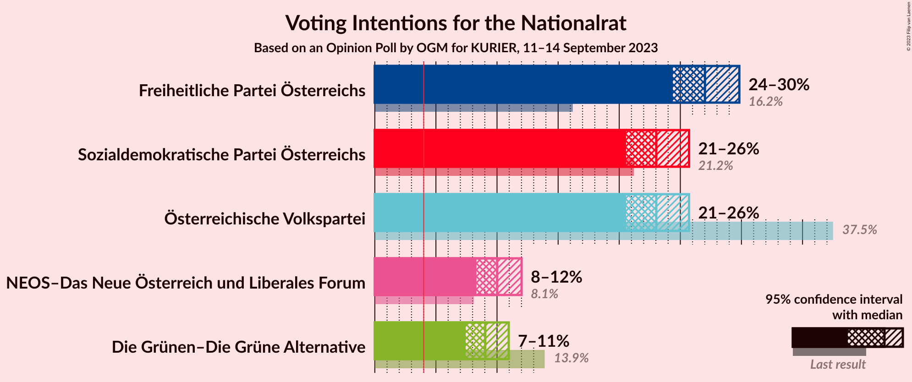

### Confidence Intervals

| Party | Last Result | Poll Result | 80% Confidence Interval | 90% Confidence Interval | 95% Confidence Interval | 99% Confidence Interval |
|:-----:|:-----------:|:-----------:|:-----------------------:|:-----------------------:|:-----------------------:|:-----------------------:|
| Freiheitliche Partei Österreichs | 16.2% | 27.0% | 25.3–28.9% |24.8–29.4% |24.4–29.8% |23.6–30.7% |
| Sozialdemokratische Partei Österreichs | 21.2% | 23.0% | 21.4–24.8% |20.9–25.3% |20.6–25.7% |19.8–26.6% |
| Österreichische Volkspartei | 37.5% | 23.0% | 21.4–24.8% |20.9–25.3% |20.6–25.7% |19.8–26.6% |
| NEOS–Das Neue Österreich und Liberales Forum | 8.1% | 10.0% | 8.9–11.3% |8.6–11.7% |8.3–12.0% |7.8–12.7% |
| Die Grünen–Die Grüne Alternative | 13.9% | 9.0% | 8.0–10.3% |7.7–10.6% |7.4–11.0% |7.0–11.6% |

*Note:* The poll result column reflects the actual value used in the calculations. Published results may vary slightly, and in addition be rounded to fewer digits.

## Seats

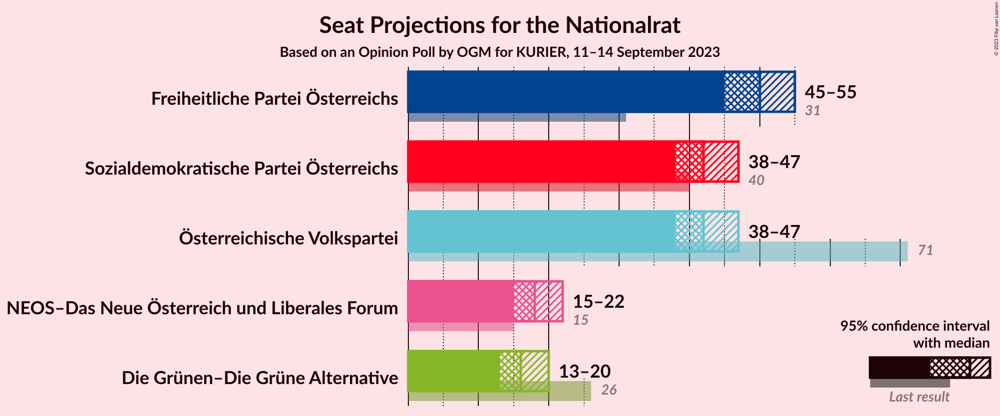

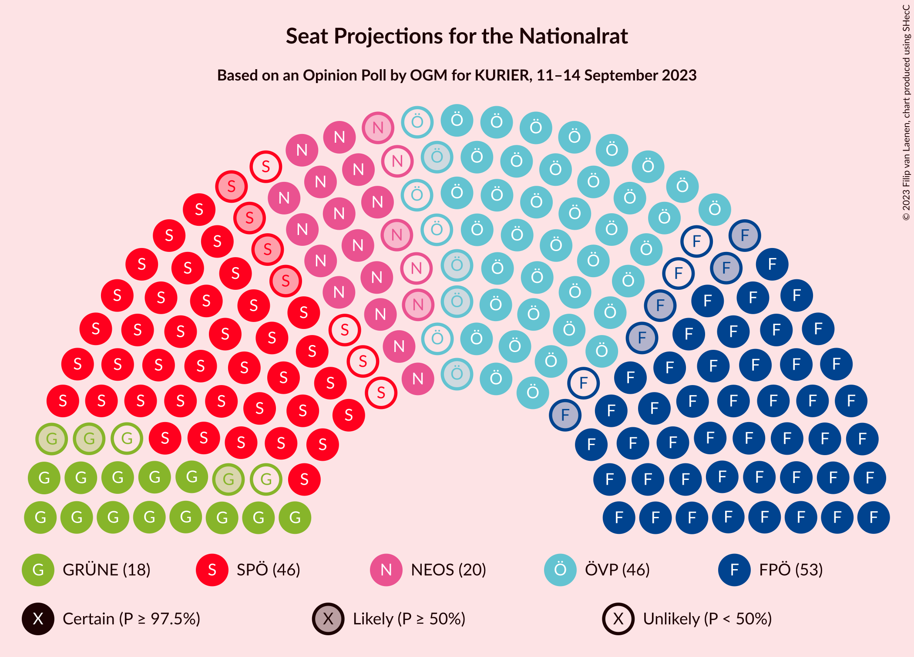

### Confidence Intervals

| Party | Last Result | Median | 80% Confidence Interval | 90% Confidence Interval | 95% Confidence Interval | 99% Confidence Interval |
|:-----:|:-----------:|:------:|:-----------------------:|:-----------------------:|:-----------------------:|:-----------------------:|
| <a href="#freiheitliche-partei-österreichs">Freiheitliche Partei Österreichs</a> | 31 | 50 | 46–53 |45–54 |45–55 |43–56 |
| <a href="#sozialdemokratische-partei-österreichs">Sozialdemokratische Partei Österreichs</a> | 40 | 42 | 39–45 |38–46 |38–47 |36–49 |
| <a href="#österreichische-volkspartei">Österreichische Volkspartei</a> | 71 | 42 | 39–45 |38–46 |38–47 |36–49 |
| <a href="#neos–das-neue-österreich-und-liberales-forum">NEOS–Das Neue Österreich und Liberales Forum</a> | 15 | 18 | 16–20 |15–21 |15–22 |14–23 |
| <a href="#die-grünen–die-grüne-alternative">Die Grünen–Die Grüne Alternative</a> | 26 | 16 | 14–19 |14–19 |13–20 |12–21 |

### Freiheitliche Partei Österreichs

*For a full overview of the results for this party, see the [Freiheitliche Partei Österreichs](party-freiheitlicheparteiösterreichs.html) page.*

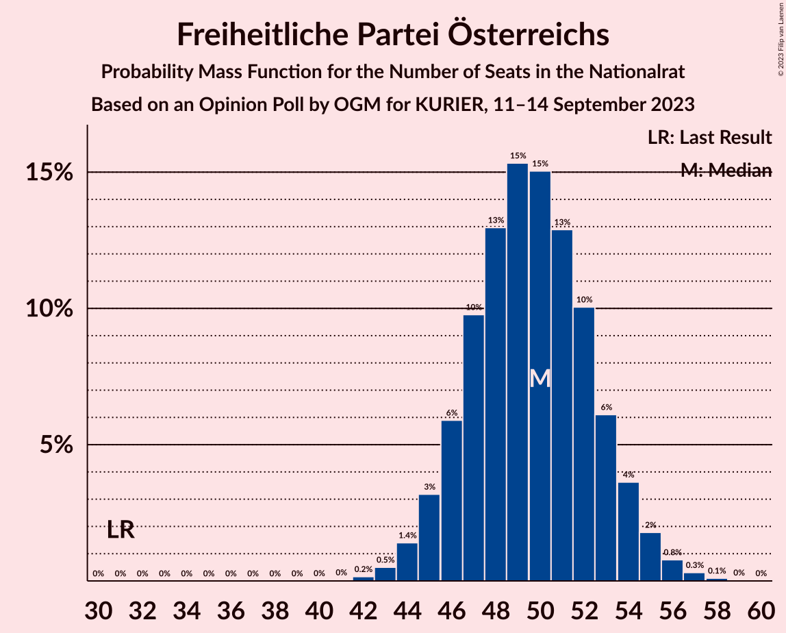

| Number of Seats | Probability | Accumulated | Special Marks |
|:---------------:|:-----------:|:-----------:|:-------------:|
| 31 | 0% | 100% | Last Result |
| 32 | 0% | 100% |  |
| 33 | 0% | 100% |  |
| 34 | 0% | 100% |  |
| 35 | 0% | 100% |  |
| 36 | 0% | 100% |  |
| 37 | 0% | 100% |  |
| 38 | 0% | 100% |  |
| 39 | 0% | 100% |  |
| 40 | 0% | 100% |  |
| 41 | 0% | 100% |  |
| 42 | 0.2% | 100% |  |
| 43 | 0.5% | 99.8% |  |
| 44 | 1.4% | 99.3% |  |
| 45 | 3% | 98% |  |
| 46 | 6% | 95% |  |
| 47 | 10% | 89% |  |
| 48 | 13% | 79% |  |
| 49 | 15% | 66% |  |
| 50 | 15% | 51% | Median |
| 51 | 13% | 36% |  |
| 52 | 10% | 23% |  |
| 53 | 6% | 13% |  |
| 54 | 4% | 7% |  |
| 55 | 2% | 3% |  |
| 56 | 0.8% | 1.2% |  |
| 57 | 0.3% | 0.5% |  |
| 58 | 0.1% | 0.1% |  |
| 59 | 0% | 0% |  |

### Sozialdemokratische Partei Österreichs

*For a full overview of the results for this party, see the [Sozialdemokratische Partei Österreichs](party-sozialdemokratischeparteiösterreichs.html) page.*

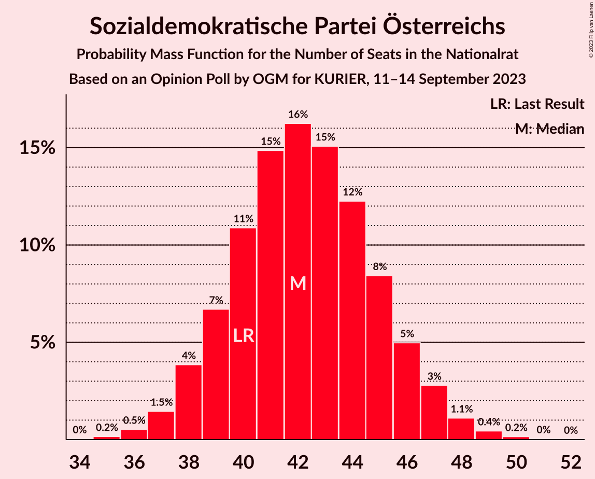

| Number of Seats | Probability | Accumulated | Special Marks |
|:---------------:|:-----------:|:-----------:|:-------------:|
| 35 | 0.2% | 100% |  |
| 36 | 0.5% | 99.8% |  |
| 37 | 1.5% | 99.3% |  |
| 38 | 4% | 98% |  |
| 39 | 7% | 94% |  |
| 40 | 11% | 87% | Last Result |
| 41 | 15% | 76% |  |
| 42 | 16% | 62% | Median |
| 43 | 15% | 45% |  |
| 44 | 12% | 30% |  |
| 45 | 8% | 18% |  |
| 46 | 5% | 10% |  |
| 47 | 3% | 5% |  |
| 48 | 1.1% | 2% |  |
| 49 | 0.4% | 0.7% |  |
| 50 | 0.2% | 0.2% |  |
| 51 | 0% | 0.1% |  |
| 52 | 0% | 0% |  |

### Österreichische Volkspartei

*For a full overview of the results for this party, see the [Österreichische Volkspartei](party-österreichischevolkspartei.html) page.*

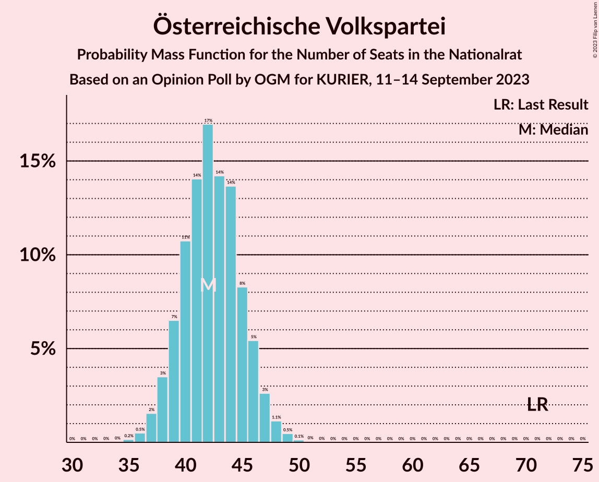

| Number of Seats | Probability | Accumulated | Special Marks |
|:---------------:|:-----------:|:-----------:|:-------------:|
| 35 | 0.2% | 100% |  |
| 36 | 0.5% | 99.8% |  |
| 37 | 2% | 99.3% |  |
| 38 | 3% | 98% |  |
| 39 | 7% | 94% |  |
| 40 | 11% | 88% |  |
| 41 | 14% | 77% |  |
| 42 | 17% | 63% | Median |
| 43 | 14% | 46% |  |
| 44 | 14% | 32% |  |
| 45 | 8% | 18% |  |
| 46 | 5% | 10% |  |
| 47 | 3% | 4% |  |
| 48 | 1.1% | 2% |  |
| 49 | 0.5% | 0.7% |  |
| 50 | 0.1% | 0.2% |  |
| 51 | 0% | 0.1% |  |
| 52 | 0% | 0% |  |
| 53 | 0% | 0% |  |
| 54 | 0% | 0% |  |
| 55 | 0% | 0% |  |
| 56 | 0% | 0% |  |
| 57 | 0% | 0% |  |
| 58 | 0% | 0% |  |
| 59 | 0% | 0% |  |
| 60 | 0% | 0% |  |
| 61 | 0% | 0% |  |
| 62 | 0% | 0% |  |
| 63 | 0% | 0% |  |
| 64 | 0% | 0% |  |
| 65 | 0% | 0% |  |
| 66 | 0% | 0% |  |
| 67 | 0% | 0% |  |
| 68 | 0% | 0% |  |
| 69 | 0% | 0% |  |
| 70 | 0% | 0% |  |
| 71 | 0% | 0% | Last Result |

### NEOS–Das Neue Österreich und Liberales Forum

*For a full overview of the results for this party, see the [NEOS–Das Neue Österreich und Liberales Forum](party-neos–dasneueösterreichundliberalesforum.html) page.*

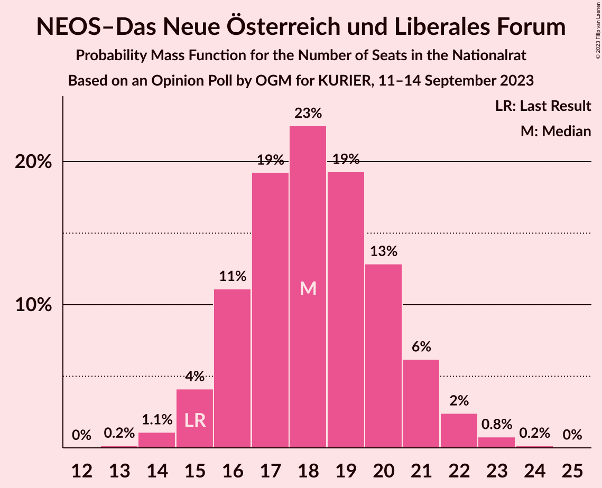

| Number of Seats | Probability | Accumulated | Special Marks |
|:---------------:|:-----------:|:-----------:|:-------------:|
| 13 | 0.2% | 100% |  |
| 14 | 1.1% | 99.8% |  |
| 15 | 4% | 98.7% | Last Result |
| 16 | 11% | 95% |  |
| 17 | 19% | 83% |  |
| 18 | 23% | 64% | Median |
| 19 | 19% | 42% |  |
| 20 | 13% | 22% |  |
| 21 | 6% | 10% |  |
| 22 | 2% | 3% |  |
| 23 | 0.8% | 1.0% |  |
| 24 | 0.2% | 0.2% |  |
| 25 | 0% | 0% |  |

### Die Grünen–Die Grüne Alternative

*For a full overview of the results for this party, see the [Die Grünen–Die Grüne Alternative](party-diegrünen–diegrünealternative.html) page.*

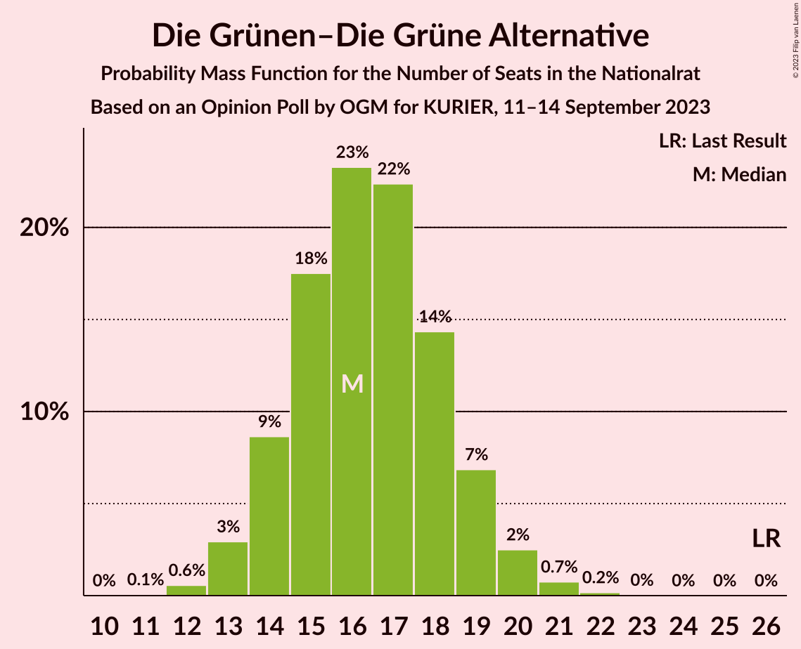

| Number of Seats | Probability | Accumulated | Special Marks |
|:---------------:|:-----------:|:-----------:|:-------------:|
| 11 | 0.1% | 100% |  |
| 12 | 0.6% | 99.9% |  |
| 13 | 3% | 99.4% |  |
| 14 | 9% | 96% |  |
| 15 | 18% | 88% |  |
| 16 | 23% | 70% | Median |
| 17 | 22% | 47% |  |
| 18 | 14% | 25% |  |
| 19 | 7% | 10% |  |
| 20 | 2% | 3% |  |
| 21 | 0.7% | 1.0% |  |
| 22 | 0.2% | 0.2% |  |
| 23 | 0% | 0% |  |
| 24 | 0% | 0% |  |
| 25 | 0% | 0% |  |
| 26 | 0% | 0% | Last Result |

## Coalitions

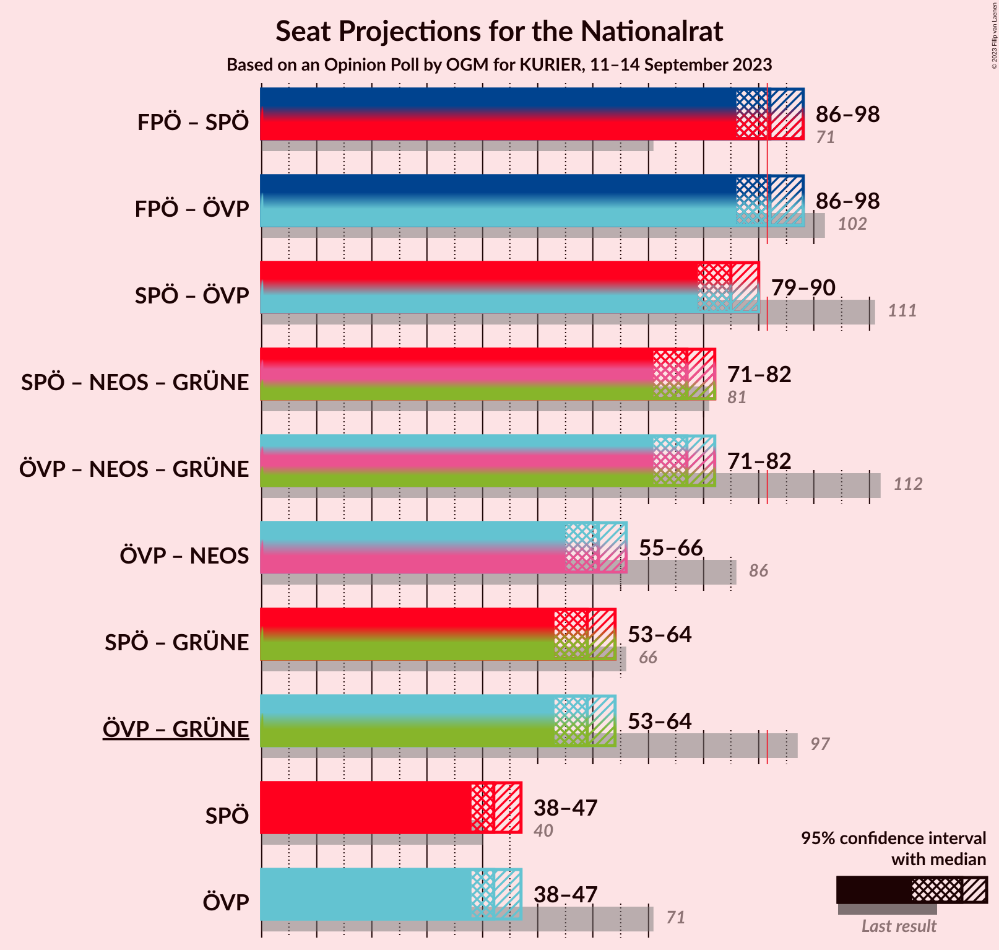

### Confidence Intervals

| Coalition | Last Result | Median | Majority? | 80% Confidence Interval | 90% Confidence Interval | 95% Confidence Interval | 99% Confidence Interval |
|:---------:|:-----------:|:------:|:---------:|:-----------------------:|:-----------------------:|:-----------------------:|:-----------------------:|
| Freiheitliche Partei Österreichs – Sozialdemokratische Partei Österreichs | 71 | 92 | 55% | 88–96 | 87–97 | 86–98 | 84–99 |
| Freiheitliche Partei Österreichs – Österreichische Volkspartei | 102 | 92 | 55% | 88–96 | 87–97 | 86–98 | 84–99 |
| Sozialdemokratische Partei Österreichs – Österreichische Volkspartei | 111 | 85 | 0.8% | 81–88 | 80–89 | 79–90 | 77–92 |
| Sozialdemokratische Partei Österreichs – NEOS–Das Neue Österreich und Liberales Forum – Die Grünen–Die Grüne Alternative | 81 | 77 | 0% | 73–81 | 72–82 | 71–82 | 70–84 |
| Österreichische Volkspartei – NEOS–Das Neue Österreich und Liberales Forum – Die Grünen–Die Grüne Alternative | 112 | 77 | 0% | 73–81 | 72–82 | 71–82 | 70–84 |
| Österreichische Volkspartei – NEOS–Das Neue Österreich und Liberales Forum | 86 | 61 | 0% | 57–64 | 56–65 | 55–66 | 54–68 |
| Sozialdemokratische Partei Österreichs – Die Grünen–Die Grüne Alternative | 66 | 59 | 0% | 55–62 | 54–63 | 53–64 | 52–66 |
| Österreichische Volkspartei – Die Grünen–Die Grüne Alternative | 97 | 59 | 0% | 55–62 | 54–63 | 53–64 | 52–66 |
| Sozialdemokratische Partei Österreichs | 40 | 42 | 0% | 39–45 | 38–46 | 38–47 | 36–49 |
| Österreichische Volkspartei | 71 | 42 | 0% | 39–45 | 38–46 | 38–47 | 36–49 |

### Freiheitliche Partei Österreichs – Sozialdemokratische Partei Österreichs

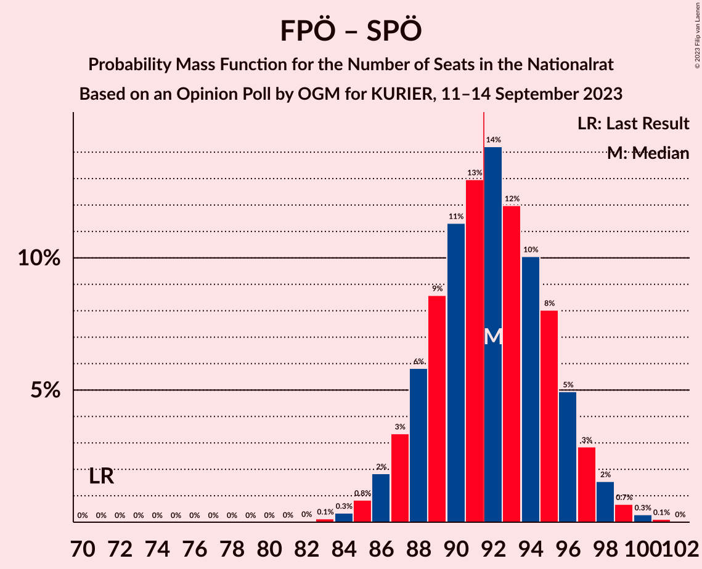

| Number of Seats | Probability | Accumulated | Special Marks |
|:---------------:|:-----------:|:-----------:|:-------------:|
| 71 | 0% | 100% | Last Result |
| 72 | 0% | 100% |  |
| 73 | 0% | 100% |  |
| 74 | 0% | 100% |  |
| 75 | 0% | 100% |  |
| 76 | 0% | 100% |  |
| 77 | 0% | 100% |  |
| 78 | 0% | 100% |  |
| 79 | 0% | 100% |  |
| 80 | 0% | 100% |  |
| 81 | 0% | 100% |  |
| 82 | 0% | 100% |  |
| 83 | 0.1% | 99.9% |  |
| 84 | 0.3% | 99.8% |  |
| 85 | 0.8% | 99.5% |  |
| 86 | 2% | 98.6% |  |
| 87 | 3% | 97% |  |
| 88 | 6% | 93% |  |
| 89 | 9% | 88% |  |
| 90 | 11% | 79% |  |
| 91 | 13% | 68% |  |
| 92 | 14% | 55% | Median, Majority |
| 93 | 12% | 41% |  |
| 94 | 10% | 29% |  |
| 95 | 8% | 18% |  |
| 96 | 5% | 10% |  |
| 97 | 3% | 6% |  |
| 98 | 2% | 3% |  |
| 99 | 0.7% | 1.1% |  |
| 100 | 0.3% | 0.4% |  |
| 101 | 0.1% | 0.2% |  |
| 102 | 0% | 0% |  |

### Freiheitliche Partei Österreichs – Österreichische Volkspartei

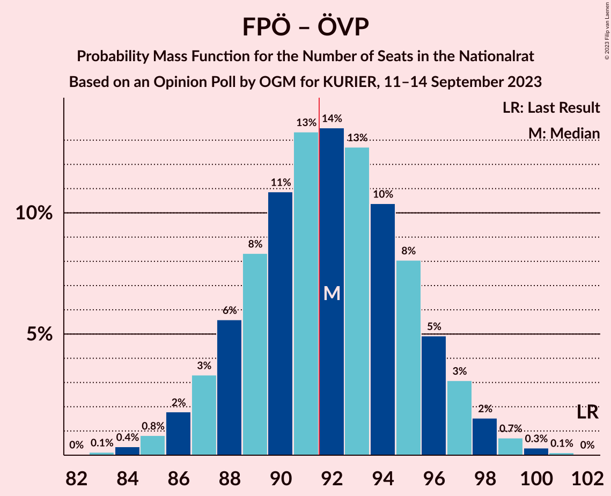

| Number of Seats | Probability | Accumulated | Special Marks |
|:---------------:|:-----------:|:-----------:|:-------------:|
| 82 | 0% | 100% |  |
| 83 | 0.1% | 99.9% |  |
| 84 | 0.4% | 99.8% |  |
| 85 | 0.8% | 99.5% |  |
| 86 | 2% | 98.6% |  |
| 87 | 3% | 97% |  |
| 88 | 6% | 94% |  |
| 89 | 8% | 88% |  |
| 90 | 11% | 80% |  |
| 91 | 13% | 69% |  |
| 92 | 14% | 55% | Median, Majority |
| 93 | 13% | 42% |  |
| 94 | 10% | 29% |  |
| 95 | 8% | 19% |  |
| 96 | 5% | 11% |  |
| 97 | 3% | 6% |  |
| 98 | 2% | 3% |  |
| 99 | 0.7% | 1.2% |  |
| 100 | 0.3% | 0.5% |  |
| 101 | 0.1% | 0.2% |  |
| 102 | 0% | 0% | Last Result |

### Sozialdemokratische Partei Österreichs – Österreichische Volkspartei

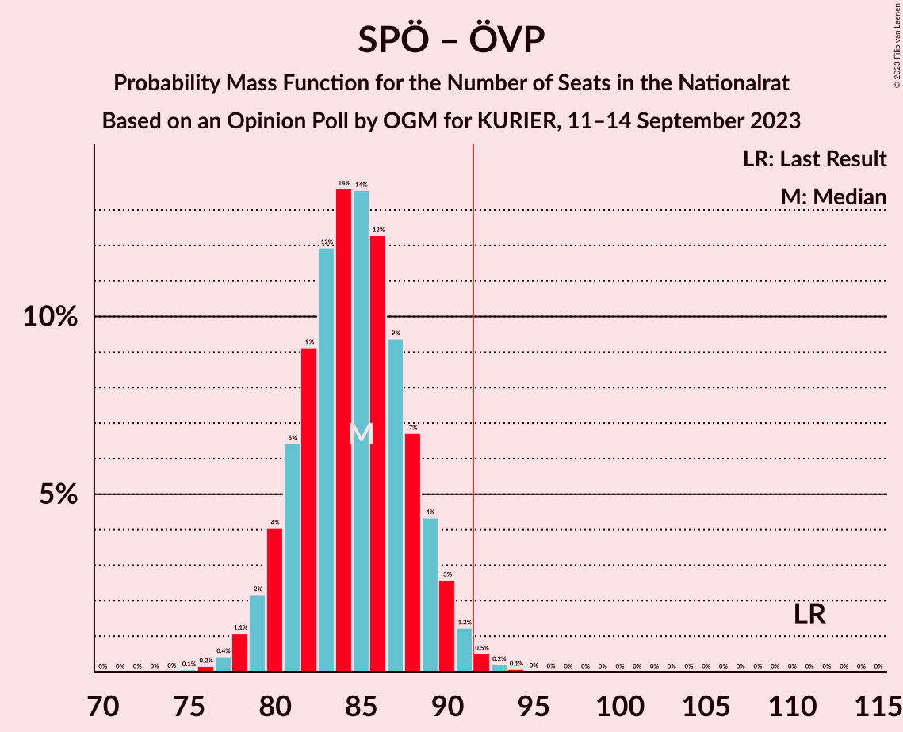

| Number of Seats | Probability | Accumulated | Special Marks |
|:---------------:|:-----------:|:-----------:|:-------------:|
| 75 | 0.1% | 100% |  |
| 76 | 0.2% | 99.9% |  |
| 77 | 0.4% | 99.8% |  |
| 78 | 1.1% | 99.3% |  |
| 79 | 2% | 98% |  |
| 80 | 4% | 96% |  |
| 81 | 6% | 92% |  |
| 82 | 9% | 86% |  |
| 83 | 12% | 76% |  |
| 84 | 14% | 65% | Median |
| 85 | 14% | 51% |  |
| 86 | 12% | 37% |  |
| 87 | 9% | 25% |  |
| 88 | 7% | 16% |  |
| 89 | 4% | 9% |  |
| 90 | 3% | 5% |  |
| 91 | 1.2% | 2% |  |
| 92 | 0.5% | 0.8% | Majority |
| 93 | 0.2% | 0.3% |  |
| 94 | 0.1% | 0.1% |  |
| 95 | 0% | 0% |  |
| 96 | 0% | 0% |  |
| 97 | 0% | 0% |  |
| 98 | 0% | 0% |  |
| 99 | 0% | 0% |  |
| 100 | 0% | 0% |  |
| 101 | 0% | 0% |  |
| 102 | 0% | 0% |  |
| 103 | 0% | 0% |  |
| 104 | 0% | 0% |  |
| 105 | 0% | 0% |  |
| 106 | 0% | 0% |  |
| 107 | 0% | 0% |  |
| 108 | 0% | 0% |  |
| 109 | 0% | 0% |  |
| 110 | 0% | 0% |  |
| 111 | 0% | 0% | Last Result |

### Sozialdemokratische Partei Österreichs – NEOS–Das Neue Österreich und Liberales Forum – Die Grünen–Die Grüne Alternative

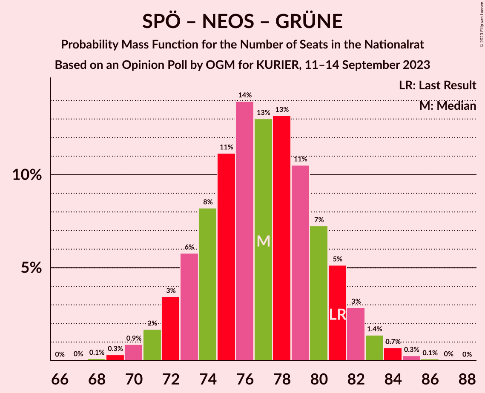

| Number of Seats | Probability | Accumulated | Special Marks |
|:---------------:|:-----------:|:-----------:|:-------------:|
| 67 | 0% | 100% |  |
| 68 | 0.1% | 99.9% |  |
| 69 | 0.3% | 99.8% |  |
| 70 | 0.9% | 99.5% |  |
| 71 | 2% | 98.6% |  |
| 72 | 3% | 97% |  |
| 73 | 6% | 94% |  |
| 74 | 8% | 88% |  |
| 75 | 11% | 80% |  |
| 76 | 14% | 68% | Median |
| 77 | 13% | 54% |  |
| 78 | 13% | 41% |  |
| 79 | 11% | 28% |  |
| 80 | 7% | 18% |  |
| 81 | 5% | 10% | Last Result |
| 82 | 3% | 5% |  |
| 83 | 1.4% | 2% |  |
| 84 | 0.7% | 1.1% |  |
| 85 | 0.3% | 0.4% |  |
| 86 | 0.1% | 0.1% |  |
| 87 | 0% | 0% |  |

### Österreichische Volkspartei – NEOS–Das Neue Österreich und Liberales Forum – Die Grünen–Die Grüne Alternative

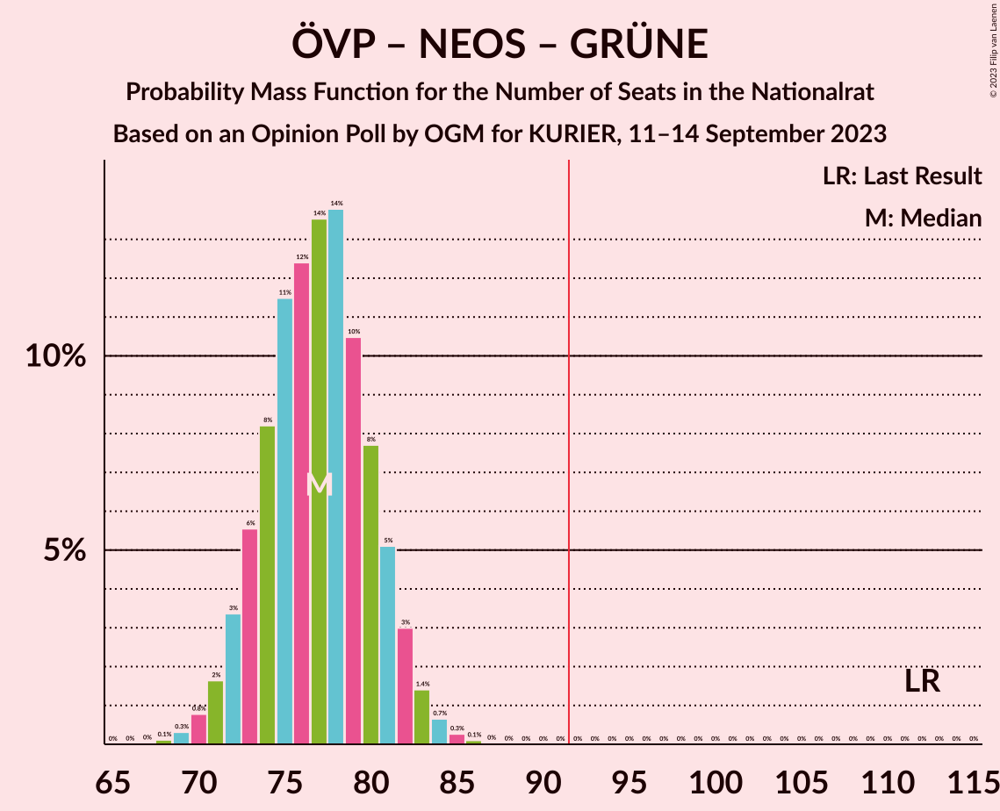

| Number of Seats | Probability | Accumulated | Special Marks |
|:---------------:|:-----------:|:-----------:|:-------------:|
| 68 | 0.1% | 100% |  |
| 69 | 0.3% | 99.8% |  |
| 70 | 0.8% | 99.5% |  |
| 71 | 2% | 98.7% |  |
| 72 | 3% | 97% |  |
| 73 | 6% | 94% |  |
| 74 | 8% | 88% |  |
| 75 | 11% | 80% |  |
| 76 | 12% | 68% | Median |
| 77 | 14% | 56% |  |
| 78 | 14% | 43% |  |
| 79 | 10% | 29% |  |
| 80 | 8% | 18% |  |
| 81 | 5% | 11% |  |
| 82 | 3% | 5% |  |
| 83 | 1.4% | 2% |  |
| 84 | 0.7% | 1.1% |  |
| 85 | 0.3% | 0.4% |  |
| 86 | 0.1% | 0.1% |  |
| 87 | 0% | 0% |  |
| 88 | 0% | 0% |  |
| 89 | 0% | 0% |  |
| 90 | 0% | 0% |  |
| 91 | 0% | 0% |  |
| 92 | 0% | 0% | Majority |
| 93 | 0% | 0% |  |
| 94 | 0% | 0% |  |
| 95 | 0% | 0% |  |
| 96 | 0% | 0% |  |
| 97 | 0% | 0% |  |
| 98 | 0% | 0% |  |
| 99 | 0% | 0% |  |
| 100 | 0% | 0% |  |
| 101 | 0% | 0% |  |
| 102 | 0% | 0% |  |
| 103 | 0% | 0% |  |
| 104 | 0% | 0% |  |
| 105 | 0% | 0% |  |
| 106 | 0% | 0% |  |
| 107 | 0% | 0% |  |
| 108 | 0% | 0% |  |
| 109 | 0% | 0% |  |
| 110 | 0% | 0% |  |
| 111 | 0% | 0% |  |
| 112 | 0% | 0% | Last Result |

### Österreichische Volkspartei – NEOS–Das Neue Österreich und Liberales Forum

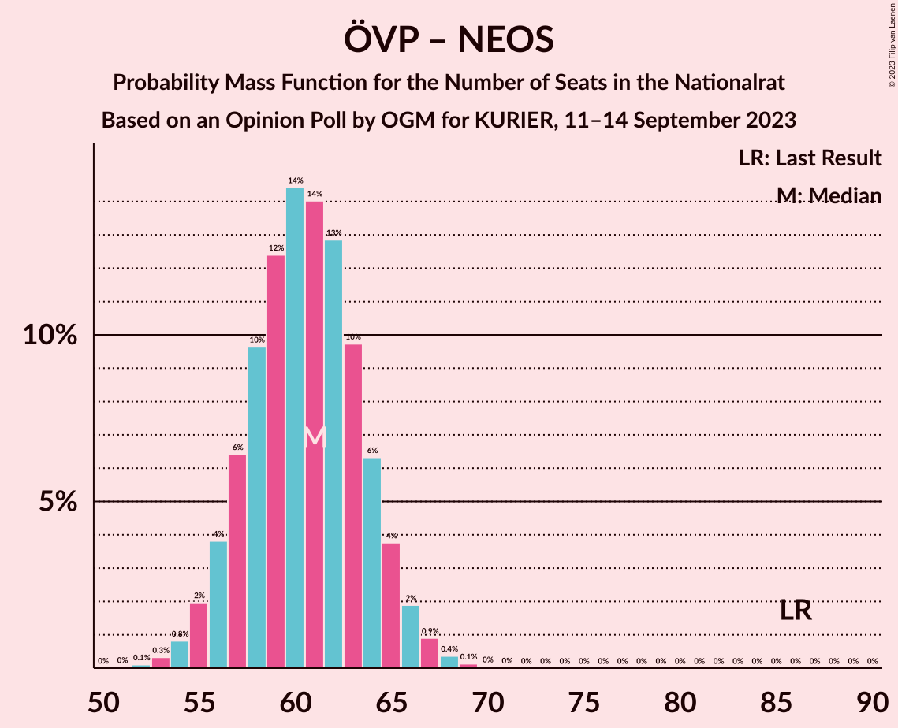

| Number of Seats | Probability | Accumulated | Special Marks |
|:---------------:|:-----------:|:-----------:|:-------------:|
| 52 | 0.1% | 100% |  |
| 53 | 0.3% | 99.9% |  |
| 54 | 0.8% | 99.5% |  |
| 55 | 2% | 98.7% |  |
| 56 | 4% | 97% |  |
| 57 | 6% | 93% |  |
| 58 | 10% | 87% |  |
| 59 | 12% | 77% |  |
| 60 | 14% | 64% | Median |
| 61 | 14% | 50% |  |
| 62 | 13% | 36% |  |
| 63 | 10% | 23% |  |
| 64 | 6% | 13% |  |
| 65 | 4% | 7% |  |
| 66 | 2% | 3% |  |
| 67 | 0.9% | 1.5% |  |
| 68 | 0.4% | 0.6% |  |
| 69 | 0.1% | 0.2% |  |
| 70 | 0% | 0.1% |  |
| 71 | 0% | 0% |  |
| 72 | 0% | 0% |  |
| 73 | 0% | 0% |  |
| 74 | 0% | 0% |  |
| 75 | 0% | 0% |  |
| 76 | 0% | 0% |  |
| 77 | 0% | 0% |  |
| 78 | 0% | 0% |  |
| 79 | 0% | 0% |  |
| 80 | 0% | 0% |  |
| 81 | 0% | 0% |  |
| 82 | 0% | 0% |  |
| 83 | 0% | 0% |  |
| 84 | 0% | 0% |  |
| 85 | 0% | 0% |  |
| 86 | 0% | 0% | Last Result |

### Sozialdemokratische Partei Österreichs – Die Grünen–Die Grüne Alternative

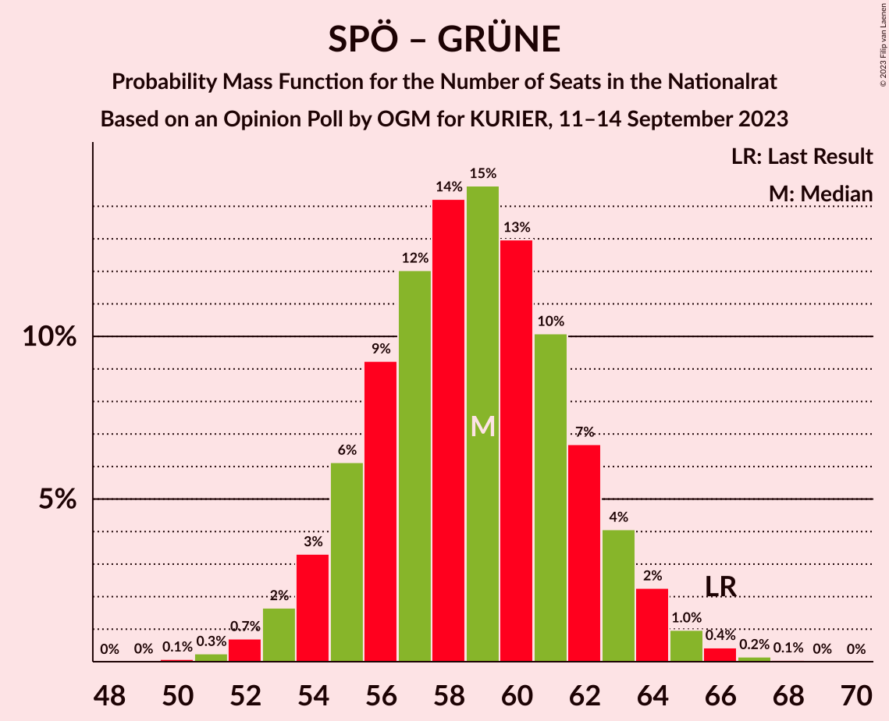

| Number of Seats | Probability | Accumulated | Special Marks |
|:---------------:|:-----------:|:-----------:|:-------------:|
| 50 | 0.1% | 100% |  |
| 51 | 0.3% | 99.9% |  |
| 52 | 0.7% | 99.6% |  |
| 53 | 2% | 98.9% |  |
| 54 | 3% | 97% |  |
| 55 | 6% | 94% |  |
| 56 | 9% | 88% |  |
| 57 | 12% | 79% |  |
| 58 | 14% | 67% | Median |
| 59 | 15% | 52% |  |
| 60 | 13% | 38% |  |
| 61 | 10% | 25% |  |
| 62 | 7% | 15% |  |
| 63 | 4% | 8% |  |
| 64 | 2% | 4% |  |
| 65 | 1.0% | 2% |  |
| 66 | 0.4% | 0.7% | Last Result |
| 67 | 0.2% | 0.2% |  |
| 68 | 0.1% | 0.1% |  |
| 69 | 0% | 0% |  |

### Österreichische Volkspartei – Die Grünen–Die Grüne Alternative

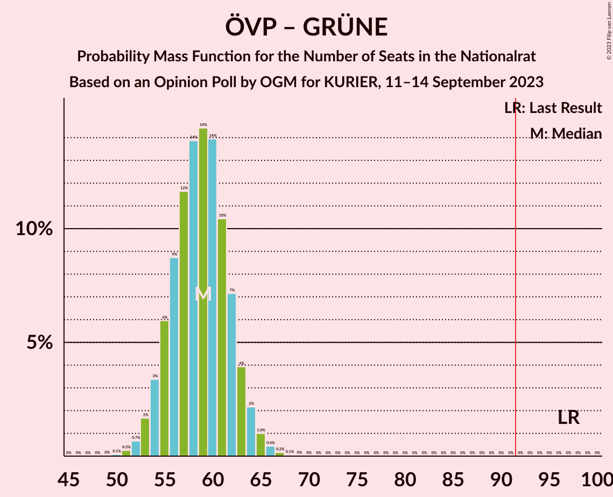

| Number of Seats | Probability | Accumulated | Special Marks |
|:---------------:|:-----------:|:-----------:|:-------------:|
| 50 | 0.1% | 100% |  |
| 51 | 0.3% | 99.9% |  |
| 52 | 0.7% | 99.6% |  |
| 53 | 2% | 99.0% |  |
| 54 | 3% | 97% |  |
| 55 | 6% | 94% |  |
| 56 | 9% | 88% |  |
| 57 | 12% | 79% |  |
| 58 | 14% | 68% | Median |
| 59 | 14% | 54% |  |
| 60 | 14% | 39% |  |
| 61 | 10% | 25% |  |
| 62 | 7% | 15% |  |
| 63 | 4% | 8% |  |
| 64 | 2% | 4% |  |
| 65 | 1.0% | 2% |  |
| 66 | 0.4% | 0.7% |  |
| 67 | 0.2% | 0.2% |  |
| 68 | 0.1% | 0.1% |  |
| 69 | 0% | 0% |  |
| 70 | 0% | 0% |  |
| 71 | 0% | 0% |  |
| 72 | 0% | 0% |  |
| 73 | 0% | 0% |  |
| 74 | 0% | 0% |  |
| 75 | 0% | 0% |  |
| 76 | 0% | 0% |  |
| 77 | 0% | 0% |  |
| 78 | 0% | 0% |  |
| 79 | 0% | 0% |  |
| 80 | 0% | 0% |  |
| 81 | 0% | 0% |  |
| 82 | 0% | 0% |  |
| 83 | 0% | 0% |  |
| 84 | 0% | 0% |  |
| 85 | 0% | 0% |  |
| 86 | 0% | 0% |  |
| 87 | 0% | 0% |  |
| 88 | 0% | 0% |  |
| 89 | 0% | 0% |  |
| 90 | 0% | 0% |  |
| 91 | 0% | 0% |  |
| 92 | 0% | 0% | Majority |
| 93 | 0% | 0% |  |
| 94 | 0% | 0% |  |
| 95 | 0% | 0% |  |
| 96 | 0% | 0% |  |
| 97 | 0% | 0% | Last Result |

### Sozialdemokratische Partei Österreichs

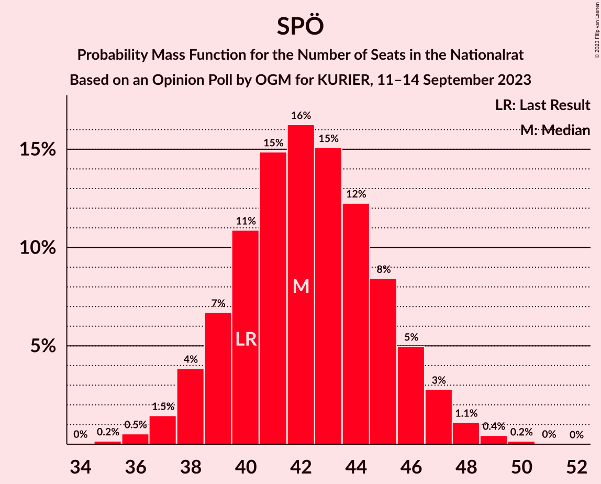

| Number of Seats | Probability | Accumulated | Special Marks |
|:---------------:|:-----------:|:-----------:|:-------------:|
| 35 | 0.2% | 100% |  |
| 36 | 0.5% | 99.8% |  |
| 37 | 1.5% | 99.3% |  |
| 38 | 4% | 98% |  |
| 39 | 7% | 94% |  |
| 40 | 11% | 87% | Last Result |
| 41 | 15% | 76% |  |
| 42 | 16% | 62% | Median |
| 43 | 15% | 45% |  |
| 44 | 12% | 30% |  |
| 45 | 8% | 18% |  |
| 46 | 5% | 10% |  |
| 47 | 3% | 5% |  |
| 48 | 1.1% | 2% |  |
| 49 | 0.4% | 0.7% |  |
| 50 | 0.2% | 0.2% |  |
| 51 | 0% | 0.1% |  |
| 52 | 0% | 0% |  |

### Österreichische Volkspartei

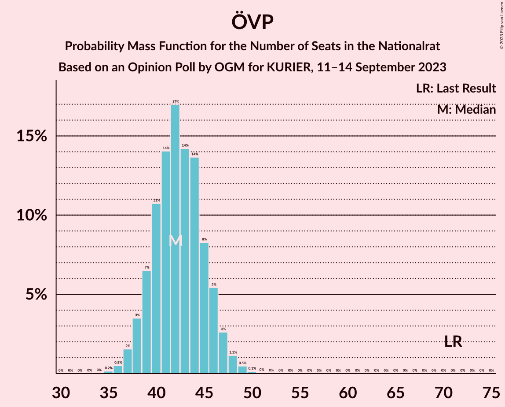

| Number of Seats | Probability | Accumulated | Special Marks |
|:---------------:|:-----------:|:-----------:|:-------------:|
| 35 | 0.2% | 100% |  |
| 36 | 0.5% | 99.8% |  |
| 37 | 2% | 99.3% |  |
| 38 | 3% | 98% |  |
| 39 | 7% | 94% |  |
| 40 | 11% | 88% |  |
| 41 | 14% | 77% |  |
| 42 | 17% | 63% | Median |
| 43 | 14% | 46% |  |
| 44 | 14% | 32% |  |
| 45 | 8% | 18% |  |
| 46 | 5% | 10% |  |
| 47 | 3% | 4% |  |
| 48 | 1.1% | 2% |  |
| 49 | 0.5% | 0.7% |  |
| 50 | 0.1% | 0.2% |  |
| 51 | 0% | 0.1% |  |
| 52 | 0% | 0% |  |
| 53 | 0% | 0% |  |
| 54 | 0% | 0% |  |
| 55 | 0% | 0% |  |
| 56 | 0% | 0% |  |
| 57 | 0% | 0% |  |
| 58 | 0% | 0% |  |
| 59 | 0% | 0% |  |
| 60 | 0% | 0% |  |
| 61 | 0% | 0% |  |
| 62 | 0% | 0% |  |
| 63 | 0% | 0% |  |
| 64 | 0% | 0% |  |
| 65 | 0% | 0% |  |
| 66 | 0% | 0% |  |
| 67 | 0% | 0% |  |
| 68 | 0% | 0% |  |
| 69 | 0% | 0% |  |
| 70 | 0% | 0% |  |
| 71 | 0% | 0% | Last Result |

## Technical Information

### Opinion Poll

+ **Polling firm:** OGM
+ **Commissioner(s):** KURIER
+ **Fieldwork period:** 11–14 September 2023

### Calculations

+ **Sample size:** 1029
+ **Simulations done:** 1,048,576
+ **Error estimate:** 0.26%

