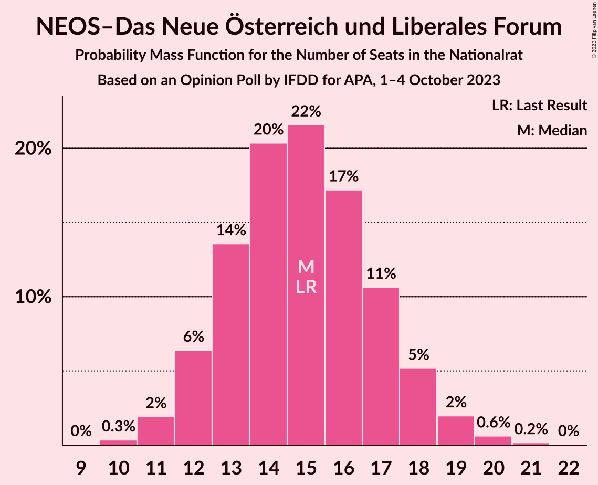

# Opinion Poll by IFDD for APA, 1–4 October 2023

<a href="#voting-intentions">Voting Intentions</a> | <a href="#seats">Seats</a> | <a href="#coalitions">Coalitions</a> | <a href="#technical-information">Technical Information</a>

## Voting Intentions

### Confidence Intervals

| Party | Last Result | Poll Result | 80% Confidence Interval | 90% Confidence Interval | 95% Confidence Interval | 99% Confidence Interval |
|:-----:|:-----------:|:-----------:|:-----------------------:|:-----------------------:|:-----------------------:|:-----------------------:|
| Sozialdemokratische Partei Österreichs | 21.2% | 25.0% | 23.1–27.0% |22.6–27.5% |22.1–28.0% |21.3–29.0% |
| Freiheitliche Partei Österreichs | 16.2% | 25.0% | 23.1–27.0% |22.6–27.5% |22.1–28.0% |21.3–29.0% |
| Österreichische Volkspartei | 37.5% | 25.0% | 23.1–27.0% |22.6–27.5% |22.1–28.0% |21.3–29.0% |
| Die Grünen–Die Grüne Alternative | 13.9% | 14.0% | 12.5–15.6% |12.1–16.1% |11.8–16.5% |11.1–17.3% |
| NEOS–Das Neue Österreich und Liberales Forum | 8.1% | 8.0% | 6.9–9.3% |6.6–9.7% |6.4–10.0% |5.9–10.7% |

*Note:* The poll result column reflects the actual value used in the calculations. Published results may vary slightly, and in addition be rounded to fewer digits.

## Seats

### Confidence Intervals

| Party | Last Result | Median | 80% Confidence Interval | 90% Confidence Interval | 95% Confidence Interval | 99% Confidence Interval |
|:-----:|:-----------:|:------:|:-----------------------:|:-----------------------:|:-----------------------:|:-----------------------:|
| <a href="#sozialdemokratische-partei-österreichs">Sozialdemokratische Partei Österreichs</a> | 40 | 47 | 44–51 |42–51 |41–53 |40–54 |
| <a href="#freiheitliche-partei-österreichs">Freiheitliche Partei Österreichs</a> | 31 | 47 | 45–49 |42–52 |41–54 |40–55 |
| <a href="#österreichische-volkspartei">Österreichische Volkspartei</a> | 71 | 47 | 44–50 |43–51 |42–53 |40–55 |
| <a href="#die-grünen–die-grüne-alternative">Die Grünen–Die Grüne Alternative</a> | 26 | 26 | 23–29 |23–30 |22–31 |21–32 |
| <a href="#neos–das-neue-österreich-und-liberales-forum">NEOS–Das Neue Österreich und Liberales Forum</a> | 15 | 15 | 13–17 |12–18 |12–19 |11–20 |

### Sozialdemokratische Partei Österreichs

*For a full overview of the results for this party, see the [Sozialdemokratische Partei Österreichs](party-sozialdemokratischeparteiösterreichs.html) page.*

| Number of Seats | Probability | Accumulated | Special Marks |
|:---------------:|:-----------:|:-----------:|:-------------:|
| 38 | 0.1% | 100% |  |
| 39 | 0.3% | 99.9% |  |
| 40 | 0.6% | 99.6% | Last Result |
| 41 | 2% | 99.0% |  |
| 42 | 3% | 97% |  |
| 43 | 4% | 95% |  |
| 44 | 11% | 91% |  |
| 45 | 12% | 80% |  |
| 46 | 8% | 68% |  |
| 47 | 15% | 60% | Median |
| 48 | 19% | 45% |  |
| 49 | 7% | 27% |  |
| 50 | 8% | 20% |  |
| 51 | 7% | 12% |  |
| 52 | 2% | 5% |  |
| 53 | 1.4% | 3% |  |
| 54 | 1.2% | 2% |  |
| 55 | 0.2% | 0.4% |  |
| 56 | 0.1% | 0.2% |  |
| 57 | 0.1% | 0.1% |  |
| 58 | 0% | 0% |  |

### Freiheitliche Partei Österreichs

*For a full overview of the results for this party, see the [Freiheitliche Partei Österreichs](party-freiheitlicheparteiösterreichs.html) page.*

| Number of Seats | Probability | Accumulated | Special Marks |
|:---------------:|:-----------:|:-----------:|:-------------:|
| 31 | 0% | 100% | Last Result |
| 32 | 0% | 100% |  |
| 33 | 0% | 100% |  |
| 34 | 0% | 100% |  |
| 35 | 0% | 100% |  |
| 36 | 0% | 100% |  |
| 37 | 0% | 100% |  |
| 38 | 0.1% | 100% |  |
| 39 | 0.4% | 99.9% |  |
| 40 | 1.1% | 99.5% |  |
| 41 | 2% | 98% |  |
| 42 | 2% | 96% |  |
| 43 | 1.0% | 94% |  |
| 44 | 2% | 93% |  |
| 45 | 7% | 91% |  |
| 46 | 18% | 84% |  |
| 47 | 28% | 67% | Median |
| 48 | 23% | 39% |  |
| 49 | 8% | 16% |  |
| 50 | 1.1% | 8% |  |
| 51 | 0.5% | 7% |  |
| 52 | 1.4% | 6% |  |
| 53 | 2% | 5% |  |
| 54 | 2% | 3% |  |
| 55 | 0.7% | 0.8% |  |
| 56 | 0.1% | 0.1% |  |
| 57 | 0% | 0% |  |

### Österreichische Volkspartei

*For a full overview of the results for this party, see the [Österreichische Volkspartei](party-österreichischevolkspartei.html) page.*

| Number of Seats | Probability | Accumulated | Special Marks |
|:---------------:|:-----------:|:-----------:|:-------------:|
| 38 | 0.1% | 100% |  |
| 39 | 0.2% | 99.9% |  |
| 40 | 0.6% | 99.7% |  |
| 41 | 1.2% | 99.1% |  |
| 42 | 3% | 98% |  |
| 43 | 4% | 95% |  |
| 44 | 8% | 91% |  |
| 45 | 12% | 84% |  |
| 46 | 14% | 71% |  |
| 47 | 17% | 57% | Median |
| 48 | 11% | 40% |  |
| 49 | 13% | 29% |  |
| 50 | 6% | 16% |  |
| 51 | 5% | 10% |  |
| 52 | 2% | 5% |  |
| 53 | 2% | 3% |  |
| 54 | 0.5% | 1.2% |  |
| 55 | 0.4% | 0.6% |  |
| 56 | 0.2% | 0.2% |  |
| 57 | 0.1% | 0.1% |  |
| 58 | 0% | 0% |  |
| 59 | 0% | 0% |  |
| 60 | 0% | 0% |  |
| 61 | 0% | 0% |  |
| 62 | 0% | 0% |  |
| 63 | 0% | 0% |  |
| 64 | 0% | 0% |  |
| 65 | 0% | 0% |  |
| 66 | 0% | 0% |  |
| 67 | 0% | 0% |  |
| 68 | 0% | 0% |  |
| 69 | 0% | 0% |  |
| 70 | 0% | 0% |  |
| 71 | 0% | 0% | Last Result |

### Die Grünen–Die Grüne Alternative

*For a full overview of the results for this party, see the [Die Grünen–Die Grüne Alternative](party-diegrünen–diegrünealternative.html) page.*

| Number of Seats | Probability | Accumulated | Special Marks |
|:---------------:|:-----------:|:-----------:|:-------------:|
| 19 | 0.1% | 100% |  |
| 20 | 0.3% | 99.9% |  |
| 21 | 1.1% | 99.6% |  |
| 22 | 3% | 98% |  |
| 23 | 7% | 95% |  |
| 24 | 11% | 88% |  |
| 25 | 16% | 77% |  |
| 26 | 17% | 61% | Last Result, Median |
| 27 | 16% | 44% |  |
| 28 | 12% | 28% |  |
| 29 | 8% | 16% |  |
| 30 | 5% | 8% |  |
| 31 | 2% | 4% |  |
| 32 | 0.9% | 1.4% |  |
| 33 | 0.3% | 0.5% |  |
| 34 | 0.1% | 0.1% |  |
| 35 | 0% | 0% |  |

### NEOS–Das Neue Österreich und Liberales Forum

*For a full overview of the results for this party, see the [NEOS–Das Neue Österreich und Liberales Forum](party-neos–dasneueösterreichundliberalesforum.html) page.*

| Number of Seats | Probability | Accumulated | Special Marks |
|:---------------:|:-----------:|:-----------:|:-------------:|
| 10 | 0.3% | 100% |  |
| 11 | 2% | 99.6% |  |
| 12 | 6% | 98% |  |
| 13 | 14% | 91% |  |
| 14 | 20% | 78% |  |
| 15 | 22% | 57% | Last Result, Median |
| 16 | 17% | 36% |  |
| 17 | 11% | 19% |  |
| 18 | 5% | 8% |  |
| 19 | 2% | 3% |  |
| 20 | 0.6% | 0.8% |  |
| 21 | 0.2% | 0.2% |  |
| 22 | 0% | 0% |  |

## Coalitions

### Confidence Intervals

| Coalition | Last Result | Median | Majority? | 80% Confidence Interval | 90% Confidence Interval | 95% Confidence Interval | 99% Confidence Interval |
|:---------:|:-----------:|:------:|:---------:|:-----------------------:|:-----------------------:|:-----------------------:|:-----------------------:|
| Freiheitliche Partei Österreichs – Sozialdemokratische Partei Österreichs | 71 | 94 | 79% | 90–98 | 89–99 | 87–101 | 85–103 |
| Freiheitliche Partei Österreichs – Österreichische Volkspartei | 102 | 94 | 80% | 90–98 | 88–100 | 87–101 | 85–102 |
| Sozialdemokratische Partei Österreichs – Österreichische Volkspartei | 111 | 94 | 82% | 90–97 | 89–99 | 87–101 | 85–103 |
| Sozialdemokratische Partei Österreichs – Die Grünen–Die Grüne Alternative – NEOS–Das Neue Österreich und Liberales Forum | 81 | 88 | 14% | 84–93 | 83–93 | 81–95 | 79–97 |
| Österreichische Volkspartei – Die Grünen–Die Grüne Alternative – NEOS–Das Neue Österreich und Liberales Forum | 112 | 88 | 15% | 84–92 | 83–93 | 81–94 | 79–97 |
| Sozialdemokratische Partei Österreichs – Die Grünen–Die Grüne Alternative | 66 | 73 | 0% | 69–77 | 68–79 | 67–80 | 65–82 |
| Österreichische Volkspartei – Die Grünen–Die Grüne Alternative | 97 | 73 | 0% | 69–77 | 68–78 | 67–79 | 65–82 |
| Österreichische Volkspartei – NEOS–Das Neue Österreich und Liberales Forum | 86 | 62 | 0% | 58–66 | 57–67 | 56–68 | 54–70 |
| Österreichische Volkspartei | 71 | 47 | 0% | 44–50 | 43–51 | 42–53 | 40–55 |
| Sozialdemokratische Partei Österreichs | 40 | 47 | 0% | 44–51 | 42–51 | 41–53 | 40–54 |

### Freiheitliche Partei Österreichs – Sozialdemokratische Partei Österreichs

| Number of Seats | Probability | Accumulated | Special Marks |
|:---------------:|:-----------:|:-----------:|:-------------:|
| 71 | 0% | 100% | Last Result |
| 72 | 0% | 100% |  |
| 73 | 0% | 100% |  |
| 74 | 0% | 100% |  |
| 75 | 0% | 100% |  |
| 76 | 0% | 100% |  |
| 77 | 0% | 100% |  |
| 78 | 0% | 100% |  |
| 79 | 0% | 100% |  |
| 80 | 0% | 100% |  |
| 81 | 0% | 100% |  |
| 82 | 0% | 100% |  |
| 83 | 0.1% | 99.9% |  |
| 84 | 0.2% | 99.9% |  |
| 85 | 0.3% | 99.7% |  |
| 86 | 0.8% | 99.3% |  |
| 87 | 1.3% | 98.6% |  |
| 88 | 2% | 97% |  |
| 89 | 4% | 95% |  |
| 90 | 4% | 91% |  |
| 91 | 8% | 87% |  |
| 92 | 8% | 79% | Majority |
| 93 | 11% | 70% |  |
| 94 | 14% | 59% | Median |
| 95 | 9% | 45% |  |
| 96 | 15% | 36% |  |
| 97 | 6% | 21% |  |
| 98 | 7% | 15% |  |
| 99 | 4% | 8% |  |
| 100 | 2% | 5% |  |
| 101 | 1.4% | 3% |  |
| 102 | 0.7% | 1.2% |  |
| 103 | 0.3% | 0.5% |  |
| 104 | 0.1% | 0.2% |  |
| 105 | 0.1% | 0.1% |  |
| 106 | 0% | 0% |  |

### Freiheitliche Partei Österreichs – Österreichische Volkspartei

| Number of Seats | Probability | Accumulated | Special Marks |
|:---------------:|:-----------:|:-----------:|:-------------:|
| 82 | 0% | 100% |  |
| 83 | 0.1% | 99.9% |  |
| 84 | 0.2% | 99.9% |  |
| 85 | 0.3% | 99.7% |  |
| 86 | 1.0% | 99.4% |  |
| 87 | 1.4% | 98% |  |
| 88 | 3% | 97% |  |
| 89 | 3% | 95% |  |
| 90 | 7% | 92% |  |
| 91 | 5% | 85% |  |
| 92 | 13% | 80% | Majority |
| 93 | 8% | 66% |  |
| 94 | 16% | 59% | Median |
| 95 | 8% | 43% |  |
| 96 | 10% | 34% |  |
| 97 | 9% | 25% |  |
| 98 | 6% | 16% |  |
| 99 | 4% | 10% |  |
| 100 | 3% | 6% |  |
| 101 | 1.2% | 3% |  |
| 102 | 0.9% | 1.4% | Last Result |
| 103 | 0.3% | 0.5% |  |
| 104 | 0.1% | 0.2% |  |
| 105 | 0.1% | 0.1% |  |
| 106 | 0% | 0% |  |

### Sozialdemokratische Partei Österreichs – Österreichische Volkspartei

| Number of Seats | Probability | Accumulated | Special Marks |
|:---------------:|:-----------:|:-----------:|:-------------:|
| 82 | 0% | 100% |  |
| 83 | 0.1% | 99.9% |  |
| 84 | 0.2% | 99.8% |  |
| 85 | 0.4% | 99.6% |  |
| 86 | 0.8% | 99.2% |  |
| 87 | 1.1% | 98% |  |
| 88 | 2% | 97% |  |
| 89 | 3% | 95% |  |
| 90 | 4% | 92% |  |
| 91 | 6% | 88% |  |
| 92 | 8% | 82% | Majority |
| 93 | 16% | 74% |  |
| 94 | 12% | 59% | Median |
| 95 | 19% | 47% |  |
| 96 | 10% | 28% |  |
| 97 | 8% | 18% |  |
| 98 | 3% | 9% |  |
| 99 | 2% | 6% |  |
| 100 | 2% | 4% |  |
| 101 | 1.0% | 3% |  |
| 102 | 1.2% | 2% |  |
| 103 | 0.4% | 0.8% |  |
| 104 | 0.3% | 0.4% |  |
| 105 | 0.1% | 0.1% |  |
| 106 | 0% | 0% |  |
| 107 | 0% | 0% |  |
| 108 | 0% | 0% |  |
| 109 | 0% | 0% |  |
| 110 | 0% | 0% |  |
| 111 | 0% | 0% | Last Result |

### Sozialdemokratische Partei Österreichs – Die Grünen–Die Grüne Alternative – NEOS–Das Neue Österreich und Liberales Forum

| Number of Seats | Probability | Accumulated | Special Marks |
|:---------------:|:-----------:|:-----------:|:-------------:|
| 77 | 0.1% | 100% |  |
| 78 | 0.2% | 99.9% |  |
| 79 | 0.4% | 99.7% |  |
| 80 | 0.6% | 99.3% |  |
| 81 | 2% | 98.7% | Last Result |
| 82 | 2% | 97% |  |
| 83 | 4% | 95% |  |
| 84 | 5% | 91% |  |
| 85 | 7% | 86% |  |
| 86 | 10% | 78% |  |
| 87 | 10% | 69% |  |
| 88 | 9% | 58% | Median |
| 89 | 16% | 49% |  |
| 90 | 7% | 34% |  |
| 91 | 12% | 26% |  |
| 92 | 4% | 14% | Majority |
| 93 | 5% | 10% |  |
| 94 | 2% | 5% |  |
| 95 | 1.4% | 3% |  |
| 96 | 0.8% | 1.4% |  |
| 97 | 0.4% | 0.6% |  |
| 98 | 0.1% | 0.2% |  |
| 99 | 0.1% | 0.1% |  |
| 100 | 0% | 0% |  |

### Österreichische Volkspartei – Die Grünen–Die Grüne Alternative – NEOS–Das Neue Österreich und Liberales Forum

| Number of Seats | Probability | Accumulated | Special Marks |
|:---------------:|:-----------:|:-----------:|:-------------:|
| 77 | 0.1% | 100% |  |
| 78 | 0.2% | 99.9% |  |
| 79 | 0.3% | 99.7% |  |
| 80 | 0.7% | 99.4% |  |
| 81 | 1.3% | 98.7% |  |
| 82 | 2% | 97% |  |
| 83 | 3% | 95% |  |
| 84 | 5% | 92% |  |
| 85 | 8% | 87% |  |
| 86 | 7% | 79% |  |
| 87 | 15% | 72% |  |
| 88 | 9% | 56% | Median |
| 89 | 14% | 47% |  |
| 90 | 10% | 33% |  |
| 91 | 7% | 22% |  |
| 92 | 7% | 15% | Majority |
| 93 | 3% | 8% |  |
| 94 | 2% | 5% |  |
| 95 | 1.2% | 2% |  |
| 96 | 0.7% | 1.2% |  |
| 97 | 0.3% | 0.6% |  |
| 98 | 0.1% | 0.2% |  |
| 99 | 0.1% | 0.1% |  |
| 100 | 0% | 0% |  |
| 101 | 0% | 0% |  |
| 102 | 0% | 0% |  |
| 103 | 0% | 0% |  |
| 104 | 0% | 0% |  |
| 105 | 0% | 0% |  |
| 106 | 0% | 0% |  |
| 107 | 0% | 0% |  |
| 108 | 0% | 0% |  |
| 109 | 0% | 0% |  |
| 110 | 0% | 0% |  |
| 111 | 0% | 0% |  |
| 112 | 0% | 0% | Last Result |

### Sozialdemokratische Partei Österreichs – Die Grünen–Die Grüne Alternative

| Number of Seats | Probability | Accumulated | Special Marks |
|:---------------:|:-----------:|:-----------:|:-------------:|
| 62 | 0% | 100% |  |
| 63 | 0.1% | 99.9% |  |
| 64 | 0.2% | 99.8% |  |
| 65 | 0.5% | 99.6% |  |
| 66 | 1.1% | 99.1% | Last Result |
| 67 | 2% | 98% |  |
| 68 | 3% | 96% |  |
| 69 | 5% | 93% |  |
| 70 | 8% | 87% |  |
| 71 | 9% | 80% |  |
| 72 | 11% | 71% |  |
| 73 | 12% | 59% | Median |
| 74 | 12% | 47% |  |
| 75 | 11% | 36% |  |
| 76 | 9% | 25% |  |
| 77 | 7% | 16% |  |
| 78 | 4% | 9% |  |
| 79 | 3% | 5% |  |
| 80 | 1.4% | 3% |  |
| 81 | 0.7% | 1.3% |  |
| 82 | 0.3% | 0.5% |  |
| 83 | 0.1% | 0.2% |  |
| 84 | 0.1% | 0.1% |  |
| 85 | 0% | 0% |  |

### Österreichische Volkspartei – Die Grünen–Die Grüne Alternative

| Number of Seats | Probability | Accumulated | Special Marks |
|:---------------:|:-----------:|:-----------:|:-------------:|
| 62 | 0% | 100% |  |
| 63 | 0.1% | 99.9% |  |
| 64 | 0.2% | 99.8% |  |
| 65 | 0.5% | 99.6% |  |
| 66 | 1.0% | 99.2% |  |
| 67 | 2% | 98% |  |
| 68 | 3% | 96% |  |
| 69 | 5% | 93% |  |
| 70 | 7% | 88% |  |
| 71 | 10% | 81% |  |
| 72 | 12% | 71% |  |
| 73 | 13% | 59% | Median |
| 74 | 12% | 46% |  |
| 75 | 11% | 34% |  |
| 76 | 8% | 23% |  |
| 77 | 6% | 15% |  |
| 78 | 4% | 8% |  |
| 79 | 2% | 5% |  |
| 80 | 1.2% | 2% |  |
| 81 | 0.6% | 1.2% |  |
| 82 | 0.3% | 0.6% |  |
| 83 | 0.1% | 0.2% |  |
| 84 | 0.1% | 0.1% |  |
| 85 | 0% | 0% |  |
| 86 | 0% | 0% |  |
| 87 | 0% | 0% |  |
| 88 | 0% | 0% |  |
| 89 | 0% | 0% |  |
| 90 | 0% | 0% |  |
| 91 | 0% | 0% |  |
| 92 | 0% | 0% | Majority |
| 93 | 0% | 0% |  |
| 94 | 0% | 0% |  |
| 95 | 0% | 0% |  |
| 96 | 0% | 0% |  |
| 97 | 0% | 0% | Last Result |

### Österreichische Volkspartei – NEOS–Das Neue Österreich und Liberales Forum

| Number of Seats | Probability | Accumulated | Special Marks |
|:---------------:|:-----------:|:-----------:|:-------------:|
| 52 | 0.1% | 100% |  |
| 53 | 0.2% | 99.9% |  |
| 54 | 0.5% | 99.7% |  |
| 55 | 1.0% | 99.2% |  |
| 56 | 2% | 98% |  |
| 57 | 3% | 96% |  |
| 58 | 6% | 93% |  |
| 59 | 8% | 87% |  |
| 60 | 11% | 79% |  |
| 61 | 13% | 69% |  |
| 62 | 14% | 55% | Median |
| 63 | 13% | 42% |  |
| 64 | 10% | 29% |  |
| 65 | 7% | 19% |  |
| 66 | 5% | 11% |  |
| 67 | 3% | 6% |  |
| 68 | 2% | 3% |  |
| 69 | 0.9% | 2% |  |
| 70 | 0.5% | 0.8% |  |
| 71 | 0.2% | 0.4% |  |
| 72 | 0.1% | 0.2% |  |
| 73 | 0% | 0.1% |  |
| 74 | 0% | 0% |  |
| 75 | 0% | 0% |  |
| 76 | 0% | 0% |  |
| 77 | 0% | 0% |  |
| 78 | 0% | 0% |  |
| 79 | 0% | 0% |  |
| 80 | 0% | 0% |  |
| 81 | 0% | 0% |  |
| 82 | 0% | 0% |  |
| 83 | 0% | 0% |  |
| 84 | 0% | 0% |  |
| 85 | 0% | 0% |  |
| 86 | 0% | 0% | Last Result |

### Österreichische Volkspartei

| Number of Seats | Probability | Accumulated | Special Marks |
|:---------------:|:-----------:|:-----------:|:-------------:|
| 38 | 0.1% | 100% |  |
| 39 | 0.2% | 99.9% |  |
| 40 | 0.6% | 99.7% |  |
| 41 | 1.2% | 99.1% |  |
| 42 | 3% | 98% |  |
| 43 | 4% | 95% |  |
| 44 | 8% | 91% |  |
| 45 | 12% | 84% |  |
| 46 | 14% | 71% |  |
| 47 | 17% | 57% | Median |
| 48 | 11% | 40% |  |
| 49 | 13% | 29% |  |
| 50 | 6% | 16% |  |
| 51 | 5% | 10% |  |
| 52 | 2% | 5% |  |
| 53 | 2% | 3% |  |
| 54 | 0.5% | 1.2% |  |
| 55 | 0.4% | 0.6% |  |
| 56 | 0.2% | 0.2% |  |
| 57 | 0.1% | 0.1% |  |
| 58 | 0% | 0% |  |
| 59 | 0% | 0% |  |
| 60 | 0% | 0% |  |
| 61 | 0% | 0% |  |
| 62 | 0% | 0% |  |
| 63 | 0% | 0% |  |
| 64 | 0% | 0% |  |
| 65 | 0% | 0% |  |
| 66 | 0% | 0% |  |
| 67 | 0% | 0% |  |
| 68 | 0% | 0% |  |
| 69 | 0% | 0% |  |
| 70 | 0% | 0% |  |
| 71 | 0% | 0% | Last Result |

### Sozialdemokratische Partei Österreichs

| Number of Seats | Probability | Accumulated | Special Marks |
|:---------------:|:-----------:|:-----------:|:-------------:|
| 38 | 0.1% | 100% |  |
| 39 | 0.3% | 99.9% |  |
| 40 | 0.6% | 99.6% | Last Result |
| 41 | 2% | 99.0% |  |
| 42 | 3% | 97% |  |
| 43 | 4% | 95% |  |
| 44 | 11% | 91% |  |
| 45 | 12% | 80% |  |
| 46 | 8% | 68% |  |
| 47 | 15% | 60% | Median |
| 48 | 19% | 45% |  |
| 49 | 7% | 27% |  |
| 50 | 8% | 20% |  |
| 51 | 7% | 12% |  |
| 52 | 2% | 5% |  |
| 53 | 1.4% | 3% |  |
| 54 | 1.2% | 2% |  |
| 55 | 0.2% | 0.4% |  |
| 56 | 0.1% | 0.2% |  |
| 57 | 0.1% | 0.1% |  |
| 58 | 0% | 0% |  |

## Technical Information

### Opinion Poll

+ **Polling firm:** IFDD
+ **Commissioner(s):** APA
+ **Fieldwork period:** 1–4 October 2023

### Calculations

+ **Sample size:** 837
+ **Simulations done:** 1,048,576
+ **Error estimate:** 0.21%

