# Opinion Poll by INSA for eXXpress, 2–5 October 2023

<a href="#voting-intentions">Voting Intentions</a> | <a href="#seats">Seats</a> | <a href="#coalitions">Coalitions</a> | <a href="#technical-information">Technical Information</a>

## Voting Intentions

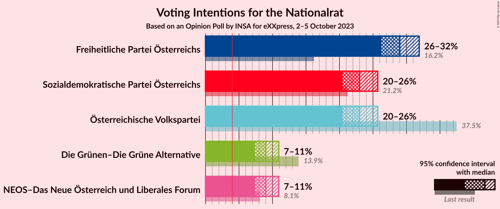

### Confidence Intervals

| Party | Last Result | Poll Result | 80% Confidence Interval | 90% Confidence Interval | 95% Confidence Interval | 99% Confidence Interval |
|:-----:|:-----------:|:-----------:|:-----------------------:|:-----------------------:|:-----------------------:|:-----------------------:|
| Freiheitliche Partei Österreichs | 16.2% | 29.0% | 27.2–30.9% |26.7–31.4% |26.3–31.9% |25.4–32.8% |
| Sozialdemokratische Partei Österreichs | 21.2% | 23.0% | 21.4–24.8% |20.9–25.3% |20.5–25.7% |19.7–26.6% |
| Österreichische Volkspartei | 37.5% | 23.0% | 21.4–24.8% |20.9–25.3% |20.5–25.7% |19.7–26.6% |
| Die Grünen–Die Grüne Alternative | 13.9% | 9.0% | 7.9–10.3% |7.6–10.6% |7.4–10.9% |6.9–11.6% |
| NEOS–Das Neue Österreich und Liberales Forum | 8.1% | 9.0% | 7.9–10.3% |7.6–10.6% |7.4–10.9% |6.9–11.6% |

*Note:* The poll result column reflects the actual value used in the calculations. Published results may vary slightly, and in addition be rounded to fewer digits.

## Seats

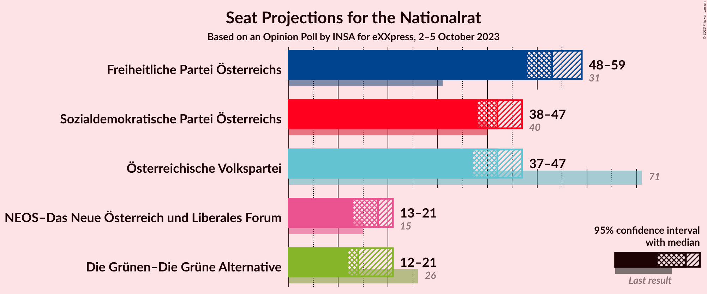

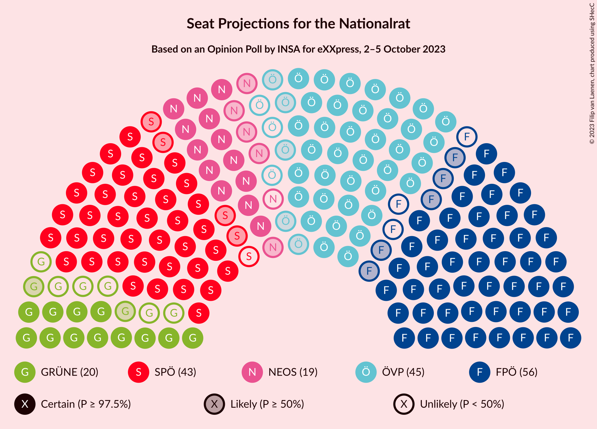

### Confidence Intervals

| Party | Last Result | Median | 80% Confidence Interval | 90% Confidence Interval | 95% Confidence Interval | 99% Confidence Interval |
|:-----:|:-----------:|:------:|:-----------------------:|:-----------------------:|:-----------------------:|:-----------------------:|
| <a href="#freiheitliche-partei-österreichs">Freiheitliche Partei Österreichs</a> | 31 | 53 | 50–57 |49–58 |48–59 |47–60 |
| <a href="#sozialdemokratische-partei-österreichs">Sozialdemokratische Partei Österreichs</a> | 40 | 42 | 39–46 |38–46 |38–47 |36–49 |
| <a href="#österreichische-volkspartei">Österreichische Volkspartei</a> | 71 | 42 | 39–45 |38–47 |37–47 |36–49 |
| <a href="#die-grünen–die-grüne-alternative">Die Grünen–Die Grüne Alternative</a> | 26 | 14 | 13–20 |13–21 |12–21 |12–22 |
| <a href="#neos–das-neue-österreich-und-liberales-forum">NEOS–Das Neue Österreich und Liberales Forum</a> | 15 | 18 | 14–20 |13–20 |13–21 |12–22 |

### Freiheitliche Partei Österreichs

*For a full overview of the results for this party, see the [Freiheitliche Partei Österreichs](party-freiheitlicheparteiösterreichs.html) page.*

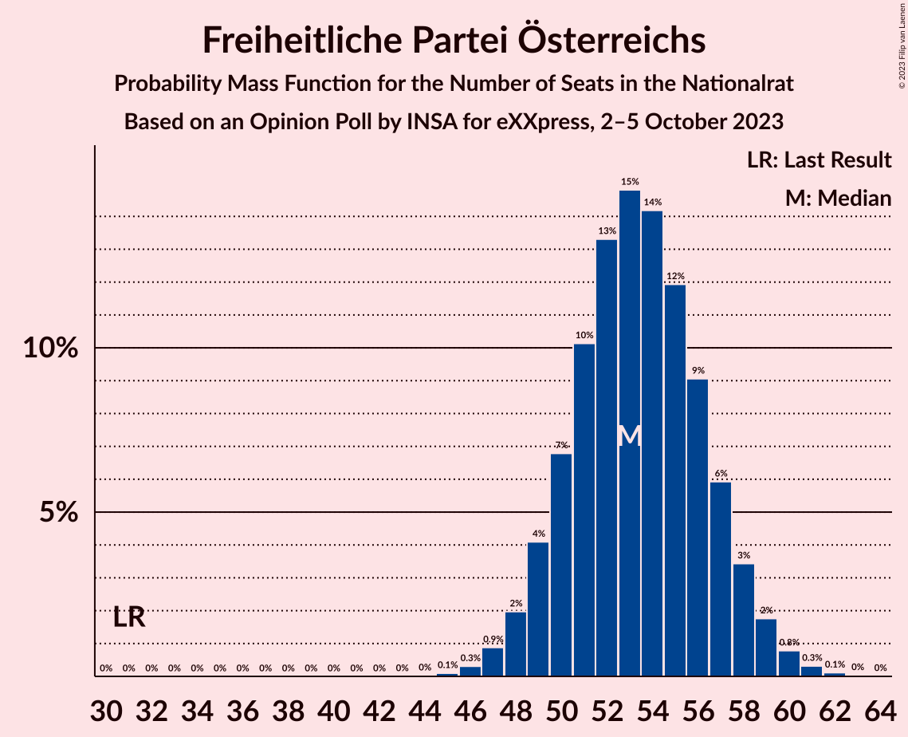

| Number of Seats | Probability | Accumulated | Special Marks |
|:---------------:|:-----------:|:-----------:|:-------------:|
| 31 | 0% | 100% | Last Result |
| 32 | 0% | 100% |  |
| 33 | 0% | 100% |  |
| 34 | 0% | 100% |  |
| 35 | 0% | 100% |  |
| 36 | 0% | 100% |  |
| 37 | 0% | 100% |  |
| 38 | 0% | 100% |  |
| 39 | 0% | 100% |  |
| 40 | 0% | 100% |  |
| 41 | 0% | 100% |  |
| 42 | 0% | 100% |  |
| 43 | 0% | 100% |  |
| 44 | 0% | 100% |  |
| 45 | 0.1% | 100% |  |
| 46 | 0.3% | 99.9% |  |
| 47 | 0.9% | 99.6% |  |
| 48 | 2% | 98.7% |  |
| 49 | 4% | 97% |  |
| 50 | 7% | 93% |  |
| 51 | 10% | 86% |  |
| 52 | 13% | 76% |  |
| 53 | 15% | 62% | Median |
| 54 | 14% | 48% |  |
| 55 | 12% | 33% |  |
| 56 | 9% | 21% |  |
| 57 | 6% | 12% |  |
| 58 | 3% | 6% |  |
| 59 | 2% | 3% |  |
| 60 | 0.8% | 1.3% |  |
| 61 | 0.3% | 0.5% |  |
| 62 | 0.1% | 0.2% |  |
| 63 | 0% | 0% |  |

### Sozialdemokratische Partei Österreichs

*For a full overview of the results for this party, see the [Sozialdemokratische Partei Österreichs](party-sozialdemokratischeparteiösterreichs.html) page.*

| Number of Seats | Probability | Accumulated | Special Marks |
|:---------------:|:-----------:|:-----------:|:-------------:|
| 34 | 0.1% | 100% |  |
| 35 | 0.2% | 99.9% |  |
| 36 | 0.4% | 99.7% |  |
| 37 | 2% | 99.3% |  |
| 38 | 4% | 98% |  |
| 39 | 8% | 93% |  |
| 40 | 9% | 85% | Last Result |
| 41 | 10% | 76% |  |
| 42 | 19% | 66% | Median |
| 43 | 20% | 47% |  |
| 44 | 9% | 27% |  |
| 45 | 7% | 18% |  |
| 46 | 6% | 11% |  |
| 47 | 3% | 5% |  |
| 48 | 1.2% | 2% |  |
| 49 | 0.3% | 0.6% |  |
| 50 | 0.2% | 0.3% |  |
| 51 | 0.1% | 0.1% |  |
| 52 | 0% | 0% |  |

### Österreichische Volkspartei

*For a full overview of the results for this party, see the [Österreichische Volkspartei](party-österreichischevolkspartei.html) page.*

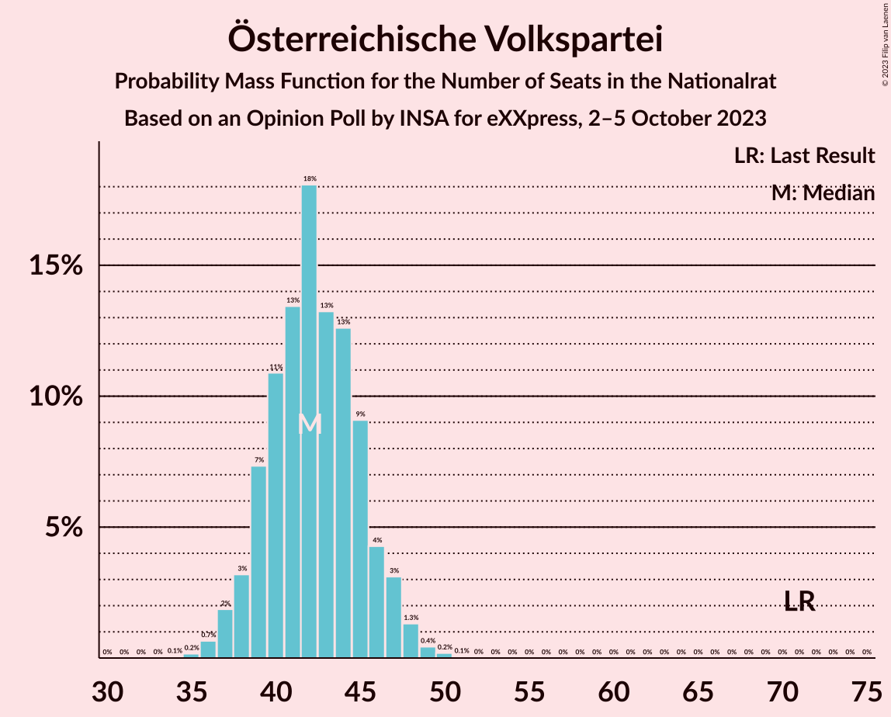

| Number of Seats | Probability | Accumulated | Special Marks |
|:---------------:|:-----------:|:-----------:|:-------------:|
| 34 | 0.1% | 100% |  |
| 35 | 0.2% | 99.9% |  |
| 36 | 0.7% | 99.8% |  |
| 37 | 2% | 99.1% |  |
| 38 | 3% | 97% |  |
| 39 | 7% | 94% |  |
| 40 | 11% | 87% |  |
| 41 | 13% | 76% |  |
| 42 | 18% | 62% | Median |
| 43 | 13% | 44% |  |
| 44 | 13% | 31% |  |
| 45 | 9% | 18% |  |
| 46 | 4% | 9% |  |
| 47 | 3% | 5% |  |
| 48 | 1.3% | 2% |  |
| 49 | 0.4% | 0.7% |  |
| 50 | 0.2% | 0.3% |  |
| 51 | 0.1% | 0.1% |  |
| 52 | 0% | 0% |  |
| 53 | 0% | 0% |  |
| 54 | 0% | 0% |  |
| 55 | 0% | 0% |  |
| 56 | 0% | 0% |  |
| 57 | 0% | 0% |  |
| 58 | 0% | 0% |  |
| 59 | 0% | 0% |  |
| 60 | 0% | 0% |  |
| 61 | 0% | 0% |  |
| 62 | 0% | 0% |  |
| 63 | 0% | 0% |  |
| 64 | 0% | 0% |  |
| 65 | 0% | 0% |  |
| 66 | 0% | 0% |  |
| 67 | 0% | 0% |  |
| 68 | 0% | 0% |  |
| 69 | 0% | 0% |  |
| 70 | 0% | 0% |  |
| 71 | 0% | 0% | Last Result |

### Die Grünen–Die Grüne Alternative

*For a full overview of the results for this party, see the [Die Grünen–Die Grüne Alternative](party-diegrünen–diegrünealternative.html) page.*

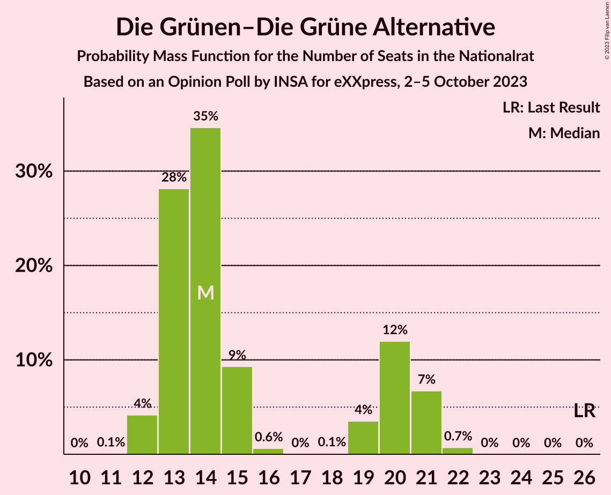

| Number of Seats | Probability | Accumulated | Special Marks |
|:---------------:|:-----------:|:-----------:|:-------------:|
| 11 | 0.1% | 100% |  |
| 12 | 4% | 99.9% |  |
| 13 | 28% | 96% |  |
| 14 | 35% | 68% | Median |
| 15 | 9% | 33% |  |
| 16 | 0.6% | 24% |  |
| 17 | 0% | 23% |  |
| 18 | 0.1% | 23% |  |
| 19 | 4% | 23% |  |
| 20 | 12% | 19% |  |
| 21 | 7% | 7% |  |
| 22 | 0.7% | 0.7% |  |
| 23 | 0% | 0% |  |
| 24 | 0% | 0% |  |
| 25 | 0% | 0% |  |
| 26 | 0% | 0% | Last Result |

### NEOS–Das Neue Österreich und Liberales Forum

*For a full overview of the results for this party, see the [NEOS–Das Neue Österreich und Liberales Forum](party-neos–dasneueösterreichundliberalesforum.html) page.*

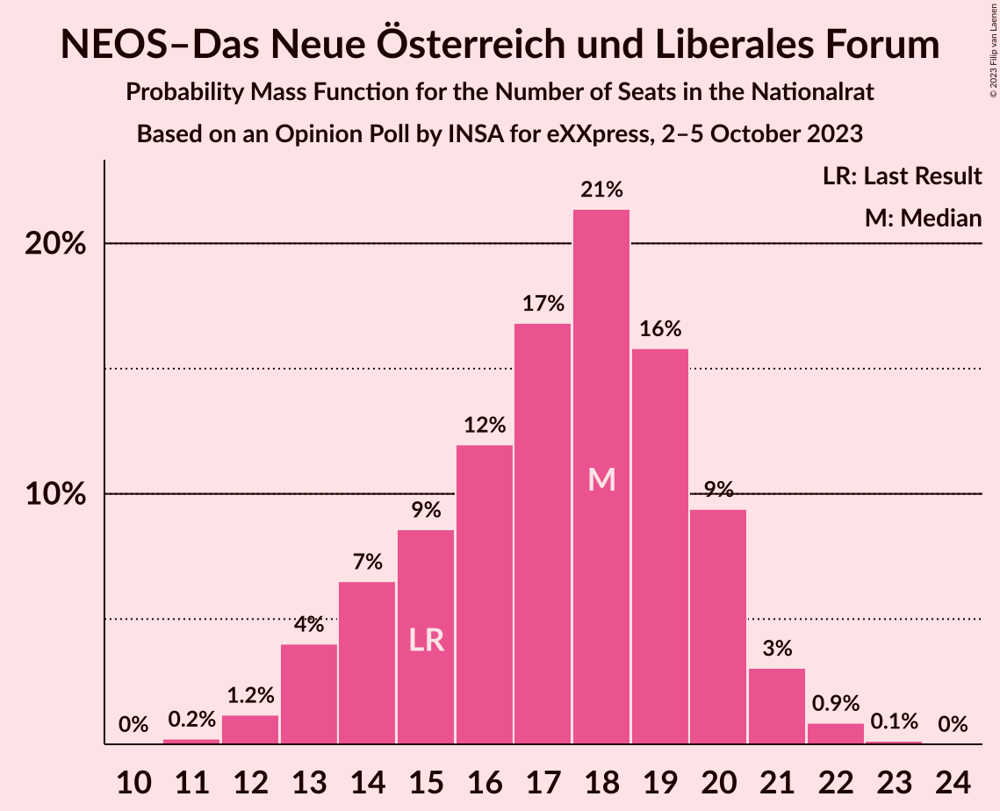

| Number of Seats | Probability | Accumulated | Special Marks |
|:---------------:|:-----------:|:-----------:|:-------------:|
| 11 | 0.2% | 100% |  |
| 12 | 1.2% | 99.8% |  |
| 13 | 4% | 98.6% |  |
| 14 | 7% | 95% |  |
| 15 | 9% | 88% | Last Result |
| 16 | 12% | 79% |  |
| 17 | 17% | 67% |  |
| 18 | 21% | 51% | Median |
| 19 | 16% | 29% |  |
| 20 | 9% | 13% |  |
| 21 | 3% | 4% |  |
| 22 | 0.9% | 1.0% |  |
| 23 | 0.1% | 0.2% |  |
| 24 | 0% | 0% |  |

## Coalitions

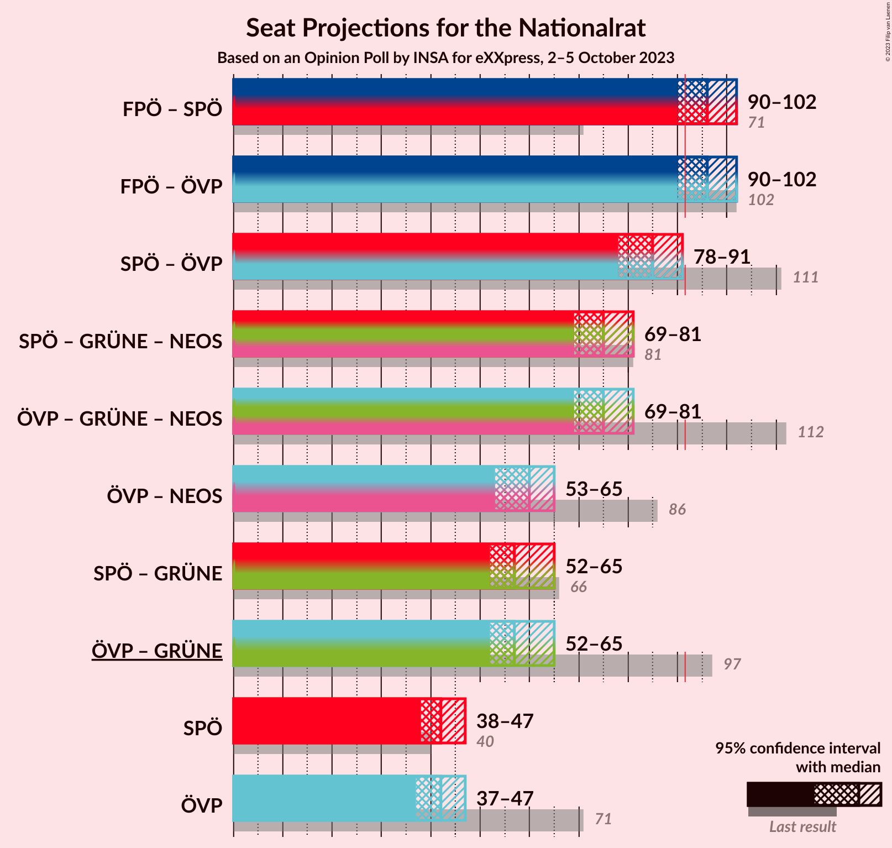

### Confidence Intervals

| Coalition | Last Result | Median | Majority? | 80% Confidence Interval | 90% Confidence Interval | 95% Confidence Interval | 99% Confidence Interval |
|:---------:|:-----------:|:------:|:---------:|:-----------------------:|:-----------------------:|:-----------------------:|:-----------------------:|
| Freiheitliche Partei Österreichs – Sozialdemokratische Partei Österreichs | 71 | 96 | 91% | 92–100 | 91–101 | 90–102 | 88–103 |
| Freiheitliche Partei Österreichs – Österreichische Volkspartei | 102 | 96 | 91% | 92–100 | 91–101 | 90–102 | 88–103 |
| Sozialdemokratische Partei Österreichs – Österreichische Volkspartei | 111 | 85 | 0.9% | 81–88 | 80–89 | 78–91 | 77–92 |
| Sozialdemokratische Partei Österreichs – Die Grünen–Die Grüne Alternative – NEOS–Das Neue Österreich und Liberales Forum | 81 | 75 | 0% | 71–79 | 70–80 | 69–81 | 67–83 |
| Österreichische Volkspartei – Die Grünen–Die Grüne Alternative – NEOS–Das Neue Österreich und Liberales Forum | 112 | 75 | 0% | 71–79 | 70–80 | 69–81 | 67–82 |
| Österreichische Volkspartei – NEOS–Das Neue Österreich und Liberales Forum | 86 | 60 | 0% | 55–63 | 54–64 | 53–65 | 51–67 |
| Sozialdemokratische Partei Österreichs – Die Grünen–Die Grüne Alternative | 66 | 57 | 0% | 53–62 | 52–63 | 52–65 | 50–67 |
| Österreichische Volkspartei – Die Grünen–Die Grüne Alternative | 97 | 57 | 0% | 53–62 | 53–64 | 52–65 | 50–67 |
| Sozialdemokratische Partei Österreichs | 40 | 42 | 0% | 39–46 | 38–46 | 38–47 | 36–49 |
| Österreichische Volkspartei | 71 | 42 | 0% | 39–45 | 38–47 | 37–47 | 36–49 |

### Freiheitliche Partei Österreichs – Sozialdemokratische Partei Österreichs

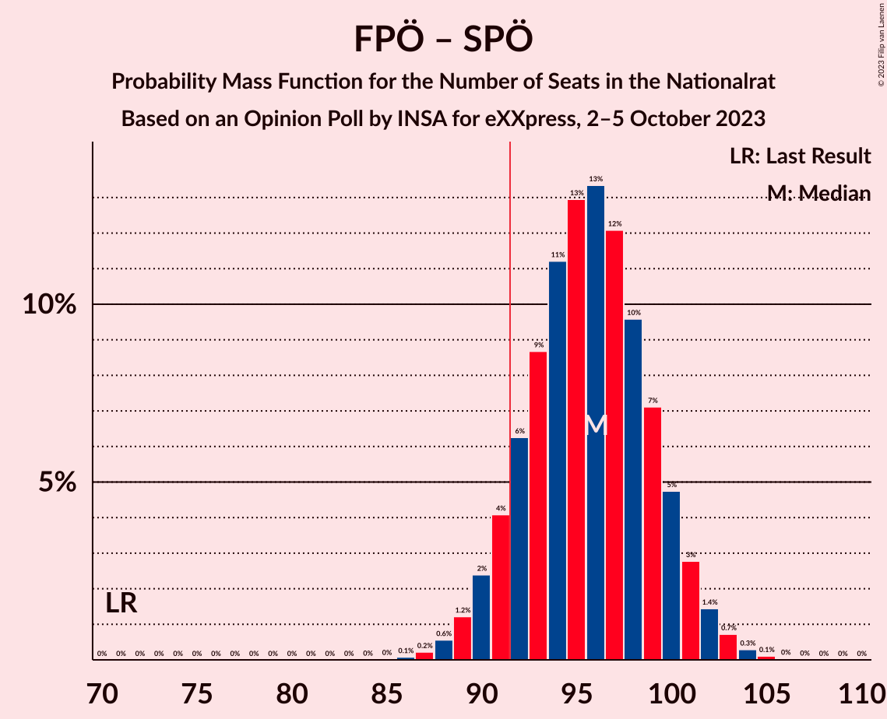

| Number of Seats | Probability | Accumulated | Special Marks |
|:---------------:|:-----------:|:-----------:|:-------------:|
| 71 | 0% | 100% | Last Result |
| 72 | 0% | 100% |  |
| 73 | 0% | 100% |  |
| 74 | 0% | 100% |  |
| 75 | 0% | 100% |  |
| 76 | 0% | 100% |  |
| 77 | 0% | 100% |  |
| 78 | 0% | 100% |  |
| 79 | 0% | 100% |  |
| 80 | 0% | 100% |  |
| 81 | 0% | 100% |  |
| 82 | 0% | 100% |  |
| 83 | 0% | 100% |  |
| 84 | 0% | 100% |  |
| 85 | 0% | 100% |  |
| 86 | 0.1% | 100% |  |
| 87 | 0.2% | 99.9% |  |
| 88 | 0.6% | 99.7% |  |
| 89 | 1.2% | 99.1% |  |
| 90 | 2% | 98% |  |
| 91 | 4% | 95% |  |
| 92 | 6% | 91% | Majority |
| 93 | 9% | 85% |  |
| 94 | 11% | 76% |  |
| 95 | 13% | 65% | Median |
| 96 | 13% | 52% |  |
| 97 | 12% | 39% |  |
| 98 | 10% | 27% |  |
| 99 | 7% | 17% |  |
| 100 | 5% | 10% |  |
| 101 | 3% | 5% |  |
| 102 | 1.4% | 3% |  |
| 103 | 0.7% | 1.2% |  |
| 104 | 0.3% | 0.5% |  |
| 105 | 0.1% | 0.2% |  |
| 106 | 0% | 0.1% |  |
| 107 | 0% | 0% |  |

### Freiheitliche Partei Österreichs – Österreichische Volkspartei

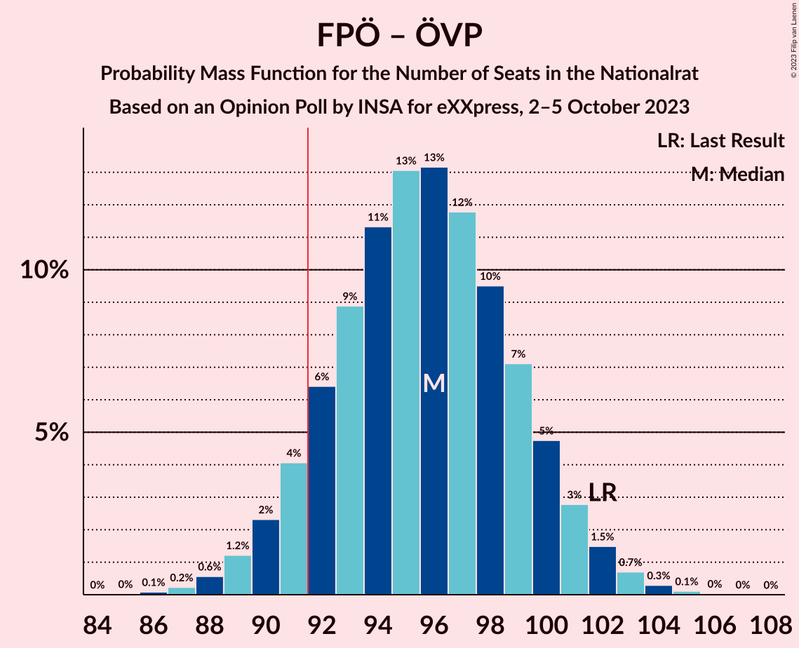

| Number of Seats | Probability | Accumulated | Special Marks |
|:---------------:|:-----------:|:-----------:|:-------------:|
| 86 | 0.1% | 100% |  |
| 87 | 0.2% | 99.9% |  |
| 88 | 0.6% | 99.6% |  |
| 89 | 1.2% | 99.1% |  |
| 90 | 2% | 98% |  |
| 91 | 4% | 96% |  |
| 92 | 6% | 91% | Majority |
| 93 | 9% | 85% |  |
| 94 | 11% | 76% |  |
| 95 | 13% | 65% | Median |
| 96 | 13% | 52% |  |
| 97 | 12% | 39% |  |
| 98 | 10% | 27% |  |
| 99 | 7% | 17% |  |
| 100 | 5% | 10% |  |
| 101 | 3% | 5% |  |
| 102 | 1.5% | 3% | Last Result |
| 103 | 0.7% | 1.2% |  |
| 104 | 0.3% | 0.5% |  |
| 105 | 0.1% | 0.2% |  |
| 106 | 0% | 0.1% |  |
| 107 | 0% | 0% |  |

### Sozialdemokratische Partei Österreichs – Österreichische Volkspartei

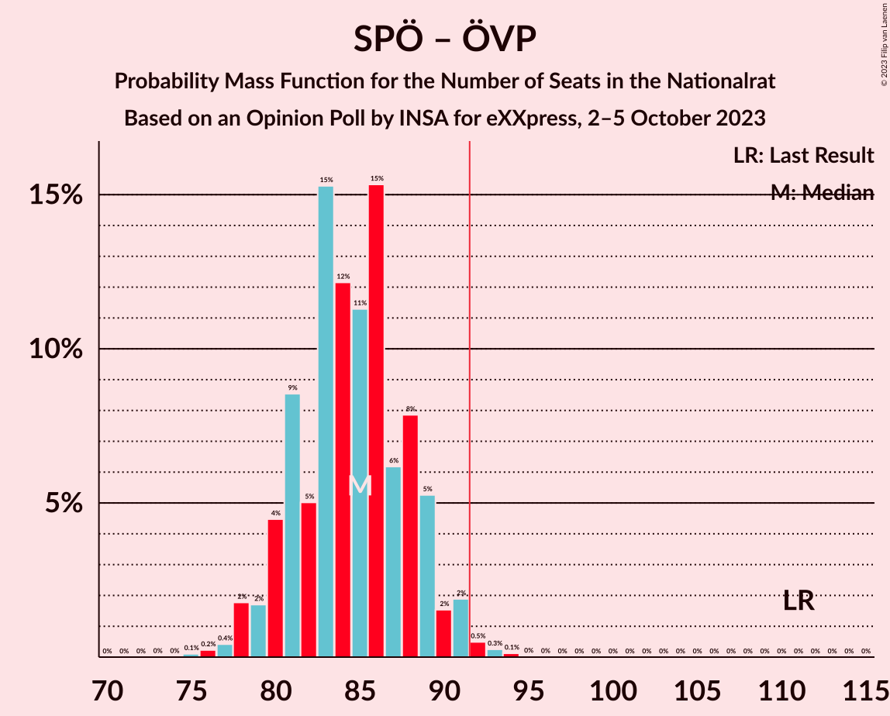

| Number of Seats | Probability | Accumulated | Special Marks |
|:---------------:|:-----------:|:-----------:|:-------------:|
| 75 | 0.1% | 100% |  |
| 76 | 0.2% | 99.9% |  |
| 77 | 0.4% | 99.6% |  |
| 78 | 2% | 99.2% |  |
| 79 | 2% | 97% |  |
| 80 | 4% | 96% |  |
| 81 | 9% | 91% |  |
| 82 | 5% | 83% |  |
| 83 | 15% | 78% |  |
| 84 | 12% | 62% | Median |
| 85 | 11% | 50% |  |
| 86 | 15% | 39% |  |
| 87 | 6% | 24% |  |
| 88 | 8% | 17% |  |
| 89 | 5% | 10% |  |
| 90 | 2% | 4% |  |
| 91 | 2% | 3% |  |
| 92 | 0.5% | 0.9% | Majority |
| 93 | 0.3% | 0.4% |  |
| 94 | 0.1% | 0.2% |  |
| 95 | 0% | 0% |  |
| 96 | 0% | 0% |  |
| 97 | 0% | 0% |  |
| 98 | 0% | 0% |  |
| 99 | 0% | 0% |  |
| 100 | 0% | 0% |  |
| 101 | 0% | 0% |  |
| 102 | 0% | 0% |  |
| 103 | 0% | 0% |  |
| 104 | 0% | 0% |  |
| 105 | 0% | 0% |  |
| 106 | 0% | 0% |  |
| 107 | 0% | 0% |  |
| 108 | 0% | 0% |  |
| 109 | 0% | 0% |  |
| 110 | 0% | 0% |  |
| 111 | 0% | 0% | Last Result |

### Sozialdemokratische Partei Österreichs – Die Grünen–Die Grüne Alternative – NEOS–Das Neue Österreich und Liberales Forum

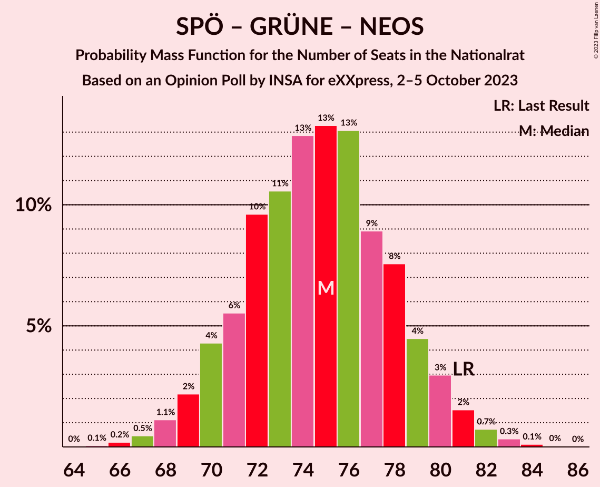

| Number of Seats | Probability | Accumulated | Special Marks |
|:---------------:|:-----------:|:-----------:|:-------------:|
| 65 | 0.1% | 100% |  |
| 66 | 0.2% | 99.9% |  |
| 67 | 0.5% | 99.7% |  |
| 68 | 1.1% | 99.3% |  |
| 69 | 2% | 98% |  |
| 70 | 4% | 96% |  |
| 71 | 6% | 92% |  |
| 72 | 10% | 86% |  |
| 73 | 11% | 77% |  |
| 74 | 13% | 66% | Median |
| 75 | 13% | 53% |  |
| 76 | 13% | 40% |  |
| 77 | 9% | 27% |  |
| 78 | 8% | 18% |  |
| 79 | 4% | 10% |  |
| 80 | 3% | 6% |  |
| 81 | 2% | 3% | Last Result |
| 82 | 0.7% | 1.2% |  |
| 83 | 0.3% | 0.5% |  |
| 84 | 0.1% | 0.2% |  |
| 85 | 0% | 0.1% |  |
| 86 | 0% | 0% |  |

### Österreichische Volkspartei – Die Grünen–Die Grüne Alternative – NEOS–Das Neue Österreich und Liberales Forum

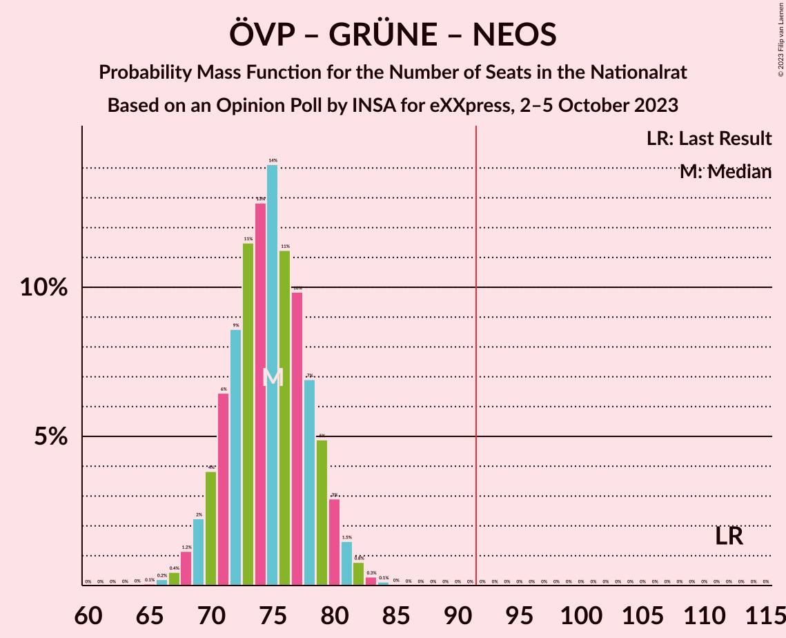

| Number of Seats | Probability | Accumulated | Special Marks |
|:---------------:|:-----------:|:-----------:|:-------------:|
| 65 | 0.1% | 100% |  |
| 66 | 0.2% | 99.9% |  |
| 67 | 0.4% | 99.7% |  |
| 68 | 1.2% | 99.3% |  |
| 69 | 2% | 98% |  |
| 70 | 4% | 96% |  |
| 71 | 6% | 92% |  |
| 72 | 9% | 86% |  |
| 73 | 11% | 77% |  |
| 74 | 13% | 65% | Median |
| 75 | 14% | 53% |  |
| 76 | 11% | 39% |  |
| 77 | 10% | 27% |  |
| 78 | 7% | 17% |  |
| 79 | 5% | 11% |  |
| 80 | 3% | 6% |  |
| 81 | 1.5% | 3% |  |
| 82 | 0.8% | 1.3% |  |
| 83 | 0.3% | 0.5% |  |
| 84 | 0.1% | 0.2% |  |
| 85 | 0% | 0.1% |  |
| 86 | 0% | 0% |  |
| 87 | 0% | 0% |  |
| 88 | 0% | 0% |  |
| 89 | 0% | 0% |  |
| 90 | 0% | 0% |  |
| 91 | 0% | 0% |  |
| 92 | 0% | 0% | Majority |
| 93 | 0% | 0% |  |
| 94 | 0% | 0% |  |
| 95 | 0% | 0% |  |
| 96 | 0% | 0% |  |
| 97 | 0% | 0% |  |
| 98 | 0% | 0% |  |
| 99 | 0% | 0% |  |
| 100 | 0% | 0% |  |
| 101 | 0% | 0% |  |
| 102 | 0% | 0% |  |
| 103 | 0% | 0% |  |
| 104 | 0% | 0% |  |
| 105 | 0% | 0% |  |
| 106 | 0% | 0% |  |
| 107 | 0% | 0% |  |
| 108 | 0% | 0% |  |
| 109 | 0% | 0% |  |
| 110 | 0% | 0% |  |
| 111 | 0% | 0% |  |
| 112 | 0% | 0% | Last Result |

### Österreichische Volkspartei – NEOS–Das Neue Österreich und Liberales Forum

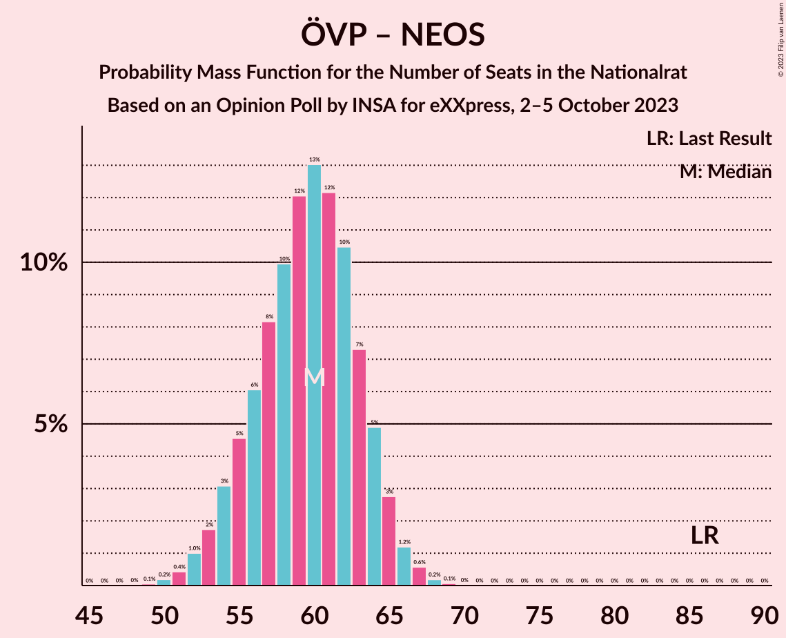

| Number of Seats | Probability | Accumulated | Special Marks |
|:---------------:|:-----------:|:-----------:|:-------------:|
| 49 | 0.1% | 100% |  |
| 50 | 0.2% | 99.9% |  |
| 51 | 0.4% | 99.7% |  |
| 52 | 1.0% | 99.3% |  |
| 53 | 2% | 98% |  |
| 54 | 3% | 97% |  |
| 55 | 5% | 93% |  |
| 56 | 6% | 89% |  |
| 57 | 8% | 83% |  |
| 58 | 10% | 75% |  |
| 59 | 12% | 65% |  |
| 60 | 13% | 53% | Median |
| 61 | 12% | 40% |  |
| 62 | 10% | 27% |  |
| 63 | 7% | 17% |  |
| 64 | 5% | 10% |  |
| 65 | 3% | 5% |  |
| 66 | 1.2% | 2% |  |
| 67 | 0.6% | 0.8% |  |
| 68 | 0.2% | 0.3% |  |
| 69 | 0.1% | 0.1% |  |
| 70 | 0% | 0% |  |
| 71 | 0% | 0% |  |
| 72 | 0% | 0% |  |
| 73 | 0% | 0% |  |
| 74 | 0% | 0% |  |
| 75 | 0% | 0% |  |
| 76 | 0% | 0% |  |
| 77 | 0% | 0% |  |
| 78 | 0% | 0% |  |
| 79 | 0% | 0% |  |
| 80 | 0% | 0% |  |
| 81 | 0% | 0% |  |
| 82 | 0% | 0% |  |
| 83 | 0% | 0% |  |
| 84 | 0% | 0% |  |
| 85 | 0% | 0% |  |
| 86 | 0% | 0% | Last Result |

### Sozialdemokratische Partei Österreichs – Die Grünen–Die Grüne Alternative

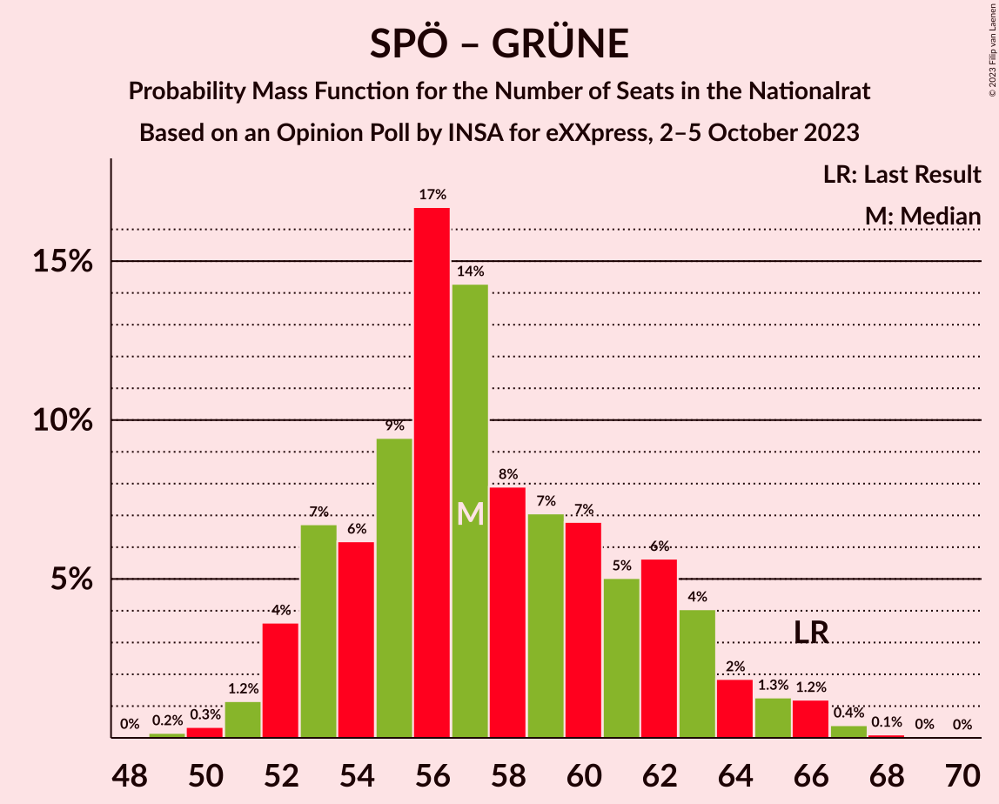

| Number of Seats | Probability | Accumulated | Special Marks |
|:---------------:|:-----------:|:-----------:|:-------------:|
| 49 | 0.2% | 100% |  |
| 50 | 0.3% | 99.8% |  |
| 51 | 1.2% | 99.5% |  |
| 52 | 4% | 98% |  |
| 53 | 7% | 95% |  |
| 54 | 6% | 88% |  |
| 55 | 9% | 82% |  |
| 56 | 17% | 72% | Median |
| 57 | 14% | 56% |  |
| 58 | 8% | 41% |  |
| 59 | 7% | 33% |  |
| 60 | 7% | 26% |  |
| 61 | 5% | 20% |  |
| 62 | 6% | 15% |  |
| 63 | 4% | 9% |  |
| 64 | 2% | 5% |  |
| 65 | 1.3% | 3% |  |
| 66 | 1.2% | 2% | Last Result |
| 67 | 0.4% | 0.6% |  |
| 68 | 0.1% | 0.2% |  |
| 69 | 0% | 0.1% |  |
| 70 | 0% | 0% |  |

### Österreichische Volkspartei – Die Grünen–Die Grüne Alternative

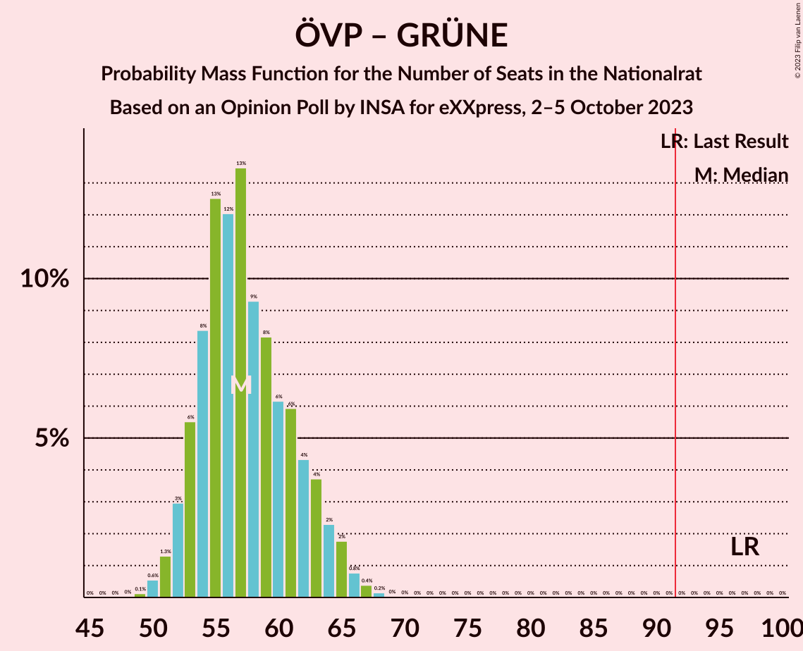

| Number of Seats | Probability | Accumulated | Special Marks |
|:---------------:|:-----------:|:-----------:|:-------------:|
| 49 | 0.1% | 100% |  |
| 50 | 0.6% | 99.8% |  |
| 51 | 1.3% | 99.3% |  |
| 52 | 3% | 98% |  |
| 53 | 6% | 95% |  |
| 54 | 8% | 89% |  |
| 55 | 13% | 81% |  |
| 56 | 12% | 69% | Median |
| 57 | 13% | 57% |  |
| 58 | 9% | 43% |  |
| 59 | 8% | 34% |  |
| 60 | 6% | 26% |  |
| 61 | 6% | 19% |  |
| 62 | 4% | 13% |  |
| 63 | 4% | 9% |  |
| 64 | 2% | 5% |  |
| 65 | 2% | 3% |  |
| 66 | 0.8% | 1.4% |  |
| 67 | 0.4% | 0.6% |  |
| 68 | 0.2% | 0.2% |  |
| 69 | 0% | 0.1% |  |
| 70 | 0% | 0% |  |
| 71 | 0% | 0% |  |
| 72 | 0% | 0% |  |
| 73 | 0% | 0% |  |
| 74 | 0% | 0% |  |
| 75 | 0% | 0% |  |
| 76 | 0% | 0% |  |
| 77 | 0% | 0% |  |
| 78 | 0% | 0% |  |
| 79 | 0% | 0% |  |
| 80 | 0% | 0% |  |
| 81 | 0% | 0% |  |
| 82 | 0% | 0% |  |
| 83 | 0% | 0% |  |
| 84 | 0% | 0% |  |
| 85 | 0% | 0% |  |
| 86 | 0% | 0% |  |
| 87 | 0% | 0% |  |
| 88 | 0% | 0% |  |
| 89 | 0% | 0% |  |
| 90 | 0% | 0% |  |
| 91 | 0% | 0% |  |
| 92 | 0% | 0% | Majority |
| 93 | 0% | 0% |  |
| 94 | 0% | 0% |  |
| 95 | 0% | 0% |  |
| 96 | 0% | 0% |  |
| 97 | 0% | 0% | Last Result |

### Sozialdemokratische Partei Österreichs

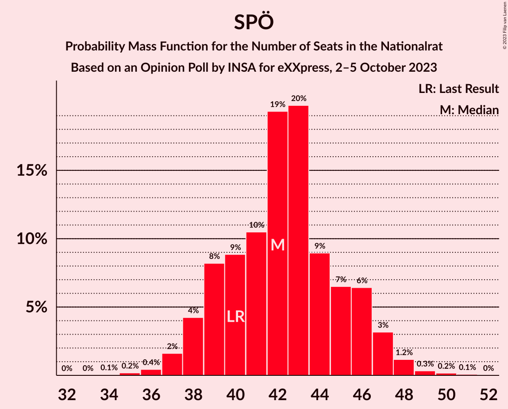

| Number of Seats | Probability | Accumulated | Special Marks |
|:---------------:|:-----------:|:-----------:|:-------------:|
| 34 | 0.1% | 100% |  |
| 35 | 0.2% | 99.9% |  |
| 36 | 0.4% | 99.7% |  |
| 37 | 2% | 99.3% |  |
| 38 | 4% | 98% |  |
| 39 | 8% | 93% |  |
| 40 | 9% | 85% | Last Result |
| 41 | 10% | 76% |  |
| 42 | 19% | 66% | Median |
| 43 | 20% | 47% |  |
| 44 | 9% | 27% |  |
| 45 | 7% | 18% |  |
| 46 | 6% | 11% |  |
| 47 | 3% | 5% |  |
| 48 | 1.2% | 2% |  |
| 49 | 0.3% | 0.6% |  |
| 50 | 0.2% | 0.3% |  |
| 51 | 0.1% | 0.1% |  |
| 52 | 0% | 0% |  |

### Österreichische Volkspartei

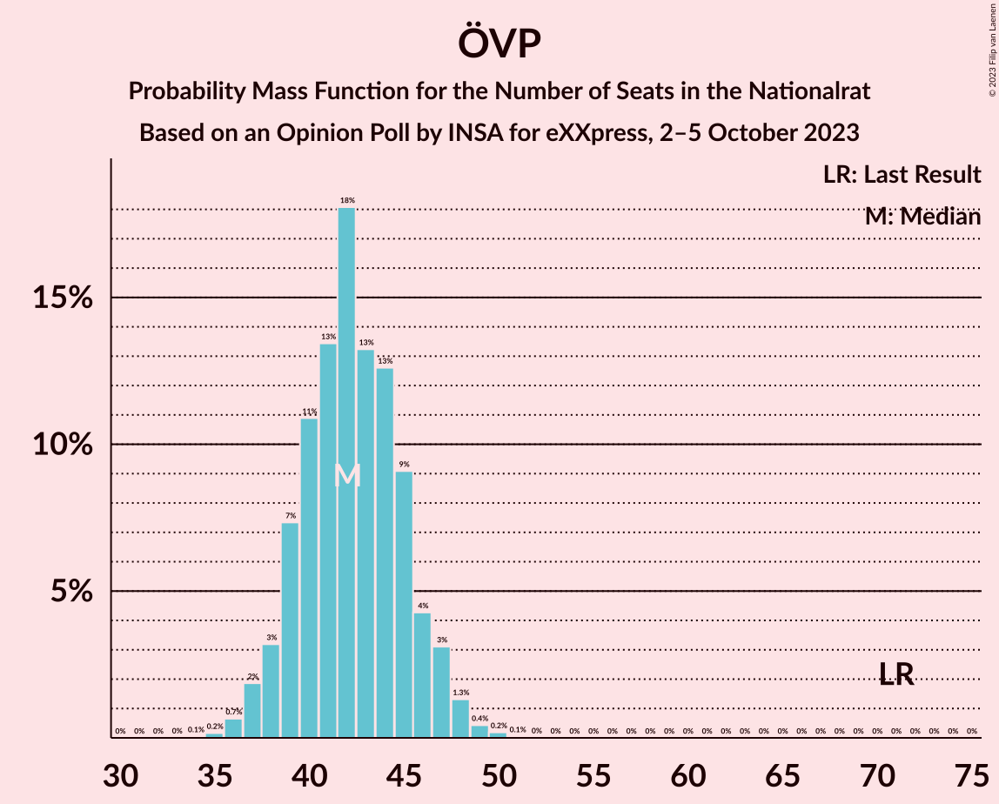

| Number of Seats | Probability | Accumulated | Special Marks |
|:---------------:|:-----------:|:-----------:|:-------------:|
| 34 | 0.1% | 100% |  |
| 35 | 0.2% | 99.9% |  |
| 36 | 0.7% | 99.8% |  |
| 37 | 2% | 99.1% |  |
| 38 | 3% | 97% |  |
| 39 | 7% | 94% |  |
| 40 | 11% | 87% |  |
| 41 | 13% | 76% |  |
| 42 | 18% | 62% | Median |
| 43 | 13% | 44% |  |
| 44 | 13% | 31% |  |
| 45 | 9% | 18% |  |
| 46 | 4% | 9% |  |
| 47 | 3% | 5% |  |
| 48 | 1.3% | 2% |  |
| 49 | 0.4% | 0.7% |  |
| 50 | 0.2% | 0.3% |  |
| 51 | 0.1% | 0.1% |  |
| 52 | 0% | 0% |  |
| 53 | 0% | 0% |  |
| 54 | 0% | 0% |  |
| 55 | 0% | 0% |  |
| 56 | 0% | 0% |  |
| 57 | 0% | 0% |  |
| 58 | 0% | 0% |  |
| 59 | 0% | 0% |  |
| 60 | 0% | 0% |  |
| 61 | 0% | 0% |  |
| 62 | 0% | 0% |  |
| 63 | 0% | 0% |  |
| 64 | 0% | 0% |  |
| 65 | 0% | 0% |  |
| 66 | 0% | 0% |  |
| 67 | 0% | 0% |  |
| 68 | 0% | 0% |  |
| 69 | 0% | 0% |  |
| 70 | 0% | 0% |  |
| 71 | 0% | 0% | Last Result |

## Technical Information

### Opinion Poll

+ **Polling firm:** INSA
+ **Commissioner(s):** eXXpress
+ **Fieldwork period:** 2–5 October 2023

### Calculations

+ **Sample size:** 1000
+ **Simulations done:** 1,048,576
+ **Error estimate:** 0.46%

