# Opinion Poll by OGM for KURIER, 18–24 January 2024

<a href="#voting-intentions">Voting Intentions</a> | <a href="#seats">Seats</a> | <a href="#coalitions">Coalitions</a> | <a href="#technical-information">Technical Information</a>

## Voting Intentions

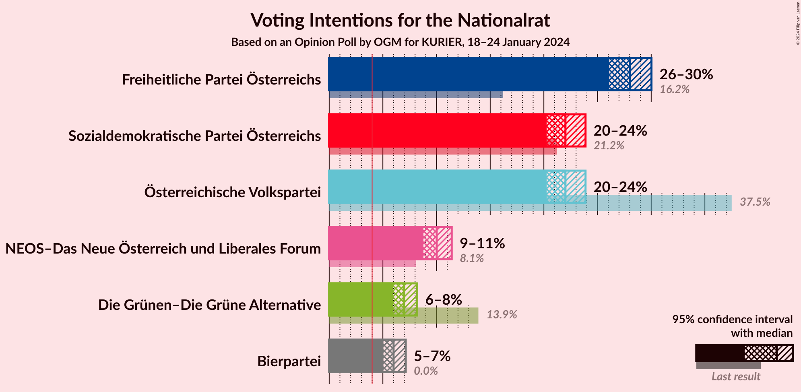

### Confidence Intervals

| Party | Last Result | Poll Result | 80% Confidence Interval | 90% Confidence Interval | 95% Confidence Interval | 99% Confidence Interval |
|:-----:|:-----------:|:-----------:|:-----------------------:|:-----------------------:|:-----------------------:|:-----------------------:|
| Freiheitliche Partei Österreichs | 16.2% | 28.0% | 26.7–29.3% |26.4–29.7% |26.1–30.0% |25.5–30.7% |
| Sozialdemokratische Partei Österreichs | 21.2% | 22.0% | 20.9–23.2% |20.5–23.6% |20.3–23.9% |19.7–24.5% |
| Österreichische Volkspartei | 37.5% | 22.0% | 20.9–23.2% |20.5–23.6% |20.3–23.9% |19.7–24.5% |
| NEOS–Das Neue Österreich und Liberales Forum | 8.1% | 10.0% | 9.2–10.9% |9.0–11.2% |8.8–11.4% |8.4–11.9% |
| Die Grünen–Die Grüne Alternative | 13.9% | 7.0% | 6.3–7.8% |6.1–8.0% |5.9–8.2% |5.6–8.6% |
| Bierpartei | 0.0% | 6.0% | 5.4–6.7% |5.2–7.0% |5.0–7.1% |4.8–7.5% |

*Note:* The poll result column reflects the actual value used in the calculations. Published results may vary slightly, and in addition be rounded to fewer digits.

## Seats

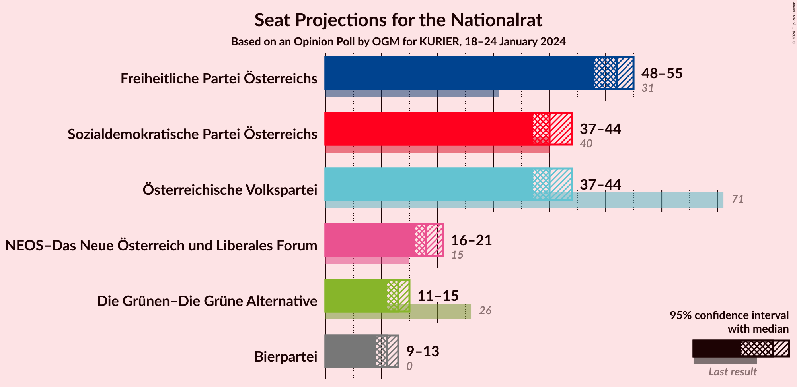

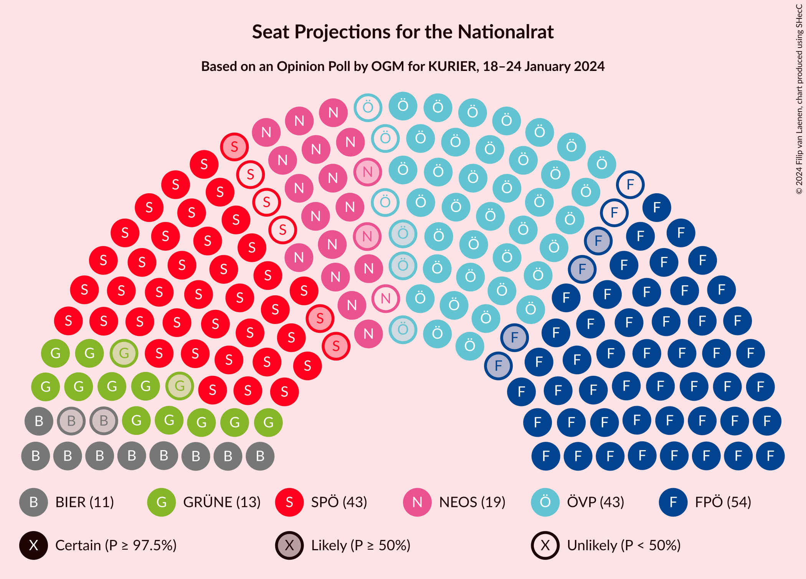

### Confidence Intervals

| Party | Last Result | Median | 80% Confidence Interval | 90% Confidence Interval | 95% Confidence Interval | 99% Confidence Interval |
|:-----:|:-----------:|:------:|:-----------------------:|:-----------------------:|:-----------------------:|:-----------------------:|
| <a href="#freiheitliche-partei-österreichs">Freiheitliche Partei Österreichs</a> | 31 | 52 | 49–54 |49–55 |48–55 |47–57 |
| <a href="#sozialdemokratische-partei-österreichs">Sozialdemokratische Partei Österreichs</a> | 40 | 40 | 38–43 |38–43 |37–44 |36–45 |
| <a href="#österreichische-volkspartei">Österreichische Volkspartei</a> | 71 | 40 | 38–43 |38–43 |37–44 |36–45 |
| <a href="#neos–das-neue-österreich-und-liberales-forum">NEOS–Das Neue Österreich und Liberales Forum</a> | 15 | 18 | 17–20 |16–20 |16–21 |15–22 |
| <a href="#die-grünen–die-grüne-alternative">Die Grünen–Die Grüne Alternative</a> | 26 | 13 | 11–14 |11–14 |11–15 |10–15 |
| <a href="#bierpartei">Bierpartei</a> | 0 | 11 | 10–12 |9–12 |9–13 |8–13 |

### Freiheitliche Partei Österreichs

*For a full overview of the results for this party, see the [Freiheitliche Partei Österreichs](party-freiheitlicheparteiösterreichs.html) page.*

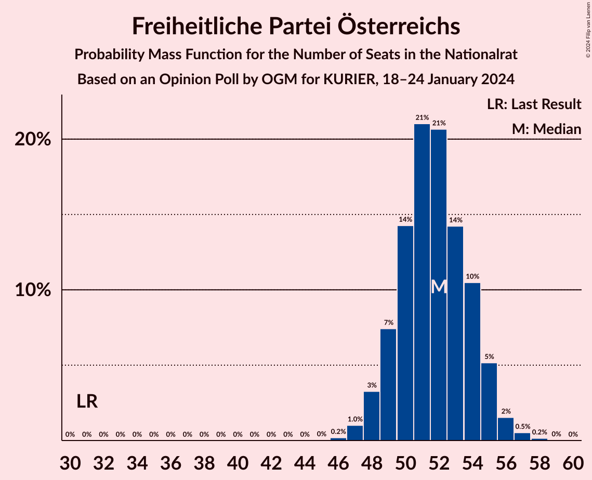

| Number of Seats | Probability | Accumulated | Special Marks |
|:---------------:|:-----------:|:-----------:|:-------------:|
| 31 | 0% | 100% | Last Result |
| 32 | 0% | 100% |  |
| 33 | 0% | 100% |  |
| 34 | 0% | 100% |  |
| 35 | 0% | 100% |  |
| 36 | 0% | 100% |  |
| 37 | 0% | 100% |  |
| 38 | 0% | 100% |  |
| 39 | 0% | 100% |  |
| 40 | 0% | 100% |  |
| 41 | 0% | 100% |  |
| 42 | 0% | 100% |  |
| 43 | 0% | 100% |  |
| 44 | 0% | 100% |  |
| 45 | 0% | 100% |  |
| 46 | 0.2% | 100% |  |
| 47 | 1.0% | 99.8% |  |
| 48 | 3% | 98.8% |  |
| 49 | 7% | 95% |  |
| 50 | 14% | 88% |  |
| 51 | 21% | 74% |  |
| 52 | 21% | 53% | Median |
| 53 | 14% | 32% |  |
| 54 | 10% | 18% |  |
| 55 | 5% | 7% |  |
| 56 | 2% | 2% |  |
| 57 | 0.5% | 0.7% |  |
| 58 | 0.2% | 0.2% |  |
| 59 | 0% | 0% |  |

### Sozialdemokratische Partei Österreichs

*For a full overview of the results for this party, see the [Sozialdemokratische Partei Österreichs](party-sozialdemokratischeparteiösterreichs.html) page.*

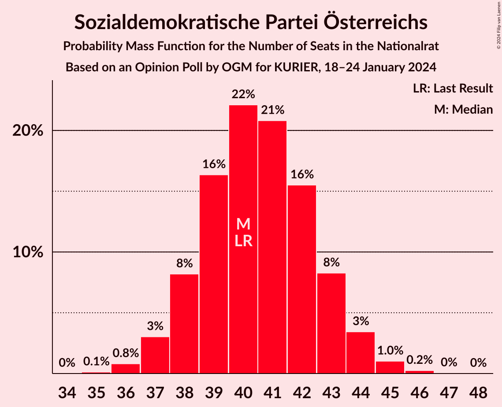

| Number of Seats | Probability | Accumulated | Special Marks |
|:---------------:|:-----------:|:-----------:|:-------------:|
| 35 | 0.1% | 100% |  |
| 36 | 0.8% | 99.9% |  |
| 37 | 3% | 99.0% |  |
| 38 | 8% | 96% |  |
| 39 | 16% | 88% |  |
| 40 | 22% | 71% | Last Result, Median |
| 41 | 21% | 49% |  |
| 42 | 16% | 29% |  |
| 43 | 8% | 13% |  |
| 44 | 3% | 5% |  |
| 45 | 1.0% | 1.3% |  |
| 46 | 0.2% | 0.3% |  |
| 47 | 0% | 0.1% |  |
| 48 | 0% | 0% |  |

### Österreichische Volkspartei

*For a full overview of the results for this party, see the [Österreichische Volkspartei](party-österreichischevolkspartei.html) page.*

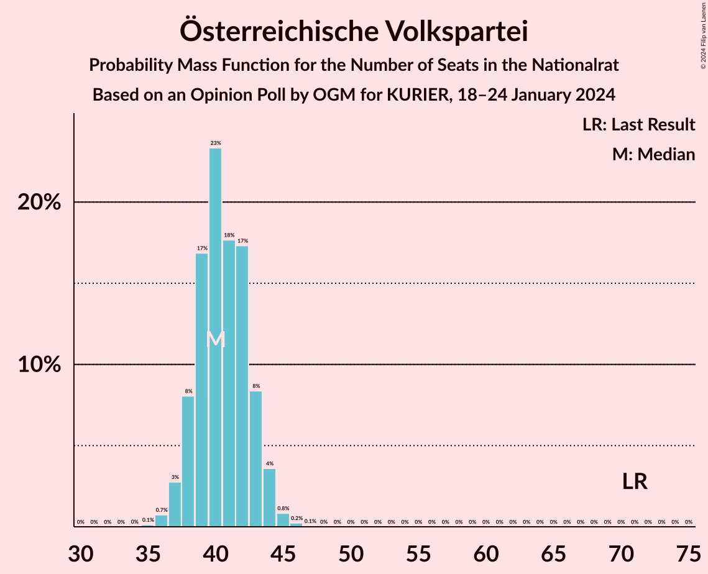

| Number of Seats | Probability | Accumulated | Special Marks |
|:---------------:|:-----------:|:-----------:|:-------------:|
| 35 | 0.1% | 100% |  |
| 36 | 0.7% | 99.9% |  |
| 37 | 3% | 99.1% |  |
| 38 | 8% | 96% |  |
| 39 | 17% | 88% |  |
| 40 | 23% | 71% | Median |
| 41 | 18% | 48% |  |
| 42 | 17% | 30% |  |
| 43 | 8% | 13% |  |
| 44 | 4% | 5% |  |
| 45 | 0.8% | 1.1% |  |
| 46 | 0.2% | 0.3% |  |
| 47 | 0.1% | 0.1% |  |
| 48 | 0% | 0% |  |
| 49 | 0% | 0% |  |
| 50 | 0% | 0% |  |
| 51 | 0% | 0% |  |
| 52 | 0% | 0% |  |
| 53 | 0% | 0% |  |
| 54 | 0% | 0% |  |
| 55 | 0% | 0% |  |
| 56 | 0% | 0% |  |
| 57 | 0% | 0% |  |
| 58 | 0% | 0% |  |
| 59 | 0% | 0% |  |
| 60 | 0% | 0% |  |
| 61 | 0% | 0% |  |
| 62 | 0% | 0% |  |
| 63 | 0% | 0% |  |
| 64 | 0% | 0% |  |
| 65 | 0% | 0% |  |
| 66 | 0% | 0% |  |
| 67 | 0% | 0% |  |
| 68 | 0% | 0% |  |
| 69 | 0% | 0% |  |
| 70 | 0% | 0% |  |
| 71 | 0% | 0% | Last Result |

### NEOS–Das Neue Österreich und Liberales Forum

*For a full overview of the results for this party, see the [NEOS–Das Neue Österreich und Liberales Forum](party-neos–dasneueösterreichundliberalesforum.html) page.*

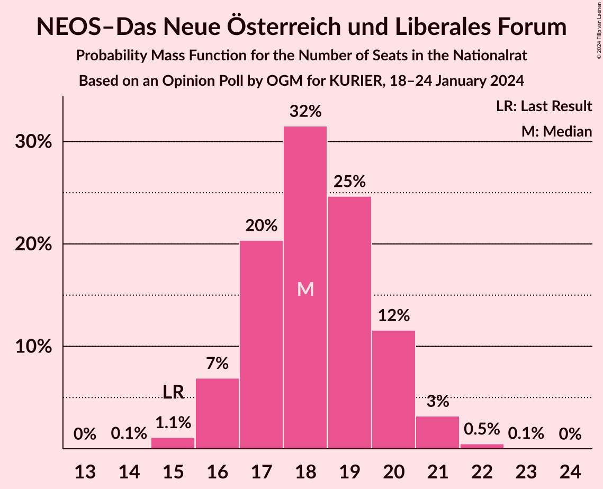

| Number of Seats | Probability | Accumulated | Special Marks |
|:---------------:|:-----------:|:-----------:|:-------------:|
| 14 | 0.1% | 100% |  |
| 15 | 1.1% | 99.9% | Last Result |
| 16 | 7% | 98.8% |  |
| 17 | 20% | 92% |  |
| 18 | 32% | 72% | Median |
| 19 | 25% | 40% |  |
| 20 | 12% | 15% |  |
| 21 | 3% | 4% |  |
| 22 | 0.5% | 0.6% |  |
| 23 | 0.1% | 0.1% |  |
| 24 | 0% | 0% |  |

### Die Grünen–Die Grüne Alternative

*For a full overview of the results for this party, see the [Die Grünen–Die Grüne Alternative](party-diegrünen–diegrünealternative.html) page.*

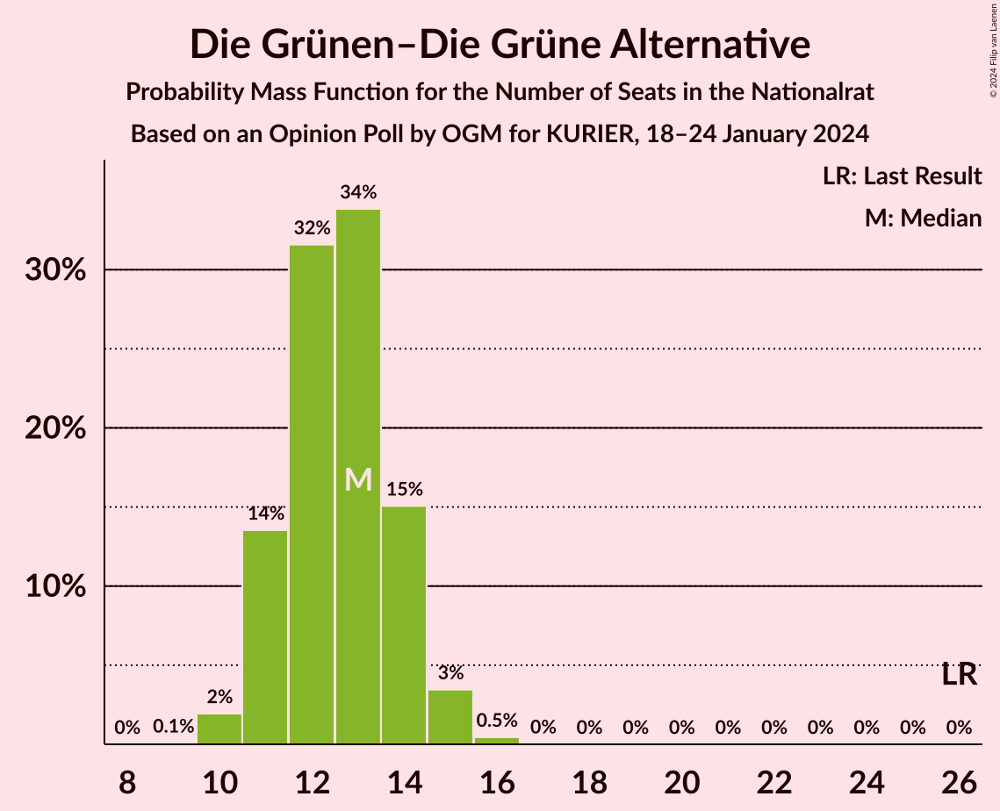

| Number of Seats | Probability | Accumulated | Special Marks |
|:---------------:|:-----------:|:-----------:|:-------------:|
| 9 | 0.1% | 100% |  |
| 10 | 2% | 99.9% |  |
| 11 | 14% | 98% |  |
| 12 | 32% | 84% |  |
| 13 | 34% | 53% | Median |
| 14 | 15% | 19% |  |
| 15 | 3% | 4% |  |
| 16 | 0.5% | 0.5% |  |
| 17 | 0% | 0% |  |
| 18 | 0% | 0% |  |
| 19 | 0% | 0% |  |
| 20 | 0% | 0% |  |
| 21 | 0% | 0% |  |
| 22 | 0% | 0% |  |
| 23 | 0% | 0% |  |
| 24 | 0% | 0% |  |
| 25 | 0% | 0% |  |
| 26 | 0% | 0% | Last Result |

### Bierpartei

*For a full overview of the results for this party, see the [Bierpartei](party-bierpartei.html) page.*

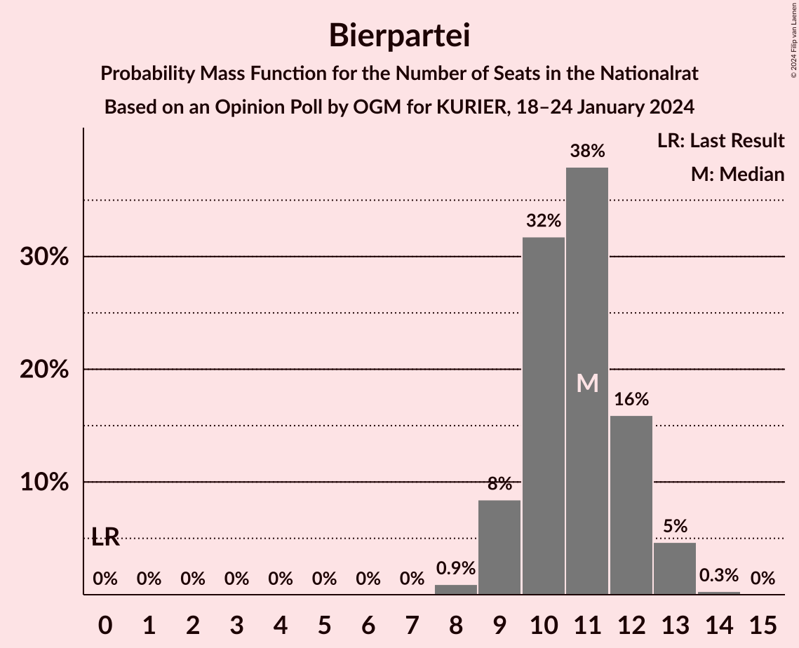

| Number of Seats | Probability | Accumulated | Special Marks |
|:---------------:|:-----------:|:-----------:|:-------------:|
| 0 | 0% | 100% | Last Result |
| 1 | 0% | 100% |  |
| 2 | 0% | 100% |  |
| 3 | 0% | 100% |  |
| 4 | 0% | 100% |  |
| 5 | 0% | 100% |  |
| 6 | 0% | 100% |  |
| 7 | 0% | 100% |  |
| 8 | 0.9% | 100% |  |
| 9 | 8% | 99.1% |  |
| 10 | 32% | 91% |  |
| 11 | 38% | 59% | Median |
| 12 | 16% | 21% |  |
| 13 | 5% | 5% |  |
| 14 | 0.3% | 0.3% |  |
| 15 | 0% | 0% |  |

## Coalitions

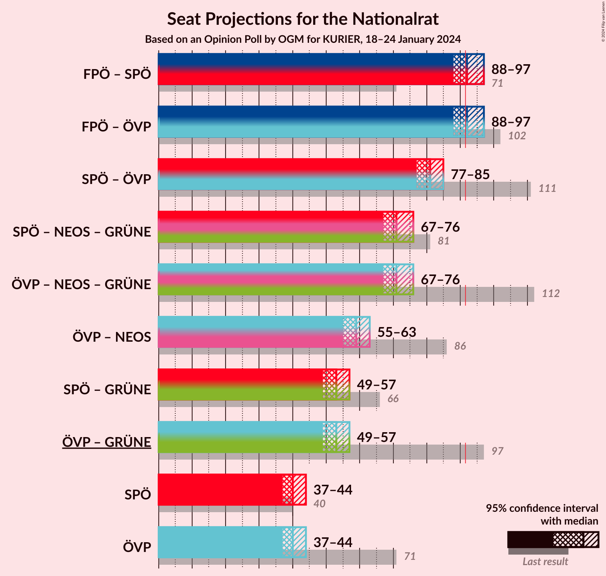

### Confidence Intervals

| Coalition | Last Result | Median | Majority? | 80% Confidence Interval | 90% Confidence Interval | 95% Confidence Interval | 99% Confidence Interval |
|:---------:|:-----------:|:------:|:---------:|:-----------------------:|:-----------------------:|:-----------------------:|:-----------------------:|
| Freiheitliche Partei Österreichs – Sozialdemokratische Partei Österreichs | 71 | 92 | 62% | 89–95 | 89–96 | 88–97 | 87–98 |
| Freiheitliche Partei Österreichs – Österreichische Volkspartei | 102 | 92 | 62% | 89–95 | 89–96 | 88–97 | 87–98 |
| Sozialdemokratische Partei Österreichs – Österreichische Volkspartei | 111 | 81 | 0% | 78–84 | 78–85 | 77–85 | 76–87 |
| Sozialdemokratische Partei Österreichs – NEOS–Das Neue Österreich und Liberales Forum – Die Grünen–Die Grüne Alternative | 81 | 71 | 0% | 69–74 | 68–75 | 67–76 | 66–77 |
| Österreichische Volkspartei – NEOS–Das Neue Österreich und Liberales Forum – Die Grünen–Die Grüne Alternative | 112 | 71 | 0% | 69–74 | 68–75 | 67–76 | 66–77 |
| Österreichische Volkspartei – NEOS–Das Neue Österreich und Liberales Forum | 86 | 59 | 0% | 56–61 | 55–62 | 55–63 | 54–64 |
| Sozialdemokratische Partei Österreichs – Die Grünen–Die Grüne Alternative | 66 | 53 | 0% | 51–56 | 50–56 | 49–57 | 48–58 |
| Österreichische Volkspartei – Die Grünen–Die Grüne Alternative | 97 | 53 | 0% | 51–56 | 50–56 | 49–57 | 48–58 |
| Sozialdemokratische Partei Österreichs | 40 | 40 | 0% | 38–43 | 38–43 | 37–44 | 36–45 |
| Österreichische Volkspartei | 71 | 40 | 0% | 38–43 | 38–43 | 37–44 | 36–45 |

### Freiheitliche Partei Österreichs – Sozialdemokratische Partei Österreichs

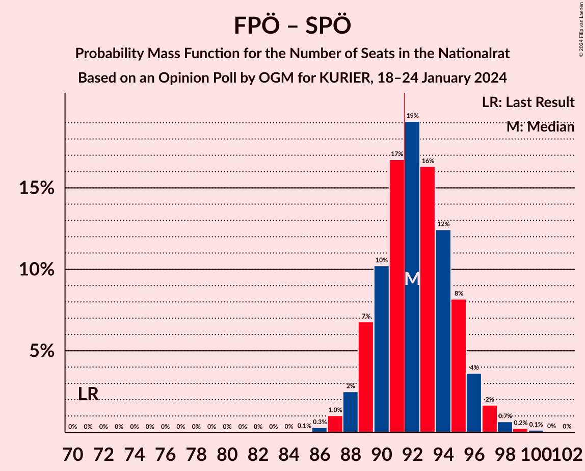

| Number of Seats | Probability | Accumulated | Special Marks |
|:---------------:|:-----------:|:-----------:|:-------------:|
| 71 | 0% | 100% | Last Result |
| 72 | 0% | 100% |  |
| 73 | 0% | 100% |  |
| 74 | 0% | 100% |  |
| 75 | 0% | 100% |  |
| 76 | 0% | 100% |  |
| 77 | 0% | 100% |  |
| 78 | 0% | 100% |  |
| 79 | 0% | 100% |  |
| 80 | 0% | 100% |  |
| 81 | 0% | 100% |  |
| 82 | 0% | 100% |  |
| 83 | 0% | 100% |  |
| 84 | 0% | 100% |  |
| 85 | 0.1% | 100% |  |
| 86 | 0.3% | 99.9% |  |
| 87 | 1.0% | 99.6% |  |
| 88 | 2% | 98.6% |  |
| 89 | 7% | 96% |  |
| 90 | 10% | 89% |  |
| 91 | 17% | 79% |  |
| 92 | 19% | 62% | Median, Majority |
| 93 | 16% | 43% |  |
| 94 | 12% | 27% |  |
| 95 | 8% | 15% |  |
| 96 | 4% | 6% |  |
| 97 | 2% | 3% |  |
| 98 | 0.7% | 1.1% |  |
| 99 | 0.2% | 0.4% |  |
| 100 | 0.1% | 0.2% |  |
| 101 | 0% | 0.1% |  |
| 102 | 0% | 0% |  |

### Freiheitliche Partei Österreichs – Österreichische Volkspartei

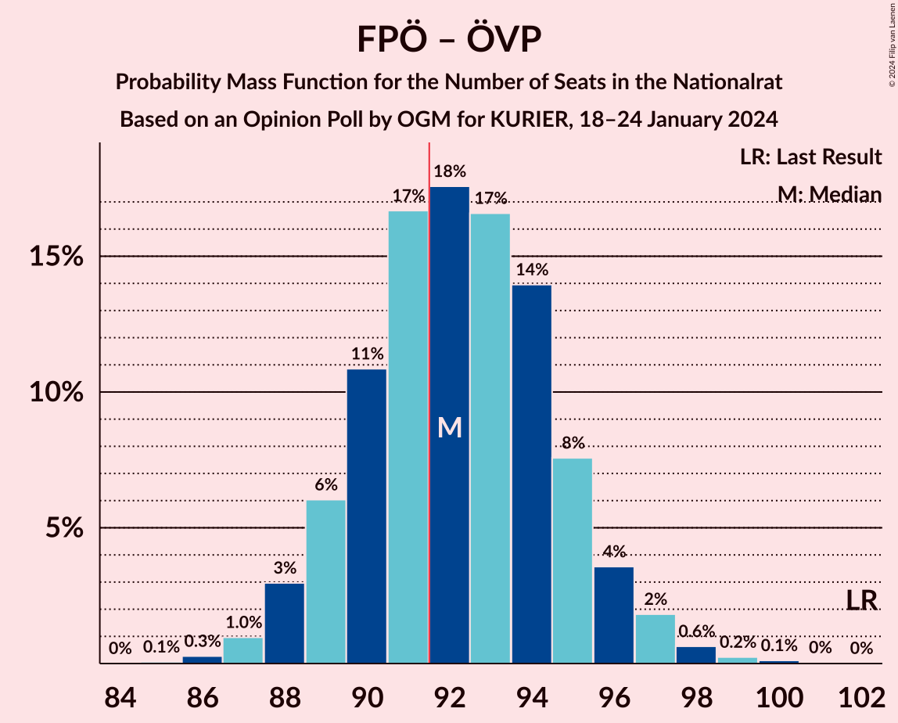

| Number of Seats | Probability | Accumulated | Special Marks |
|:---------------:|:-----------:|:-----------:|:-------------:|
| 85 | 0.1% | 100% |  |
| 86 | 0.3% | 99.9% |  |
| 87 | 1.0% | 99.6% |  |
| 88 | 3% | 98.7% |  |
| 89 | 6% | 96% |  |
| 90 | 11% | 90% |  |
| 91 | 17% | 79% |  |
| 92 | 18% | 62% | Median, Majority |
| 93 | 17% | 45% |  |
| 94 | 14% | 28% |  |
| 95 | 8% | 14% |  |
| 96 | 4% | 6% |  |
| 97 | 2% | 3% |  |
| 98 | 0.6% | 1.1% |  |
| 99 | 0.2% | 0.4% |  |
| 100 | 0.1% | 0.2% |  |
| 101 | 0% | 0.1% |  |
| 102 | 0% | 0% | Last Result |

### Sozialdemokratische Partei Österreichs – Österreichische Volkspartei

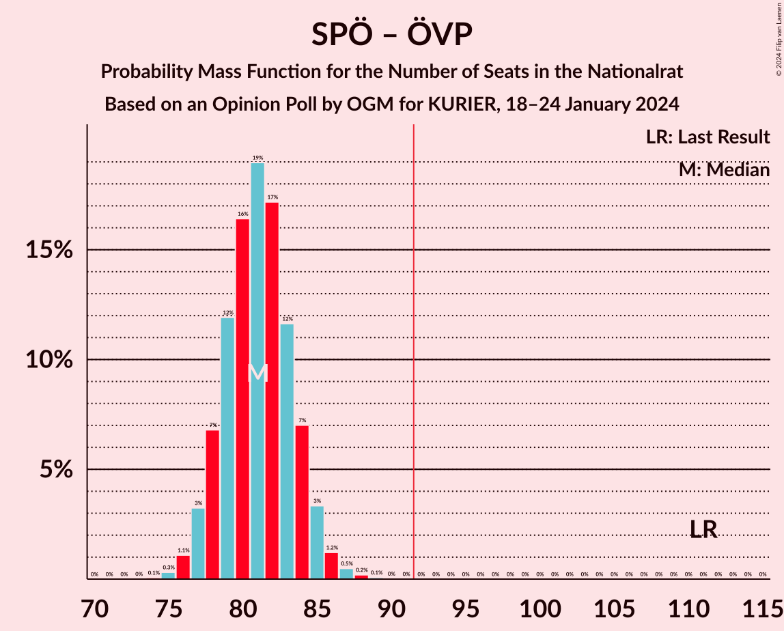

| Number of Seats | Probability | Accumulated | Special Marks |
|:---------------:|:-----------:|:-----------:|:-------------:|
| 74 | 0.1% | 100% |  |
| 75 | 0.3% | 99.9% |  |
| 76 | 1.1% | 99.6% |  |
| 77 | 3% | 98.5% |  |
| 78 | 7% | 95% |  |
| 79 | 12% | 88% |  |
| 80 | 16% | 77% | Median |
| 81 | 19% | 60% |  |
| 82 | 17% | 41% |  |
| 83 | 12% | 24% |  |
| 84 | 7% | 12% |  |
| 85 | 3% | 5% |  |
| 86 | 1.2% | 2% |  |
| 87 | 0.5% | 0.8% |  |
| 88 | 0.2% | 0.3% |  |
| 89 | 0.1% | 0.1% |  |
| 90 | 0% | 0% |  |
| 91 | 0% | 0% |  |
| 92 | 0% | 0% | Majority |
| 93 | 0% | 0% |  |
| 94 | 0% | 0% |  |
| 95 | 0% | 0% |  |
| 96 | 0% | 0% |  |
| 97 | 0% | 0% |  |
| 98 | 0% | 0% |  |
| 99 | 0% | 0% |  |
| 100 | 0% | 0% |  |
| 101 | 0% | 0% |  |
| 102 | 0% | 0% |  |
| 103 | 0% | 0% |  |
| 104 | 0% | 0% |  |
| 105 | 0% | 0% |  |
| 106 | 0% | 0% |  |
| 107 | 0% | 0% |  |
| 108 | 0% | 0% |  |
| 109 | 0% | 0% |  |
| 110 | 0% | 0% |  |
| 111 | 0% | 0% | Last Result |

### Sozialdemokratische Partei Österreichs – NEOS–Das Neue Österreich und Liberales Forum – Die Grünen–Die Grüne Alternative

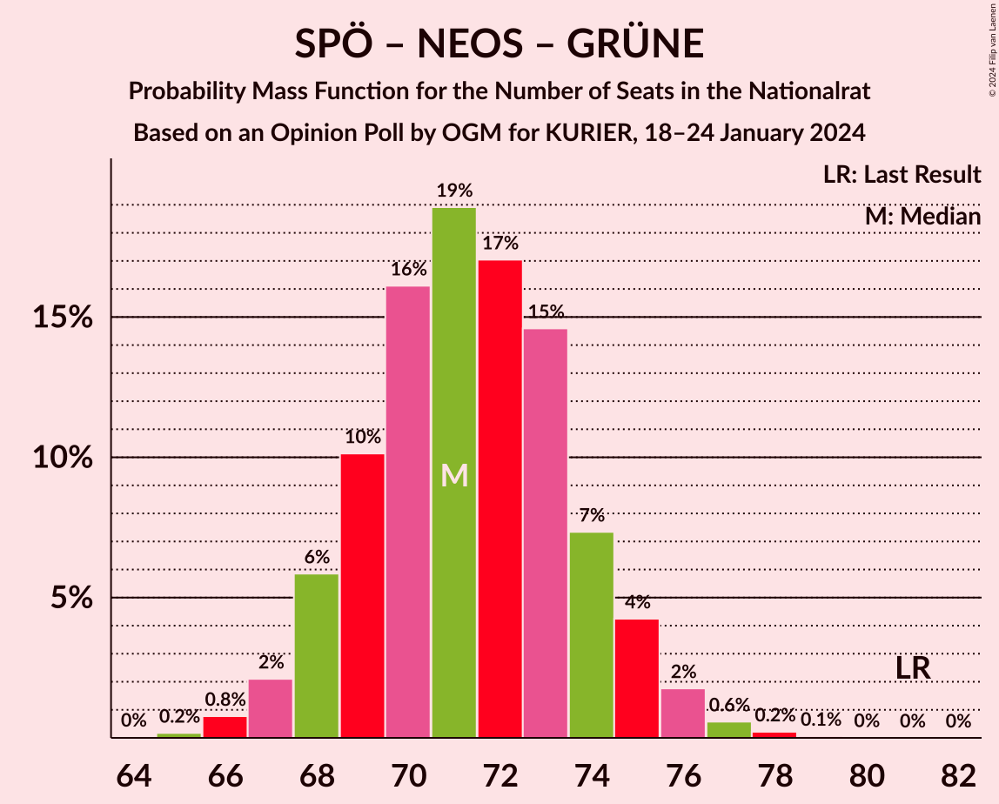

| Number of Seats | Probability | Accumulated | Special Marks |
|:---------------:|:-----------:|:-----------:|:-------------:|
| 65 | 0.2% | 100% |  |
| 66 | 0.8% | 99.8% |  |
| 67 | 2% | 99.0% |  |
| 68 | 6% | 97% |  |
| 69 | 10% | 91% |  |
| 70 | 16% | 81% |  |
| 71 | 19% | 65% | Median |
| 72 | 17% | 46% |  |
| 73 | 15% | 29% |  |
| 74 | 7% | 14% |  |
| 75 | 4% | 7% |  |
| 76 | 2% | 3% |  |
| 77 | 0.6% | 0.9% |  |
| 78 | 0.2% | 0.3% |  |
| 79 | 0.1% | 0.1% |  |
| 80 | 0% | 0% |  |
| 81 | 0% | 0% | Last Result |

### Österreichische Volkspartei – NEOS–Das Neue Österreich und Liberales Forum – Die Grünen–Die Grüne Alternative

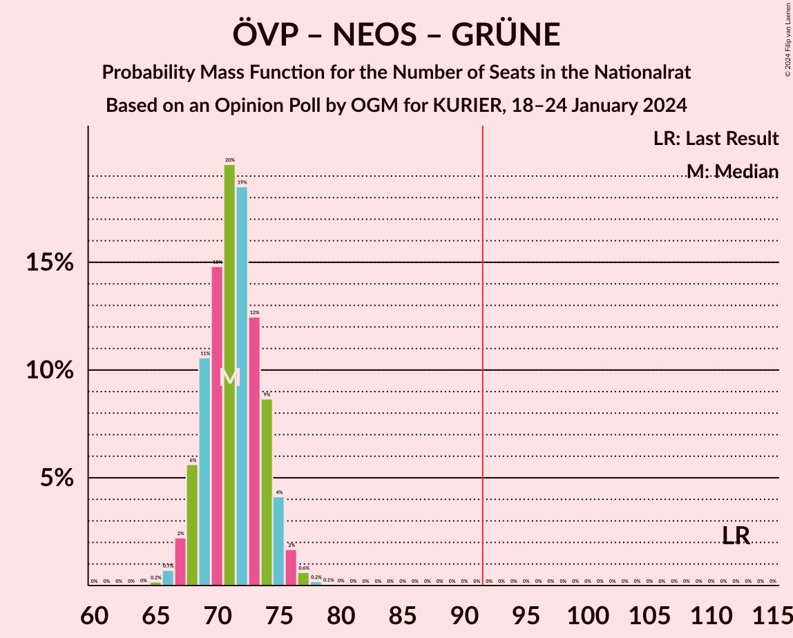

| Number of Seats | Probability | Accumulated | Special Marks |
|:---------------:|:-----------:|:-----------:|:-------------:|
| 65 | 0.2% | 100% |  |
| 66 | 0.7% | 99.8% |  |
| 67 | 2% | 99.1% |  |
| 68 | 6% | 97% |  |
| 69 | 11% | 91% |  |
| 70 | 15% | 81% |  |
| 71 | 20% | 66% | Median |
| 72 | 19% | 46% |  |
| 73 | 12% | 28% |  |
| 74 | 9% | 15% |  |
| 75 | 4% | 7% |  |
| 76 | 2% | 3% |  |
| 77 | 0.6% | 0.9% |  |
| 78 | 0.2% | 0.3% |  |
| 79 | 0.1% | 0.1% |  |
| 80 | 0% | 0% |  |
| 81 | 0% | 0% |  |
| 82 | 0% | 0% |  |
| 83 | 0% | 0% |  |
| 84 | 0% | 0% |  |
| 85 | 0% | 0% |  |
| 86 | 0% | 0% |  |
| 87 | 0% | 0% |  |
| 88 | 0% | 0% |  |
| 89 | 0% | 0% |  |
| 90 | 0% | 0% |  |
| 91 | 0% | 0% |  |
| 92 | 0% | 0% | Majority |
| 93 | 0% | 0% |  |
| 94 | 0% | 0% |  |
| 95 | 0% | 0% |  |
| 96 | 0% | 0% |  |
| 97 | 0% | 0% |  |
| 98 | 0% | 0% |  |
| 99 | 0% | 0% |  |
| 100 | 0% | 0% |  |
| 101 | 0% | 0% |  |
| 102 | 0% | 0% |  |
| 103 | 0% | 0% |  |
| 104 | 0% | 0% |  |
| 105 | 0% | 0% |  |
| 106 | 0% | 0% |  |
| 107 | 0% | 0% |  |
| 108 | 0% | 0% |  |
| 109 | 0% | 0% |  |
| 110 | 0% | 0% |  |
| 111 | 0% | 0% |  |
| 112 | 0% | 0% | Last Result |

### Österreichische Volkspartei – NEOS–Das Neue Österreich und Liberales Forum

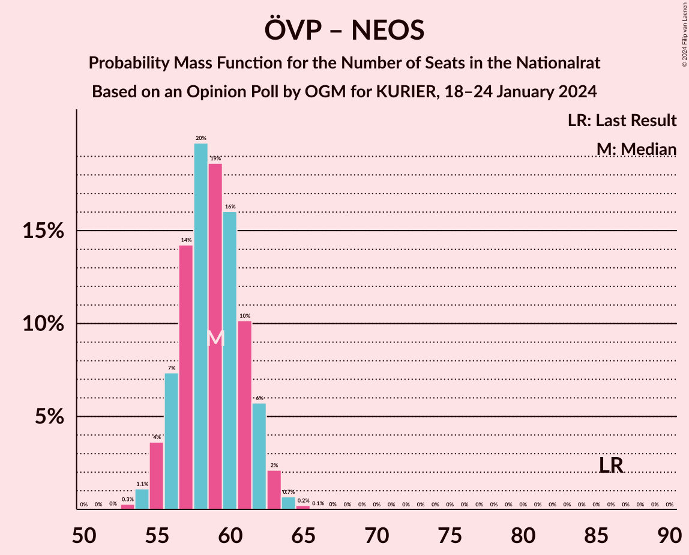

| Number of Seats | Probability | Accumulated | Special Marks |
|:---------------:|:-----------:|:-----------:|:-------------:|
| 52 | 0% | 100% |  |
| 53 | 0.3% | 99.9% |  |
| 54 | 1.1% | 99.7% |  |
| 55 | 4% | 98.6% |  |
| 56 | 7% | 95% |  |
| 57 | 14% | 88% |  |
| 58 | 20% | 73% | Median |
| 59 | 19% | 54% |  |
| 60 | 16% | 35% |  |
| 61 | 10% | 19% |  |
| 62 | 6% | 9% |  |
| 63 | 2% | 3% |  |
| 64 | 0.7% | 1.0% |  |
| 65 | 0.2% | 0.3% |  |
| 66 | 0.1% | 0.1% |  |
| 67 | 0% | 0% |  |
| 68 | 0% | 0% |  |
| 69 | 0% | 0% |  |
| 70 | 0% | 0% |  |
| 71 | 0% | 0% |  |
| 72 | 0% | 0% |  |
| 73 | 0% | 0% |  |
| 74 | 0% | 0% |  |
| 75 | 0% | 0% |  |
| 76 | 0% | 0% |  |
| 77 | 0% | 0% |  |
| 78 | 0% | 0% |  |
| 79 | 0% | 0% |  |
| 80 | 0% | 0% |  |
| 81 | 0% | 0% |  |
| 82 | 0% | 0% |  |
| 83 | 0% | 0% |  |
| 84 | 0% | 0% |  |
| 85 | 0% | 0% |  |
| 86 | 0% | 0% | Last Result |

### Sozialdemokratische Partei Österreichs – Die Grünen–Die Grüne Alternative

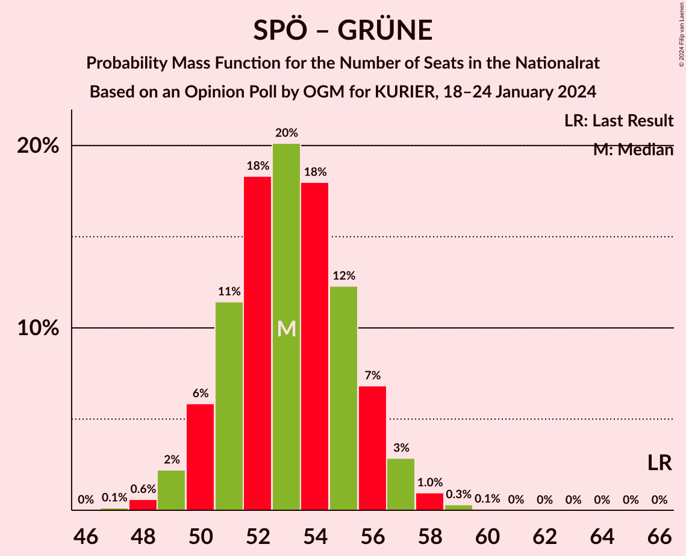

| Number of Seats | Probability | Accumulated | Special Marks |
|:---------------:|:-----------:|:-----------:|:-------------:|
| 47 | 0.1% | 100% |  |
| 48 | 0.6% | 99.8% |  |
| 49 | 2% | 99.3% |  |
| 50 | 6% | 97% |  |
| 51 | 11% | 91% |  |
| 52 | 18% | 80% |  |
| 53 | 20% | 61% | Median |
| 54 | 18% | 41% |  |
| 55 | 12% | 23% |  |
| 56 | 7% | 11% |  |
| 57 | 3% | 4% |  |
| 58 | 1.0% | 1.4% |  |
| 59 | 0.3% | 0.4% |  |
| 60 | 0.1% | 0.1% |  |
| 61 | 0% | 0% |  |
| 62 | 0% | 0% |  |
| 63 | 0% | 0% |  |
| 64 | 0% | 0% |  |
| 65 | 0% | 0% |  |
| 66 | 0% | 0% | Last Result |

### Österreichische Volkspartei – Die Grünen–Die Grüne Alternative

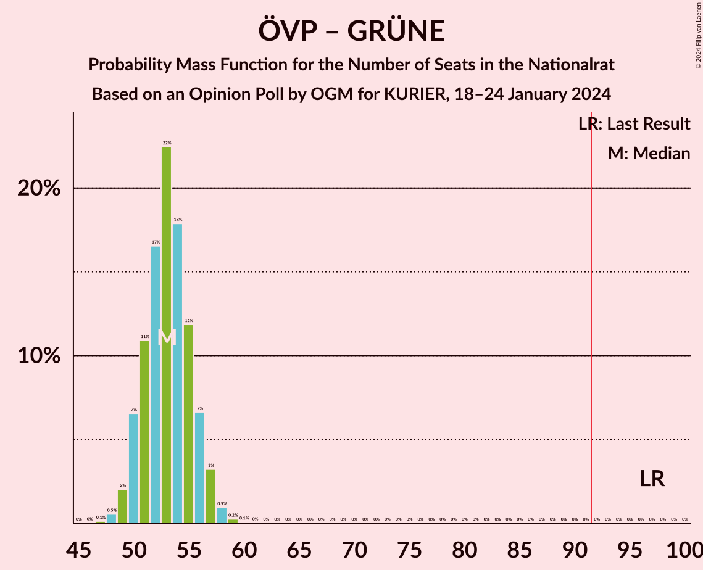

| Number of Seats | Probability | Accumulated | Special Marks |
|:---------------:|:-----------:|:-----------:|:-------------:|
| 47 | 0.1% | 100% |  |
| 48 | 0.5% | 99.9% |  |
| 49 | 2% | 99.3% |  |
| 50 | 7% | 97% |  |
| 51 | 11% | 91% |  |
| 52 | 17% | 80% |  |
| 53 | 22% | 63% | Median |
| 54 | 18% | 41% |  |
| 55 | 12% | 23% |  |
| 56 | 7% | 11% |  |
| 57 | 3% | 4% |  |
| 58 | 0.9% | 1.3% |  |
| 59 | 0.2% | 0.3% |  |
| 60 | 0.1% | 0.1% |  |
| 61 | 0% | 0% |  |
| 62 | 0% | 0% |  |
| 63 | 0% | 0% |  |
| 64 | 0% | 0% |  |
| 65 | 0% | 0% |  |
| 66 | 0% | 0% |  |
| 67 | 0% | 0% |  |
| 68 | 0% | 0% |  |
| 69 | 0% | 0% |  |
| 70 | 0% | 0% |  |
| 71 | 0% | 0% |  |
| 72 | 0% | 0% |  |
| 73 | 0% | 0% |  |
| 74 | 0% | 0% |  |
| 75 | 0% | 0% |  |
| 76 | 0% | 0% |  |
| 77 | 0% | 0% |  |
| 78 | 0% | 0% |  |
| 79 | 0% | 0% |  |
| 80 | 0% | 0% |  |
| 81 | 0% | 0% |  |
| 82 | 0% | 0% |  |
| 83 | 0% | 0% |  |
| 84 | 0% | 0% |  |
| 85 | 0% | 0% |  |
| 86 | 0% | 0% |  |
| 87 | 0% | 0% |  |
| 88 | 0% | 0% |  |
| 89 | 0% | 0% |  |
| 90 | 0% | 0% |  |
| 91 | 0% | 0% |  |
| 92 | 0% | 0% | Majority |
| 93 | 0% | 0% |  |
| 94 | 0% | 0% |  |
| 95 | 0% | 0% |  |
| 96 | 0% | 0% |  |
| 97 | 0% | 0% | Last Result |

### Sozialdemokratische Partei Österreichs

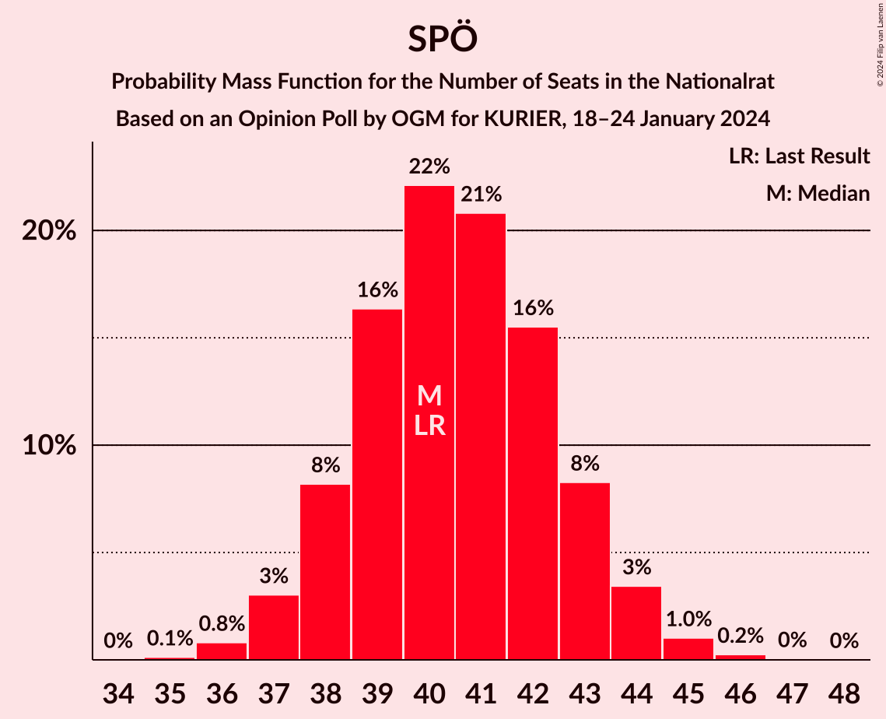

| Number of Seats | Probability | Accumulated | Special Marks |
|:---------------:|:-----------:|:-----------:|:-------------:|
| 35 | 0.1% | 100% |  |
| 36 | 0.8% | 99.9% |  |
| 37 | 3% | 99.0% |  |
| 38 | 8% | 96% |  |
| 39 | 16% | 88% |  |
| 40 | 22% | 71% | Last Result, Median |
| 41 | 21% | 49% |  |
| 42 | 16% | 29% |  |
| 43 | 8% | 13% |  |
| 44 | 3% | 5% |  |
| 45 | 1.0% | 1.3% |  |
| 46 | 0.2% | 0.3% |  |
| 47 | 0% | 0.1% |  |
| 48 | 0% | 0% |  |

### Österreichische Volkspartei

| Number of Seats | Probability | Accumulated | Special Marks |
|:---------------:|:-----------:|:-----------:|:-------------:|
| 35 | 0.1% | 100% |  |
| 36 | 0.7% | 99.9% |  |
| 37 | 3% | 99.1% |  |
| 38 | 8% | 96% |  |
| 39 | 17% | 88% |  |
| 40 | 23% | 71% | Median |
| 41 | 18% | 48% |  |
| 42 | 17% | 30% |  |
| 43 | 8% | 13% |  |
| 44 | 4% | 5% |  |
| 45 | 0.8% | 1.1% |  |
| 46 | 0.2% | 0.3% |  |
| 47 | 0.1% | 0.1% |  |
| 48 | 0% | 0% |  |
| 49 | 0% | 0% |  |
| 50 | 0% | 0% |  |
| 51 | 0% | 0% |  |
| 52 | 0% | 0% |  |
| 53 | 0% | 0% |  |
| 54 | 0% | 0% |  |
| 55 | 0% | 0% |  |
| 56 | 0% | 0% |  |
| 57 | 0% | 0% |  |
| 58 | 0% | 0% |  |
| 59 | 0% | 0% |  |
| 60 | 0% | 0% |  |
| 61 | 0% | 0% |  |
| 62 | 0% | 0% |  |
| 63 | 0% | 0% |  |
| 64 | 0% | 0% |  |
| 65 | 0% | 0% |  |
| 66 | 0% | 0% |  |
| 67 | 0% | 0% |  |
| 68 | 0% | 0% |  |
| 69 | 0% | 0% |  |
| 70 | 0% | 0% |  |
| 71 | 0% | 0% | Last Result |

## Technical Information

### Opinion Poll

+ **Polling firm:** OGM
+ **Commissioner(s):** KURIER
+ **Fieldwork period:** 18–24 January 2024

### Calculations

+ **Sample size:** 2017
+ **Simulations done:** 1,048,576
+ **Error estimate:** 0.29%

