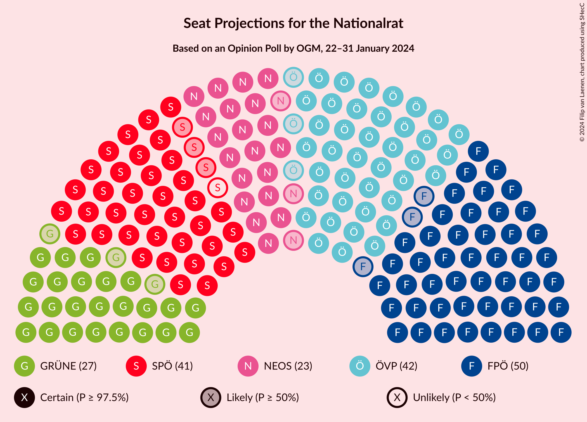

# Opinion Poll by OGM, 22–31 January 2024

<a href="#voting-intentions">Voting Intentions</a> | <a href="#seats">Seats</a> | <a href="#coalitions">Coalitions</a> | <a href="#technical-information">Technical Information</a>

## Voting Intentions

### Confidence Intervals

| Party | Last Result | Poll Result | 80% Confidence Interval | 90% Confidence Interval | 95% Confidence Interval | 99% Confidence Interval |
|:-----:|:-----------:|:-----------:|:-----------------------:|:-----------------------:|:-----------------------:|:-----------------------:|
| Freiheitliche Partei Österreichs | 16.2% | 26.0% | 24.8–27.3% |24.5–27.6% |24.2–28.0% |23.6–28.6% |
| Österreichische Volkspartei | 37.5% | 22.0% | 20.9–23.2% |20.5–23.6% |20.3–23.9% |19.7–24.4% |
| Sozialdemokratische Partei Österreichs | 21.2% | 21.0% | 19.9–22.2% |19.6–22.5% |19.3–22.8% |18.8–23.4% |
| Die Grünen–Die Grüne Alternative | 13.9% | 14.0% | 13.1–15.0% |12.8–15.3% |12.6–15.6% |12.1–16.1% |
| NEOS–Das Neue Österreich und Liberales Forum | 8.1% | 12.0% | 11.1–13.0% |10.9–13.2% |10.7–13.5% |10.3–13.9% |
| Kommunistische Partei Österreichs | N/A | 2.0% | 1.7–2.5% |1.6–2.6% |1.5–2.7% |1.3–3.0% |

*Note:* The poll result column reflects the actual value used in the calculations. Published results may vary slightly, and in addition be rounded to fewer digits.

## Seats

### Confidence Intervals

| Party | Last Result | Median | 80% Confidence Interval | 90% Confidence Interval | 95% Confidence Interval | 99% Confidence Interval |
|:-----:|:-----------:|:------:|:-----------------------:|:-----------------------:|:-----------------------:|:-----------------------:|
| <a href="#freiheitliche-partei-österreichs">Freiheitliche Partei Österreichs</a> | 31 | 50 | 48–53 |47–53 |47–54 |45–55 |
| <a href="#österreichische-volkspartei">Österreichische Volkspartei</a> | 71 | 42 | 40–45 |40–45 |39–46 |38–47 |
| <a href="#sozialdemokratische-partei-österreichs">Sozialdemokratische Partei Österreichs</a> | 40 | 40 | 38–43 |38–43 |37–44 |36–45 |
| <a href="#die-grünen–die-grüne-alternative">Die Grünen–Die Grüne Alternative</a> | 26 | 27 | 25–29 |24–29 |24–30 |23–31 |
| <a href="#neos–das-neue-österreich-und-liberales-forum">NEOS–Das Neue Österreich und Liberales Forum</a> | 15 | 23 | 21–25 |21–25 |20–26 |20–27 |
| <a href="#kommunistische-partei-österreichs">Kommunistische Partei Österreichs</a> | N/A | 0 | 0 |0 |0 |0 |

