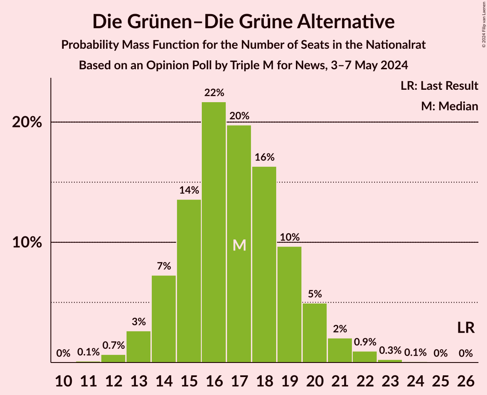
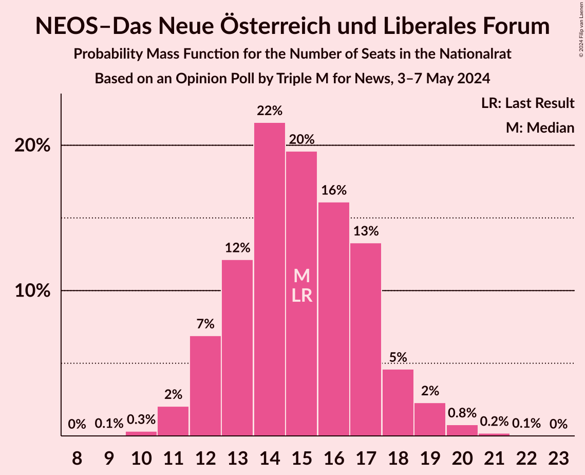
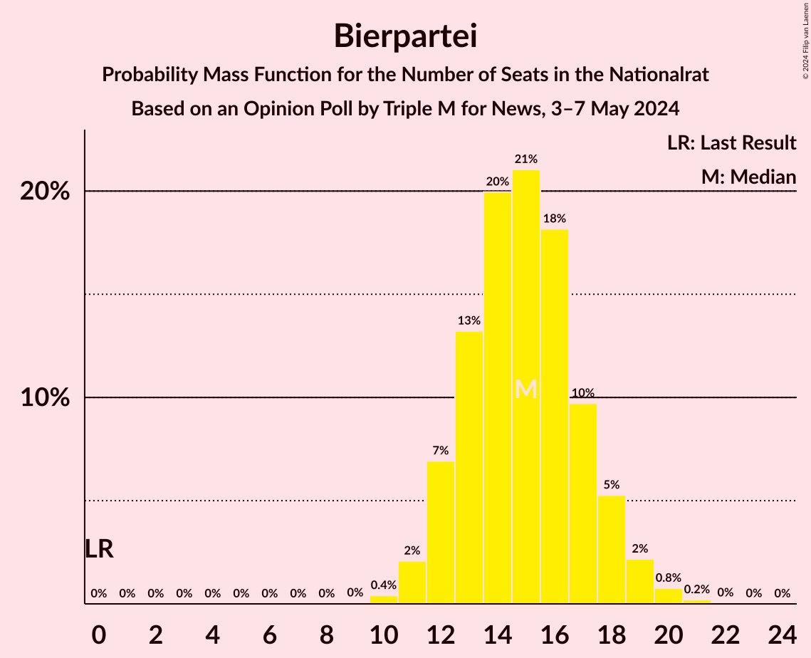
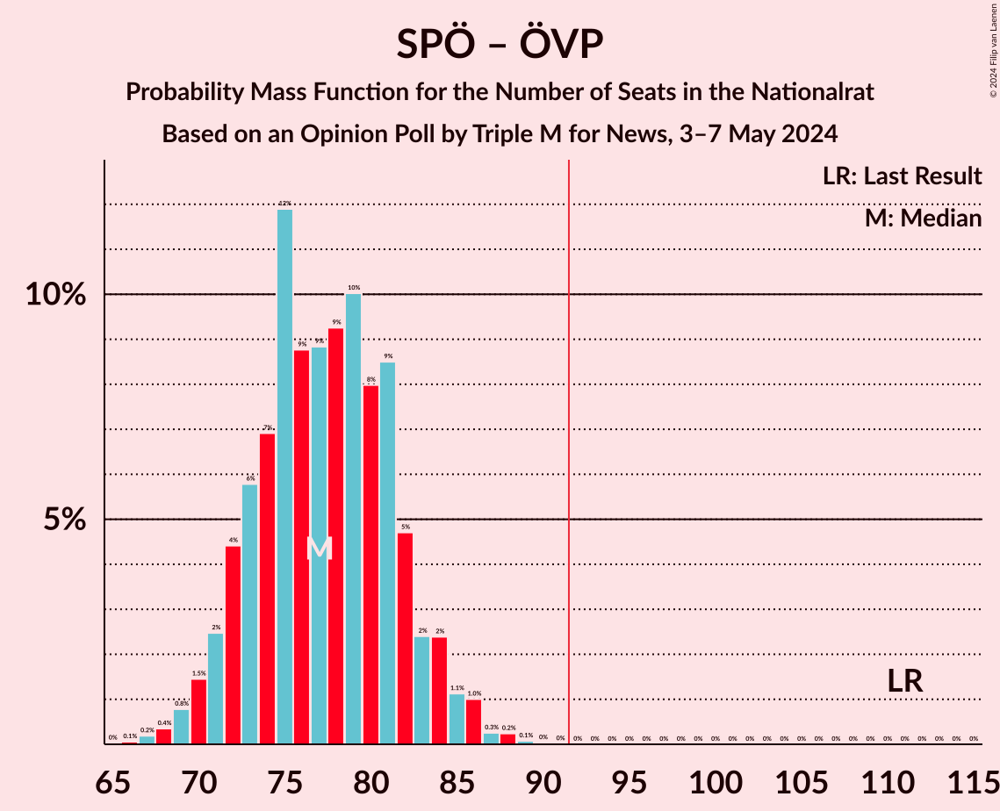

# Opinion Poll by Triple M for News, 3–7 May 2024

<a href="#voting-intentions">Voting Intentions</a> | <a href="#seats">Seats</a> | <a href="#coalitions">Coalitions</a> | <a href="#technical-information">Technical Information</a>

## Voting Intentions

### Confidence Intervals

| Party | Last Result | Poll Result | 80% Confidence Interval | 90% Confidence Interval | 95% Confidence Interval | 99% Confidence Interval |
|:-----:|:-----------:|:-----------:|:-----------------------:|:-----------------------:|:-----------------------:|:-----------------------:|
| Freiheitliche Partei Österreichs | 16.2% | 29.0% | 27.0–31.1% |26.4–31.7% |26.0–32.3% |25.0–33.3% |
| Sozialdemokratische Partei Österreichs | 21.2% | 22.0% | 20.2–24.0% |19.7–24.5% |19.3–25.0% |18.4–26.0% |
| Österreichische Volkspartei | 37.5% | 19.0% | 17.3–20.9% |16.8–21.4% |16.4–21.9% |15.7–22.8% |
| Die Grünen–Die Grüne Alternative | 13.9% | 9.0% | 7.8–10.4% |7.5–10.8% |7.2–11.2% |6.7–11.9% |
| NEOS–Das Neue Österreich und Liberales Forum | 8.1% | 8.0% | 6.9–9.4% |6.6–9.8% |6.3–10.1% |5.8–10.8% |
| Bierpartei | 0.0% | 8.0% | 6.9–9.4% |6.6–9.8% |6.3–10.1% |5.8–10.8% |
| Kommunistische Partei Österreichs | 0.7% | 4.0% | 3.2–5.0% |3.0–5.3% |2.9–5.6% |2.5–6.1% |

*Note:* The poll result column reflects the actual value used in the calculations. Published results may vary slightly, and in addition be rounded to fewer digits.

## Seats

### Confidence Intervals

| Party | Last Result | Median | 80% Confidence Interval | 90% Confidence Interval | 95% Confidence Interval | 99% Confidence Interval |
|:-----:|:-----------:|:------:|:-----------------------:|:-----------------------:|:-----------------------:|:-----------------------:|
| <a href="#freiheitliche-partei-österreichs">Freiheitliche Partei Österreichs</a> | 31 | 55 | 51–59 |49–60 |49–61 |47–63 |
| <a href="#sozialdemokratische-partei-österreichs">Sozialdemokratische Partei Österreichs</a> | 40 | 41 | 38–45 |37–46 |36–47 |34–49 |
| <a href="#österreichische-volkspartei">Österreichische Volkspartei</a> | 71 | 36 | 32–39 |31–40 |31–41 |29–43 |
| <a href="#die-grünen–die-grüne-alternative">Die Grünen–Die Grüne Alternative</a> | 26 | 17 | 14–19 |14–20 |13–21 |12–22 |
| <a href="#neos–das-neue-österreich-und-liberales-forum">NEOS–Das Neue Österreich und Liberales Forum</a> | 15 | 15 | 13–17 |12–18 |12–19 |11–20 |
| <a href="#bierpartei">Bierpartei</a> | 0 | 15 | 13–17 |12–18 |11–19 |11–20 |
| <a href="#kommunistische-partei-österreichs">Kommunistische Partei Österreichs</a> | 0 | 7 | 0–9 |0–9 |0–10 |0–11 |

### Freiheitliche Partei Österreichs

*For a full overview of the results for this party, see the [Freiheitliche Partei Österreichs](party-freiheitlicheparteiösterreichs.html) page.*

| Number of Seats | Probability | Accumulated | Special Marks |
|:---------------:|:-----------:|:-----------:|:-------------:|
| 31 | 0% | 100% | Last Result |
| 32 | 0% | 100% |  |
| 33 | 0% | 100% |  |
| 34 | 0% | 100% |  |
| 35 | 0% | 100% |  |
| 36 | 0% | 100% |  |
| 37 | 0% | 100% |  |
| 38 | 0% | 100% |  |
| 39 | 0% | 100% |  |
| 40 | 0% | 100% |  |
| 41 | 0% | 100% |  |
| 42 | 0% | 100% |  |
| 43 | 0% | 100% |  |
| 44 | 0% | 100% |  |
| 45 | 0.1% | 100% |  |
| 46 | 0.3% | 99.8% |  |
| 47 | 0.7% | 99.6% |  |
| 48 | 1.2% | 98.9% |  |
| 49 | 3% | 98% |  |
| 50 | 5% | 95% |  |
| 51 | 6% | 90% |  |
| 52 | 9% | 84% |  |
| 53 | 12% | 76% |  |
| 54 | 12% | 63% |  |
| 55 | 10% | 51% | Median |
| 56 | 12% | 41% |  |
| 57 | 9% | 29% |  |
| 58 | 7% | 20% |  |
| 59 | 5% | 13% |  |
| 60 | 4% | 8% |  |
| 61 | 2% | 4% |  |
| 62 | 1.4% | 2% |  |
| 63 | 0.6% | 1.1% |  |
| 64 | 0.3% | 0.5% |  |
| 65 | 0.1% | 0.2% |  |
| 66 | 0% | 0.1% |  |
| 67 | 0% | 0% |  |

### Sozialdemokratische Partei Österreichs

*For a full overview of the results for this party, see the [Sozialdemokratische Partei Österreichs](party-sozialdemokratischeparteiösterreichs.html) page.*

| Number of Seats | Probability | Accumulated | Special Marks |
|:---------------:|:-----------:|:-----------:|:-------------:|
| 33 | 0.1% | 100% |  |
| 34 | 0.4% | 99.8% |  |
| 35 | 1.0% | 99.5% |  |
| 36 | 2% | 98% |  |
| 37 | 4% | 96% |  |
| 38 | 7% | 92% |  |
| 39 | 10% | 85% |  |
| 40 | 13% | 76% | Last Result |
| 41 | 13% | 63% | Median |
| 42 | 12% | 49% |  |
| 43 | 12% | 37% |  |
| 44 | 10% | 25% |  |
| 45 | 7% | 15% |  |
| 46 | 4% | 8% |  |
| 47 | 2% | 4% |  |
| 48 | 1.4% | 2% |  |
| 49 | 0.5% | 1.0% |  |
| 50 | 0.3% | 0.4% |  |
| 51 | 0.1% | 0.2% |  |
| 52 | 0% | 0% |  |

### Österreichische Volkspartei

*For a full overview of the results for this party, see the [Österreichische Volkspartei](party-österreichischevolkspartei.html) page.*

| Number of Seats | Probability | Accumulated | Special Marks |
|:---------------:|:-----------:|:-----------:|:-------------:|
| 27 | 0% | 100% |  |
| 28 | 0.2% | 99.9% |  |
| 29 | 0.5% | 99.7% |  |
| 30 | 1.4% | 99.3% |  |
| 31 | 3% | 98% |  |
| 32 | 6% | 94% |  |
| 33 | 9% | 88% |  |
| 34 | 10% | 79% |  |
| 35 | 14% | 69% |  |
| 36 | 16% | 55% | Median |
| 37 | 13% | 39% |  |
| 38 | 9% | 26% |  |
| 39 | 8% | 17% |  |
| 40 | 4% | 9% |  |
| 41 | 3% | 4% |  |
| 42 | 1.0% | 2% |  |
| 43 | 0.3% | 0.7% |  |
| 44 | 0.3% | 0.4% |  |
| 45 | 0.1% | 0.1% |  |
| 46 | 0% | 0% |  |
| 47 | 0% | 0% |  |
| 48 | 0% | 0% |  |
| 49 | 0% | 0% |  |
| 50 | 0% | 0% |  |
| 51 | 0% | 0% |  |
| 52 | 0% | 0% |  |
| 53 | 0% | 0% |  |
| 54 | 0% | 0% |  |
| 55 | 0% | 0% |  |
| 56 | 0% | 0% |  |
| 57 | 0% | 0% |  |
| 58 | 0% | 0% |  |
| 59 | 0% | 0% |  |
| 60 | 0% | 0% |  |
| 61 | 0% | 0% |  |
| 62 | 0% | 0% |  |
| 63 | 0% | 0% |  |
| 64 | 0% | 0% |  |
| 65 | 0% | 0% |  |
| 66 | 0% | 0% |  |
| 67 | 0% | 0% |  |
| 68 | 0% | 0% |  |
| 69 | 0% | 0% |  |
| 70 | 0% | 0% |  |
| 71 | 0% | 0% | Last Result |

### Die Grünen–Die Grüne Alternative

*For a full overview of the results for this party, see the [Die Grünen–Die Grüne Alternative](party-diegrünen–diegrünealternative.html) page.*

| Number of Seats | Probability | Accumulated | Special Marks |
|:---------------:|:-----------:|:-----------:|:-------------:|
| 11 | 0.1% | 100% |  |
| 12 | 0.7% | 99.9% |  |
| 13 | 3% | 99.2% |  |
| 14 | 7% | 97% |  |
| 15 | 14% | 89% |  |
| 16 | 22% | 76% |  |
| 17 | 20% | 54% | Median |
| 18 | 16% | 34% |  |
| 19 | 10% | 18% |  |
| 20 | 5% | 8% |  |
| 21 | 2% | 3% |  |
| 22 | 0.9% | 1.3% |  |
| 23 | 0.3% | 0.4% |  |
| 24 | 0.1% | 0.1% |  |
| 25 | 0% | 0% |  |
| 26 | 0% | 0% | Last Result |

### NEOS–Das Neue Österreich und Liberales Forum

*For a full overview of the results for this party, see the [NEOS–Das Neue Österreich und Liberales Forum](party-neos–dasneueösterreichundliberalesforum.html) page.*

| Number of Seats | Probability | Accumulated | Special Marks |
|:---------------:|:-----------:|:-----------:|:-------------:|
| 9 | 0.1% | 100% |  |
| 10 | 0.3% | 99.9% |  |
| 11 | 2% | 99.6% |  |
| 12 | 7% | 98% |  |
| 13 | 12% | 91% |  |
| 14 | 22% | 79% |  |
| 15 | 20% | 57% | Last Result, Median |
| 16 | 16% | 37% |  |
| 17 | 13% | 21% |  |
| 18 | 5% | 8% |  |
| 19 | 2% | 3% |  |
| 20 | 0.8% | 1.1% |  |
| 21 | 0.2% | 0.3% |  |
| 22 | 0.1% | 0.1% |  |
| 23 | 0% | 0% |  |

### Bierpartei

*For a full overview of the results for this party, see the [Bierpartei](party-bierpartei.html) page.*

| Number of Seats | Probability | Accumulated | Special Marks |
|:---------------:|:-----------:|:-----------:|:-------------:|
| 0 | 0% | 100% | Last Result |
| 1 | 0% | 100% |  |
| 2 | 0% | 100% |  |
| 3 | 0% | 100% |  |
| 4 | 0% | 100% |  |
| 5 | 0% | 100% |  |
| 6 | 0% | 100% |  |
| 7 | 0% | 100% |  |
| 8 | 0% | 100% |  |
| 9 | 0% | 100% |  |
| 10 | 0.4% | 100% |  |
| 11 | 2% | 99.5% |  |
| 12 | 7% | 97% |  |
| 13 | 13% | 91% |  |
| 14 | 20% | 77% |  |
| 15 | 21% | 57% | Median |
| 16 | 18% | 36% |  |
| 17 | 10% | 18% |  |
| 18 | 5% | 8% |  |
| 19 | 2% | 3% |  |
| 20 | 0.8% | 1.0% |  |
| 21 | 0.2% | 0.3% |  |
| 22 | 0% | 0.1% |  |
| 23 | 0% | 0% |  |

### Kommunistische Partei Österreichs

*For a full overview of the results for this party, see the [Kommunistische Partei Österreichs](party-kommunistischeparteiösterreichs.html) page.*

| Number of Seats | Probability | Accumulated | Special Marks |
|:---------------:|:-----------:|:-----------:|:-------------:|
| 0 | 47% | 100% | Last Result |
| 1 | 0% | 53% |  |
| 2 | 0% | 53% |  |
| 3 | 0% | 53% |  |
| 4 | 0% | 53% |  |
| 5 | 0% | 53% |  |
| 6 | 0% | 53% |  |
| 7 | 16% | 53% | Median |
| 8 | 22% | 37% |  |
| 9 | 11% | 16% |  |
| 10 | 3% | 4% |  |
| 11 | 0.8% | 1.0% |  |
| 12 | 0.2% | 0.2% |  |
| 13 | 0% | 0% |  |

## Coalitions

### Confidence Intervals

| Coalition | Last Result | Median | Majority? | 80% Confidence Interval | 90% Confidence Interval | 95% Confidence Interval | 99% Confidence Interval |
|:---------:|:-----------:|:------:|:---------:|:-----------------------:|:-----------------------:|:-----------------------:|:-----------------------:|
| Freiheitliche Partei Österreichs – Sozialdemokratische Partei Österreichs | 71 | 96 | 90% | 92–101 | 90–103 | 89–104 | 87–106 |
| Freiheitliche Partei Österreichs – Österreichische Volkspartei | 102 | 91 | 42% | 85–96 | 84–97 | 83–98 | 81–101 |
| Sozialdemokratische Partei Österreichs – Österreichische Volkspartei | 111 | 77 | 0% | 73–82 | 71–84 | 70–85 | 68–87 |
| Sozialdemokratische Partei Österreichs – Die Grünen–Die Grüne Alternative – NEOS–Das Neue Österreich und Liberales Forum | 81 | 73 | 0% | 69–78 | 67–79 | 66–80 | 64–83 |
| Österreichische Volkspartei – Die Grünen–Die Grüne Alternative – NEOS–Das Neue Österreich und Liberales Forum | 112 | 68 | 0% | 63–72 | 62–73 | 61–74 | 59–77 |
| Sozialdemokratische Partei Österreichs – Die Grünen–Die Grüne Alternative | 66 | 58 | 0% | 54–63 | 53–64 | 52–65 | 50–67 |
| Österreichische Volkspartei – Die Grünen–Die Grüne Alternative | 97 | 53 | 0% | 49–56 | 47–58 | 46–59 | 45–61 |
| Österreichische Volkspartei – NEOS–Das Neue Österreich und Liberales Forum | 86 | 51 | 0% | 47–55 | 45–56 | 44–57 | 43–59 |
| Sozialdemokratische Partei Österreichs | 40 | 41 | 0% | 38–45 | 37–46 | 36–47 | 34–49 |
| Österreichische Volkspartei | 71 | 36 | 0% | 32–39 | 31–40 | 31–41 | 29–43 |

### Freiheitliche Partei Österreichs – Sozialdemokratische Partei Österreichs

| Number of Seats | Probability | Accumulated | Special Marks |
|:---------------:|:-----------:|:-----------:|:-------------:|
| 71 | 0% | 100% | Last Result |
| 72 | 0% | 100% |  |
| 73 | 0% | 100% |  |
| 74 | 0% | 100% |  |
| 75 | 0% | 100% |  |
| 76 | 0% | 100% |  |
| 77 | 0% | 100% |  |
| 78 | 0% | 100% |  |
| 79 | 0% | 100% |  |
| 80 | 0% | 100% |  |
| 81 | 0% | 100% |  |
| 82 | 0% | 100% |  |
| 83 | 0% | 100% |  |
| 84 | 0% | 100% |  |
| 85 | 0.1% | 99.9% |  |
| 86 | 0.2% | 99.8% |  |
| 87 | 0.5% | 99.6% |  |
| 88 | 1.1% | 99.1% |  |
| 89 | 2% | 98% |  |
| 90 | 2% | 96% |  |
| 91 | 4% | 94% |  |
| 92 | 6% | 90% | Majority |
| 93 | 8% | 84% |  |
| 94 | 11% | 75% |  |
| 95 | 11% | 64% |  |
| 96 | 6% | 54% | Median |
| 97 | 11% | 48% |  |
| 98 | 8% | 38% |  |
| 99 | 9% | 29% |  |
| 100 | 7% | 21% |  |
| 101 | 5% | 14% |  |
| 102 | 2% | 9% |  |
| 103 | 3% | 7% |  |
| 104 | 2% | 4% |  |
| 105 | 1.2% | 2% |  |
| 106 | 0.7% | 1.0% |  |
| 107 | 0.2% | 0.4% |  |
| 108 | 0.1% | 0.1% |  |
| 109 | 0% | 0.1% |  |
| 110 | 0% | 0% |  |

### Freiheitliche Partei Österreichs – Österreichische Volkspartei

| Number of Seats | Probability | Accumulated | Special Marks |
|:---------------:|:-----------:|:-----------:|:-------------:|
| 79 | 0.1% | 100% |  |
| 80 | 0.2% | 99.9% |  |
| 81 | 0.4% | 99.7% |  |
| 82 | 1.1% | 99.3% |  |
| 83 | 2% | 98% |  |
| 84 | 2% | 97% |  |
| 85 | 4% | 94% |  |
| 86 | 5% | 90% |  |
| 87 | 7% | 85% |  |
| 88 | 11% | 79% |  |
| 89 | 8% | 67% |  |
| 90 | 9% | 59% |  |
| 91 | 9% | 51% | Median |
| 92 | 12% | 42% | Majority |
| 93 | 9% | 30% |  |
| 94 | 6% | 21% |  |
| 95 | 4% | 16% |  |
| 96 | 5% | 12% |  |
| 97 | 3% | 6% |  |
| 98 | 1.5% | 3% |  |
| 99 | 0.9% | 2% |  |
| 100 | 0.5% | 1.1% |  |
| 101 | 0.4% | 0.6% |  |
| 102 | 0.1% | 0.2% | Last Result |
| 103 | 0.1% | 0.1% |  |
| 104 | 0% | 0% |  |

### Sozialdemokratische Partei Österreichs – Österreichische Volkspartei

| Number of Seats | Probability | Accumulated | Special Marks |
|:---------------:|:-----------:|:-----------:|:-------------:|
| 66 | 0.1% | 100% |  |
| 67 | 0.2% | 99.9% |  |
| 68 | 0.4% | 99.7% |  |
| 69 | 0.8% | 99.4% |  |
| 70 | 1.5% | 98.6% |  |
| 71 | 2% | 97% |  |
| 72 | 4% | 95% |  |
| 73 | 6% | 90% |  |
| 74 | 7% | 84% |  |
| 75 | 12% | 78% |  |
| 76 | 9% | 66% |  |
| 77 | 9% | 57% | Median |
| 78 | 9% | 48% |  |
| 79 | 10% | 39% |  |
| 80 | 8% | 29% |  |
| 81 | 9% | 21% |  |
| 82 | 5% | 12% |  |
| 83 | 2% | 8% |  |
| 84 | 2% | 5% |  |
| 85 | 1.1% | 3% |  |
| 86 | 1.0% | 2% |  |
| 87 | 0.3% | 0.6% |  |
| 88 | 0.2% | 0.4% |  |
| 89 | 0.1% | 0.1% |  |
| 90 | 0% | 0.1% |  |
| 91 | 0% | 0% |  |
| 92 | 0% | 0% | Majority |
| 93 | 0% | 0% |  |
| 94 | 0% | 0% |  |
| 95 | 0% | 0% |  |
| 96 | 0% | 0% |  |
| 97 | 0% | 0% |  |
| 98 | 0% | 0% |  |
| 99 | 0% | 0% |  |
| 100 | 0% | 0% |  |
| 101 | 0% | 0% |  |
| 102 | 0% | 0% |  |
| 103 | 0% | 0% |  |
| 104 | 0% | 0% |  |
| 105 | 0% | 0% |  |
| 106 | 0% | 0% |  |
| 107 | 0% | 0% |  |
| 108 | 0% | 0% |  |
| 109 | 0% | 0% |  |
| 110 | 0% | 0% |  |
| 111 | 0% | 0% | Last Result |

### Sozialdemokratische Partei Österreichs – Die Grünen–Die Grüne Alternative – NEOS–Das Neue Österreich und Liberales Forum

| Number of Seats | Probability | Accumulated | Special Marks |
|:---------------:|:-----------:|:-----------:|:-------------:|
| 62 | 0.1% | 100% |  |
| 63 | 0.1% | 99.9% |  |
| 64 | 0.5% | 99.8% |  |
| 65 | 0.8% | 99.3% |  |
| 66 | 2% | 98% |  |
| 67 | 3% | 97% |  |
| 68 | 3% | 93% |  |
| 69 | 5% | 90% |  |
| 70 | 6% | 85% |  |
| 71 | 9% | 79% |  |
| 72 | 12% | 69% |  |
| 73 | 11% | 57% | Median |
| 74 | 10% | 46% |  |
| 75 | 8% | 36% |  |
| 76 | 8% | 28% |  |
| 77 | 9% | 20% |  |
| 78 | 4% | 12% |  |
| 79 | 4% | 8% |  |
| 80 | 2% | 4% |  |
| 81 | 0.9% | 2% | Last Result |
| 82 | 0.8% | 1.4% |  |
| 83 | 0.3% | 0.5% |  |
| 84 | 0.1% | 0.2% |  |
| 85 | 0.1% | 0.1% |  |
| 86 | 0% | 0% |  |

### Österreichische Volkspartei – Die Grünen–Die Grüne Alternative – NEOS–Das Neue Österreich und Liberales Forum

| Number of Seats | Probability | Accumulated | Special Marks |
|:---------------:|:-----------:|:-----------:|:-------------:|
| 57 | 0.1% | 100% |  |
| 58 | 0.2% | 99.9% |  |
| 59 | 0.5% | 99.7% |  |
| 60 | 1.2% | 99.2% |  |
| 61 | 2% | 98% |  |
| 62 | 3% | 96% |  |
| 63 | 5% | 92% |  |
| 64 | 7% | 88% |  |
| 65 | 9% | 80% |  |
| 66 | 9% | 71% |  |
| 67 | 11% | 62% |  |
| 68 | 13% | 50% | Median |
| 69 | 8% | 37% |  |
| 70 | 10% | 30% |  |
| 71 | 7% | 20% |  |
| 72 | 5% | 13% |  |
| 73 | 3% | 8% |  |
| 74 | 2% | 5% |  |
| 75 | 1.2% | 2% |  |
| 76 | 0.6% | 1.2% |  |
| 77 | 0.3% | 0.5% |  |
| 78 | 0.1% | 0.2% |  |
| 79 | 0.1% | 0.1% |  |
| 80 | 0% | 0% |  |
| 81 | 0% | 0% |  |
| 82 | 0% | 0% |  |
| 83 | 0% | 0% |  |
| 84 | 0% | 0% |  |
| 85 | 0% | 0% |  |
| 86 | 0% | 0% |  |
| 87 | 0% | 0% |  |
| 88 | 0% | 0% |  |
| 89 | 0% | 0% |  |
| 90 | 0% | 0% |  |
| 91 | 0% | 0% |  |
| 92 | 0% | 0% | Majority |
| 93 | 0% | 0% |  |
| 94 | 0% | 0% |  |
| 95 | 0% | 0% |  |
| 96 | 0% | 0% |  |
| 97 | 0% | 0% |  |
| 98 | 0% | 0% |  |
| 99 | 0% | 0% |  |
| 100 | 0% | 0% |  |
| 101 | 0% | 0% |  |
| 102 | 0% | 0% |  |
| 103 | 0% | 0% |  |
| 104 | 0% | 0% |  |
| 105 | 0% | 0% |  |
| 106 | 0% | 0% |  |
| 107 | 0% | 0% |  |
| 108 | 0% | 0% |  |
| 109 | 0% | 0% |  |
| 110 | 0% | 0% |  |
| 111 | 0% | 0% |  |
| 112 | 0% | 0% | Last Result |

### Sozialdemokratische Partei Österreichs – Die Grünen–Die Grüne Alternative

| Number of Seats | Probability | Accumulated | Special Marks |
|:---------------:|:-----------:|:-----------:|:-------------:|
| 48 | 0.1% | 100% |  |
| 49 | 0.2% | 99.9% |  |
| 50 | 0.5% | 99.7% |  |
| 51 | 1.0% | 99.2% |  |
| 52 | 2% | 98% |  |
| 53 | 4% | 96% |  |
| 54 | 4% | 92% |  |
| 55 | 7% | 88% |  |
| 56 | 10% | 81% |  |
| 57 | 12% | 71% |  |
| 58 | 14% | 59% | Median |
| 59 | 9% | 46% |  |
| 60 | 10% | 36% |  |
| 61 | 10% | 27% |  |
| 62 | 7% | 17% |  |
| 63 | 4% | 10% |  |
| 64 | 3% | 6% |  |
| 65 | 2% | 3% |  |
| 66 | 0.8% | 2% | Last Result |
| 67 | 0.4% | 0.8% |  |
| 68 | 0.2% | 0.4% |  |
| 69 | 0.1% | 0.1% |  |
| 70 | 0% | 0% |  |

### Österreichische Volkspartei – Die Grünen–Die Grüne Alternative

| Number of Seats | Probability | Accumulated | Special Marks |
|:---------------:|:-----------:|:-----------:|:-------------:|
| 43 | 0.1% | 100% |  |
| 44 | 0.2% | 99.8% |  |
| 45 | 0.6% | 99.7% |  |
| 46 | 2% | 99.0% |  |
| 47 | 3% | 97% |  |
| 48 | 4% | 95% |  |
| 49 | 7% | 91% |  |
| 50 | 8% | 84% |  |
| 51 | 13% | 76% |  |
| 52 | 12% | 63% |  |
| 53 | 13% | 50% | Median |
| 54 | 11% | 38% |  |
| 55 | 7% | 26% |  |
| 56 | 9% | 19% |  |
| 57 | 3% | 10% |  |
| 58 | 4% | 7% |  |
| 59 | 1.2% | 3% |  |
| 60 | 0.5% | 1.5% |  |
| 61 | 0.6% | 1.0% |  |
| 62 | 0.2% | 0.3% |  |
| 63 | 0.1% | 0.1% |  |
| 64 | 0.1% | 0.1% |  |
| 65 | 0% | 0% |  |
| 66 | 0% | 0% |  |
| 67 | 0% | 0% |  |
| 68 | 0% | 0% |  |
| 69 | 0% | 0% |  |
| 70 | 0% | 0% |  |
| 71 | 0% | 0% |  |
| 72 | 0% | 0% |  |
| 73 | 0% | 0% |  |
| 74 | 0% | 0% |  |
| 75 | 0% | 0% |  |
| 76 | 0% | 0% |  |
| 77 | 0% | 0% |  |
| 78 | 0% | 0% |  |
| 79 | 0% | 0% |  |
| 80 | 0% | 0% |  |
| 81 | 0% | 0% |  |
| 82 | 0% | 0% |  |
| 83 | 0% | 0% |  |
| 84 | 0% | 0% |  |
| 85 | 0% | 0% |  |
| 86 | 0% | 0% |  |
| 87 | 0% | 0% |  |
| 88 | 0% | 0% |  |
| 89 | 0% | 0% |  |
| 90 | 0% | 0% |  |
| 91 | 0% | 0% |  |
| 92 | 0% | 0% | Majority |
| 93 | 0% | 0% |  |
| 94 | 0% | 0% |  |
| 95 | 0% | 0% |  |
| 96 | 0% | 0% |  |
| 97 | 0% | 0% | Last Result |

### Österreichische Volkspartei – NEOS–Das Neue Österreich und Liberales Forum

| Number of Seats | Probability | Accumulated | Special Marks |
|:---------------:|:-----------:|:-----------:|:-------------:|
| 41 | 0.1% | 100% |  |
| 42 | 0.2% | 99.9% |  |
| 43 | 0.7% | 99.7% |  |
| 44 | 2% | 99.0% |  |
| 45 | 2% | 97% |  |
| 46 | 4% | 95% |  |
| 47 | 6% | 91% |  |
| 48 | 9% | 84% |  |
| 49 | 10% | 76% |  |
| 50 | 13% | 65% |  |
| 51 | 12% | 52% | Median |
| 52 | 11% | 40% |  |
| 53 | 10% | 29% |  |
| 54 | 8% | 19% |  |
| 55 | 5% | 12% |  |
| 56 | 3% | 7% |  |
| 57 | 2% | 4% |  |
| 58 | 0.9% | 2% |  |
| 59 | 0.6% | 0.9% |  |
| 60 | 0.3% | 0.4% |  |
| 61 | 0.1% | 0.1% |  |
| 62 | 0% | 0% |  |
| 63 | 0% | 0% |  |
| 64 | 0% | 0% |  |
| 65 | 0% | 0% |  |
| 66 | 0% | 0% |  |
| 67 | 0% | 0% |  |
| 68 | 0% | 0% |  |
| 69 | 0% | 0% |  |
| 70 | 0% | 0% |  |
| 71 | 0% | 0% |  |
| 72 | 0% | 0% |  |
| 73 | 0% | 0% |  |
| 74 | 0% | 0% |  |
| 75 | 0% | 0% |  |
| 76 | 0% | 0% |  |
| 77 | 0% | 0% |  |
| 78 | 0% | 0% |  |
| 79 | 0% | 0% |  |
| 80 | 0% | 0% |  |
| 81 | 0% | 0% |  |
| 82 | 0% | 0% |  |
| 83 | 0% | 0% |  |
| 84 | 0% | 0% |  |
| 85 | 0% | 0% |  |
| 86 | 0% | 0% | Last Result |

### Sozialdemokratische Partei Österreichs

| Number of Seats | Probability | Accumulated | Special Marks |
|:---------------:|:-----------:|:-----------:|:-------------:|
| 33 | 0.1% | 100% |  |
| 34 | 0.4% | 99.8% |  |
| 35 | 1.0% | 99.5% |  |
| 36 | 2% | 98% |  |
| 37 | 4% | 96% |  |
| 38 | 7% | 92% |  |
| 39 | 10% | 85% |  |
| 40 | 13% | 76% | Last Result |
| 41 | 13% | 63% | Median |
| 42 | 12% | 49% |  |
| 43 | 12% | 37% |  |
| 44 | 10% | 25% |  |
| 45 | 7% | 15% |  |
| 46 | 4% | 8% |  |
| 47 | 2% | 4% |  |
| 48 | 1.4% | 2% |  |
| 49 | 0.5% | 1.0% |  |
| 50 | 0.3% | 0.4% |  |
| 51 | 0.1% | 0.2% |  |
| 52 | 0% | 0% |  |

### Österreichische Volkspartei

| Number of Seats | Probability | Accumulated | Special Marks |
|:---------------:|:-----------:|:-----------:|:-------------:|
| 27 | 0% | 100% |  |
| 28 | 0.2% | 99.9% |  |
| 29 | 0.5% | 99.7% |  |
| 30 | 1.4% | 99.3% |  |
| 31 | 3% | 98% |  |
| 32 | 6% | 94% |  |
| 33 | 9% | 88% |  |
| 34 | 10% | 79% |  |
| 35 | 14% | 69% |  |
| 36 | 16% | 55% | Median |
| 37 | 13% | 39% |  |
| 38 | 9% | 26% |  |
| 39 | 8% | 17% |  |
| 40 | 4% | 9% |  |
| 41 | 3% | 4% |  |
| 42 | 1.0% | 2% |  |
| 43 | 0.3% | 0.7% |  |
| 44 | 0.3% | 0.4% |  |
| 45 | 0.1% | 0.1% |  |
| 46 | 0% | 0% |  |
| 47 | 0% | 0% |  |
| 48 | 0% | 0% |  |
| 49 | 0% | 0% |  |
| 50 | 0% | 0% |  |
| 51 | 0% | 0% |  |
| 52 | 0% | 0% |  |
| 53 | 0% | 0% |  |
| 54 | 0% | 0% |  |
| 55 | 0% | 0% |  |
| 56 | 0% | 0% |  |
| 57 | 0% | 0% |  |
| 58 | 0% | 0% |  |
| 59 | 0% | 0% |  |
| 60 | 0% | 0% |  |
| 61 | 0% | 0% |  |
| 62 | 0% | 0% |  |
| 63 | 0% | 0% |  |
| 64 | 0% | 0% |  |
| 65 | 0% | 0% |  |
| 66 | 0% | 0% |  |
| 67 | 0% | 0% |  |
| 68 | 0% | 0% |  |
| 69 | 0% | 0% |  |
| 70 | 0% | 0% |  |
| 71 | 0% | 0% | Last Result |

## Technical Information

### Opinion Poll

+ **Polling firm:** Triple M
+ **Commissioner(s):** News
+ **Fieldwork period:** 3–7 May 2024

### Calculations

+ **Sample size:** 800
+ **Simulations done:** 1,048,576
+ **Error estimate:** 1.55%

