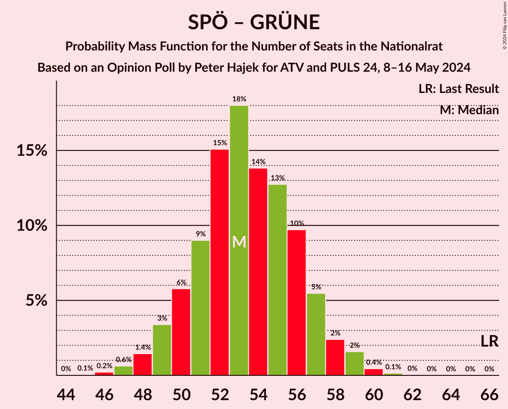

# Opinion Poll by Peter Hajek for ATV and PULS 24, 8–16 May 2024

<a href="#voting-intentions">Voting Intentions</a> | <a href="#seats">Seats</a> | <a href="#coalitions">Coalitions</a> | <a href="#technical-information">Technical Information</a>

## Voting Intentions

### Confidence Intervals

| Party | Last Result | Poll Result | 80% Confidence Interval | 90% Confidence Interval | 95% Confidence Interval | 99% Confidence Interval |
|:-----:|:-----------:|:-----------:|:-----------------------:|:-----------------------:|:-----------------------:|:-----------------------:|
| Freiheitliche Partei Österreichs | 16.2% | 31.0% | 29.3–32.8% |28.9–33.3% |28.4–33.7% |27.6–34.5% |
| Österreichische Volkspartei | 37.5% | 21.0% | 19.5–22.6% |19.1–23.0% |18.8–23.4% |18.1–24.2% |
| Sozialdemokratische Partei Österreichs | 21.2% | 20.0% | 18.6–21.6% |18.2–22.0% |17.8–22.4% |17.2–23.1% |
| Die Grünen–Die Grüne Alternative | 13.9% | 8.0% | 7.1–9.1% |6.8–9.4% |6.6–9.7% |6.2–10.2% |
| NEOS–Das Neue Österreich und Liberales Forum | 8.1% | 8.0% | 7.1–9.1% |6.8–9.4% |6.6–9.7% |6.2–10.2% |
| Bierpartei | 0.0% | 8.0% | 7.1–9.1% |6.8–9.4% |6.6–9.7% |6.2–10.2% |
| Kommunistische Partei Österreichs | 0.7% | 3.0% | 2.5–3.7% |2.3–3.9% |2.2–4.1% |1.9–4.5% |

*Note:* The poll result column reflects the actual value used in the calculations. Published results may vary slightly, and in addition be rounded to fewer digits.

## Seats

### Confidence Intervals

| Party | Last Result | Median | 80% Confidence Interval | 90% Confidence Interval | 95% Confidence Interval | 99% Confidence Interval |
|:-----:|:-----------:|:------:|:-----------------------:|:-----------------------:|:-----------------------:|:-----------------------:|
| <a href="#freiheitliche-partei-österreichs">Freiheitliche Partei Österreichs</a> | 31 | 59 | 56–63 |55–64 |54–64 |53–66 |
| <a href="#österreichische-volkspartei">Österreichische Volkspartei</a> | 71 | 40 | 37–43 |36–44 |36–45 |34–46 |
| <a href="#sozialdemokratische-partei-österreichs">Sozialdemokratische Partei Österreichs</a> | 40 | 38 | 35–41 |34–42 |34–43 |33–44 |
| <a href="#die-grünen–die-grüne-alternative">Die Grünen–Die Grüne Alternative</a> | 26 | 16 | 14–16 |12–17 |12–18 |12–19 |
| <a href="#neos–das-neue-österreich-und-liberales-forum">NEOS–Das Neue Österreich und Liberales Forum</a> | 15 | 15 | 13–17 |13–17 |12–18 |11–19 |
| <a href="#bierpartei">Bierpartei</a> | 0 | 15 | 13–17 |13–18 |12–18 |11–19 |
| <a href="#kommunistische-partei-österreichs">Kommunistische Partei Österreichs</a> | 0 | 0 | 0 |0 |0–7 |0–8 |

### Freiheitliche Partei Österreichs

*For a full overview of the results for this party, see the [Freiheitliche Partei Österreichs](party-freiheitlicheparteiösterreichs.html) page.*

| Number of Seats | Probability | Accumulated | Special Marks |
|:---------------:|:-----------:|:-----------:|:-------------:|
| 31 | 0% | 100% | Last Result |
| 32 | 0% | 100% |  |
| 33 | 0% | 100% |  |
| 34 | 0% | 100% |  |
| 35 | 0% | 100% |  |
| 36 | 0% | 100% |  |
| 37 | 0% | 100% |  |
| 38 | 0% | 100% |  |
| 39 | 0% | 100% |  |
| 40 | 0% | 100% |  |
| 41 | 0% | 100% |  |
| 42 | 0% | 100% |  |
| 43 | 0% | 100% |  |
| 44 | 0% | 100% |  |
| 45 | 0% | 100% |  |
| 46 | 0% | 100% |  |
| 47 | 0% | 100% |  |
| 48 | 0% | 100% |  |
| 49 | 0% | 100% |  |
| 50 | 0% | 100% |  |
| 51 | 0.1% | 100% |  |
| 52 | 0.3% | 99.9% |  |
| 53 | 0.8% | 99.6% |  |
| 54 | 2% | 98.8% |  |
| 55 | 4% | 96% |  |
| 56 | 7% | 93% |  |
| 57 | 10% | 86% |  |
| 58 | 12% | 76% |  |
| 59 | 15% | 64% | Median |
| 60 | 16% | 49% |  |
| 61 | 13% | 33% |  |
| 62 | 9% | 20% |  |
| 63 | 6% | 11% |  |
| 64 | 3% | 5% |  |
| 65 | 1.5% | 2% |  |
| 66 | 0.6% | 0.9% |  |
| 67 | 0.2% | 0.3% |  |
| 68 | 0.1% | 0.1% |  |
| 69 | 0% | 0% |  |

### Österreichische Volkspartei

*For a full overview of the results for this party, see the [Österreichische Volkspartei](party-österreichischevolkspartei.html) page.*

| Number of Seats | Probability | Accumulated | Special Marks |
|:---------------:|:-----------:|:-----------:|:-------------:|
| 33 | 0.1% | 100% |  |
| 34 | 0.7% | 99.9% |  |
| 35 | 0.9% | 99.2% |  |
| 36 | 5% | 98% |  |
| 37 | 6% | 94% |  |
| 38 | 13% | 87% |  |
| 39 | 13% | 75% |  |
| 40 | 17% | 61% | Median |
| 41 | 19% | 44% |  |
| 42 | 10% | 25% |  |
| 43 | 8% | 15% |  |
| 44 | 4% | 7% |  |
| 45 | 2% | 3% |  |
| 46 | 0.5% | 0.8% |  |
| 47 | 0.3% | 0.3% |  |
| 48 | 0% | 0.1% |  |
| 49 | 0% | 0% |  |
| 50 | 0% | 0% |  |
| 51 | 0% | 0% |  |
| 52 | 0% | 0% |  |
| 53 | 0% | 0% |  |
| 54 | 0% | 0% |  |
| 55 | 0% | 0% |  |
| 56 | 0% | 0% |  |
| 57 | 0% | 0% |  |
| 58 | 0% | 0% |  |
| 59 | 0% | 0% |  |
| 60 | 0% | 0% |  |
| 61 | 0% | 0% |  |
| 62 | 0% | 0% |  |
| 63 | 0% | 0% |  |
| 64 | 0% | 0% |  |
| 65 | 0% | 0% |  |
| 66 | 0% | 0% |  |
| 67 | 0% | 0% |  |
| 68 | 0% | 0% |  |
| 69 | 0% | 0% |  |
| 70 | 0% | 0% |  |
| 71 | 0% | 0% | Last Result |

### Sozialdemokratische Partei Österreichs

*For a full overview of the results for this party, see the [Sozialdemokratische Partei Österreichs](party-sozialdemokratischeparteiösterreichs.html) page.*

| Number of Seats | Probability | Accumulated | Special Marks |
|:---------------:|:-----------:|:-----------:|:-------------:|
| 31 | 0.1% | 100% |  |
| 32 | 0.4% | 99.9% |  |
| 33 | 1.5% | 99.5% |  |
| 34 | 3% | 98% |  |
| 35 | 6% | 95% |  |
| 36 | 14% | 89% |  |
| 37 | 18% | 75% |  |
| 38 | 16% | 57% | Median |
| 39 | 16% | 41% |  |
| 40 | 12% | 26% | Last Result |
| 41 | 7% | 13% |  |
| 42 | 3% | 6% |  |
| 43 | 2% | 3% |  |
| 44 | 0.6% | 0.8% |  |
| 45 | 0.2% | 0.3% |  |
| 46 | 0% | 0.1% |  |
| 47 | 0% | 0% |  |

### Die Grünen–Die Grüne Alternative

*For a full overview of the results for this party, see the [Die Grünen–Die Grüne Alternative](party-diegrünen–diegrünealternative.html) page.*

| Number of Seats | Probability | Accumulated | Special Marks |
|:---------------:|:-----------:|:-----------:|:-------------:|
| 10 | 0.1% | 100% |  |
| 11 | 0.2% | 99.9% |  |
| 12 | 5% | 99.6% |  |
| 13 | 2% | 94% |  |
| 14 | 19% | 92% |  |
| 15 | 7% | 73% |  |
| 16 | 61% | 66% | Median |
| 17 | 1.2% | 5% |  |
| 18 | 3% | 4% |  |
| 19 | 0.6% | 1.1% |  |
| 20 | 0.4% | 0.5% |  |
| 21 | 0% | 0% |  |
| 22 | 0% | 0% |  |
| 23 | 0% | 0% |  |
| 24 | 0% | 0% |  |
| 25 | 0% | 0% |  |
| 26 | 0% | 0% | Last Result |

### NEOS–Das Neue Österreich und Liberales Forum

*For a full overview of the results for this party, see the [NEOS–Das Neue Österreich und Liberales Forum](party-neos–dasneueösterreichundliberalesforum.html) page.*

| Number of Seats | Probability | Accumulated | Special Marks |
|:---------------:|:-----------:|:-----------:|:-------------:|
| 11 | 0.5% | 100% |  |
| 12 | 3% | 99.5% |  |
| 13 | 12% | 96% |  |
| 14 | 24% | 84% |  |
| 15 | 32% | 60% | Last Result, Median |
| 16 | 17% | 28% |  |
| 17 | 7% | 12% |  |
| 18 | 3% | 4% |  |
| 19 | 1.0% | 1.5% |  |
| 20 | 0.4% | 0.4% |  |
| 21 | 0% | 0.1% |  |
| 22 | 0% | 0% |  |

### Bierpartei

*For a full overview of the results for this party, see the [Bierpartei](party-bierpartei.html) page.*

| Number of Seats | Probability | Accumulated | Special Marks |
|:---------------:|:-----------:|:-----------:|:-------------:|
| 0 | 0% | 100% | Last Result |
| 1 | 0% | 100% |  |
| 2 | 0% | 100% |  |
| 3 | 0% | 100% |  |
| 4 | 0% | 100% |  |
| 5 | 0% | 100% |  |
| 6 | 0% | 100% |  |
| 7 | 0% | 100% |  |
| 8 | 0% | 100% |  |
| 9 | 0% | 100% |  |
| 10 | 0% | 100% |  |
| 11 | 0.5% | 100% |  |
| 12 | 2% | 99.5% |  |
| 13 | 10% | 97% |  |
| 14 | 25% | 87% |  |
| 15 | 28% | 62% | Median |
| 16 | 16% | 33% |  |
| 17 | 11% | 18% |  |
| 18 | 5% | 7% |  |
| 19 | 2% | 2% |  |
| 20 | 0.2% | 0.3% |  |
| 21 | 0% | 0% |  |

### Kommunistische Partei Österreichs

*For a full overview of the results for this party, see the [Kommunistische Partei Österreichs](party-kommunistischeparteiösterreichs.html) page.*

| Number of Seats | Probability | Accumulated | Special Marks |
|:---------------:|:-----------:|:-----------:|:-------------:|
| 0 | 96% | 100% | Last Result, Median |
| 1 | 0% | 4% |  |
| 2 | 0% | 4% |  |
| 3 | 0% | 4% |  |
| 4 | 0% | 4% |  |
| 5 | 0% | 4% |  |
| 6 | 0% | 4% |  |
| 7 | 2% | 4% |  |
| 8 | 1.3% | 1.4% |  |
| 9 | 0.1% | 0.1% |  |
| 10 | 0% | 0% |  |

## Coalitions

### Confidence Intervals

| Coalition | Last Result | Median | Majority? | 80% Confidence Interval | 90% Confidence Interval | 95% Confidence Interval | 99% Confidence Interval |
|:---------:|:-----------:|:------:|:---------:|:-----------------------:|:-----------------------:|:-----------------------:|:-----------------------:|
| Freiheitliche Partei Österreichs – Österreichische Volkspartei | 102 | 100 | 99.6% | 96–103 | 95–104 | 94–105 | 92–107 |
| Freiheitliche Partei Österreichs – Sozialdemokratische Partei Österreichs | 71 | 97 | 98% | 94–101 | 93–102 | 92–103 | 90–104 |
| Österreichische Volkspartei – Sozialdemokratische Partei Österreichs | 111 | 78 | 0% | 75–82 | 74–83 | 73–84 | 71–85 |
| Österreichische Volkspartei – Die Grünen–Die Grüne Alternative – NEOS–Das Neue Österreich und Liberales Forum | 112 | 70 | 0% | 67–74 | 66–75 | 65–76 | 63–77 |
| Sozialdemokratische Partei Österreichs – Die Grünen–Die Grüne Alternative – NEOS–Das Neue Österreich und Liberales Forum | 81 | 68 | 0% | 65–72 | 64–73 | 63–73 | 61–75 |
| Österreichische Volkspartei – Die Grünen–Die Grüne Alternative | 97 | 56 | 0% | 52–59 | 51–60 | 50–60 | 49–62 |
| Österreichische Volkspartei – NEOS–Das Neue Österreich und Liberales Forum | 86 | 55 | 0% | 52–58 | 51–59 | 50–60 | 49–62 |
| Sozialdemokratische Partei Österreichs – Die Grünen–Die Grüne Alternative | 66 | 53 | 0% | 50–57 | 49–57 | 49–58 | 47–60 |
| Österreichische Volkspartei | 71 | 40 | 0% | 37–43 | 36–44 | 36–45 | 34–46 |
| Sozialdemokratische Partei Österreichs | 40 | 38 | 0% | 35–41 | 34–42 | 34–43 | 33–44 |

### Freiheitliche Partei Österreichs – Österreichische Volkspartei

| Number of Seats | Probability | Accumulated | Special Marks |
|:---------------:|:-----------:|:-----------:|:-------------:|
| 89 | 0% | 100% |  |
| 90 | 0.1% | 99.9% |  |
| 91 | 0.3% | 99.8% |  |
| 92 | 0.6% | 99.6% | Majority |
| 93 | 1.3% | 99.0% |  |
| 94 | 2% | 98% |  |
| 95 | 5% | 95% |  |
| 96 | 6% | 91% |  |
| 97 | 10% | 85% |  |
| 98 | 11% | 76% |  |
| 99 | 12% | 65% | Median |
| 100 | 14% | 53% |  |
| 101 | 16% | 39% |  |
| 102 | 11% | 23% | Last Result |
| 103 | 6% | 12% |  |
| 104 | 3% | 6% |  |
| 105 | 1.2% | 3% |  |
| 106 | 0.8% | 1.3% |  |
| 107 | 0.3% | 0.5% |  |
| 108 | 0.1% | 0.2% |  |
| 109 | 0% | 0% |  |

### Freiheitliche Partei Österreichs – Sozialdemokratische Partei Österreichs

| Number of Seats | Probability | Accumulated | Special Marks |
|:---------------:|:-----------:|:-----------:|:-------------:|
| 71 | 0% | 100% | Last Result |
| 72 | 0% | 100% |  |
| 73 | 0% | 100% |  |
| 74 | 0% | 100% |  |
| 75 | 0% | 100% |  |
| 76 | 0% | 100% |  |
| 77 | 0% | 100% |  |
| 78 | 0% | 100% |  |
| 79 | 0% | 100% |  |
| 80 | 0% | 100% |  |
| 81 | 0% | 100% |  |
| 82 | 0% | 100% |  |
| 83 | 0% | 100% |  |
| 84 | 0% | 100% |  |
| 85 | 0% | 100% |  |
| 86 | 0% | 100% |  |
| 87 | 0% | 100% |  |
| 88 | 0.1% | 99.9% |  |
| 89 | 0.2% | 99.9% |  |
| 90 | 0.5% | 99.7% |  |
| 91 | 1.2% | 99.1% |  |
| 92 | 2% | 98% | Majority |
| 93 | 5% | 96% |  |
| 94 | 6% | 91% |  |
| 95 | 10% | 85% |  |
| 96 | 9% | 74% |  |
| 97 | 16% | 65% | Median |
| 98 | 14% | 49% |  |
| 99 | 13% | 35% |  |
| 100 | 8% | 22% |  |
| 101 | 7% | 14% |  |
| 102 | 4% | 7% |  |
| 103 | 2% | 3% |  |
| 104 | 0.6% | 1.1% |  |
| 105 | 0.3% | 0.5% |  |
| 106 | 0.1% | 0.1% |  |
| 107 | 0% | 0% |  |

### Österreichische Volkspartei – Sozialdemokratische Partei Österreichs

| Number of Seats | Probability | Accumulated | Special Marks |
|:---------------:|:-----------:|:-----------:|:-------------:|
| 69 | 0.1% | 100% |  |
| 70 | 0.2% | 99.9% |  |
| 71 | 0.5% | 99.7% |  |
| 72 | 1.3% | 99.2% |  |
| 73 | 3% | 98% |  |
| 74 | 4% | 95% |  |
| 75 | 9% | 92% |  |
| 76 | 11% | 83% |  |
| 77 | 11% | 72% |  |
| 78 | 18% | 61% | Median |
| 79 | 14% | 43% |  |
| 80 | 9% | 29% |  |
| 81 | 9% | 20% |  |
| 82 | 5% | 11% |  |
| 83 | 3% | 6% |  |
| 84 | 2% | 3% |  |
| 85 | 0.7% | 1.0% |  |
| 86 | 0.2% | 0.3% |  |
| 87 | 0.1% | 0.1% |  |
| 88 | 0% | 0% |  |
| 89 | 0% | 0% |  |
| 90 | 0% | 0% |  |
| 91 | 0% | 0% |  |
| 92 | 0% | 0% | Majority |
| 93 | 0% | 0% |  |
| 94 | 0% | 0% |  |
| 95 | 0% | 0% |  |
| 96 | 0% | 0% |  |
| 97 | 0% | 0% |  |
| 98 | 0% | 0% |  |
| 99 | 0% | 0% |  |
| 100 | 0% | 0% |  |
| 101 | 0% | 0% |  |
| 102 | 0% | 0% |  |
| 103 | 0% | 0% |  |
| 104 | 0% | 0% |  |
| 105 | 0% | 0% |  |
| 106 | 0% | 0% |  |
| 107 | 0% | 0% |  |
| 108 | 0% | 0% |  |
| 109 | 0% | 0% |  |
| 110 | 0% | 0% |  |
| 111 | 0% | 0% | Last Result |

### Österreichische Volkspartei – Die Grünen–Die Grüne Alternative – NEOS–Das Neue Österreich und Liberales Forum

| Number of Seats | Probability | Accumulated | Special Marks |
|:---------------:|:-----------:|:-----------:|:-------------:|
| 61 | 0% | 100% |  |
| 62 | 0.2% | 99.9% |  |
| 63 | 0.5% | 99.8% |  |
| 64 | 1.1% | 99.2% |  |
| 65 | 2% | 98% |  |
| 66 | 4% | 96% |  |
| 67 | 6% | 92% |  |
| 68 | 11% | 85% |  |
| 69 | 12% | 74% |  |
| 70 | 14% | 62% |  |
| 71 | 14% | 48% | Median |
| 72 | 14% | 34% |  |
| 73 | 8% | 19% |  |
| 74 | 6% | 12% |  |
| 75 | 3% | 6% |  |
| 76 | 2% | 3% |  |
| 77 | 0.5% | 0.9% |  |
| 78 | 0.3% | 0.4% |  |
| 79 | 0.1% | 0.1% |  |
| 80 | 0% | 0% |  |
| 81 | 0% | 0% |  |
| 82 | 0% | 0% |  |
| 83 | 0% | 0% |  |
| 84 | 0% | 0% |  |
| 85 | 0% | 0% |  |
| 86 | 0% | 0% |  |
| 87 | 0% | 0% |  |
| 88 | 0% | 0% |  |
| 89 | 0% | 0% |  |
| 90 | 0% | 0% |  |
| 91 | 0% | 0% |  |
| 92 | 0% | 0% | Majority |
| 93 | 0% | 0% |  |
| 94 | 0% | 0% |  |
| 95 | 0% | 0% |  |
| 96 | 0% | 0% |  |
| 97 | 0% | 0% |  |
| 98 | 0% | 0% |  |
| 99 | 0% | 0% |  |
| 100 | 0% | 0% |  |
| 101 | 0% | 0% |  |
| 102 | 0% | 0% |  |
| 103 | 0% | 0% |  |
| 104 | 0% | 0% |  |
| 105 | 0% | 0% |  |
| 106 | 0% | 0% |  |
| 107 | 0% | 0% |  |
| 108 | 0% | 0% |  |
| 109 | 0% | 0% |  |
| 110 | 0% | 0% |  |
| 111 | 0% | 0% |  |
| 112 | 0% | 0% | Last Result |

### Sozialdemokratische Partei Österreichs – Die Grünen–Die Grüne Alternative – NEOS–Das Neue Österreich und Liberales Forum

| Number of Seats | Probability | Accumulated | Special Marks |
|:---------------:|:-----------:|:-----------:|:-------------:|
| 59 | 0% | 100% |  |
| 60 | 0.2% | 99.9% |  |
| 61 | 0.4% | 99.8% |  |
| 62 | 1.0% | 99.3% |  |
| 63 | 2% | 98% |  |
| 64 | 5% | 96% |  |
| 65 | 6% | 92% |  |
| 66 | 8% | 85% |  |
| 67 | 16% | 77% |  |
| 68 | 16% | 61% |  |
| 69 | 15% | 45% | Median |
| 70 | 12% | 31% |  |
| 71 | 7% | 19% |  |
| 72 | 6% | 12% |  |
| 73 | 4% | 6% |  |
| 74 | 1.5% | 2% |  |
| 75 | 0.7% | 1.0% |  |
| 76 | 0.2% | 0.3% |  |
| 77 | 0.1% | 0.1% |  |
| 78 | 0% | 0% |  |
| 79 | 0% | 0% |  |
| 80 | 0% | 0% |  |
| 81 | 0% | 0% | Last Result |

### Österreichische Volkspartei – Die Grünen–Die Grüne Alternative

| Number of Seats | Probability | Accumulated | Special Marks |
|:---------------:|:-----------:|:-----------:|:-------------:|
| 47 | 0.1% | 100% |  |
| 48 | 0.2% | 99.9% |  |
| 49 | 0.7% | 99.6% |  |
| 50 | 2% | 99.0% |  |
| 51 | 3% | 97% |  |
| 52 | 7% | 94% |  |
| 53 | 9% | 87% |  |
| 54 | 14% | 78% |  |
| 55 | 13% | 64% |  |
| 56 | 17% | 51% | Median |
| 57 | 14% | 34% |  |
| 58 | 9% | 20% |  |
| 59 | 5% | 11% |  |
| 60 | 3% | 5% |  |
| 61 | 1.3% | 2% |  |
| 62 | 0.4% | 0.7% |  |
| 63 | 0.2% | 0.2% |  |
| 64 | 0% | 0.1% |  |
| 65 | 0% | 0% |  |
| 66 | 0% | 0% |  |
| 67 | 0% | 0% |  |
| 68 | 0% | 0% |  |
| 69 | 0% | 0% |  |
| 70 | 0% | 0% |  |
| 71 | 0% | 0% |  |
| 72 | 0% | 0% |  |
| 73 | 0% | 0% |  |
| 74 | 0% | 0% |  |
| 75 | 0% | 0% |  |
| 76 | 0% | 0% |  |
| 77 | 0% | 0% |  |
| 78 | 0% | 0% |  |
| 79 | 0% | 0% |  |
| 80 | 0% | 0% |  |
| 81 | 0% | 0% |  |
| 82 | 0% | 0% |  |
| 83 | 0% | 0% |  |
| 84 | 0% | 0% |  |
| 85 | 0% | 0% |  |
| 86 | 0% | 0% |  |
| 87 | 0% | 0% |  |
| 88 | 0% | 0% |  |
| 89 | 0% | 0% |  |
| 90 | 0% | 0% |  |
| 91 | 0% | 0% |  |
| 92 | 0% | 0% | Majority |
| 93 | 0% | 0% |  |
| 94 | 0% | 0% |  |
| 95 | 0% | 0% |  |
| 96 | 0% | 0% |  |
| 97 | 0% | 0% | Last Result |

### Österreichische Volkspartei – NEOS–Das Neue Österreich und Liberales Forum

| Number of Seats | Probability | Accumulated | Special Marks |
|:---------------:|:-----------:|:-----------:|:-------------:|
| 47 | 0.1% | 100% |  |
| 48 | 0.3% | 99.9% |  |
| 49 | 0.9% | 99.6% |  |
| 50 | 2% | 98.8% |  |
| 51 | 5% | 97% |  |
| 52 | 9% | 92% |  |
| 53 | 12% | 83% |  |
| 54 | 15% | 71% |  |
| 55 | 16% | 57% | Median |
| 56 | 16% | 41% |  |
| 57 | 10% | 25% |  |
| 58 | 8% | 15% |  |
| 59 | 4% | 8% |  |
| 60 | 2% | 4% |  |
| 61 | 0.9% | 2% |  |
| 62 | 0.4% | 0.6% |  |
| 63 | 0.1% | 0.2% |  |
| 64 | 0% | 0.1% |  |
| 65 | 0% | 0% |  |
| 66 | 0% | 0% |  |
| 67 | 0% | 0% |  |
| 68 | 0% | 0% |  |
| 69 | 0% | 0% |  |
| 70 | 0% | 0% |  |
| 71 | 0% | 0% |  |
| 72 | 0% | 0% |  |
| 73 | 0% | 0% |  |
| 74 | 0% | 0% |  |
| 75 | 0% | 0% |  |
| 76 | 0% | 0% |  |
| 77 | 0% | 0% |  |
| 78 | 0% | 0% |  |
| 79 | 0% | 0% |  |
| 80 | 0% | 0% |  |
| 81 | 0% | 0% |  |
| 82 | 0% | 0% |  |
| 83 | 0% | 0% |  |
| 84 | 0% | 0% |  |
| 85 | 0% | 0% |  |
| 86 | 0% | 0% | Last Result |

### Sozialdemokratische Partei Österreichs – Die Grünen–Die Grüne Alternative

| Number of Seats | Probability | Accumulated | Special Marks |
|:---------------:|:-----------:|:-----------:|:-------------:|
| 45 | 0.1% | 100% |  |
| 46 | 0.2% | 99.9% |  |
| 47 | 0.6% | 99.7% |  |
| 48 | 1.4% | 99.1% |  |
| 49 | 3% | 98% |  |
| 50 | 6% | 94% |  |
| 51 | 9% | 88% |  |
| 52 | 15% | 79% |  |
| 53 | 18% | 64% |  |
| 54 | 14% | 46% | Median |
| 55 | 13% | 33% |  |
| 56 | 10% | 20% |  |
| 57 | 5% | 10% |  |
| 58 | 2% | 5% |  |
| 59 | 2% | 2% |  |
| 60 | 0.4% | 0.6% |  |
| 61 | 0.1% | 0.2% |  |
| 62 | 0% | 0.1% |  |
| 63 | 0% | 0% |  |
| 64 | 0% | 0% |  |
| 65 | 0% | 0% |  |
| 66 | 0% | 0% | Last Result |

### Österreichische Volkspartei

| Number of Seats | Probability | Accumulated | Special Marks |
|:---------------:|:-----------:|:-----------:|:-------------:|
| 33 | 0.1% | 100% |  |
| 34 | 0.7% | 99.9% |  |
| 35 | 0.9% | 99.2% |  |
| 36 | 5% | 98% |  |
| 37 | 6% | 94% |  |
| 38 | 13% | 87% |  |
| 39 | 13% | 75% |  |
| 40 | 17% | 61% | Median |
| 41 | 19% | 44% |  |
| 42 | 10% | 25% |  |
| 43 | 8% | 15% |  |
| 44 | 4% | 7% |  |
| 45 | 2% | 3% |  |
| 46 | 0.5% | 0.8% |  |
| 47 | 0.3% | 0.3% |  |
| 48 | 0% | 0.1% |  |
| 49 | 0% | 0% |  |
| 50 | 0% | 0% |  |
| 51 | 0% | 0% |  |
| 52 | 0% | 0% |  |
| 53 | 0% | 0% |  |
| 54 | 0% | 0% |  |
| 55 | 0% | 0% |  |
| 56 | 0% | 0% |  |
| 57 | 0% | 0% |  |
| 58 | 0% | 0% |  |
| 59 | 0% | 0% |  |
| 60 | 0% | 0% |  |
| 61 | 0% | 0% |  |
| 62 | 0% | 0% |  |
| 63 | 0% | 0% |  |
| 64 | 0% | 0% |  |
| 65 | 0% | 0% |  |
| 66 | 0% | 0% |  |
| 67 | 0% | 0% |  |
| 68 | 0% | 0% |  |
| 69 | 0% | 0% |  |
| 70 | 0% | 0% |  |
| 71 | 0% | 0% | Last Result |

### Sozialdemokratische Partei Österreichs

| Number of Seats | Probability | Accumulated | Special Marks |
|:---------------:|:-----------:|:-----------:|:-------------:|
| 31 | 0.1% | 100% |  |
| 32 | 0.4% | 99.9% |  |
| 33 | 1.5% | 99.5% |  |
| 34 | 3% | 98% |  |
| 35 | 6% | 95% |  |
| 36 | 14% | 89% |  |
| 37 | 18% | 75% |  |
| 38 | 16% | 57% | Median |
| 39 | 16% | 41% |  |
| 40 | 12% | 26% | Last Result |
| 41 | 7% | 13% |  |
| 42 | 3% | 6% |  |
| 43 | 2% | 3% |  |
| 44 | 0.6% | 0.8% |  |
| 45 | 0.2% | 0.3% |  |
| 46 | 0% | 0.1% |  |
| 47 | 0% | 0% |  |

## Technical Information

### Opinion Poll

+ **Polling firm:** Peter Hajek
+ **Commissioner(s):** ATV and PULS 24
+ **Fieldwork period:** 8–16 May 2024

### Calculations

+ **Sample size:** 1200
+ **Simulations done:** 1,048,576
+ **Error estimate:** 0.58%

