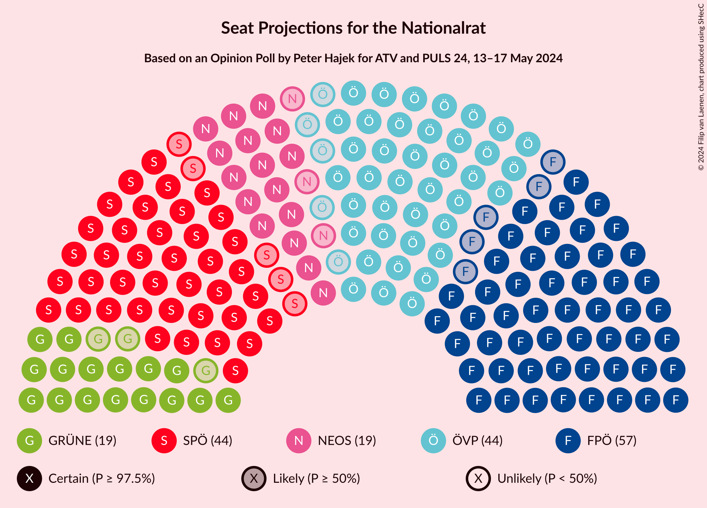

# Opinion Poll by Peter Hajek for ATV and PULS 24, 13–17 May 2024

<a href="#voting-intentions">Voting Intentions</a> | <a href="#seats">Seats</a> | <a href="#coalitions">Coalitions</a> | <a href="#technical-information">Technical Information</a>

## Voting Intentions

### Confidence Intervals

| Party | Last Result | Poll Result | 80% Confidence Interval | 90% Confidence Interval | 95% Confidence Interval | 99% Confidence Interval |
|:-----:|:-----------:|:-----------:|:-----------------------:|:-----------------------:|:-----------------------:|:-----------------------:|
| Freiheitliche Partei Österreichs | 16.2% | 30.0% | 28.3–31.7% |27.9–32.2% |27.5–32.7% |26.7–33.5% |
| Österreichische Volkspartei | 37.5% | 23.0% | 21.5–24.6% |21.1–25.1% |20.7–25.5% |20.0–26.3% |
| Sozialdemokratische Partei Österreichs | 21.2% | 23.0% | 21.5–24.6% |21.1–25.1% |20.7–25.5% |20.0–26.3% |
| NEOS–Das Neue Österreich und Liberales Forum | 8.1% | 10.0% | 9.0–11.2% |8.7–11.5% |8.4–11.8% |8.0–12.4% |
| Die Grünen–Die Grüne Alternative | 13.9% | 10.0% | 9.0–11.2% |8.7–11.5% |8.4–11.8% |8.0–12.4% |
| Kommunistische Partei Österreichs | N/A | 3.0% | 2.5–3.7% |2.3–3.9% |2.2–4.1% |1.9–4.5% |

*Note:* The poll result column reflects the actual value used in the calculations. Published results may vary slightly, and in addition be rounded to fewer digits.

## Seats

### Confidence Intervals

| Party | Last Result | Median | 80% Confidence Interval | 90% Confidence Interval | 95% Confidence Interval | 99% Confidence Interval |
|:-----:|:-----------:|:------:|:-----------------------:|:-----------------------:|:-----------------------:|:-----------------------:|
| <a href="#freiheitliche-partei-österreichs">Freiheitliche Partei Österreichs</a> | 31 | 57 | 54–61 |53–62 |52–62 |51–64 |
| <a href="#österreichische-volkspartei">Österreichische Volkspartei</a> | 71 | 44 | 41–47 |40–48 |39–48 |38–50 |
| <a href="#sozialdemokratische-partei-österreichs">Sozialdemokratische Partei Österreichs</a> | 40 | 44 | 41–47 |40–48 |39–48 |38–50 |
| <a href="#neos–das-neue-österreich-und-liberales-forum">NEOS–Das Neue Österreich und Liberales Forum</a> | 15 | 19 | 17–21 |16–22 |16–22 |15–23 |
| <a href="#die-grünen–die-grüne-alternative">Die Grünen–Die Grüne Alternative</a> | 26 | 19 | 17–21 |16–22 |16–22 |15–23 |
| <a href="#kommunistische-partei-österreichs">Kommunistische Partei Österreichs</a> | N/A | 0 | 0 |0 |0–7 |0–8 |

